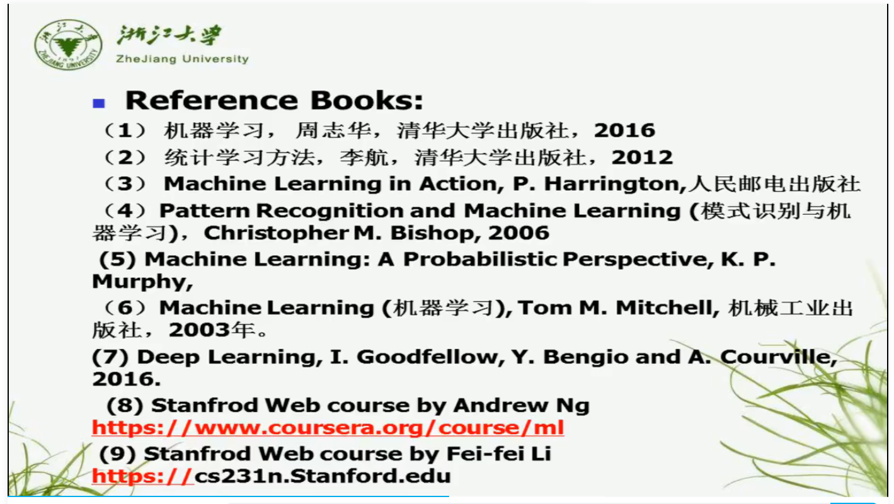

# AINotes

[(强推)浙江大学-机器学习](https://www.bilibili.com/video/BV1qf4y1x7kB/?spm_id_from=333.337.search-card.all.click&vd_source=5bc191bb37a56c995b0901fd3ad1baa5)

[【北京大学】人工智能实践-TensorFlow2.0笔记-曹健博士主讲](https://www.bilibili.com/video/BV1fY41137Wu/?spm_id_from=333.337.search-card.all.click&vd_source=5bc191bb37a56c995b0901fd3ad1baa5)

[【完整版】龙良曲PyTorch入门实战](https://www.bilibili.com/video/BV18a411U7aG/?vd_source=5bc191bb37a56c995b0901fd3ad1baa5)

8机器学习

9深度学习

