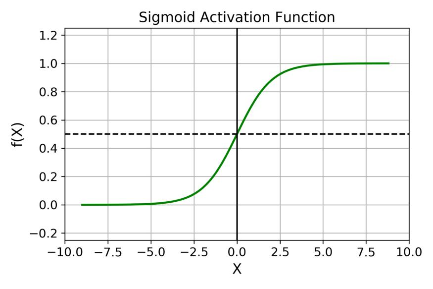

# PyTorchNotes

## 简单回归问题

- Linear Regression
  - 函数的取值范围是连续的
- Logistic Regression
  - 在线性回归上加了一个压缩函数，把函数值压缩在了0-1之间。
- Classification
  - 每个点的概率在0-1之间
  - 所有点的概率加起来等于1


## 张量数据类型

- tensor数据类型

|      python | PyTorch                                |
| ----------: | :------------------------------------- |
|         Int | IntTensor of size()                    |
|       float | FloatTensor of size() （DoubleTensor） |
|   Int array | IntTensor of size [d1, d2 ,…]          |
| Float array | FloatTensor of size [d1, d2, …]        |
|      string | --                                     |

> 默认类型：FloatTensor 
>
> 修改默认数据类型：`torch.set_default_tensor_type(torch.DoubleTensor)`

## tensor 常用API

- torch 创建tensor

  ```python
  torch.tensor() # 传入一个现有的数据/list
  
  torch.Tensor() # 传入一个shape
  torch.FloatTensor() # 同上
  ```

- torch 创建tensor - 2

  ```python
  # 均匀分布
  torch.rand()
  torch.rand_like()  # 传入一个张量，会按照张量的规则，生产一个均匀分布的tensor
  
  torch.randint(1,10,[3,3]) # (min, max, size) 
  # 
  
  # 正态分布
  torch.randn()
  ```

- 张量取数常用函数

  ```python
  a = torch.rand(4, 3, 28, 28)
  
  # tensor的大小
  a.shape
  a.size()
  
  # 冒号选取 [start: end)
  a[:2] # 0-1 (不包括下标2)
  a[0:6:2] # [0,2,4] (不包括下标6)
  # 冒号的四种用法
  # : 表示(全部)
  # :n n: 表示(0:n  n:end)
  # [start: end)
  # : : 2 以2为步长采样所有数据 [start: end: step]
  
  # index_select
  a.index_select() # 传入维度数
  
  # ... 任意长维度
  a[0, ..., ::2]
  
  # masked_select()
  x = torch.randn(3, 4)
  mask = x.ge(0.5) # 大于0.5的打码（true, false）
  torch.masked_select(x, mask) # 扁平化后取值
  
  # take() 扁平化后取值
  torch.take(src, torch.tensor([0, 2]))
  ```

- tensor维度变换

  ```python
  # view / reshape
  
  # squeeze / unsqueeze
  
  # transpos / t / permute
  
  # expand / repeat
  ```

- broadcast自动扩展

  ```python
  # expand
  
  # without copying data
  ```

- 拼接和拆分

  ```python
  #cat
  
  # stack
  
  # split
  
  # chunk
  ```

- 数学基本运算

  ```python 
  ```

  

- 统计属性

  ```python
  # norm
  
  # mean sum
  
  # prod 张量积
  
  # max, min, argmin, argmax
  
  # kthvalue, topk
  
  # dim keepdim 
  ```

- 高级操作

  ```python 
  # where
  torch.where(condition, x, y) # 满足条件取x，不满足条件取y的值
  
  # gather
  torch.gather(input, dim, index, out=None)
  ```

  

## 梯度

- 什么会影响优化？
  - 初始状态
  - 学习率 learning rate 
  -  局部最小值 escape minima - 逃出局部极小值


## 激活函数及其梯度

> 激活函数 - activation functions
>
> [深度学习领域最常用的10个激活函数，一文详解数学原理及优缺点 (thepaper.cn)](https://m.thepaper.cn/baijiahao_11444171)

-  Sigmoid 激活函数

  > `from torch.nn import functional as F`

  $$
  \sigma(x) = \frac{1}{1+e^{-x}}
  $$

  $$
  \sigma' = \sigma(1-\sigma)
  $$

   


- Tanh / 双曲正切激活函数

  > 

  $$
  tanh(x) = \frac{e^x-e^{-x}}{e^x+e^{-x}} = 2sigmoid(2x)-1
  $$

  $$
  \frac{d}{dx}tanh(x) = 1-tanh^2(x)
  $$

  


- ReLU 激活函数  (Rectified Linear Unit)

  > 非常适合做深度学习
  >
  > 优先使用ReLU激活函数

  $$
  f(x)=\left\{\begin{matrix}
   0 & for x < 0 \\
  1 & for x \ge 0
  \end{matrix}\right.
  $$


- Leaky ReLU
- ELU
- PReLU（Parametric ReLU）
- Softmax
- Swish
- Softplus


## Loss函数及其梯度


