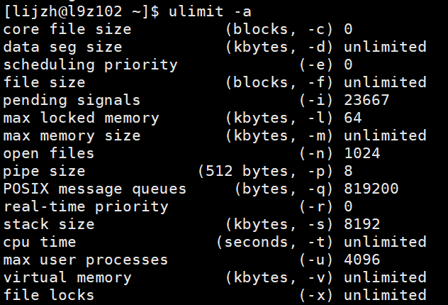
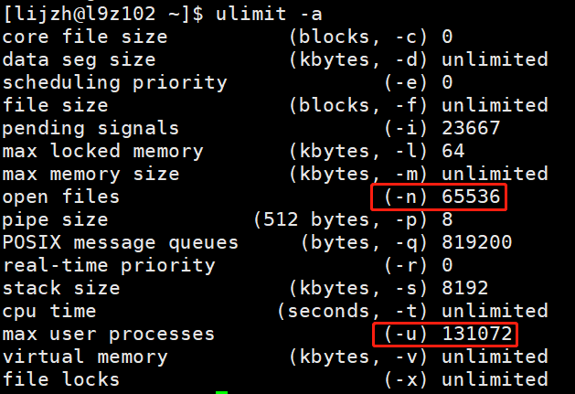

# ClickHouse Notes


## 第一章


## 第 2 章 ClickHouse 的安装  

### 2.1 准备工作  

- 确定防火墙处于关闭状态  

- CentOS 取消打开文件数限制

  - 在 hadoop102 的 /etc/security/limits.conf 文件的末尾加入以下内容  

  - 在 hadoop102 的/etc/security/limits.d/20-nproc.conf 文件的末尾加入以下内容  

    ```
    * soft nofile 65536
    * hard nofile 65536
    * soft nproc 131072
    * hard nproc 131072
    ```

    > 未修改前：`ulimit -a`
    >
    > 
    >
    > 修改后：`ulimit -a`
    >
    > 

  - 这里只改了102机器上的文件，同步一下：

    ```shell
    sudo /home/lijzh/bin/xsync /etc/security/limits.conf
    
    sudo /home/lijzh/bin/xsync /etc/security/limits.d/20-nproc.conf
    ```

- 安装依赖  

  ```shell
  sudo yum install -y libtool
  
  sudo yum install -y *unixODBC*
  
  # 在102，、103、104上，分别执行上述命令
  ```

- CentOS 取消 SELINUX  

  ```shell
  sudo vim /etc/selinux/config
  # 修改：
  SELINUX=disabled
  # 注意：别改错了
  
  # 分发
  sudo /home/lijzh/bin/xsync /etc/selinux/config
  ```

  > 注意：这个配置后，一定要重启服务器
  >
  > 查看是否配置成功：`getenforce`

### 2.2 单机安装  

> 官网：clickhouse.tech

> 才单机安装，集群安装的话
>
> - 将安装包发放到其他服务器
> - 安装命令安装
> - 修改配置文件 / 发放配置文件
> - 有个问题：什么是集群安装？怎么联系到一起去呢？


> clickhouse 版本
>
> 20.5：
>
> 20.6.3：支持explain
>
> 20.8：
>
> 这里安装的是21.7.3

- 安装命令

  ```shell
  [lijzh@l9z102 clickhouse]$ ll
  总用量 938164
  -rw-r--r-- 1 lijzh lijzh     78074 7月  27 2021 clickhouse-client-21.7.3.14-2.noarch.rpm
  -rw-r--r-- 1 lijzh lijzh 174283244 7月  27 2021 clickhouse-common-static-21.7.3.14-2.x86_64.rpm
  -rw-r--r-- 1 lijzh lijzh 786208040 7月  27 2021 clickhouse-common-static-dbg-21.7.3.14-2.x86_64.rpm
  -rw-r--r-- 1 lijzh lijzh    101969 7月  27 2021 clickhouse-server-21.7.3.14-2.noarch.rpm
  
  # 安装命令
  sudo rpm -ivh *.rpm
  
  # 检查是否安装成功
  rpm -qa|grep clickhouse
  
  [lijzh@l9z102 clickhouse]$ rpm -qa|grep clickhouse
  clickhouse-common-static-21.7.3.14-2.x86_64
  clickhouse-server-21.7.3.14-2.noarch
  clickhouse-common-static-dbg-21.7.3.14-2.x86_64
  clickhouse-client-21.7.3.14-2.noarch
  ```

  > <span style="color:blue; font-weight:bold">关于安装内容的备注：重要重要重要重要</span>
  >
  > tar.gz包，直接tar -zxvf解压到指定目录，即可安装成功
  >
  > rpm、yum 安装命令，安装之后，安装内容要去系统内容存放的地址去找
  >
  > - /ect/clickhouse-    (存放配置文件)
  > - /var/lib/clickhouse   (存放)
  > - /usr/bin、/usr/sbin、找不到加local

- 安装目录对应关系

  ```shell
  bin/      /usr/bin/
  conf/     /etc/clickhouse-server/   (这个比较重要)
  #  /etc/clickhouse-server/config.xml
  # 在这个文件中，有 ClickHouse 的一些默认路径配置，比较重要的
  # 数据文件路径： <path>/var/lib/clickhouse/</path>
  # 日志文件路径： <log>/var/log/clickhouse-server/clickhouse-server.log</log>
  
  lib/      /var/lib/clickhouse
  log/      /var/1og/clickhouse
  ```

- 修改配置文件 `root用户  cd /etc/clickhouse-server`

  ```shell
   >>> vim config.xml
   
   # 这里可以配置clickhouse的一些相关路径
  ```

- 启动服务

  ```shell
  ps -ef |grep mysql
  
  >>> sudo systemctl status clickhouse-server
  
  
  
  # 启动clickHouse 服务，官放提供方式
  sudo clickhouse start/stop/restart
  
  # 关闭开机自启动服务
  sudo systemctl disable clickhouse-server
  ```

- 连接clickhouse

  ```shell
  clickhouse-client --password li123... -m
  ```

  > `-m`：以`;`为结束符，可以随意换行

- 


