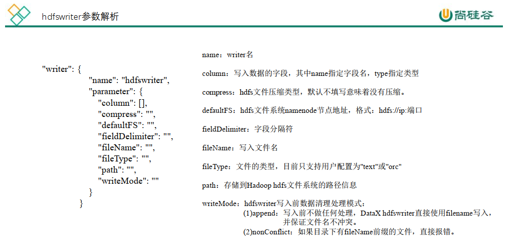

# DataXNotes

## 第1章 概述  

### 什么是 DataX  

​      DataX 是**阿里巴巴**开源的一个异构数据源<span style ="color:blue; font-Weight:bold">离线同步工具</span>，致力于实现包括关系型数据库(MySQL、 Oracle 等)、 HDFS、 Hive、 ODPS、 HBase、 FTP 等各种异构数据源之间稳定高效的数据同步功能。  

### DataX 的设计

​        为了解决异构数据源同步问题， DataX 将复杂的网状的同步链路变成了星型数据链路，DataX 作为中间传输载体负责连接各种数据源。当需要接入一个新的数据源的时候，只需要将此数据源对接到 DataX，便能跟已有的数据源做到无缝数据同步。  


### 支持的数据源

​        DataX 目前已经有了比较全面的插件体系，主流的 RDBMS 数据库、 NOSQL、大数据计算系统都已经接入。  


### 框架设计


### 运行原理


> 默认一个表切分一个task，
>
> 每个taskGroup的并发数是5，最多执行5个task

- 举例来说，用户提交了一个 DataX 作业，并且配置了 20 个并发，目的是将一个 100 张分表的 mysql 数据同步到 hdfs 里面。 DataX 的调度决策思路是：

  - 1） DataXJob 根据分库分表切分成了 100 个 Task。

  - 2） 根据 20 个并发， DataX 计算共需要分配 4 个 TaskGroup。（20/5=4）

  - 3） 4 个 TaskGroup 平分切分好的 100 个 Task，每一个 TaskGroup 负责以 5 个并发共计运行 25 个 Task。  

### 与 Sqoop 的对比  

|    功能    | DataX                            | Sqoop                        |
| :--------: | -------------------------------- | ---------------------------- |
|  运行模式  | 单进程多线程                     | MR                           |
| MySQL 读写 | 单机压力大； 读写粒度容易控制    | MR 模式重，写出错处理麻烦    |
| Hive 读写  | 单机压力大                       | 很好                         |
|  文件格式  | orc 支持                         | orc 不支持，可添加           |
|   分布式   | **不支持**，可以通过调度系统规避 | 支持                         |
|    流控    | 有流控功能                       | 需要定制                     |
|  统计信息  | 已有一些统计，上报需定制         | 没有，分布式的数据收集不方便 |
|  数据校验  | 在 core 部分有校验功能           | 没有，分布式的数据收集不方便 |
|    监控    | 需要定制                         | 需要定制                     |
|    社区    | 开源不久，社区不活跃             | 一直活跃，核心部分变动很少   |

## 第2章 快速入门  

### 官方地址  

- 下载地址： http://datax-opensource.oss-cn-hangzhou.aliyuncs.com/datax.tar.gz
- 源码地址： https://github.com/alibaba/DataX  

### 前置要求  

- Linux
- JDK(1.8 以上，推荐 1.8)
- Python(推荐 Python2.6.X)  

### 安装  

- 将下载好的 datax.tar.gz 上传到 hadoop102 的/opt/software

- 解压 datax.tar.gz 到/opt/module  

  ```shell
  tar -zxvf datax.tar.gz -C /opt/module/
  ```

- 运行自检脚本    -     <span style="color:blue; font-weight:bold">执行模板代码</span>

  ```shell
  python bin/datax.py ./job/job.json
  ```

## 第3章 使用案例

- `bin/datax.py -r streamreader -w streamwriter`  返回一个模板

### 从 stream 流读取数据并打印到控制台

- 创建`./job/stream2stream.json`文件

```json
{
    "job": {
        "content": [
            {
                "reader": {
                    "name": "streamreader", 
                    "parameter": {
                        "column": [
							{
								"type":"string",
								"value":"zhangsan"
							},
							{
								"type":"int",
								"value":18
							}
						], 
                        "sliceRecordCount": "10"
                    }
                }, 
                "writer": {
                    "name": "streamwriter", 
                    "parameter": {
                        "encoding": "UTF-8", 
                        "print": true
                    }
                }
            }
        ], 
        "setting": {
            "speed": {
                "channel": "1"
            }
        }
    }
}
```

### 读取 MySQL 中的数据存放到 HDFS

- 查看官方模板  

  ```shell
  python bin/datax.py -r mysqlreader -w hdfswriter
  ```

  ```json
  {
      "job": {
          "content": [
              {
                  "reader": {
                      "name": "mysqlreader", 
                      "parameter": {
                          "column": [], 
                          "connection": [
                              {
                                  "jdbcUrl": [], 
                                  "table": []
                              }
                          ], 
                          "password": "", 
                          "username": "", 
                          "where": ""
                      }
                  }, 
                  "writer": {
                      "name": "hdfswriter", 
                      "parameter": {
                          "column": [], 
                          "compress": "", 
                          "defaultFS": "", 
                          "fieldDelimiter": "", 
                          "fileName": "", 
                          "fileType": "", 
                          "path": "", 
                          "writeMode": ""
                      }
                  }
              }
          ], 
          "setting": {
              "speed": {
                  "channel": ""
              }
          }
      }
  }
  ```

- mysqlreader 参数解析：  


- hdfswriter 参数解析：  



- 准备数据  

  ```mysql
  mysql> create database datax;
  mysql> use datax;
  mysql> create table student(id int,name varchar(20));
  mysql> insert into student values(1001,'zhangsan'),(1002,'lisi'),(1003,'wangwu');
  ```

- 编写配置文件  -  `mysql2hdfs.json`

  ```jso
  {
      "job": {
          "content": [
              {
                  "reader": {
                      "name": "mysqlreader", 
                      "parameter": {
                          "column": [
  							"id",
  							"name"
  						], 
                          "connection": [
                              {
                                  "jdbcUrl": [
  									"jdbc:mysql://l9z102:3306/datax"
  								], 
                                  "table": [
  									"student"
  								]
                              }
                          ], 
                          "password": "li123...", 
                          "username": "root", 
                      }
                  }, 
                  "writer": {
                      "name": "hdfswriter", 
                      "parameter": {
                          "column": [
  							{
  								"name":"id",
  								"type":"int"
  							},
  							{
  								"name":"name",
  								"type":"string"
  							}
  						], 
                          "defaultFS": "hdfs://l9z102:8020", 
                          "fieldDelimiter": "|", 
                          "fileName": "student.txt", 
                          "fileType": "text", 
                          "path": "/datax/", 
                          "writeMode": "append"
                      }
                  }
              }
          ], 
          "setting": {
              "speed": {
                  "channel": ""
              }
          }
      }
  }
  ```

- 执行任务

  ```shell
  python /bin/datax.py ./job/mysql2hdfs.json
  ```

  ```shell
  # 下面是打印的日志———————————————————————————————————————————————————————————————————————————————————
  # 先创建了一个临时文件
  2023-01-04 15:56:23.279 [0-0-0-writer] INFO  HdfsWriter$Task - write to file : [hdfs://l9z102:8020/datax__510db9ab_af76_4445_a86a_c9a3b24f7ced/student.txt__199592e7_cf71_40d1_bbea_9b687f877a76]
  2023-01-04 15:56:23.454 [0-0-0-writer] INFO  HdfsWriter$Task - end do write
  2023-01-04 15:56:23.456 [taskGroup-0] INFO  TaskGroupContainer - taskGroup[0] taskId[0] is successed, used[203]ms
  2023-01-04 15:56:23.456 [taskGroup-0] INFO  TaskGroupContainer - taskGroup[0] completed it's tasks.
  2023-01-04 15:56:33.253 [job-0] INFO  StandAloneJobContainerCommunicator - Total 3 records, 30 bytes | Speed 3B/s, 0 records/s | Error 0 records, 0 bytes |  All Task WaitWriterTime 0.000s |  All Task WaitReaderTime 0.000s | Percentage 100.00%
  2023-01-04 15:56:33.254 [job-0] INFO  AbstractScheduler - Scheduler accomplished all tasks.
  2023-01-04 15:56:33.254 [job-0] INFO  JobContainer - DataX Writer.Job [hdfswriter] do post work.
  # 任务全部成功的话，修改文件名，路径
  2023-01-04 15:56:33.254 [job-0] INFO  HdfsWriter$Job - start rename file [hdfs://l9z102:8020/datax__510db9ab_af76_4445_a86a_c9a3b24f7ced/student.txt__199592e7_cf71_40d1_bbea_9b687f877a76] to file [hdfs://l9z102:8020/datax/student.txt__199592e7_cf71_40d1_bbea_9b687f877a76].
  2023-01-04 15:56:33.263 [job-0] INFO  HdfsWriter$Job - finish rename file [hdfs://l9z102:8020/datax__510db9ab_af76_4445_a86a_c9a3b24f7ced/student.txt__199592e7_cf71_40d1_bbea_9b687f877a76] to file [hdfs://l9z102:8020/datax/student.txt__199592e7_cf71_40d1_bbea_9b687f877a76].
  # 删除临时文件
  2023-01-04 15:56:33.264 [job-0] INFO  HdfsWriter$Job - start delete tmp dir [hdfs://l9z102:8020/datax__510db9ab_af76_4445_a86a_c9a3b24f7ced] .
  2023-01-04 15:56:33.272 [job-0] INFO  HdfsWriter$Job - finish delete tmp dir [hdfs://l9z102:8020/datax__510db9ab_af76_4445_a86a_c9a3b24f7ced] .
  2023-01-04 15:56:33.272 [job-0] INFO  JobContainer - DataX Reader.Job [mysqlreader] do post work.
  2023-01-04 15:56:33.272 [job-0] INFO  JobContainer - DataX jobId [0] completed successfully.
  ```

- 关于 HA 的支持  

  ```shell
  "hadoopConfig":{
      "dfs.nameservices": "ns",
      "dfs.ha.namenodes.ns": "nn1,nn2",
      "dfs.namenode.rpc-address.ns.nn1": "主机名:端口",
      "dfs.namenode.rpc-address.ns.nn2": "主机名:端口",
      "dfs.client.failover.proxy.provider.ns":
      "org.apache.hadoop.hdfs.server.namenode.ha.ConfiguredFailoverProxyProvider"
  }
  ```

### 读取 HDFS 数据写入 MySQL

- 将上个案例上传的文件改名

  ```shell
  hadoop fs -mv /datax/student.txt__199592e7_cf71_40d1_bbea_9b687f877a76 /datax/student.txt
  ```

- 查看官方模板

  ```shell
  bin/datax.py -r hdfsreader -w mysqlwriter
  ```

  ```json
  {
      "job": {
          "content": [
              {
                  "reader": {
                      "name": "hdfsreader", 
                      "parameter": {
                          "column": [], 
                          "defaultFS": "", 
                          "encoding": "UTF-8", 
                          "fieldDelimiter": ",", 
                          "fileType": "orc", 
                          "path": ""
                      }
                  }, 
                  "writer": {
                      "name": "mysqlwriter", 
                      "parameter": {
                          "column": [], 
                          "connection": [
                              {
                                  "jdbcUrl": "", 
                                  "table": []
                              }
                          ], 
                          "password": "", 
                          "preSql": [], 
                          "session": [], 
                          "username": "", 
                          "writeMode": ""
                      }
                  }
              }
          ], 
          "setting": {
              "speed": {
                  "channel": ""
              }
          }
      }
  }
  ```

- 创建配置文件  -  `hdfs2mysql.json`

  ```json
  
  {
      "job": {
          "content": [
              {
                  "reader": {
                      "name": "hdfsreader", 
                      "parameter": {
                          "column": ["*"], 
                          "defaultFS": "hdfs://l9z102:8020", 
                          "encoding": "UTF-8", 
                          "fieldDelimiter": "|", 
                          "fileType": "text", 
                          "path": "/datax/student.txt"
                      }
                  }, 
                  "writer": {
                      "name": "mysqlwriter", 
                      "parameter": {
                          "column": [
  							"id",
  							"name"
  						], 
                          "connection": [
                              {
                                  "jdbcUrl": "jdbc:mysql://l9z102:3306/datax", 
                                  "table": [
  									"student"
  								]
                              }
                          ], 
                          "password": "li123...", 
                          "username": "root", 
                          "writeMode": "insert"
                      }
                  }
              }
          ], 
          "setting": {
              "speed": {
                  "channel": "1"
              }
          }
      }
  }
  ```

- 执行任务  

  ```shell
  python bin/datax.py job/hdfs2mysql.json
  ```

- mysql 查看表student

  ```mysql
  select * from student;
  ```


##  DataX优化

### 速度控制

DataX3.0提供了包括通道(并发)、记录流、字节流三种流控模式，可以随意控制你的作业速度，让你的作业在数据库可以承受的范围内达到最佳的同步速度。

关键优化参数如下：

| **参数**                                | **说明**                                            |
| --------------------------------------- | --------------------------------------------------- |
| **job.setting.speed.channel**           | 并发数  (总并发，除以5得到taskGroup数量)            |
| **job.setting.speed.record**            | 总record限速   - tps(每秒处理多少条)                |
| **job.setting.speed.byte**              | 总byte限速   -  bps(每秒处理多少字节数)             |
| **core.transport.channel.speed.record** | 单个channel的record限速，默认值为10000（10000条/s） |
| **core.transport.channel.speed.byte**   | 单个channel的byte限速，默认值1024*1024（1M/s）      |

- **注意事项：**

  - 1.若配置了总record限速，则必须配置单个channel的record限速
  - 2.若配置了总byte限速，则必须配置单个channe的byte限速
  - 3.若配置了总record限速和总byte限速，channel并发数参数就会失效。因为配置了总record限速和总byte限速之后，实际channel并发数是通过计算得到的：
  - **计算公式为:**
    - min(总byte限速/单个channel的byte限速，总record限速/单个channel的record限速)

- **配置示例：**

  ```json
  {
      "core": {
          "transport": {
              "channel": {
                  "speed": {
                      "byte": 1048576 //单个channel byte限速1M/s
                  }
              }
          }
      },
      "job": {
          "setting": {
              "speed": {
                  "byte" : 5242880 //总byte限速5M/s
              }
          },
          ...
      }
  }
  ```

### 内存调整

当提升DataX Job内Channel并发数时，内存的占用会显著增加，因为DataX作为数据交换通道，在内存中会缓存较多的数据。例如Channel中会有一个Buffer，作为临时的数据交换的缓冲区，而在部分Reader和Writer的中，也会存在一些Buffer，为了防止OOM等错误，需调大JVM的堆内存。

建议将内存设置为4G或者8G，这个也可以根据实际情况来调整。

调整JVM xms xmx参数的两种方式：

- 一种是直接更改datax.py脚本；

- 另一种是在启动的时候，加上对应的参数，如下：

```java
python datax/bin/datax.py --jvm="-Xms8G -Xmx8G" /path/to/your/job.json
```

## 第4章 Oracle 数据库


## 第5章 MongoDB


## 第6章 SQLServer


## 第7章 DB


## 第8章 执行流程源码分析


## 第9章 DataX 使用优化


