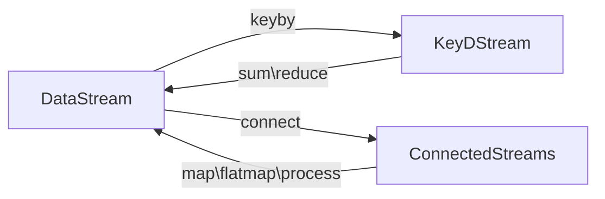

# Flink-Java 1.17


## DataStreamAPI


### 源算子


### 基本转换算子


### 聚合算子


### 分区


### 分流

- 用fliter多次处理，形成多个流
- 侧输出流

### 合流

- 联合：union
  - 流的类型一致
  - 一次可以联合多个流
- 连接：Connect
  - 流的类型可以不一致
  - 一次只能连接一个流
  
  > 如果是调用.map()就需要传入一个 CoMapFunction， 需要实现map1()、 map2()两个方法； 
  >
  > 而调用.process()时， 传入的则是一个 CoProcessFunction。
  >
  > 它也是“ 处理函数” 家族中的一员， 用法非常相似。 它需要实现的就是 processElement1()、processElement2()两个方法， 在每个数据到来时， 会根据来源的流调用其中的一个方法进行处理。

- 流的转换过程



- 案例需求： 连接两条流， 输出能根据 id 匹配上的数据（类似 inner join 效果）

  ```java
  ```

  

### Sink 

> 还没看


## 窗口


### 窗口的分类

- 按照驱动类型分
  - 时间窗口
  - 计数窗口
- 按照窗口分配数据的规则分类
  - 滚动
    - 基于时间的滚动窗口
  - 滑动
    - 窗口大小，滑动补长
  - 会话
  - 全局

