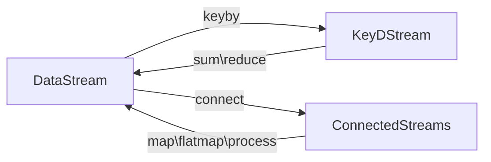
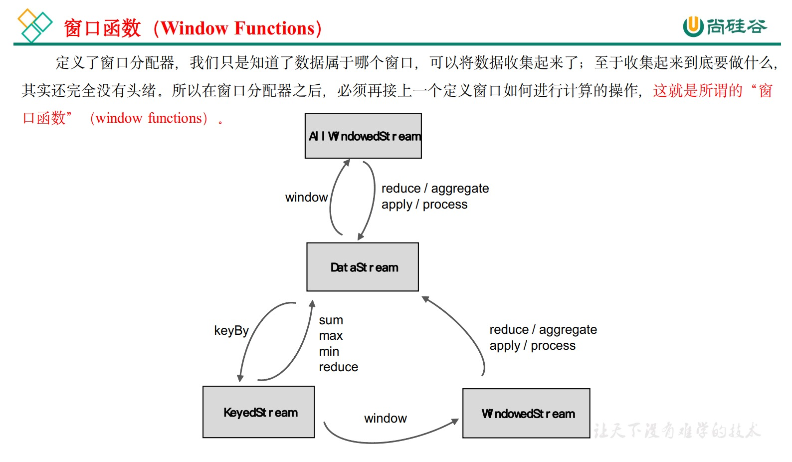

# Flink-Java 1.17


## DataStreamAPI


### 源算子


### 基本转换算子


### 聚合算子


### 分区


### 分流

- 用fliter多次处理，形成多个流
- 侧输出流

### 合流

- 联合：union
  - 流的类型一致
  - 一次可以联合多个流
- 连接：Connect
  - 流的类型可以不一致
  - 一次只能连接一个流
  
  > 如果是调用.map()就需要传入一个 CoMapFunction， 需要实现map1()、 map2()两个方法； 
  >
  > 而调用.process()时， 传入的则是一个 CoProcessFunction。
  >
  > 它也是“ 处理函数” 家族中的一员， 用法非常相似。 它需要实现的就是 processElement1()、processElement2()两个方法， 在每个数据到来时， 会根据来源的流调用其中的一个方法进行处理。

- 流的转换过程



- 案例需求： 连接两条流， 输出能根据 id 匹配上的数据（类似 inner join 效果）

  ```java
  ```

  

### Sink 

> 还没看


## 窗口

### 窗口的分类

- 按照驱动类型分
  - 时间窗口
  - 计数窗口
- 按照窗口分配数据的规则分类
  - 滚动 - Tumbling
    - 基于**时间**的滚动窗口:  sensorKS.window(TumblingProcessingTimeWindows.of(Time.seconds(10)));  // 滚动窗口，窗口长度10秒
  - 滑动:  (窗口大小，滑动步长) - Sliding
    - 基于**时间**的滑动窗口:  sensorKS.window(SlidingProcessingTimeWindows.of(Time.seconds(10), Time.seconds(5)));  //滑动窗口，长度10s，步长5s
    - 基于计数的滑动窗口:  sensorKS.countWindow(5, 2); //滑动窗口，窗口长度5条数据，滑动步长2条数据（每经过一个步长，都有一个窗口触发输出，每次输出5条数据，第一次输出在第2条数据来的时候）
  - 会话 session
    - 基于**时间**的会话窗口：sensorKS.window(ProcessingTimeSessionWindows.withGap(Time.seconds(5)));  //会话窗口，间隔5s
      - 中间多长时间(例如:5s)没有数据来，就把之前的数据看作一个窗口
      - 会话窗口还可以**动态获取**会话的时间间隔。
    - 基于计数的会话窗口：sensorKS.countWindow(5);   // 滚动窗口（会话窗口），窗口长度5条数据
  - 全局


### 窗口API

- 按键分区（Keyed）
  - 经过按键分区 keyBy 操作后， 数据流会按照 key 被分为多条逻辑流（logical streams），这就是 KeyedStream。 

- 非按键分区（Non-Keyed）
  - 

### 窗口适配器


### 窗口函数




- 增量聚合函数
  - ReduceFunction
    - sensorWS.reduce(  new ReduceFunction<T>()  )
  - AggregateFunction
    - sensorWS.aggregate(  new AggregateFunction<IN, ACC, OUT>()  )
- 全量聚合函数
  - ProcessWindowFunction
    - sensorWS.process(  new ProcessWindowFunction<IN, OUT, KEY, W extends Window>()  )

- 两者结合
  - Aggregate(  new AggregateFunction<IN, ACC, OUT>(),  new ProcessWindowFunction<IN, OUT, KEY, W extends Window>()  )

​						

> P71,P72 没有看

### 时间语义（P73）


事件时间，处理时间


interval join 只支持事件时间


### 水位线

> P74 - 


## FlinkSQL 


