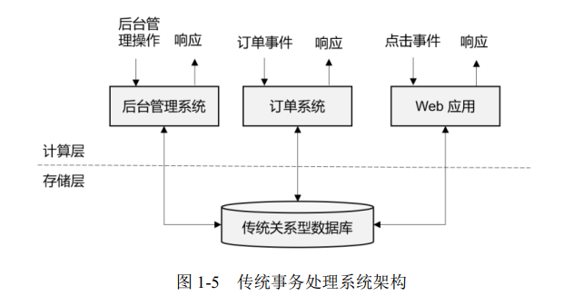
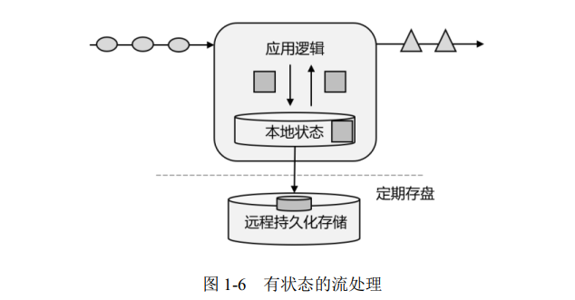
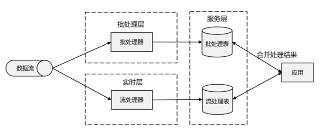
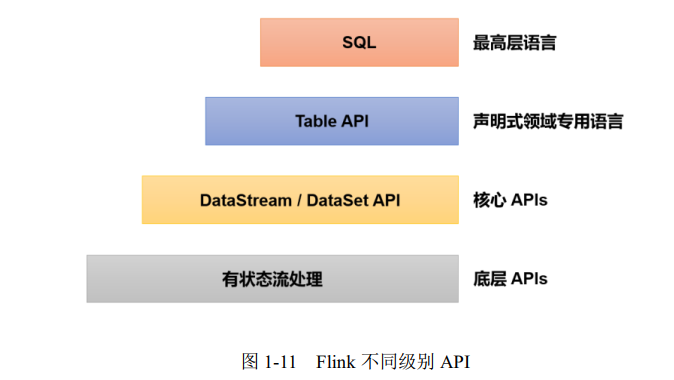
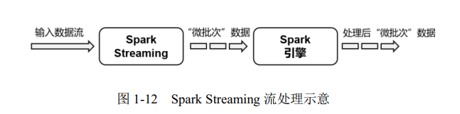
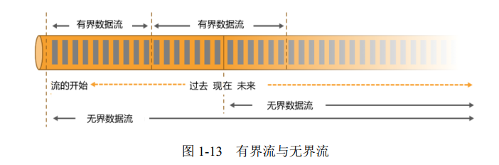

# FlinkNotes

## Remark

- Flink流处理，spark批处理。
  - 流处理：来一个处理一个。
  - 批处理：来了之后先攒着，等一批之后，一起处理。


## 第 1 章 初始Flink

- Flink 是一个框架和分布式处理引擎，用于对无界和有界<span style="color:blue; font-weight:bold">数据流</span>进行<span style="color:blue; font-weight:bold">状态</span>计算。
- [Flink官网](https://flink.apache.org/)
- 流处理和批处理  

  - 对于具体应用来说，有些场景数据是一个一个来的，是一组有序的数据序列，我们把它叫作“<span style="color:blue; font-weight:bold">数据流</span>”；而有些场景的数据，本身就是一批同时到来，是一个有限的数据集，这就是<span style="color:blue; font-weight:bold">批量数据</span>（有时也直接叫数据集）。  
  - 容易想到，处理数据流，当然应该“来一个就处理一个”，这种数据处理模式就叫作<span style="color:blue; font-weight:bold">流处理</span>；因为这种处理是即时的，所以也叫<span style="color:blue; font-weight:bold">实时处理</span>。与之对应，处理批量数据自然就应该一批读入、一起计算，这种方式就叫作<span style="color:blue; font-weight:bold">批处理</span>，也叫作<span style="color:blue; font-weight:bold">离线处理</span>。  

### 流式数据处理的发展和演变  

- 传统事务处理  -  OLTP

  

  - “计算层”就是应用程序本身，用于数据计算和处理。
  - “存储层”往往是传统的关系型数据库，用于数据存储。
  - 事务处理的方式能够保证实时响应，所以当数量规模大时，花费也大。

- 分析处理  -  OLAP
  - 数据量可以很大，离线处理。

- 有状态的流处理

  有状态的流处理架构上其实并不复杂，很多用户基于这种思想开发出了自己的流处理系统，这就是<span style="color:blue; font-weight:bold">第一代流处理器</span>。  

  

- lambda架构

   我们可以把Lambda架构认为是<span style="color:blue; font-weight:bold">第二代流处理架构</span>。但事实上，它只是第一代流处理器和批处理器的简单合并。  



- 新一代流处理器 - Flink

  1、link 是<span style="color:blue; font-weight:bold">第三代分布式流处理器</span>，它的功能丰富而强大，其核心特点：

  - 1、高吞吐、低延迟
  - 2、结果的准确性
  - 3、精确一次的状态一致性保证
  - 4、可以与众多常用存储系统连接
  - 5、高可用，支持动态拓展

  2、分层 API  

  - 越顶层越抽象，表达含义越简明，使用越方便
  - 月底层越具体，表达能力越丰富，使用越灵活

  

  > 核心API：DataStream流处理，DataSet批处理；DataSet已经用的很少了，1.12之后，Flink实现了批流统一，使用DataStream API就可以实现流处理，流批处理。

### Flink  AND  Spark

- 谈到大数据处理引擎，不能不提 Spark。  
  - Spark 还为批处理（SparkSQL）、流处理（Spark Streaming）、机器学习（Spark MLlib）、图计算（Spark GraphX）提供了统一的分布式数据处理平台，整个生态经过多年的蓬勃发展已经非常完善。  

- 数据处理的基本方式，可以分为<span style="color:red; font-weight:bold">批处理</span>和<span style="color:red; font-weight:bold">流处理</span>两种：批处理领域 Spark 称王，而在流处理方面 Flink 当仁不让。  
  - 批处理针对的是有界数据集，非常适合需要访问海量的全部数据才能完成的计算工作，一般用于离线统计。
  - 流处理主要针对的是数据流，特点是无界、实时, 对系统传输的每个数据依次执行操作，一般用于实时统计。  


- 从根本上说， Spark 和 Flink 采用了完全不同的数据处理方式。可以说，两者的世界观是截然相反的。  

  - Spark 以批处理为根本，并尝试在批处理之上支持流计算。在 Spark 的世界观中，万物皆批次，离线数据是一个大批次，而实时数据则是由一个一个无限的小批次组成的。所以对于流处理框架 Spark Streaming 而言，其实并不是真正意义上的“流”处理，而是“微批次”（micro-batching）处理：

  

  - 而 Flink 则认为，流处理才是最基本的操作，批处理也可以统一为流处理。在 Flink 的世界观中，万物皆流，实时数据是标准的、没有界限的流，而离线数据则是有界限的流。如下图所示，就是所谓的无界流和有界流。  

    

    - 无界数据流（Unbounded Data Stream）  

      对于无界数据流，必须连续处理，也就是说必须在获取数据后立即处理。在处理无界流时，为了保证结果的正确性，我们必须能够做到按照顺序处理数据。  

    - 有界数据流（Bounded Data Stream）  

      处理有界流就不需要严格保证数据的顺序了，因为总可以对有界数据集进行排序。有界流的处理也就是批处理。  

  > 正因为这种架构上的不同， Spark 和 Flink 在不同的应用领域上表现会有差别。一般来说，Spark 基于微批处理的方式做同步总有一个“攒批”的过程，所以会有额外开销，因此无法在流处理的低延迟上做到极致。在低延迟流处理场景， Flink 已经有明显的优势。而在海量数据的批处理领域， Spark 能够处理的吞吐量更大，加上其完善的生态和成熟易用的 API，目前同样优势比较明显。  

- 数据模型和运行架构  

  除了三观不合， Spark 和 Flink 在底层实现最主要的差别就在于数据模型不同。

  - Spark 底层数据模型是弹性分布式数据集（RDD）， Spark Streaming 进行微批处理的底层接口 DStream，实际上处理的也是一组组小批数据 RDD 的集合。可以看出， Spark 在设计上本身就是以批量的数据集作为基准的，更加适合<span style="color:blue; font-weight:bold">批处理的场景</span>。
  - 而 Flink 的基本数据模型是数据流（DataFlow），以及事件（Event）序列。 Flink 基本上是完全按照 Google 的 DataFlow 模型实现的，所以从底层数据模型上看， Flink 是以处理流式数据作为设计目标的，更加适合<span style="color:blue; font-weight:bold">流处理的场景</span>。
  - 数据模型不同，对应在运行处理的流程上，自然也会有不同的架构。 Spark 做<span style="color:blue; font-weight:bold">批计算</span>，需要将任务对应的 DAG 划分阶段(Stage),一个完成后经过 shuffle 再进行下一阶段的计算。而Flink 是<span style="color:blue; font-weight:bold">标准的流式执行模式</span>，一个事件在一个节点处理完后可以直接发往下一个节点进行处理。  

### Spark OR Flink

- Spark 和 Flink 可以说目前是各擅胜场，批处理领域 Spark 称王，而在流处理方面 Flink 当仁不让。具体到项目应用中，不仅要看是流处理还是批处理，还需要在延迟、吞吐量、可靠性，以及开发容易度等多个方面进行权衡。  

- 如果在工作中需要从 Spark 和 Flink 这两个主流框架中选择一个来进行实时流处理，我们更加推荐使用 Flink，主要的原因有：

  - Flink 的延迟是毫秒级别，而 Spark Streaming 的延迟是秒级延迟。
  - Flink 提供了严格的精确一次性语义保证。
  - Flink 的窗口 API 更加灵活、语义更丰富。
  - Flink 提供事件时间语义，可以正确处理延迟数据。
  - Flink 提供了更加灵活的对状态编程的 API。  

  基于以上特点，使用 Flink 可以解放程序员, 加快编程效率, 把本来需要程序员花大力气手动完成的工作交给框架完成。  

- 当然，在海量数据的批处理方面， Spark 还是具有明显的优势。而且 Spark 的生态更加成熟，也会使其在应用中更为方便。相信随着 Flink 的快速发展和完善，这方面的差距会越来越小。  

- 另外， Spark 2.0 之后新增的 Structured Streaming 流处理引擎借鉴 DataFlow 进行了大量优化，同样做到了低延迟、时间正确性以及精确一次性语义保证； Spark 2.3 以后引入的连续处理（Continuous Processing）模式，更是可以在至少一次语义保证下做到 1 毫秒的延迟。而 Flink自 1.9 版本合并 Blink 以来，在 SQL 的表达和批处理的能力上同样有了长足的进步。  

- 那如果现在要学习一门框架的话，优先选 Spark 还是 Flink 呢？其实我们可以看到，不同的框架各有利弊，同时它们也在互相借鉴、取长补短、不断发展，至于未来是 Spark 还是 Flink、甚至是其他新崛起的处理引擎一统江湖，都是有可能的。作为技术人员，我们应该对不同的架构和思想都有所了解，跳出某个框架的限制，才能看到更广阔的世界。到底 Spark 还是 Flink？

  —— 小孩子才做选择题！我都学-------------------------------------Spark，FlinkS

## 第 2 章 Flink 快速上手  

> Flink 底层是以 Java 编写的，并为开发人员同时提供了完整的 Java 和 Scala API。  

### 环境准备


### 创建项目  


### 编写代码  


## 第 3 章 Flink 部署

### 快速启动一个 Flink 集群

- 环境配置

- 本地启动

  - 下载安装包

  - 解压

  - 启动

    ```shell
    bin/start-cluster.sh
    ```

  - 访问Web UI

    ```
    l9z102:8081
    ```

  - 关闭集群

    ```shell
    bin/stop-cluster.sh
    ```

- 集群启动

  Flink 是典型的 Master-Slave 架构的分布式数据处理框架，其中 Master 角色对应着JobManager， Slave 角色则对应 TaskManager。  

  - 下载并解压安装包 

  - 修改集群配置

    - 进入 conf 目录下，修改 `flink-conf.yaml` 文件，修改 jobmanager.rpc.address 参数为l9z102，如下所示：

      ```shell
      # JobManager 节点地址.
      jobmanager.rpc.address: l9z102
      ```

      > 这就指定了 l9z102 节点服务器为 JobManager 节点。
      >
      > 另外，在 flink-conf.yaml 文件中还可以对集群中的 JobManager 和 TaskManager 组件进行优化配置，主要配置项如下：  
      >
      > - jobmanager.memory.process.size：对 JobManager 进程可使用到的全部内存进行配置，包括 JVM 元空间和其他开销，默认为 1600M，可以根据集群规模进行适当调整。  
      >
      > - taskmanager.memory.process.size：对 TaskManager进程可使用到的全部内存进行配置，包括 JVM 元空间和其他开销，默认为 1600M，可以根据集群规模进行适当调整。  
      >
      > - taskmanager.numberOfTaskSlots：对每个 TaskManager 能够分配的 slots 数量进行配置，默认为 1，可根据 TaskManager 所在的机器能够提供给 Flink 的 CPU 数量决定。所谓slots 就是 TaskManager 中具体运行一个任务所分配的计算资源。
      >
      > - parallelism.default：Flink 任务执行的默认并行度配置，优先级低于代码中进行的并行度配置和任务提交时使用参数进行的并行度数量配置
      >
      >   > 关于 slots 和并行度的概念，第四章有详细讲解。  

    - 修改 master 文件：**l9z102:8081**

    -  修改 workers 文件，将另外两台节点服务器添加为本 Flink 集群的 TaskManager 节点，具体修改如下： 

      ```shell
      $ vim workers
      l9z103
      l9z104
      ```

      > 这样就指定了 hadoop103 和 hadoop104 为 TaskManager 节点。  

  - 分发安装目录  

    配置修改完毕后，将 Flink 安装目录发给另外两个节点服务器。  (因为要搭建集群，所以必须分发)

    ```shell
    scp -r ./flink-1.13.0 atguigu@hadoop103:/opt/module
    
    # 也可以借助编写的脚本
    xsync ./flink-1.13.0
    ```

  - 启动集群

    - 在 l9z102 节点服务器上执行 start-cluster.sh 启动 Flink 集群：  

      ```shell
      $ bin/start-cluster.sh
      Starting cluster.
      Starting standalonesession daemon on host hadoop102.
      Starting taskexecutor daemon on host hadoop103.
      Starting taskexecutor daemon on host hadoop104.
      ```

  - 访问Web UI : l9z102:8081

- 向集群提交作业  

  - 程序打包 

    为方便自定义结构和定制依赖，我们可以引入插件 maven-assembly-plugin 进行打包。在 FlinkTutorial 项目的 pom.xml 文件中添加打包插件的配置，具体如下：  

    ```xml
    <build>
            <plugins>
                <plugin>
                    <groupId>org.apache.maven.plugins</groupId>
                    <artifactId>maven-assembly-plugin</artifactId>
                    <version>3.0.0</version>
                    <configuration>
                        <descriptorRefs>
                            <descriptorRef>jar-with-dependencies</descriptorRef>
                        </descriptorRefs>
                    </configuration>
    
                    <executions>
                        <execution>
                            <id>make-assembly</id>
                            <phase>package</phase>
                            <goals>
                                <goal>single</goal>
                            </goals>
                        </execution>
                    </executions>
                </plugin>
            </plugins>
        </build>
    ```

    > 插件配置完毕后，可以使用 IDEA 的 Maven 工具执行 package 命令。
    >
    > > 打包完成后，在 target 目录下即可找到所需 jar 包，jar包会有两个，
    > >
    > > FlinkTutorial-1.0-SNAPSHOT.jar 
    > >
    > > FlinkTutorial-1.0-SNAPSHOT-jar-with-dependencies.jar，
    > >
    > > 因为集群中已经具备任务运行所需的所有依赖，所以建议使用 FlinkTutorial-1.0-SNAPSHOT.jar。  

  - 在 Web UI 上提交作业  

  > <span style="color:blue; font-weight:bold">说明：</span>
  >
  > - UI界面中，几个worker，就会有几个可用的任务槽（Task Slots）
  >
  > - 并行度会控制一个任务，用几个worker/任务槽（Task Slots）计算
  >
  > 
  
  - 命令行提交作业

    - 首先需要启动集群

    - 在 l9z102 中执行以下命令启动 netcat
  
      ```shell
      nc -lk 7777
      ```
  
    - 进入到 Flink 的安装路径下，在命令行使用 flink run 命令提交作业。  
  
      ```shell
      # 独立 - 会话模式
      ./bin/flink run -m l9z102:8081 -c edu.lzu.flink.chapter02.WorkCount3 [-p 2] ./flink01-1.0-SNAPSHOT.jar --host l9z102 --port 7777
      ```
  
      > 这里的参数 –m 指定了提交到的 JobManager， -c 指定了入口类
      >
      > `--host l9z102 --port 7777` 是程序入口类需要的参数
  
    - 在浏览器中打开 Web UI，l9z102:8081 查看应用执行情况
  
      用 netcat 输入数据，可以在 TaskManager 的标准输出（Stdout）看到对应的统计结果  
  
    - 命令行查看/取消作业
  
    ```shell
    # 查看正在运行的作业
    ./bin/flink list
    
    # 查看所有作业
    ./bin/flink list -a
    
    # 取消作业
    ./bin/flink cancel 任务ID
    ```
  
    

### Flink的部署模式  

在一些应用场景中，对于集群资源分配和占用的方式，可能会有特定的需求。 Flink 为各种场景提供了不同的部署模式，主要有以下三种：

> - 会话模式（Session Mode）
> - 单作业模式（Per-Job Mode）
> - 应用模式（Application Mode）

它们的区别主要在于：**集群的生命周期、资源的分配方式**；以及应用的 main 方法到底在哪里执行——客户端（Client）还是 JobManager。

- 会话模式（Session Mode）
  - 会话模式其实最符合常规思维。我们需要先启动一个集群，保持一个会话，在这个会话中通过客户端提交作业。集群启动时所有资源就都已经确定，所以所有提交的作业会竞争集群中的资源。  
  - 会话模式比较适合于单个规模小、执行时间短的大量作业。 

- 单作业模式（Per-Job Mode）
  - 会话模式因为资源共享会导致很多问题，所以为了**更好地隔离资源**，我们可以考虑为每个提交的作业启动一个集群，这就是所谓的单作业模式。  
  - 需要注意的是，<span style = "color:blue; font-weight:bold"> Flink 本身无法直接这样运行，所以单作业模式一般需要借助一些资源管理平台来启动集群，比如 YARN、 Kubernetes。  </span>

- 应用模式（Application Mode）

  - 前面提到的两种模式下，应用代码都是在客户端上执行，然后由客户端提交给 JobManager的。但是这种方式客户端需要占用大量网络带宽，去下载依赖和把二进制数据发送给JobManager；加上很多情况下我们提交作业用的是同一个客户端，就会加重客户端所在节点的资源消耗。
  - 所以解决办法就是，我们不要客户端，直接把应用提交到JobManger上运行。而这也代表着，我们需要为每一个提交的应用单独启动一个JobManager，也就是创建一个集群。这个 JobManager 只为执行这一个应用而存在，执行结束之后 JobManager 也就关闭了，这就是所谓的应用模式，

  - <span style = "color:blue; font-weight:bold"> 应用模式与单作业模式，都是提交作业之后才创建集群；</span>
    - 单作业模式是通过客户端来提交的，客户端解析出的每一个作业对应一个集群；
    - 而应用模式下，是直接由 JobManager 执行应用程序的，并且即使应用包含了多个作业，也只创建一个集群。  


### 独立模式（Standalone）


### Yarn 模式


```shell
# yarn - 会话模式
# 提交作业
./bin/flink run -c edu.lzu.flink.chapter02.WorkCount3 ./flink01-1.0-SNAPSHOT.jar --host l9z102 --port 7777
```


### K8S 模式


## 第 4 章 Flink 运行时架构  


## 第 5 章 DataStream API（基础篇）  

一个 Flink 程序，其实就是对 DataStream 的各种转换。具体来说，代码基本上都由以下几部分构成：

- 获取执行环境（Execution Environment）
- 读取数据源（Source）
- 定义基于数据的转换操作（Transformations）
- 定义计算结果的输出位置（Sink）
- 触发程序执行（Execute）

其中，获取环境和触发执行，都可以认为是针对执行环境的操作。所以本章我们就从执行环境、数据源（source）、转换操作（Transformation）、输出（Sink）四大部分，对常用的 DataStreamAPI 做基本介绍。  

### 执行环境（Execution Environment）  

#### 创建执行环境  

#### 执行模式(Execution Mode)  

在之前的 Flink 版本中，批处理的执行环境与流处理类似，是调用类 ExecutionEnvironment的静态方法，并返回它的对象：  

```java
// 批处理环境
val batchEnv = ExecutionEnvironment.getExecutionEnvironment
// 流处理环境
val env = StreamExecutionEnvironment.getExecutionEnvironment
```

基于 `ExecutionEnvironment` 读入数据创建的数据集合，就是 `DataSet`；对应的调用的一整套转换方法，就是 `DataSet API`。

而从 1.12.0 版本起， Flink 实现了 API 上的`流批统一`。 DataStream API 新增了一个重要特性：可以支持不同的“执行模式”（execution mode），通过简单的设置就可以让一段 Flink 程序在流处理和批处理之间切换。这样一来， DataSet API 也就没有存在的必要了。  

- 流执行模式（STREAMING）  
- 批执行模式（BATCH）  
- 批执行模式（BATCH）  

<span style = "color:blue; font-weight:bold">`val env = StreamExecutionEnvironment.getExecutionEnvironment`</span>，<span style = "color:red; font-weight:bold">由于 Flink 程序默认是 STREAMING 模式</span>，我们这里重点介绍一下 BATCH 模式的配置。主要有两种方式：

```shell
# （1）通过命令行配置 批处理  -  推荐
bin/flink run -Dexecution.runtime-mode=BATCH ...
# 在提交作业时，增加 execution.runtime-mode 参数，指定值为 BATCH。


# （2） 通过代码配置 批处理   -  不推荐
val env = StreamExecutionEnvironment.getExecutionEnvironment
env.setRuntimeMode(RuntimeExecutionMode.BATCH)  
# 在代码中，直接基于执行环境调用 setRuntimeMode 方法，传入 BATCH 模式  
```


### 源算子（Source）  

#### 读取有界


#### 读取Kafka


#### 读取自定义数据源

#### Flink 支持的数据类型  


## 第 6 章 Flink 中的时间和窗口  


## 第7 章 处理函数  


## 第 8 章 多流转换  


## 第 9 章 状态编程  


## 第 10 章 容错机制


## 第 11 章 Table API 和 SQL 


##  第 12 章 Flink CEP  


