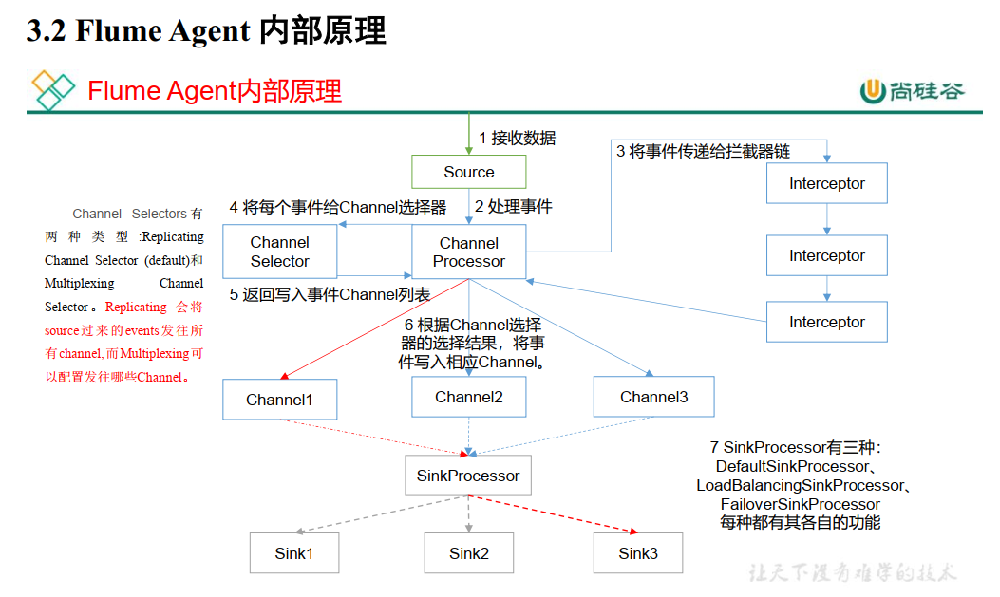

# FlumeNotes

## Remark

- 拦截器要和head结合使用
  - Event：包括 header  body
- 只有有source 才能自定义拦截器
- `bin/flume-ng agent -n a1 -c conf/ -f job/dianshang5/kafka_to_hdfs_log.conf -Dflume.root.logger=info,console`


## Flume 概述

### Flume 定义

- Flume 是 Cloudera 提供的一个高可用的，高可靠的，分布式的<span style="color:blue; font-weight:bold">海量日志</span>采集、聚合和传输的系统。 Flume 基于流式架构，灵活简单。  （实时采集）


### Flume 基础架构


- Agent ：
  - Agent 是一个 JVM 进程，它以事件的形式将数据从源头送至目的。
  - Agent 主要有 3 个部分组成， Source、 Channel、 Sink。  

- Source ：
  - Source 是负责接收数据到 Flume Agent 的组件。 Source 组件可以处理各种类型、各种格式的日志数据，
  - 包括<span style="color:blue; font-weight:bold">avro</span>、thrift、<span style="color:blue; font-weight:bold">exec</span>、jms、<span style="color:blue; font-weight:bold">spooling directory</span>、<span style="color:blue; font-weight:bold">netcat</span>、<span style="color:red; font-weight:bold">taildir</span>、sequence generator、syslog、http、legacy、自定义。

  > avro ：
  >
  > netcat ：监听控制台
  >
  > exec ：监控单个文件的追加  -  不支持断点续传
  >
  > spooling directory ：监控一个目录中增加新文件
  >
  > taildir ：监控多个文件的追加

- Sink ：
  - Sink 不断地轮询 Channel 中的事件且批量地移除它们，并将这些事件批量写入到存储或索引系统、或者被发送到另一个 Flume Agent。
  - Sink 组件目的地包括<span style="color:red; font-weight:bold">hdfs</span>、<span style="color:blue; font-weight:bold">logger</span>、<span style="color:blue; font-weight:bold">avro</span>、thrift、ipc、<span style="color:blue; font-weight:bold">file</span>、HBase、solr、自定义。  

  > avro ：
  >
  > hdfs ：写到hdfs
  >
  > logger ：写到控制台
  >
  > file ：写到文件

- Channel ：
  - Channel 是位于 Source 和 Sink 之间的缓冲区。因此， Channel 允许 Source 和 Sink 运作在不同的速率上。 
  - Channel 是线程安全的，可以<span style="color:blue; font-weight:bold">同时处理几个 Source 的写入操作和几个Sink 的读取操作</span>。
  - Flume 自带(主要)两种 Channel： Memory Channel 和 File Channel。（还有一个：kafka)
    - Memory Channel 是内存中的队列。 Memory Channel 在不需要关心数据丢失的情景下适用。如果需要关心数据丢失，那么 Memory Channel 就不应该使用，因为程序死亡、机器宕机或者重启都会<span style="color:blue; font-weight:bold">导致数据丢失</span>。
    - File Channel 将所有事件写到磁盘。因此在程序关闭或机器宕机的情况下<span style="color:blue; font-weight:bold">不会丢失数据</span>。  

- Event ：

  - 传输单元， Flume 数据传输的基本单元，以 Event 的形式将数据从源头送至目的地。Event 由 Header 和 Body 两部分组成， Header 用来存放该 event 的一些属性，为 K-V 结构，Body 用来存放该条数据，形式为字节数组。  

    | Header(k=v) | Body(byte array) |
    | :---------: | :--------------: |

## Flume 入门

### Flume 安装部署

- 安装地址  
  - [Flume 官网地址](http://flume.apache.org/)
  - 文档查看地址： http://flume.apache.org/FlumeUserGuide.html
  - 下载地址： http://archive.apache.org/dist/flume/  

- 安装部署  
  - 安装添加环境变量（java，hadoop - 先前已安装配置)
  
  - 解压apache-flume-1.9.0-bin.tar.gz 到 /opt/module/目录下
  
  - 将lib文件夹下的`guava-11.0.2.jar` 删除，以兼容 Hadoop 3.1.3 
    - `rm /opt/module/flume/lib/guava-11.0.2.jar`
  
  - 修改配置文件  -  conf/
  
    - `mv flume-env.sh.template flume-env.sh`
  
      ```sh
      # Give Flume more memory and pre-allocate, enable remote monitoring via JMX
      # 把下面一行放开
      # export JAVA_OPTS="-Xms100m -Xmx2000m -Dcom.sun.management.jmxremote"
      export JAVA_OPTS="-Xms100m -Xmx2000m -Dcom.sun.management.jmxremote"
      ```

### Flume 入门案例

#### 监控端口数据官方案例

- 案例需求：使用 Flume 监听一个端口， 收集该端口数据，并打印到控制台。  

- 配置文件

  ```shell
  # Name the components on this agent
  a1.sources = r1
  a1.sinks = k1
  a1.channels = c1
  
  # Describe/configure the source
  a1.sources.r1.type = netcat
  a1.sources.r1.bind = localhost
  a1.sources.r1.port = 44444
  
  # Describe the sink
  a1.sinks.k1.type = logger
  
  # Use a channel which buffers events in memory
  a1.channels.c1.type = memory
  a1.channels.c1.capacity = 1000
  a1.channels.c1.transactionCapacity = 100
  
  # Bind the source and sink to the channel
  a1.sources.r1.channels = c1
  a1.sinks.k1.channel = c1
  ```

  

```shell
sudo yum install -y nc  # 安装netcat
# netcat 演示、可以通信
nc -lk 9999
nc localhost 9999
```

#### 实时监控单个追加文件  

- 案例需求：实时监控 Hive 日志，并上传到 HDFS 中  

- 需求分析：  

  

- 配置文件  -  flume-file-hdfs.conf 

  ```shell
  # Name the components on this agent
  a1.sources = r1
  a1.sinks = k1
  a1.channels = c1
  
  # Describe/configure the source  -  (Exec Source)
  a1.sources.r1.type = exec   # 不支持断点续传
  a1.sources.r1.command = tail -F /opt/module/hive-3.1.2/logs/hive.log   # 注意路径
  # -f & -F 区别：
  # -f 文件覆盖时，会断，停止监控；-F 不会断
  
  # Use a channel which buffers events in memory
  a1.channels.c1.type = memory
  a1.channels.c1.capacity = 1000
  a1.channels.c1.transactionCapacity = 100
  
  # Describe the sink
  a1.sinks.k1.type = hdfs  
  a1.sinks.k1.hdfs.path = hdfs://l9z102:8020/flume/%Y%m%d/%H
  # 8020 ：HDFS内部通讯端口
  
  #是否使用本地时间戳（如果使用了%Y%m%d/%H，必须设置true）
  a1.sinks.k1.hdfs.useLocalTimeStamp = true
  
  #上传文件的前缀
  a1.sinks.k1.hdfs.filePrefix = logs-
  
  #是否按照时间滚动文件夹
  a1.sinks.k1.hdfs.round = true
  #多少时间单位创建一个新的文件夹
  a1.sinks.k1.hdfs.roundValue = 1
  #重新定义时间单位
  a1.sinks.k1.hdfs.roundUnit = hour   # 一个小时创建一个新的文件夹
  
  #积攒多少个 Event 才 flush 到 HDFS 一次
  a1.sinks.k1.hdfs.batchSize = 100
  #设置文件类型，可支持压缩
  a1.sinks.k1.hdfs.fileType = DataStream
  
  #多久生成一个新的文件（单位是s）
  a1.sinks.k1.hdfs.rollInterval = 30    # 可以配置0，就是与时间无关
  #设置每个文件的滚动大小
  a1.sinks.k1.hdfs.rollSize = 134217700 # 可以配置0，就是与文件大小无关
  #文件的滚动与 Event 数量无关
  a1.sinks.k1.hdfs.rollCount = 0        # 满足任意一个，都会创建新文件
  
  # Bind the source and sink to the channel
  a1.sources.r1.channels = c1
  a1.sinks.k1.channel = c1
  ```

- 启动flume命令：

  ```
  bin/flume-ng agent -n a1 -c conf/ -f job/flume-file-hdfs.conf 
  ```

  > Flume 要想将数据输出到 HDFS， 依赖 Hadoop 相关 jar 包  

#### 实时监控目录下多个新文件

- 案例需求：使用 Flume 监听整个目录的文件，并上传至 HDFS

- 需求分析：  

  

- 配置文件  -  flume-dir-hdfs.conf  

  ```shell
  # Name the components on this agent
  a3.sources = r3
  a3.sinks = k3
  a3.channels = c3
  
  # Describe/configure the source - (Spooling Directory Source)
  a3.sources.r3.type = spooldir
  a3.sources.r3.spoolDir = /opt/module/flume-1.9.0/upload
  a3.sources.r3.fileSuffix = .COMPLETED
  a3.sources.r3.fileHeader = true
  #忽略所有以.tmp 结尾的文件，不上传
  a3.sources.r3.ignorePattern = ([^ ]*\.tmp)
  # a3.sources.r3.includePattern
  
  # Describe the sink
  a3.sinks.k3.type = hdfs
  a3.sinks.k3.hdfs.path =hdfs://l9z102:8020/flume/upload/%Y%m%d/%H
  
  #是否使用本地时间戳
  a3.sinks.k3.hdfs.useLocalTimeStamp = true
  #上传文件的前缀
  a3.sinks.k3.hdfs.filePrefix = upload-
  
  #是否按照时间滚动文件夹
  a3.sinks.k3.hdfs.round = true
  #多少时间单位创建一个新的文件夹
  a3.sinks.k3.hdfs.roundValue = 1
  #重新定义时间单位
  a3.sinks.k3.hdfs.roundUnit = hour
  
  #积攒多少个 Event 才 flush 到 HDFS 一次
  a3.sinks.k3.hdfs.batchSize = 100
  #设置文件类型，可支持压缩
  a3.sinks.k3.hdfs.fileType = DataStream
  
  #多久生成一个新的文件，单位是s(实际开发的时候，不会这么短时间)
  a3.sinks.k3.hdfs.rollInterval = 60
  #设置每个文件的滚动大小大概是 128M
  a3.sinks.k3.hdfs.rollSize = 134217700
  #文件的滚动与 Event 数量无关
  a3.sinks.k3.hdfs.rollCount = 0
  
  # Use a channel which buffers events in memory
  a3.channels.c3.type = memory
  a3.channels.c3.capacity = 1000
  a3.channels.c3.transactionCapacity = 100
  
  # Bind the source and sink to the channel
  a3.sources.r3.channels = c3
  a3.sinks.k3.channel = c3
  
  ```

  > 该方法，只能监测目录下的整个文件，一把文件保存(移动)到监测目录，就会被打上标记，文件不能更新。
  >
  > a3.sinks.k3.hdfs.rollInterval = 60 ：60秒内更新的信息，放在hdfs中的一个文件内。
  >
  > a3.sources.r3.spoolDir = /opt/module/flume-1.9.0/upload
  >
  > > 对于监测的目录，如果放进去和之前重复的目录，则会断开flume监测。
  > >
  > > 断开之后，需要重新启动flume（重启前一定要删除相同名字的文件，否则启不来）。


#### 实时监控目录下的多个追加文件

Exec Source 适用于监控一个实时追加的文件，不能实现断点续传； 

Spooling Directory Source适合用于同步新文件，但不适合对实时追加日志的文件进行监听并同步；

而<span style="color:blue; font-weight:bold">Taildir Source</span>适合用于监听多个实时追加的文件，并且能够实现断点续传。  

- 案例需求：使用 Flume 监听整个目录的实时追加文件，并上传至 HDFS

- 需求分析：

  

- 配置文件  -  flume-taildir-hdfs.conf  

  ```shell
  # Name the components on this agent
  a3.sources = r3
  a3.sinks = k3
  a3.channels = c3
  
  # Describe/configure the source
  a3.sources.r3.type = TAILDIR   # 支持动态监控
  # 能保证断点续传，打标记。 保存在positionFile文件中
  a3.sources.r3.positionFile = /opt/module/flume-1.9.0/tail_dir.json
  a3.sources.r3.filegroups = f1 f2
  a3.sources.r3.filegroups.f1 = /opt/module/flume-1.9.0/files/.*file.*
  a3.sources.r3.filegroups.f2 = /opt/module/flume-1.9.0/files2/.*log.*
  
  # Use a channel which buffers events in memory
  a3.channels.c3.type = memory
  a3.channels.c3.capacity = 1000
  a3.channels.c3.transactionCapacity = 100
  
  # Describe the sink
  a3.sinks.k3.type = hdfs
  a3.sinks.k3.hdfs.path =hdfs://l9z102:8020/flume/upload2/%Y%m%d/%H
  
  
  #是否使用本地时间戳
  a3.sinks.k3.hdfs.useLocalTimeStamp = true
  
  #上传文件的前缀
  a3.sinks.k3.hdfs.filePrefix = upload
  
  # 下面三个配置控制是否生成新的文件夹，以及多长时间生成一个
  #是否按照时间滚动文件夹
  a3.sinks.k3.hdfs.round = true
  #多少时间单位创建一个新的文件夹
  # roundValue 和 roundUnit 连用，表示1h生成一个新的文件夹
  a3.sinks.k3.hdfs.roundValue = 1
  #重新定义时间单位
  a3.sinks.k3.hdfs.roundUnit = hour
  
  #积攒多少个 Event 才 flush 到 HDFS 一次
  a3.sinks.k3.hdfs.batchSize = 100
  #设置文件类型，可支持压缩
  a3.sinks.k3.hdfs.fileType = DataStream
  
  # 以下三个配置控制是否生成新文件，三个满足任一个都会生成新文件，配置为0说明与是否生成新文件无关
  #多久生成一个新的文件
  a3.sinks.k3.hdfs.rollInterval = 60
  #设置每个文件的滚动大小大概是 128M
  a3.sinks.k3.hdfs.rollSize = 134217700
  #文件的滚动与 Event 数量无关
  a3.sinks.k3.hdfs.rollCount = 0
  
  
  # Bind the source and sink to the channel
  a3.sources.r3.channels = c3
  a3.sinks.k3.channel = c3
  ```

  > echo >> 文件名 ：向文件中追加内容。
  >
  > 该方法可以监测多个文件的更新。但有一点问题，如下：
  >
  > tail_dir.json 记录了 上次监控的位置信息
  >
  > 保证断点续传，打标记。 保存在positionFile = tail_dir.json文件中
  >
  > > 分析：/opt/module/flume-1.9.0/tail_dir.json
  > >
  > > {
  > >
  > > ​      "inode":34774845,
  > >
  > > ​      "pos":27,
  > >
  > > ​      "file":"/opt/module/flume-1.9.0/files/file1.txt"
  > >
  > > },
  > >
  > > {
  > >
  > > ​      "inode":71612092,
  > >
  > > ​      "pos" :15,
  > >
  > > ​      "file":"/opt/module/flume-1.9.0/files2/log1.txt"
  > >
  > > }
  > >
  > > 其中 "inode"是文件标识(更新文件，文件重命名等不会改名文件标识，除非删了重建)， 
  > >
  > > ​         "pos"是文件中的字节数，
  > >
  > > ​         "file"文件的绝对路径。
  > >
  > > 值得说明的是：在flume中，默认以 "inode"和"file"为联合主键，确定一个文件。也就是说，二者只要有一个改名，flume监测时都会重新监测到上传hdfs。
  > >
  > > 这也是Taildir Source中最严重的问题，
  > >
  > > 解决方案：可以通过修改源码，解决上述Taildir Source中出现的问题。- P14 修改源码

### 三大组件总结

- source
  - netcat
  - exec  ：实时监控文件，但不支持断点续传，一般不用
  - spooling ：支持断点续传，监控文件夹（对监控之后的文件追加的信息，监控不到；只能监控丢进某个文件夹的整个文件信息），时效性不高
  - <span style="color:blue; font-weight:bold">taildir</span> ：实时读取文件的数据，支持断点续传
  - <span style="color:blue; font-weight:bold">avro</span> ：拓扑结构中使用
  - <span style="color:blue; font-weight:bold">kafka source</span>
- channel
  - file ：基于磁盘，比较慢（优化：索引机制，索引存在内存中，怕丢失，可以在磁盘中备份索引）
  - memory ：基于内存，比较快，但容易丢失
  - <span style="color:blue; font-weight:bold">kafka channel</span>
- sink0
  - <span style="color:blue; font-weight:bold">hdfs sink</span>
  - <span style="color:blue; font-weight:bold">kafka sink</span>
  - <span style="color:blue; font-weight:bold">arvro</span>

### Kafka三大组件

- <span style="color:blue; font-weight:bold">kafka source</span>
  
  - Kafka Source is an Apache Kafka consumer（从kafka主题中读数据）
- <span style="color:blue; font-weight:bold">kafka sink</span>
  - This is a Flume Sink implementation that can publish data to a Kafka topic.（其实就是kafka的生产者的实现）

- <span style="color:blue; font-weight:bold">kafka channel</span>

  - 数据存在kafka的集群中

  - The Kafka channel can be used for multiple scenarios:

    - With Flume source and sink - it provides a reliable and highly available channel for events

    - 使用Flume源和接收器-它为事件提供了可靠且高可用的通道

      

    - With Flume source and interceptor **but no sink** - it allows writing Flume events into a Kafka topic, for use by other apps

    - 有Flume source 和interceptor，但没有sink -它允许将Flume事件写入Kafka主题，供其他应用程序使用

      
    
    - With Flume sink, **but no source** - it is a low-latency, fault tolerant way to send events from Kafka to Flume sinks such as HDFS, HBase or Solr
    
    - 使用Flume sink，但没有 source - 这是一种低延迟，容错的方式，将事件从Kafka发送到Flume接收器，如HDFS, HBase或Solr
    
      

### HDFS sink

| Name                   | Default      | Desciption                                                   |
| ---------------------- | ------------ | ------------------------------------------------------------ |
| **channel**            | –            |                                                              |
| **type**               | –            | The component type name, needs to be `hdfs`                  |
| **hdfs.path**          | –            | HDFS directory path (eg hdfs://namenode/flume/webdata/)      |
| hdfs.filePrefix        | FlumeData    | Name prefixed to files created by Flume in hdfs directory<br><span style="color:blue; font-weight:bold">Flume在hdfs 目录中创建的文件的前缀名称</span> |
| hdfs.fileSuffix        | –            | Suffix to append to file (eg `.avro` - *NOTE: period is not automatically added*) |
| hdfs.inUsePrefix       | –            | Prefix that is used for temporal files that flume actively writes into |
| hdfs.inUseSuffix       | `.tmp`       | Suffix that is used for temporal files that flume actively writes into |
| hdfs.emptyInUseSuffix  | false        | If `false` an `hdfs.inUseSuffix` is used while writing the output. After closing the output `hdfs.inUseSuffix` is removed from the output file name. If `true` the `hdfs.inUseSuffix` parameter is ignored an empty string is used instead. |
| hdfs.rollInterval      | 30           | Number of seconds to wait before rolling current file (0 = never roll based on time interval)<br><span style="color:blue; font-weight:bold">多久生成一个新的文件（单位是s），配置为0说明与是否生成新文件无关</span> |
| hdfs.rollSize          | 1024         | File size to trigger roll, in bytes (0: never roll based on file size)<br><span style="color:blue; font-weight:bold">设置每个文件的滚动大小(单位是字节)，配置为0说明与是否生成新文件无关</span> |
| hdfs.rollCount         | 10           | Number of events written to file before it rolled (0 = never roll based on number of events)<br/><span style="color:blue; font-weight:bold">设置多少个Event后滚动文件，配置为0说明与是否生成新文件无关</span> |
| hdfs.idleTimeout       | 0            | Timeout after which inactive files get closed (0 = disable automatic closing of idle files) |
| hdfs.batchSize         | 100          | number of events written to file before it is flushed to HDFS<br><span style="color:blue; font-weight:bold">积攒多少个 Event 才 flush 到 HDFS 一次</span> |
| hdfs.codeC             | –            | Compression codec. one of following : gzip, bzip2, lzo, lzop, snappy<br><span style="color:blue; font-weight:bold">压缩编解码器。下列之一：gzip, bzip2, lzo, lzop, snappy</span> |
| hdfs.fileType          | SequenceFile | File format: currently `SequenceFile`, `DataStream` or `CompressedStream` (1)DataStream will not compress output file and please don’t set codeC (2)CompressedStream requires set hdfs.codeC with an available codeC<br>文件格式：目前是“SequenceFile”，“DataStream”或“CompressedStream”。(1)DataStream不会压缩输出文件，请不要设置codeC (2)CompressedStream需要设置hdfs.codeC使用可用的压缩编解码器<br><span style="color:blue; font-weight:bold">设置文件格式</span> |
| hdfs.maxOpenFiles      | 5000         | Allow only this number of open files. If this number is exceeded, the oldest file is closed. |
| hdfs.minBlockReplicas  | –            | Specify minimum number of replicas per HDFS block. If not specified, it comes from the default Hadoop config in the classpath. |
| hdfs.writeFormat       | Writable     | Format for sequence file records. One of `Text` or `Writable`. Set to `Text` before creating data files with Flume, otherwise those files cannot be read by either Apache Impala (incubating) or Apache Hive. |
| hdfs.threadsPoolSize   | 10           | Number of threads per HDFS sink for HDFS IO ops (open, write, etc.) |
| hdfs.rollTimerPoolSize | 1            | Number of threads per HDFS sink for scheduling timed file rolling |
| hdfs.kerberosPrincipal | –            | Kerberos user principal for accessing secure HDFS            |
| hdfs.kerberosKeytab    | –            | Kerberos keytab for accessing secure HDFS                    |
| hdfs.proxyUser         |              |                                                              |
| hdfs.round             | false        | Should the timestamp be rounded down (if true, affects all time based escape sequences except %t)<br><span style="color:blue; font-weight:bold">是否按照时间滚动文件夹（是否生成新的文件夹）</span> |
| hdfs.roundValue        | 1            | Rounded down to the highest multiple of this (in the unit configured using `hdfs.roundUnit`), less than current time.<br><span style="color:blue; font-weight:bold">多少时间单位创建一个新的文件夹，roundValue 和 roundUnit 连用 1s，1m，1h 生成一个新的文件夹</span> |
| hdfs.roundUnit         | second       | The unit of the round down value - `second`, `minute` or `hour`. |
| hdfs.timeZone          | Local Time   | Name of the timezone that should be used for resolving the directory path, e.g. America/Los_Angeles. |
| hdfs.useLocalTimeStamp | false        | Use the local time (instead of the timestamp from the event header) while replacing the escape sequences.<br><span style="color:blue; font-weight:bold">是否使用本地时间戳,（如果上传hdfs的文件名称使用了%Y%m%d/%H，必须设置true，默认是false）</span> |
| hdfs.closeTries        | 0            | Number of times the sink must try renaming a file, after initiating a close attempt. If set to 1, this sink will not re-try a failed rename (due to, for example, NameNode or DataNode failure), and may leave the file in an open state with a .tmp extension. If set to 0, the sink will try to rename the file until the file is eventually renamed (there is no limit on the number of times it would try). The file may still remain open if the close call fails but the data will be intact and in this case, the file will be closed only after a Flume restart. |
| hdfs.retryInterval     | 180          | Time in seconds between consecutive attempts to close a file. Each close call costs multiple RPC round-trips to the Namenode, so setting this too low can cause a lot of load on the name node. If set to 0 or less, the sink will not attempt to close the file if the first attempt fails, and may leave the file open or with a ”.tmp” extension. |
| serializer             | `TEXT`       | Other possible options include `avro_event` or the fully-qualified class name of an implementation of the `EventSerializer.Builder` interface. |
| serializer.*           |              |                                                              |

### file channel


### kafka source


## Flume 进阶

### Flume事务


> P15 - 讲解

### Flume Agent 内部原理 - 重点



> P16 - 讲解
>
> 一个sink，只能匹配一个channel；一个channel可以匹配两个sink。
>
> eg：两个channel，至少要有两个sink

- 重要组件： 

  - <span style="color:red; font-weight:bold">ChannelSelector</span>
    ChannelSelector 的作用就是选出 Event 将要被发往哪个 Channel。其共有两种类型，分别是<span style="color:blue; font-weight:bold">Replicating（复制）</span>和<span style="color:blue; font-weight:bold">Multiplexing（多路复用）</span>。

    ReplicatingSelector 会将同一个 Event 发往所有的 Channel， Multiplexing 会根据相应的原则，将不同的 Event 发往不同的 Channel。 

  - <span style="color:red; font-weight:bold">SinkProcessor</span>

    SinkProcessor 共有三种类型，分别是DefaultSinkProcessor、LoadBalancingSinkProcessor和FailoverSinkProcessor

    DefaultSinkProcessor对应的是单个的Sink；

    <span style="color:blue; font-weight:bold">LoadBalancingSinkProcessor</span>和<span style="color:blue; font-weight:bold">FailoverSinkProcessor</span>对应的是Sink Group；            负载均衡sink和故障转移sink

    - LoadBalancingSinkProcessor可以实现负载均衡的功能，

    - FailoverSinkProcessor可以错误恢复的功能。  

    > DefaultSinkProcessor是指一个channel只能匹配一个sink。

### Flume 拓扑结构

- 简单串联
- 复制和多路复用
- 负载均衡和故障转移
- 聚合

### Flume 企业开发案例

-  复制和多路复用

  - 案例需求
    使用 Flume-1 监控文件变动， Flume-1 将变动内容传递给 Flume-2， Flume-2 负责存储到 HDFS。同时 Flume-1 将变动内容传递给 Flume-3， Flume-3 负责输出到 LocalFileSystem。  
  - 需求分析

  

  - 配置文件  -  flume-file-flume.conf  

    配置 1 个接收日志文件的 source 和两个 channel、两个 sink，分别输送给 flume-flume-hdfs 和 flume-flume-dir。  

    ```shell
    # Name the components on this agent
    a1.sources = r1
    a1.sinks = k1 k2
    a1.channels = c1 c2
    
    # 将数据流复制给所有 channel
    a1.sources.r1.selector.type = replicating
    
    # Describe/configure the source
    a1.sources.r1.type = exec
    a1.sources.r1.command = tail -F /opt/module/hive-3.1.2/logs/hive.log
    a1.sources.r1.shell = /bin/bash -c
    
    # Describe the sink
    # sink 端的 avro 是一个数据发送者
    a1.sinks.k1.type = avro
    a1.sinks.k1.hostname = l9z102
    a1.sinks.k1.port = 4141
    
    a1.sinks.k2.type = avro
    a1.sinks.k2.hostname = l9z102
    a1.sinks.k2.port = 4142
    
    # Describe the channel
    a1.channels.c1.type = memory
    a1.channels.c1.capacity = 1000
    a1.channels.c1.transactionCapacity = 100
    
    a1.channels.c2.type = memory
    a1.channels.c2.capacity = 1000
    a1.channels.c2.transactionCapacity = 100
    
    # Bind the source and sink to the channel
    a1.sources.r1.channels = c1 c2
    a1.sinks.k1.channel = c1
    a1.sinks.k2.channel = c2
    ```

    - flume-flume-hdfs.conf

    ```shell
    # Name the components on this agent
    a2.sources = r1
    a2.sinks = k1
    a2.channels = c1
    
    # Describe/configure the source
    # source 端的 avro 是一个数据接收服务
    a2.sources.r1.type = avro
    a2.sources.r1.bind = l9z102
    a2.sources.r1.port = 4141
    
    # Describe the sink
    a2.sinks.k1.type = hdfs
    a2.sinks.k1.hdfs.path = hdfs://l9z102:8020/flume2/%Y%m%d/%H
    #是否使用本地时间戳
    a2.sinks.k1.hdfs.useLocalTimeStamp = true
    
    #上传文件的前缀
    a2.sinks.k1.hdfs.filePrefix = flume2-
    
    #是否按照时间滚动文件夹
    a2.sinks.k1.hdfs.round = true
    #多少时间单位创建一个新的文件夹
    a2.sinks.k1.hdfs.roundValue = 1
    #重新定义时间单位
    a2.sinks.k1.hdfs.roundUnit = hour
    
    #积攒多少个 Event 才 flush 到 HDFS 一次
    a2.sinks.k1.hdfs.batchSize = 100
    #设置文件类型，可支持压缩
    a2.sinks.k1.hdfs.fileType = DataStream
    
    #多久生成一个新的文件
    a2.sinks.k1.hdfs.rollInterval = 30
    #设置每个文件的滚动大小大概是 128M
    a2.sinks.k1.hdfs.rollSize = 134217700
    #文件的滚动与 Event 数量无关
    a2.sinks.k1.hdfs.rollCount = 0
    
    # Describe the channel
    a2.channels.c1.type = memory
    a2.channels.c1.capacity = 1000
    a2.channels.c1.transactionCapacity = 100
    
    # Bind the source and sink to the channel
    a2.sources.r1.channels = c1
    a2.sinks.k1.channel = c1
    ```

    - flume-flume-dir.conf

    ```shell
    # Name the components on this agent
    a3.sources = r1
    a3.sinks = k1
    a3.channels = c2
    
    # Describe/configure the source
    a3.sources.r1.type = avro
    a3.sources.r1.bind = l9z102
    a3.sources.r1.port = 4142
    
    # Describe the sink
    a3.sinks.k1.type = file_roll
    a3.sinks.k1.sink.directory = /opt/module/datas/flume3
    
    # Describe the channel
    a3.channels.c2.type = memory
    a3.channels.c2.capacity = 1000
    a3.channels.c2.transactionCapacity = 100
    
    # Bind the source and sink to the channel
    a3.sources.r1.channels = c2
    a3.sinks.k1.channel = c2
    ```

  > 注意：三个配置，要先启动服务端(Avro Source)，

- 负载均衡和故障转移

  - 案例需求
    使用 Flume1 监控一个端口，其 sink 组中的 sink 分别对接 Flume2 和 Flume3，采用FailoverSinkProcessor，实现故障转移的功能。

  - 需求分析

    

  - 配置文件  -  flume-netcat-flume.conf  

    配置 1 个 netcat source 和 1 个 channel、 1 个 sink group（ 2 个 sink），分别输送给flume-flume-console1 和 flume-flume-console2。  

    ```shell
    # Name the components on this agent
    a1.sources = r1
    a1.channels = c1
    # 声明一个sink组
    a1.sinkgroups = g1
    a1.sinks = k1 k2
    
    # Describe/configure the source
    a1.sources.r1.type = netcat
    a1.sources.r1.bind = localhost
    a1.sources.r1.port = 44444
    # 配置sink组的策略 - 故障转移(带有优先级)
    a1.sinkgroups.g1.processor.type = failover
    a1.sinkgroups.g1.processor.priority.k1 = 5
    a1.sinkgroups.g1.processor.priority.k2 = 10
    a1.sinkgroups.g1.processor.maxpenalty = 10000
    
    # Describe the sink
    a1.sinks.k1.type = avro
    a1.sinks.k1.hostname = l9z102
    a1.sinks.k1.port = 4141
    
    a1.sinks.k2.type = avro
    a1.sinks.k2.hostname = l9z102
    a1.sinks.k2.port = 4142
    
    # Describe the channel
    a1.channels.c1.type = memory
    a1.channels.c1.capacity = 1000
    a1.channels.c1.transactionCapacity = 100
    
    # Bind the source and sink to the channel
    a1.sources.r1.channels = c1
    a1.sinkgroups.g1.sinks = k1 k2
    a1.sinks.k1.channel = c1
    a1.sinks.k2.channel = c1
    ```

    - flume-flume-console1.conf  

    ```shell
    # Name the components on this agent
    a2.sources = r1
    a2.sinks = k1
    a2.channels = c1
    
    # Describe/configure the source
    a2.sources.r1.type = avro
    a2.sources.r1.bind = l9z102
    a2.sources.r1.port = 4141
    
    # Describe the sink
    a2.sinks.k1.type = logger
    
    # Describe the channel
    a2.channels.c1.type = memory
    a2.channels.c1.capacity = 1000
    a2.channels.c1.transactionCapacity = 100
    
    # Bind the source and sink to the channel
    a2.sources.r1.channels = c1
    a2.sinks.k1.channel = c1
    ```

    - flume-flume-console2.conf  

    ```shell
    # Name the components on this agent
    a3.sources = r1
    a3.sinks = k1
    a3.channels = c2
    
    # Describe/configure the source
    a3.sources.r1.type = avro
    a3.sources.r1.bind = l9z102
    a3.sources.r1.port = 4142
    
    # Describe the sink
    a3.sinks.k1.type = logger
    
    # Describe the channel
    a3.channels.c2.type = memory
    a3.channels.c2.capacity = 1000
    a3.channels.c2.transactionCapacity = 100
    
    # Bind the source and sink to the channel
    a3.sources.r1.channels = c2
    a3.sinks.k1.channel = c2
    ```

  -  flume-netcat-flume.conf   -   load_balance(负载均衡)

    ```shell
    # Name the components on this agent
    a1.sources = r1
    a1.channels = c1
    # 声明一个sink组
    a1.sinkgroups = g1
    a1.sinks = k1 k2
    
    # Describe/configure the source
    a1.sources.r1.type = netcat
    a1.sources.r1.bind = localhost
    a1.sources.r1.port = 44444
    # 配置sink组的策略
    # a1.sinkgroups.g1.processor.type = failover
    # a1.sinkgroups.g1.processor.priority.k1 = 5
    # a1.sinkgroups.g1.processor.priority.k2 = 10
    # a1.sinkgroups.g1.processor.maxpenalty = 10000
    
    a1.sinkgroups.g1.processor.type = load_balance
    a1.sinkgroups.g1.processor.backoff = true
    # a1.sinkgroups.g1.processor.selector.maxTimeOut = 30000
    
    
    # Describe the sink
    a1.sinks.k1.type = avro
    a1.sinks.k1.hostname = l9z102
    a1.sinks.k1.port = 4141
    
    a1.sinks.k2.type = avro
    a1.sinks.k2.hostname = l9z102
    a1.sinks.k2.port = 4142
    
    # Describe the channel
    a1.channels.c1.type = memory
    a1.channels.c1.capacity = 1000
    a1.channels.c1.transactionCapacity = 100
    
    # Bind the source and sink to the channel
    a1.sources.r1.channels = c1
    a1.sinkgroups.g1.sinks = k1 k2
    a1.sinks.k1.channel = c1
    a1.sinks.k2.channel = c1
    
    ```

    > a1.sinkgroups.g1.processor.type = load_balance : 
    >
    > 默认：a1.sinkgroups.g1.processor.selector = round_robin： 这里的轮巡，是sink轮换拉取channel的内容。所以做不到真正的轮巡。

- 聚合  -  <span style="color:blue; font-weight:bold">重要</span>

  - 案例需求：
    hadoop102 上的 Flume-1 监控文件/opt/module/group.log，
    hadoop103 上的 Flume-2 监控某一个端口的数据流，
    Flume-1 与 Flume-2 将数据发送给 hadoop104 上的 Flume-3， Flume-3 将最终数据打印到控制台。
  - 需求分析 

  

  - 配置文件  -  flume1-logger-flume.conf  

    ```shell
    # Name the components on this agent
    a1.sources = r1
    a1.sinks = k1
    a1.channels = c1
    
    # Describe/configure the source
    a1.sources.r1.type = exec
    a1.sources.r1.command = tail -F /opt/module/datas/group4.log
    a1.sources.r1.shell = /bin/bash -c
    
    # Describe the sink
    a1.sinks.k1.type = avro
    a1.sinks.k1.hostname = l9z104
    a1.sinks.k1.port = 4141
    
    # Describe the channel
    a1.channels.c1.type = memory
    a1.channels.c1.capacity = 1000
    a1.channels.c1.transactionCapacity = 100
    
    # Bind the source and sink to the channel
    a1.sources.r1.channels = c1
    a1.sinks.k1.channel = c1
    ```

  - flume2-netcat-flume.conf  

    ```shell
    # Name the components on this agent
    a2.sources = r1
    a2.sinks = k1
    a2.channels = c1
    
    # Describe/configure the source
    a2.sources.r1.type = netcat
    a2.sources.r1.bind = l9z103
    a2.sources.r1.port = 44444
    
    # Describe the sink
    a2.sinks.k1.type = avro
    a2.sinks.k1.hostname = l9z104
    a2.sinks.k1.port = 4141
    
    # Use a channel which buffers events in memory
    a2.channels.c1.type = memory
    a2.channels.c1.capacity = 1000
    a2.channels.c1.transactionCapacity = 100
    
    # Bind the source and sink to the channel
    a2.sources.r1.channels = c1
    a2.sinks.k1.channel = c1
    ```

  - flume3-flume-logger.conf  

    ```shell
    # Name the components on this agent
    a3.sources = r1
    a3.sinks = k1
    a3.channels = c1
    
    # Describe/configure the source
    a3.sources.r1.type = avro
    a3.sources.r1.bind = l9z104
    a3.sources.r1.port = 4141
    
    # Describe the sink
    a3.sinks.k1.type = logger
    
    # Describe the channel
    a3.channels.c1.type = memory
    a3.channels.c1.capacity = 1000
    a3.channels.c1.transactionCapacity = 100
    
    # Bind the source and sink to the channel
    a3.sources.r1.channels = c1
    a3.sinks.k1.channel = c1
    ```


### 自定义 Interceptor

> 只有有source 才能自定义拦截器


### 自定义 Source  


### 自定义 Sink  


### Flume 数据流监控  


## 企业真实面试题（重点）  


 
