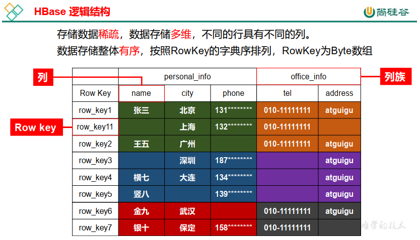
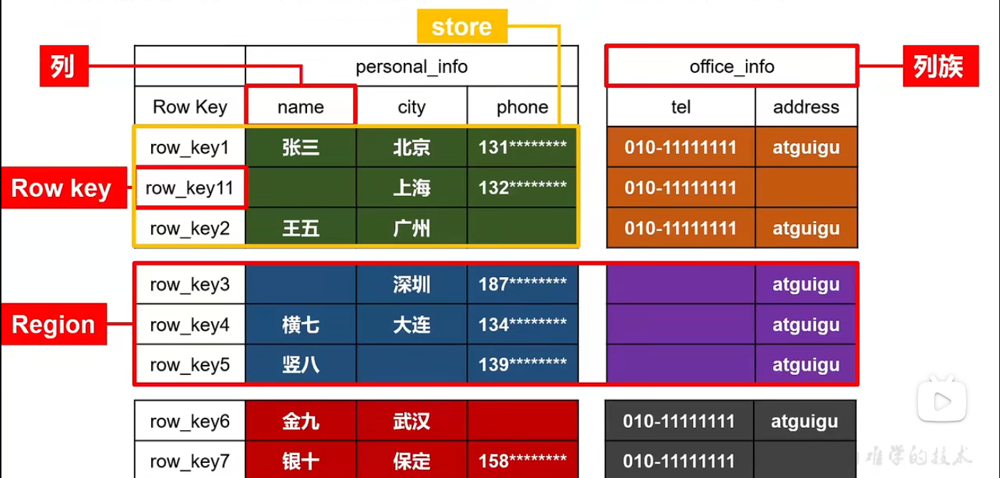
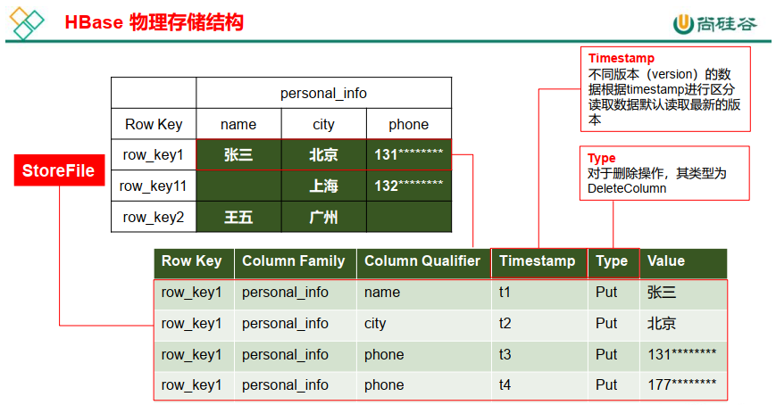
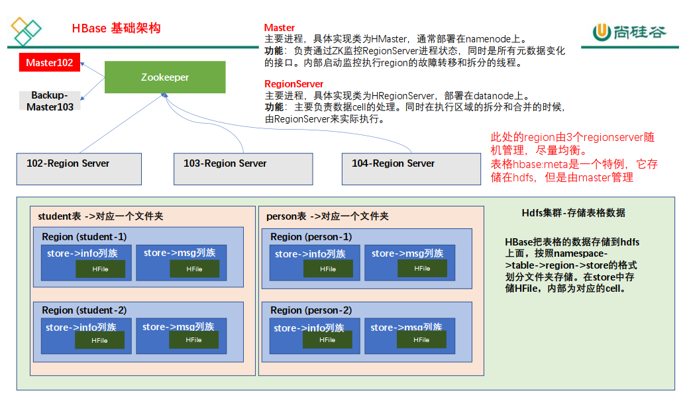

# gHBaseNotes

## Remark

- 群起/关闭HBase，不用脚本  -  首先启动hadoop，zookeeper,

  ```shell
  start-hbase.sh
  
  # 不要关hadoop, zookeeper
  stop-hbase.sh 
  ```
  
  

## HBase 简介

- 定义

  Apache HBase™ 是以 <span style="color:blue; font-weight:bold">hdfs</span> 为数据存储的，一种分布式、可扩展的 <span style="color:blue; font-weight:bold">NoSQL</span> 数据库。
  
  > 关系型数据库：Mysql  -  表格形式存储
  >
  > 非关系型数据：HBase、Redis  -  键值对存储
  >
  > HBase依赖框架：Hadoop、Zookeeper
  >
  > HBase整合框架：Phoenix、Hive

### HBase 数据模型

HBase 的设计理念依据 Google 的 BigTable 论文，论文中对于数据模型的首句介绍。

> Bigtable 是一个<span style="color:blue; font-weight:bold">稀疏的</span>、<span style="color:blue; font-weight:bold">分布式的</span>、<span style="color:blue; font-weight:bold">持久的</span>多维排序 map。(map - 映射)

之后对于映射的解释如下：

> 该映射由行键、列键和时间戳索引作为键；映射中的每个值都是一个未解释的字节数组。  

最终 HBase 关于数据模型和 BigTable 的对应关系如下：

> HBase 使用与 Bigtable 非常相似的数据模型。用户将数据行存储在带标签的表中。数据行具有可排序的键和任意数量的列。该表存储稀疏，因此如果用户喜欢，同一表中的行可以具有疯狂变化的列。  

最终理解 HBase 数据模型的关键在于<span style="color:red; font-weight:bold">稀疏、分布式、多维、排序</span>的映射。其中映射 map指代非关系型数据库的 key-Value 结构。  

- HBase 逻辑结构

  ```json
  {
      "row_k ey1":{
          "personal_info":{
              "name":"zhangsan",
              "city":"北京",
              "phone":"131********"
      	},
          "office_info":{
              "tel":"010-1111111",
              "address":"atguigu"
          }
      },
      "row_key11":{
          "personal_info":{
              "city":"上海",
              "phone":"132********"
          },
          "office_info":{
              "tel":"010-1111111"
          }
      },
      "row_key2":{
      ......
  }
  ```

  

  

  > 将表格按照行拆分，块名称为Region，用于实现<span style="color:blue; font-weight:bold">分布式</span>结构
  >
  > 按照列族切分为store用于底层存储不同的文件夹中，便于文件对应。

- HBase 物理存储结构  

  物理存储结构即为数据映射关系，而在概念视图的空单元格，底层实际根本不存储。  

  

  > hdfs中的数据不能修改，只能删除，重写，追加。
  >
  > > 通过时间戳版本来实现修改数据。时间戳默认是当前系统时间。
  >
  > hdfs中的数据也不太好随机的删除
  >
  > > 时间戳+Type，实现数据的删除。

- 数据模型  

  - Name Space

    命名空间，类似于关系型数据库的 database 概念，每个命名空间下有多个表。 HBase 两个自带的命名空间，分别是 <span style="color:blue; font-weight:bold">hbase</span> 和 <span style="color:blue; font-weight:bold">default</span>，hbase 中存放的是 HBase 内置的表，default 表是用户默认使用的命名空间。

  - Table

    类似于关系型数据库的表概念。不同的是，HBase定义表时只需要声明列族即可，不需要声明具体的列。 因为数据存储时稀疏的，所有往HBase写入数据时，字段可以动态、按需指定。因此，和关系型数据库相比，HBase能够轻松应对字段变更的场景。  

  - Row  

    HBase 表中的每行数据都由一个 RowKey 和多个 Column（列）组成，数据是按照 RowKey的字典顺序存储的，并且查询数据时<span style="color:blue; font-weight:bold">只能根据 RowKey 进行检索</span>，所以 RowKey 的设计十分重要。  

    > HBase 不能写SQL语句

  - Column

    HBase 中的每个列都由 <span style="color:blue; font-weight:bold">Column Family(列族)</span>和 <span style="color:blue; font-weight:bold">Column Qualifier(列限定符)</span> 进行限定，例如 info： name， info： age。<span style="color:blue; font-weight:bold">建表时，只需指明列族</span>，而列限定符无需预先定义。  

  - Time Stamp  

    用于标识数据的不同版本（version）， 每条数据写入时，系统会自动为其加上该字段，其值为写入 HBase 的时间。  

  - Cell 
  
    由{rowkey, column Family： column Qualifier, timestamp} 唯一确定的单元。 cell 中的数据全部是字节码形式存贮 。

### HBase 基本架构

- P6  -   重复看



架构角色：  

- Master

  实现类为 HMaster， 负责监控集群中所有的 RegionServer 实例。主要作用如下：

  - 管理元数据表格 hbase:meta，接收用户对表格创建修改删除的命令并执行
  - 监控 region 是否需要进行负载均衡，故障转移和 region 的拆分。

  通过启动多个后台线程监控实现上述功能：

  - ①LoadBalancer 负载均衡器
    周期性监控 region 分布在 regionServer 上面是否均衡，由参数 hbase.balancer.period 控制周期时间，默认 5 分钟。
  - ②CatalogJanitor 元数据管理器
    定期检查和清理 hbase:meta 中的数据。 meta 表内容在进阶中介绍。
  - ③MasterProcWAL master <span style="color:blue; font-weight:bold">预写日志处理器</span>
    把 master 需要执行的任务记录到预写日志 WAL 中，如果 master 宕机，让 backupMaster读取日志继续干。  

- Region Server

  Region Server 实现类为 HRegionServer，主要作用如下：

  - 负责数据 cell 的处理，例如写入数据 put，查询数据 get 等
  - 拆分合并 region 的实际执行者，有 master 监控，有 regionSer ver 执行。 

- Zookeeper

  HBase 通过 Zookeeper 来做 master 的高可用、 记录 RegionServer 的部署信息、 并且存储有 meta 表的位置信息。

  HBase 对于数据的读写操作时直接访问 Zookeeper 的，在 2.3 版本推出 Master Registry模式，客户端可以直接访问 master。 使用此功能，会加大对 master 的压力，减轻对 Zookeeper的压力。  

- HDFS

  HDFS 为 Hbase 提供最终的底层数据存储服务，同时为 HBase 提供高容错的支持。  

## HBase 快速入门

### HBase 安装部署  

> 首先保证 <span style="color:red; font-weight:bold">hadoop和zookeeper</span>正常部署

- HBase 的解压 

  ```shell
  tar -zxvf /opt/software/hbase-2.4.11 -C /opt/module/
  ```

- 配置环境变量 

  ```shell
  sudo vim /etc/profile.d/my_env.sh
  
  #HBASE_HOME
  export HBASE_HOME=/opt/module/hbase-2.4.11
  export PATH=$PATH:$HBASE_HOME/bin
  
  source /etc/profile.d
  ```

- HBase 的配置文件 

  - hbase-env.sh 修改内容，也可以添加到最后

    ```shell
    # Tell HBase whether it should manage it's own instance of ZooKeeper or not.
    # export HBASE_MANAGES_ZK=true
    export HBASE_MANAGES_ZK=false
    ```

    >  <span style="color:blue; font-weight:bold">false 代表不使用hbase自身的zookeeper，</span>
    >
    > 使用我们已经安装好的，分布式的zookeeper。

  - hbase-site.xml 修改内容

    ```xml
        <property>
            <name>hbase.cluster.distributed</name>
            <value>true</value>
        </property>
    
        <property>
            <name>hbase.zookeeper.quorum</name>
            <value>l9z102,l9z103,l9z104</value>
            <description>The directory shared by RegionServers.</description>
        </property>
    
        <!-- <property>-->
            <!-- <name>hbase.zookeeper.property.dataDir</name>-->
            <!-- <value>dataDir=/opt/module/zookeeper-3.5.7/zkData</value>-->
            <!-- <description> 记得修改 ZK 的配置文件 ZK 的信息不能保存到临时文件夹 </description>-->
        <!-- </property>-->
    
        <property>
            <name>hbase.rootdir</name>
            <value>hdfs://l9z102:8020/hbase</value>
            <description>The directory shared by RegionServers.</description>
        </property>
    
    
    
    
    
        <!-- phoenix regionserver 配置参数 二级索引配置文件 -->
        <property>
            <name>hbase.regionserver.wal.codec</name>
            <value>org.apache.hadoop.hbase.regionserver.wal.IndexedWALEditCodec</value>
        </property>
    
        <!-- 注意：为了开启 hbase 的 namespace 和 phoenix 的 schema 的映射，在程序中需要加这个配置文件，
        另外在 linux 服务上，也需要在 hbase 以及 phoenix 的 hbase-site.xml 配置文件中，加上以上两个配置，
        并使用 xsync 进行同步（本节 1 中文档已有说明） -->
        <property>
            <name>phoenix.schema.isNamespaceMappingEnabled</name>
            <value>true</value>
        </property>
        <property>
            <name>phoenix.schema.mapSystemTablesToNamespace</name>
            <value>true</value>
        </property>
    ```

    > hbase.cluster.distributed = true 表示要部署一个分布式的HBase
    >
    > 
    >
    > hdfs://l9z102:8020/hbase  表示<span style="color:blue; font-weight:bold">hbase的数据存储位置为：</span><span style="color:red; font-weight:bold">/hbase</span>
    >
    > 
    >
    > <span style="color:red; font-weight:bold">注意：</span>Hbase的配置文件hbase-site.xml，修改完后，要分发给其他集群。然后再复制到phoenix的bin目录中。

  - regionservers配置文件，集群部署

    ```shell
    l9z102
    l9z103
    l9z104
    ```

  - <span style="color:blue; font-weight:bold">解决 HBase 和 Hadoop 的 log4j 兼容性问题，修改 HBase 的 jar 包，使用 Hadoop 的 jar 包</span>  

    ```shell
    mv slf4j-reload4j-1.7.33.jar slf4j-reload4j-1.7.33.jar.bak
    ```

    > 将/opt/module/hbase-2.4.11/lib/client-facingthirdparty/slf4j-reload4j-1.7.33.jar  

- HBase 远程发送到其他集群 

  ```
  xsync hbase/
  ```

### HBase 启动

- HBase 服务的启动

  - 单点启动  

    ```shell
    bin/hbase-daemon.sh start master         # 启动master
    bin/hbase-daemon.sh start regionserver   # 启动regionserver
    ```

  - 群启  -  <span style="color:red; font-weight:bold">不用写脚本</span>

    ```
    bin/start-hbase.sh
    ```

    > 启动HBase，首先启动  <span style="color:red; font-weight:bold">hadoop和zookeeper</span>

  - 对应的停止服务 

    ```
    bin/stop-hbase.sh
    ```

    > 注意：关闭集群，只能在master服务器关  （一般开发中，启动之后，不会随意关。）

- 查看 HBase 页面  

  启动成功后，可以通过“host:port”的方式来访问 HBase 管理页面，暴露的Web端口是16010
  ```
  http://l9z102:16010
  ```

- <span style="color:blue; font-weight:bold">高可用（可选）-  开发中，建议开启</span>

  在 HBase 中 HMaster 负责监控 HRegionServer 的生命周期，均衡 RegionServer 的负载，如果 HMaster 挂掉了，那么整个 HBase 集群将陷入不健康的状态，并且此时的工作状态并不会维持太久。所以 HBase 支持对 HMaster 的高可用配置。  

  - 关闭 HBase 集群（如果没有开启则跳过此步）  

    ```
    bin/stop-hbase.sh
    ```

  - 在 conf 目录下创建 <span style="color:blue; font-weight:bold">backup-masters</span> 文件  

    ```
    touch conf/backup-masters
    ```

  - 在 backup-masters 文件中配置高可用 HMaster 节点  

    ```
    echo l9z103 > conf/backup-masters
    ```

  - 将整个 conf 目录 scp 到其他节点  

    ```
    xsync conf
    ```

    > 分布式的框架，配置文件要及时分发。

  - 重启 hbase,打开页面测试查看  
  
    ```
    http://l9z102:16010  
    ```
  
  > <span style="color:red; font-weight:bold">配置了高可用之后，关闭集群要在真正的master上关闭，因为元数据存储在master上。</span>
  >
  >  <span style="color:blue; font-weight:bold">高可用已经部署</span>

### HBase Shell 操作

- 进入 HBase 客户端命令行 

  ```shell
  hbase shell
  ```

- 查看帮助命令

  ```shell
  help
  
  1、Group name: ddl
  Commands: alter, alter_async, alter_status, clone_table_schema, create, describe, disable, 
  disable_all, drop, drop_all, enable, enable_all, exists, get_table, is_disabled, is_enabled, list, 
  list_regions, locate_region, show_filters
  
  2、Group name: namespace
  Commands: alter_namespace, create_namespace, describe_namespace, drop_namespace, list_namespace, 
  list_namespace_tables
  
  3、Group name: dml
  Commands: append, count, delete, deleteall, get, get_counter, get_splits, incr, put, scan, truncate, 
  truncate_preserve
  ```

  > help 能够展示 HBase 中所有能使用的命令，
  >
  > 主要使用的命令有 namespace 命令空间相关，DDL 创建修改表格， DML 写入读取数据。  

- namespace

  - 创建命名空间

    ```shell
    create_namespace 'bigdata'
    ```

  - <span style="color:blue; font-weight:bold">查看所有的命名空间  </span>

    ```shell
    list_namespace
    ```
    
    > 自带两个命名空间
    >
    > - default ： 默认命名空间；
    > - hbase : 系统用的，我们一般不用；

- DDL 

  - 创建表

    在 bigdata 命名空间中创建表格 student，两个列族。info 列族数据维护的版本数为 5 个，如果不写默认版本数为 1。  

    ```shell
    create 'bigdata:student', {NAME => 'info', VERSIONS => 5}, {NAME => 'msg'}
    ```

    > 如果创建表格只有列族，没有列族属性，可以简写。
    >
    > 例如：`create 'bigdata:student', 'info', 'msg'`
    >
    > 如果不写命名空间，使用默认的命名空间 default。  
    >
    > ```shell
    > create 'student1','info'
    > ```

  - 查看表

    查看表有两个命令： list 和 describe

    - list：<span style="color:blue; font-weight:bold">查看所有的表名  </span>

      ```shell
      list
      ```

    - describe：查看一个表的详情  

      ```shell
      describe 'student1'
      
      
      {NAME => 'info', BLOOMFILTER => 'ROW', IN_MEMORY => 'false', VERSIONS => '3', 
      KEEP_DELETED_CELLS => 'FALSE', DATA_BLOCK_ENCODING => 'NONE', COMPRESSION => 'NONE', 
      TTL => 'FOREVER', MIN_VERSIONS => '0', BLOCKCACHE => 'true', BLOCKSIZE => '65536', 
      REPLICATION_SCOPE => '0'}                                       
      
      {NAME => 'msg', BLOOMFILTER => 'ROW', IN_MEMORY => 'false', VERSIONS => '2', 
      KEEP_DELETED_CELLS => 'FALSE', DATA_BLOCK_ENCODING => 'NONE', COMPRESSION => 'NONE', 
      TTL => 'FOREVER', MIN_VERSIONS => '0', BLOCKCACHE => 'true', BLOCKSIZE => '65536', 
      REPLICATION_SCOPE => '0'} 
      ```

  - 修改表

    表名创建时写的所有和列族相关的信息，都可以后续通过 `alter` 修改，包括增加删除列族。  

    - <span style="color:blue; font-weight:bold">增加</span>列族和<span style="color:blue; font-weight:bold">修改</span>信息都使用覆盖的方法 

      ```shell
      alter 'student1', {NAME => 'info', VERSIONS => 3}
      
      alter 'student1', {NAME => 'info1', VERSIONS => 2}
      ```

      > 实际开发中，一般不会改来改去的；

    - 删除信息使用特殊的语法  -   两种均可以

      ```shell
      alter 'student1', NAME => 'f1', METHOD => 'delete'
      alter 'student1', 'delete' => 'f1'
      ```

  - 删除表 

    <span style="color:blue; font-weight:bold">删除表，分两步。</span>

    shell 中删除表格，需要先将表格状态设置为不可用。  
    
    ```shell
    disable 'student1'
    drop 'student1'
    ```

- DML

  - 写入数据

    在 HBase 中如果想要写入数据，只能添加结构中最底层的 cell。可以手动写入时间戳指定 cell 的版本，推荐不写默认使用当前的系统时间。

    ```shell
    put 'bigdata:student','1001','info:name','zhangsan1'
    put 'bigdata:student','1001','info:name','zhangsan2'
    put 'bigdata:student','1001','info:name','zhangsan3'
    put 'bigdata:student','1001','info:age','18'
    ```

    > 如果重复写入相同 rowKey，相同列的数据，会写入多个版本进行覆盖。  

  - 读取数据  

    读取数据的方法有两个： get 和 scan。

    get 最大范围是一行数据，也可以进行列的过滤，读取数据的结果为多行 cell。  

    ```shell
    get 'bigdata:student','1001'
    get 'bigdata:student','1001' , {COLUMN => 'info'}
    get 'bigdata:student','1001' , 'info'
    get 'bigdata:student','1001' , {COLUMN => 'info:name'}
    get 'bigdata:student','1001' , 'info:name'
    ```

    也可以修改读取 cell 的版本数，默认读取一个。最多能够读取当前列族设置的维护版本数。  

    ```shell
    get 'bigdata:student','1001' , {COLUMN => 'info:name', VERSIONS => 6}
    ```

    > 带VERSIONS，必须带COLUMN，还必须用大括号括住。

    scan 是扫描数据，能够读取多行数据，不建议扫描过多的数据，推荐使用 startRow 和stopRow 来控制读取的数据，

    默认范围<span style="color:blue; font-weight:bold">左闭右开</span>。  

    ```shell
    scan 'bigdata:student',{STARTROW => '1001',STOPROW => '1002'}
    ```

  - 删除数据  

    删除数据的方法有两个： delete 和 deleteall。

    delete 表示删除一个版本的数据，即为 1 个 cell，不填写版本默认删除最新的一个版本。  

    ```shell
    delete 'bigdata:student','1001','info:name'
    ```

    deleteall 表示删除所有版本的数据，即为当前行当前列的多个 cell。 

    > <span style="color:blue;">执行命令会标记数据为要删除，不会直接将数据彻底删除，删除数据只在特定时期清理磁盘时进行</span>

    ```shell
    deleteall 'bigdata:student','1001','info:name'
    ```

> <span style="color:red; ">实际开发中使用 shell 的机会不多，所有丰富的使用方法到 API 中介绍。  </span>

## 第 3 章 HBase API

### 环境准备

1、新建项目后在 pom.xml 中添加依赖： 

```xml
<dependencies>
    <dependency>
        <groupId>org.apache.hbase</groupId>
        <artifactId>hbase-server</artifactId>
        <version>2.4.11</version>
        <exclusions>
            <exclusion>
                <groupId>org.glassfish</groupId>
                <artifactId>javax.el</artifactId>
            </exclusion>
        </exclusions>
    </dependency>
    <dependency>
        <groupId>org.glassfish</groupId>
        <artifactId>javax.el</artifactId>
        <version>3.0.1-b06</version>
    </dependency>
</dependencies>
```

### 创建连接

根据官方 API 介绍， HBase 的客户端连接由 ConnectionFactory 类来创建，用户使用完成之后需要手动关闭连接。同时连接是一个重量级的，推荐一个进程使用一个连接，对 HBase的命令通过连接中的两个属性 Admin 和 Table 来实现。  

- 单线程创建连接  

  ```java
  public class HBaseConnection {
      public static void main(String[] args) throws IOException {
          // 1 创建连接配置对象
          Configuration conf = new Configuration();
  
          // 2 添加配置信息
          conf.set("hbase.zookeeper.quorum", "l9z102,l9z103,l9z104");
  
          // 3 创建连接
          // 默认是同步连接
          Connection connection = ConnectionFactory.createConnection(conf);
  
          // 创建异步连接，不推荐使用
          CompletableFuture<AsyncConnection> asyncConnection = 
              ConnectionFactory.createAsyncConnection(conf);
  
          // 4 使用连接
          System.out.println(connection);
  
          // 5 关闭连接
          connection.close();
      }
  }
  ```

- 多线程创建连接  

  使用类单例模式，确保使用一个连接，可以同时用于多个线程。

  > 不在main线程中创建对象，在静态代码块中创建对象，可以多个线程使用。

  ```java
  public class HBaseConnection {
  
      // 声明一个静态属性
      public static Connection connection = null;
      static {
          // 1 创建连接
          // 默认是同步连接
          try {
              // 使用读取本地文件的方式添加参数
              connection = ConnectionFactory.createConnection();
          } catch (IOException e) {
              e.printStackTrace();
          }
      }
  
      public static void closeConnection() throws IOException {
          // 判断连接是否为空
          if (connection != null) {
              connection.close();
          }
      }
      
      public static void main(String[] args) throws IOException {
  
          // 直接使用创建好的连接
          // 不要在main线程里面单独创建
          System.out.println(HBaseConnection.connection);
  
          // 在main线程的最后关闭连接
          HBaseConnection.closeConnection();
      }
  }
  ```


```shell
# 来自Connection.java

Admin admin
Table table


A cluster connection encapsulating lower level individual connections to actual servers and a connection to zookeeper. Connections are instantiated through the ConnectionFactory class. The lifecycle of the connection is managed by the caller, who has to close() the connection to release the resources.
The connection object contains logic to find the master, locate regions out on the cluster, keeps a cache of locations and then knows how to re-calibrate after they move. The individual connections to servers, meta cache, zookeeper connection, etc are all shared by the Table and Admin instances obtained from this connection.
Connection creation is a heavy-weight operation. Connection implementations are thread-safe, so that the client can create a connection once, and share it with different threads. Table and Admin instances, on the other hand, are light-weight and are not thread-safe. Typically, a single connection per client application is instantiated and every thread will obtain its own Table instance. Caching or pooling of Table and Admin is not recommended.
Since:
0.99.0
See Also:
ConnectionFactory

```


### DDL

- 创建命名空间

  ```java
      /**
       * 创建命名空间
       * @param namespace 命名空间名称
       */
      public static void creatNamespace(String namespace) throws IOException {
          // 1 获取admin
          // admin 的连接是轻量级的，不是线程安全的，不推荐池化或者缓存这个对象
          Admin admin = connection.getAdmin();
  
          // 2 调用方法，创建命名空间
          // 代码相对shell更加底层，所以shell能够实现的功能，代码一定能实现
          // 所以需要填写完整的命名空间描述
  
          // 2.1 创建命名空间描述建造者
          NamespaceDescriptor.Builder builder = NamespaceDescriptor.create(namespace);
  
          // 2.2 给命名空间添加需求
          builder.addConfiguration("user", "lijzh");
  
          // 2.3 使用builder构造出对应的添加完参数的对象  完成创建
          // 创建命名空间出现的问题，属于本方法自身的问题，不应该抛出
          try {  // 这样虽然出错，不应该后续代码的执行
              admin.createNamespace(builder.build());
          } catch (IOException e) {
              System.out.println("命名空间已经存在");
              e.printStackTrace();
          }
  
          // 3 关闭admin
          admin.close();
      }
  ```

- 判断表是否存在

  ```java
  
  ```

- 创建表

  ```java
  ```

- 修改表

- 删除表

- 删除命名空间

### DML

- 插入数据
- 获取一行数据或者一个cell数据  ：一行数据可以包含多个cell
- 扫描数据
- 单行过滤扫描
- 整行过滤扫描
- 删除数据

## 第 4 章 HBase 进阶

### Master 架构  


### RegionServer 架构  


### 写流程  


### MemStore Flush  


### 读流程


### StoreFile Compaction  


### Region Split  


## HBase 优化  


## 整合 Phoenix  

> <span style="color:red; font-weight:bold">Hbase 中存储的默认是字符串，数字也会转换成字符串。</span>

### Phoenix 部署

> 官方网址：phoenix.apache.org

- 已部署完毕！环境变量已配置完毕！

- 启动phoenix

  > 连接zookeeper的地址。
  >
  > 直接运行下面命令，启动phoenix

  ```shell
  sqlline.py l9z102,l9z2103,l9z104:2181
  ```
  


### Phoenix 的使用

- 查表：!tables / !table
- 查询：select * from table_name
- 

- 表的映射（hbase与phoenix表的映射）

  - 创建Hbase表

  ```shell
  create 'test', 'info1', 'info2'
  ```

  - 插入数据

  ```shell
  put 'test', 'info1:name', 'zhangsan'
  put 'test', 'info2:age', 18
  ```

  - phoenix 创建视图

  ```sql
  create view "test"(
  id varchar primary key,
  "info1"."name" varchar,
  "info2"."age" varchar
  ) column_encoded_bytes = 0;
  
  create view "test"(
  id varchar primary key,
  "info1"."name" varchar,
  "info1"."age" varchar,
  "info2"."age" varchar
  ) column_encoded_bytes = 0;
  ```

  - phoenix 创建表映射

  ```shell
  create table "test"(
  id varchar primary key,
  "info1"."name" varchar,
  "info1"."age" varchar,
  "info2"."age" varchar
  ) column_encoded_bytes = 0;
  ```

  > <span style="color:red; font-weight:bold">表映射的删除表，会把Hbase中的表也删除。</span>
  >
  > 映射的时候，如果是数字，会有bug。请慎用！


### Phoenix JDBC 操作


### 二级索引

- 全局索引

  `create index my_index on student(age);`

```sql
explain select * from student where age = 10;

create index my_index on student(age);

# 二级索引，叶子节点只有索引字段和主键
explain select id from student where age = 10;

# name是额外字段，未使用索引
explain select id,name from student where age = 10;
```


- 包含索引，推荐使用

  `create index my_index on student(age) include(name);`

```sql
# 创建包含索引
create index my_index on student(age) include(name);

# 使用到了索引
explain select name from student where age = 10;
```


- 本地索引

  Local Index 适用于写操作频繁的场景。  

  `索引数据`和`数据表的数据`是存放在同一张表中（且是同一个 Region），避免了在写操作的时候往不同服务器的索引表中写索引带来的额外开销。  

  `create local index my_index on student(age,name)`

```sql
drop index my_index on student;

explain select age,name from student where age = 10;

create local index my_index on student(age,name)

explain select age,name from student where age = 10;
```


## 与Hive集成

### 使用场景  


如果大量的数据已经存放在 HBase 上面，需要对已经存在的数据进行数据分析处理，那么 Phoenix 并不适合做特别复杂的 SQL 处理，此时可以使用 hive 映射 HBase 的表格，之后写 HQL 进行分析处理。  

### HBase 与 Hive 集成使用  

在 hive-site.xml 中添加 zookeeper 的属性，如下：

```xml
<!-- HBase 与 Hive 集成使用 -->
<property>
    <name>hive.zookeeper.quorum</name>
    <value>l9z102,l9z103,l9z104</value>
</property>
<property>
    <name>hive.zookeeper.client.port</name>
    <value>2181</value>
</property>
```

- 1） 案例一  

  **目标：**建立 Hive 表，关联 HBase 表，插入数据到 Hive 表的同时能够影响 HBase 表。  

```sql
CREATE TABLE hive_hbase_emp_table(
empno int,
ename string,
job string,
mgr int,
hiredate string,
sal double,
comm double,
deptno int)
STORED BY 'org.apache.hadoop.hive.hbase.HBaseStorageHandler'
WITH SERDEPROPERTIES ("hbase.columns.mapping" = ":key,info:ename,info:job,info:mgr,info:hiredate,info:sal,info:comm,info:deptno")
TBLPROPERTIES ("hbase.table.name" = "hbase_emp_table");


CREATE TABLE emp(
empno int,
ename string,
job string,
mgr int,
hiredate string,
sal double,
comm double,
deptno int)
row format delimited fields terminated by '\t';


load data local inpath '/home/lijzh/emp.txt' into table emp;

insert into table hive_hbase_emp_table select * from emp;

select * from hive_hbase_emp_table;

scan 'hbase_emp_table'
```


- 2） 案例二  

  **目标：** 在 HBase 中已经存储了某一张表 hbase_emp_table，然后在 Hive 中创建一个外部表来关联 HBase 中的 hbase_emp_table 这张表，使之可以借助 Hive 来分析 HBase 这张表中的数据。  

  - 在 Hive 中创建外部表  

  ```sql
  CREATE EXTERNAL TABLE relevance_hbase_emp(
      empno int,
      ename string,
      job string,
      mgr int,
      hiredate string,
      sal double,
      comm double,
      deptno int)
  STORED BY 'org.apache.hadoop.hive.hbase.HBaseStorageHandler'
  WITH SERDEPROPERTIES 
  ("hbase.columns.mapping" = ":key,info:ename,info:job,info:mgr,info:hiredate,info:sal,info:comm,info:deptno")
  TBLPROPERTIES ("hbase.table.name" = "hbase_emp_table");
  ```

  >stored by
  >
  >with serdeproperties
  >
  >tblproperties

  - 关联后就可以使用 Hive 函数进行一些分析操作了  

  ```sql
  select * from relevance_hbase_emp;
  
  select deptno, avg(sal) monery 
  from relevance_hbase_emp 
  group by deptno ;
  ```

  


