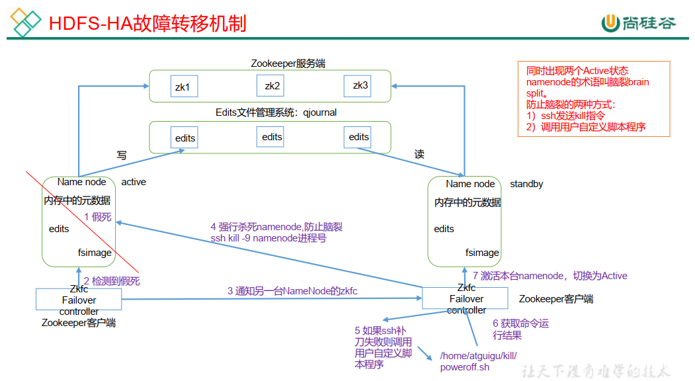

# HANotes

## HA 概述

- 所谓 HA（High Available）， 即高可用（7*24 小时不中断服务） 。  

- 实现高可用最关键的策略是<span style="color:blue; font-weight:bold">消除单点故障</span>(SPOF)。 HA 严格来说应该分成各个组件的 HA 机制：HDFS 的 HA 和 YARN 的 HA。  

  > 单点故障：某一个节点挂掉后，整个集群都不能用了。

- NameNode 主要在以下两个方面影响 HDFS 集群

  - NameNode 机器发生意外，如宕机，集群将无法使用，直到管理员重启

  - NameNode 机器需要升级，包括软件、硬件升级，此时集群也将无法使用

    > HDFS HA 功能通过配置多个 NameNodes(Active/Standby)实现在集群中对 NameNode 的热备来解决上述问题。如果出现故障，如机器崩溃或机器需要升级维护，这时可通过此种方式将 NameNode 很快的切换到另外一台机器。  

## HDFS-HA 集群搭建

- HDFS-HA 集群搭建  

|  l9z102  |  l9z103  |       l9z104       |
| :------: | :------: | :----------------: |
| NameNode |          | Secondary NameNode |
| DataNode | DataNode |      DataNode      |

- HA 的主要目的是消除 namenode 的单点故障,需要将 hdfs 集群规划成以下模样  

|                           l9z102                           |                           l9z103                           |                           l9z104                           |
| :--------------------------------------------------------: | :--------------------------------------------------------: | :--------------------------------------------------------: |
| <span style="color:blue; font-weight:bold">NameNode</span> | <span style="color:blue; font-weight:bold">NameNode</span> | <span style="color:blue; font-weight:bold">NameNode</span> |
|                          DataNode                          |                          DataNode                          |                          DataNode                          |

> 负责写的NameNode为Active，负责同步的为Standby

### HDFS-HA 核心问题

- 怎么保证三台 namenode 的数据一致  


- 怎么让同时只有一台 nn 是 active，其他所有是 standby 的  


- 2nn 在 ha 架构中并不存在，定期合并 fsimage 和 edtis 的活谁来干  


- 如果 nn 真的发生了问题，怎么让其他的 nn 上位干活  

### HDFS-HA 手动模式

- 环境准备

  - 修改 IP

  - 修改主机名及主机名和 IP 地址的映射

  - 关闭防火墙

  - ssh 免密登录

  - 安装 JDK，配置环境变量等  

- 规划集群  

|     l9z102      |                           l9z103                           |                           l9z104                           |
| :-------------: | :--------------------------------------------------------: | :--------------------------------------------------------: |
| NameNode</span> | <span style="color:blue; font-weight:bold">NameNode</span> | <span style="color:blue; font-weight:bold">NameNode</span> |
|   JournalNode   |                        JournalNode                         |                        JournalNode                         |
|    DataNode     |                          DataNode                          |                          DataNode                          |

#### 配置 HDFS-HA 集群

- 在 /opt /module目录下创建一个HA文件夹  

- 将/opt/module/下的 hadoop-3.1.3 拷贝到/opt/module/HA/目录下（<span style="color:blue; font-weight:bold">记得删除 data 和 log 目录</span>）  

- 配置 core-site.xml  

  ```xml
      <!-- 把多个 NameNode 的地址组装成一个集群 mycluster -->
      <property>
          <name>fs.defaultFS</name>
          <value>hdfs://mycluster</value>
      </property>
      <!-- 指定 hadoop 运行时产生文件的存储目录 -->
      <property>
          <name>hadoop.tmp.dir</name>
          <value>/opt/module/HA/hadoop-3.1.3/data</value>
      </property>
  ```

  

- 配置 hdfs-site.xml  

  ```xml
      <!-- NameNode 数据存储目录 -->
      <property>
          <name>dfs.namenode.name.dir</name>
          <value>file://${hadoop.tmp.dir}/name</value>
      </property>
  
      <!-- DataNode 数据存储目录 -->
      <property>
          <name>dfs.datanode.data.dir</name>
          <value>file://${hadoop.tmp.dir}/data</value>
      </property>
  
      <!-- JournalNode 数据存储目录 -->
      <property>
          <name>dfs.journalnode.edits.dir</name>
          <value>${hadoop.tmp.dir}/jn</value>
      </property>
  
      <!-- 完全分布式集群名称 -->
      <property>
          <name>dfs.nameservices</name>
          <value>mycluster</value>
      </property>
  
      <!-- 集群中 NameNode 节点都有哪些 -->
      <property>
          <name>dfs.ha.namenodes.mycluster</name>
          <value>nn1,nn2,nn3</value>
      </property>
      <!-- NameNode 的 RPC 通信地址 -->
      <property>
          <name>dfs.namenode.rpc-address.mycluster.nn1</name>
          <value>l9z102:8020</value>
      </property>
      <property>
          <name>dfs.namenode.rpc-address.mycluster.nn2</name>
          <value>l9z103:8020</value>
      </property>
      <property>
          <name>dfs.namenode.rpc-address.mycluster.nn3</name>
          <value>l9z104:8020</value>
      </property>
  
      <!-- NameNode 的 http 通信地址  Web地址 -->
      <property>
          <name>dfs.namenode.http-address.mycluster.nn1</name>
          <value>l9z102:9870</value>
      </property>
      <property>
          <name>dfs.namenode.http-address.mycluster.nn2</name>
          <value>l9z103:9870</value>
      </property>
      <property>
          <name>dfs.namenode.http-address.mycluster.nn3</name>
          <value>l9z104:9870</value>
      </property>
  
      <!-- 指定 NameNode 元数据在 JournalNode 上的存放位置 -->
      <property>
          <name>dfs.namenode.shared.edits.dir</name>
          <value>qjournal://l9z102:8485;l9z103:8485;l9z104:8485/mycluster</value>
  
      </property>
      <!-- 访问代理类： client 用于确定哪个 NameNode 为 Active -->
      <property>
          <name>dfs.client.failover.proxy.provider.mycluster</name>
          <value>org.apache.hadoop.hdfs.server.namenode.ha.ConfiguredFailoverProxyProvider</value>
      </property>
  
      <!-- 配置隔离机制，即同一时刻只能有一台服务器对外响应 -->
      <property>
          <name>dfs.ha.fencing.methods</name>
          <value>sshfence</value>
      </property>
  
      <!-- 使用隔离机制时需要 ssh 秘钥登录-->
      <property>
          <name>dfs.ha.fencing.ssh.private-key-files</name>
          <value>/home/lijzh/.ssh/id_rsa</value>
      </property>
  ```

- 分发配置好的 hadoop 环境到其他节点  

  ```shell
  xsync 
  ```

#### 启动 HDFS-HA 集群

- 将 HADOOP_HOME 环境变量更改到 HA 目录(三台机器)  

  ```shell
  sudo vim /etc/profile.d/my_env.sh
  
  sudo /home/lijzh/etc/xsync /etc/profile.d/my_env.sh
  source /etc/profile
  ```

- 在各个 JournalNode 节点上，输入以下命令启动 journalnode 服务 (提前删除data、logs文件)

  ```shell
  hdfs --daemon start journalnode
  ```

- 在[nn1]上，对其进行格式化， 并启动

  ```shell
  hdfs namenode -format
   
  hdfs --daemon start namenode
  ```

- 在[nn2]和[nn3]上，同步 nn1 的元数据信息  

  ```shell
  hdfs namenode -bootstrapStandby
  ```

- 启动[nn2]和[nn3]  

  ```shell
  hdfs --daemon start namenode
  ```

- 在所有节点上，启动 datanode  

  ```shell
  hdfs --daemon start datanode
  ```

- 将[nn1]切换为 Active  

  ```shell
  hdfs haadmin -transitionToActive nn1
  ```

- 查看是否 Active  

  ```shell
  hdfs haadmin -getServiceState nn1
  ```

  > 手动模式，要求所有的namenode启动，才可以指定active；
  >
  > 这样就不叫高可用了？？？？？？？？？？？？？？？？？？？？？？？

### HDFS-HA 自动模式 -  重点

#### HDFS-HA 自动故障转移工作机制  

自动故障转移为 HDFS 部署增加了两个新组件： ZooKeeper 和 ZKFailoverController（ZKFC）进程，如图所示。 ZooKeeper 是维护少量协调数据，通知客户端这些数据的改变和监视客户端故障的高可用服务。  



#### HDFS-HA 自动故障转移的集群规划

|                           l9z102                           |                           l9z103                           |                           l9z104                           |
| :--------------------------------------------------------: | :--------------------------------------------------------: | :--------------------------------------------------------: |
| <span style="color:blue; font-weight:bold">NameNode</span> | <span style="color:blue; font-weight:bold">NameNode</span> | <span style="color:blue; font-weight:bold">NameNode</span> |
|                        JournalNode                         |                        JournalNode                         |                        JournalNode                         |
|                          DataNode                          |                          DataNode                          |                          DataNode                          |
|                         zookeeper                          |                         zookeeper                          |                         zookeeper                          |
|                            ZKFC                            |                            ZKFC                            |                            ZKFC                            |

#### 配置 HDFS-HA 自动故障转移  

- 具体配置  

  ```xml
  # 在 hdfs-site.xml 中增加
  	<!-- 启用 nn 故障自动转移 -->
      <property>
          <name>dfs.ha.automatic-failover.enabled</name>
          <value>true</value>
      </property>
  
  
  # 在 core-site.xml 文件中增加
      <!-- 指定 zkfc 要连接的 zkServer 地址 -->
      <property>
          <name>ha.zookeeper.quorum</name>
          <value>l9z102:2181,l9z103:2181,l9z104:2181</value>
      </property>
  ```

- 修改后分发配置文件  

  ```shell
  xsync /etc
  ```

- 启动 

  关闭所有 HDFS 服务：  

  ```shell
  stop-dfs.sh
  ```

- 启动 Zookeeper 集群：

  ```shell
  myzookeeper.sh start
  ```

- 启动 Zookeeper 以后， 然后再初始化 HA 在 Zookeeper 中状态：  

  ```shell
  hdfs zkfc -formatZK
  ```

- 启动 HDFS 服务：

  ```shell
  start-dfs.sh
  ```

- 可以去 zkCli.sh 客户端查看 Namenode 选举锁节点内容

  ```shell
  get -s /hadoop-ha/mycluster/ActiveStandbyElectorLock
  ```

- 验证 - 将 Active NameNode 进程 kill，查看网页端三台 Namenode 的状态变化  

  ```shell
   kill -9 namenode的进程id
  ```

- 上传文件

  ```shell
  # 命令行
  hadoop fs -put a.txt /
  
  # IDEA操作
  /   -->   hdfs://mycluster/
  # hdfs://mycluster    core-site.xml配置文件配置的信息
  ```

  

### Yarn


- 配置文件

  ```xml
      <property>
          <name>yarn.nodemanager.aux-services</name>
          <value>mapreduce_shuffle</value>
      </property>
  
      <!-- 启用 resourcemanager ha -->
      <property>
          <name>yarn.resourcemanager.ha.enabled</name>
          <value>true</value>
      </property>
  
      <!-- 声明resourcemanager 的地址 -->
      <property>
          <name>yarn.resourcemanager.cluster-id</name>
          <value>cluster-yarn1</value>
      </property>
  
      <!--指定 resourcemanager 的逻辑列表-->
      <property>
          <name>yarn.resourcemanager.ha.rm-ids</name>
          <value>rm1,rm2,rm3</value>
      </property>
  
      <!-- ========== rm1 的配置 ========== -->
      <!-- 指定 rm1 的主机名 -->
      <property>
          <name>yarn.resourcemanager.hostname.rm1</name>
          <value>l9z102</value>
      </property>
      <!-- 指定 rm1 的 web 端地址 -->
      <property>
          <name>yarn.resourcemanager.webapp.address.rm1</name>
          <value>l9z102:8088</value>
      </property>
      <!-- 指定 rm1 的内部通信地址 -->
      <property>
          <name>yarn.resourcemanager.address.rm1</name>
          <value>l9z102:8032</value>
      </property>
      <!-- 指定 AM 向 rm1 申请资源的地址 -->
      <property><name>yarn.resourcemanager.scheduler.address.rm1</name>
          <value>l9z102:8030</value>
      </property>
      <!-- 指定供 NM 连接的地址 -->
      <property>
          <name>yarn.resourcemanager.resource-tracker.address.rm1</name>
          <value>l9z102:8031</value>
      </property>
      <!-- ========== rm2 的配置 ========== -->
      <!-- 指定 rm2 的主机名 -->
      <property>
          <name>yarn.resourcemanager.hostname.rm2</name>
          <value>l9z103</value>
      </property>
      <property>
          <name>yarn.resourcemanager.webapp.address.rm2</name>
          <value>l9z103:8088</value>
      </property>
      <property>
          <name>yarn.resourcemanager.address.rm2</name>
          <value>l9z103:8032</value>
      </property>
      <property>
          <name>yarn.resourcemanager.scheduler.address.rm2</name>
          <value>l9z103:8030</value>
      </property>
      <property>
          <name>yarn.resourcemanager.resource-tracker.address.rm2</name>
          <value>l9z103:8031</value>
      </property>
      <!-- ========== rm3 的配置 ========== -->
      <!-- 指定 rm1 的主机名 -->
      <property>
          <name>yarn.resourcemanager.hostname.rm3</name>
          <value>l9z104</value>
      </property>
      <!-- 指定 rm1 的 web 端地址 -->
      <property>
          <name>yarn.resourcemanager.webapp.address.rm3</name>
          <value>l9z104:8088</value>
      </property>
      <!-- 指定 rm1 的内部通信地址 -->
      <property>
          <name>yarn.resourcemanager.address.rm3</name>
          <value>l9z104:8032</value>
      </property>
      <!-- 指定 AM 向 rm1 申请资源的地址 -->
      <property>
          <name>yarn.resourcemanager.scheduler.address.rm3</name>
          <value>l9z104:8030</value>
      </property>
      <!-- 指定供 NM 连接的地址 -->
      <property>
          <name>yarn.resourcemanager.resource-tracker.address.rm3</name>
          <value>l9z104:8031</value>
      </property>
  
      <!-- 指定 zookeeper 集群的地址 -->
      <property>
          <name>yarn.resourcemanager.zk-address</name>
          <value>l9z102:2181,l9z103:2181,l9z104:2181</value>
      </property>
  
      <!-- 启用自动恢复 -->
      <property>
          <name>yarn.resourcemanager.recovery.enabled</name>
          <value>true</value>
      </property>
  
      <!-- 指定 resourcemanager 的状态信息存储在 zookeeper 集群 -->
      <property>
          <name>yarn.resourcemanager.store.class</name>
          <value>org.apache.hadoop.yarn.server.resourcemanager.recovery.ZKRMStateStore</value>
      </property>
  
      <!-- 环境变量的继承 -->
      <property>
          <name>yarn.nodemanager.env-whitelist</name>
          <value>JAVA_HOME,HADOOP_COMMON_HOME,HADOOP_HDFS_HOME,HADOOP_CONF_DIR,CLASSPATH_PREPEND_DISTCACHE,HADOOP_YARN_HOME,HADOOP_MAPRED_HOME</value>
      </property>
  ```

  


