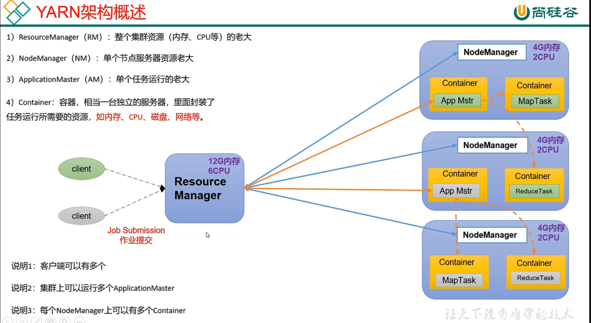

# Hadoop Notes

## Remark

- <span style="color:blue; font-weight:bold">创建虚拟机设置步骤</span>

  - 添加系统问文件 - 开机

  - 设置虚拟机网络配置，window网络配置？？？？？？？？？？？？？？？？

  - 修改ip地址文件  `vim /etc/sysconfig/network-scripts/ifcfg-ens33 `

    ```
    TYPE="Ethernet"
    PROXY_METHOD="none"
    BROWSER_ONLY="no"
    BOOTPROTO="static"
    DEFROUTE="yes"
    IPV4_FAILURE_FATAL="no"
    IPV6INIT="yes"
    IPV6_AUTOCONF="yes"
    IPV6_DEFROUTE="yes"
    IPV6_FAILURE_FATAL="no"
    IPV6_ADDR_GEN_MODE="stable-privacy"
    NAME="ens33"
    UUID="4e9cc6dc-3d41-45d2-b066-95d1ef0d84d6"
    DEVICE="ens33"
    ONBOOT="yes"
    
    # IP地址
    IPADDR=192.168.8.110
    # 网关
    GATEWAY=192.168.8.2
    # 域名解析器
    DNS1=192.168.8.2
    ```

  - 设置主机名

    ```
    >> hostname  # 查看hostname
    >> vim /etc/hostname  # 修改主机名
    >> hostnamectl set-hostname hadoop100  # 修改主机名
    ```

  - 设置linux主机名称映射 `vim /etc/hosts`

    ```
    # ip地址       主机名
    192.168.8.110 hadoop100
    192.168.8.111 hadoop101
    192.168.8.112 hadoop102
    192.168.8.113 hadoop103
    192.168.8.114 hadoop104
    ```

  - 重启linux

  - 设置window主机名称映射 `C:/window/system32/drivers/etc/hosts`

    ```
    # ip地址       主机名
    192.168.8.110 hadoop100
    192.168.8.111 hadoop101
    192.168.8.112 hadoop102
    192.168.8.113 hadoop103
    192.168.8.114 hadoop104
    ```

  - 设置window主机名称映射，为了远程连接方便。

  - -----------------------------------------------------------------------------------------------------------------

  - 安装epel-release

    注：Extra Packages for Enterprise Linux是为“红帽系”的操作系统提供额外的软件包，适用于RHEL、CentOS和Scientific Linux。相当于是一个软件仓库，大多数rpm包在官方 repository 中是找不到的）

    ```
    yum install -y epel-release
    ```

  - 关闭防火墙，关闭防火墙开机自启

    ```
    >> systemctl status firewall
    >> systemctl stop firewall
    >> systemctl start/restart firewall
    
    >> systemctl disable/enable firewall
    ```

  - 配置lijzh用户具有root权限，方便后期加sudo执行root权限的命令

    ```
    vim /etc/sudoers
    
    # 修改/etc/sudoers 文件，在%wheel 这行下面添加一行，如下所示：
    ## Allow root to run any commands anywhere
    root    ALL=(ALL)  ALL
    ## Allows people in group wheel to run all commands
    %wheel  ALL=(ALL)  ALL
    lijzh   ALL=(ALL)  NOPASSWD:ALL
    ```

  - 在/opt目录下创建文件夹，并修改所属主和所属组

    - （1）在/opt目录下创建module、software文件夹

      ```
      [root@hadoop100 ~]# mkdir /opt/module
      [root@hadoop100 ~]# mkdir /opt/software
      ```

    - （2）修改module、software文件夹的所有者和所属组均为lijzh用户 

      ```
      [root@hadoop100 ~]# chown lijzh:lijzh /opt/module 
      [root@hadoop100 ~]# chown lijzh:lijzh /opt/software
      ```

    - （3）查看module、software文件夹的所有者和所属组

  - 卸载虚拟机自带的JDK

    ```
    [root@hadoop100 ~]# rpm -qa | grep -i java | xargs -n1 rpm -e --nodeps 
    ```

    - `rpm -qa`：查询所安装的所有rpm软件包
    - `grep -i`：忽略大小写
    - `xargs -n1`：表示每次只传递一个参数
    - `rpm -e –nodeps`：强制卸载软件

  - 重启虚拟机  `reboot`

- 克隆虚拟机

  - 修改ip地址，主机名称

- 两个服务器之间，要想实现数据传输，数据对象必须可以序列化
  - 

- 在集群中运行本地打的jar包

  ```
  hadoop jar wc.jar edu.lzu.mapreduce.wordcount2.WordCountDriver /zinput1 /zoutput1_1
  ```

  >  edu.lzu.mapreduce.wordcount2.WordCountDriver 这个类名要写全

- 环境变量的分发

  ```
  sudo /home/lijzh/bin/xsync /etc/profile.d/my_env.sh
  # 这里需要使用sudo，和其他的文件分发不同，否则报错
  ```

- 配置 lijzh用户具有 root 权限， 方便后期加 sudo 执行 root 权限的命令  

  ```shell
  vim /etc/sudoers
  
  # 修改/etc/sudoers 文件，在%wheel 这行下面添加一行，如下所示：
  ## Allow root to run any commands anywhere
  root    ALL=(ALL)  ALL
  ## Allows people in group wheel to run all commands
  %wheel  ALL=(ALL)  ALL
  lijzh   ALL=(ALL)  NOPASSWD:ALL
  ```

- 帮助命令

  - 


## 概述

 

## Hadoop

### 1、hadoop官网

[Hadoop官网](https://hadoop.apache.org/)

[找依赖网址](https://mvnrepository.com/)

### 2、概述

- Hadoop概述
  - hadoop是一个由Apache基金会所开发的<span style="color:blue; font-weight:bold">分布式系统</span>基础架构
  - 主要解决<span style="color:blue; font-weight:bold">海量数据的存储</span>和<span style="color:blue; font-weight:bold">海量数据的分析计算</span>
  - 广义上说，Hadoop通常是指一个更广泛的概念——hadoop生态圈

- HDFS概述    (Hadoop Distributed File System）
  - 是一个分布式文件系统，主要解决<span style="color:blue; font-weight:bold">海量数据的存储</span>
  - NameNode(nn)：存储文件的<span style="color:red; font-weight:bold">元数据</span>，如文件名，文件目录结构，文件属性(生成时间、副本数、文件权限)，以及每个文件的块列表和块所在的DataNode等
  - DataNode(dn)：(存储<span style="color:red; font-weight:bold">实际数据</span>)在本地文件系统存储文件块数据，以及块数据的校验和
  - Secondary NameNode(2nn)：每隔一段时间对NameNode元数据备份

  

- YARN概述    (Yet Another Resource Negotiator)
  - 另一种资源协调者，是 Hadoop 的<span style="color:blue; font-weight:bold">资源管理器</span>

  - ResourceManager(RM)：整个集群资源(内存、CPU等)的老大

  - NodeManager(NM)：单个节点服务器资源老大

  - ApplicationMaster(AM)：单个任务运行的老大

  - Container：容器，相当于一台独立的服务器，里面封装了任务运行所需要的资源，如内存，CPU，磁盘，网络等

    ​                      相当于一台小电脑了。好处：任务做完了，直接释放资源。（用完释放）



- MapReduce架构概述：
  * MapReduce 负责<span style="color:blue; font-weight:bold">海量数据的计算</span>， 将计算过程分为两个阶段： Map 和 Reduce
  * Map 阶段并行处理输入数据
  * Reduce 阶段对 Map 结果进行汇总

  

- HDFS、YARN、MapReduce 三者的关系


### 3、容量单位

```
byte      1  byte = 8 bit
Kilo  Kb  1K byte = 1,024 byte
Meg   Mb  1M byte = 1,048,576 byte
Giga  Gb  1G byte = 1,073,741,824 byte
Tera  Tb  1T byte = 1,099,511,627,776 byte
Peta  Pb  1P byte = 1,125,899,906,842,624 byte
Exa   Eb  1E byte = 1,152,921,504,606,846,976 byte
Zetta Zb  1Z byte = 1,180,591,620,717,411,303,424 byte
Yotta Yb  1Y byte = 1,208,925,819,614,629,174,706,176 byte
```

### 4、常用的配置文件 - 面试题

- hadoop2.x
  - core-site.xml
  - hdfs-site.xml
  - yarn-site.xml
  - mapred-site.xml
  - slaves
- hadoop3.x
  - core-site.xml
  - hdfs-site.xml
  - yarn-site.xml
  - mapred-site.xml
  - workers

### 其他

- xsync 集群分发脚本   -    <span style="color:red; font-weight:bold">hadoop-P28 - xsync分发脚本</span>
  - 需求：循环复制文件到所有节点的相同目录下

```sh
#!/bin/bash

# 1. 判断参数个数
if [ $# -lt 1 ]
then
    echo Not Enough Arguement!
    exit;
fi

# 2. 遍历集群所有机器
for host in hadoop102 hadoop103 hadoop104
do
    echo ==================== $host ====================
    # 3. 遍历所有目录，挨个发送
    for file in $@
    do
        # 4. 判断文件是否存在
        if [ -e $file ]
        then
            # 5. 获取父目录
            pdir=$(cd -P $(dirname $file); pwd)
            # 6. 获取当前文件的名称
            fname=$(basename $file)
            ssh $host "mkdir -p $pdir"
            rsync -av $pdir/$fname $host:$pdir
        else
            echo $file does not exists!
        fi
    done
done
```

> <span style="color:red; font-weight:bold">hadoop-P27 - scp和 rsync命令讲解</span>
>
> scp（secure copy）安全<span style="color:blue; font-weight:bold">拷贝</span>
>
> rsync远程<span style="color:blue; font-weight:bold">同步</span>工具

- <span style="color:blue; font-weight:bold">SSH 无密登录配置 </span>

  - 1）配置 ssh  

  - 2）无密钥配置  

    - 免密登录原理 

    

    - 生成公钥和私钥

      ```
      // 在家目录中，有个隐藏文件.ssh 
      [lijzh@hadoop102 .ssh]$ ssh-keygen -t rsa
      // 敲三次回车
      ```
  
      > /home/lijzh/.ssh
      >
      > > 私钥：id_rsa
      > > 公钥：id_rsa.pub
  
    - 将公钥拷贝到要免密登录的目标机器上
  
      ```
      [lijzh@hadoop102 .ssh]$ ssh-copy-id hadoop102
      [lijzh@hadoop102 .ssh]$ ssh-copy-id hadoop103
      [lijzh@hadoop102 .ssh]$ ssh-copy-id hadoop104
      ```
  
      > > 执行上述命令后，102就可以免密登录其他的服务器了
      >
      > <span style="color:blue; font-weight:bold">还需要在hadoop102上采用root账号</span>，配置一下无密登录到hadoop102、hadoop103、hadoop104；
      >
      > 这样有利于分发像环境变量这种root级别的文件
  
  - 3）.ssh 文件夹下（~/.ssh） 的文件功能解释  
  
    | 文件            | 内容                                     |
    | --------------- | ---------------------------------------- |
    | known_hosts     | 记录ssh访问过计算机的公钥（public  key） |
    | id_rsa          | 生成的私钥                               |
    | id_rsa.pub      | 生成的公钥                               |
    | authorized_keys | 存放授权过的无密登录服务器公钥           |

- 给lijzh用户，添加sudoers   -   配置lijzh用户具有root权限，方便后期加sudo执行root权限的命令

  ```
  vim /etc/sudoers
  
  # 修改/etc/sudoers 文件，在%wheel 这行下面添加一行，如下所示：
  ## Allow root to run any commands anywhere
  root    ALL=(ALL)  ALL
  ## Allows people in group wheel to run all commands
  %wheel  ALL=(ALL)  ALL
  lijzh   ALL=(ALL)  NOPASSWD:ALL
  ```

### 5、配置文件内容 - 初始化集群前

- /opt/module/hadoop-3.1.3/etc/hadoop/<span style="color:red; font-weight:bold">core-site.xml</span>

```xml
    <!-- 指定 NameNode 的地址 -->
    <property>
        <name>fs.defaultFS</name>
        <value>hdfs://l9z102:8020</value>
    </property>
    
    <!-- 指定 hadoop 数据的存储目录 -->
    <property>
        <name>hadoop.tmp.dir</name>
        <value>/opt/module/hadoop-3.1.3/data</value>
    </property>

    <!-- 配置 HDFS 网页登录使用的静态用户为 lijzh 可在网页进行相关操作 -->
    <property>
        <name>hadoop.http.staticuser.user</name>
        <value>lijzh</value>
    </property>
```

- /opt/module/hadoop-3.1.3/etc/hadoop/<span style="color:red; font-weight:bold">hdfs-site.xml</span>

```xml
<!-- nn web 端访问地址-->
<property>
    <name>dfs.namenode.http-address</name>
    <value>l9z102:9870</value>
</property>

<!-- 2nn web 端访问地址-->
<property>
    <name>dfs.namenode.secondary.http-address</name>
    <value>l9z104:9868</value>
</property>
```

- /opt/module/hadoop-3.1.3/etc/hadoop/<span style="color:red; font-weight:bold">yarn-site.xml</span>

```xml
<!-- 指定 MR 走 shuffle -->
<property>
    <name>yarn.nodemanager.aux-services</name>
    <value>mapreduce_shuffle</value>
</property>

<!-- 指定 ResourceManager 的地址-->
<property>
    <name>yarn.resourcemanager.hostname</name>
    <value>l9z103</value>
</property>

<!-- 环境变量的继承，3.1.3之后的版本，可能就看不到这个配置了 -->
<property>
    <name>yarn.nodemanager.env-whitelist</name>
    <value>JAVA_HOME,HADOOP_COMMON_HOME,HADOOP_HDFS_HOME,HADOOP_CONF_DIR,CLASSPATH_PREPEND_DISTCACHE,HADOOP_YARN_HOME,HADOOP_MAPRED_HOME</value>
</property>

<!-- 开启日志聚集功能 -->
<property>
    <name>yarn.log-aggregation-enable</name>
    <value>true</value>
</property>

<!-- 设置日志聚集服务器地址 -->
<property>
    <name>yarn.log.server.url</name>
    <value>http://l9z102:19888/jobhistory/logs</value>
</property>

<!-- 设置日志保留时间为 7 天 -->
<property>
    <name>yarn.log-aggregation.retain-seconds</name>
    <value>604800</value>
</property>
```

- /opt/module/hadoop-3.1.3/etc/hadoop/<span style="color:red; font-weight:bold">mapred-site.xml</span>

```xml
<!-- 指定 MapReduce 程序运行在 Yarn 上 -->
<property>
    <name>mapreduce.framework.name</name>
    <value>yarn</value>
</property>

<!-- 历史服务器端地址 -->
<property>
    <name>mapreduce.jobhistory.address</name>
    <value>l9z102:10020</value>
</property>

<!-- 历史服务器 web 端地址 -->
<property>
    <name>mapreduce.jobhistory.webapp.address</name>
    <value>l9z102:19888</value>
</property>
```

- /opt/module/hadoop-3.1.3/etc/hadoop/<span style="color:red; font-weight:bold">workers</span>

```
l9z102       
l9z103
l9z104
```

> 从节点信息

### 6、启动集群的一些命令

- 初始化集群 - 只需要初始化一次
  - hdfs namenode -format
  
    > namenode初始化完毕之后，会多两个文件，一个是data，一个是logs
    >
    > 这时，data/dfs/  只有一个 name 文件夹，用来存元数据
    >
    > 后面会再生成一个 data 文件夹，用来存数据
  
- 启动 HDFS(集群) - <span style="color:blue; font-weight:bold">暴露端口：l9z102:9870</span>
  - /opt/module/hadoop-3.1.3/sbin/<span style="color:red; font-weight:bold">start-dfs.sh</span>
  
- 启动 YARN - <span style="color:blue; font-weight:bold">暴露端口：l9z103:8088</span>
  - /opt/module/hadoop-3.1.3/sbin/<span style="color:red; font-weight:bold">start-yarn.sh</span>

- 各个服务组件逐一启动/停止
     （1）分别启动/停止 HDFS 组件
         hdfs   --daemon   start/stop   namenode/datanode/secondarynamenode
     （2）启动/停止 YARN
         yarn   --daemon   start/stop   resourcemanager/nodemanager
     （3）启动/停止历史服务器
         mapred   --daemon   start/stop   historyserver

### 7、最基础的操作

- 创建文件夹 
  - hadoop fs -mkdir /<span style="color:blue; font-weight:bold">目录名</span>
  
- 上传文件
  - hadoop fs -put <span style="color:blue; font-weight:bold">文件名 目录名</span>
  
  - 上传文件在linux中的具体目录：
    
    /opt/module/hadoop-3.1.3/data/dfs/data/current/BP-685400769-192.168.8.102-1664067835271/ current/finalized/subdir0/subdir0

### 8、常用端口号 - 面试题

- hadoop2.x
  - HDFS NameNode 内部通讯端口 ：8020、9000
  - HDFS NameNode 对用户的查询端口 ：50070
  - 2nn web端访问地址 ：50090
  - YARN 查看任务运行情况端口 ：8088
  - 历史服务器端口号 ：19888
  - 
- hadoop3.x
  - HDFS NameNode 内部通讯端口 ：8020、9000、9820      
  - HDFS NameNode 对用户的查询(WEB)端口 ：9870              http://l9z102:9870/
  - 2nn web端访问地址 ：9868    (页面不显示，bug解决电商数仓5.0-P23最后八分钟讲解)
  - YARN 查看任务运行情况端口 ：8088                           http://l9z103:8088/
  - 历史服务器WEB端口号 ：19888                                            http://l9z102:19888/
  - 历史服务的服务端口号 - 历史服务器内部通信端口 ：10020  
  - Yarn 内部通信端口：8032  (resourcemanager)  提交任务，提交到8032

### 9、集群崩溃

- 关闭历史服务器.......
- 先关闭yarn ：sbin/stop-yarn.sh

- 再停掉hdfs ：sbin/stop-dfs.sh

- 然后删除每个集群上的 data,logs 两个目录 rm -rf data/ logs/

- 最后格式化（初始化） ：hdfs namenode -format

- 这样就可以启动集群了 ：sbin/start-dfs.sh  sbin/start-yarn.sh


## HDFS

### 1、HDFS优缺点

- 优点
  - 1
- 缺点
  - 1

### 2、HDFS文件块大小 - 面试重点

- 文件块的大小和硬盘的读写速度有关
  - 在企业中，一般为128M(中小公司)，256M(大公司)


### 3、HDFS的Shell操作 - 开发重点

- hadoop fs <span style="color:blue; font-weight:bold">具体命令</span>
- hdfs dfs <span style="color:blue; font-weight:bold">具体命令</span>

> 上传命令

- -**moveFromLocal**：从本地剪切粘贴到HDFS

  - hadoop fs <span style="color:red; font-weight:bold">-moveFromLocal</span> <span style="color:blue; font-weight:bold">文件</span> /<span style="color:blue; font-weight:bold">地址</span>

    hadoop fs -moveFromLocal  ./shuguo.txt  /sanguo

- -**copyFromLocal**：从本地文件系统中拷贝文件到HDFS路径去

  等同于 -put, 生产环境更习惯用<span style="color:red; font-weight:bold">-put</span>

  - hadoop fs <span style="color:red; font-weight:bold">-copyFromLocal</span> <span style="color:blue; font-weight:bold">文件</span> /<span style="color:blue; font-weight:bold">地址</span>

- -**appendToFile**：追加一个文件到已经存在的文件末尾
  
  - hadoop fs -appendToFile <span style="color:blue; font-weight:bold">文件</span> /<span style="color:blue; font-weight:bold">文件</span>

> 下载命令

- -**copyToLocal**：从HDFS拷贝到本地

  等同于 -get, 生产环境更习惯用<span style="color:red; font-weight:bold">-get</span>

  - hadoop fs <span style="color:red; font-weight:bold">-copyToLocal</span> /<span style="color:blue; font-weight:bold">文件</span> <span style="color:blue; font-weight:bold">地址</span>

> HDFS直接操作命令

- -ls: 显示目录信息
- -cat：显示文件内容
- -chgrp、-chmod、-chown：Linux文件系统中的用法一样，修改文件所属权限
- -mkdir：创建路径
- -cp：从HDFS的一个路径拷贝到HDFS的另一个路径
- -mv：在HDFS目录中移动文件
- -tail：显示一个文件的末尾1kb的数据
- -rm：删除文件或文件夹
- -rm -r：递归删除目录及目录里面内容
- -du统计文件夹的大小信息
  - -du -s -h 查看文件夹总大小信息
  - -du -h 分别显示文件夹中每个文件的大小信息

- -setrep：设置HDFS中文件的副本数量

### 4、HDFS 的 API 操作

```java
/**
 * 客户端代码常用套路
 * 1、获取一个客户端对象
 * 2、执行相关的操作命令
 * 3、关闭资源
 * HDFS  zookeeper
 *
 */

public class HdfsClient01 {
    private FileSystem fs;

    @Before
    public void init() throws URISyntaxException, IOException, InterruptedException {
        // 连接的集群nn地址
        URI uri = new URI("hdfs://l9z102:8020");
        // 创建一个配置文件
        Configuration configuration = new Configuration();
        //configuration.set("dfs.replication", "2");   // 代码层面设置副本数量
        // 用户
        String user = "lijzh";

        fs = FileSystem.get(uri, configuration, user);
    }

    @After
    public void close() throws IOException {
        // 关闭资源
        fs.close();
    }

    // 创建文件夹操作
    @Test
    public void testMkdirs() throws IOException {
        fs.mkdirs(new Path("/xiyou1/huaguoshan"));
    }

    // 上传文件
    // 参数优先级：-->高
    // hdfs-default.xml --> hdfs-site.xml --> 在项目资源目录下的配置文件 --> 代码里面的配置
    @Test
    public void testPut() throws IOException {
        // copyFromLocalFile()参数解读：
        // 参数一：是否删除原数据；
        // 参数二：是否允许覆盖；
        // 参数三：原数据路径(本地)
        // 参数四：目的地路径(HDFS)
        fs.copyFromLocalFile(false, true,
                new Path("G:\\zfile\\sunwukong.txt"),
                new Path("/xiyou/huaguoshan"));
    }

    @Test
    // 下载文件
    public void testGet() throws IOException {
        // copyToLocalFile()参数解读：
        // 参数一：是否删除原数据；
        // 参数二：原数据路径(HDFS)
        // 参数三：目的地路径(本地)
        // 参数四：false : 有个.crc文件；true : 没有.crc文件
        fs.copyToLocalFile(false,
                new Path("hdfs://l9z102/xiyou/huaguoshan/"),
                new Path("G:\\zfile\\"), true);
    }

    @Test
    // 文件删除
    public void testRm() throws IOException {
        // delete()参数解读
        // 参数1：要删除的路径
        // 参数2：是否递归删除
        fs.delete(new Path("/xiyou/huaguoshan/sunwukong.txt"), false);

        // 删除空目录
        // 不需要递归删除

        // 删除非空目录
        // 需要递归删除

    }

    // 文件的更名和移动
    @Test
    public void testMove() throws IOException {
        // rename()参数解读：
        // 参数1：原文件路径；
        // 参数2：目标文件路径

        // 文件的更名
        // fs.rename(new Path("/input/word.txt"), new Path("/input/ss.txt"));

        // 文件的移动并更名
        // fs.rename(new Path("/input/ss.txt"), new Path("/cls.txt"));

        // 目录的更名
        fs.rename(new Path("/input"), new Path("/output1"));
    }

    // 获取文件详情
    @Test
    public void fileDetail() throws IOException {
        // listFiles()参数解读：
        // 参数1：目录名
        // 参数2：是否递归

        // 获取所有文件信息
        RemoteIterator<LocatedFileStatus> listFiles = fs.listFiles(new Path("/"), true);
        while (listFiles.hasNext()) {
            LocatedFileStatus next = listFiles.next();

            System.out.println("===============" + next.getPath() + "================");

            System.out.println(next.getPermission());
            System.out.println(next.getOwner());
            System.out.println(next.getGroup());
            System.out.println(next.getLen());
            System.out.println(next.getReplication());
            System.out.println(next.getBlockSize());
            System.out.println(next.getPath().getName());

            // 获取块信息
            BlockLocation[] blockLocations = next.getBlockLocations();
            System.out.println(Arrays.toString(blockLocations));
        }

    }

    // 判断是文件夹还是文件
    @Test
    public void testFile() throws IOException {

        FileStatus[] listStatus = fs.listStatus(new Path("/"));

        for (FileStatus status : listStatus) {
            if (status.isFile()) {
                System.out.println("文件: " + status.getPath().getName());
            }else{
                System.out.println("目录: " + status.getPath().getName());
            }
        }
    }

}


```


### 5、HDFS的读写流程 - 面试重点

- 小文件问题 - 面试重点


## MapReduce

### MapReduce概述

#### 1、MapReduce 定义

MapReduce 是一个分布式运算程序的编程框架，是用户开发“基于 Hadoop 的数据分析应用”的核心框架。

MapReduce 核心功能是将用户编写的业务逻辑代码和自带默认组件整合成一个完整的分布式运算程序，并发运行在一个 Hadoop 集群上。  

#### 2、MapReduce优缺点

- 优点

见讲义 P1

- 缺点

见讲义P2

#### 3、MapReduce 核心思想


#### 4、MapReduce 进程

一个完整的 MapReduce 程序在分布式运行时有三类实例进程：  

- MrAppMaster：负责整个程序的过程调度及状态协调。  
- MapTask：负责 Map 阶段的整个数据处理流程。  
- ReduceTask：负责 Reduce 阶段的整个数据处理流程。  

#### 5、MapReduce 编程规范

用户编写的程序分成三个部分： Mapper、 Reducer 和 Driver。  


###  Hadoop序列化

#### 1、什么是序列化

**序列化**就是把内存中的对象，转换成字节序列（或其他数据传输协议）以便于存储到磁盘（持久化）和网络传输。 

**反序列化**就是将收到字节序列（或其他数据传输协议）或者是磁盘的持久化数据，转换成内存中的对象。

hadoop序列化的好处

- 紧凑：存储空间少
- 快速：传输速度快
- 互操作性：


#### 2、自定义序列化的编程

自定义对象序列化，实现Writable接口，步骤：

- 必须实现Writable接口

- 重写序列化方法

- 重写反序列化方法   （反序列化和序列化的顺序完全一致）

- 生成无参构造方法：反序列化时，需要反射调用空参构造函数

- 要想把结果显示再文件中，需要重写toString()方法，可用"\t"分开，方便后续用

- 如果自定义的对象需要放在key中，则还需要实现Comparable接口，重写compareTo()方法

  因为MapReduce框架中的Shuffle过程要求对key必须排序

```java
@Override
public void write(DataOutput dataOutput) throws IOException {
    dataOutput.writeLong(upFlow);
    dataOutput.writeLong(downFlow);
    dataOutput.writeLong(sumFlow);

}

@Override
public void readFields(DataInput dataInput) throws IOException {
    this.upFlow = dataInput.readLong();
    this.downFlow = dataInput.readLong();
    this.sumFlow = dataInput.readLong();

}
```


### MapReduce框架原理

- MapReduce核心思想 ：P69


#### 1、InputFormat

实现类如下：


```java
// 设置InputFormat
// 如果不设置InputFormat，它默认用的是TextInputFormat.class
// 设置为CombineTextInputFormat.class
job.setInputFormatClass(CombineTextInputFormat.class);

//虚拟存储切片最大值设置20m
CombineTextInputFormat.setMaxInputSplitSize(job, 20971520);
```

##### 1.1、MapTask 并行度决定机制

- <span style="color:blue; font-weight:bold">数据块</span>： Block 是 HDFS **物理上**把数据分成一块一块。 数据块是 HDFS 存储数据单位。(一般一个块大小是 128M，可以自己设定)

- <span style="color:blue; font-weight:bold">数据切片</span>： 数据切片只是在**逻辑上**对输入进行分片， 并不会在磁盘上将其切分成片进行存储。

  **数据切片是 MapReduce 程序计算输入数据的单位，一个切片会对应启动一个 MapTask。**  

  > 物理上分块，是实实在在得分开了；
  >
  > 逻辑上分片，实际还在存储在一起；


##### 1.2、切片原则

- 一个Job的Map阶段**并行度**由客户端在提交Job时的**切片数**决定

- 每一个Split切片分配一个MapTask并行实例处理

- <span style="color:blue; font-weight:bold">默认情况下，切片大小 = BlockSize</span>

  > 这样不会跨节点（服务器）通讯
  >
  > 这个大小可以自定义配置，见后面源码分析
  >
  > `Math.max(minSize, Math.min(goalSize, blockSize));`

- 切片时不考虑数据集整体，而是逐个针对**每一个文件**单独切片

  > 如果同时处理多个文件，每个文件单独进行切片。

##### 1.3、提交job，切片源码

- P88、P89


- 切片大小调节代码：

```java
protected long computeSplitSize(long goalSize, long minSize,long blockSize) {
	return Math.max(minSize, Math.min(goalSize, blockSize));
    // 如果调小，goalSize < blockSize
    // 如果调大，minSize > blockSize
    // 实际开发中，一般是调大，不会调小
}

// 1.1倍
// 当文件大小大于切片大小的1.1倍时，才切片。避免出现大量小文件
while (((double) bytesRemaining)/splitSize > SPLIT_SLOP) {   // SPLIT_SLOP = 1.1
    String[][] splitHosts = getSplitHostsAndCachedHosts(blkLocations,
                                                        length-bytesRemaining, splitSize, clusterMap);
    splits.add(makeSplit(path, length-bytesRemaining, splitSize,splitHosts[0], splitHosts[1]));
    bytesRemaining -= splitSize;
}
```

> 

##### 1.4、CombineTextInputFormat 切片机制

`CombineTextInputFormat` 用于小文件过多的场景， 它可以将多个小文件从逻辑上规划到一个切片中。这样， 多个小文件就可以交给一个 MapTask 处理。  

`CombineTextInputFormat.setMaxInputSplitSize(job, 4194304);`     // 4m
注意： 虚拟存储切片最大值设置最好根据实际的小文件大小情况来设置具体的值。  

**CombineTextInputFormat切片机制：**


```java
// 如果不设置InputFormat，它默认用的是TextInputFormat.class
// 设置为CombineTextInputFormat.class
job.setInputFormatClass(CombineTextInputFormat.class);

//虚拟存储切片最大值设置4m
// CombineTextInputFormat.setMaxInputSplitSize(job, 4194304);

//虚拟存储切片最大值设置20m
CombineTextInputFormat.setMaxInputSplitSize(job, 20971520);
```

#### 2、Shuffle机制

Map 方法之后， Reduce 方法之前的数据处理过程称之为 Shuffle。

> 注意：没有reducer方法，就不会有shuffle
>
> ```
> job.setNumReduceTasks(0);
> ```

##### 2.1、Shuffle机制图解


> 环形缓冲区的排序：快排，对key的索引，按照字典顺序排
>
>  

##### 2.2、分区Partitioner

- 默认分区是根据key的**hashCode**对ReduceTasks个数取模得到的。用户没法控制哪个key存储到哪个分区。

```java
// 源码
public class HashPartitioner<K, V> extends Partitioner<K, V> {

  /** Use {@link Object#hashCode()} to partition. */
  public int getPartition(K key, V value,int numReduceTasks) {
      
    return (key.hashCode() & Integer.MAX_VALUE) % numReduceTasks;
      
  }
}
```

- 自定义分区步骤，分三步

  - 1、自定义类ProvincePartitioner继承Partitioner，重写getPartition()方法
  - 2、在Driver类中关联自定义的partitioner
  - 3、在Driver类中设置ReduceTask个数

```java
public class ProvincePartitioner extends Partitioner<Text, FlowBean> {

    @Override
    public int getPartition(Text text, FlowBean flowBean, int numPartitions) {
        String phone = text.toString();
        String subPhone = phone.substring(0, 3);
        int partition;
        if ("136".equals(subPhone)) {
            partition = 0;
        } else if ("137".equals(subPhone)) {
            partition = 1;
        } else if ("138".equals(subPhone)) {
            partition = 2;
        } else if ("139".equals(subPhone)) {
            partition = 3;
        } else {
            partition = 4;
        }
        return partition;
    }
}

// 1、自定义类ProvincePartitioner继承Partitioner，重写getPartition()方法
// 2、关联自定义的partitioner
job.setPartitionerClass(ProvincePartitioner.class);

// 3、设置ReduceTask个数
job.setNumReduceTasks(5);
```

- 设置ReduceTask个数说明
  - 源码分析可以看出，如果ReduceTast个数为1，不会经过自定义的Partitioner类，最终只会产生一个文件。


##### 2.3、WritableComparable 排序

- 自定义排序WritableComparable原理分析

  bean对象做为key传输，需要实现WritableComparable接口重写compareTo方法，就可以实现排序。

  ```java
  @Override
  public int compareTo(FlowBean bean) {
  
  	int result;
  	// 按照总流量大小，倒序排列
  	if (this.sumFlow > bean.getSumFlow()) {
  		result = -1;
  	}else if (this.sumFlow < bean.getSumFlow()) {
  		result = 1;
  	}else {
  		result = 0;
  	}
  	return result;
  }
  ```

- WritableComparable区内排序

  分区 + 排序

#####  2.4、Combiner合并


#### 3、OutputFormat

- 自定义OutputFormat

#### 4、MapReduce内核源码解析

##### 4.1、MapTask工作机制


##### 4.2、ReduceTask工作机制


##### 4.3、ReduceTask并行度决定机制

ReduceTask的并行度同样影响整个Job的执行并发度和执行效率，但与MapTask的并发数由切片数决定不同，ReduceTask数量的决定是可以直接手动设置：

```java
// 默认值是1，手动设置为4
job.setNumReduceTasks(4);
```

- 实际开发，利用实验测试ReduceTask多少合适


##### 4.4、MappTask&ReduceTask源码解析

P111-P112


#### 5、Join的多种应用

P113-P120


#### 6、数据清洗（ETL）

清理的过程往往只需要运行Mapper程序，不需要运行Reduce程序。

[ETL清洗规则](./ETL.md)

#### 7、总结

- InputFormat

  - 默认：TextInputFormat，K，V
  - 处理小文件：CombineTextInputFormat，
  - 自定义InputFormat

- Mapper

  - setup()
  - map()
  - clearup()

- Shuffle

  - Partitioner 分区
    - 默认分区：HashPartitioner，默认按照 (key的hash值) % (numReduceTask)
    - 自定义分区
  - Sort 排序
    - 部分排序
      - 每个输出文件内部有序
    - 全排序
      - 一个reduce，对所有数据排序
    - 二次排序
      - 自定义排序范畴，实现WritableCompare接口，重写compareTo()方法
  - Combiner 
    - 使用前提：不影响最终的业务逻辑
    - 提前预聚合(map阶段)  ==》 解决数据倾斜的一个办法

- Reducer

  - setup()
  - reduce()
  - clearup()

- OutputFormat

  - 默认TextOutputFrmat，按行输出到文件
  - 自定义OutputFormat

  

### Hadoop数据压缩

- **压缩的好处和坏处**
- 压缩的优点：以减少磁盘IO、减少磁盘存储空间。
  
- 压缩的缺点：增加CPU开销。
- **压缩原则**

  - （1）运算密集型的Job，少用压缩
- （2）IO密集型的Job，多用压缩

#### MR 支持的压缩编码  

- 压缩算法对比介绍  

| 压缩格式 | Hadoop 是否自带 | 算法    | 文件扩展名 | 是否可切片 | 换成压缩格式后，原来的 程序是否需要修改 |
| :------- | --------------- | ------- | ---------- | ---------- | --------------------------------------- |
| DEFLATE  | 是，直接使用    | DEFLATE | .deflate   | 否         | 和文本处理一样，不需要 修改             |
| Gzip     | 是，直接使用    | DEFLATE | .gz        | 否         | 和文本处理一样，不需要 修改             |
| bzip2    | 是，直接使用    | bzip2   | .bz2       | 是         | 和文本处理一样，不需要 修改             |
| LZO      | 否，需要安装    | LZO     | .lzo       | 是         | 需要建索引，还需要指定 输入格式         |
| Snappy   | 是，直接使用    | Snappy  | .snappy    | 否         | 和文本处理一样，不需要 修改             |

- 压缩性能的比较  

| 压缩算法 | 原始文件大小 | 压缩文件大小 | 压缩速度 | 解压速度 |
| -------- | ------------ | ------------ | -------- | -------- |
| gzip     | 8.3GB        | 1.8GB        | 17.5MB/s | 58MB/s   |
| bzip2    | 8.3GB        | 1.1GB        | 2.4MB/s  | 9.5MB/s  |
| LZO      | 8.3GB        | 2.9GB        | 49.3MB/s | 74.6MB/s |

#### 压缩方式选择

压缩方式选择时重点考虑：**压缩/解压缩速度**、**压缩率**（压缩后存储大小）、压缩后是否可以**支持切片**。

- Gzip压缩

  - 优点：压缩率比较高； 

  - 缺点：不支持Split；压缩/解压速度一般；

- Bzip2压缩

  - 优点：压缩率高；支持Split； 

  - 缺点：压缩/解压速度慢。

- Lzo压缩

  - 优点：压缩/解压速度比较快；支持Split；

  - 缺点：压缩率一般；想支持切片需要额外创建索引。

- 4.3.4 Snappy压缩

  - 优点：压缩和解压缩速度快； 

  - 缺点：不支持Split；压缩率一般； 


 


## Yarn

Yarn是一个<span style="color:blue; font-weight:bold">资源调度平台</span>，负责为运算程序提供服务器运算资源，相当于一个分布式的操作系统平台，而MapReduce等运算程序则相当于运行于操作系统之上的应用程序。

YARN主要由ResourceManager、NodeManager、ApplicationMaster和Container等组件构成。

### 1、Yarn资源调度器

#### 1.1、Yarn 基础架构

> P126


- ResourceManager(RM)       整个集群资源的老大 
- NodeManager(NM)             单节点老大
- ApplicationManager(AM)   单任务老大

#### 1.2、Yarn工作机制  -  面试题

> P127


（1）MR程序提交到客户端所在的节点。

（2）YarnRunner向ResourceManager申请一个Application。

（3）RM将该应用程序的资源路径返回给YarnRunner。

（4）该程序将运行所需资源提交到HDFS上。

（5）程序资源提交完毕后，申请运行mrAppMaster。

（6）RM将用户的请求初始化成一个Task。

（7）其中一个NodeManager领取到Task任务。

（8）该NodeManager创建容器Container，并产生MRAppmaster。

（9）Container从HDFS上拷贝资源到本地。

（10）MRAppmaster向RM 申请运行MapTask资源。

（11）RM将运行MapTask任务分配给另外两个NodeManager，另两个NodeManager分别领取任务并创建容器。

（12）MR向两个接收到任务的NodeManager发送程序启动脚本，这两个NodeManager分别启动MapTask，MapTask对数据分区排序。

（13）MrAppMaster等待所有MapTask运行完毕后，向RM申请容器，运行ReduceTask。

（14）ReduceTask向MapTask获取相应分区的数据。

（15）程序运行完毕后，MR会向RM申请注销自己。

#### 1.3 、作业提交全过程

> P128


> 


> 


#### 1.4、Yarn调度器和调度算法

目前， Hadoop 作业调度器主要有三种：   

> - 先进先出调度器（FIFO）
> - 容量调度器（Capacity Scheduler）     -- 中小公司 
> - 公平调度器（Fair Scheduler）              -- 大公司   对并发度要求高

- 先进先出调度器（FIFO）


- 容量调度器（Capacity Scheduler）     -- 中小公司 


- 公平调度器（Fair Scheduler）              -- 大公司   **对并发度要求高**


#### 1.5、Yarn常用命令

```shell
# 列出所有Application:
yarn application -list

# 根据Application状态过滤：yarn application -list -appStates 
#          
#（所有状态：ALL、NEW、NEW_SAVING、SUBMITTED、ACCEPTED、RUNNING、FINISHED、FAILED、KILLED）
yarn application -list -appStates FINISHED

# Kill掉Application
yarn application -kill <ApplicationId>  eg:application_1612577921195_0001 

# 查询Application日志：
yarn logs -applicationId <ApplicationId>  eg:application_1612577921195_0001

# 查询Container日志：
yarn logs -applicationId <ApplicationId> -containerId <ContainerId> 

# 列出所有Application尝试的列表：
yarn applicationattempt -list <ApplicationId>

# 打印ApplicationAttemp状态：
yarn applicationattempt -status <ApplicationAttemptId>

# 列出所有Container：Container只有在任务运行的时候才能查看，任务一旦结束，容器就释放了
yarn container -list <ApplicationAttemptId>

# 打印Container状态：	
yarn container -status <ContainerId>

# 列出所有节点：
yarn node -list -all

# 列出所有节点：
yarn node -list -all

# 打印队列信息：
yarn queue -status <QueueName>
```

#### 1.6、Yarn生产环境核心参数(重要)


- ResourceManager(RM)：整个集群资源(内存、CPU等)的老大

- NodeManager(NM)：单个节点服务器资源老大

- ApplicationMaster(AM)：单个任务运行的老大

- Container：容器，相当于一台独立的服务器，里面封装了任务运行所需要的资源，如内存，CPU，磁盘，网络等

  ​                      相当于一台小电脑了。好处：任务做完了，直接释放资源。（用完释放）

### 2、Yarn案例实操

#### Yarn生产环境核心参数配置

- 修改yarn-site.xml配置参数如下：

```xml
    <!-- 选择调度器，默认容量 -->
    <property>
        <description>The class to use as the resource scheduler.</description>
        <name>yarn.resourcemanager.scheduler.class</name>        <value>org.apache.hadoop.yarn.server.resourcemanager.scheduler.capacity.CapacityScheduler</value>
    </property>

    <!-- ResourceManager处理调度器请求的线程数量,默认50；如果提交的任务数大于50，可以增加该值，但是不能超过3台 * 4线程 = 12线程（去除其他应用程序实际不能超过8） -->
    <property>
        <description>Number of threads to handle scheduler interface.</description>
        <name>yarn.resourcemanager.scheduler.client.thread-count</name>
        <value>8</value>
    </property>

    <!-- 是否让yarn自动检测硬件进行配置，默认是false，如果该节点有很多其他应用程序，建议手动配置。如果该节点没有其他应用程序，可以采用自动 -->
    <property>
        <description>Enable auto-detection of node capabilities such as
        memory and CPU.
        </description>
        <name>yarn.nodemanager.resource.detect-hardware-capabilities</name>
        <value>false</value>
    </property>

    <!-- 是否将虚拟核数当作CPU核数，默认是false，采用物理CPU核数 -->
    <property>
        <description>Flag to determine if logical processors(such as
        hyperthreads) should be counted as cores. Only applicable on Linux
        when yarn.nodemanager.resource.cpu-vcores is set to -1 and
        yarn.nodemanager.resource.detect-hardware-capabilities is true.
        </description>
        <name>yarn.nodemanager.resource.count-logical-processors-as-cores</name>
        <value>false</value>
    </property>

    <!-- 虚拟核数和物理核数乘数，默认是1.0 -->
    <property>
        <description>Multiplier to determine how to convert phyiscal cores to
        vcores. This value is used if yarn.nodemanager.resource.cpu-vcores
        is set to -1(which implies auto-calculate vcores) and
        yarn.nodemanager.resource.detect-hardware-capabilities is set to true. The	number of vcores will be calculated as	number of CPUs * multiplier.
        </description>
        <name>yarn.nodemanager.resource.pcores-vcores-multiplier</name>
        <value>1.0</value>
    </property>

    <!-- NodeManager使用内存数，默认8G，修改为4G内存 -->
    <property>
        <description>Amount of physical memory, in MB, that can be allocated 
        for containers. If set to -1 and
        yarn.nodemanager.resource.detect-hardware-capabilities is true, it is
        automatically calculated(in case of Windows and Linux).
        In other cases, the default is 8192MB.
        </description>
        <name>yarn.nodemanager.resource.memory-mb</name>
        <value>4096</value>
    </property>

    <!-- nodemanager的CPU核数，不按照硬件环境自动设定时默认是8个，修改为4个 -->
    <property>
        <description>Number of vcores that can be allocated
        for containers. This is used by the RM scheduler when allocating
        resources for containers. This is not used to limit the number of
        CPUs used by YARN containers. If it is set to -1 and
        yarn.nodemanager.resource.detect-hardware-capabilities is true, it is
        automatically determined from the hardware in case of Windows and Linux.
        In other cases, number of vcores is 8 by default.</description>
        <name>yarn.nodemanager.resource.cpu-vcores</name>
        <value>4</value>
    </property>

    <!-- 容器最小内存，默认1G -->
    <property>
        <description>The minimum allocation for every container request at the RM	in MBs. Memory requests lower than this will be set to the value of this	property. Additionally, a node manager that is configured to have less memory	than this value will be shut down by the resource manager.
        </description>
        <name>yarn.scheduler.minimum-allocation-mb</name>
        <value>1024</value>
    </property>

    <!-- 容器最大内存，默认8G，修改为2G -->
    <property>
        <description>The maximum allocation for every container request at the RM	in MBs. Memory requests higher than this will throw an	InvalidResourceRequestException.
        </description>
        <name>yarn.scheduler.maximum-allocation-mb</name>
        <value>2048</value>
    </property>

    <!-- 容器最小CPU核数，默认1个 -->
    <property>
        <description>The minimum allocation for every container request at the RM	in terms of virtual CPU cores. Requests lower than this will be set to the	value of this property. Additionally, a node manager that is configured to	have fewer virtual cores than this value will be shut down by the resource	manager.
        </description>
        <name>yarn.scheduler.minimum-allocation-vcores</name>
        <value>1</value>
    </property>

    <!-- 容器最大CPU核数，默认4个，修改为2个 -->
    <property>
        <description>The maximum allocation for every container request at the RM	in terms of virtual CPU cores. Requests higher than this will throw an
        InvalidResourceRequestException.</description>
        <name>yarn.scheduler.maximum-allocation-vcores</name>
        <value>2</value>
    </property>

    <!-- 虚拟内存检查，默认打开，修改为关闭 -->
    <property>
        <description>Whether virtual memory limits will be enforced for
        containers.</description>
        <name>yarn.nodemanager.vmem-check-enabled</name>
        <value>false</value>
    </property>

    <!-- 虚拟内存和物理内存设置比例,默认2.1 -->
    <property>
        <description>Ratio between virtual memory to physical memory when	setting memory limits for containers. Container allocations are	expressed in terms of physical memory, and virtual memory usage	is allowed to exceed this allocation by this ratio.
        </description>
        <name>yarn.nodemanager.vmem-pmem-ratio</name>
        <value>2.1</value>
    </property>

```

> 在hadoop102上修改了之后，需要分发到其他服务器
>
> 注意：如果集群的硬件资源(内存、cup)不一致，要每个NodeManager单独配置

#### 容量调度器多队列提交案例

- 关于capacity-scheduler.xml

  - P137 - 容量调度器多队列案例

  - 修改多队列之后，执行yarn rmadmin -refreshQueues刷新队列（可以不用重启）

- 向Hive队列提交任务 - hadoop jar的方式：mapreduce.job.queuename=hive

```
hadoop jar share/hadoop/mapreduce/hadoop-mapreduce-examples-3.1.3.jar wordcount -D mapreduce.job.queuename=hive /input /output2
// 注: -D表示运行时改变参数值
```

- （idea环境）打jar包的方式:

默认的任务提交都是提交到default队列的。如果希望向其他队列提交任务，需要在Driver中声明：

```java
public class WcDrvier {

    public static void main(String[] args) throws IOException, ClassNotFoundException, InterruptedException {

        Configuration conf = new Configuration();

        conf.set("mapreduce.job.queuename","hive");   // 这里指明提交到的队列

        //1. 获取一个Job实例
        Job job = Job.getInstance(conf);

        。。。 。。。

        //6. 提交Job
        boolean b = job.waitForCompletion(true);
        System.exit(b ? 0 : 1);
    }
}
```

#### 任务优先级

容量调度器，支持任务优先级的配置，在资源紧张时，优先级高的任务将优先获取资源。默认情况，Yarn将所有任务的优先级限制为0，若想使用任务的优先级功能，须开放该限制。

- 1）修改yarn-site.xml文件，增加以下参数

  ```xml
      <property>
          <name>yarn.cluster.max-application-priority</name>
          <value>5</value>
      </property>
  ```

- 分发配置，并重启Yarn

  ```
  stop-yarn.sh
  start-yarn.sh
  ```

- 设置优先级：mapreduce.job.priority=5

  ```
  hadoop jar /opt/module/hadoop-3.1.3/share/hadoop/mapreduce/hadoop-mapreduce-examples-3.1.3.jar pi  -D mapreduce.job.priority=5 5 2000000
  ```

- 也可以通过以下命令修改正在执行的任务的优先级。(若任务已提交，可以用这种方式设置优先级)

  - yarn application -appID <ApplicationID> -updatePriority 优先级

    ```
    yarn application -appID application_1611133087930_0009 -updatePriority 5
    ```

#### 公平调度器案例

P139 - 公平调度器案例

公平调度器的配置涉及到两个文件，一个是yarn-site.xml，另一个是公平调度器队列分配文件fair-scheduler.xml（文件名可自定义）。

> 因为apache 默认调度器：容量，所以需要自己创建公平调度器队列分配文件fair-scheduler.xml

（1）配置文件参考资料：

https://hadoop.apache.org/docs/r3.1.3/hadoop-yarn/hadoop-yarn-site/FairScheduler.html

（2）任务队列放置规则参考资料：

https://blog.cloudera.com/untangling-apache-hadoop-yarn-part-4-fair-scheduler-queue-basics/

- 配置多队列的公平调度器

  - 1）修改yarn-site.xml文件，加入以下参数

    ```xml
        <property>
            <name>yarn.resourcemanager.scheduler.class</name>
            <value>org.apache.hadoop.yarn.server.resourcemanager.scheduler.fair.FairScheduler</value>
            <description>配置使用公平调度器</description>
        </property>
    
        <property>
            <name>yarn.scheduler.fair.allocation.file</name>
            <value>/opt/module/hadoop-3.1.3/etc/hadoop/fair-scheduler.xml</value>
            <description>指明公平调度器队列分配配置文件</description>
        </property>
    
        <property>
            <name>yarn.scheduler.fair.preemption</name>
            <value>false</value>
            <description>禁止队列间资源抢占</description>
        </property>
    ```

  - 配置fair-scheduler.xml

    ```xml
    <?xml version="1.0"?>
    <allocations>
      <!-- 单个队列中Application Master占用资源的最大比例,取值0-1 ，企业一般配置0.1 -->
      <queueMaxAMShareDefault>0.5</queueMaxAMShareDefault>
      <!-- 单个队列最大资源的默认值 test atguigu default -->
      <queueMaxResourcesDefault>4096mb,4vcores</queueMaxResourcesDefault>
    
      <!-- 增加一个队列test -->
      <queue name="test">
        <!-- 队列最小资源 -->
        <minResources>2048mb,2vcores</minResources>
        <!-- 队列最大资源 -->
        <maxResources>4096mb,4vcores</maxResources>
        <!-- 队列中最多同时运行的应用数，默认50，根据线程数配置 -->
        <maxRunningApps>4</maxRunningApps>
        <!-- 队列中Application Master占用资源的最大比例 -->
        <maxAMShare>0.5</maxAMShare>
        <!-- 该队列资源权重,默认值为1.0 -->
        <weight>1.0</weight>
        <!-- 队列内部的资源分配策略 -->
        <schedulingPolicy>fair</schedulingPolicy>
      </queue>
      <!-- 增加一个队列atguigu -->
      <queue name="atguigu" type="parent">
        <!-- 队列最小资源 -->
        <minResources>2048mb,2vcores</minResources>
        <!-- 队列最大资源 -->
        <maxResources>4096mb,4vcores</maxResources>
        <!-- 队列中最多同时运行的应用数，默认50，根据线程数配置 -->
        <maxRunningApps>4</maxRunningApps>
        <!-- 队列中Application Master占用资源的最大比例 -->
        <maxAMShare>0.5</maxAMShare>
        <!-- 该队列资源权重,默认值为1.0 -->
        <weight>1.0</weight>
        <!-- 队列内部的资源分配策略 -->
        <schedulingPolicy>fair</schedulingPolicy>
      </queue>
    
      <!-- 任务队列分配策略,可配置多层规则,从第一个规则开始匹配,直到匹配成功 -->
      <queuePlacementPolicy>
        <!-- 提交任务时指定队列,如未指定提交队列,则继续匹配下一个规则; false表示：如果指定队列不存在,不允许自动创建-->
        <rule name="specified" create="false"/>
        <!-- 提交到root.group.username队列,若root.group不存在,不允许自动创建；若root.group.user不存在,允许自动创建 -->
        <rule name="nestedUserQueue" create="true">
            <rule name="primaryGroup" create="false"/>
        </rule>
        <!-- 最后一个规则必须为reject或者default。Reject表示拒绝创建提交失败，default表示把任务提交到default队列 -->
        <rule name="reject" />
      </queuePlacementPolicy>
    </allocations>
    ```

#### Yarn的Tool接口案例


`yarn jar Yarn-wc.jar edu.lzu.yarn.WordCountDriver wordcount /input /output`


### 3、总结

- Yarn的工作机制(面试题)


- Yarn的调度器

  - FIFO/容量/公平

  - apache 默认调度器：容量

  - CDH默认调度器：公平

  - 公平/容量默认一个default，需要创建多队列

  - 中小企业：hive, spark, flink, mr

  - 大企业：按照业务模块(登录/注册/购物车/营销)，一个模块一个队列

  - 好处：解耦，降低风险

  - 各个调度器的特点：

    - 容量调度器/公平调度器

    - 相同点：支持多队列，可以借资源，支持多用户

    - 不同点：容量调度器：优先满足先进来的任务执行

      ​                公平调度器：在队列里面的任务公平享有队列资源

    - 生产环境怎么选：

      - 中小企业：对并发要求不高，选择容量
      - 中大企业：对并发要求比较高，选择公平

- 开发需要掌握
  - 队列远行原理
  - Yarn常用命令
  - 核心参数配置 
  - 配置容量调度器、公平调度器
  - tool接口的使用

## 生产调优

### 第 1 章 HDFS—核心参数  

- NameNode 内存生产配置 

  > hadoop-env.sh

  ```shell
  # 生成调优配置
  export HDFS_NAMENODE_OPTS="-Dhadoop.security.logger=INFO,RFAS -Xmx1024m"
  export HDFS_DATANODE_OPTS="-Dhadoop.security.logger=ERROR,RFAS -Xmx1024m"
  ```

  

- NameNode 心跳并发配置

  > hdfs-site.xml

  ```xml
  <!--  生成调优配置  -->
  <!-- NameNode 有一个工作线程池，用来处理不同 DataNode 的并发心跳以及客户端并发的元数据操作。-->
  <!-- 对于大集群或者有大量客户端的集群来说，通常需要增大该参数。 默认值是 10。 -->
  <property>
      <name>dfs.namenode.handler.count</name>
      <value>21</value>
  </property>
  ```

  

- 开启回收站配置

  > core-site.xml

  ```xml
  <!--  生成调优配置  -->
  <!-- NameNode 有一个工作线程池，用来处理不同 DataNode 的并发心跳以及客户端并发的元数据操作。-->
  <!-- 对于大集群或者有大量客户端的集群来说，通常需要增大该参数。 默认值是 10。 -->
  <property>
      <name>dfs.namenode.handler.count</name>
      <value>21</value>
  </property>
  
  <!-- 开启回收站，60分钟清空一次 -->
  <property>
      <name>fs.trash.interval</name>
      <value>60</value>
  </property>
  <!-- 10分钟检查依次是否要清空回收站 -->
  <property>
      <name>fs.trash.checkpoint.interval</name>
      <value>10</value>
  </property>
  ```

  

### 第 2 章 HDFS—集群压测  


## 源码剖析


