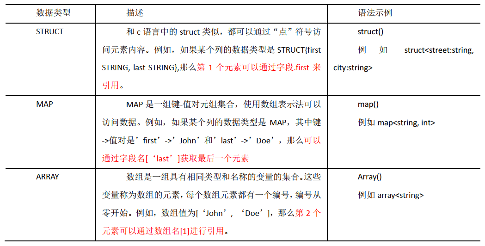

# HiveNotes

## Remark

- [Hive 官网地址](http://hive.apache.org/)

- Hive可以理解为hadoop的一个客户端
  - 存储用hdfs
  - 计算默认用mr，也可以选择：spark, tez
    - 写HQL，可以转化为mr执行
  
- 元数据的存储为什么使用mysql
  - 默认元数据库derby，不支持多用户
    - 在同一目录开启的hive，不支持多用户(查询报错)
    - 在两个不同的目录开启的hive，查询不报错，但元数据不共享，不属于多用户。
  - mysql支持多用户
  
- hive暴露的端口：9083
  - .xml  这种site文件属于静态资源，不会动态加载，(要想生效，重启客户端)
  
    ```xml
    <!-- 指定存储元数据要连接的地址 -->
    <property>
        <name>hive.metastore.uris</name>
        <value>thrift://l9z102:9083</value>
    </property>
    ```

- Hive的日志储存位置

  - 默认：/tmp/用户名/hive.log

    ```
    property.hive.log.dir = ${sys:java.io.tmpdir}/${sys:user.name}
    property.hive.log.file = hive.log
    ```

  - 修改    mv   hive-log4j2.properties.template   hive-log4j2.properties  (template是模板文件不会加载)

    ```
    property.hive.log.dir = /opt/module/hive-3.1.2/logs
    property.hive.log.file = hive.log
    ```

- 元数据库(metastore)中的表

  - TBLS  -  tbls  ~  tables
  - TABLE-PARAMS  -  table-params   (和 desc formatted table_name; 显示的结果一致)
  - DBS  -  dbs  ~  databases

- Hive 的 日志信息，放在`/opt/module/hive-3.1.2/logs`文件夹中

  每天会生成一个hive.log文件，凌晨之后，会将昨天的日志文件`hive.log`改名为`hive.log-日期`，

  然后重新生成一个hive.log文件记录今天的日志信息。

- <span style="color:blue; font-weight:bold">hive on spark 配置</span>

  - 节点上配置hive和spark

  - 配置SPARK_HOME环境变量

  - 在hive中创建spark配置文件

    `vim /opt/module/hive/conf/spark-defaults.conf`

    ```
    spark.master                yarn
    spark.eventLog.enabled      true
    spark.eventLog.dir          hdfs://l9z102:8020/spark-yarn/directory
    spark.executor.memory       1g
    spark.driver.memory         1g
    ```

    > `hdfs://l9z102:8020/spark-yarn/directory`路径要事先创建出来

  - 向HDFS上传Spark纯净版jar包  -  电商P82 - 14：00

    > [java.lang.NoClassDefFoundError: org/apache/hadoop/hive/ql/metadata/HiveException when query in spark-shell (qiniu.com)](https://www.qiniu.com/qfans/qnso-67632430)


## Hive 基本概念

### hive 简介  

- Hive：由 Facebook 开源用于解决海量<span style="color:blue; font-weight:bold">结构化</span>日志的数据统计工具。
- Hive 是基于 Hadoop 的一个**数据仓库**工具，可以将结构化的数据文件映射为一张表，并提供类 SQL 查询功能。  

### Hive 本质

- 将 HQL 转化成 MapReduce 程序  

（1） Hive 处理的数据存储在 HDFS

（2） Hive 分析数据底层的实现是 MapReduce

（3） 执行程序运行在 Yarn 上  

### Hive 的优缺点


### Hive 架构原理 (重点)


> metastore 和 HDFS 两个创建产生的顺序没有规定，只要两个同时存在，就可以写HQL

- 用户接口： Client  

  CLI（command-line interface）、 JDBC/ODBC(jdbc 访问 hive)、 WEBUI（浏览器访问 hive）  

- <span style="color:blue; font-weight:bold">元数据</span>： Metastore  

  元数据包括：表名、表所属的数据库（默认是 default）、表的拥有者、列/分区字段、表的类型（是否是外部表）、表的数据所在目录等；默认存储在自带的 derby 数据库中，推荐使用 MySQL 存储 Metastore  

- Hadoop  

  使用 HDFS 进行存储，使用 MapReduce 进行计算。  

- 驱动器： Driver  
  - （1）解析器（SQL Parser）：将 SQL 字符串转换成抽象语法树 AST，这一步一般都用第三方工具库完成，比如 antlr；对 AST 进行语法分析，比如表是否存在、字段是否存在、 SQL语义是否有误。
  - （2）编译器（Physical Plan）：将 AST 编译生成逻辑执行计划。
  - （3）优化器（Query Optimizer）：对逻辑执行计划进行优化。
  - （4）执行器（Execution）：把逻辑执行计划转换成可以运行的物理计划。对于 Hive 来说， 就是 MR/Spark。  

> Hive 通过给用户提供的一系列交互接口，接收到用户的指令(SQL)，使用自己的 Driver，结合元数据(MetaStore)，将这些指令翻译成 MapReduce，提交到 Hadoop 中执行，最后，将执行返回的结果输出到用户交互接口。  

### Hive 和数据库比较  

由于 Hive 采用了类似 SQL 的查询语言 HQL(Hive Query Language)， 因此很容易将 Hive 理解为数据库。其实从结构上来看， Hive 和数据库除了拥有类似的查询语言，再无类似之处。数据库可以用在 Online 的应用中，但是Hive 是为数据仓库而设计的。(清楚这一点，有助于从应用角度理解 Hive 的特性)

- 查询语言  

  由于 SQL 被广泛的应用在数据仓库中。因此，专门针对 Hive 的特性设计了类 SQL 的查询语言 HQL。熟悉 SQL 开发的开发者可以很方便的使用 Hive 进行开发。  

- 数据更新  

  由于 Hive 是针对数据仓库应用设计的，而数据仓库的内容是<span style="color:blue; font-weight:bold">读多写少</span>的。 因此， Hive 中不建议对数据的改写，所有的数据都是在加载的时候确定好的。 

  而数据库中的数据通常是需要经常进行修改的，因此可以使用 INSERT INTO … VALUES 添加数据，使用 UPDATE … SET 修改数据。

-  执行延迟  

  Hive 在查询数据的时候，由于没有索引，需要扫描整个表，因此延迟较高。另外一个导致 Hive 执行延迟高的因素是 MapReduce 框架。由于 MapReduce 本身具有较高的延迟，因此在利用 MapReduce 执行 Hive 查询时，也会有较高的延迟。相对的，数据库的执行延迟较低。当然，这个低是有条件的，即数据规模较小，当数据规模大到超过数据库的处理能力的时候，Hive 的并行计算显然能体现出优势。  

- 数据规模  

  由于 Hive 建立在集群上并可以利用 MapReduce 进行并行计算，因此可以支持<span style="color:blue; font-weight:bold">很大规模的数据</span>；对应的，数据库可以支持的数据规模较小。  

## Hive安装

- 见讲义（尚硅谷大数据技术之Hive.pdf）—   第2章Hive安装

### Hive安装地址

- [Hive 官网地址](http://hive.apache.org/)
- [文档查看地址](https://cwiki.apache.org/confluence/display/Hive/GettingStarted)
- [下载地址]([Index of /dist/hive (apache.org)](http://archive.apache.org/dist/hive/))

### Hive安装部署

- 解压压缩包

- 配置环境变量

- 解决日志Jar包冲突

  ```shell
  mv $HIVE_HOME/lib/log4j-slf4j-impl-2.10.0.jar  $HIVE_HOME/lib/log4j-slf4j-impl-2.10.0.bak
  ```

- 初始化元数据

  `bin/schematool -dbType derby -initSchema  `

  > 默认元数据存储在derby数据库，属于内置数据库，无法查看
  >
  > 使用derby数据库缺点：**默认是单用户模式，**
  >
  > - Hive 默认使用的元数据库为 derby，开启 Hive 之后就会占用元数据库， 且不与其他客户端共享数据，
  > -  所以我们需要将 Hive 的元数据地址改为 MySQL。  

### 安装部署MySQL

### Hive 元数据配置到 MySQL  

- 在$HIVE_HOME/conf 目录下新建 hive-site.xml 文件  

  ```xml
  <?xml version="1.0"?>
  <?xml-stylesheet type="text/xsl" href="configuration.xsl"?>
  <configuration>
  	<!-- jdbc 连接的 URL -->
  	<property>
  		<name>javax.jdo.option.ConnectionURL</name>
  		<value>jdbc:mysql://l9z102:3306/metastore?useSSL=false</value>
  	</property>
  	<!-- jdbc 连接的 Driver-->
  	<property>
  		<name>javax.jdo.option.ConnectionDriverName</name>
  		<value>com.mysql.jdbc.Driver</value>
  	</property>
  	<!-- jdbc 连接的 username-->
  	<property>
  		<name>javax.jdo.option.ConnectionUserName</name>
  		<value>root</value>
  	</property>
  	<!-- jdbc 连接的 password -->
  	<property>
  		<name>javax.jdo.option.ConnectionPassword</name>
  		<value>li123...</value>
  	</property>
  	<!-- Hive 元数据存储版本的验证 -->
  	<property>
  		<name>hive.metastore.schema.verification</name>
  		<value>false</value>
  	</property>
  	<!--元数据存储授权-->
  	<property>
  		<name>hive.metastore.event.db.notification.api.auth</name>
  		<value>false</value>
  	</property>
  	<!-- Hive 默认在 HDFS 的工作目录 -->
  	<property>
  		<name>hive.metastore.warehouse.dir</name>
  		<value>/user/hive/warehouse</value>
  	</property>
      <!-- 配置到这里   -->
  
  	
      
      
  	<!-- 指定存储元数据要连接的地址 -->
  	<!--
  	<property>
      		<name>hive.metastore.uris</name>
      		<value>thrift://l9z102:9083</value>
  	</property>
  	-->
  
  	<!-- 指定 hiveserver2 连接的 host -->
  	<!--
  	<property>
      		<name>hive.server2.thrift.bind.host</name>
      		<value>l9z102</value>
  	</property>
  	-->
  	<!-- 指定 hiveserver2 连接的端口号 -->
  	<!--
  	<property>
      		<name>hive.server2.thrift.port</name>
      		<value>10000</value>
  	</property>
  	-->
  
  	<!-- 打印 当前库 和 表头  -->
      <property>
          <name>hive.cli.print.header</name>
          <value>true</value>
      </property>
      <property>
          <name>hive.cli.print.current.db</name>
          <value>true</value>
      </property>
  
  </configuration>
  ```

- 登录MySQL，新建 Hive 元数据库 

  `create database metastore;  `

  > <span style="color:blue; font-weight:bold">metastore 和 配置文件 hive-site.xml 中的库名保持一致即可</span>

- 初始化 Hive 元数据库  

  ```
  bin/schematool -initSchema -dbType mysql -verbose
  ```

- 启动 Hive ，就可以多用户使用Hive

> 总结：
>
> - 在hive中能否查到数据，主要看两个点
>
>   - 元数据是否存在 - 建表
>
>   - hdfs数据是否存在 - 放数据
>
>     > 建表和放数据的顺序不定，只要两者都存在即可。

### 使用元数据服务的方式访问 Hive*

> Remark:
>
> - hive的两个服务：元数据(metastore  )服务，hiveserver2服务
>   - hiveserver2服务  ：提供一个接口，用JDBC 连接
>   - 元数据(metastore  )服务  ：第三方软件连接hive

- 在 hive-site.xml 文件中添加如下配置信息  

  ```xml
  <!-- 指定存储元数据要连接的地址 -->
  <!-- 配置这个，客户端通过元数据访问hive -->
  <property>
      <name>hive.metastore.uris</name>
      <value>thrift://l9z102:9083</value>
  </property>
  ```

  > 注意：配置了这个端口，就必须使用(<span style="color:blue; font-weight:bold">开启元数据服务</span>)，不能再使用`hive`直接连接了
  >
  > 设置端口号的目的是供第三方连接hive

- 启动 metastore  （前台程序）-   后面可以调整为后台程序

  ```shell
  hive --service metastore
  ```

  > 注意: 启动后窗口不能再操作，需打开一个新的 shell 窗口做别的操作  

- 启动 hive  

  ```shell
  bin/hive
  
  # 就可以使用了
  ```

### 使用 JDBC 方式访问 Hive*

> - 修改配置文件 - hive-site.xml
> - 启动元数据服务  -  前台进程
> - 启动hiveserver2服务  -  前台进程，需要多等一会，校验
> - jdbc连接：`beeline -u jdbc:hive2://l9z102:10000 -n lijzh`

- 修改hive-site.xml - 添加以下配置

  ```xml
  <!-- 指定存储元数据要连接的地址 -->
  <property>
      <name>hive.metastore.uris</name>
      <value>thrift://l9z102:9083</value>
  </property>
  
  <!-- 指定 hiveserver2 连接的 host -->
  <property>
      <name>hive.server2.thrift.bind.host</name>
      <value>l9z102</value>
  </property>
  
  <!-- 指定 hiveserver2 连接的端口号 -->
  <property>
      <name>hive.server2.thrift.port</name>
      <value>10000</value>
  </property>
  ```

- 启动元数据服务

  ```shell
  hive --service metastore
  ```

- 启动 hiveserver2   

  ```shell
  bin/hive --service hiveserver2
  ```

  > 启动后，需要多等一会。

- 启动 beeline 客户端  

  ```shell
  bin/beeline -u jdbc:hive2://l9z102:10000 -n lijzh
  ```

  > jdbc连接的格式：driver，url，username，password

- 看到如下界面  

  ```shell
  Connecting to jdbc:hive2://l9z102:10000
  Connected to: Apache Hive (version 3.1.2)
  Driver: Hive JDBC (version 3.1.2)
  Transaction isolation: TRANSACTION_REPEATABLE_READ
  Beeline version 3.1.2 by Apache Hive
  0: jdbc:hive2://l9z102:10000>
  
  # 这样就可以写HQL了
  ```

- 编写 hive 服务启动脚本  -  P12 详细讲解，后面回来看

  > 将前台进程，转到后台进程

  hive 服务启动脚本  -  bin/hiveservice.sh

  > P12 - 功能：将元数据服务和hiveserver2服务 后台启动，需要多等一会
  >
  > - hiveservice.sh start  -  启动
  > - hiveservice.sh status  -  查看启动状态
  >   - Metastore 服务运行正常
  >   - HiveServer2 服务运行正常
  > - hiveservice.sh stop  -  停止服务

  ```shell
  # hive 服务启动脚本
  # P12 讲解脚本内容
  
  #!/bin/bash
  HIVE_LOG_DIR=$HIVE_HOME/logs
  if [ ! -d $HIVE_LOG_DIR ]
  then
  	mkdir -p $HIVE_LOG_DIR
  fi
  
  #检查进程是否运行正常，参数 1 为进程名，参数 2 为进程端口
  function check_process()
  {
  	pid=$(ps -ef 2>/dev/null | grep -v grep | grep -i $1 | awk '{print$2}')
  	ppid=$(netstat -nltp 2>/dev/null | grep $2 | awk '{print $7}' | cut -d '/' -f 1)
  	echo $pid
  	[[ "$pid" =~ "$ppid" ]] && [ "$ppid" ] && return 0 || return 1
  }
  
  function hive_start()
  {
  	metapid=$(check_process HiveMetastore 9083)
  	cmd="nohup hive --service metastore >$HIVE_LOG_DIR/metastore.log 2>&1
  &"
  	[ -z "$metapid" ] && eval $cmd || echo "Metastroe 服务已启动"
  	server2pid=$(check_process HiveServer2 10000)
  	cmd="nohup hiveserver2 >$HIVE_LOG_DIR/hiveServer2.log 2>&1 &"
  	[ -z "$server2pid" ] && eval $cmd || echo "HiveServer2 服务已启动"
  }
  
  function hive_stop()
  {
  	metapid=$(check_process HiveMetastore 9083)
  	[ "$metapid" ] && kill $metapid || echo "Metastore 服务未启动"
  	server2pid=$(check_process HiveServer2 10000)
  	[ "$server2pid" ] && kill $server2pid || echo "HiveServer2 服务未启动"
  }
  case $1 in
  "start")
  	hive_start
  ;;
  "stop")
  	hive_stop
  ;;
  "restart")
  	hive_stop
  	sleep 2
  	hive_start
  ;;
  "status")
  	check_process HiveMetastore 9083 >/dev/null && echo "Metastore 服务运行正常" || echo "Metastore 服务运行异常"
  	check_process HiveServer2 10000 >/dev/null && echo "HiveServer2 服务运行正常" || echo "HiveServer2 服务运行异常"
  ;;
  *)
  	echo Invalid Args!
  	echo 'Usage: '$(basename $0)' start|stop|restart|status'
  ;;
  esac
  ```

- 总<span style="color:blue; font-weight:bold">hive-site.xml</span>文件

  ```xml
  <!--  hive-site.xml 文件 -->
  
  <?xml version="1.0"?>
  <?xml-stylesheet type="text/xsl" href="configuration.xsl"?>
  <configuration>
          <!-- jdbc 连接的 URL -->
          <property>
              <name>javax.jdo.option.ConnectionURL</name>
              <value>jdbc:mysql://l9z102:3306/metastore?useSSL=false</value>
          </property>
          <!-- jdbc 连接的 Driver-->
          <property>
                  <name>javax.jdo.option.ConnectionDriverName</name>
                  <value>com.mysql.jdbc.Driver</value>
          </property>
          <!-- jdbc 连接的 username-->
          <property>
                  <name>javax.jdo.option.ConnectionUserName</name>
                  <value>root</value>
          </property>
          <!-- jdbc 连接的 password -->
          <property>
                  <name>javax.jdo.option.ConnectionPassword</name>
                  <value>li123...</value>
          </property>
          <!-- Hive 元数据存储版本的验证 -->
          <property>
                  <name>hive.metastore.schema.verification</name>
                  <value>false</value>
          </property>
          <!--元数据存储授权-->
          <property>
                  <name>hive.metastore.event.db.notification.api.auth</name>
                  <value>false</value>
          </property>
          <!-- Hive 默认在 HDFS 的工作目录 -->
          <property>
                  <name>hive.metastore.warehouse.dir</name>
                  <value>/user/hive/warehouse</value>
          </property>
  
  
          <!-- 指定存储元数据要连接的地址 -->
          <!--
          <property>
                  <name>hive.metastore.uris</name>
                  <value>thrift://l9z102:9083</value>
          </property>
          -->
  
          <!-- 指定 hiveserver2 连接的 host -->
          <!--
          <property>
                  <name>hive.server2.thrift.bind.host</name>
                  <value>l9z102</value>
          </property>
          -->
          <!-- 指定 hiveserver2 连接的端口号 -->
          <!--
          <property>
                  <name>hive.server2.thrift.port</name>
                  <value>10000</value>
          </property>
          -->
  
          <!-- 打印 当前库 和 表头  -->
          <property>
                  <name>hive.cli.print.header</name>
                  <value>true</value>
          </property>
          <property>
                  <name>hive.cli.print.current.db</name>
                  <value>true</value>
          </property>
  
  </configuration>
  ```

  > 1、文件中设置了”Hive 默认在 HDFS 的工作目录“
  >
  > 2、 jdbc 连接的 Driver 区分 mysql5.7 和 mysql8.0 
  
- <span style="color:blue; font-weight:bold">Hive日志存储位置</span>

  修改  `mv hive-log4j2.properties.template hive-log4j2.properties`  (template是模板文件不会加载)

  > 默认hive日志放在 `/tmp/$user/hive.log`
  >
  > > 生成方式，当天的日志存储在hive.log，零点的时候，会变成hive.log.xxxx-xx-xx，然后再生成一个新的hive.log
  > >
  > > > 这样的存储方式，可能会存在零点漂移问题
  >
  > 通过配置文件，修改hive日志的存储地址
  
  `hive-log4j2.properties`
  
  ```properties
  # Licensed to the Apache Software Foundation (ASF) under one
  # or more contributor license agreements.  See the NOTICE file
  # distributed with this work for additional information
  # regarding copyright ownership.  The ASF licenses this file
  # to you under the Apache License, Version 2.0 (the
  # "License"); you may not use this file except in compliance
  # with the License.  You may obtain a copy of the License at
  #
  #     http://www.apache.org/licenses/LICENSE-2.0
  #
  # Unless required by applicable law or agreed to in writing, software
  # distributed under the License is distributed on an "AS IS" BASIS,
  # WITHOUT WARRANTIES OR CONDITIONS OF ANY KIND, either express or implied.
  # See the License for the specific language governing permissions and
  # limitations under the License.
  
  status = INFO
  name = HiveLog4j2
  packages = org.apache.hadoop.hive.ql.log
  
  # list of properties
  property.hive.log.level = INFO
  property.hive.root.logger = DRFA
  # ----------------------修改这个信息，更改hive日志存储位置--------------------------------
  property.hive.log.dir = /opt/module/hive-3.1.2/logs     
  # -----------------------------------------------------------------------------------
  property.hive.log.file = hive.log
  property.hive.perflogger.log.level = INFO
  
  # list of all appenders
  appenders = console, DRFA
  
  # console appender
  appender.console.type = Console
  appender.console.name = console
  appender.console.target = SYSTEM_ERR
  appender.console.layout.type = PatternLayout
  appender.console.layout.pattern = %d{ISO8601} %5p [%t] %c{2}: %m%n
  
  # daily rolling file appender
  appender.DRFA.type = RollingRandomAccessFile
  appender.DRFA.name = DRFA
  appender.DRFA.fileName = ${sys:hive.log.dir}/${sys:hive.log.file}
  # Use %pid in the filePattern to append <process-id>@<host-name> to the filename if you want separate log files for different CLI session
  appender.DRFA.filePattern = ${sys:hive.log.dir}/${sys:hive.log.file}.%d{yyyy-MM-dd}
  appender.DRFA.layout.type = PatternLayout
  appender.DRFA.layout.pattern = %d{ISO8601} %5p [%t] %c{2}: %m%n
  appender.DRFA.policies.type = Policies
  appender.DRFA.policies.time.type = TimeBasedTriggeringPolicy
  appender.DRFA.policies.time.interval = 1
  appender.DRFA.policies.time.modulate = true
  appender.DRFA.strategy.type = DefaultRolloverStrategy
  appender.DRFA.strategy.max = 30
  
  # list of all loggers
  loggers = NIOServerCnxn, ClientCnxnSocketNIO, DataNucleus, Datastore, JPOX, PerfLogger, AmazonAws, ApacheHttp
  
  logger.NIOServerCnxn.name = org.apache.zookeeper.server.NIOServerCnxn
  logger.NIOServerCnxn.level = WARN
  
  logger.ClientCnxnSocketNIO.name = org.apache.zookeeper.ClientCnxnSocketNIO
  logger.ClientCnxnSocketNIO.level = WARN
  
  logger.DataNucleus.name = DataNucleus
  logger.DataNucleus.level = ERROR
  
  logger.Datastore.name = Datastore
  logger.Datastore.level = ERROR
  
  logger.JPOX.name = JPOX
  logger.JPOX.level = ERROR
  
  logger.AmazonAws.name=com.amazonaws
  logger.AmazonAws.level = INFO
  
  logger.ApacheHttp.name=org.apache.http
  logger.ApacheHttp.level = INFO
  
  logger.PerfLogger.name = org.apache.hadoop.hive.ql.log.PerfLogger
  logger.PerfLogger.level = ${sys:hive.perflogger.log.level}
  
  # root logger
  rootLogger.level = ${sys:hive.log.level}
  rootLogger.appenderRefs = root
  rootLogger.appenderRef.root.ref = ${sys:hive.root.logger}
  ```

### Hive 常用交互命令


- “-e”  不进入 hive 的交互窗口执行 sql 语句  
  - hive -e "select id from student;"  
- “-f”  执行脚本中 sql 语句  
  - touch  hivef.sql 
  - select  * from  student; 
  - hive  -f  hivef.sql 
  - 执行文件中的 sql 语句并将结果写入文件中  
    - hive  -f  hivef.sql  >  hive_result.txt  

### Hive其他配置

- 表头和库头 - 在hive-site.xml中添加以下信息

  ```xml
  <property>
      <name>hive.cli.print.header</name>
      <value>true</value>
  </property>
  <property>
      <name>hive.cli.print.current.db</name>
      <value>true</value>
  </property>
  ```

- 更改日志位置

  - Hive 的 log 默认存放在/tmp/lijzh/hive.log 目录下（lijzh为当前用户名）  

  - 自定义hive.log位置

    - 把 hive-log4j2.properties.template 模板文件重命名为： hive-log4j2.properties  

    - 在 hive-log4j2.properties 文件中修改 log 存放位置  

      hive.log.dir=/opt/module/hive/logs  （自定义目录）


### 参数配置方式  

- 参数的配置三种方式

  - （1）配置文件方式  
  - （2）命令行参数方式  
  - （3）参数声明方式  

  > 上述三种设定方式的优先级依次递增。即配置文件<命令行参数<参数声明。注意某些系统级的参数，例如 log4j 相关的设定，必须用前两种方式设定，因为那些参数的读取在会话建立以前已经完成了。  

### 总结

- hive：用sql操作hdfs
- 优缺点
- hive框架
  - 元数据(metastore) 和 HDFS 同时存在，就可以写HQL
  - 元数据(metastore) 存储在Mysql中，HDFS中存储数据(可以任意方式上传)
  - ”hive写创建表的语句，其实是在Mysql中创建了元数据“

- 安装中的问题

  - hive的元数据默认存储在derby中；

    - 利用derby数据库建元数据时，元数据库和日志将在当前目录生成，故元数据不共享，不属于多用户模式

  - myqsl安装

    - 需要先卸载系统自带的mysql

      sudo rpm -e --nodeps mariadb-libs  

    - mysql配置文件my.cnf

      /etc/my.cnf

      datadir=/var/lib/mysql        （数据库存储的目录）

    - 初始化数据库

      sudo mysqld --initialize --user=mysql  

    - 数据库日志地址

      sudo cat /var/log/mysqld.log  

    - 远程连接mysql，要修改 mysql 库下的 user 表中的 root 用户允许任意 ip 连接  

      update mysql.user set host='%' where user='root';  

      flush privileges;    刷新

- 使用元数据服务的方式访问 Hive  

- 使用 JDBC 方式访问 Hive  

  - 配置hiveserver2 

  - 启动hiveserver2 （启动后，要多等一会，初始化时间比较久）

  - 启动 beeline 客户端  

    > 配置了hiveserver2，如果不使用 beeline连接，就可以<span style="color:blue; font-weight:bold">不启动hiveserver2 </span>；如果使用 beeline连接，不仅要启动hiveserver2，也要启动metastore
    >
    > 也就是说，即使配置hiveserver2，也可以只启动metastore，用hive连接

> 以上两种访问Hive，主要是给第三方用的。如果没有第三方访问Hive，不必使用。

- Hive交互命令

  - -e  不进入 hive 的交互窗口执行 sql 语句  

  - -f    执行脚本中 sql 语句  

    > Hive交互命令，主要用于写脚本。

- 

- 

- 驱动找不到，一般就是驱动包没有放到指定目录（第三框架目录）


## Hive 数据类型

### 基本数据类型


> 对于 Hive 的 String 类型相当于数据库的 varchar 类型，该类型是一个可变的字符串，不过它不能声明其中最多能存储多少个字符，理论上它可以存储 2GB 的字符数。  

### 集合数据类型



> Hive 有三种复杂数据类型 ARRAY、 MAP 和 STRUCT。 ARRAY 和 MAP 与 Java 中的 Array和 Map 类似，而 STRUCT 与 C 语言中的 Struct 类似，它封装了一个命名字段集合，复杂数据类型允许任意层次的嵌套。 

- 案例实操

  - 假设某表有如下一行， 我们用 JSON 格式来表示其数据结构。在 Hive 下访问的格式为  

    ```json
    {
        "name": "songsong",
        "friends": ["bingbing" , "lili"] ,    //列表 Array,
        "children": {                         //键值 Map,
            "xiao song": 18 ,
            "xiaoxiao song": 19
        }
        "address": {                          //结构 Struct,
            "street": "hui long guan",
            "city": "beijing"
        }
    }
    ```

  - 基于上述数据结构， 我们在 Hive 里创建对应的表， 并导入数据。
    创建本地测试文件 test.txt  

    ```
    songsong,bingbing_lili,xiao song:18_xiaoxiao song:19,hui long guan_beijing
    yangyang,caicai_susu,xiao yang:18_xiaoxiao yang:19,chao yang_beijing
    ```

    > 注意： MAP， STRUCT 和 ARRAY 里的元素间关系都可以用同一个字符表示， 这里用“_”。  

  - Hive 上创建测试表 test  

    ```mysql
    create table test22(
        name string,
        friends array<string>,
        children map<string, int>,
        address struct<street:string, city:string>
    )
    row format delimited 
    fields terminated by ','
    collection items terminated by '_'
    map keys terminated by ':'
    lines terminated by '\n';    
    # 最后一个可以不写，默认换行符就是'\n'
    ```

    > row format delimited 
    >
    > 字段之间用 ',' 隔开
    >
    > fields terminated by ','
    >
    > 每个字段的多个内容用 '_' 隔开
    >
    > collection items terminated by '_'
    >
    > map中的键值用 ':' 隔开
    >
    > map keys terminated by ':'
    >
    > 默认换行符
    >
    > lines terminated by '\n';

  - 访问三种集合列里的数据

    ```mysql
    select friends[1],children['xiao song'],address.city 
    from test
    where name="songsong";
    ```

- 类型转化  

  Hive 的原子数据类型是可以进行隐式转换的，类似于 Java 的类型转换，例如某表达式使用 INT 类型， TINYINT 会自动转换为 INT 类型，但是 Hive 不会进行反向转化，例如，某表达式使用 TINYINT 类型， INT 不会自动转换为 TINYINT 类型，它会返回错误，除非使用 CAST操作。  

  - 隐式类型转换规则如下  
    - 任何整数类型都可以隐式地转换为一个范围更广的类型，如 TINYINT 可以转换成INT， INT 可以转换成 BIGINT。
    - 所有整数类型、 FLOAT 和<span style="color:blue; font-weight:bold"> STRING</span> 类型都可以隐式地转换成 DOUBLE。
    - TINYINT、 SMALLINT、 INT 都可以转换为 FLOAT。
    - BOOLEAN 类型不可以转换为任何其它的类型。  
  - 可以使用 CAST 操作显示进行数据类型转换  
    - 例如 CAST('1' AS INT)将把字符串'1' 转换成整数 1；如果强制类型转换失败，如执行CAST('X' AS INT)，表达式返回空值 NULL。  

> 电商数仓之复习集合数据类型
>
> - array
>   - 定义： arr  array<string>
>   - 取值：arr[0]
>   - 构造：array(v1, v2, v3,...)   split()   collect_set()
> - map
>   - 定义：map1  map<int, string>
>   - 取值：map1[key]
>   - 构造：map(k1, v1, k2, v2, ...)   str_to_map(text, [delimiter1, delimiter2]) delimiter1大分割，delimiter2分割每个K-V
>
> - struct
>   - 定义：struct1  struct<id: int, name: string>
>   - 取值：struct1.id
>   - 构造：named_struct(name1, val1, name2, val2, ...)
>
> 构造集合数据类型，见：[LanguageManual UDF - Apache Hive - Apache Software Foundation](https://cwiki.apache.org/confluence/display/Hive/LanguageManual+UDF#LanguageManualUDF-ComplexTypeConstructors)

## 第 4 章  DDL 数据定义

参考Mysql中的定义：

- <span style="color:blue; font-weight:bold">DDL（Data Definition Languages、数据定义语言）</span>，这些语句定义了不同的数据库、表、视图、索引等数据库对象，还可以用来创建、删除、修改数据库和数据表的结构。

- 主要的语句关键字包括 CREATE 、 DROP 、 ALTER 等。

### 创建数据库

```mysql
CREATE DATABASE [IF NOT EXISTS] database_name
[COMMENT database_comment]   # 数据库的简介
[LOCATION hdfs_path]         # 当前库的储存位置
[WITH DBPROPERTIES (property_name=property_value, ...)];

# []可选项
```

> 数据库在 HDFS 上的默认存储路径是/user/hive/warehouse/*.db。  
>
> 其中，/user/hive/warehouse/是配置文件

- 创建一个数据库，指定数据库在 HDFS 上存放的位置  

```mysql
create database db_hive2 location '/db_hive2.db';
# '/db_hive2.db';   hdfs的位置(目录)
```

### 查询数据库

- 切换数据库

  ```mysql
  use db_name;
  ```

- 显示数据库

  ```mysql
  show databases;
  ```

- 过滤显示查询的数据库  

  ```mysql
   show databases like 'db_hive*';
  ```

- 显示数据库信息 

  ```mysql
  desc database db_name;
  ```

- 显示数据库详细信息， extended  

  ```mysql
  desc database extended db_name;
  ```

### 修改数据库

- 用户可以使用 ALTER DATABASE 命令为某个数据库的 DBPROPERTIES 设置键-值对属性值，来描述这个数据库的属性信息。 

  ```mysql
  alter database db_name
  set dbproperties('createtime'='20170830');
  ```

  > 使用 desc database extended db_name; 可以查看

### 删除数据库

- 删除空数据库

  ```mysql
  drop database [if exists] db_name;
  ```

  >如果数据库不为空，则删除报错

- 强制删除数据库   -   cascade

  ```mysql
  drop database [if exists] db_hive cascade;
  ```

### 创建表

- 创建表

  ```mysql
  CREATE [EXTERNAL] TABLE [IF NOT EXISTS] table_name
  (col_name data_type [COMMENT col_comment], ...)
  [COMMENT table_comment]                        # 为表和列添加注释。
  [PARTITIONED BY (col_name data_type [COMMENT col_comment], ...)]
  [CLUSTERED BY (col_name, col_name, ...)
  [SORTED BY (col_name [ASC|DESC], ...)] INTO num_buckets BUCKETS]
  [ROW FORMAT row_format]
  [STORED AS file_format]
  [LOCATION hdfs_path]
  [TBLPROPERTIES (property_name=property_value, ...)]
  [AS select_statement]
  ```

  > EXTERNAL    外部表，不加默认内部表
  >
  > PARTITIONED BY    分区表
  >
  > CLUSTERED BY    分桶表
  >
  > [SORTED BY (col_name [ASC|DESC], ...)] INTO num_buckets BUCKETS]    分桶表的设置 - 不常用
  >
  > [ROW FORMAT row_format]    定义行的格式
  >
  > ```mysql
  > ROW FORMAT row_format DELIMITED 
  > [FIELDS TERMINATED BY char] 
  > [COLLECTION ITEMS TERMINATED BY char]
  > [MAP KEYS TERMINATED BY char] 
  > [LINES TERMINATED BY char]
  > | SERDE serde_name [WITH SERDEPROPERTIES (property_name=property_value,property_name=property_value, ...)]
  > # 实例见上  -  集合数据类型的实操案例
  > ```
  >
  > [STORED AS file_format]    指定文件格式
  >
  > - 常用的存储文件类型： SEQUENCEFILE（二进制序列文件）、 TEXTFILE（文本）、 RCFILE（列式存储格式文件）
  >   如果文件数据是纯文本，可以使用STORED AS TEXTFILE。如果数据需要压缩，使用 STOREDAS SEQUENCEFILE。  
  >
  > [LOCATION hdfs_path]    指定表的位置信息，默认：库的位置建表。
  >
  > > 注意，使用LOCATION时，最后的位置和库名保持一致
  > >
  > > 经验技巧：
  > >
  > > ```mysql
  > > create table if not exists test01
  > > location '/hive/test01.db'
  > > 
  > > # 这里最后的位置test01.db，尽量和库名test01，保持一致。
  > > ```
  >
  > [TBLPROPERTIES (property_name=property_value, ...)]    额外的属性
  >
  > [AS select_statement]    把某个查询的内容作为建表的内容
  >
  > LIKE    允许用户复制现有的表结构，但是不复制数据。  

- 管理表  

  默认创建的表都是所谓的<span style="color:blue; font-weight:bold">管理表</span>，有时也被称为<span style="color:blue; font-weight:bold">内部表</span>。  

  <span style="color:red; font-weight:bold">当我们删除一个管理表时， Hive 也会删除这个表中数据</span>。 管理表不适合和其他工具共享数据。  

- 外部表  

  表是外部表时， Hive 并非认为其完全拥有这份数据。<span style="color:red; font-weight:bold">删除外部表并不会删除掉表的数据，只是描述表的元数据信息会被删除掉</span>。  

- 管理表和外部表的使用场景

  每天将收集到的网站日志定期流入 HDFS 文本文件。在外部表（原始日志表）的基础上做大量的统计分析，用到的中间表、结果表使用内部表存储，数据通过 SELECT+INSERT 进入内部表。  

- 管理表与外部表的互相转换  

  - 查询表的类型  -  <span style="color:red; font-weight:bold">获取表的详细信息</span>

    ```mysql
    desc formatted table_name;
    ```

    ```shell
    col_name	data_type	comment
    # col_name            	data_type           	comment             
    name                	string              	                    
    friends             	array<string>       	                    
    children            	map<string,int>     	                    
    address             	struct<street:string,city:string>	                    
    	 	 
    # Detailed Table Information	 	 
    Database:           	demo002             	 
    OwnerType:          	USER                	 
    Owner:              	lijzh               	 
    CreateTime:         	Wed Nov 16 15:44:00 CST 2022	 
    LastAccessTime:     	UNKNOWN             	 
    Retention:          	0                   	 
    Location:           	hdfs://l9z102:8020/user/hive/warehouse/demo002.db/test22	 
    Table Type:         	MANAGED_TABLE       	 
    Table Parameters:	 	 
    	COLUMN_STATS_ACCURATE	{\"BASIC_STATS\":\"true\",\"COLUMN_STATS\":{\"address\":\"true\",\"children\":\"true\",\"friends\":\"true\",\"name\":\"true\"}}
    	bucketing_version   	2                   
    	numFiles            	0                   
    	numRows             	0                   
    	rawDataSize         	0                   
    	totalSize           	0                   
    	transient_lastDdlTime	1668584640          
    	 	 
    # Storage Information	 	 
    SerDe Library:      	org.apache.hadoop.hive.serde2.lazy.LazySimpleSerDe	 
    InputFormat:        	org.apache.hadoop.mapred.TextInputFormat	 
    OutputFormat:       	org.apache.hadoop.hive.ql.io.HiveIgnoreKeyTextOutputFormat	 
    Compressed:         	No                  	 
    Num Buckets:        	-1                  	 
    Bucket Columns:     	[]                  	 
    Sort Columns:       	[]                  	 
    Storage Desc Params:	 	 
    	collection.delim    	_                   
    	field.delim         	,                   
    	mapkey.delim        	:                   
    	serialization.format	,                   
    Time taken: 0.065 seconds, Fetched: 37 row(s)
    ```

  - 修改内部表为外部表  

    ```mysql
    alter table student2 set tblproperties('EXTERNAL'='TRUE');
    ```

  - 修改外部表为内部表  

    ```mysql
    alter table student2 set tblproperties('EXTERNAL'='FALSE');
    ```

    > 注意： <span style="color:blue; font-weight:bold">('EXTERNAL'='TRUE')</span>和<span style="color:blue; font-weight:bold">('EXTERNAL'='FALSE')</span>为固定写法， 区分大小写！  

- 创建表时，指定分隔符

  ```mysql
  create table test4(id int, name string)
  row format delimited fields terminated by ',';
  # 指定数据分隔符为，
  
  
  ··· Hive建表时提到的格式
  row format delimited 
  fields terminated by ','
  collection items terminated by '_'
  map keys terminated by ':'
  lines terminated by '\n';
  ···
  ```

### 修改表

- 重命名表名

  ```mysql
  ALTER TABLE tbl_name RENAME TO new_tbl_name
  ```

  > new_tbl_name 不能存在，否则报错。

- 增加、修改和删除表分区

  见后面章节 - 分区表基本操作  

- 增加/修改/替换列信息  -  列名和列的数据类型

  - 更新列  

    ```mysql
    ALTER TABLE table_name CHANGE [COLUMN] col_old_name col_new_name column_new_type 
    [COMMENT col_comment] [FIRST|AFTER column_name]
    ```

    > col_old_name col_new_name column_new_type 这三个参数必须有
    >
    > 如果只想改列名，就保留原来的列的数据类型
    >
    > 注意：这个修改还是有很多报错的地方，比如：string -> int 会报错；int -> string 可以。

  - 增加和替换列

    ```mysql
    ALTER TABLE table_name ADD|REPLACE COLUMNS (col_name data_type [COMMENT
    col_comment], ...)
    ```

    > 注： ADD 是代表新增一字段， 字段位置在所有列后面(partition 列前)，
    >         REPLACE 则是表示替换表中所有字段。  

  - REPLACE案例  -  可以充当删除的操作

    ```mysql
    alter table table_name replace columns (col_name col_type, ...);
    
    create table test7(id int, name string);
    hadoop fs -put test.txt /
    
    alter table test7 replace columns (id int);
    
    alter table test7 replace columns (id int, name string, class int);
    ```

### 删除表

```mysql
drop table table_name;
```

> 删除表时，注意内外表的区别
>
> 对于管理表(内部表)，删除元数据和数据内容
>
> 对于外部表，只会删除元数据，具体内容不会删除。

##  第 5 章 DML 数据操作

参考Mysql中的定义：

- <span style="color:blue; font-weight:bold">DML（Data Manipulation Language、数据操作语言）</span>，用于添加、删除、更新和查询数据库记录，并检查数据完整性。

- 主要的语句关键字包括 INSERT 、 DELETE 、 UPDATE 、 SELECT 等。SELECT是SQL语言的基础，最为重要。

### 数据导入

#### 向表中装载数据（Load）  

- 语法  

  ```mysql
  load data [local] inpath '数据的 path' [overwrite] into table student [partition (partcol1=val1,…)];
  ```

  - load data：表示加载数据 
  - local：表示从本地加载数据到 hive 表； 否则从 HDFS 加载数据到 hive 表
  - inpath：表示加载数据的路径  
  - overwrite：表示覆盖表中已有数据，否则表示添加（添加一个新文件）
  - into table：表示加载到哪张表  
  - student：表示具体的表
  - partition：表示上传到指定分区  

- 实操案例

  - 创建一张表  

    ```mysql
    create table student(
    id string, 
    name string) 
    row formatdelimited 
    fields terminated by '\t';
    ```

  - 加载本地文件到 hive 

    > 事先准备好student.txt文件

    ```mysql
    load data local inpath '/opt/module/hive/datas/student.txt' into table student;
    ```

  - 加载 HDFS 文件到 hive 中

    - 上传文件到 HDFS 

      > 事先准备好student1.txt文件

      ```shell
      hadoop fs -put student1.txt /user/hive/warehouse/tempdata
      ```

    - <span style="color:blue; font-weight:bold">加载 HDFS 上数据到 hive </span>

      ```mysql
      load data inpath '/user/atguigu/hive/student1.txt' into table student;
      ```

      > 这里其实是剪切功能，将 /user/atguigu/hive/student1.txt 剪切到了 student 表储存位置。
      >
      > > 其实，真正的数据没动，还是在 `hadoop-3.1.3/data/dfs/data/` 下面，
      > >
      > > 只是，namenode中的元数据修改了，
      > >
      > > 所以会感觉这个加载很快。
      >
      > 如果是本地加载，则会偏慢，因为它实际上是上传到 hdfs 中

  - 加载数据覆盖表中已有的数据

    > 事先准备好student2.txt文件

    ```mysql
    load data local inpath '/opt/module/hive/datas/student2.txt' overwrite into table student;
    ```

  > <span style="color:blue; font-weight:bold">总结： -   重要理解</span>
  >
  > 通过 <span style="color:red; font-weight:bold">`insert into`</span>加载到表中的数据，元数据中会记录numFiles，numRows；
  >
  > > insert into 会走mr任务；
  > >
  > > insert into 默认每次上传，在hdfs创建一个新文件；
  >
  > 通过 <span style="color:red; font-weight:bold">`load `</span> 加载到表中的数据，元数据(metastore)只会记录上传的文件数量(numFiles)；
  >
  > 通过 <span style="color:red; font-weight:bold">`hadoop fs -put`</span> 加载到表中的数据，元数据(metastore)不会记录；

#### 通过查询语句向表中插入数据（Insert）

- 创建一张表 

  ```mysql
  create table student_par(
  id int, 
  name string) 
  row format delimited 
  fields terminated by '\t';
  ```

- 基本插入数据    -    ~~这种方式太慢，一般开发中不会用~~

  ```mysql
  insert into table student_par values
  (1,'wangwu'),
  (2,'zhaoliu');
  ```

- 基本模式插入（根据单张表查询结果） -   这种还行

  ```mysql
  # insert into student_par   
  insert overwrite table student_par
  select id, name 
  from student 
  where month='201709';
  ```

  - insert into： 以追加数据的方式插入到表或分区， 原有数据不会删除

  - insert overwrite： 会覆盖表中已存在的数据
    注意： insert 不支持插入部分字段  

    > 对比：
    >
    > >  insert into [table] student_par
    > >
    > > insert overwrite table student_par
    > >
    > > into 可以省略table
    > >
    > > overwrite 不能省略table
    >
    > 接收表只有一个，查询表可以多个(用join连接)。

- 多表（多分区） 插入模式（根据多张表查询结果）  -   花里胡哨的

  ```mysql
  from student
  insert overwrite table student partition(month='201707')
  select id, name where month='201709'
  insert overwrite table student partition(month='201706')
  select id, name where month='201709';
  ```

  > 这里介绍表多个，查询表一个。
  >
  > 这里因为都是从 student 表中查询，所以 from 语句可以提前；
  >
  > 注意，这里只能往两个表(分区)里插入。

#### 查询语句中创建表并加载数据（As Select）

根据查询结果创建表（查询的结果会添加到新创建的表中）

```mysql
create table if not exists student3
as 
select id, name 
from student;
```

#### 创建表时通过 Location 指定加载数据路径  

- 上传数据到 hdfs 上

- 创建表，并指定在 hdfs 上的位置 

  ```mysql
  create external table if not exists student5(
  id int, 
  name string)
  row format delimited 
  fields terminated by '\t'
  location '/student;
  ```

#### Import 数据到指定 Hive 表中

> 用到第三方框架
>
> 注意： 先用 export 导出后， 再将数据导入。 

```mysql
import table student2
from '/user/hive/warehouse/export/student';
```

> 不是export 导出的数据，导入时会报错，缺少元信息文件。
>
> 对于使用import的要求：
>
> > 1、必须是export 导出的数据
> >
> > 2、被导入数据的表student2，<span style="color:blue; font-weight:bold">要么不存在</span>，<span style="color:blue; font-weight:bold">要么字段和要导入的数据字段一致。</span>

### 数据导出

#### Insert 导出  

- 将查询的结果导出到本地

  ```mysql
  insert overwrite local directory '/opt/module/hive/data/export/student'
  select * from student;
  ```

  > 会有格式错误，(分隔符)

- 将查询的结果格式化导出到<span style="color:blue; font-weight:bold">本地(local)</span>

  ```mysql
  insert overwrite local directory '/opt/module/hive/data/export/student1'
  ROW FORMAT DELIMITED 
  FIELDS TERMINATED BY '\t'
  select * from student;
  ```

- 将查询的结果导出到 <span style="color:blue; font-weight:bold">HDFS</span> 上(没有 local)

  ```mysql
  insert overwrite directory '/user/atguigu/student2'
  ROW FORMAT DELIMITED 
  FIELDS TERMINATED BY '\t'
  select * from student;
  ```

  > 走mr的时候，可以不用创建目标目录。

#### Hadoop 命令导出到本地

```shell
hadoop fs -get /user/hive/warehouse/student/student.txt /opt/module/data/export/student3.txt;
```

#### Hive Shell 命令导出

> 基本语法：（hive -f/-e 执行语句或者脚本 > file）  
>
> hive 的交互式命令 （见Hive安装 -- Hive 常用交互命令）

```mysql
hive -e 'select * from default.student;' > /opt/module/hive/data/export/student4.txt;
```

> 这种方式不用进到hive客户端中，就可以导出数据
>
> 但是可能会带有表头信息  -  （如果配置了表头，会连带表头一块导出到文件中）

#### Export 导出到 HDFS 上

```mysql
export table student
to '/user/hive/warehouse/export/student';
```

> export 和 import 主要用于两个 Hadoop 平台集群之间 Hive 表迁移。  
>
> export 导出的数据带有一个云信息文件，可以用于import导入
>
> <span style="color:red; font-weight:bold">用的比较少。</span>

#### Sqoop 导出

> 后续课程讲解
>
> 将数据导出到mysql

#### 清除表中数据（Truncate）

> 注意： Truncate 只能删除管理表， 不能删除外部表中数据  

```mysql
truncate table student;
```

> truncate 只删除hdfs数据，表的元数据还在；实际上就是把 hdfs 上该表目录下的文件删除了。
>
> 所以只能删除内部表，（cannot truncate non-managed table）
>
> 对于外部表，drop 都删除不了hdfs上的数据，truncate更不行。
>
> drop 对于外部表，只能删除元数据；
>
> drop 对于内部表，全删；

## 第 6 章 查询

- [LanguageManual Select - Apache Hive - Apache Software Foundation](https://cwiki.apache.org/confluence/display/Hive/LanguageManual+Select)

- 查询语法

  ```mysql
  SELECT [ALL | DISTINCT] select_expr, select_expr, ...
  FROM table_reference
  [WHERE where_condition]
  [GROUP BY col_list]
  [ORDER BY col_list]
  [CLUSTER BY col_list
  	| [DISTRIBUTE BY col_list] [SORT BY col_list]
  ]
  [LIMIT number]
  
  
  # mysql 中的查询语句顺序
  #   select
  #   from
  #   where
  #   group by
  #   having
  #   order by
  #   limit
  # SQL语句的执行过程：
  # FROM .-> ON -> (LEFT/RIGNT  JOIN) -> WHERE -> GROUP BY -> HAVING -> SELECT -> DISTINCT -> ORDER BY -> LIMIT
  
  # hive 中的查询语句顺序
  
  ```

### 基本查询（Select…From）  

#### 全表和特定列查询  

- 准备数据

  ```
  dept:
  10,ACCOUNTING,1700
  20,RESEARCH,1800
  30,SALES,1900
  40,OPERATIONS,1700
  
  emp:
  7369,SMITH,CLERK,7902,1980-12-17,800.00,,20
  7499,ALLEN,SALESMAN,7698,1981-2-20,1600.00,300.00,30
  7521,WARD,SALESMAN,7698,1981-2-22,1250.00,500.00,30
  7566,JONES,MANAGER,7839,1981-4-2,2975.00,,20
  7654,MARTIN,SALESMAN,7698,1981-9-28,1250.00,1400.00,30
  7698,BLAKE,MANAGER,7839,1981-5-1,2850.00,,30
  7782,CLARK,MANAGER,7839,1981-6-9,2450.00,,10
  7788,SCOTT,ANALYST,7566,1987-4-19,3000.00,,20
  7839,KING,PRESIDENT,,1981-11-17,5000.00,,10
  7844,TURNER,SALESMAN,7698,1981-9-8,1500.00,0.00,30
  7876,ADAMS,CLERK,7788,1987-5-23,1100.00,,20
  7900,JAMES,CLERK,7698,1981-12-3,950.00,,30
  7902,FORD,ANALYST,7566,1981-12-3,3000.00,,20
  7934,MILLER,CLERK,7782,1982-1-23,1300.00,,10
  ```

- 创建表

  ```mysql
  create table if not exists dept(
  deptno int,
  dname string,
  loc int)
  row format delimited 
  fields terminated by ',';
  
  create table if not exists emp(
  empno int,
  ename string,
  job string,
  mgr int,
  hiredate string,
  sal double,
  comm double,
  deptno int)
  row format delimited 
  fields terminated by ',';
  ```

- 全表查询  

- 选择特定列查询

  > 注意：
  > （1）SQL 语言大小写不敏感。（2）SQL 可以写在一行或者多行（3）关键字不能被缩写也不能分行
  >
  > （4）各子句一般要分行写。 （5）使用缩进提高语句的可读性。  

#### 列别名  

- 重命名一个列

- 便于计算

- 紧跟列名，也可以在列名和别名之间加入关键字`AS`

  ```mysql
  select ename AS name, deptno dn from emp;
  ```

#### 算术运算符  

| 运算符 | 描述              |
| ------ | ----------------- |
| A+B    | A 和 B 相加       |
| A-B    | A 减去 B          |
| A*B    | A 和 B 相乘       |
| A/B    | A 除以 B          |
| A%B    | A 对 B 取余       |
| A&B    | A 和 B 按位取与   |
| A\|B   | A 和 B 按位取或   |
| A^B    | A 和 B 按位取异或 |
| ~A     | A 按位取反        |

#### 常用函数

- 求总行数（count）  
- 求工资的最大值（max）  
- 求工资的最小值（min）  
- 求工资的总和（sum）  
- 求工资的平均值（avg）  

#### Limit 语句  

> 典型的查询会返回多行数据。 LIMIT 子句用于限制返回的行数

```mysql
 select * from emp limit 5;
 
 select * from emp limit 2;
```

#### Where 语句

> 使用 WHERE 子句，将不满足条件的行过滤掉
>
> WHERE 子句紧随 FROM 子句  

```mysql
select * 
from emp 
where sal >1000;
```

> 执行顺序：FROM - WHERE - SELECT
>
> 注意：where 子句中不能使用字段别名。  

#### 比较运算符（Between/In/ Is Null）

| 操作符                  | 支持的数据类型 | 描述                                                         |
| ----------------------- | -------------- | ------------------------------------------------------------ |
| A=B                     | 基本数据类型   | 如果 A 等于 B 则返回 TRUE，反之返回 FALSE                    |
| A<=>B                   | 基本数据类型   | 如果 A 和 B 都为 NULL，则返回 TRUE， 如果一边为 NULL， 返回 False |
| A<>B, A!=B              | 基本数据类型   | A 或者 B 为 NULL 则返回 NULL；<BR>如果 A 不等于 B，则返回 TRUE，反之返回 FALSE |
| A<B                     | 基本数据类型   | A 或者 B 为 NULL，则返回 NULL；<BR>如果 A 小于 B，则返回 TRUE，反之返回 FALSE |
| A<=B                    | 基本数据类型   | A 或者 B 为 NULL，则返回 NULL；<BR>如果 A 小于等于 B，则返 回 TRUE，反之返回 FALSE |
| A>B                     | 基本数据类型   | A 或者 B 为 NULL，则返回 NULL；<BR>如果 A 大于 B，则返回 TRUE，反之返回 FALSE |
| A>=B                    | 基本数据类型   | A 或者 B 为 NULL，则返回 NULL；<BR>如果 A 大于等于 B，则返 回 TRUE，反之返回 FALSE |
| A [NOT] BETWEEN B AND C | 基本数据类型   | 如果 A， B 或者 C 任一为 NULL，则结果为 NULL。<BR>如果 A 的 值大于等于 B 而且小于或等于 C，则结果为 TRUE，反之为 FALSE。 <BR>如果使用 NOT 关键字则可达到相反的效果。<BR>左闭右闭 |
| A IS NULL               | 所有数据类型   | 如果 A 等于 NULL，则返回 TRUE，反之返回 FALSE                |
| A [NOT] LIKE B          | STRING 类型    | B 是一个 SQL 下的简单正则表达式， 也叫通配符模式，<BR>如 果 A 与其匹配的话，则返回 TRUE；反之返回 FALSE。 <BR>B 的表达式说明如下：<BR>‘x%’表示 A 必须以字母‘x’开头，<BR>‘%x’表示 A 必须以字母’ x’结尾，<BR>‘%x%’表示 A 包含有字母’ x’ ,可以位于开头，结尾或者字符串中间。<BR>如果使用 NOT 关键字则可达到 相反的效果 |
| A RLIKE B, A REGEXP B   | STRING 类型    | B 是基于 java 的正则表达式，<BR>如果 A 与其匹配，则返回 TRUE；反之返回 FALSE。<BR>匹配使用的是 JDK 中的正则表达式接口实现的，因为正则也依据其中的规则。<BR> 例如，正则表达式必须和 整个字符串 A 相匹配，而不是只需与其字符串匹配。 |

#### Like 和 RLike

- 使用 LIKE 运算选择类似的值

- 选择条件可以包含字符或数字:

  ```mysql
  % 代表零个或多个字符(任意个字符)。
  _ 代表一个字符。
  ```

- RLIKE 子句
  RLIKE 子句是 Hive 中这个功能的一个扩展，其可以通过 Java 的正则表达式这个更强大的语言来指定匹配条件。   

- 案例实操

  ```mysql
  
  select * from emp where ename LIKE 'A%';
  
  select * from emp where ename LIKE '_A%';
  
  select * from emp where ename RLIKE '[A]';
  ```

#### 逻辑运算符（And/Or/Not）  

| 操作符 | 含义   |
| ------ | ------ |
| AND    | 逻辑并 |
| OR     | 逻辑或 |
| NOT    | 逻辑否 |

- 案例实操

  ```mysql
  # 查询薪水大于 1000，部门是 30
  select ename, deptno, sal
  from emp
  where sal > 1000 and deptno = 30;
  
  # 查询薪水大于 1000，或者部门是 30
  select ename, deptno, sal
  from emp
  where sal > 1000 or deptno = 30;
  
  # 查询除了 20 部门和 30 部门以外的员工信息
  select ename, deptno, sal
  from emp 
  where deptno not in (20,30);
  ```

### 分组

#### Group By 语句  

> GROUP BY 语句通常会和`聚合函数`一起使用，按照一个或者多个列队结果进行分组，然后对每个组执行聚合操作。  

- 案例实操

  ```mysql
  # 计算 emp 表每个部门的平均工资
  select deptno, avg(sal)
  from emp
  group by deptno;
  
  # 计算 emp 每个部门中每个岗位的最高薪水
  select deptno, max(sal)
  from emp 
  group by deptno;
  ```

#### Having 语句

- having 与 where 不同点  
  - where 后面不能写分组函数， 而 having 后面可以使用分组函数。
  - having 只用于 group by 分组统计语句。  

- 案例实操

  ```mysql
  # 计算 emp 表每个部门的平均工资大于2000的部门
  # 第一种方式
  select deptno, avg(sal) as dept_avg_sal
  from emp
  group by deptno
  having dept_avg_sal > 2000;
  # 第二种方式，使用子查询，但是会再启动mr任务，推荐第一种方式
  select deptno, dept_avg_sal
  from (
      select deptno, avg(sal) as dept_avg_sal
      from emp
      group by deptno 
  ) t1
  where dept_avg_sal > 2000;
  ```

  > 

### Join 语句

#### 等值 Join

> Hive 支持通常的 SQL JOIN 语句。  

- 案例实操

  ```mysql
  
  ```

#### 表的别名

- 好处
  - 使用别名可以简化查询。
  - 使用表名前缀可以提高执行效率。  

- 案例实操

  ```mysql
  # 合并员工表和部门表
  ```


#### 内连接

内连接：只有进行连接的两个表中都存在与连接条件相匹配的数据才会被保留下来。  

#### 左外连接

左外连接： JOIN 操作符左边表中符合 WHERE 子句的所有记录将会被返回。  

#### 右外连接  

右外连接： JOIN 操作符右边表中符合 WHERE 子句的所有记录将会被返回。  

#### 满外连接  

满外连接：将会返回所有表中符合 WHERE 语句条件的所有记录。如果任一表的指定字段没有符合条件的值的话，那么就使用 NULL 值替代。  

#### UNION

**合并查询结果**利用UNION关键字，可以给出多条SELECT语句，并将它们的结果组合成单个结果集。合并时，两个表对应的列数和数据类型必须相同，并且相互对应。各个SELECT语句之间使用UNION或UNIONALL关键字分隔。  

- union
  - UNION 操作符返回两个查询的结果集的并集，去除重复记录。  
- union all
  - UNION ALL操作符返回两个查询的结果集的并集。对于两个结果集的重复部分，不去重。

> 注意：执行UNION ALL语句时所需要的资源比UNION语句少。如果明确知道合并数据后的结果数据不存在重复数据，或者不需要去除重复的数据，则尽量使用UNION ALL语句，以<span style="color:blue; font-weight:bold">提高数据查询的效率。</span>  

案例实操

```mysql
# emp   co   dept
#  3    14    1

# 内连接 - 14
select * 
from emp e
join dept d
on e.deptno = d.deptno;

# 左外连接 - 17
select * 
from emp e
left join dept d
on e.deptno = d.deptno;

# 右外连接 - 15
select * 
from emp e
right join dept d
on e.deptno = d.deptno;

# 取左表(emp)独有表 - 3
select * 
from emp e
left join dept d
on e.deptno = d.deptno
where d.deptno is null;


# 取右表(dept)独有表 - 1
select * 
from emp e
right join dept d
on e.deptno = d.deptno
where e.deptno is null;

# 满连接 - 18
# 第一种
select * 
from emp e
full join dept d
on e.deptno = d.deptno;
# 第二种  左外连接+右独有
select * 
from emp e
left join dept d
on e.deptno = d.deptno
union all
select * 
from emp e
right join dept d
on e.deptno = d.deptno
where e.deptno is null;
# 第三种  右外连接+左独有
select * 
from emp e
right join dept d
on e.deptno = d.deptno
union all
select * 
from emp e
left join dept d
on e.deptno = d.deptno
where d.deptno is null;

# 取两表独有部分 - 4
# 第一种
select * 
from emp e
full join dept d
on e.deptno = d.deptno
where e.deptno is null 
or d.deptno is null;
# 第二种
select * 
from emp e
left join dept d
on e.deptno = d.deptno
where d.deptno is null
union all
select * 
from emp e
right join dept d
on e.deptno = d.deptno
where e.deptno is null;
```

#### 多表连接

注意：连接 n 个表，至少需要 n-1 个连接条件。例如：连接三个表，至少需要两个连接条件。  

- 数据准备

  ```mysql
  create table if not exists location(
  loc int,
  loc_name string)
  row format delimited 
  fields terminated by ',';
  
  1700 Beijing
  1800 London
  1900 Tokyo
  ```

- 案例实操

  ```mysql
  # 查询所有员工的ename，deptno，部门loc，loc_name
  select e.ename, d.deptno, d.loc, l.loc_name
  from emp e 
  left join dept d 
  on e.deptno = d.deptno
  left join 
  location l 
  on d.loc = l.loc;
  ```

  > 优化： 当对 3 个或者更多表进行 join 连接时，如果每个 on 子句都使用相同的连接键的话，那么只会产生一个 MapReduce job。 ？？？？？？？？？？？？？？？？？？？？？？？？？？？？？？

#### 笛卡尔积

- 笛卡尔集会在下面条件下产生

  - 省略连接条件

  - 连接条件无效

  - 所有表中的所有行互相连接  

### 排序

#### 全局排序（Order By）  

- Order By： 全局排序， 只有一个 Reducer  

- 使用 ORDER BY 子句排序

  - ASC（ascend） : 升序（默认）

  - DESC（descend） : 降序  

- ORDER BY 子句在 SELECT 语句的结尾  

#### 按照别名排序  

- 案例实操

  ```mysql
  # 按照员工薪水的 2 倍排序
  select ename, sal * 2 sal2
  from emp
  order by sal2 desc;
  ```

#### 多个列排序  

- 案例实操

  ```mysql
  # 按照部门和工资升序排序
  select ename, sal * 2 sal2
  from emp
  order by sal2 desc;
  ```

#### 每个 Reduce 内部排序（Sort By）  

- Sort By： 对于大规模的数据集 order by 的效率非常低。在很多情况下， 并不需要全局排序， 此时可以使用 sort by。
- Sort by 为每个 reducer 产生一个排序文件。 每个 Reducer 内部进行排序， 对全局结果集来说不是排序。  

- 设置 reduce 个数

  ```mysql
  set mapreduce.job.reduces=3;
  ```

- 查看设置 reduce 个数

  ```mysql
  set mapreduce.job.reduces;
  # 默认是-1
  ```

- 根据部门编号降序查看员工信息

  ```mysql
  select ename, deptno
  from emp 
  sort by deptno desc;  
  ```

- 将查询结果导入到文件中（按照部门编号降序排序）

  ```mysql
  insert overwrite local directory
  '/opt/module/data/sortby-result'
  row format delimited
  fields terminated by ','
  select ename, deptno
  from emp 
  sort by deptno desc;  
  ```

#### 分区（Distribute By）  

- Distribute By： 在有些情况下， 我们需要控制某个特定行应该到哪个 reducer， 通常是为了进行后续的聚集操作。 distribute by 子句可以做这件事。 distribute by 类似 MR 中 partition（自定义分区） ，进行分区，结合 sort by 使用。
- 对于 distribute by 进行测试，一定要分配多 reduce 进行处理，否则无法看到 distribute
  by 的效果。  

- 案例实操

  ```mysql
  # 先按照部门编号分区，再按照员工编号降序排序。
  select * 
  from emp 
  distribute by deptno 
  sort by empno desc;
  ```

#### Cluster By

- 当 distribute by 和 sorts by 字段相同时，可以使用 cluster by 方式。
- cluster by 除了具有 distribute by 的功能外还兼具 sort by 的功能。但是<span style="color:blue; font-weight:bold">排序只能是升序排序(ASC)</span>， 不能指定排序规则为 ASC 或者 DESC。  

- 以下两种写法等价 

  ```mysql
  select * from emp cluster by deptno;
  
  select * from emp distribute by deptno sort by deptno;
  ```

  > 注意： 按照部门编号分区，不一定就是固定死的数值，可以是 20 号和 30 号部门分到一个分区里面去。  

#### 四个by的总结

- Order by
  - 全局排序
  - Reducer个数始终是1个，（设置成多个是无效的）
  - 对于大数据时，效率相对较低
  - 一般生产过程中，数据太多，放一个reducer里是跑不成功的(启动不了)
- Sort by
  - 区内排序
  - 单独使用，随机划分区
  - 往往和Distribute by连用
- Distribute by
  - 一般和Sort by连用
  - Distribute by根据字段进行分区， Sort by区内排序
- Cluster by
  - 当 distribute by 和 sorts by 字段相同时，可以使用 cluster by 方式。
  - Cluster by 只能升序ASC，不能指定降序DESC

## 第 7 章 分区表和分桶表 

- 使用的数据库 - demo003

### 分区表

分区表实际上就是对应一个 <span style="color:blue; font-weight:bold">HDFS 文件系统上的独立的文件夹</span>，该文件夹下是该分区所有的数据文件。

 Hive 中的分区就是分目录，把一个大的数据集根据业务需要分割成小的数据集。

在查询时通过 WHERE 子句中的表达式<span style="color:blue; font-weight:bold">选择查询所需要的指定的分区</span>，这样的查询效率会提高很多。  

- 分区表基本操作  

  - 准备数据

    ```mysql
    #
    10,ACCOUNTING,1700
    20,RESEARCH,1800
    
    #
    30,SALES,1900
    40,OPERATIONS,1700
    
    #
    50,TEST,2000
    60,DEV,1900
    ```

  - 创建分区表

    ```mysql
    create table dept_partition(
    deptno int, 
    dname string, 
    loc string )
    partitioned by (day string)
    row format delimited 
    fields terminated by ',';
    ```

    > <span style="color:blue; font-weight:bold">分区信息也是表的一个字段</span>

  - 加载数据到分区表中  

    ```shell
    load data local inpath 'tempdata/dept_20200402.log' into table dept_partition partition(day='2020-04-02');
    ```

    > <span style="color:red; font-weight:bold">注意：分区表加载数据时，必须指定分区，否则上传到默认分区。</span>

  - 查询分区表中数据 

    在查询时通过 WHERE 子句中的表达式<span style="color:blue; font-weight:bold">选择查询所需要的指定的分区</span>，这样的查询效率会提高很多。  

    ```mysql
    select * from dept_partition where day='20200401';
    select * from dept_partition where deptno = 10 or deptno = 20;
    
    # 上面两个查询的查询结果一样
    # 第一个直接找分区表  -  不走全表扫描
    # 第二个是对全表进行了扫描 - 走全表扫描
    ```

- 分区表增删改查

  - 增加分区  

    - 创建单个分区  

    ```mysql
    alter table dept_partition add partition(day='2020-04-04');
    ```

    - 同时创建多个分区

    ```mysql
    alter table dept_partition add partition(day='2020-04-05') partition(day='2020-04-06');
    ```

  - 删除分区  

    - 删除单个分区  

    ```mysql
    alter table dept_partition drop partition(day='2020-04-06');
    ```

    - 同时删除多个分区

    ```mysql
    alter table dept_partition drop partition(day='2020-04-04'), partition(day='2020-04-05');
    ```

    > <span style="color:red; font-weight:bold">多个分区之间用`,`号分隔</span>

  - 查看分区表有多少分区  

    ```mysql
    show partitions tbl_name;
    # 例如
    show partitions dept_partition;
    ```

  - 查看分区表结构  

    ```mysql
    desc fromatted tbl_name;
    # 例如
    desc formatted dept_partition;
    ```

- 二级分区  

  思考: 如何一天的日志数据量也很大，如何再将数据拆分?  

  - 创建二级分区表  

    ```mysql
    create table dept_partition2 (
    deptno int,
    dname string,
    loc string)
    partitioned by (day string, hour string) 
    row format delimited
    fields terminated by ',';
    ```

    > `partitioned by (day string, hour string) `  表示带有二级分区

  - 正常的加载数据  

    ```shell
    load data local inpath 'tempdata/dept_20200404-1.log' into table dept_partition2 partition(day='2020-04-04', hour='01');
    ```

  - 查询分区数据  

    ```mysql
    select * 
    from dept_partition2 
    where day='2020-04-04' and hour='02';
    ```

  - 把数据直接上传到分区目录上， <span style="color:blue; font-weight:bold">让分区表和数据产生关联的三种方式</span>  (主要的目的是添加元数据)

    - 方式一：上传数据后修复

    ```mysql
    msck repair table dept_partition2;
    ```

    - 方式二：上传数据后添加分区

    ```mysql
    alter table dept_partition2 add partition(day='201709',hour='14');
    ```

    - 方式三： 创建文件夹后 load 数据到分区

    ```mysql
    load data local inpath '/opt/module/hive/datas/dept_20200401.log' into table dept_partition2 partition(day='2020-04-04', hour='04');
    ```

    > load data  会修改元数据；

  > 注意：上传数据，如果不加分区，会走mr，并且<span style="color:red; font-weight:bold">默认分一个区</span>； 所以分区表上传数据要指明分区************************************************
  >
  > > 默认分区：day=HIVE_DEFAULT_PARTITION

- <span style="color:blue; font-weight:bold">动态分区调整</span>

  关系型数据库中， 对分区表 Insert 数据时候， 数据库自动会根据分区字段的值，将数据插入到相应的分区中，Hive 中也提供了类似的机制， 即动态分区(Dynamic Partition)， 只不过，使用 Hive 的动态分区， 需要进行相应的配置。  

  > 

  - 创建一个表
  
  ```mysql
  create table dept_partition_no (
  dname string,
  loc string)
  partitioned by (deptno int) 
  row format delimited
  fields terminated by ','; 
  ```

  ```mysql
  # 静态指定分区
  insert into table dept_partition_dynamic partition(deptno = 70)
  select dname, loc from dept_partition;
  ```
  
  ```mysql
  # 动态分区
  insert into table dept_partition_dynamic partition(deptno)
  select dname, loc, deptno from dept_partition;
  ```
  
  > Error: Error while compiling statement: FAILED: SemanticException [Error 10096]: 
  >
  > Dynamic partition strict mode requires at least one static partition column. 
  >
  > To turn this off `set hive.exec.dynamic.partition.mode=nonstrict `
  >
  > (state=42000,code=10096)
  >
  > > 修改后，再次执行上述代码，即可

  - 开启动态分区参数设置

    > 怎么查看参数的值？？？？？？？？？？？？？？？？？？？？？？？？？？？？？
  
    - 开启动态分区功能（默认 true，开启）

      ```shell
      hive.exec.dynamic.partition=true
      ```
  
    - 设置为<span style="color:red; font-weight:bold">非严格模式</span>（动态分区的模式，默认 strict，表示必须指定至少一个分区为静态分区， nonstrict 模式表示允许所有的分区字段都可以使用动态分区。）  

      ```shell
      set hive.exec.dynamic.partition.mode=nonstrict
      ```
  
    - <span style="color:blue; font-weight:bold">在所有执行 MR 的节点上</span>，最大一共可以创建多少个动态分区。默认 1000  

      ```sehll
      .exec.max.dynamic.partitions=1000
      ```

    - <span style="color:red; font-weight:bold">在每个执行 MR 的节点上，最大可以创建多少个动态分区</span>。 该参数需要根据实际的数据来设定。比如：源数据中包含了一年的数据，即 day 字段有 365 个值，那么该参数就需要设置成大于 365，如果使用默认值 100，则会报错。  

      > 上一个参数说的是所有服务器(节点)的总分区不超过1000，这个参数说的是每个服务器(节点)上的分区不超过100。
  
      ```shell
      hive.exec.max.dynamic.partitions.pernode=100
      ```
  
    - 整个 MR Job 中，最大可以创建多少个 HDFS 文件。默认 100000  
  
      ```shell
      hive.exec.max.created.files=100000
      ```
  
    - 当有空分区生成时，是否抛出异常。一般不需要设置。默认 false  
  
      ```shell
      hive.error.on.empty.partition=false
      ```
  
  - 案例实操  
  
    需求： 将 dept 表中的数据按照地区（loc 字段）， 插入到目标表 dept_partition 的相应分区中。  
  
    - 创建目标分区表  
  
    ```mysql
    create table dept_partition_no (
    dname string,
    loc string)
    partitioned by (deptno int) 
    row format delimited
    fields terminated by ',';
    ```

    - 设置动态分区  
  
    ```mysql
    set hive.exec.dynamic.partition.mode = nonstrict;
    
    insert into table dept_partition_no partition(deptno)
    select dname, loc, deptno 
    from dept_partition2;
    ```
  
    > `partition(deptno)` 不用赋值，会在选择的数据中的最后一个列作为分区的依据。
  
    ```mysql
    # 3.0新特性
    insert into table dept_partition_dynami
    select dname, loc, deptno 
    from dept_partition2;
    ```
    
    > <span style="color:blue; font-weight:bold">3.0新特性</span>
    >
    > 不用指明分区列，默认使用选择数据中的最后一列作为分区的依据，
    >
    > 也不用设置`非严格模式`；更加方便-------------------------------------------------------------------
    
    - 查看目标分区表的分区情况  
    
    ```mysql
    show partitions dept_partition_no;
    ```

### 分桶表

分区提供一个隔离数据和优化查询的便利方式。不过，并非所有的数据集都可形成合理的分区。 对于一张表或者分区， Hive 可以进一步组织成桶，也就是更为细粒度的数据范围划分。

分桶是将数据集分解成更容易管理的若干部分的另一个技术。

**分区针对的是数据的存储路径；**

**分桶针对的是数据文件。**

- 先创建分桶表  

  - 数据准备  

    ```shell
    1001,ss1
    1002,ss2
    1003,ss3
    1004,ss4
    1005,ss5
    1006,ss6
    1007,ss7
    1008,ss8
    1009,ss9
    1010,ss10
    1011,ss11
    1012,ss12
    1013,ss13
    1014,ss14
    1015,ss15
    1016,ss16
    ```

  - 创建分桶表 

    ```mysql
    create table stu_buck(
    id int, 
    name string)
    clustered by(id) into 4 buckets
    row format delimited fields terminated by ',';
    ```

  - 查看表结构  

    ```mysql
    desc formatted stu_buck;
    ```

  - 导入数据到分桶表中，load 的方式  

  - 查询分桶的数据  

  - 分桶规则：  

    根据结果可知：Hive 的分桶采用对分桶字段的值进行哈希，然后除以桶的个数求余的方式决定该条记录存放在哪个桶当中  

- 分桶表操作需要注意的事项
  - reduce 的个数设置为-1，让 Job 自行决定需要用多少个 reduce 或者将 reduce 的个数设置为大于等于分桶表的桶数
  - 从 hdfs 中 load 数据到分桶表中，避免本地文件找不到问题  
  - 不要使用本地模式  

- insert 方式将数据导入分桶表

  ```mysql
  insert into table stu_buck select * from student_insert;
  ```

### 抽样查询

对于非常大的数据集，有时用户需要使用的是一个具有代表性的查询结果而不是全部结果。 Hive 可以通过对表进行抽样来满足这个需求。

语法: `TABLESAMPLE(BUCKET x OUT OF y)`

查询表 stu_buck 中的数据。  

```mysql
select * from stu_buck tablesample(bucket 1 out of 4 on id);
```

> 注意： x 的值必须小于等于 y 的值，否则报错。

## 第 8 章 函数

### 系统内置函数

```mysql
# 显示所有函数
show functions;
# 查看某个函数
show function upper;
# 详细显示某个函数
show function extended upper;
```

- 函数的分类

  - UDF ：一进一出

  - 聚合函数：UDAF ：多进一出

  - 炸裂函数：UDTF ：一进多出

    > `多`指的是输入数据的行数

### 常用内置函数 

- `NVL`： 给值为 NULL 的数据赋值， 它的格式是 NVL( value， default_value)。  

```sql
# 它的功能是如果value为NULL， 则 NVL 函数返回 default_value 的值， 否则返回 value 的值， 
```

- `CASE WHEN THEN ELSE END ` ：多分支

```sql
# 就相当于多分支判断
case 
    when 条件二 then 结果二
    when 条件二 then 结果二
    else 结果三
    end
```

```sql
# 暗含着一个等于 item = 值1/值2
case item
    when 值1 then 结果二
    when 值2 then 结果二
    else 结果三
    end
```

- `IF(expr1,expr2,expr3)` ：二分支。expr1为true，返回expr2，否则返回expr3

```sql
# 函数看到这了
```


- 行转列

  - `CONCAT(string A/col, string B/col…)  `

    拼接字段，字符串等

  - `CONCAT_WS(separator, str1, str2,...)`

    它是一个特殊形式的 CONCAT()。第一个参数剩余参数间的分隔符。分隔符可以是与剩余参数一样的字符串。如果分隔符是 NULL，返回值也将
    为 NULL。这个函数会跳过分隔符参数后的任何 NULL 和空字符串。分隔符将被加到被连接的字符串之间;  

    > <span style="color:red; font-weight:bold">注意: `CONCAT_WS must be "string or array<string>"  `</span>

  - `COLLECT_SET(col)`

    函数只接受基本数据类型， 它的主要作用是将某字段的值进行<span style="color:blue; font-weight:bold">去重</span>汇总， 产生 Array 类型字段。  

  - COLLECT_SET(col)

    函数只接受基本数据类型， 它的主要作用是将某字段的值进行汇总， 产生 List 类型字段。  

  > P72 练习

- 列转行

  - `EXPLODE(col) - explode()`

    将 hive 一列中复杂的 Array 或者 Map 结构拆分成多行。  

    ```mysql
    select explode(split(category,',')) from movie_info;
    ```

  - `LATERAL VIEW - lateral view`
    用法：`LATERAL VIEW udtf(expression) tableAlias AS columnAlias`
    解释：用于和 split, explode 等 UDTF 一起使用， 它能够将一列数据拆成多行数据， 在此基础上可以对拆分后的数据进行聚合。  

    ```mysql
    select 
    movie,
    category_name
    from 
    movie_info
    lateral VIEW
    explode(split(category,",")) movie_info_tmp AS category_name;
    
    
    select 
    *
    from 
    movie_info
    lateral VIEW
    explode(split(category,",")) movie_info_tmp AS category_name;
    
    select 
    *
    from 
    movie_info 
    lateral VIEW explode(split(category,",")) movie_info_tmp AS category_name;
    ```

### 窗口函数（开窗函数）  

> 能不用 窗口函数 解决的，就不要用 窗口函数
>
> 为什么？效率比 group by 低
>
> 要把明细数据和聚合后的数据放在一起，就必须要用窗口函数，group by 不行

- `OVER()`： 指定分析函数工作的数据窗口大小，这个数据窗口大小可能会随着行的变而变化。

  > `over(partition by col_name order by col_name rows between A and B) `：开窗，如果()内不写东西，就是用全表作为数据集。
  >
  > `over(distribute by col_name sort by col_name rows between A and B) `
  >
  > - partition by 和 order by 使用
  > - distribute by 和 sort by 使用
  > - <span style="color:blue; font-weight:bold">功能一样，习惯使用  partition by 和 order by 使用</span>
  > - <span style="color:red; font-weight:bold">over 跟在 聚合函数 的后面，为聚合函数开窗</span>
  >
  > A 和 B 如下：

  - `CURRENT ROW`：当前行    `current row`

  - `n PRECEDING`：往前 n 行数据    `n perceding`

  - `n FOLLOWING`：往后 n 行数据    `n following`

  - `UNBOUNDED`：起点    unbounded
    - `UNBOUNDED PRECEDING` 表示从前面的起点    `unbounded preceding`
    - `UNBOUNDED FOLLOWING` 表示到后面的终点    `unbounded following`

- `LAG(col, n, default_val)`：往前第 n 行数据    `lag(col, n, default_val)`

- `LEAD(col, n, default_val)`：往后第 n 行数据    `lead(col, n, default_val)`

- `NTILE(n)`：把有序窗口的行分发到指定数据的组中，各个组有编号，编号从 1 开始，对于每一行， NTILE 返回此行所属的组的编号。 注意： n 必须为 int 类型。  `ntile(n)`

- 案例实操

  - 数据准备： name， orderdate， cost   -    创建本地 business.txt，  

    ```
    jack,2017-01-01,10
    tony,2017-01-02,15
    jack,2017-02-03,23
    tony,2017-01-04,29
    jack,2017-01-05,46
    jack,2017-04-06,42
    tony,2017-01-07,50
    jack,2017-01-08,55
    mart,2017-04-08,62
    mart,2017-04-09,68
    neil,2017-05-10,12
    mart,2017-04-11,75
    neil,2017-06-12,80
    mart,2017-04-13,94
    ```

  - 创建 hive 表并导入数据 

    ```mysql
    create table business(
    name string,
    orderdate string,
    cost int
    ) ROW FORMAT DELIMITED FIELDS TERMINATED BY ',';
    
    load data local inpath "/opt/module/data/business.txt" into table business;
    ```

  - 按需求查询数据  

    - 查询在 2017 年 4 月份购买过的顾客及总人数  

      ```mysql
      #  
      select distinct(name)
      from business
      where substring(orderdate,1,7) = '2017-04'
      
      #  
      select name
      from business
      where substring(orderdate,1,7) = '2017-04'
      group by name;
      
      # 上述两种写法，结果一致
      # distinct 和 group by 的区别？？？？？？？？？？？？？？？？
      
      # 正确答案
      select name,count(*) over ()
      from business
      where substring(orderdate,1,7) = '2017-04'
      group by name;
      ```

    - 查询顾客的购买明细及月购买总额 

      ```mysql
      # 正确答案
      # 按照月份开窗
      select *,sum(cost) over(partition by month(orderdate)) 
      from business;
      
      # 查询顾客的购买明细及总购买总额 
      # 以全部数据开窗
      select *,sum(cost) over() 
      from business;
      
      # 查询顾客的购买明细及顾客月购买总额 
      # 按照 name 和 月份 一起开窗
      select *,sum(cost) over(partition by name, month(orderdate)) 
      from business;
      ```

    - 将每个顾客的 cost 按照日期进行累加 

      > <span style="color:blue; font-weight:bold">当开窗命令中，有order by 但是没有row 时，默认开窗大小是从起点到当前行</span>
    
      ```mysql
      # 
      select *, sum(cost) over(partition by name order by orderdate) from business;
      # 当开窗命令中，有order by 但是没有row 时，默认开窗大小是从起点到当前行
      
      # 上面命令的，完成命令是这个：
      select 
      *, 
      sum(cost) over(partition by name order by orderdate rows between 1 PRECEDING and 1 following)
      from business;
      
      # 按日期排序，cost累加
      select 
      *, 
      sum(cost) over(order by orderdate)
      from business;
      
      
      select name,orderdate,cost,
      # 所有行相加
      sum(cost) over() as sample1,   
      # 按 name 分组，组内数据相加
      sum(cost) over(partition by name) as sample2,   
      # 按 name分组，组内数据累加
      sum(cost) over(partition by name order by orderdate) as sample3,   
      # 和 sample3 一样,由起点到当前行的聚合
      sum(cost) over(partition by name order by orderdate rows between UNBOUNDED PRECEDING and current row ) as sample4, 
      # 当前行和前面一行做聚合
      sum(cost) over(partition by name order by orderdate rows between 1 PRECEDING and current row) as sample5,
      # 当前行和前边一行及后面一行
      sum(cost) over(partition by name order by orderdate rows between 1 PRECEDING AND 1 FOLLOWING ) as sample6,
      # 当前行及后面所有行
      sum(cost) over(partition by name order by orderdate rows between current row and UNBOUNDED FOLLOWING ) as sample7
      from business;
      
      # 当开头到当前行的上一行
      # 第一行数据会有问题，为null
      sum(cost) over(partition by name order by orderdate rows between unbounded preceding and 1 following)
      ```
    
      > > 窗口函数，官网：[LanguageManual WindowingAndAnalytics - Apache Hive - Apache Software Foundation](https://cwiki.apache.org/confluence/display/Hive/LanguageManual+WindowingAndAnalytics)
      >
      > <span style="color:red; font-weight:bold">当开窗命令中，有order by 但是没有row 时，默认开窗大小是从起点到当前行（见上代码）</span>
      >
      > <span style="color:red; font-weight:bold">注意：partition by 是先将数据分区了，后面的order by 和 rows 都是在一个分区内操作</span>
    
      > Remark:
      >
      > - sum开窗中的order by，当遇到有重复数据时
      >
      >   - 1  2   3   3  4   5 
      >
      >   - 1  3   6   9  13 18   (错)
      >
      >   - 1  3   9   9  13 18  (对)
      >
      >     > 因为排序默认把两个3看成一行数据

    - 查看顾客上次的购买时间  -  <span style="color:blue; font-weight:bold">lag & lead</span>
    
      ```mysql
      # 
      select *, lag(orderdate, 1) over (partition by name order by orderdate) from business;
      
      # 第一行之前没有，默认值天下的是自己。
      select *, lag(orderdate, 1, orderdate) over (partition by name order by orderdate) from business;
      
      # 向后查一行
      select *, lead(orderdate, 1, orderdate) over (partition by name order by orderdate) from business;
      ```
    
    - 查询前 20%时间的订单信息  -  ntile(n)
    
      ```sql
      # 先把数据分成5组
      
      select *, ntile(5) over(order by orderdate) as groupId from business;
      
      # 把前20%，也就是第一组，筛选出来
      
      select * from
      (
      select *, ntile(5) over(order by orderdate) as groupId from business
      ) t1
      where groupId = 1;
      ```
  
- <span style="color:blue; font-weight:bold">`Rank`函数</span>

  - `RANK()`排序相同时会重复，总数不会变  
    - 1  1  3
  - `DENSE_RANK()` 排序相同时会重复，总数会减少
    - 1  1  2
  - `ROW_NUMBER()` 会根据顺序计算  (行号)
    - 1  2  3

  ```mysql
  # 数据准备  vim score.txt
  孙悟空,数学,95,1,1,1
  宋宋,数学,86,2,2,2
  婷婷,数学,85,3,3,3
  大海,数学,56,4,4,4
  宋宋,英语,84,1,1,1
  大海,英语,84,1,1,2
  婷婷,英语,78,3,2,3
  孙悟空,英语,68,4,3,4
  大海,语文,94,1,1,1
  孙悟空,语文,87,2,2,2
  婷婷,语文,65,3,3,3
  宋宋,语文,64,4,4,4
  
  # 创建表
  create table score(
  name string,
  subject string,
  score int)
  row format delimited fields terminated by ",";
  
  load data local inpath '/opt/module/hive-3.1.2/datas/score.txt' into table score;
  
  ```

  - 排序


  ```mysql
  # 
  select * from score order by score;
  
  # 
  select *, dense_rank() over(order by score) from score;
  
  #
  select *, rank() over(order by score) from score;
  
  # row_number 排序
  select *, row_number() over(order by score) from score;
  
  # 分学科独立排序
  select *, rank() over(partition by subject order by score) from score;
  
  # 取每个学科前三名
  select * from
  (
  select *, rank() over(partition by subject order by score desc) as rankScore from score
  ) t1
  where rankScore <= 3;
  
  # 不适用开窗函数，取每个学科的前三名
  # 自己和自己join
  ```

- Remark

  ```mysql
  explain select name, count(*) from business group by name;
  # 查看执行计划
  ```


### 自定义函数


### 自定义UDF

> 继承`GenericUDF`抽象类

- 需求：计算字符串长度

  ```mysql
  
  ```

### 自定义UDTF

> 继承`GenericUDTF`抽象类

- 需求1

  - 输入数据：
    - hello, atguigu, hive
  - 输出数据：
     *      hello
     *      atguigu
     *      hive

  ```mysql
  ```

- 需求2

  - 输入数据：
    - hello, lzu:hello, hive
  - 输出数据：
     *      hello lzu
     *      hello hive

  ```mysql
  
  ```

### grouping set

- 用于多维分析

- 使用说明，官网[Enhanced Aggregation, Cube, Grouping and Rollup - Apache Hive - Apache Software Foundation](https://cwiki.apache.org/confluence/display/Hive/Enhanced+Aggregation%2C+Cube%2C+Grouping+and+Rollup)

- 数据准备 - staff.txt

  ```
  1001,zhangsan,male,10
  1002,lisi,female,10
  1003,banzhang,female,20
  1004,haiwang,male,20
  1005,banhua,male,30
  1006,shehuiyang,female,30
  ```

- 创建表

  ```mysql
  create table staff(id string, name string, sex string, deptid string) row format delimited fields terminated by ',';
  ```

- 需求

  - 公司，按性别，部门分组的人数
    - `(sex, deptid)` ：按性别和部门
    - `deptid` ：按部门
    - `sex` ：按性别
    - `( )` ：公司总人数

  ```mysql
  SELECT sex, deptid, count(*) FROM staff GROUP BY sex, deptid GROUPING SETS ((sex, deptid), sex, deptid, ());
  ```

  ```
  +---------+---------+------+
  |  sex    | deptid  | _c2  |
  +---------+---------+------+
  | NULL    | NULL    | 6    |   总人数
  | NULL    | 10      | 2    |   10部门人数
  | NULL    | 20      | 2    |   20部门人数
  | NULL    | 30      | 2    |   30部门人数
  | female  | NULL    | 3    |   公司女生总人数
  | female  | 10      | 1    |   10部门女生人数
  | female  | 20      | 1    |   20部门女生人数
  | female  | 30      | 1    |   30部门女生人数
  | male    | NULL    | 3    |   公司男生总人数
  | male    | 10      | 1    |   10部门女生人数
  | male    | 20      | 1    |   20部门女生人数
  | male    | 30      | 1    |   30部门女生人数
  +---------+---------+------+
  ```

## 第 9 章 压缩和存储  

### Hadoop 压缩配置  

- MR 支持的压缩编码


- 压缩参数配置  


### 开启 Map 输出阶段压缩（MR 引擎）  

开启 map 输出阶段压缩可以减少 job 中 map 和 Reduce task 间数据传输量。具体配置如下：  

- 未开启压缩，执行查询语句

  ```mysql
  select count(ename) name from emp;
  # 看yarn日志
  ```

- 开启 hive 中间传输数据压缩功能 

  ```mysql
  set hive.exec.compress.intermediate=true;
  ```

- 开启 mapreduce 中 map 输出压缩功能

  ```mysql
  set mapreduce.map.output.compress=true;
  ```

- 设置 mapreduce 中 map 输出数据的压缩方

  ```mysql
  set mapreduce.map.output.compress.codec=org.apache.hadoop.io.compress.SnappyCodec;
  ```

- 执行查询语句

  ```mysql
  select count(ename) name from emp;
  # 对比yarn日志
  ```

### 开启 Reduce 输出阶段压缩  

当 Hive 将输出写入到表中时，输出内容同样可以进行压缩。属性`hive.exec.compress.output`控制着这个功能。

用户可能需要保持默认设置文件中的默认值`false`，这样默认的输出就是非压缩的纯文本文件了。

用户可以通过在查询语句或执行脚本中设置这个值为 true，来开启输出结果压缩功能。  

- 开启 hive 最终输出数据压缩功能

  ```mysql
  set hive.exec.compress.output=true;
  ```

- 开启 mapreduce 最终输出数据压缩

  ```mysql
  set mapreduce.output.fileoutputformat.compress=true;
  ```

- 设置 mapreduce 最终数据输出压缩方式

  ```mysql
  set mapreduce.output.fileoutputformat.compress.codec = org.apache.hadoop.io.compress.SnappyCodec;
  ```

- 设置 mapreduce 最终数据输出压缩为块压缩

  ```mysql
  set mapreduce.output.fileoutputformat.compress.type;
  # mapreduce.output.fileoutputformat.compress.type=RECORD   默认值
  
  # 修改为：块压缩
  set mapreduce.output.fileoutputformat.compress.type=BLOCK;
  ```

- 测试一下输出结果是否是压缩文件

  ```mysql
  insert overwrite local directory '/opt/module/data/distribute-result' 
  select * 
  from emp 
  distribute by deptno 
  sort by empno desc;
  ```

### 文件存储格式  

P97 - P100

Hive 支持的存储数据的格式主要有： TEXTFILE 、 SEQUENCEFILE、 ORC、 PARQUET等。

**TextFile、SequenceFile、Orc、Parquet**

> 默认的文件存储格式是TestFile，在建表时若不指定，默认为这个格式
>
> TEXTFILE 和 SEQUENCEFILE 的存储格式是基于行存储的；
> ORC 和 PARQUET 是基于列式存储的。  

- Orc 格式


- 


- 主流文件存储格式对比实验

  - 准备数据

    ```
    /opt/module/hive-3.1.2/datas/lod.data
    ```

  - 创建表，存储数据格式为 TEXTFILE  

    ```mysql
    create table log_text (
    track_time string,
    url string,
    session_id string,
    referer string,
    ip string,
    end_user_id string,
    city_id string
    )
    row format delimited fields terminated by '\t'
    stored as textfile;
    ```

    ```
    dfs -du -h /user/hive/warehouse/demo009.db/log_text/log.data;
    ```

    


### 存储和压缩结合  

> 默认存储格式：TEXTFILE ，不压缩；大小为：18.1 M  54.4 M

- 创建一个 ZLIB 压缩的 ORC 存储方式  

  ```mysql
  create table log_orc_zlib(
  track_time string,
  url string,
  session_id string,
  referer string,
  ip string,
  end_user_id string,
  city_id string
  )
  row format delimited fields terminated by '\t'
  stored as orc
  tblproperties("orc.compress"="ZLIB");     # 压缩方式为：ZLIB
  ```

  ```mysql
  ```

  ```mysql
  # 查询文件大小
  dfs -du -h /user/hive/warehouse/demo009.db/log_orc_zlib/000000_0;
  # 2.8 M  8.3 M
  ```

- 创建一个 SNAPPY 压缩的 ORC 存储方式  

  ```mysql
  create table log_orc_snappy(
  track_time string,
  url string,
  session_id string,
  referer string,
  ip string,
  end_user_id string,
  city_id string
  )
  row format delimited fields terminated by '\t'
  stored as orc
  tblproperties("orc.compress"="SNAPPY");
  ```

  ```
  ```

  ```shell
  dfs -du -h /user/hive/warehouse/demo009.db/log_orc_snappy/000000_0;
  # 3.7 M  11.2 M
  ```

  > ZLIB 比 Snappy 压缩的还小。原因是 ZLIB 采用的是 deflate 压缩算法。比 snappy 压缩的压缩率高。  

- 创建一个 SNAPPY 压缩的 parquet 存储方式  

  ```mysql
  create table log_parquet_snappy(
  track_time string,
  url string,
  session_id string,
  referer string,
  ip string,
  end_user_id string,
  city_id string
  )
  row format delimited fields terminated by '\t'
  stored as parquet
  tblproperties("parquet.compression"="SNAPPY");
  ```

  ```shell
  dfs -du -h /user/hive/warehouse/demo009.db/log_parquet_snappy/000000_0;
  # 6.4 M  19.2 M
  ```

- 创建一个 ZLIB 压缩的 parquet 存储方式  

  ```mysql
  create table log_parquet_zlib(
  track_time string,
  url string,
  session_id string,
  referer string,
  ip string,
  end_user_id string,
  city_id string
  )
  row format delimited fields terminated by '\t'
  stored as parquet
  tblproperties("orc.compress"="ZLIB");     # 压缩方式为：ZLIB
  ```

  ```shell
  dfs -du -h /user/hive/warehouse/demo009.db/log_parquet_zlib/000000_0
  # 13.1 M  39.3 M
  ```

  

- <span style = "color:blue; font-weight:bold">存储方式和压缩总结</span>

  在实际的项目开发当中， hive 表的数据

  - **存储格式**一般选择： orc、parquet。

  - **压缩方式**一般选择： snappy、lzo。


## 第 10 章 企业级调优  

### 执行计划（Explain）  

```mysql
# 打印执行计划
explain select * from emp;

# 打印更详细的执行计划
explain extended select * from emp;
```

### Fetch 抓取  

Fetch 抓取是指， Hive 中对某些情况的查询可以不必使用 MapReduce 计算。  

- 默认文件设置：

```xml
<!-- hive-default.xml.template 文件中 -->
<property>
    <name>hive.fetch.task.conversion</name>
    <value>more</value>
    <description>
      Expects one of [none, minimal, more].
      Some select queries can be converted to single FETCH task minimizing latency.
      Currently the query should be single sourced not having any subquery and should not have
      any aggregations or distincts (which incurs RS), lateral views and joins.
      0. none : disable hive.fetch.task.conversion
      1. minimal : SELECT STAR, FILTER on partition columns, LIMIT only
      2. more    : SELECT, FILTER, LIMIT only (support TABLESAMPLE and virtual columns)
    </description>
</property>
```

>   0. none ：所有SQL都走MR
>   1. minimal : 
>   2. more ：

### 本地模式  

有时 Hive 的输入**数据量是非常小**的。在这种情况下，为查询触发执行任务消耗的时间可能会比实际 job 的执行时间要多的多。对于大多数这种情况， Hive 可以通过**本地模式**在单台机器上处理所有的任务。对于小数据集，执行时间可以明显被缩短。  

- 设置：

```mysql
# 开启自动本地 mr
set hive.exec.mode.local.auto=true;   
# 设置 local mr 的最大输入数据量，当输入数据量小于这个值时采用 local mr 的方式，默认为 134217728，即 128M
set hive.exec.mode.local.auto.inputbytes.max=50000000;
# 设置 local mr 的最大输入文件个数，当输入文件个数小于这个值时采用 local mr 的方式，默认为 4
set hive.exec.mode.local.auto.input.files.max=10;
```

> hive.exec.mode.local.auto=true：自动开启本地模式
>
> 数据量少时，本地模式；数据量大时，集群模式；
>
> 数量的大小后面两个参数设置；

- 默认文件设置：

```xml
<!-- hive-default.xml.template 文件中 -->

<property>
    <name>hive.exec.mode.local.auto</name>
    <value>false</value>
    <description>Let Hive determine whether to run in local mode automatically</description>
</property>
<property>
    <name>hive.exec.mode.local.auto.inputbytes.max</name>
    <value>134217728</value>
    <description>When hive.exec.mode.local.auto is true, input bytes should less than this for local mode.</description>
</property>
<property>
    <name>hive.exec.mode.local.auto.input.files.max</name>
    <value>4</value>
    <description>When hive.exec.mode.local.auto is true, the number of tasks should less than this for local mode.</description>
</property>
```

### 表的优化  

- **小表大表 Join（启用MapJOIN）** 

  - 将 key 相对分散，并且数据量小的表放在 join 的左边，可以使用 map join <span style="color:blue; font-weight:bold">让小的维度表先进内存</span>。在 map 端完成 join。

  - **实际测试发现：**新版的 hive 已经对小表 JOIN 大表和大表 JOIN 小表进行了优化。小表放在左边和右边已经没有区别。  

  - 开启 MapJoin 参数设置 

    ```shell
    # 设置自动选择 Mapjoin，默认为 true
    set hive.auto.convert.join = true; 
    # 设置大表小表的阈值默认，默认 25M 以下认为是小表
    set hive.mapjoin.smalltable.filesize = 25000000;
    ```

  - 数据准备

  - 查看执行计划

    ```mysql
    explain select b.id, b.t, b.uid, b.keyword, b.url_rank, b.click_num, b.click_url
    from smalltable s
    join bigtable b
    on b.id = s.id;
    ```

    ```shell
    Explain
    STAGE DEPENDENCIES:
      Stage-4 is a root stage , consists of Stage-5, Stage-1
      Stage-5 has a backup stage: Stage-1
      Stage-3 depends on stages: Stage-5
      Stage-1
      Stage-0 depends on stages: Stage-3, Stage-1
    
    STAGE PLANS:
      Stage: Stage-4
        Conditional Operator
    
      Stage: Stage-5
        Map Reduce Local Work
          Alias -> Map Local Tables:
            $hdt$_0:s 
              Fetch Operator
                limit: -1
          Alias -> Map Local Operator Tree:
            $hdt$_0:s 
              TableScan
                alias: s
                Statistics: Num rows: 1 Data size: 130150840 Basic stats: COMPLETE Column stats: NONE
                Filter Operator
                  predicate: id is not null (type: boolean)
                  Statistics: Num rows: 1 Data size: 130150840 Basic stats: COMPLETE Column stats: NONE
                  Select Operator
                    expressions: id (type: bigint)
                    outputColumnNames: _col0
                    Statistics: Num rows: 1 Data size: 130150840 Basic stats: COMPLETE Column stats: NONE
                    HashTable Sink Operator
                      keys:
                        0 _col0 (type: bigint)
                        1 _col0 (type: bigint)
    
      Stage: Stage-3
        Map Reduce
          Map Operator Tree:
              TableScan
                alias: b
                Statistics: Num rows: 1 Data size: 1291573248 Basic stats: COMPLETE Column stats: NONE
                Filter Operator
                  predicate: id is not null (type: boolean)
                  Statistics: Num rows: 1 Data size: 1291573248 Basic stats: COMPLETE Column stats: NONE
                  Select Operator
                    expressions: id (type: bigint), t (type: bigint), uid (type: string), keyword (type: string), url_rank (type: int), click_num (type: int), click_url (type: string)
                    outputColumnNames: _col0, _col1, _col2, _col3, _col4, _col5, _col6
                    Statistics: Num rows: 1 Data size: 1291573248 Basic stats: COMPLETE Column stats: NONE
                    Map Join Operator
                      condition map:
                           Inner Join 0 to 1
                      keys:
                        0 _col0 (type: bigint)
                        1 _col0 (type: bigint)
                      outputColumnNames: _col1, _col2, _col3, _col4, _col5, _col6, _col7
                      Statistics: Num rows: 1 Data size: 143165927 Basic stats: COMPLETE Column stats: NONE
                      Select Operator
                        expressions: _col1 (type: bigint), _col2 (type: bigint), _col3 (type: string), _col4 (type: string), _col5 (type: int), _col6 (type: int), _col7 (type: string)
                        outputColumnNames: _col0, _col1, _col2, _col3, _col4, _col5, _col6
                        Statistics: Num rows: 1 Data size: 143165927 Basic stats: COMPLETE Column stats: NONE
                        File Output Operator
                          compressed: false
                          Statistics: Num rows: 1 Data size: 143165927 Basic stats: COMPLETE Column stats: NONE
                          table:
                              input format: org.apache.hadoop.mapred.SequenceFileInputFormat
                              output format: org.apache.hadoop.hive.ql.io.HiveSequenceFileOutputFormat
                              serde: org.apache.hadoop.hive.serde2.lazy.LazySimpleSerDe
          Execution mode: vectorized
          Local Work:
            Map Reduce Local Work
    
      Stage: Stage-1
        Map Reduce
          Map Operator Tree:
              TableScan
                alias: s
                Statistics: Num rows: 1 Data size: 130150840 Basic stats: COMPLETE Column stats: NONE
                Filter Operator
                  predicate: id is not null (type: boolean)
                  Statistics: Num rows: 1 Data size: 130150840 Basic stats: COMPLETE Column stats: NONE
                  Select Operator
                    expressions: id (type: bigint)
                    outputColumnNames: _col0
                    Statistics: Num rows: 1 Data size: 130150840 Basic stats: COMPLETE Column stats: NONE
                    Reduce Output Operator
                      key expressions: _col0 (type: bigint)
                      sort order: +
                      Map-reduce partition columns: _col0 (type: bigint)
                      Statistics: Num rows: 1 Data size: 130150840 Basic stats: COMPLETE Column stats: NONE
              TableScan
                alias: b
                Statistics: Num rows: 1 Data size: 1291573248 Basic stats: COMPLETE Column stats: NONE
                Filter Operator
                  predicate: id is not null (type: boolean)
                  Statistics: Num rows: 1 Data size: 1291573248 Basic stats: COMPLETE Column stats: NONE
                  Select Operator
                    expressions: id (type: bigint), t (type: bigint), uid (type: string), keyword (type: string), url_rank (type: int), click_num (type: int), click_url (type: string)
                    outputColumnNames: _col0, _col1, _col2, _col3, _col4, _col5, _col6
                    Statistics: Num rows: 1 Data size: 1291573248 Basic stats: COMPLETE Column stats: NONE
                    Reduce Output Operator
                      key expressions: _col0 (type: bigint)
                      sort order: +
                      Map-reduce partition columns: _col0 (type: bigint)
                      Statistics: Num rows: 1 Data size: 1291573248 Basic stats: COMPLETE Column stats: NONE
                      value expressions: _col1 (type: bigint), _col2 (type: string), _col3 (type: string), _col4 (type: int), _col5 (type: int), _col6 (type: string)
          Reduce Operator Tree:
            Join Operator
              condition map:
                   Inner Join 0 to 1
              keys:
                0 _col0 (type: bigint)
                1 _col0 (type: bigint)
              outputColumnNames: _col1, _col2, _col3, _col4, _col5, _col6, _col7
              Statistics: Num rows: 1 Data size: 143165927 Basic stats: COMPLETE Column stats: NONE
              Select Operator
                expressions: _col1 (type: bigint), _col2 (type: bigint), _col3 (type: string), _col4 (type: string), _col5 (type: int), _col6 (type: int), _col7 (type: string)
                outputColumnNames: _col0, _col1, _col2, _col3, _col4, _col5, _col6
                Statistics: Num rows: 1 Data size: 143165927 Basic stats: COMPLETE Column stats: NONE
                File Output Operator
                  compressed: false
                  Statistics: Num rows: 1 Data size: 143165927 Basic stats: COMPLETE Column stats: NONE
                  table:
                      input format: org.apache.hadoop.mapred.SequenceFileInputFormat
                      output format: org.apache.hadoop.hive.ql.io.HiveSequenceFileOutputFormat
                      serde: org.apache.hadoop.hive.serde2.lazy.LazySimpleSerDe
    
      Stage: Stage-0
        Fetch Operator
          limit: -1
          Processor Tree:
            ListSink
    
    Time taken: 0.252 seconds, Fetched: 131 row(s)
    ```

  - 关闭Mapjoin，查看执行计划

    ```mysql
    # 关闭Mapjoin
    set hive.auto.convert.join = false; 
    
    explain select b.id, b.t, b.uid, b.keyword, b.url_rank, b.click_num, b.click_url
    from smalltable s
    join bigtable b
    on b.id = s.id;
    ```

    ```shell
    Explain
    STAGE DEPENDENCIES:
      Stage-1 is a root stage
      Stage-0 depends on stages: Stage-1
    
    STAGE PLANS:
      Stage: Stage-1
        Map Reduce
          Map Operator Tree:
              TableScan
                alias: s
                Statistics: Num rows: 1 Data size: 130150840 Basic stats: COMPLETE Column stats: NONE
                Filter Operator
                  predicate: id is not null (type: boolean)
                  Statistics: Num rows: 1 Data size: 130150840 Basic stats: COMPLETE Column stats: NONE
                  Select Operator
                    expressions: id (type: bigint)
                    outputColumnNames: _col0
                    Statistics: Num rows: 1 Data size: 130150840 Basic stats: COMPLETE Column stats: NONE
                    Reduce Output Operator
                      key expressions: _col0 (type: bigint)
                      sort order: +
                      Map-reduce partition columns: _col0 (type: bigint)
                      Statistics: Num rows: 1 Data size: 130150840 Basic stats: COMPLETE Column stats: NONE
              TableScan
                alias: b
                Statistics: Num rows: 1 Data size: 1291573248 Basic stats: COMPLETE Column stats: NONE
                Filter Operator
                  predicate: id is not null (type: boolean)
                  Statistics: Num rows: 1 Data size: 1291573248 Basic stats: COMPLETE Column stats: NONE
                  Select Operator
                    expressions: id (type: bigint), t (type: bigint), uid (type: string), keyword (type: string), url_rank (type: int), click_num (type: int), click_url (type: string)
                    outputColumnNames: _col0, _col1, _col2, _col3, _col4, _col5, _col6
                    Statistics: Num rows: 1 Data size: 1291573248 Basic stats: COMPLETE Column stats: NONE
                    Reduce Output Operator
                      key expressions: _col0 (type: bigint)
                      sort order: +
                      Map-reduce partition columns: _col0 (type: bigint)
                      Statistics: Num rows: 1 Data size: 1291573248 Basic stats: COMPLETE Column stats: NONE
                      value expressions: _col1 (type: bigint), _col2 (type: string), _col3 (type: string), _col4 (type: int), _col5 (type: int), _col6 (type: string)
          Reduce Operator Tree:
            Join Operator
              condition map:
                   Inner Join 0 to 1
              keys:
                0 _col0 (type: bigint)
                1 _col0 (type: bigint)
              outputColumnNames: _col1, _col2, _col3, _col4, _col5, _col6, _col7
              Statistics: Num rows: 1 Data size: 143165927 Basic stats: COMPLETE Column stats: NONE
              Select Operator
                expressions: _col1 (type: bigint), _col2 (type: bigint), _col3 (type: string), _col4 (type: string), _col5 (type: int), _col6 (type: int), _col7 (type: string)
                outputColumnNames: _col0, _col1, _col2, _col3, _col4, _col5, _col6
                Statistics: Num rows: 1 Data size: 143165927 Basic stats: COMPLETE Column stats: NONE
                File Output Operator
                  compressed: false
                  Statistics: Num rows: 1 Data size: 143165927 Basic stats: COMPLETE Column stats: NONE
                  table:
                      input format: org.apache.hadoop.mapred.SequenceFileInputFormat
                      output format: org.apache.hadoop.hive.ql.io.HiveSequenceFileOutputFormat
                      serde: org.apache.hadoop.hive.serde2.lazy.LazySimpleSerDe
    
      Stage: Stage-0
        Fetch Operator
          limit: -1
          Processor Tree:
            ListSink
    
    Time taken: 0.192 seconds, Fetched: 66 row(s)
    ```

- **大表 Join 大表**

  - 空 KEY 过滤

    > inner join 自动过滤空置
    >
    > 非inner join 才可以用空 key 过滤

    - 测试不过滤空 id  

    ```mysql
    insert overwrite table jointable 
    select n.* 
    from nullidtable n 
    left join bigtable o 
    on n.id = o.id;
    ```

    - 测试过滤空 id  

    ```mysql
    insert overwrite table jointable 
    select n.* 
    from (
        select * 
        from nullidtable 
        where id is not null
    ) n 
    left join bigtable o 
    on n.id = o.id;
    ```

    > 空 KEY 过滤，要求
    >
    > > 1、非 inner join
    > >
    > > 2、不需要为null的字段
    > >
    > > > 先过滤再join  -  当然这种方式比较好，
    > > >
    > > > 先join再过滤

  - 空 key 转换

    有时虽然某个 key 为空对应的数据很多，但是相应的数据不是异常数据，必须要包含在join 的结果中，此时我们可以将表 a 中 key 为空的字段赋一个随机的值，使得数据随机均匀地分不到不同的 reducer 上。  

    > 生产环境中，有多个reducer，如果以id为key分组，为null的数据会全部发送给一个reducer，有可能导致**数据倾斜**。

    

  

  - SMB(Sort Merge Bucket join) 

    ```mysql
    # 创建大表2
    create table bigtable2(
    id bigint,
    t bigint,
    uid string,
    keyword string,
    url_rank int,
    click_num int,
    click_url string)
    row format delimited fields terminated by '\t';
    
    # 大表直接join大表 -  88s
    insert overwrite table jointable
    select b.id, b.t, b.uid, b.keyword, b.url_rank, b.click_num, b.click_url
    from bigtable s
    join bigtable2 b
    on b.id = s.id;
    ```

    - 创建分桶表，然后join

      > 按照join的字段，分桶；这样才可以正好每个桶内join

    ```mysql
    # 分桶表1
    create table bigtable_buck1(
    id bigint,
    t bigint,
    uid string,
    keyword string,
    url_rank int,
    click_num int,
    click_url string)
    clustered by(id)
    sorted by(id)
    into 6 buckets
    row format delimited fields terminated by '\t';
    
    # 分桶表2
    create table bigtable_buck2(
    id bigint,
    t bigint,
    uid string,
    keyword string,
    url_rank int,
    click_num int,
    click_url string)
    clustered by(id)
    sorted by(id)
    into 6 buckets
    row format delimited fields terminated by '\t';
    
    # 设置参数，允许桶join
    set hive.optimize.bucketmapjoin = true;
    set hive.optimize.bucketmapjoin.sortedmerge = true;
    set hive.input.format=org.apache.hadoop.hive.ql.io.BucketizedHiveInputFormat;
    
    
    # 分桶，大表join  49s
    insert overwrite table jointable
    select b.id, b.t, b.uid, b.keyword, b.url_rank, b.click_num, b.click_url
    from bigtable_buck1 s
    join bigtable_buck2 b
    on b.id = s.id;
    ```

- Group By 

  默认情况下， Map 阶段同一 Key 数据分发给一个 reduce，当一个 key 数据过大时就倾斜了。  

  **Hive P108 再听**


- Count(Distinct) 去重统计  

  数据量小的时候无所谓， 数据量大的情况下， 由于 COUNT DISTINCT 操作需要用一个Reduce Task 来完成， 这一个 Reduce 需要处理的数据量太大， 就会导致整个 Job 很难完成，一般 COUNT DISTINCT 使用先 GROUP BY 再 COUNT 的方式替换,但是需要注意 group by 造成的数据倾斜问题.  

  ```mysql
  select count(distinct id) from bigtable;
  
  select count(id) from (select id from bigtable group by id) a;
  # 虽然会多用一个 Job 来完成，但在数据量大的情况下，这个绝对是值得的。
  ```

  > group by 和 distinct 都可以去重
  >
  > group by id :  会以id为key，两个id，hash之后，如果值一样，一定是进的同一个reducer（相同id，hash值一定一样）
  >
  > ​                        这样就要可以并行去重，每个reducer 内去重，然后合并起来就好了。
  >
  > 
  >
  > 如果设置了多个ruducer，**key值 hash之后**，值一样的进入同一个ruducer


- 笛卡尔积  

  尽量避免笛卡尔积， Hive 只能使用 1 个reducer 来完成笛卡尔积。  

  >  join 的时候不加 on 条件，或者无效的 on 条件，都会产生笛卡尔积。


- 行列过滤  

  ```mysql
  explain select o.id 
  from bigtable b
  join bigtable o 
  on o.id = b.id
  where o.id <= 10;
  ```

  > <span style="color:blue; font-weight:bold">这里虽然是join之后才筛选，但看了执行计划，实际上是先对两个表筛选之后，才join的。这里称：谓词下推。</span>
  >
  > `where o.id <= 10`因为这里的筛选字段是原生字段，所以可以谓词下推！！！！
  >
  > 如果按衍生列（两个表计算生成的列）筛选，就不会发生谓词下推！！！
  >
  > 如果SQL特别复杂的时候，可能会导致谓词下推失效！！！，所以还是按着下面的SQL，比较好。

  ```mysql
  # 先筛选，再join
  explain select b.id 
  from bigtable b
  join (
  select id 
  from bigtable 
  where id <= 10
  ) o 
  on b.id = o.id;
  ```

  > join 的时候，记住一个准则：先降数据集，再join。


- 合理设置 Map 及 Reduce 数


- 并行执行


- 严格模式

  - 分区表不使用分区过滤

    - `hive.strict.checks.no.partition.filter` 默认是 false
      此时，对于分区表， where 语句中**不含分区字段过滤**是可以执行的

    - 但将 `hive.strict.checks.no.partition.filter `设置为 true 时， 对于分区表， 

      除非 where 语句中含有分区字段过滤条件来限制范围， 否则不允许执行。

      > 打开这个设置，分区表就不允许整表扫描了。

  - 使用 order by 没有 limit 过滤

    - 将 hive.strict.checks.orderby.no.limit 设置为 true 时， 对于使用了 order by 语句的查询，要求必须使用 limit 语句。 因为 order by 为了执行排序过程会将所有的结果数据分发到同一个Reducer 中进行处理，强制要求用户增加这个 LIMIT 语句可以防止 Reducer 额外执行很长一段时间。  

      > order by 为了整体排序，不管设置多少个Reducer，都会将所有的结果数据分发到同一个Reducer 中进行处理
      >
      > 加上limit之后，例如: `limit n`，map阶段的每个Mapper就只会把前 n 个数据发给reducer，

  - 笛卡尔积

    - 将 hive.strict.checks.cartesian.product 设置为 true 时， 会限制笛卡尔积的查询。 对关系型数据库非常了解的用户可能期望在 执行 JOIN 查询的时候不使用 ON 语句而是使用 where 语句，这样关系数据库的执行优化器就可以高效地将 WHERE 语句转化成那个 ON 语句。不幸的是， Hive 并不会执行这种优化，因此，如果表足够大，那么这个查询就会出现不可控的情况。  


- JVM重用

  每个mapper，reducer都会启动一个java进程（通过jps查看到的都是java进程），启动一个java进程都会申请jvm资源，用完再释放


## 第 11 章 Hive 实战  

### 安装tez

- 将 tez 安装包拷贝到集群，并解压 tar 包

  > <span style="color:red; font-weight:bold">这个解压一定要先创建好tez文件夹，这个tar不会自己创建文件夹</span>

  ```shell
  tar -zxvf /opt/software/tez-0.10.1-SNAPSHOT-minimal.tar.gz -C /opt/module/tez
  ```

  > <span style="color:red; font-weight:bold">再次提醒：/opt/module/tez，一定要提前创建好</span>
  >
  > 解压的是minimal版的

- 上传 tez 依赖到 HDFS

  ```
  hadoop fs -mkdir /tez
  hadoop fs -put /opt/software/tez-0.10.1-SNAPSHOT.tar.gz /tez
  ```

  > 上传的是正常版的

- 新建 tez-site.xml 

  ```shell
  vim $HADOOP_HOME/etc/hadoop/tez-site.xml
   
  <?xml version="1.0" encoding="UTF-8"?>
  <?xml-stylesheet type="text/xsl" href="configuration.xsl"?>
  <configuration>
      <property>
          <name>tez.lib.uris</name>
          <value>${fs.defaultFS}/tez/tez-0.10.1-SNAPSHOT.tar.gz</value>
      </property>
      
      <property>
          <name>tez.use.cluster.hadoop-libs</name>
          <value>true</value>
      </property>
      
      <property>
          <name>tez.am.resource.memory.mb</name>
          <value>1024</value>
      </property>
      
      <property>
          <name>tez.am.resource.cpu.vcores</name>
          <value>1</value>
      </property>
      
      <property>
          <name>tez.container.max.java.heap.fraction</name>
          <value>0.4</value>
      </property>
      
      <property>
          <name>tez.task.resource.memory.mb</name>
          <value>1024</value>
      </property>
      
      <property>
          <name>tez.task.resource.cpu.vcores</name>
          <value>1</value>
      </property>
  </configuration>
  ```

- 修改 Hadoop 环境变量

  ```shell
  vim $HADOOP_HOME/etc/hadoop/shellprofile.d/tez.sh
  
  
  hadoop_add_profile tez
  function _tez_hadoop_classpath
  {
      hadoop_add_classpath "$HADOOP_HOME/etc/hadoop" after
      hadoop_add_classpath "/opt/module/tez/*" after
      hadoop_add_classpath "/opt/module/tez/lib/*" after
  }
  ```

- 修改 Hive 的计算引擎  

  ```shell
  vim $HIVE_HOME/conf/hive-site.xml
  
  <property>
      <name>hive.execution.engine</name>
      <value>tez</value>
  </property>
  
  <property>
      <name>hive.tez.container.size</name>
      <value>1024</value>
  </property>
  ```

  > 此配置以上的配置已经完成了。
  >
  > <span style="color:red; font-weight:bold">只需要配置和取消这个信息，就可以切换tez/MR计算引擎。</span>

- 解决

  ```shell
  rm /opt/module/tez/lib/slf4j-log4j12-1.7.10.jar
  ```

  


### 案例实操


```
create table gulivideo_ori(
videoId string,
uploader string,
age int,
category array<string>,
length int,
views int,
rate float,
ratings int,
comments int,
relatedId array<string>)
row format delimited 
fields terminated by "\t"
collection items terminated by "&"
stored as textfile;


create table gulivideo_user_ori(
uploader string,
videos int,
friends int)
row format delimited
fields terminated by "\t"
stored as textfile;
```


```
create table gulivideo_orc(
videoId string,
uploader string,
age int,
category array<string>,
length int,
views int,
rate float,
ratings int,
comments int,
relatedId array<string>)
stored as orc
tblproperties("orc.compress"="SNAPPY");


create table gulivideo_user_orc(
uploader string,
videos int,
friends int)
row format delimited
fields terminated by "\t"
stored as orc
tblproperties("orc.compress"="SNAPPY");
```


```
load data local inpath '' into bable table_name;
```


```
insert into table gulivideo_orc
select * from gulivideo_ori;

insert into table gulivideo_orc
select * from gulivideo_ori;
```


```xml
<?xml version="1.0" encoding="UTF-8"?>
<?xml-stylesheet type="text/xsl" href="configuration.xsl"?>
<configuration>
    <property>
    <name>tez.lib.uris</name>
    <value>${fs.defaultFS}/tez/tez-0.10.1-SNAPSHOT.tar.gz</value>
    </property>
    
    <property>
        <name>tez.use.cluster.hadoop-libs</name>
        <value>true</value>
    </property>
    
    <property>
        <name>tez.am.resource.memory.mb</name>
        <value>1024</value>
    </property>
    
    <property>
        <name>tez.am.resource.cpu.vcores</name>
        <value>1</value>
    </property>
    
    <property>
        <name>tez.container.max.java.heap.fraction</name>
        <value>0.4</value>
    </property>
    
    <property>
        <name>tez.task.resource.memory.mb</name>
        <value>1024</value>
    </property>
    
    <property>
        <name>tez.task.resource.cpu.vcores</name>
        <value>1</value>
    </property>
    
</configuration>
```


```
vim $HADOOP_HOME/etc/hadoop/shellprofile.d/tez.sh

hadoop_add_profile tez
function _tez_hadoop_classpath
{
    hadoop_add_classpath "$HADOOP_HOME/etc/hadoop" after
    hadoop_add_classpath "/opt/module/tez/*" after
    hadoop_add_classpath "/opt/module/tez/lib/*" after
}
```


```
vim $HIVE_HOME/conf/hive-site.xml

<property>
    <name>hive.execution.engine</name>
    <value>tez</value>
</property>
<property>
    <name>hive.tez.container.size</name>
    <value>1024</value>
</property>
```


