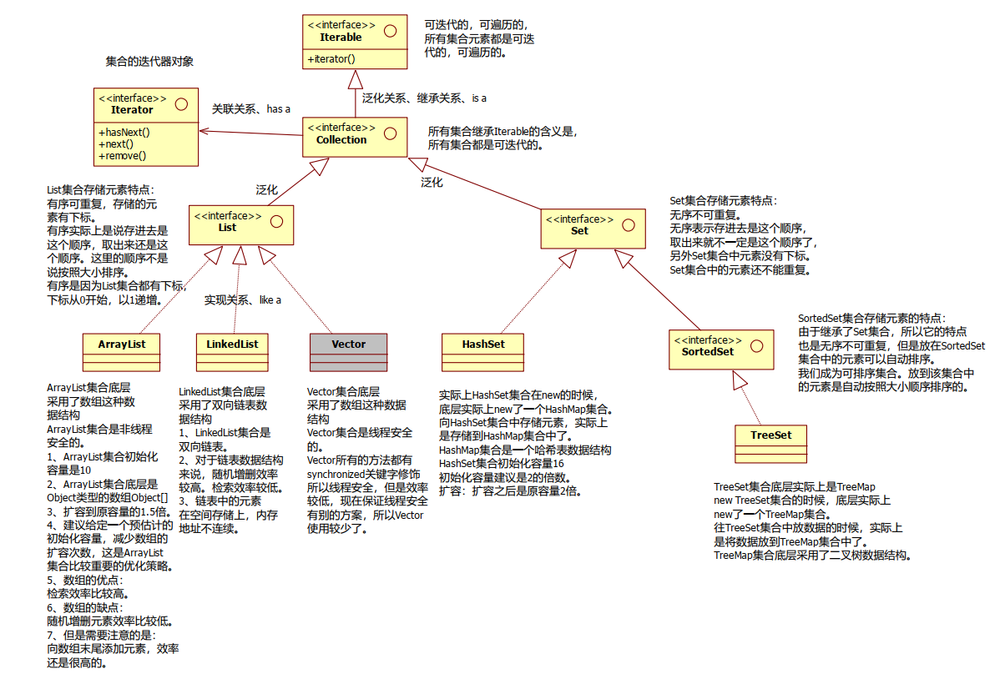
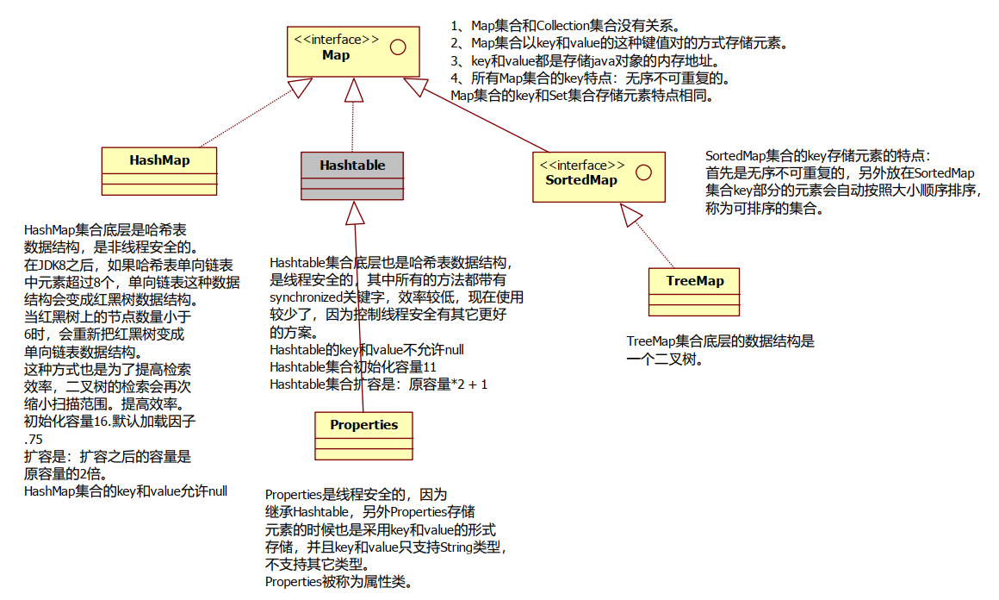
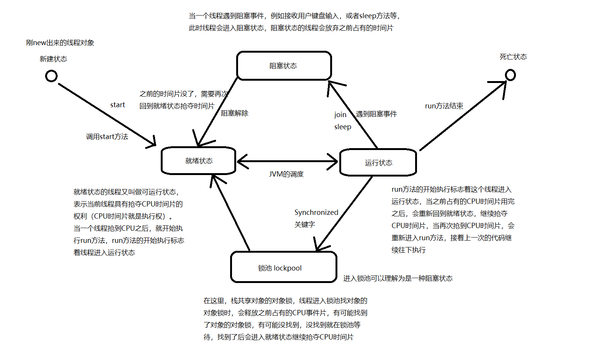

# JavaNotes

## Remark

- [java8-18新特性](https://blog.csdn.net/wang_luwei/article/details/125328420)

- [(【JAVA 1.0 - JAVA 19】java版本](https://blog.csdn.net/qq934235475/article/details/82220076)

- 注记

     - 堆是线程共享的，栈是线程独享的。

- **开闭原则**，英文缩写**OCP**，全称Open Closed Principle。

  原始定义：Software entities (classes, modules, functions) should be open for extension but closed for modification。

  字面翻译：软件实体（包括类、模块、功能等）应该**对扩展开放**，但是**对修改关闭**。

  为什么要“开”和“闭”

  一般情况，我们接到需求变更的通知，通常方式可能就是修改模块的源代码，然而修改已经存在的源代码是存在很大风险的，尤其是项目上线运行一段时间后，开发人员发生变化，这种风险可能就更大。所以，为了避免这种风险，在面对需求变更时，我们一般不修改源代码，即所谓的**对修改关闭**。不允许修改源代码，我们如何应对需求变更呢？答案就是我们下面要说的对扩展开放。

  通过扩展去应对需求变化，就要求我们必须要面向接口编程，或者说面向抽象编程。所有参数类型、引用传递的对象必须使用抽象（接口或者抽象类）的方式定义，不能使用实现类的方式定义；通过抽象去界定扩展，比如我们定义了一个接口A的参数，那么我们的扩展只能是接口A的实现类。总的来说，开闭原则提高系统的可维护性和代码的重用性。

- 在Object类中的equals方法当中，默认采用的是“ == ”判断两个java对象是否相等。

     而“ == ”判断的是两个java对象的内存地址，我们应该判断两个java对象的内容是否相等

- <span style="color:blue; font-weight:bold">数据类型间的转换</span>

  ```java
  // boolean/char/long/int/float/double/object --> String
  String.valueOf();
  
  // String --> byte/short/int/long/float/double
  Integer.paseInt();       // 在能转的情况下 异常：NumberFormatException
  Float.parseFloat();
  Double.parseDouble();
  ...
  
  // int <-->Integer  // 自动拆装箱
  
  // String --> Byte/Short/Integer/Long/Float/Double...
  Integer.valueOf("100");
  Float.valueOf();
   
  
  // Integer --> String
  String.valueOf();
  ```

- <span style="color:blue; font-weight:bold">三种变量</span>
  
  - 成员变量
    - <span style="color:blue; font-weight:bold">静态变量</span>
      - 类加载时初始化
    - <span style="color:blue; font-weight:bold">实例变量</span>
      - 创建类的对象时初始化
  - <span style="color:blue; font-weight:bold">局部变量</span>
    - 出现在方法体中的变量是局部变量
  
- <span style="color:blue; font-weight:bold">构造方法、方法的重载、方法的覆盖/重写/   实现(对于抽象的方法)</span>

  - 构造方法：new的时候执行，系统提供无参构造方法

  - 方法重载：在同一个类中（或者父子类中），方法名相同，<span style="color:blue; font-weight:bold">参数列表不同。</span> 注意：跟返回值无关(返回值不同，不能重载)

  - 方法覆盖/实现
    - 方法的覆盖一定发生在父类与子类之间，并且<span style="color:blue; font-weight:bold">方法的特征一定完全一样。</span>
    - 父类（接口）的抽象方法一定要实现
    - 父类的其他方法子类可以覆盖/重写

- <span style="color:blue; font-weight:bold">经典的异常</span>

  * 空指针异常：NullPointerException
  * 类型转换异常：ClassCastException
  * 数组下标越界异常：ArrayIndexOutOfBoundsException
  * 数字格式化异常：NumberFormatException

  * 所有Exception的直接子类，都叫做**编译时异常**
  * 所有RuntimeException及子类都属于**运行时异常**

- <span style="color:blue; font-weight:bold">父子类异常</span>

  - 子类重写父类的方法，不能抛出<span style="color:blue; font-weight:bold">更多</span>或者<span style="color:blue; font-weight:bold">更宽泛</span>的异常

- <span style="color:blue; font-weight:bold">访问控制权限</span>

  - private 表示私有的，只能在本类中访问
  - public 表示公开的，在任何位置都可以访问
  - “默认”表示只能在本类，以及同包下访问。
  - protected表示只能在本类、同包、子类中访问。

  | 访问控制修饰符   | 本类 | 同包   | 子类   | 任意位置 |
  | ---------------- | ---- | ------ | ------ | -------- |
  | public           | 可以 | 可以   | 可以   | 可以     |
  | protected        | 可以 | 可以   | 可以   | 不可以   |
  | 默认(包访问权限) | 可以 | 可以   | 不可以 | 不可以   |
  | private          | 可以 | 不可以 | 不可以 | 不可以   |

  > public > protected > 默认 > private

  - 访问控制权限修饰符可以修饰什么？

    - 属性（4个都能用）

    - 方法（4个都能用）

    - 类（public和默认能用，其它不行。）
    - 接口（public和默认能用，其它不行。）

- 


## 面向对象

- 封装(Encapsulation) 
- 继承(Inheritance) 
- 多态(Polymorphism)

### 多态

- 什么是多态？
  - 多种形态，多种状态
  
  - 分析：a2.move();
    - java程序分为编译阶段，运行阶段
      - 编译阶段：
        对于编译阶段，编译器只知道a2的类型是Animal，所以编译器在检查语法的时候，会去Animal.class字节码文件中找move()方法。找到之后，绑定上move()方法，编译通过，静态绑定成功。（编译阶段属于静态绑定）
      - 运行阶段：
        运行阶段的时候，实际上在堆内存中创建的java对象是Cat对象，所以move的时候，真正参与move的对象是一只猫，所以运行阶段会动态执行Cat对象的move方法，这个过程属于运行阶段绑定。（属于动态绑定）
    
    > java中，属性属于静态绑定(编译时绑定)，方法属于动态绑定
  
- 向上转型(upcasting)

  - 父类型引用指向子类型对象

  ```java
  // 向上转型(upcasting)   -    父类型引用指向子类型对象
  Animal a2 = new Cat();
  a2.move();
  ```

- 向下转型(downcasting)

  - 需要调用子类特有的方法时，需要向下转型。
  - instanceof运算符

  ```java
  if (a2.instanceof(Cat)){
      Cat cat = (Cat)a2
  }
  ```

  > 向下转型有风险：容易出现`ClassCastException`异常，通过instanceof运算符避免此异常的发生。

- <span style="color:blue; font-weight:bold">多态在开发中的作用</span>    -   P458
  
  - pp
  
- 为什么Java中子类不能重写父类的变量

  - 变量不允许多态和重写，多态和重写只适用于方法。当父类和子类有相同的实例变量时，这时实例变量只能对应的<span style="color:blue; font-weight:bold">引用类型调用</span>。在Java中，如果父类和子类有相同的变量，这时子类就含有俩相同变量，子类会隐藏父类的实例变量，称为<span style="color:blue; font-weight:bold">变量隐藏</span>！

  > 具体详见：[Java中子类为啥不能重写父类的变量 (baidu.com)](https://baijiahao.baidu.com/s?id=1694820397823997317&wfr=spider&for=pc)  -  可以参考写一篇博客

### 关键字

- <span style="color:blue; font-weight:bold">static</span>关键字

  - 使用static关键字可以定义：静态代码块

    - 什么是静态代码块，语法是什么？

      ```java
      static {
          java语句;
          java语句;
      }
      ```

      - static静态代码块在什么时候执行呢？ 
        - 类加载时执行。并且只执行一次。
      - 注意：静态代码块在类加载时执行，并且在main方法执行之前执行。
      - 静态代码块一般是按照自上而下的顺序执行。
      - 静态代码块和静态变量都在类加载的时候执行，时间相同，只能靠代码的顺序来决定谁先谁后。

  - 

- <span style="color:blue; font-weight:bold">this</span>关键字

  - this能出现在实例方法和构造方法中。

  - this的语法是：“this.”、“this()”

  - this不能使用在静态方法中。

  - this. 大部分情况下是可以省略的。

  - this. 什么时候不能省略呢？ 

    在区分<span style="color:blue; font-weight:bold">局部变量</span>和<span style="color:blue; font-weight:bold">实例变量</span>的时候不能省略。

    public void setName(String name){

    ​	this.name = name;

    }

  - <span style="color:red; font-weight:bold">this() 只能出现在构造方法第一行，通过当前的构造方法去调用“本类”中其它的构造方法，目的是：</span><span style="color:blue; font-weight:bold">代码复用。</span>

- <span style="color:blue; font-weight:bold">super</span>关键字

  - super能出现在实例方法和构造方法中。
  - super的语法是：“super.”、“super()”
  - super不能使用在静态方法中。
  - super. 大部分情况下是可以省略的。
  - super. 什么时候不能省略呢？
    - 答:父中有，子中又有，如果想在子中访问“父的特征”，super. 不能省略。
  - super() 只能出现在构造方法第一行，通过当前的构造方法去调用“父类”中的构造方法，目的是：创建子类对象的时候，先初始化父类型特征。
  - super 不是引用。super也不保存内存地址，super也不指向任何对象。

  - super 只是代表当前对象内部的那一块父类型的特征。

  - super.属性名           【访问父类的属性】

  - super.方法名(实参) 【访问父类的方法】

  - super(实参)              【调用父类的构造方法】

- <span style="color:blue; font-weight:bold">final</span>关键字

  - 1、final修饰的变量，只能赋值一次，不能重复赋值。

  - 2、final修饰的方法，不能被覆盖，被重写。<span style="color:red; font-weight:bold">所以抽象方法不能被final修饰。</span>

  - 3、final修饰的类，不能被继承。<span style="color:red; font-weight:bold">所以抽象类不能被final修饰。</span>

  - 4、final修饰的引用，一旦指向某个对象，则不能再重新指向其他对象，但该引用指向的对象内部的数据可修改。

  - 5、final修饰的实例变量必须手动初始化，不能采用系统默认值。

  - 6、final修饰的实例变量和static连用，称为常量。
    -  public static final double PI = 3.14

### 抽象类


### 接口


## 数组

- 数组概述
  - 数组是一组数据的集合，可以理解为一种容器，能同时容纳多个元素。
  - 数组是一种数据类型，属于引用类型，数组的父类是Object。
  - 数组元素的类型可以是基本类型，也可以是引用类型，但同一个数组只能是同一种类型。
  - 数组作为对象，数组中的元素作为对象的属性，除此之外数组还包括一个成员属性 length(注意不是方法)，length 表示数组的长度。
  - 数组的长度在数组对象创建后就确定了，就无法再修改了  
  - 数组元素是有下标的，下标从 0 开始，也就是第一个元素的下标为 0，依次类推最后一个元素的下标为 N-1，我们可以通过数组的下标来访问数组的元素  

- 一维数组
  - 数组的声明  


- 二维数组


## 常用类

### String


### StringBuffer


### StringBuilder


### 基础类型对应的包装类

- 除了 int --> Integer  char --> Character，其他六个都是首字母大写，变成包装类。
- 除了 boolean 和 Character 外，其它的包装类都有 valueOf() 和 parseXXX 方法。

- String  int  Integer

```java
// boolean/char/long/int/float/double/object --> String
String.valueOf();

// String --> byte/short/int/long/float/double
Integer.paseInt();       // 在能转的情况下 异常：NumberFormatException
Float.parseFloat();
Double.parseDouble();
...

// int <-->Integer  // 自动拆装箱

// String --> Byte/Short/Integer/Long/Float/Double...
Integer.valueOf("100");
Float.valueOf();
 

// Integer --> String
String.valueOf();
```

### 日期相关类


### 数字相关类


### Random


### Enum


- 

```java


```


## 异常处理


## 集合

### Remark

- 集合不能直接存储基本数据类型，另外集合也不能直接存储java对象，集合当中存储的都是java对象的内存地址。（或者说集合中存储的是引用。）

  list.add(100);     // 自动装箱Integer

  > 注意：集合在java中本身是一个容器，是一个对象。集合中任何时候存储的都是“引用”。

- 在java中集合分为两大类：

  - 一类是以单个方式存储元素，这一类集合中超级父接口：java.util.Collection;

  - 一类是以键值对的方式存储元素，这一类集合中超级父接口：java.util.Map;

### Collection(interface)

实现collection接口的接口和类很多，主要学习两个接口及其方法：

- List(interface)
  - ArrayList
  - LinkedList

- Set(interface)
  - HashSet
  - SortedSet(interface)  -->  TreeSet



### Map(interface)

实现collection接口的接口和类很多，主要学习一下类：

- HashMap
- HashTable  -->  Properties 
- SortedMap  -->  TreeMap



### TreeMap/TreeSet

- TreeSet底层就是一个TreeMap（TreeMap底层是一个二叉树），往TreeSet里面添加元素其实是添加到了TreeMap的Key里面

- TreeMap/TreeSet存储的元素需要是可比较的（实现了Comparable接口，重写了compareTo方法）

- 自定义比较规则（重写compareTo方法）

  ```java
  @Override
  public int compareTo(Person1 o) {     // c1.compareTo(c2);
      return this.age - o.age;
  }
  // 当满足c1 > c2 (c1 - c2 > 0)返回大于零的数时，升序排列
  //                           返回小于零的数时，jiang
  ```

  


## IO流

### Remark

- 以下面方式可以拿到文件的**绝对路径**

```java
String Path = Thread.currentThread().getContextClassLoader()
    .getResource("copyTest/aFile/liJiuZhen.txt").getPath();
```

> 注意：文件必须放在类路径(src)下，getResource(“ ”)中的路径从src下一个目录开始写。
>
> ​           src 类的根路径

- 用下面方式可以直接以流的形式拿到文件

```java
InputStream stream = Thread.currentThread().getContextClassLoader()
    .getResourceAsStream("copyTest/aFile/liJiuZhen.txt");
```

- 动画式讲解 - 见spark   ---   p26-27


### IO流分类

第一种方式是按照流的方向进行分类：以内存作为参照物，

- 往内存中去，叫做输入(Input)。或者叫做读(Read)。            硬盘 --> 内存
- 从内存中出来，叫做输出(Output)。或者叫做写(Write)。    内存 --> 硬盘

第二种方式是按照读取数据方式不同进行分类：

- 有的流是按照**字节的方式**读取数据，一次读取1个字节byte，等同于一次读取8个二进制位。
  这种流是<span style="color:blue; font-weight:bold">万能的</span>，什么类型的文件都可以读取。包括：文本文件，图片，声音文件，视频文件等....
  - 假设文件file1.txt，采用字节流的话是这样读的：
    a中国bc张三fe
    第一次读：一个字节，正好读到'a'
    第二次读：一个字节，正好读到'中'字符的一半。
    第三次读：一个字节，正好读到'中'字符的另外一半。
- 有的流是按照**字符的方式**读取数据的，一次读取一个字符，这种流是为了方便读取普通文本文件而存在的，这种流不能读取：图片、声音、视频等文件。只能读取纯文本文件，连word文件都无法读取。
  - 假设文件file1.txt，采用字符流的话是这样读的：
    a中国bc张三fe
    第一次读：'a'字符（'a'字符在windows系统中占用1个字节。）
    第二次读：'中'字符（'中'字符在windows系统中占用2个字节。）

> 综上所述：流的分类
> 		1、输入流、输出流
> 		2、字节流、字符流

### java.io包

Java中的IO流都已经写好了，java中所有的IO流都是在：java.io.*;下。

- java IO流这块有四大家族：

  - java.io.InputStream           字节输入流
  - java.io.OutputStream        字节输出流

  - java.io.Reader	             	字符输入流

  - java.io.Writer	              	字符输出流

四大家族的首领都是抽象类。(abstract class)

所有的流都实现了：java.io.Closeable接口，都是<span style="color:blue; font-weight:bold">可关闭的</span>，都有close()方法。流毕竟是一个管道，这个是内存和硬盘之间的通道，用完之后一定要关闭，不然会耗费(占用)很多资源。

所有的输出流都实现了：java.io.Flushable接口，都是<span style="color:blue; font-weight:bold">可刷新的</span>，都有flush()方法。输出流在最终输出之后，一定要记得flush()刷新一下。这个刷新表示将通道/管道当中剩余未输出的数据强行输出完（清空管道！）刷新的作用就是清空管道。
注意：如果没有flush()可能会导致丢失数据。

> 在java中只要“类名”以<span style="color:red; font-weight:bold">Stream</span>结尾的都是<span style="color:blue; font-weight:bold">字节流</span>，字节流是万能流。以“<span style="color:red; font-weight:bold">Reader/Writer</span>”结尾的都是<span style="color:blue; font-weight:bold">字符流</span>。

- java.io包下需要掌握的流有16个：

  - 文件专属：

    - `java.io.FileInputStream`（掌握）
    - `java.io.FileOutputStream`（掌握）

    - java.io.FileReader

    - java.io.FileWriter

  - 转换流：（将字节流转换成字符流）

    - java.io.InputStreamReader

    - java.io.OutputStreamWriter

  - 缓冲流专属：

    - java.io.BufferedReader

    - java.io.BufferedWriter

    - java.io.BufferedInputStream

    - java.io.BufferedOutputStream

  - 数据流专属：

    - java.io.DataInputStream

    - java.io.DataOutputStream

  - 标准输出流：

    - java.io.PrintWriter

    - `java.io.PrintStream`（掌握）

  - 对象专属流：

    - `java.io.ObjectInputStream`（掌握）

    - `java.io.ObjectOutputStream`（掌握）

### FileInputStream

```java
/**
 *
 * FileInputStream最终格式
 *
 * */
public class Test004 {
    public static void main(String[] args) {
        FileInputStream fis = null;
        try {
            fis = new FileInputStream("文件路径");
            
            int readCount = 0;
            byte[] bytes = new byte[10];    // 每次最大可以读10个字节
            // int readCount = fis.read(bytes) 每次实际读了多少个字节  0-10； 没有了readCount=-1
            while ((readCount = fis.read(bytes)) != -1) {  // 文件内容以字节的形式读到了byte[]数组里面
                // new String(bytes,0,readCount) 通过byte数组，new一个String对象
                System.out.print(new String(bytes,0,readCount));
            }
        } catch (FileNotFoundException e) {
            e.printStackTrace();
        } catch (IOException e) {
            e.printStackTrace();
        } finally {
            if (fis != null) {
                try {
                    fis.close();
                } catch (IOException e) {
                    e.printStackTrace();
                }
            }
        }
    }
}


/**
 *
 * FileInputStream类的其它常用方法：
 *         int available()：返回流当中剩余的没有读到的字节数量
 *         long skip(long n)：跳过几个字节不读。
 *
 * */
```

> <span style="color:blue; font-weight:bold">Stream (字节)流使用场景</span>
>
> - 不适用对文本进行读取操作，很容易乱码，一个字节一个字节的读取，效率低
> -  适合图片，音频的上传下载和拷贝
> - 对纯文本操作，选字符流(Reader, Writer)

### FileOutputStream

主要的三个方法：

- close()
- flush()
- write()
  - 传入一个byte数组，（偏移量off，长度len）
  - 传一个int数据

```java
public class Test001 {
    public static void main(String[] args) {
        FileOutputStream fos = null;
        try {
            // 文件不存在会自动创建
            // 这种方式谨慎使用，这种方式会先将原文件清空，然后重新写入。
            //fos = new FileOutputStream("chapter23/src/fileOutputStream/temp02");

            // append:true 以追加的方式在文件末尾写入。不会清空原文件内容。
            fos = new FileOutputStream("chapter23/src/fileOutputStream/temp02",true);
            // 开始写
            byte[] bytes = {97, 98, 99, 100, 99, 98, 97};
            // 文件不存在会自动创建"chapter23/src/fileOutputStream/temp01"
            //fos.write(bytes);   // 将byte[]数组全部写出

            // 文件已存在，"chapter23/src/fileOutputStream/temp02"
            //fos.write(bytes,0,4);

            String s = "我是一个中国人，我骄傲";
            byte[] bytes1 = s.getBytes();       // 将字符串传换成byte[]数组
            fos.write(bytes1);

            // 刷新
            fos.flush();
        } catch (FileNotFoundException e) {
            e.printStackTrace();
        } catch (IOException e) {
            e.printStackTrace();
        }finally {
            if (fos != null) {
                try {
                    fos.close();
                } catch (IOException e) {
                    e.printStackTrace();
                }
            }
        }
    }
}
```

### FileReader

文件字符输入流，只能读取普通文本；读取文本内容时，比较方便，快捷。

```java
public class Test001 {
    public static void main(String[] args) {
        FileReader fr = null;
        try {
            fr = new FileReader("文件名");
            char[] chars = new char[4];
            /*
            int readCount = fr.read(chars);
            System.out.println(chars);
            */ 
            int readCount = 0;
            while ((readCount = fr.read(chars)) != -1) {
                System.out.print(new String(chars,0,readCount));
            }

        } catch (FileNotFoundException e) {
            e.printStackTrace();
        } catch (IOException e) {
            e.printStackTrace();
        } finally {
            if (fr != null) {
                try {
                    fr.close();
                } catch (IOException e) {
                    e.printStackTrace();
                }
            }
        }
    }
}
```

### FileWriter

主要的三个方法：

- close()
- flush()
- write()
  - 传入一个char数组，（偏移量off，长度len）
  - 传入吧一个string，（偏移量off，长度len）
  - 传入一个int数据，（写一个字符）

```java
public class Test001 {
    public static void main(String[] args) {
        FileWriter fw = null;
        try {
            // true 表示文件累加，不覆盖原文件
            fw = new FileWriter
                ("chapter23\\src\\fileWriter\\test001.properties",true);
            char[] chars = {'我','是','大','好','的','人'};
            fw.write(chars);    // 可以传入一个char数组，（也可以有偏移量和长度）
            fw.write("\n");
            String s = "我是一个中国人！";
            fw.write(s);        // 可以传入一个String
            fw.write("\n");
			
            fw.flush();         // 刷新，一定要刷新，刷新刷新
        } catch (IOException e) {
            e.printStackTrace();
        }finally {
            if (fw != null) {
                try {
                    fw.close();
                } catch (IOException e) {
                    e.printStackTrace();
                }
            }
        }

    }
}
```

### 缓冲流

- java.io.BufferedReader

- java.io.BufferedWriter

- java.io.BufferedInputStream

- java.io.BufferedOutputStream

```java
/*
BufferedReader
	带有缓冲区的字符输入流
	使用这个流时，不需要自己自定义char/byte数组，自带缓冲。
	
*/

public class Test001 {
    public static void main(String[] args) {
        BufferedReader bd =null;
        try {
            // 当一个流的构造方法中需要一个流的时候，这个被传进来的流叫做：节点流。
            // 外部负责包装的这个流，叫做：包装流，还有一个名字叫做：处理流。
            // 像当前这个程序来说：FileReader就是一个节点流。BufferedReader就是包装流/处理流。
            FileReader reader = new FileReader
                ("chapter23\\src\\bufferedReader\\test001.properties");
            bd = new BufferedReader(reader);

            // readLine() 一读,读一行
            String s = null;
            while ((s = bd.readLine()) != null) {  // readLine()，读完之后返回一个null
                System.out.println(s);             // 不读换行符
            }

            
        } catch (FileNotFoundException e) {
            e.printStackTrace();
        } catch (IOException e) {
            e.printStackTrace();
        } finally {
            if (bd != null) {
                try {
                    bd.close();
                } catch (IOException e) {
                    e.printStackTrace();
                }
            }
        }
    }
}
```

> 总结：<span style="color:red; font-weight:bold">对于包装流来说，只需要关闭最外层的流，里面的流会自动关闭</span>（可以看源码）。

- <span style="color:blue; font-weight:bold">流的套娃</span>   理解一下节点流 和 包装流(处理流)

```java
FileInputStream fis = new FileInputStream
    ("chapter23\\src\\bufferedReader\\test001.properties");   // 字节流
InputStreamReader isr = new InputStreamReader(fis);      // 字节流转字符流
BufferedReader br = new BufferedReader(isr);             // 字符流可以传入BufferedReader

// 合并写法
BufferedReader br = new BufferedReader
    (new InputStreamReader(new FileInputStream
    ("chapter23\\src\\bufferedReader\\test001.properties")));


String s = null;
while ((s = br.readLine()) != null) {
    System.out.println(s);
}
```

> BufferedWriter : 带有缓冲区的字符输出流
>
> - close()
> - flush()
> - write()
>   - 传入一个char数组，（偏移量off，长度len）
>   - 传入吧一个string，（偏移量off，长度len）
>   - 传入一个int数据，（写一个字符）

### 数据流 P582

- java.io.DataInputStream

- java.io.DataOutputStream

```java
```


### 转换流

- 将字节流转换成字符流

- java.io.InputStreamReader

- java.io.OutputStreamWriter

  再IDEA中，使用FilerReader读取项目中的文本文件。由于IDEA的设置中，默认都是UTF-8编码，所以当读取Windows系统中的文件时，由于Windows系统的默认是GBK编码，就会出现乱码问题。

```java
```


### 对象专属流

- `java.io.ObjectInputStream`（掌握）
- `java.io.ObjectOutputStream`（掌握）

```java
```


## 多线程

### 进程&线程

- 一个进程是一个应用程序
- 一个线程是一个进程中的执行单元/执行场景，一个进程可能会启动多个线程

> 进程A和进程B的内存独立不共享。
>
> 在java语言中：
>
> ​        JVM是一个进程，JVM再启动一系列线程（main方法主线程，垃圾回收线程）
>
> ​        线程A和线程B，**堆内存**和**方法区内存**共享。但是<span style="color:blue; font-weight:bold">栈内存独立</span>，一个线程一个栈。
>
> ​        假设启动10个线程，会有10个栈空间，每个栈和每个栈之间，互不干扰，各自执行各自的，这就是多线程并发。
>
> ​        java中之所以有**多线程机制**，目的就是为了提高程序的处理效率。

### 实现线程的两种方式

```java
// 第一种方式：编写一个类，直接继承java.lang.Thread，重写run方法。
// 定义线程类
public class MyThread extends Thread{
    @Override
    public void run(){

    }
}
// 创建线程对象
MyThread t = new MyThread();
// 启动线程。
// start()方法的作用是：启动一个分支线程，在JVM中开辟一个新的栈空间，这段代码任务完成之后，瞬间就结束了。
t.start();   

// 第二种方式：编写一个类，实现java.lang.Runnable接口，实现run方法。
// 定义一个可运行的类
public class MyRunnable implements Runnable {
    @Override
    public void run(){

    }
}
// 创建线程对象
Thread t = new Thread(new MyRunnable());
// 启动线程
t.start();
```

> 注意：第二种方式实现接口比较常用，因为一个类实现了接口，它还可以去继承其它的类，更灵活。
>
> ​            java是单继承的，可以多实现。
>
> start()方法的作用是：启动一个分支线程，在JVM中**开辟一个新的栈空间**，这段代码任务完成之后，**瞬间结束**。
>
> 这段代码的任务只是：开启一个新的栈空间，只要新的栈空间开出来，start()方法就结束了，线程就启动成功了。
>
> 启动成功的线程会自动调用run方法，并且run方法在分支栈的栈底部（压栈）。
>
> run方法在分支栈的栈底部，main方法在主栈的栈底部。run和main是平级的。

- 关于异常
  - 线程中的run方法，不能抛出异常，只能try...catch...

### 线程的生命周期

- 新建状态：采用 new语句创建完成  

- 就绪状态：执行 start()方法 后  

- 运行状态：占用 CPU 时间  

- 阻塞状态：执行了 wait 语句、执行了 sleep 语句和等待某个对象锁， 等待输入的场合等等情况

- 死亡状态：退出 run()方法  




### 线程的一些操作

- 获取当前线程

  ```java
  Thread t = Thread.currentThread(); //返回当前正在执行的线程对象的引用。 
  ```

- 获取线程对象的名字

  ```java
  Thread t = new Thread();
  String name = t.getName();
  ```

- 修改线程对象的名字

  ```java
  Thread t = new Thread();
  t.setName("线程的名字");
  ```

  > 当线程没有设置名字时，默认名字：Thread-0、Thread-1、Thread-2、......
  >
  > 主线程的名字：mian

### 线程的sleep()方法

- static void sleep(long millis)

  - 1、静态方法：Thread.sleep(1000);   // 睡眠1秒：1000毫秒

  - 2、参数是毫秒

  - 3、作用：让当前线程进入休眠，进入“阻塞状态”，放弃占有CPU时间片，让给其它线程使用。
    - 这行代码出现在A线程中，A线程就会进入休眠。
    - 这行代码出现在B线程中，B线程就会进入休眠。 

  - 4、Thread.sleep()方法，可以做到这种效果：
    - 间隔特定的时间，去执行一段特定的代码，每隔多久执行一次。

- 中断睡眠

  ```java
  // 终断t线程的睡眠（这种终断睡眠的方式依靠了java的异常处理机制。）
  t.interrupt();  // 干扰，一盆冷水过去！
  ```

- 终止线程

  ```java
  t.stop(); // 已过时（不建议使用。）
  // 这种方式存在很大的缺点：容易丢失数据。因为这种方式是直接将线程杀死了，线程没有保存的数据将会丢失。不建议使用。
  
  
  // 合理终止一个线程的执行
  public class ThreadTest10 {
      public static void main(String[] args) {
          MyRunable4 r = new MyRunable4();
          Thread t = new Thread(r);
          t.setName("t");
          t.start();
          // 模拟5秒
          try {
              Thread.sleep(5000);
          } catch (InterruptedException e) {
              e.printStackTrace();
          }
          // 终止线程
          // 你想要什么时候终止t的执行，那么你把标记修改为false，就结束了。
          r.run = false;
      }
  }
  
  class MyRunable4 implements Runnable {
      // 打一个布尔标记
      boolean run = true;
      @Override
      public void run() {
          for (int i = 0; i < 10; i++){
              if(run){
                  System.out.println(Thread.currentThread().getName() + "--->" + i);
                  try {
                      Thread.sleep(1000);
                  } catch (InterruptedException e) {
                      e.printStackTrace();
                  }
              }else{
                  // return就结束了，你在结束之前还有什么没保存的。
                  // 在这里可以保存呀。
                  // save....
  
                  //终止当前线程
                  return;
              }
          }
      }
  }
  ```

### 线程调度

- 常见的线程调度模型有哪些？

  - 抢占式调度模型：
  - 均分式调度模型：

- java中提供的和线程调度有关系的方法

  - 实例方法：--------------------------------------------------------------------------------举例：ThreadTest11.java

    - void setPriority(int newPriority) 设置线程的优先级

    - int getPriority() 获取线程优先级

      最低优先级1
      默认优先级是5
      最高优先级10
      优先级比较高的获取CPU时间片可能会多一些。（但也不完全是，大概率是多的。）

  - 静态方法：--------------------------------------------------------------------------------举例：ThreadTest12.java

    - static void yield()  让位方法

      暂停当前正在执行的线程对象，并执行其他线程
      yield()方法不是阻塞方法。让当前线程让位，让给其它线程使用。
      yield()方法的执行会让当前线程从“**运行状态**”回到“**就绪状态**”。（就绪状态就可以抢夺时间片）
      注意：在回到就绪之后，有可能还会再次抢到

  - 实例方法：--------------------------------------------------------------------------------举例：ThreadTest13.java

    - void join()   合并线程

      ```java
      class MyThread1 extends Thread {
          public void doSome(){
              MyThread2 t = new MyThread2();
              // 把t线程合并进来
              t.join();     // 当前线程进入阻塞，t线程执行，直到t线程结束，当前线程才可以继续。
          }
      }
      
      class MyThread2 extends Thread{
      
      }
      ```

### 线程安全  -  重点


## 反射机制

### 概述

- 反射机制有什么用？
  通过java语言中的反射机制可以操作(读和修改)字节码文件(class文件)。优点类似于黑客。

- 反射机制的相关类在哪个包下？

  ```java
  java.lang.reflect.*;
  ```

- 反射机制相关的重要的类有哪些？

  ```java
  // java.lang.Class：代表整个字节码，代表一个类型，代表整个类。
  
  // java.lang.reflect.Method：代表字节码中的方法字节码。代表类中的方法。
  
  // java.lang.reflect.Constructor：代表字节码中的构造方法字节码。代表类中的构造方法
  
  // java.lang.reflect.Field：代表字节码中的属性字节码。代表类中的成员变量(静态变量+实例变量)
  
  // java.lang.Class
  public class User{
      // Field
      int no;
  
      // Constructor
      public User(){
  
      }
      public User(int no){
          this.no = no;
      }
  
      // Method
      public void setNo(int no){
          this.no = no;
      }
      public int getNo(){
          return no;
      }
  }
  ```

### Class

- 获取Class的三种方式

  - `forName(String className)`  返回与给定的字符串名称的类或接口相关的类对象。

    ```java
    Class c1 = Class.forName("java.lang.String");
    // c1代表String.class文件
    
    /*
    Class.forName()
    	1、静态方法
        2、方法的参数是一个字符串。                
        3、字符串需要的是一个完整类名。                
        4、完整类名必须带有包名。java.lang包也不能省略。 
    相关异常：ClassNotFoundException
    */
    ```

  - java中任何对象都有一个`.getClass`方法

    ```java
    String s = "abc";
    Class c2 = s.getClass();
    System.out.println(c2 == c1);  // true 说明c1和c2指向的内存地址一样，都指向方法区中的String.Class字节码文件
    // 说明：字节码文件装载到JVM中，只装载一份
    ```

  - java中任何数据类型，包括基本数据类型，都有`.class`属性

    ```java
    Class c3 = String.class;
    ```

- 通过反射，实例化对象

  通过反射获取Class，通过Class实例化对象   -   `c1.newInstance()`

  ```java
  Class c1 = Class.forName("java.lang.String");
  Object o = c1.newInstance();   // 1.9之后过时
  // newInstance方法，会调用对象的无参构造方法，完成对象的创建。
  
  Class c4 = Class.forName("User");  // User是自定义的类
  Object o = c4.newInstance();       // 调用了User的无参构造方法
  // 值得说明的是：如果User没有构造方法，可以运行，因为一个类没有构造方法，会默认有一个无参构造方法
  //             但是一旦创建了有参构造方法，必须要给出无参构造方法，不然newInstance()报错
  //                                      (实例化异常)异常为：InstantiationException
  // 重点：newInstance()方法调用的是无参构造方法，必须保证无参构造方法存在。
  // 放射机制创建对象更灵活。(下节验证说明)
  
  public class User{
      // 有参构造方法
      public User(String s){
      }
      
      // 必须给出无参构造方法
      public User(){  
      }
  }
  
  // ****************************这里可以加泛型***********************************
  Class<User> c4 = (Class<User>)Class.forName("User");  // User是自定义的类
  // Object o = c4.newInstance();       // 调用了User的无参构造方法
  User u = c4.newInstance();
  ```

- 验证反射机制的灵活性

  ```java
  /*
  验证反射机制的灵活性。
      java代码写一遍，再不改变java源代码的基础之上，可以做到不同对象的实例化。
      非常之灵活。（符合OCP开闭原则：对扩展开放，对修改关闭。）
  
  后期你们要学习的是高级框架，而工作过程中，也都是使用高级框架，
  包括： ssh ssm
      Spring SpringMVC MyBatis
      Spring Struts Hibernate
      ...
      这些高级框架底层实现原理：都采用了反射机制。所以反射机制还是重要的。
      学会了反射机制有利于你理解剖析框架底层的源代码。
   */
  public class ReflectTest03 {
      public static void main(String[] args) throws Exception{
  
          // 这种方式代码就写死了。只能创建一个User类型的对象
          //User user = new User();
  
          // 以下代码是灵活的，代码不需要改动，可以修改配置文件，配置文件修改之后，可以创建出不同的实例对象。
          // 通过IO流读取classinfo.properties文件
          FileReader reader = new FileReader("chapter25/classinfo2.properties");
          // 创建属性类对象Map
          Properties pro = new Properties(); // key value都是String
          // 加载
          pro.load(reader);
          // 关闭流
          reader.close();
  
          // 通过key获取value
          String className = pro.getProperty("className");
          //System.out.println(className);
  
          // 通过反射机制实例化对象
          Class c = Class.forName(className);
          Object obj = c.newInstance();
          System.out.println(obj);
      }
  }
  ```

- `Class.forName`发生了什么？

  ```java
  Class.forName("User");
  // Class.forName 会导致类加载，同时执行类中的静态代码块
  // 如果执行执行类中的静态代码块，可以用这种方式实现
  
  public class User{
      
      //静态代码块在类加载时执行，并且只执行一次。
      static{
          System.out.println("静态代码块执行了")；
      }
  }
  ```

### 路径相关

- 获取<span style="color:blue; font-weight:bold">类路径</span>下文件的绝对路径

  ```java
  /*
  解释：
  Thread.currentThread() 当前线程对象
  getContextClassLoader() 是线程对象的方法，可以获取到当前线程的类加载器对象。
  getResource() 【获取资源】这是类加载器对象的方法，当前线程的类加载器默认从类的根路径下加载资源。
  */
  // classinfo2.properties在src目录下
  // 这种方式获取的路径是文件的绝对路经
  String path = Thread.currentThread().getContextClassLoader()
                .getResource("classinfo2.properties").getPath(); 
  // 这种方式获取文件绝对路径是通用的。
  
  // 或者从src的下一级目录开始写
  String path = Thread.currentThread().getContextClassLoader()
                .getResource("edu/lzu/classinfo2.properties").getPath(); 
  ```

- 以流的形式直接返回

  ```java
  // 路径填写规则如上：
  InputStream stream = Thread.currentThread().getContextClassLoader()
      .getResourceAsStream("copyTest/aFile/liJiuZhen.txt");
  ```

- 资源绑定器  -  ResourceBundle

  > IO + Properties，怎么快速绑定属性资源文件？
  >
  > 使用规则：
  >
  > 资源绑定器，只能绑定xxx.properties文件
  >
  > 这个文件必须在类路径下
  >
  > 并且在写路径的时候，路径后面的扩展名不能写。

  ```java
  /*
  java.util包下提供了一个资源绑定器，便于获取属性配置文件中的内容。
  使用以下这种方式的时候，属性配置文件xxx.properties必须放到类路径下。
   */
  public class ResourceBundleTest {
      public static void main(String[] args) {
  
          // 资源绑定器，只能绑定xxx.properties文件。并且这个文件必须在类路径下。
          // 文件扩展名也必须是properties
          // 并且在写路径的时候，路径后面的扩展名不能写。
          //ResourceBundle bundle = ResourceBundle.getBundle("classinfo2");
  
          ResourceBundle bundle = ResourceBundle
              .getBundle("com/bjpowernode/java/bean/db");
  
          String className = bundle.getString("className");
          System.out.println(className);
  
      }
  }
  ```

### 类加载器 - 了解

- 关于JDK中自带的类加载器：（聊一聊，不需要掌握，知道当然最好！）

  - 什么是类加载器？
    专门负责加载类的命令/工具。
    ClassLoader

  - JDK中自带了3个类加载器

    - 启动类加载器:rt.jar
    - 扩展类加载器:ext/*.jar
    - 应用类加载器:classpath

  - 假设有这样一段代码：`String s = "abc";`

    代码在开始执行之前，会将所需要类全部加载到JVM当中。通过类加载器加载，看到以上代码类加载器会找String.class文件，找到就加载，那么是怎么进行加载的呢？

    - 首先通过“启动类加载器”加载。
      注意：启动类加载器专门加载：C:\Program Files\Java\jdk1.8.0_101\jre\lib\rt.jar
      rt.jar中都是JDK最核心的类库。

    - 如果通过“启动类加载器”加载不到的时候，会通过"扩展类加载器"加载。
      注意：扩展类加载器专门加载：C:\Program Files\Java\jdk1.8.0_101\jre\lib\ext\*.jar
    - 如果“扩展类加载器”没有加载到，那么会通过“应用类加载器”加载。
      注意：应用类加载器专门加载：classpath中的类。

  - java中为了保证类加载的安全，使用了<span style="color:blue; font-weight:bold">双亲委派机制</span>。
    优先从启动类加载器中加载，这个称为“父”；“父”无法加载到，再从扩展类加载器中加载，这个称为“母”。这就是双亲委派。如果都加载不到，才会考虑从应用类加载器中加载。直到加载到为止。

    > 比如你自己写了一个String类(属于应用类加载器)，不会被加载，因为从启动类加载器中已经加载到了String。

### Fields

- 反射属性Field  -  了解

  ```java
  /*
  反射Student类当中所有的Field（了解一下，了解一下）
   */
  public class ReflectTest05 {
      public static void main(String[] args) throws Exception{
  
          // 获取整个类
          Class studentClass = Class.forName("com.bjpowernode.java.bean.Student");
  
          //com.bjpowernode.java.bean.Student
          String className = studentClass.getName();
          System.out.println("完整类名：" + className);
  
          String simpleName = studentClass.getSimpleName();
          System.out.println("简类名：" + simpleName);
  
          // 获取类中所有的public修饰的Field
          Field[] fields = studentClass.getFields();
          // public int no; 是一个Field对象
          System.out.println(fields.length); // 测试数组中只有1个元素
          // 取出这个Field
          Field f = fields[0];
          // 取出这个Field它的名字
          String fieldName = f.getName();
          System.out.println(fieldName);
  
          // 获取所有的Field
          // getDeclaredFields()
          Field[] fs = studentClass.getDeclaredFields();
          System.out.println(fs.length);    // 4
  
          System.out.println("==================================");
          // 遍历
          for(Field field : fs){
              
              // 获取属性的“修饰符列表”
              // getModifiers()
              int i = field.getModifiers(); 
              // 返回的修饰符是一个数字，每个数字是修饰符的代号！！！
              System.out.println(i);
              // 可以将这个“代号”数字转换成“字符串”吗？
              // MOdifier.toString()  静态方法
              String modifierString = Modifier.toString(i);
              System.out.println(modifierString);
              
              // 获取属性的“类型”
              // getType()
              Class fieldType = field.getType();
              //String fName = fieldType.getName();
              String fName = fieldType.getSimpleName();
              System.out.println(fName);
              
              // 获取属性的“名字”
              System.out.println(field.getName());
          }
      }
  }
  
  
  // 反射属性Field
  public class Student {
      // Field翻译为字段，其实就是属性/成员
      // 4个Field，分别采用了不同的访问控制权限修饰符
      private String name;  // Field对象
      protected int age;    // Field对象
      boolean sex;
      public int no;
      public static final double MATH_PI = 3.1415926;
  }
  ```

- 反编译属性Field  -  了解

  ```java
  /*
  *********反编译Field，给一个.class文件，可以得到其java源码 (了解一下)
  */
  public class ReflectTest06 {
      public static void main(String[] args) throws Exception{
  
          // 创建这个是为了拼接字符串。
          StringBuilder s = new StringBuilder();
  
          //Class studentClass = Class.forName("com.bjpowernode.java.bean.Student");
          Class studentClass = Class.forName("java.lang.Thread");
  
          s.append(Modifier.toString(studentClass.getModifiers()) + " class " 
                   + studentClass.getSimpleName() + " {\n");
  
          Field[] fields = studentClass.getDeclaredFields();
          for(Field field : fields){
              s.append("\t");
              s.append(Modifier.toString(field.getModifiers()));
              s.append(" ");
              s.append(field.getType().getSimpleName());
              s.append(" ");
              s.append(field.getName());
              s.append(";\n");
          }
  
          s.append("}");
          System.out.println(s);
  
      }
  }
  
  ```

- <span style="color:blue; font-weight:bold">通过反射机制访问属性Field</span>

  > 可以获取属性的值
  >
  > 可以给属性赋值
  >
  > 私有的属性，也可以通过反射机制获取，赋值？？？？？？
  >
  > > 需要打破封装，使用`nameField.setAccessible(true); `

  ```java
  /*
  必须掌握：
      怎么通过反射机制访问一个java对象的属性？
          给属性赋值set
          获取属性的值get
   */
  public class ReflectTest07 {
      public static void main(String[] args) throws Exception{
  
          // 我们不使用反射机制，怎么去访问一个对象的属性呢？
          Student s = new Student();
  
          // 给属性赋值
          s.no = 1111; //三要素：给s对象的no属性赋值1111
                      //要素1：对象s
                      //要素2：no属性
                      //要素3：1111
  
          // 读属性值
          // 两个要素：获取s对象的no属性的值。
          System.out.println(s.no);
  
          // 使用反射机制，怎么去访问一个对象的属性。（set get）
          Class studentClass = Class.forName("com.bjpowernode.java.bean.Student");
          Object obj = studentClass.newInstance(); // obj就是Student对象。（底层调用无参数构造方法）
  
          // 获取no属性（根据属性的名称来获取Field）
          Field noFiled = studentClass.getDeclaredField("no");
  
          // 给obj对象(Student对象)的no属性赋值
          /*
          虽然使用了反射机制，但是三要素还是缺一不可：
              要素1：obj对象
              要素2：no属性 - noFiled
              要素3：2222值
          注意：反射机制让代码复杂了，但是为了一个“灵活”，这也是值得的。
           */
          noFiled.set(obj, 22222); // 给obj对象的no属性赋值2222
  
          // 读取属性的值
          // 两个要素：获取obj对象的no属性的值。
          System.out.println(noFiled.get(obj));
  
          // 可以访问私有的属性吗？
          Field nameField = studentClass.getDeclaredField("name");
  
          // 打破封装（反射机制的缺点：打破封装，可能会给不法分子留下机会！！！）
          // 这样设置完之后，在外部也是可以访问private的。
          nameField.setAccessible(true);    // 打破封装
  
          // 给name属性赋值
          nameField.set(obj, "jackson");
          // 获取name属性的值
          System.out.println(nameField.get(obj));
      }
  }
  ```

### 可变长参数

- 可变长度参数   -   掌握

  ```java
  /*
  可变长度参数   -   掌握
      int... args 这就是可变长度参数
      语法是：类型...  （注意：一定是3个点。）
  
      1、可变长度参数要求的参数个数是：0~N个。
      2、可变长度参数在参数列表中必须在最后一个位置上，而且可变长度参数只能有1个。
      3、可变长度参数可以当做一个数组来看待
   */
  public class ArgsTest {
      public static void main(String[] args) {
          m();
          m(10);
          m(10, 20);
  
          // 编译报错
          //m("abc");
  
          m2(100);
          m2(200, "abc");
          m2(200, "abc", "def");
          m2(200, "abc", "def", "xyz");
  
          m3("ab", "de", "kk", "ff");
  
          String[] strs = {"a","b","c"};
          // 也可以传1个数组
          m3(strs);
  
          // 直接传1个数组
          m3(new String[]{"我","是","中","国", "人"}); //没必要
  
          m3("我","是","中","国", "人");
      }
  
      // 1、可变长参数
      public static void m(int... args){
          System.out.println("m方法执行了！");
      }
  
      // 报错
      // public static void m2(int... args2, String... args1){}
  
      // 2、必须在最后，只能有1个。
      public static void m2(int a, String... args1){
  
      }
  
      // 3、可以将可变长度参数当做一个数组来看。
      public static void m3(String... args){
          //args有length属性，说明args是一个数组！
          // 可以将可变长度参数当做一个数组来看。
          for(int i = 0; i < args.length; i++){
              System.out.println(args[i]);
          }
      }
  }
  ```

### Method

- 反射方法Method  -  了解

  ```java
  /*
  作为了解内容（不需要掌握）：
      反射Method
   */
  public class ReflectTest08 {
      public static void main(String[] args) throws Exception{
  
          // 获取类了
          Class userServiceClass = Class.forName("com.bjpowernode.java.service.UserService");
  
          // 获取所有的Method（包括私有的！）
          Method[] methods = userServiceClass.getDeclaredMethods();
          //System.out.println(methods.length); // 2
  
          // 遍历Method
          for(Method method : methods){
              // 获取修饰符列表
              System.out.println(Modifier.toString(method.getModifiers()));
              // 获取方法的返回值类型
              System.out.println(method.getReturnType().getSimpleName());
              // 获取方法名
              System.out.println(method.getName());
              // 方法的修饰符列表（一个方法的参数可能会有多个。）
              Class[] parameterTypes = method.getParameterTypes();
              for(Class parameterType : parameterTypes){
                  System.out.println(parameterType.getSimpleName());
              }
          }
      }
  }
  ```

- 反编译方法Method  -  了解

  ```java
  /*
  了解一下，不需要掌握（反编译一个类的方法。）
   */
  public class ReflectTest09 {
      public static void main(String[] args) throws Exception{
          StringBuilder s = new StringBuilder();
          //Class userServiceClass = Class.forName("com.bjpowernode.java.service.UserService");
          Class userServiceClass = Class.forName("java.lang.String");
          s.append(Modifier.toString(userServiceClass.getModifiers()) + " class "+userServiceClass.getSimpleName()+" {\n");
  
          Method[] methods = userServiceClass.getDeclaredMethods();
          for(Method method : methods){
              //public boolean login(String name,String password){}
              s.append("\t");
              s.append(Modifier.toString(method.getModifiers()));
              s.append(" ");
              s.append(method.getReturnType().getSimpleName());
              s.append(" ");
              s.append(method.getName());
              s.append("(");
              // 参数列表
              Class[] parameterTypes = method.getParameterTypes();
              for(Class parameterType : parameterTypes){
                  s.append(parameterType.getSimpleName());
                  s.append(",");
              }
              // 删除指定下标位置上的字符
              s.deleteCharAt(s.length() - 1);
              s.append("){}\n");
          }
  
          s.append("}");
          System.out.println(s);
      }
  }
  ```

- <span style="color:blue; font-weight:bold">通过反射机制调用方法</span>

  > java中区分两个方法，方法名和形参

  ```java
  /*
  重点：必须掌握，通过反射机制怎么调用一个对象的方法？
      五颗星*****
  
      反射机制，让代码很具有通用性，可变化的内容都是写到配置文件当中，
      将来修改配置文件之后，创建的对象不一样了，调用的方法也不同了，
      但是java代码不需要做任何改动。这就是反射机制的魅力。
   */
  public class ReflectTest10 {
      public static void main(String[] args) throws Exception{
          // 不使用反射机制，怎么调用方法
          // 创建对象
          UserService userService = new UserService();
          // 调用方法
          /*
          要素分析：
              要素1：对象userService
              要素2：login方法名
              要素3：实参列表
              要素4：返回值
           */
          boolean loginSuccess = userService.login("admin","123");
          //System.out.println(loginSuccess);
          System.out.println(loginSuccess ? "登录成功" : "登录失败");
  
          // 使用反射机制来调用一个对象的方法该怎么做？
          Class userServiceClass = Class.forName("com.bjpowernode.java.service.UserService");
          // 创建对象
          Object obj = userServiceClass.newInstance();
          // 获取Method
          Method loginMethod = userServiceClass.getDeclaredMethod("login", String.class, String.class);
          //Method loginMethod = userServiceClass.getDeclaredMethod("login", int.class);
          // 调用方法
          // 调用方法有几个要素？ 也需要4要素。
          // 反射机制中最最最最最重要的一个方法，必须记住。
          /*
          四要素：
          loginMethod方法
          obj对象
          "admin","123" 实参
          retValue 返回值
           */
          Object retValue = loginMethod.invoke(obj, "admin","123123");
          System.out.println(retValue);
      }
  }
  ```

### Constructor

- 反编译构造方法Constructor

- 获取一个类的父类和实现的接口  -  重点

  ```java
  /*
  重点：给你一个类，怎么获取这个类的父类，已经实现了哪些接口？
   */
  public class ReflectTest13 {
      public static void main(String[] args) throws Exception{
  
          // String举例
          Class stringClass = Class.forName("java.lang.String");
  
          // 获取String的父类
          Class superClass = stringClass.getSuperclass();
          System.out.println(superClass.getName());
  
          // 获取String类实现的所有接口（一个类可以实现多个接口。）
          Class[] interfaces = stringClass.getInterfaces();
          for(Class in : interfaces){
              System.out.println(in.getName());
          }
      }
  }
  ```

## 注解

### 概述

- 注解，或者叫做注释类型，英文单词是：Annotation

- 注解Annotation是一种引用数据类型。编译之后也是生成xxx.class文件。

- 怎么自定义注解呢？语法格式：

  ```java
  [修饰符列表] @interface 注解类型名{
  
  }
  
  public @interface MyAnnotation {
  
  }
  ```

- 注解怎么使用，用在什么地方？

  - 第一：注解使用时的语法格式是：
    			@注解类型名
  - 第二：注解可以出现在类上、属性上、方法上、变量上等....
    	        注解还可以出现在注解类型上。

### 元注解

> 用来标注“注解类型”的“注解”，称为元注解。

- 常见的元注解有哪些？
  - Target
  - Retention

- 关于<span style="color:blue; font-weight:bold">Target</span>注解：

  - 这是一个元注解，用来标注“注解类型”的“注解”

  - 这个Target注解用来标注“被标注的注解”可以出现在哪些位置上。

    ```java
    @Target(ElementType.METHOD)：
    ```

    - 表示“被标注的注解”只能出现在方法上。

  - ```java
    @Target(value={CONSTRUCTOR, FIELD, LOCAL_VARIABLE, METHOD, PACKAGE, MODULE, PARAMETER, TYPE})
    ```

    - 表示该注解可以出现在：
      构造方法上
      字段上
      局部变量上
      方法上
      ....
      类上

- 关于<span style="color:blue; font-weight:bold">Retention</span>注解：

  - 这是一个元注解，用来标注“注解类型”的“注解”

  - 这个Retention注解用来标注“被标注的注解”最终保存在哪里。

    ```java
    @Retention(RetentionPolicy.SOURCE)
    ```

    - 表示该注解只被保留在java源文件中。

    ```java
    @Retention(RetentionPolicy.CLASS)
    ```

    - 表示该注解被保存在class文件中。

    ```java
    @Retention(RetentionPolicy.RUNTIME)
    ```

    - 表示该注解被保存在class文件中，并且可以被反射机制所读取。

  - Retention的源代码

    ```java
    //元注解	
    public @interface Retention {
        //属性
        RetentionPolicy value();
    }
    
    // RetentionPolicy的源代码：
    public enum RetentionPolicy {
        SOURCE,
        CLASS,
        RUNTIME
    }
    
    //@Retention(value=RetentionPolicy.RUNTIME)
    // value的时候，可以省略value  -  下面会讲到
    @Retention(RetentionPolicy.RUNTIME)
    public @interface MyAnnotation{}
    ```

### JDK内置的注解

- java.lang包下的注释类型：
  - 掌握：
    <span style="color:blue; font-weight:bold">Deprecated</span> 用 @Deprecated 注释的程序元素，
    不鼓励程序员使用这样的元素，通常是因为它很危险或存在更好的选择。 
  - 掌握：
    <span style="color:blue; font-weight:bold">Override</span> 表示一个方法声明打算重写超类中的另一个方法声明。
  - 不用掌握：
    	SuppressWarnings 指示应该在注释元素（以及包含在该注释元素中所有程序元素）中取消显示指定的编译器警告。

- 关于Overvide注解

  ```java
  // 源代码：
  // @Override这个注解只能注解方法。
  @Target(ElementType.METHOD)
  // @Override这个注解是给编译器参考的，和运行阶段没有关系。
  @Retention(RetentionPolicy.SOURCE)
  public @interface Override {
  }
  ```

  > 凡是java中的方法带有Overvide注解的，编译器都会进行编译检查，如果这个方法不是重写父类的方法，编译器报错。

  ```java
  public class AnnotationTest02 {  // 默认继承Object
  
      @Override
      public String toString() {
          return "toString";
      }
  }
  ```

- 关于Deprecated注解

  ```java
  // 源代码：
  @Documented
  // 表示该注解被保存在class文件中，并且可以被反射机制所读取。
  @Retention(RetentionPolicy.RUNTIME)
  // 表示这个注解可以出现在多个地方
  @Target(value={CONSTRUCTOR, FIELD, LOCAL_VARIABLE, METHOD, PACKAGE, MODULE, PARAMETER, TYPE})
  public @interface Deprecated {
      /**
       * Returns the version in which the annotated element became deprecated.
       * The version string is in the same format and namespace as the value of
       * the {@code @since} javadoc tag. The default value is the empty
       * string.
       *
       * @return the version string
       * @since 9
       */
      String since() default "";
  
      /**
       * Indicates whether the annotated element is subject to removal in a
       * future version. The default value is {@code false}.
       *
       * @return whether the element is subject to removal
       * @since 9
       */
      boolean forRemoval() default false;
  }
  
  // Deprecated这个注解标注的元素已过时。
  // 这个注解主要是向其它程序员传达一个信息，告知已过时，有更好的解决方案存在。
  ```


# 免费的临时激活码（激活后有效期30天）


