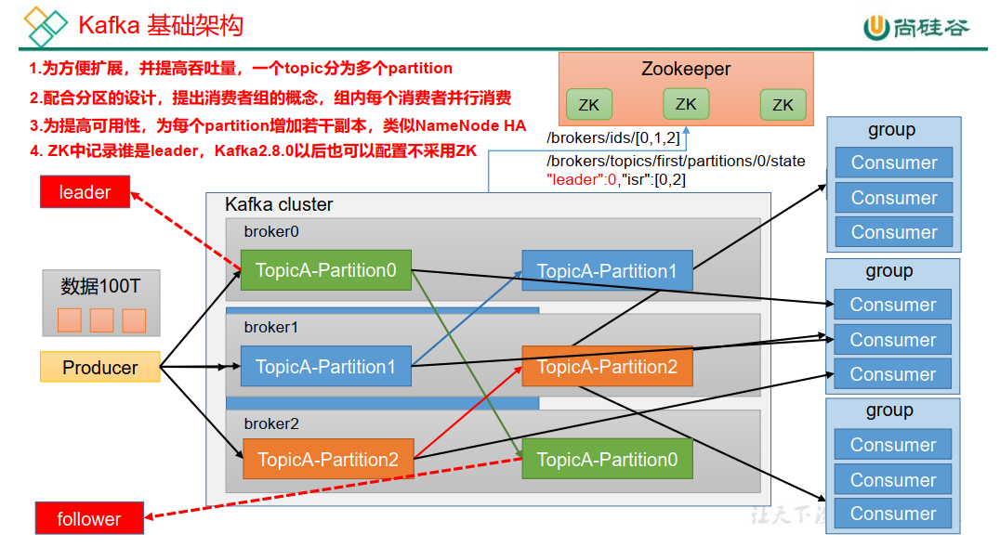
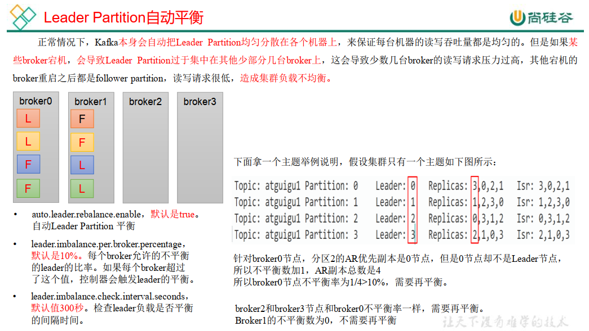
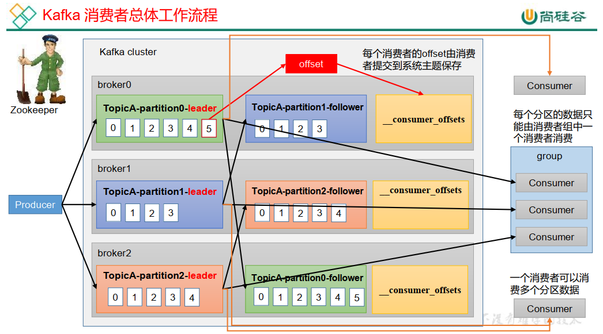
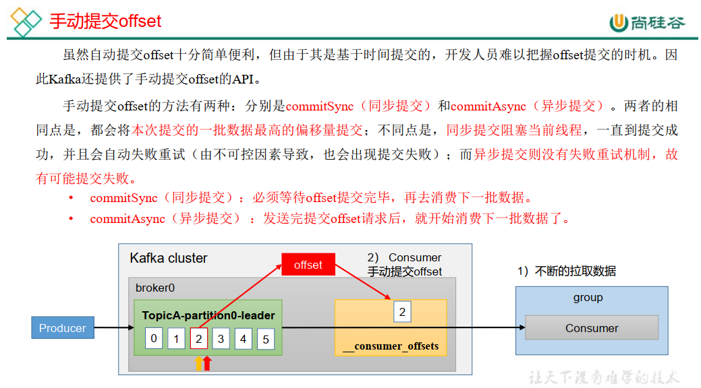

# KafkaNotes

## Kafka 概述

### Kafka 定义

- Kafka传统定义：

  Kafka是一个分布式的基于<span style="color:blue; font-weight:bold">发布/订阅模式的消息队列</span>(Message Queue)，主要应用于<span style="color:blue; font-weight:bold">大数据实时处理领域</span>。

  发布/订阅：消息的发布者不会将消息直接发送给特定的订阅者，而是将发布的消息分为不同的类别，订阅者只接收感兴趣的消息。

- Kafka最新定义：

  Kafka是一个开源的分布式<span style="color:blue; font-weight:bold">事件流平台(Event Streaming Platform)</span>，被数千家公司用于高性能数据管道，流分析，数据集成和关键任务应用。

> Kafka更多是消息队列缓冲

### 消息队列

目前企业中比较常见的消息队列产品主要有 Kafka、 ActiveMQ 、 RabbitMQ 、RocketMQ 等。

在<span style="color:blue; font-weight:bold">大数据场景主要采用 Kafka 作为消息队列</span>。 在 JavaEE 开发中主要采用 ActiveMQ、RabbitMQ、 RocketMQ。

- 传统消息队列的应用场景 

  - 传统的<span style="color:red; font-weight:bold">消息队列</span>的主要应用场景包括： <span style="color:blue; font-weight:bold">缓存/消峰</span>、 <span style="color:blue; font-weight:bold">解耦</span>和<span style="color:blue; font-weight:bold">异步通信</span>。  

    
    
    > 
    
    
    
    > 本来需要一一对应，mysql -->hadoop；mysql --> spark；mysql --> Flink；mysql --> SpringBoot
    >
    > 现在，给一个中间件，所有数据发送到中间件，其他的平台到中间件拉取。
    
    

- 消息队列的两种模式  

  - 点对点模式
  - 发布/订阅模式

  

### Kafka 基础架构***

- P5 - 重复听



> 注意：一个分区的内容，只能由一个消费者消费。
>
> 一个消费者组中多个消费者，一个消费者消费一个分区，这样可以消费整个主题的分区？？？？？？？？？？？？？

- Producer：消息生产者，就是向 Kafka broker 发消息的客户端。

- Consumer：消息消费者，向 Kafka broker 取消息的客户端。

- Consumer Group（CG）：消费者组，由多个 consumer 组成。 消费者组内每个消费者负责消费不同分区的数据，一个分区只能由一个组内消费者消费；消费者组之间互不影响。 所有的消费者都属于某个消费者组，即消费者组是逻辑上的一个订阅者。

- Broker：一台 Kafka 服务器就是一个 broker。一个集群由多个 broker 组成。<span style="color:blue; font-weight:bold">一个broker 可以容纳多个 topic。</span>

-  Topic：可以理解为一个队列， 生产者和消费者面向的都是一个 topic。

- Partition：为了实现扩展性，一个非常大的 topic 可以分布到多个 broker（即服务器）上， 一个 topic 可以分为多个 partition，每个 partition 是一个有序的队列。

- Replication：副本。 一个 topic 的每个分区都有若干个副本，一个 Leader 和若干个Follower。

- Leader：每个分区多个副本的“主”，生产者发送数据的对象，以及消费者消费数据的对象都是 Leader。

- Follower：每个分区多个副本中的“从”，实时从Leader中同步数据，保持和Leader数据的同步。<span style="color:blue; font-weight:bold">Leader发生故障时，某个Follower会成为新的 Leader。 </span>

  > kraft模式：去zookeeper化，已经成为大势所趋，但是需要点时间。

## Kafka 快速入门

### 安装部署

- 集群规划  

  | l9z102    | l9z103    | l9z104    |
  | --------- | --------- | --------- |
  | zookeeper | zookeeper | zookeeper |
  | kafka     | kafka     | kafka     |

- 集群部署  

  - 下载安装包

    - kafka_2.12_3.00.tgz

      producer 和 consumer 是用java代码写的

      broker 是用scala代码写的

      2.12 是scala版本

      3.0.0 是kafka版本

  - 解压安装包  

  - 修改解压后的文件名称 

  - 进入到/opt/module/kafka 目录， 修改配置文件

    server.properties

    ```properties
    #broker 的全局唯一编号，不能重复，只能是数字。
    broker.id=0                # ---------------------------------------修改
    #处理网络请求的线程数量
    num.network.threads=3
    #用来处理磁盘 IO 的线程数量
    num.io.threads=8
    #发送套接字的缓冲区大小
    socket.send.buffer.bytes=102400
    #接收套接字的缓冲区大小
    socket.receive.buffer.bytes=102400
    #请求套接字的缓冲区大小
    socket.request.max.bytes=104857600
    #kafka 运行日志(数据)存放的路径，路径不需要提前创建， kafka 自动帮你创建，可以
    配置多个磁盘路径，路径与路径之间可以用"， "分隔
    log.dirs=/opt/module/kafka_3.0.0/datas              # ---------------------------------------
    #topic 在当前 broker 上的分区个数
    num.partitions=1
    #用来恢复和清理 data 下数据的线程数量
    num.recovery.threads.per.data.dir=1
    # 每个 topic 创建时的副本数，默认时 1 个副本
    offsets.topic.replication.factor=1
    #segment 文件保留的最长时间，超时将被删除
    log.retention.hours=168
    #每个 segment 文件的大小，默认最大 1G
    log.segment.bytes=1073741824
    # 检查过期数据的时间，默认 5 分钟检查一次是否数据过期
    log.retention.check.interval.ms=300000
    #配置连接 Zookeeper 集群地址（在 zk 根目录下创建/kafka，方便管理）
    # zookeeper.connect=localhost:2181
    zookeeper.connect=l9z102:2181,l9z103:2181,l9z104:2181/kafka         # --------------------
    ```

  - 分发kafka

    ```
    xsync kafka/
    ```

    > 分别在 l9z103 和 l9z104 上修改配置文件/opt/module/kafka/config/server.properties中的 broker.id=1、 broker.id=2
    > 注： 。<span style="color:blue; font-weight:bold">broker.id 不得重复，整个集群中唯一。</span> 

  - 配置环境变量  

  - 启动集群  

    - <span style="color:red; font-weight: bold">先启动 Zookeeper 集群，然后启动 Kafka。  </span>

    - 依次在 l9z102、 l9z103、 l9z104节点上启动 Kafka。  

      ```shell
      bin/kafka-server-start.sh -daemon config/server.properties
      bin/kafka-server-start.sh -daemon config/server.properties
      bin/kafka-server-start.sh -daemon config/server.properties
      ```

      > 注意：配置文件的路径要能够到 server.properties。  ？？？？？？？？？？？？？？？？？？？

    - 关闭集群  

      ```mysql
      bin/kafka-server-stop.sh
      bin/kafka-server-stop.sh
      bin/kafka-server-stop.sh
      ```

- 集群启停脚本  

  ```mysql
  #! /bin/bash
  
  case $1 in
  "start"){
      for i in hadoop102 hadoop103 hadoop104
      do
          echo " --------启动 $i Kafka-------"
          ssh $i "/opt/module/kafka/bin/kafka-server-start.sh -daemon /opt/module/kafka/config/server.properties"
  	done
  };;
  
  "stop"){
      for i in hadoop102 hadoop103 hadoop104
      do
          echo " --------停止 $i Kafka-------"
          ssh $i "/opt/module/kafka/bin/kafka-server-stop.sh "
  	done
  };;
  esac
  ```

  > <span style="color:red; font-weight: bold">注意： 停止 Kafka 集群时，一定要等 Kafka 所有节点进程全部停止后再停止 Zookeeper集群。因为 Zookeeper 集群当中记录着 Kafka 集群相关信息， Zookeeper 集群一旦先停止，Kafka 集群就没有办法再获取停止进程的信息，只能手动杀死 Kafka 进程了。  </span>

### Kafka命令行操作

#### <span style="color:blue; font-weight:bold">主题命令行操作</span>

- Topic全部参数  -  kafka-topics.sh	

  ```
  Create, delete, describe, or change a topic.
  Option                                   Description                            
  ------                                   -----------                            
  --alter                                  Alter the number of partitions,        
                                             replica assignment, and/or           
                                             configuration for the topic.         
  --at-min-isr-partitions                  if set when describing topics, only    
                                             show partitions whose isr count is   
                                             equal to the configured minimum.     
  --bootstrap-server <String: server to    REQUIRED: The Kafka server to connect  
    connect to>                              to.                                  
  --command-config <String: command        Property file containing configs to be 
    config property file>                    passed to Admin Client. This is used 
                                             only with --bootstrap-server option  
                                             for describing and altering broker   
                                             configs.                             
  --config <String: name=value>            A topic configuration override for the 
                                             topic being created or altered. The  
                                             following is a list of valid         
                                             configurations:                      
                                           	cleanup.policy                        
                                           	compression.type                      
                                           	delete.retention.ms                   
                                           	file.delete.delay.ms                  
                                           	flush.messages                        
                                           	flush.ms                              
                                           	follower.replication.throttled.       
                                             replicas                             
                                           	index.interval.bytes                  
                                           	leader.replication.throttled.replicas 
                                           	local.retention.bytes                 
                                           	local.retention.ms                    
                                           	max.compaction.lag.ms                 
                                           	max.message.bytes                     
                                           	message.downconversion.enable         
                                           	message.format.version                
                                           	message.timestamp.difference.max.ms   
                                           	message.timestamp.type                
                                           	min.cleanable.dirty.ratio             
                                           	min.compaction.lag.ms                 
                                           	min.insync.replicas                   
                                           	preallocate                           
                                           	remote.storage.enable                 
                                           	retention.bytes                       
                                           	retention.ms                          
                                           	segment.bytes                         
                                           	segment.index.bytes                   
                                           	segment.jitter.ms                     
                                           	segment.ms                            
                                           	unclean.leader.election.enable        
                                           See the Kafka documentation for full   
                                             details on the topic configs. It is  
                                             supported only in combination with --
                                             create if --bootstrap-server option  
                                             is used (the kafka-configs CLI       
                                             supports altering topic configs with 
                                             a --bootstrap-server option).        
  --create                                 Create a new topic.                    
  --delete                                 Delete a topic                         
  --delete-config <String: name>           A topic configuration override to be   
                                             removed for an existing topic (see   
                                             the list of configurations under the 
                                             --config option). Not supported with 
                                             the --bootstrap-server option.       
  --describe                               List details for the given topics.     
  --disable-rack-aware                     Disable rack aware replica assignment  
  --exclude-internal                       exclude internal topics when running   
                                             list or describe command. The        
                                             internal topics will be listed by    
                                             default                              
  --help                                   Print usage information.               
  --if-exists                              if set when altering or deleting or    
                                             describing topics, the action will   
                                             only execute if the topic exists.    
  --if-not-exists                          if set when creating topics, the       
                                             action will only execute if the      
                                             topic does not already exist.        
  --list                                   List all available topics.             
  --partitions <Integer: # of partitions>  The number of partitions for the topic 
                                             being created or altered (WARNING:   
                                             If partitions are increased for a    
                                             topic that has a key, the partition  
                                             logic or ordering of the messages    
                                             will be affected). If not supplied   
                                             for create, defaults to the cluster  
                                             default.                             
  --replica-assignment <String:            A list of manual partition-to-broker   
    broker_id_for_part1_replica1 :           assignments for the topic being      
    broker_id_for_part1_replica2 ,           created or altered.                  
    broker_id_for_part2_replica1 :                                                
    broker_id_for_part2_replica2 , ...>                                           
  --replication-factor <Integer:           The replication factor for each        
    replication factor>                      partition in the topic being         
                                             created. If not supplied, defaults   
                                             to the cluster default.              
  --topic <String: topic>                  The topic to create, alter, describe   
                                             or delete. It also accepts a regular 
                                             expression, except for --create      
                                             option. Put topic name in double     
                                             quotes and use the '\' prefix to     
                                             escape regular expression symbols; e.
                                             g. "test\.topic".                    
  --topics-with-overrides                  if set when describing topics, only    
                                             show topics that have overridden     
                                             configs                              
  --unavailable-partitions                 if set when describing topics, only    
                                             show partitions whose leader is not  
                                             available                            
  --under-min-isr-partitions               if set when describing topics, only    
                                             show partitions whose isr count is   
                                             less than the configured minimum.    
  --under-replicated-partitions            if set when describing topics, only    
                                             show under replicated partitions     
  --version                                Display Kafka version. 主要的主题命令参数
  ```

- 主要参数

  

- 案例实操

  ```shell
  # 列举所有主题
  kafka-topics.sh --bootstrap-server l9z102:9092 --list
  
  # 创建主题
  kafka-topics.sh --bootstrap-server l9z102:9092 
  --topic first --create --partitions 1 --replication-factor 3
  # 主题名                 分区数            副本数
  
  # 列举所有主题详细信息
  kafka-topics.sh --bootstrap-server l9z102:9092 --topic first --describe
  
  # 修改分区数 只能改多，不能改少
  kafka-topics.sh --bootstrap-server l9z102:9092 --topic first --alter --partitions 3
  
  
  # 修改副本
  # 不能通过命令行的方式修改副本
  ```

  > 

#### <span style="color:blue; font-weight:bold">生产者命令行操作</span>

- 全部参数  -   kafka-console-producer.sh

  ```
  Missing required option(s) [bootstrap-server]
  Option                                   Description                            
  ------                                   -----------                            
  --batch-size <Integer: size>             Number of messages to send in a single 
                                             batch if they are not being sent     
                                             synchronously. (default: 200)        
  --bootstrap-server <String: server to    REQUIRED unless --broker-list          
    connect to>                              (deprecated) is specified. The server
                                             (s) to connect to. The broker list   
                                             string in the form HOST1:PORT1,HOST2:
                                             PORT2.                               
  --broker-list <String: broker-list>      DEPRECATED, use --bootstrap-server     
                                             instead; ignored if --bootstrap-     
                                             server is specified.  The broker     
                                             list string in the form HOST1:PORT1, 
                                             HOST2:PORT2.                         
  --compression-codec [String:             The compression codec: either 'none',  
    compression-codec]                       'gzip', 'snappy', 'lz4', or 'zstd'.  
                                             If specified without value, then it  
                                             defaults to 'gzip'                   
  --help                                   Print usage information.               
  --line-reader <String: reader_class>     The class name of the class to use for 
                                             reading lines from standard in. By   
                                             default each line is read as a       
                                             separate message. (default: kafka.   
                                             tools.                               
                                             ConsoleProducer$LineMessageReader)   
  --max-block-ms <Long: max block on       The max time that the producer will    
    send>                                    block for during a send request      
                                             (default: 60000)                     
  --max-memory-bytes <Long: total memory   The total memory used by the producer  
    in bytes>                                to buffer records waiting to be sent 
                                             to the server. (default: 33554432)   
  --max-partition-memory-bytes <Long:      The buffer size allocated for a        
    memory in bytes per partition>           partition. When records are received 
                                             which are smaller than this size the 
                                             producer will attempt to             
                                             optimistically group them together   
                                             until this size is reached.          
                                             (default: 16384)                     
  --message-send-max-retries <Integer>     Brokers can fail receiving the message 
                                             for multiple reasons, and being      
                                             unavailable transiently is just one  
                                             of them. This property specifies the 
                                             number of retries before the         
                                             producer give up and drop this       
                                             message. (default: 3)                
  --metadata-expiry-ms <Long: metadata     The period of time in milliseconds     
    expiration interval>                     after which we force a refresh of    
                                             metadata even if we haven't seen any 
                                             leadership changes. (default: 300000)
  --producer-property <String:             A mechanism to pass user-defined       
    producer_prop>                           properties in the form key=value to  
                                             the producer.                        
  --producer.config <String: config file>  Producer config properties file. Note  
                                             that [producer-property] takes       
                                             precedence over this config.         
  --property <String: prop>                A mechanism to pass user-defined       
                                             properties in the form key=value to  
                                             the message reader. This allows      
                                             custom configuration for a user-     
                                             defined message reader. Default      
                                             properties include:                  
                                           	parse.key=true|false                  
                                           	key.separator=<key.separator>         
                                           	ignore.error=true|false               
  --request-required-acks <String:         The required acks of the producer      
    request required acks>                   requests (default: 1)                
  --request-timeout-ms <Integer: request   The ack timeout of the producer        
    timeout ms>                              requests. Value must be non-negative 
                                             and non-zero (default: 1500)         
  --retry-backoff-ms <Integer>             Before each retry, the producer        
                                             refreshes the metadata of relevant   
                                             topics. Since leader election takes  
                                             a bit of time, this property         
                                             specifies the amount of time that    
                                             the producer waits before refreshing 
                                             the metadata. (default: 100)         
  --socket-buffer-size <Integer: size>     The size of the tcp RECV size.         
                                             (default: 102400)                    
  --sync                                   If set message send requests to the    
                                             brokers are synchronously, one at a  
                                             time as they arrive.                 
  --timeout <Integer: timeout_ms>          If set and the producer is running in  
                                             asynchronous mode, this gives the    
                                             maximum amount of time a message     
                                             will queue awaiting sufficient batch 
                                             size. The value is given in ms.      
                                             (default: 1000)                      
  --topic <String: topic>                  REQUIRED: The topic id to produce      
                                             messages to.                         
  --version                                Display Kafka version.
  ```

- 主要参数

  | 参数                                             | 描述                                   |
  | ------------------------------------------------ | -------------------------------------- |
  | --bootstrap-server <String: server toconnect to> | 连接的 Kafka Broker 主机名称和端口号。 |
  | --topic <String: topic>                          | 操作的 topic 名称。                    |

- 案例实操

  ```shell
  # 开始生产
  kafka-console-producer.sh --bootstrap-server l9z102:9092 --topic first
  ```

  > 

#### <span style="color:blue; font-weight:bold">消费者命令行操作</span>

- 全部参数  -  kafka-console-consumer.sh

  ```
  This tool helps to read data from Kafka topics and outputs it to standard output.
  Option                                   Description                            
  ------                                   -----------                            
  --bootstrap-server <String: server to    REQUIRED: The server(s) to connect to. 
    connect to>                                                                   
  --consumer-property <String:             A mechanism to pass user-defined       
    consumer_prop>                           properties in the form key=value to  
                                             the consumer.                        
  --consumer.config <String: config file>  Consumer config properties file. Note  
                                             that [consumer-property] takes       
                                             precedence over this config.         
  --enable-systest-events                  Log lifecycle events of the consumer   
                                             in addition to logging consumed      
                                             messages. (This is specific for      
                                             system tests.)                       
  --formatter <String: class>              The name of a class to use for         
                                             formatting kafka messages for        
                                             display. (default: kafka.tools.      
                                             DefaultMessageFormatter)             
  --from-beginning                         If the consumer does not already have  
                                             an established offset to consume     
                                             from, start with the earliest        
                                             message present in the log rather    
                                             than the latest message.             
  --group <String: consumer group id>      The consumer group id of the consumer. 
  --help                                   Print usage information.               
  --include <String: Java regex (String)>  Regular expression specifying list of  
                                             topics to include for consumption.   
  --isolation-level <String>               Set to read_committed in order to      
                                             filter out transactional messages    
                                             which are not committed. Set to      
                                             read_uncommitted to read all         
                                             messages. (default: read_uncommitted)
  --key-deserializer <String:                                                     
    deserializer for key>                                                         
  --max-messages <Integer: num_messages>   The maximum number of messages to      
                                             consume before exiting. If not set,  
                                             consumption is continual.            
  --offset <String: consume offset>        The offset to consume from (a non-     
                                             negative number), or 'earliest'      
                                             which means from beginning, or       
                                             'latest' which means from end        
                                             (default: latest)                    
  --partition <Integer: partition>         The partition to consume from.         
                                             Consumption starts from the end of   
                                             the partition unless '--offset' is   
                                             specified.                           
  --property <String: prop>                The properties to initialize the       
                                             message formatter. Default           
                                             properties include:                  
                                            print.timestamp=true|false            
                                            print.key=true|false                  
                                            print.offset=true|false               
                                            print.partition=true|false            
                                            print.headers=true|false              
                                            print.value=true|false                
                                            key.separator=<key.separator>         
                                            line.separator=<line.separator>       
                                            headers.separator=<line.separator>    
                                            null.literal=<null.literal>           
                                            key.deserializer=<key.deserializer>   
                                            value.deserializer=<value.            
                                             deserializer>                        
                                            header.deserializer=<header.          
                                             deserializer>                        
                                           Users can also pass in customized      
                                             properties for their formatter; more 
                                             specifically, users can pass in      
                                             properties keyed with 'key.          
                                             deserializer.', 'value.              
                                             deserializer.' and 'headers.         
                                             deserializer.' prefixes to configure 
                                             their deserializers.                 
  --skip-message-on-error                  If there is an error when processing a 
                                             message, skip it instead of halt.    
  --timeout-ms <Integer: timeout_ms>       If specified, exit if no message is    
                                             available for consumption for the    
                                             specified interval.                  
  --topic <String: topic>                  The topic to consume on.               
  --value-deserializer <String:                                                   
    deserializer for values>                                                      
  --version                                Display Kafka version.                 
  --whitelist <String: Java regex          DEPRECATED, use --include instead;     
    (String)>                                ignored if --include specified.      
                                             Regular expression specifying list   
                                             of topics to include for consumption.
  ```

- 主要参数

  | 参数                                             | 描述                                   |
  | ------------------------------------------------ | -------------------------------------- |
  | --bootstrap-server <String: server toconnect to> | 连接的 Kafka Broker 主机名称和端口号。 |
  | --topic <String: topic>                          | 操作的 topic 名称。                    |
  | --from-beginning                                 | 从头开始消费。                         |
  | --group <String: consumer group id>              | 指定消费者组名称。                     |

- 案例实操

  ```shell
  # 开始增量消费
  kafka-console-consumer.sh --bootstrap-server l9z102:9092 --topic first
  
  # 历史消费
  kafka-console-consumer.sh --bootstrap-server l9z102:9092 --topic first  --from-beginning
  ```

  > 

## Kafka 生产者  

### 生产者消息发送流程

- 发送原理  -  P10  <span style="color:red; font-weight:bold">重复听，去理解。</span>

  在消息发送的过程中，涉及到了两个线程：main 线程和 Sender 线程。在 main 线程中创建了一个双端队列 RecordAccumulator。main 线程将消息发送给 RecordAccumulator，Sender 线程不断从 RecordAccumulator 中拉取消息发送到 Kafka Broker。  


> Interceptors拦截器(可选)一般不用，
>
> Java的序列化器，传输数据太重；大数据框架都有自己的序列化器，比较轻(有用数据多，检验数据少)。
>
> 一个分区会创建一个队列

- 生产者重要参数列表   -  <span style="color:blue; font-weight:bold">重点理解</span>
  - bootstrap.servers
    - 生产者连接集群所需的 broker 地址清单。
    - 例如 l9z102:9092,l9z103:9092,l9z104:9092，可以设置 1 个或者多个，中间用逗号隔开。注意这里并非需要所有的 broker 地址，因为生产者从给定的 broker 里查找到其他 broker 信息。

  - key.serializer 和 value.serializer
    - 指定发送消息的 key 和 value 的序列化类型。一定要写全类名。

  - buffer.memory 
    - RecordAccumulator：缓冲区大小，默认32M

  - batch.size
    - ProducerBatch：批次大小，默认16K    -   小黄块代表一个批次
    - 适当增加该值，<span style="color:blue; font-weight:bold">可以提高吞吐量</span>，但是如果该值设置太大，会导致数据传输延迟增加。

  - linger.ms
    - 等待时间，默认是0ms，表示没有延迟，生产环境调节为5-100ms
    - 如果数据迟迟未达到 batch.size， sender 等待 linger.time 之后就会发送数据。

  - acks
    - 应答机制，默认是 -1；
    - 0：生产者发送过来的数据，不需要等数据落盘应答。 
    - 1：生产者发送过来的数据， Leader 收到数据后应答。
    - -1（all）：生产者发送过来的数据， Leader+和 isr 队列 里面的所有节点收齐数据后应答。
    - <span style="color:blue; font-weight:bold">isr(in-sync replica set)</span>：和leader保持同步的leader+follower集合

  - max.in.flight.requests.per.connection 
    - 允许最多没有返回 ack 的次数， 默认为 5，开启幂等性要保证该值是 1-5 的数字。

  - retries
    - 当消息发送出现错误的时候，系统会重发消息。 retries 表示重试次数。 默认是 int 最大值， 2147483647。
    - 如果设置了重试，还想保证消息的有序性，需要设置 MAX_IN_FLIGHT_REQUESTS_PER_CONNECTION=1，否则在重试此失败消息的时候，其他的消息可能发送成功了。

  - retry.backoff.ms
    - 两次重试之间的时间间隔，默认是 100ms。

  - enable.idempotence
    - 幂等性开启关闭参数，ture开启，fasle关闭。默认开启

  - compression.type
    - 生产者发送的所有数据的压缩方式。 默认是 none，也 就是不压缩。 
    - 支持压缩类型： none、 gzip、 snappy、 lz4 和 zstd。


### 异步发送 API

- 内容讲解 - P11

- 案例实操

  - 创建kafka Maven工程

  - 导入依赖

    ```xml
    <dependencies>
        <dependency>
            <groupId>org.apache.kafka</groupId>
            <artifactId>kafka-clients</artifactId>
            <version>3.0.0</version>
        </dependency>
        
        <!-- 不加这个，会报Failed to load class "org.slf4j.impl.StaticLoggerBinder"错误  -->
        <dependency>
            <groupId>org.slf4j</groupId>
            <artifactId>slf4j-nop</artifactId>
            <version>1.7.2</version>
        </dependency>
        
    </dependencies>
    ```
  
  - 创建包名：
  
    edu.lzu.kafka.producer
  
  - 创建类  -  CustomProducer
  
    ```java
    public class CustomProducer {
        public static void main(String[] args) {
    
            // 0 配置
            Properties properties = new Properties();
    
            // 连接集群  "bootstrap.servers"
            properties.put(ProducerConfig.BOOTSTRAP_SERVERS_CONFIG, "l9z102:9092,l9z103:9092");
    
            // 指定对应的key和value的序列化类型  -   用到了反射
            properties.put(ProducerConfig.KEY_SERIALIZER_CLASS_CONFIG, 
                           StringSerializer.class.getName());
            properties.put(ProducerConfig.VALUE_SERIALIZER_CLASS_CONFIG, 
                           StringSerializer.class.getName());
    
            // 1 创建kafka生产者
            // "" hello
            KafkaProducer<String, String> kafkaProducer = new KafkaProducer<>(properties);
    
            // 2 发送数据
            kafkaProducer.send(new ProducerRecord<>("first", "hello"));
    
            // 3 关闭资源
            kafkaProducer.close();
        }
    }
    ```
  
  - 创建类  -  CustomProducerCallback
  
    ```java
    public class CustomProducerCallback {
        public static void main(String[] args) {
    
            // 0 配置
            Properties properties = new Properties();
    
            // 连接集群  "bootstrap.servers"
            properties.put(ProducerConfig.BOOTSTRAP_SERVERS_CONFIG, "l9z102:9092,l9z103:9092");
    
            // 指定对应的key和value的序列化类型  -   用到了反射
            properties.put(ProducerConfig.KEY_SERIALIZER_CLASS_CONFIG,
                           StringSerializer.class.getName());
            properties.put(ProducerConfig.VALUE_SERIALIZER_CLASS_CONFIG,
                           StringSerializer.class.getName());
    
            // 1 创建kafka生产者
            // "" hello
            KafkaProducer<String, String> kafkaProducer = new KafkaProducer<>(properties);
    
            // 2 发送数据
            // new Callback() 使用了匿名内部类，因为Callback是一个接口
            kafkaProducer.send(new ProducerRecord<>("first", "hello"), new Callback() {
                @Override
                public void onCompletion(RecordMetadata metadata, Exception exception) {
                    if (exception == null) {
                        System.out.println("主题： " + metadata.topic() + " 分区：" 
                                           + metadata.partition());
                    }
                }
            });
    
            // 3 关闭资源
            kafkaProducer.close();
        }
    }
    ```

### 同步发送 API

- 内容讲解 - P13

- 案例实操

  - 创建工程，创建报名  -  同上

  - 创建类  -  CustomProducerSync

    <span style="color:blue; font-weight:bold">只需在异步发送的基础上，再调用一下 get()方法即可。</span>  

    ```java
    public class CustomProducerSync {
        public static void main(String[] args) throws ExecutionException, InterruptedException {
    
            // 0 配置
            Properties properties = new Properties();
    
            // 连接集群  "bootstrap.servers"
            properties.put(ProducerConfig.BOOTSTRAP_SERVERS_CONFIG, "l9z102:9092,l9z103:9092");
    
            // 指定对应的key和value的序列化类型  -   用到了反射
            properties.put(ProducerConfig.KEY_SERIALIZER_CLASS_CONFIG, 
                           StringSerializer.class.getName());
            properties.put(ProducerConfig.VALUE_SERIALIZER_CLASS_CONFIG, 
                           StringSerializer.class.getName());
    
            // 1 创建kafka生产者
            // "" hello
            KafkaProducer<String, String> kafkaProducer = new KafkaProducer<>(properties);
    
            // 2 发送数据  -  同步发送，这里多了一个.get()
            kafkaProducer.send(new ProducerRecord<>("first", "hello")).get();
    
            // 3 关闭资源
            kafkaProducer.close();
        }
    }
    ```

### 生产者分区

- 分区的好处

  


- 生产者发送消息的分区策略 -   默认的分区器 

  - 默认的分区器 DefaultPartitioner  

    ```java
    /**
    * The default partitioning strategy:
    * 
    * If a partition is specified in the record, use it
    * 如果指定分区号，就用指定的分区号
    * If no partition is specified but a key is present choose apartition based on a hash of the key.
    * 如果没有指定分区，但有一个key，选择key的hash值(与分区数取余数)确定的分区
    * If no partition or key is present choose the sticky partition that changes when the batch is full.
    * 如果既没有指定分区，又没有key，则选择粘性分区(一个分区满了之后，才会改变分区)
    *
    * See KIP-480 for details about sticky partitioning.
    * 
    */
    public class DefaultPartitioner implements Partitioner {
    … …
    }
    ```

    

  - 案例实操

    ```java
    package edu.lzu.producer;
    
    import org.apache.kafka.clients.producer.*;
    import org.apache.kafka.common.serialization.StringSerializer;
    
    import java.util.Properties;
    
    
    public class CustomProducerCallbackPartitions {
        public static void main(String[] args) {
    
            // 0 配置
            Properties properties = new Properties();
    
            // 连接集群  "bootstrap.servers"
            properties.put(ProducerConfig.BOOTSTRAP_SERVERS_CONFIG, "l9z102:9092,l9z103:9092");
    
            // 指定对应的key和value的序列化类型  -   用到了反射
            properties.put(ProducerConfig.KEY_SERIALIZER_CLASS_CONFIG, 
                           StringSerializer.class.getName());
            properties.put(ProducerConfig.VALUE_SERIALIZER_CLASS_CONFIG, 
                           StringSerializer.class.getName());
    
            // 1 创建kafka生产者
            // "" hello
            KafkaProducer<String, String> kafkaProducer = new KafkaProducer<>(properties);
    
            // 2 发送数据
            kafkaProducer.send(new ProducerRecord<>("first", 1, "","hello1"), new Callback() {
                @Override
                public void onCompletion(RecordMetadata metadata, Exception exception) {
                    if (exception == null) {
                        System.out.println("主题： " + metadata.topic() + " 分区： " 
                                           + metadata.partition());
                    }
                }
            });
    
            // 3 关闭资源
            kafkaProducer.close();
        }
    }
    ```

    > 面试题：如果想一个项目进入一个分区怎么办？
    >
    > 答：分区策略中，讲key值设置为该项目的类名。
    >
    > 注意：如果项目类名的hash值模掉分区数是一样的，就会发送到同一个分区

- 自定义分区

  - 需求

    实现一个分区器， 发送过来的数据中如果包含 atguigu，就发往 0 号分区，不包含 atguigu，就发往 1 号分区。  

  - 实现步骤 

    - 定义类实现 Partitioner 接口  - MyPartitioner

      ```java
      public class MyPartitioner implements Partitioner {
          
          @Override
          public int partition(String topic, Object key, byte[] bytes, Object value, byte[] bytes1, Cluster cluster) {
      
              // 获取数据
              String msgValues = value.toString();
      
              int par;
      
              if (msgValues.contains("atguigu")) {
                  par = 0;   //  包含"atguigu"，发送到partition = 0
              } else {
                  par = 1;   //  不包含"atguigu"，发送到partition = 1
              }
      
              return par;
          }
      
          @Override
          public void close() {
      
          }
      
          @Override
          public void configure(Map<String, ?> map) {
      
          }
      }
      
      // 记得要关联
      // 关联自定义partitioner
      properties.put(ProducerConfig.PARTITIONER_CLASS_CONFIG, "edu.lzu.producer.MyPartitioner");
      ```

### 生产经验 - 生产者如何提高吞吐量


- 案例代码 - 

  ```java
  public class CustomProducerParameters {
      public static void main(String[] args) {
  
          // 0 配置信息
          Properties properties = new Properties();
  
          // 连接集群 - 必须配置
          properties.put(ProducerConfig.BOOTSTRAP_SERVERS_CONFIG, "l9z102:9092,l9z103:9092");
  
          // 指定对应的key和value的序列化类型 - 必须配置
          properties.put(ProducerConfig.KEY_SERIALIZER_CLASS_CONFIG, 
                         StringSerializer.class.getName());
          properties.put(ProducerConfig.VALUE_SERIALIZER_CLASS_CONFIG, 
                         StringSerializer.class.getName());
  
          // ***RecordAccumulator： 缓冲区大小， 默认 32M： buffer.memory
          properties.put(ProducerConfig.BUFFER_MEMORY_CONFIG, 33554432);
  
          // ***batch.size： 批次大小， 默认 16K
          properties.put(ProducerConfig.BATCH_SIZE_CONFIG, 16384);
  
          // ***linger.ms： 等待时间，默认 0   生产环境5-100ms, 这里取1ms测试
          properties.put(ProducerConfig.LINGER_MS_CONFIG, 1);
  
          // ***compression.type： 压缩，默认 none，可配置值 gzip、 snappy、lz4 和 zstd
          // 通常snappy用的多一点
          properties.put(ProducerConfig.COMPRESSION_TYPE_CONFIG,"snappy");
  
  
          // 1 创建kafka生产者
          KafkaProducer<String, String> kafkaProducer = new KafkaProducer<>(properties);
  
          // 2 发送数据
          kafkaProducer.send(new ProducerRecord<>("first", "hello"));
  
          // 3 关闭资源
          kafkaProducer.close();
      }
  }
  ```

### 生产经验 - 数据可靠性


> acks设置为0/1，都可能会导致数据丢失。


> <span style="color:blue; font-weight:bold">isr(in-sync replica set)</span>：和leader保持同步的leader+follower集合(正常工作的leader和follower)
>
> > replica.lag.time.max.ms：
> >
> > min.insync.replicas：默认的最小副本数，（服务器挂到这个数值时，应该会提示或者报错？？？？？？？？？）
>
> <span style="color:blue; font-weight:bold">数据完全可靠条件</span>：<span style="color:blue; font-weight:bold">acks设置-1(all)</span> + <span style="color:blue; font-weight:bold">分区副本数>=2</span> + <span style="color:blue; font-weight:bold">isr应答的最小副本数>=2</span>


> 注意：acks为-1，可能导致数据重复。

- 案例代码

  ```java
  // Acks
  properties.put(ProducerConfig.ACKS_CONFIG, "1");
  
  // 重试次数 retries，默认是 int 最大值， 2147483647
  properties.put(ProducerConfig.RETRIES_CONFIG, 3);
  ```

  > [Apache Kafka API](https://kafka.apache.org/documentation/#api)

### 生产经验 - 数据去重  -  重点


> kafka 0.11版本以后，引入了一项重大特性：幂等性和事务。

- 幂等性

  

  > PID：Kafka每重启一次，会分配一个新的PID
  >
  > Partition：分区号
  >
  > Sequence Number：单调自增的  （？？？？？？？？？？？？？）
  >
  > 所以，幂等性只能保证：<span style="color:blue; font-weight:bold">在单会话单分区数据不重复。</span>

  - 如何开启幂等性

    开启参数 enable.idempotence 默认为 true， false 关闭。  

- 生产者事务  -  P19 <span style="color:red; font-weight:bold">重复听，去理解。</span>

  

  > 因为幂等性只能保证单会话单分区数据不重复，所以要引入<span style="color:blue; font-weight:bold">事务。</span>
  >
  > 开启事务，必须开启幂等性。
  >
  > 事务ID：transactional.id  
  >
  > > Producer在使用事务功能前，必须先自定义一个唯一的transactional.id。有了transactional.id，即使客户端挂了，重启后也能继续处理未完成的事务。

  - Kafka 的事务一共有如下 5 个 API  

    ```java
    // 1 初始化事务
    void initTransactions();
    // 2 开启事务
    void beginTransaction() throws ProducerFencedException;
    // 3 在事务内提交已经消费的偏移量（主要用于消费者）
    void sendOffsetsToTransaction(Map<TopicPartition, OffsetAndMetadata> offsets,
    String consumerGroupId) throws
    ProducerFencedException;
    // 4 提交事务
    void commitTransaction() throws ProducerFencedException;
    // 5 放弃事务（类似于回滚事务的操作）
    void abortTransaction() throws ProducerFencedException;
    ```

- 案例实操

  ```java
  public class CustomProducerTransactions {
      public static void main(String[] args) {
  
          // 0 配置
          Properties properties = new Properties();
  
          // 连接集群  "bootstrap.servers"
          properties.put(ProducerConfig.BOOTSTRAP_SERVERS_CONFIG, "l9z102:9092,l9z103:9092");
  
          // 指定对应的key和value的序列化类型  -   用到了反射
          properties.put(ProducerConfig.KEY_SERIALIZER_CLASS_CONFIG, 
                         StringSerializer.class.getName());
          properties.put(ProducerConfig.VALUE_SERIALIZER_CLASS_CONFIG, 
                         StringSerializer.class.getName());
  
          // ***指定事务id
          properties.put(ProducerConfig.TRANSACTIONAL_ID_CONFIG, "transactional_id_01");
  
          // 1 创建kafka生产者
          // "" hello
          KafkaProducer<String, String> kafkaProducer = new KafkaProducer<>(properties);
  
          // ***事务相关
          // ***事务初始化
          kafkaProducer.initTransactions();
  
          // ***事务启动
          kafkaProducer.beginTransaction();
  
  
          try {
              // 2 发送数据
              kafkaProducer.send(new ProducerRecord<>("first", "hello"));
  
              // 模拟失败
              // int i = 1 / 0;
  
              // ***提交事务
              kafkaProducer.commitTransaction();
  
          } catch (Exception e) {
              // ***中止事务  
              kafkaProducer.abortTransaction();
          } finally {
              // 3 关闭资源
              kafkaProducer.close();
          }
      }
  }
  ```
  
  > // ***中止事务  
  >
  > kafkaProducer.abortTransaction();
  >
  > 中止事务是报错之后，不传输的关键。

### 生产经验 - 数据有序

> 单分区有序，需要条件：
>
> max.in.flight.requests.per.connection=1         缓存队列只能放1个请求

### 生产经验 - 数据乱序  -  重点


> 开启幂等性之后，max.in.flight.requests.per.connection<=5，都可以保证单分区有序。
>
> 因为：开启幂等性后，kafka服务端会缓存producer发来的最近5个request的元数据。
>
> 幂等性条件：<PID，Partition，Sequence Number> ，其中Sequence Number是自增的

## Kafka Broker

### Zookeeper 存储的 Kafka 信息


> /kafka/brokers/ids
> /kafka/brokers/topics/
>
> /kafka/controller    辅助Leader选取
>
> <span style="color:red; font-weight:bold">0.9版本之前，offset信息存在zookeeper/consumers中，0.9版本之后，offset存在kafka主题中</span>
>
> 原因是，避免kafka与zookeeper大量交互，（大量交互就会导致网络上数据传输非常频繁，压力比较大）

### Kafka Broker 总体工作流程

- P23  -   <span style="color:red; font-weight:bold">重复听，去理解。</span>


### Broker 重要参数

| 参数名称                                | 描述                                                         |
| --------------------------------------- | ------------------------------------------------------------ |
| replica.lag.time.max.ms                 | ISR 中， 如果 Follower 长时间未向 Leader 发送通 信请求或同步数据，<br>则该 Follower 将被踢出 ISR。 该时间阈值， 默认 30s。 |
| auto.leader.rebalance.enable            | 默认是 true。 自动 Leader Partition 平衡。                   |
| leader.imbalance.per.broker.percentage  | 默认是 10%。 每个 broker 允许的不平衡的 leader 的比率。<br/>如果每个 broker 超过了这个值，控制器 会触发 leader 的平衡。 |
| leader.imbalance.check.interval.seconds | 默认值 300 秒。检查 leader 负载是否平衡的间隔时 间。         |
| log.segment.bytes                       | Kafka 中 log 日志是分成一块块存储的，<br/>此配置是 指 log 日志划分 成块的大小， 默认值 1G。 |
| log.index.interval.bytes                | 默认 4kb， kafka 里面每当写入了 4kb 大小的日志 (.log)，<br/>然后就往 index 文件里面记录一个索引。 |
| log.retention.hours                     | Kafka 中数据保存的时间， 默认 7 天。                         |
| log.retention.minutes                   | Kafka 中数据保存的时间， 分钟级别，默认关闭。                |
| log.retention.ms                        | Kafka 中数据保存的时间， 毫秒级别，默认关闭。                |
| log.retention.check.interval.ms         | 检查数据是否保存超时的间隔， 默认是 5 分钟。                 |
| log.retention.bytes                     | 默认等于-1，表示无穷大。 <br/>超过设置的所有日志总大小，删除最早的segment。 |
| log.cleanup.policy                      | 默认是 delete，表示所有数据启用删除策略； <br/>如果设置值为 compact，表示所有数据启用压缩策略。 |
| num.io.threads                          | 默认是 8。 负责写磁盘的线程数。整个参数值要占总核数的 50%。  |
| num.replica.fetchers                    | 副本拉取线程数，这个参数占总核数的 50% 的 1/3                |
| num.network.threads                     | 默认是 3。 数据传输线程数，这个参数占总核数的 50% 的 2/3 。  |
| log.flush.interval.messages             | 强制页缓存刷写到磁盘的条数，<br/>默认是 long 的最大值， 9223372036854775807。<br/>一般不建议修改，交给系统自己管理。 |
| log.flush.interval.ms                   | 每隔多久，刷数据到磁盘，默认是 null。<br/>一般不建 议修改，交给系统自己管理。 |


### 生产经验 - 节点服役和退役

- 服役新节点  
  - 新节点准备  
  - 关闭 l9z104，克隆l9z105  -  (这里包括修改主机名，IP地址)
  - 修改 l9z105 中 kafka 的 broker.id 为 3。  
  - 删除 l9z105 中 kafka 下的 datas 和 logs。  
  - 启动 l9z102、l9z103、l9z104 上的 kafka 集群。 
  - 单独启动 l9z105 中的 kafka。   

- 执行负载均衡操作

  - vim topics-to-move.json  

  ```json
  {
      
      "topics": [
          {"topic": "first"}
      ],
      
      "version": 1
      
  }
  ```

  - 生成一个负载均衡的计划。  

  ```shell
  kafka-reassign-partitions.sh --bootstrap-server l9z102:9092 --topics-to-move-json-file topics-to-move.json --broker-list "0,1,2,3" --generate
  
  Current partition replica assignment
  {"version":1,"partitions":[{"topic":"first","partition":0,"replicas":[0,2,1],"log_dirs":["any","any","any"]},{"topic":"first","partition":1,"replicas":[1,2,0],"log_dirs":["any","any","any"]},{"topic":"first","partition":2,"replicas":[2,0,1],"log_dirs":["any","any","any"]}]}
  
  Proposed partition reassignment configuration
  {"version":1,"partitions":[{"topic":"first","partition":0,"replicas":[3,0,1],"log_dirs":["any","any","any"]},{"topic":"first","partition":1,"replicas":[0,1,2],"log_dirs":["any","any","any"]},{"topic":"first","partition":2,"replicas":[1,2,3],"log_dirs":["any","any","any"]}]}
  ```

  - 创建副本存储计划（所有副本存储在 broker0、 broker1、 broker2、 broker3 中）。  

    vim increase-replication-factor.json  

  ```json
  {"version":1,"partitions":[{"topic":"first","partition":0,"replicas":[3,0,1],"log_dirs":["any","any","any"]},{"topic":"first","partition":1,"replicas":[0,1,2],"log_dirs":["any","any","any"]},{"topic":"first","partition":2,"replicas":[1,2,3],"log_dirs":["any","any","any"]}]}
  ```

  - 执行副本存储计划。  

  ```shell
  kafka-reassign-partitions.sh --bootstrap-server l9z102:9092 --reassignment-json-file increase-replication-factor.json --execute
  ```

  - 验证副本存储计划

  ```shell
  kafka-reassign-partitions.sh --bootstrap-server l9z102:9092 --reassignment-json-file increase-replication-factor.json --verify
  
  # 查看主题情况
  kafka-topics.sh --bootstrap-server l9z102:9092 --topic first --describe
  ```

- 退役旧节点  

- 执行负载均衡操作  

  先按照退役一台节点， 生成执行计划，然后按照服役时操作流程执行负载均衡。  

  - 创建一个要均衡的主题。  

    vim topics-to-move.json  

    ```json
    {
        
        "topics": [
            {"topic": "first"}
        ],
        
        "version": 1
        
    }
    ```

  - 创建执行计划。

    ```shell
    kafka-reassign-partitions.sh --bootstrap-server l9z102:9092 --topics-to-move-json-file topics-to-move.json --broker-list "0,1,2" --generate
    
    Current partition replica assignment
    {"version":1,"partitions":[{"topic":"first","partition":0,"replicas":[3,0,1],"log_dirs":["any","any","any"]},{"topic":"first","partition":1,"replicas":[0,1,2],"log_dirs":["any","any","any"]},{"topic":"first","partition":2,"replicas":[1,2,3],"log_dirs":["any","any","any"]}]}
    
    Proposed partition reassignment configuration
    {"version":1,"partitions":[{"topic":"first","partition":0,"replicas":[2,0,1],"log_dirs":["any","any","any"]},{"topic":"first","partition":1,"replicas":[0,1,2],"log_dirs":["any","any","any"]},{"topic":"first","partition":2,"replicas":[1,2,0],"log_dirs":["any","any","any"]}]}
    ```

  - 创建副本存储计划（所有副本存储在 broker0、 broker1、 broker2 中）。  

    vim increase-replication-factor.json  

    ```json
    {"version":1,"partitions":[{"topic":"first","partition":0,"replicas":[2,0,1],"log_dirs":["any","any","any"]},{"topic":"first","partition":1,"replicas":[0,1,2],"log_dirs":["any","any","any"]},{"topic":"first","partition":2,"replicas":[1,2,0],"log_dirs":["any","any","any"]}]}
    ```

  - 执行副本存储计划。  

    ```shell
    kafka-reassign-partitions.sh --bootstrap-server l9z102:9092 --reassignment-json-file increase-replication-factor.json --execute
    ```

  - 验证副本存储计划。

    ```shell
    kafka-reassign-partitions.sh --bootstrap-server l9z102:9092 --reassignment-json-file increase-replication-factor.json --verify
    
    # 查看主题情况
    kafka-topics.sh --bootstrap-server l9z102:9092 --topic first --describe
    ```

    

### 回顾

- 一概述
  - 1、定义
    - 传统定义：分布式	发布订阅	消息队列
      - 发布订阅：分为多种模式，订阅者根据需求，选择性订阅
    - 最新定义
      - 流平台（存储、计算）
  - 2、消息队列的应用场景
    - 缓存消峰
    - 解耦
    - 异步通信
  - 3、消息队列的两种模式
    - 点对点
      - 一个生产者，一个消费者，一个topic，消费之后的数据会删除，用的不多
    - 发布订阅
      - 多个生产者，多个消费者(相互独立)，多个topic，消费之后的数据不会被删除
    - 4、架构
      - 生产者
      - broker
      - 消费者
      - zookeeper
- 二、入门


### Kafka 副本

> Kafka的副本和Hadoop的副本的区别
>
> - Hadoop的副本是等价的。
> - Kafka的副本分Leader 和 Follower，Kafka 的生产者和消费者的操作对象只针对 Leader。

- 副本基本信息
  - Kafka 副本作用：提高数据可靠性。
  - Kafka 默认副本 1 个，生产环境一般配置为 2 个，保证数据可靠性；太多副本会增加磁盘存储空间，增加网络上数据传输，降低效率。
  - Kafka 中副本分为： Leader 和 Follower。 Kafka 生产者只会把数据发往 Leader，然后 Follower 找 Leader 进行同步数据。
  -  Kafka 分区中的所有副本统称为 <span style="color:blue; font-weight:bold">AR（Assigned Repllicas）</span>。
    - AR = ISR + OSR
    - ISR，表示和 Leader保持同步的 Follower集合。 如果Follower 长时间未向Leader 发送通信请求或同步数据，则该Follower 将被踢出 ISR。该时间阈值由 replica.lag.time.max.ms 参数设定，<span style="color:blue; font-weight:bold">默认 30s</span>。 Leader 发生故障之后，就会从 ISR 中选举新的 Leader。
    - OSR， 表示 Follower 与 Leader 副本同步时，延迟过多的副本。  

- Leader 选举流程  

  - Kafka 集群中有一个 broker 的 Controller 会被选举为 <span style="color:blue; font-weight:bold">Controller Leader</span>；
    - Controller Leader负责管理集群broker 的上下线，所有 topic 的分区副本分配和 Leader 选举等工作。
  - Controller 的信息同步工作是依赖于 Zookeeper 的。  

  

```shell
kafka-topics.sh --bootstrap-server l9z102:9092 --create --topic atguigu1 --partitions 4 --replication-factor 4 

# 试验Leader的选举情况
# 注意，Leader的选举情况是根据ar(replication)的顺序选取的。
```

- Leader 和 Follower 故障处理细节  

  - P32-33

  

  > LEO(Log End Offset)
  >
  > HW(High Watermark)
  >
  > 消费者能够看到的最大的Offset，就是HW-1(高水位线-1)

  

  > 这里不能保证数据的不丢失或者不重复，怎么办呢？？？？？？？？？？？？？？？？？？？？？？？？

- 分区副本分配  - P34

  - 如果 kafka 服务器只有 4 个节点，那么设置 kafka 的分区数大于服务器台数，在 kafka底层如何分配存储副本呢？  

    - 交错存储副本，尽可能负载均衡以及保证数据安全可靠。

  - 案例实操

    - 创建 16 分区， 3 个副本  

    ```shell
    # 创建一个新的 topic， 名称为 second。
    kafka-topics.sh --bootstrap-server l9z102:9092 --create --partitions 16 --replication-factor 3 --topic second
    
    # 查看分区和副本情况
    kafka-topics.sh --bootstrap-server l9z102:9092 --describe --topic second
    ```

    > 要保证Leader均衡

- <span style="color:blue; font-weight:bold">生产经验——手动调整分区副本存储</span>

  

- 案例实操

  手动调整分区副本存储的步骤如下： 

  ```shell
  # 创建一个新的 topic， 名称为 third。
  kafka-topics.sh --bootstrap-server l9z102:9092 --create --partitions 4 --replication-factor 2 --topic third
  
  # 查看分区副本存储情况。
  kafka-topics.sh --bootstrap-server l9z102:9092 --describe --topic third
  
  # 创建副本存储计划（所有副本都指定存储在 broker0、 broker1 中）。
  vim increase-replication-factor.json
  ```

  - 输入下面内容

    ```json
    {
    	"version":1,
    	"partitions":[{"topic":"third","partition":0,"replicas":[0,1]},
    		          {"topic":"third","partition":1,"replicas":[0,1]},
    		          {"topic":"third","partition":2,"replicas":[1,0]},
    		          {"topic":"third","partition":3,"replicas":[1,0]}]
    }
    ```

  - 执行副本计划

    ```shell
    kafka-reassign-partitions.sh --bootstrap-server l9z102:9092 --reassignment-json-file increase-replication-factor.json --execute
    
    # 验证副本存储计划
    kafka-reassign-partitions.sh --bootstrap-server l9z102:9092 --reassignment-json-file increase-replication-factor.json --verify
    
    # 查看分区副本存储情况
    kafka-topics.sh --bootstrap-server l9z102:9092 --describe --topic third
    ```

- 生产经验——Leader Partition 负载平衡  



| 参数名称                                | 描述                                                         |
| --------------------------------------- | ------------------------------------------------------------ |
| auto.leader.rebalance.enable            | 默认是 true。 自动 Leader Partition 平衡。 生产环 境中， leader 重选举的代价比较大，可能会带来 性能影响，建议设置为 false 关闭。 |
| leader.imbalance.per.broker.percentage  | 默认是 10%。 每个 broker 允许的不平衡的 leader 的比率。如果每个 broker 超过了这个值，控制器 会触发 leader 的平衡。 |
| leader.imbalance.check.interval.seconds | 默认值 300 秒。检查 leader 负载是否平衡的间隔 时间。         |

- 生产经验——增加副本因子  

  - 在生产环境当中，由于某个主题的重要等级需要提升，我们考虑增加副本。副本数的增加需要先制定计划，然后根据计划执行。  

  - 创建 topic  

    ```shell
    kafka-topics.sh --bootstrap-server l9z102:9092 --create --partitions 3 --replication-factor 1 --
    topic four
    ```

  - 手动增加副本存储  

    创建副本存储计划（所有副本都指定存储在 broker0、 broker1、 broker2 中）。  

    ```json
    {
        "version":1,
        "partitions":[{"topic":"four","partition":0,"replicas":[0,1,2]},
                      {"topic":"four","partition":1,"replicas":[0,1,2]},
                      {"topic":"four","partition":2,"replicas":[0,1,2]},
                      {"topic":"four","partition":3,"replicas":[0,1,2]}]
    }
    ```

  - 执行副本存储计划。 

    ```shell
    kafka-reassign-partitions.sh --bootstrap-server l9z102:9092 --reassignment-json-file increase-replication-factor.json --execute
    
    # 验证副本存储计划
    kafka-reassign-partitions.sh --bootstrap-server l9z102:9092 --reassignment-json-file increase-replication-factor.json --verify
    
    # 查看分区副本存储情况
    kafka-topics.sh --bootstrap-server l9z102:9092 --describe --topic four
    ```

### 文件存储

- 文件存储机制  -  P38    <span style="color:red; font-weight:bold">重复听，去理解。</span>

  

  - 思考： Topic 数据到底存储在什么位置？  

    - 查看 l9z102（或者 l9z103、 l9z104）的/opt/module/kafka/datas/first-1（first-0、 first-2）路径上的文件。  

      ```
      > 00000000000000000092.index
      > 00000000000000000092.log
      00000000000000000092.snapshot
      > 00000000000000000092.timeindex
      leader-epoch-checkpoint
      partition.metadata
      ```

      > 直接查看 log 日志，发现是乱码。

    - 通过工具查看 index 和 log 信息。

      ```shell
      kafka-run-class.sh kafka.tools.DumpLogSegments --files ./00000000000000000000.index
      ```

  - index 文件和 log 文件详解 

    

    - 日志存储参数配置

      | 参数                     | 描述                                                         |
      | ------------------------ | ------------------------------------------------------------ |
      | log.segment.bytes        | Kafka 中 log 日志是分成一块块存储的，此配置是指 log 日志划分 成块的大小， 默认值 1G。 |
      | log.index.interval.bytes | 默认 4kb， kafka 里面每当写入了 4kb 大小的日志（.log），然后就 往 index 文件里面记录一个索引。 稀疏索引。 |

- 文件清理策略

  <span style="color:blue; font-weight:bold">Kafka 中默认的日志保存时间为 7 天</span>，可以通过调整如下参数修改保存时间。 

  - log.retention.hours， 最低优先级小时，默认 7 天。
  - log.retention.minutes， 分钟。
  - log.retention.ms， 最高优先级毫秒。
  - log.retention.check.interval.ms， 负责设置检查周期，默认 5 分钟。  

  那么日志一旦超过了设置的时间，怎么处理呢？

  - Kafka 中提供的日志清理策略有 <span style="color:blue; font-weight:bold">delete</span> 和 <span style="color:blue; font-weight:bold">compact</span> 两种。  

    - delete 日志删除：将过期数据删除  

      log.cleanup.policy = delete 所有数据启用删除策略  

      - 基于时间：默认打开。 以 segment 中所有记录中的最大时间戳作为该文件时间戳。
      - 基于大小：默认关闭。超过设置的所有日志总大小，删除最早的 segment。
        log.retention.bytes，默认等于-1，表示无穷大。  

    - compact 日志压缩    -  很少用

    

### 高效读写数据  -  重点

- P40

- Kafka 本身是分布式集群，可以采用<span style="color:blue; font-weight:bold">分区技术</span>，并行度高

- 读数据采用<span style="color:blue; font-weight:bold">稀疏索引</span>， 可以快速定位要消费的数据

- <span style="color:blue; font-weight:bold">顺序写磁盘</span>

  Kafka 的 producer 生产数据，要写入到 log 文件中，写的过程是<span style="color:blue; font-weight:bold">一直追加到文件末端</span>，为顺序写。 官网有数据表明，同样的磁盘，顺序写能到 600M/s，而随机写只有 100K/s。这与磁盘的机械机构有关，顺序写之所以快，是因为其省去了大量磁头寻址的时间。 

- <span style="color:blue; font-weight:bold">页缓存 + 零拷贝技术  </span>

  

## Kafka 消费者  

### Kafka 消费方式


> kafka采取拉取数据的模式，从主题中拉取数据消费

### Kafka 消费者工作流程

- 消费者总体工作流程



> <span style="color:blue; font-weight:bold">一个消费者可以消费多个分区(主题)</span>，消费者和消费者之间是独立的
>
> 对于一个<span style="color:blue; font-weight:bold">消费组</span>，每个分区的数据只能由一个消费者消费（消费者组就可以看成一个整体的消费者）
>
> <span style="color:blue; font-weight:bold">问题：如果消费者消费一半，节点挂了，重启后怎么继续消费？</span>
>
> 回答：通过offset记录，可以完成继续消费。（消费到哪里了，这个就是offset）
>
> 0.9版本之前，offset信息存在zookeeper/consumers中，0.9版本之后，offset存在kafka主题中（`__consumer_offsets__`）
>
> 原因是，避免kafka与zookeeper大量交互，（大量交互就会导致网络上数据传输非常频繁，压力比较大）

- 消费者组原理 


> 所有的消费者都会有一个groupid，groupid相同的为一个消费者组
>
> > 消费者组内
> >
> > 消费者组之间


> 


> P44  -   <span style="color:red; font-weight:bold">重复听，去理解。</span>
>
> offset的分区数50 - 事务中也出现了
>
> 7)步骤很重要；


> kafka整个集群是不处理数据的(只用来存储数据)，在生产者和消费者中都有拦截器，可以进行数据处理。
>
> 拦截器还能记录生产和消费数据的多少。

- 消费者重要参数    -   <span style="color:blue; font-weight:bold">重点理解</span>

| 参数名称                               | 描述                                                         |
| -------------------------------------- | ------------------------------------------------------------ |
| bootstrap.servers                      | 向 Kafka 集群建立初始连接用到的 host/port 列表。             |
| key.deserializer 和 value.deserializer | 指定接收消息的 key 和 value 的反序列化类型。一定要写全 类名。 |
| group.id                               | 标记消费者所属的消费者组。                                   |
| enable.auto.commit                     | 默认值为 true，消费者会自动周期性地向服务器提交偏移 量。     |
| auto.commit.interval.ms                | 如果设置了 enable.auto.commit 的值为 true， 则该值定义了 消费者偏移量向 Kafka 提交的频率， 默认 5s。 |
| auto.offset.reset                      | 当 Kafka 中没有初始偏移量或当前偏移量在服务器中不存在 （如，数据被删除了），该如何处理？ earliest：自动重置偏 移量到最早的偏移量。 latest： 默认， 自动重置偏移量为最 新的偏移量。 none：如果消费组原来的（ previous）偏移量 不存在，则向消费者抛异常。 anything：向消费者抛异常。 |
| offsets.topic.num.partitions           | __consumer_offsets 的分区数， 默认是 50 个分区。             |
| heartbeat.interval.ms                  | Kafka 消费者和 coordinator 之间的心跳时间， 默认 3s。 该条目的值必须小于 session.timeout.ms ，也不应该高于 session.timeout.ms 的 1/3。 |
| session.timeout.ms                     | Kafka 消费者和 coordinator 之间连接超时时间， 默认 45s。 超过该值，该消费者被移除，消费者组执行再平衡。 |
| max.poll.interval.ms                   | 消费者处理消息的最大时长， 默认是 5 分钟。超过该值，该 消费者被移除，消费者组执行再平衡。 |
| fetch.min.bytes                        | 默认 1 个字节。消费者获取服务器端一批消息最小的字节 数。     |
| fetch.max.wait.ms                      | 默认 500ms。如果没有从服务器端获取到一批数据的最小字 节数。该时间到，仍然会返回数据。 |
| fetch.max.bytes                        | 默认 Default: 52428800（ 50 m）。消费者获取服务器端一批 消息最大的字节数。如果服务器端一批次的数据大于该值 （50m）仍然可以拉取回来这批数据，因此，这不是一个绝 对最大值。一批次的大小受 message.max.bytes （ broker config） or max.message.bytes （topic config） 影响。 |
| max.poll.records                       | 一次 poll 拉取数据返回消息的最大条数， 默认是 500 条。       |

### 消费者 API  

- 独立消费者案例（订阅主题）  

  - 需求：创建一个独立消费者，消费 first 主题中数据。  

  > 注意： 在消费者 API 代码中必须配置消费者组 id。 命令行启动消费者不填写消费者组id 会被自动填写随机的消费者组 id。

```java
public class CustomConsumer {
    public static void main(String[] args) {
        // 0 配置
        Properties properties = new Properties();

        // 连接
        properties.put(ConsumerConfig.BOOTSTRAP_SERVERS_CONFIG, "l9z102:9092,l9z103:9092");

        // 反序列化
        properties.put(ConsumerConfig.KEY_DESERIALIZER_CLASS_CONFIG, 
                       StringDeserializer.class.getName());
        properties.put(ConsumerConfig.VALUE_DESERIALIZER_CLASS_CONFIG, 
                       StringDeserializer.class.getName());
        
        // 配置消费者组id
        properties.put(ConsumerConfig.GROUP_ID_CONFIG, "test01");
        
        // 1 创建一个消费者
        KafkaConsumer<String, String> kafkaConsumer = new KafkaConsumer<>(properties);
        
        // 2 定义主题
        ArrayList<String> topics = new ArrayList<>();
        topics.add("first");
        kafkaConsumer.subscribe(topics);
        
        // 3 消费数据
        while (true) {
            ConsumerRecords<String, String> consumerRecords = kafkaConsumer.poll(Duration.ofSeconds(1));

            for (ConsumerRecord<String, String> consumerRecord : consumerRecords) {
                System.out.println(consumerRecord);
            }
        }
    }
}
```

- 独立消费者案例（订阅主分区） 

```java
public class CustomConsumerPartition {
    public static void main(String[] args) {
        // 0 配置
        Properties properties = new Properties();

        // 连接
        properties.put(ConsumerConfig.BOOTSTRAP_SERVERS_CONFIG, "l9z102:9092,l9z103:9092");

        // 反序列化
        properties.put(ConsumerConfig.KEY_DESERIALIZER_CLASS_CONFIG, 
                       StringDeserializer.class.getName());
        properties.put(ConsumerConfig.VALUE_DESERIALIZER_CLASS_CONFIG, 
                       StringDeserializer.class.getName());

        // 指定组id
        properties.put(ConsumerConfig.GROUP_ID_CONFIG, "test01");

        // 1 创建消费者
        KafkaConsumer<String, String> kafkaConsumer = new KafkaConsumer<>(properties);

        // 2 订阅主题对应的分区
        ArrayList<TopicPartition> topicPartitions = new ArrayList<>();
        topicPartitions.add(new TopicPartition("first", 0));
        kafkaConsumer.assign(topicPartitions);

        // 消费数据
        while (true) {
            ConsumerRecords<String, String> consumerRecords = kafkaConsumer.poll(Duration.ofSeconds(1));

            for (ConsumerRecord<String, String> consumerRecord : consumerRecords) {
                System.out.println(consumerRecord);
            }
        }
    }
}
```

- 消费者组案例
  - 需求：测试同一个主题的分区数据， 只能由一个消费者组中的一个消费

```java
```

### 生产经验——分区的分配以及再平衡   -   面试重点


> 消费者组内一个消费者超时45s，则触发再平衡，给其他消费者进行消费。

- 参数列表

  | 参数名称                      | 描述                                                         |
  | ----------------------------- | ------------------------------------------------------------ |
  | heartbeat.interval.ms         | Kafka 消费者和 coordinator 之间的心跳时间， 默认 3s。 <br>该条目的值必须小于 session.timeout.ms，也不应该高于 session.timeout.ms 的 1/3。 |
  | session.timeout.ms            | Kafka 消费者和 coordinator 之间连接超时时间， 默认 45s。<br/>超 过该值，该消费者被移除，消费者组执行再平衡。 |
  | max.poll.interval.ms          | 消费者处理消息的最大时长， 默认是 5 分钟。<br/>超过该值，该 消费者被移除，消费者组执行再平衡。 |
  | partition.assignment.strategy | <span style="color:blue; font-weight:bold">消费者分区分配策略，默认策略是Range + CooperativeSticky。</span> <br/>Kafka 可以同时使用多个分区分配策略。可以选择的策略包括：Range 、RoundRobin 、Sticky 、CooperativeSticky |

#### Range 以及再平衡


> Range把多出来的分区都给了前几个消费者，所以当topic比较多的时候，容易产生数据倾斜。
>
> <span style="color:blue; font-weight:bold">Range是分配好之后，连着的几个分区分给一个消费者</span>  -  和下面的RoundRobin的轮询算法对比

- Range 分区分配策略案例  

  ```shell
  # 修改first主题为7个分区
  kafka-topics.sh --bootstrap-server l9z102:9092  --alter --topic first --partitions 7
  ```

  > <span style="color:red; font-weight:bold">注意：命令行，只能增加分区个数，不能减少分区个数。</span>

  - 复制 CustomConsumer 类， 创建 CustomConsumer2。这样可以由三个消费者CustomConsumer、 CustomConsumer1、 CustomConsumer2 组成消费者组，组名都为“ test”，同时启动 3 个消费者。  

  - 启动 CustomProducer 生产者，发送 500 条消息，随机发送到不同的分区。  

    <span style="color:red; font-weight:bold">说明： Kafka 默认的分区分配策略就是 Range + CooperativeSticky， 所以不需要修改策略。  </span>

  > 

#### RoundRobin 以及再平衡


> <span style="color:blue; font-weight:bold">轮询算法是：将分区依次轮着分配给消费者</span>  -  和上面的Range对比

- RoundRobin 分区分配策略案例 

  ```java
  // 修改分区分配策略
  properties.put(ConsumerConfig.PARTITION_ASSIGNMENT_STRATEGY_CONFIG, "org.apache.kafka.clients.consumer.RoundRobinAssignor");
  ```

#### Sticky 以及再平衡

- 粘性分区定义： 可以理解为分配的结果带有“粘性的”。即在执行一次新的分配之前，考虑上一次分配的结果，尽量少的调整分配的变动，可以节省大量的开销。
- 粘性分区是 Kafka 从 0.11.x 版本开始引入这种分配策略， 首先会尽量均衡的放置分区到消费者上面，在出现同一消费者组内消费者出现问题的时候，会尽量保持原有分配的分区不变化。  

- 需求：

  设置主题为 first， 7 个分区；准备 3 个消费者，采用粘性分区策略，并进行消费，观察消费分配情况。然后再停止其中一个消费者，再次观察消费分配情况。  

- 步骤  

  - 修改分区分配策略为粘性。 

  >  注意： 3 个消费者都应该注释掉，之后重启 3 个消费者，如果出现报错，全部停止等会再重启，或者修改为全新的消费者组。  

  ```java
  // 修改分区分配策略
  ArrayList<String> startegys = new ArrayList<>();
  startegys.add("org.apache.kafka.clients.consumer.StickyAssignor");
  properties.put(ConsumerConfig.PARTITION_ASSIGNMENT_STRATEGY_CONFIG, startegys);
  ```

### offset 位移  


- __consumer_offsets 主题里面采用 key 和 value 的方式存储数据。 key 是 group.id+topic+分区号， value 就是当前 offset 的值。 每隔一段时间， kafka 内部会对这个 topic 进行compact，也就是每个 group.id+topic+分区号就保留最新数据。  


#### 自动提交 offset  


- 参数列表

  | 参数名称                | 描述                                                         |
  | ----------------------- | ------------------------------------------------------------ |
  | enable.auto.commit      | 默认值为 true，消费者会自动周期性地向服务器提交偏移量。      |
  | auto.commit.interval.ms | 如果设置了 enable.auto.commit 的值为 true， 则该值定义了消 费者偏移量向 Kafka 提交的频率， 默认 5s。 |

- 案例实操

  ```java
  // 自动提交Offset
  properties.put(ConsumerConfig.ENABLE_AUTO_COMMIT_CONFIG, true);  // 默认就是true
  
  // 提交时间
  properties.put(ConsumerConfig.AUTO_COMMIT_INTERVAL_MS_CONFIG, 1000);
  ```

#### 手动提交offset



> 

- 同步提交 offset  

  由于同步提交 offset 有失败重试机制，故更加可靠， 但是由于一直等待提交结果，提交的效率比较低。 

  ```java
  // 改为手动提交
  properties.put(ConsumerConfig.ENABLE_AUTO_COMMIT_CONFIG, false);  // 默认就是true
  
  // 手动提交offset
  kafkaConsumer.commitSync();   // 同步提交
  ```

- 异步提交 offset  

  虽然同步提交 offset 更可靠一些，但是由于其会阻塞当前线程，直到提交成功。因此吞吐量会受到很大的影响。因此更多的情况下，会选用异步提交 offset 的方式。  

  ```java
  // 改为手动提交
  properties.put(ConsumerConfig.ENABLE_AUTO_COMMIT_CONFIG, false);  // 默认就是true
  
  // 手动提交offset
  kafkaConsumer.commitAsync();  // 异步提交
  ```

> <span style="color:blue; font-weight:bold">生产环境中，采用异步的时候比较多，提高效率。</span>

#### 指定 Offset 消费

- `auto.offset.reset = earliest | latest | none` 默认是 `latest`。
  当 Kafka 中没有初始偏移量（消费者组第一次消费）或服务器上不再存在当前偏移量时（例如该数据已被删除），该怎么办？

  - <span style="color:blue; font-weight:bold">earliest</span>：自动将偏移量重置为最早的偏移量， `--from-beginning`。
  - <span style="color:blue; font-weight:bold">latest</span>（默认值）：自动将偏移量重置为最新偏移量。  
  - <span style="color:blue; font-weight:bold">none</span>：如果未找到消费者组的先前偏移量，则向消费者抛出异常。  
  - <span style="color:blue; font-weight:bold">任意指定 offset 位移开始消费。</span>

  

  ```java
  ```

  > <span style="color:red; font-weight:bold">注意：每次执行完，需要修改消费者组名</span>

#### 指定时间消费

- 需求：

  在生产环境中，会遇到最近消费的几个小时数据异常，想重新按照时间消费。例如要求按照时间消费前一天的数据，怎么处理？  

- 案例实操

  ```java
  
  ```

#### 漏消费和重复消费

- 重复消费： 已经消费了数据，但是 offset 没提交。
- 漏消费： 先提交 offset 后消费，有可能会造成数据的漏消费。  


> 思考：怎么能做到既不漏消费也不重复消费呢？ 详看消费者事务。
>
> ​           <span style="color:blue; font-weight:bold">使用事务</span>

### 生产经验——消费者事务


> mysql，kafka支持事务
>
> Hbase不支持事务

### 生产经验——数据积压（消费者如何提高吞吐量）

- P58 重复观看


> 同时增加消费者和分区数
>
> > 若只增加分区数，消费者少，还是提高不了消费速度
> >
> > 若只增加组内消费者数量，因为一个分区只能被组内的一个消费者进行消费，还是提高不了消费速度
>
> 

- 参数列表

  | 参数名称         | 描述                                                         |
  | ---------------- | ------------------------------------------------------------ |
  | fetch.max.bytes  | 默认 Default: 52428800（50 m）。消费者获取服务器端一批消息最大的字节数。<br>如果服务器端一批次的数据大于该值 (50m)仍然可以拉取回来这批数据，因此，这不是一个绝对最大值。一批次的大小受 message.max.bytes （broker config） or max.message.bytes （topic config）影响。 |
  | max.poll.records | 一次 poll 拉取数据返回消息的最大条数， 默认是 500 条。       |


## 回顾

### 生产者API

```java
// 0 配置

// 1 创建生产者

// 2 发送数据

// 3 关闭资源

```

### 消费者API

```java
// 0 配置

// 1 创建消费者

// 2 订阅主题(分区)

// 3 消费数据 
```

### 一、概述
- 1、定义

  - 1）传统定义
    - 分布式  发布订阅   消息队列
    - 发布订阅：分为多种类型 订阅者根据需求 选择性订阅
  - 2）最新定义
    - 流平台（存储、计算）

- 2、消息队列应用场景

  - 1）缓存消峰 
  - 2）解耦
  - 3）异步通信

- 3、两种模式

  - 1）点对点
    - 一个生产者 一个消费者 一个topic  会删除数据  不多

  - 2）发布订阅
    - 多个生产者  消费者多个  而且相互独立  多个topic 不会删除数据

- 4、架构

  - 1）生产者

    - 100T数据

  - 2）broker 

    - （1）broker  服务器 hadoop102 103 104

    - （2）topic 主题  对数据分类

    - （3）分区 

    - （4）可靠性  副本

    - （5）leader  follower 

    - （6）生产者和消费者  只针对leader操作	

  - 3）消费者

    - （1）消费者和消费者相互独立

    - （2）消费者组 （某个分区 只能由一个消费者消费）

  - 4）zookeeper

    - （1）broker.ids 0 1 2 

    - （2）leader 

### 二、入门
- 1、安装

  - 1）broker.id  必须全局唯一

  - 2）broker.id、log.dirs zk/kafka

  - 3）启动停止  先停止kafka  再停zk

  - 4）脚本

  ```shell
  #!/bin/bash
  
  case $1 in
  "start"){
      for i in l9z102 l9z103 l9z104
      do
      	echo " --------启动 $i Kafka-------"
      	ssh $i "/opt/module/kafka-3.0.0/bin/kafka-server-start.sh -daemon /opt/module/kafka-3.0.0/config/server.properties"
      done
      };;
      "stop"){
      for i in l9z102 l9z103 l9z104
      do
      	echo " --------停止 $i Kafka-------"
      	ssh $i "/opt/module/kafka-3.0.0/bin/kafka-server-stop.sh "
      done
  };;
  esac
  
  ```

- 2、常用命令行

  - 1）主题 kafka-topic.sh 

    - （1）--bootstrap-server  hadoop102:9092,hadoop103:9092

    - （2）--topic first

    - （3）--create 

    - （4）--delete

    - （5）--alter

    - （6）--list

    - （7）--describe

    - （8）--partitions

    - （9）--replication-factor 

  - 2）生产者 kafka-console-producer.sh 

    - （1）--bootstrap-server  hadoop102:9092,hadoop103:9092

    - （2）--topic first

  - 3）消费者 kafka-console-consumer.sh 

    - （1）--bootstrap-server  hadoop102:9092,hadoop103:9092

    - （2）--topic first

### 三、生产者 
- 1、原理

- 2、异步发送API

  - 0）配置

    - （1）连接  bootstrap-server 

    - （2）key value序列化

  - 1）创建生产者

    - KafkaProducer<String,String>()

  - 2）发送数据
    - send() send(,new Callback)

  - 3）关闭资源	

- 3、同步发送	

  ```java
  。。。
  send() 
  send(,new Callback).get()
  。。。
  ```

- 4、分区	

  - 1）好处

    - 存储
    - 计算

  - 2）默认分区规则

    - （1）指定分区 按分区走

    - （2）key  key的hashcode值%分区数

    - （3）没有指定key  没有指定分区   粘性  第一次随机指定分区

  - 3）自定义分区

    - 定义类 实现partitioner接口 

- 5、吞吐量提高

  - 1）批次大小  16k  32k

  - 2）linger.ms  0  => 5-100ms

  - 3）压缩  

  - 4）缓存大小  32m  => 64m 

- 6、可靠性 

  - acks  
    - 0  丢失数据
    - 1   也可能会丢  传输普通日志
    - -1  完全可靠  + 副本大于等于2  isr >=2    => 数据重复

- 7、数据重复

  - 1）幂等性

    - <pid, 分区号，序列号>

    - 默认打开

  - 2）事务

    - 底层基于幂等性

      - （1）初始化

      - （2）启动

      - （3）消费者offset

      - （4）提交

      - （5）终止	

- 8、数据有序

  - 单分区内有序（有条件）

  - 多分区有序怎么办？

- 9、乱序
  - 1）inflight  =1 
  - 2）没有幂等性 inflight  =1 
  - 3）有幂等性

### 四、broker 
- 1、zk存储了哪些信息

  - （1）broker.ids

  - （2）leader 

  - （3）辅助选举  controller 

- 2、工作流程

- 3、服役

  - 1）准备一台干净服务器 hadoop100

  - 2）对哪个主题操作 

  - 3）形成计划

  - 4）执行计划

  - 5）验证计划

- 4、退役

  - 1）要退役的节点不让存储数据

  - 2）退出节点

-------------------------------------------------------------

- 5、副本 

  - 1）副本的好处   提高可靠性
  - 2）生产环境中通常2个  默认1个
  - 3）和hadoop的副本区别在于：有leader follower之分，所有的生产者和消费者针对的是leader 
  - 4）isr 里存储的是能和leader正常通信的副本；ar 副本系统
  - 5）controller辅助选取leader：首先在 isr[0  2  3] 存活，然后根据ar [0  1  2  3]顺序选取
    - <span style="color:red; font-weight:bold">controller怎么选的？</span>
  - 6）Leader 挂了 ：
  - 7）follower 挂了 ：
  - 8）副本分配 默认 
  - 9）手动副本分配：制定计划  -  执行计划  -  验证计划  
  - 10）leader partition的负载均衡  10%
  - 11）手动增加副本因子 
  
- 6、文件存储机制 
  
  - broker   topic   partition   log   segment 1g   稀疏索引(<span style="color:red; font-weight:bold">面试点</span>)  4kb 
  
- 7、删除数据
  
  - 默认7天   3天  7小时
  
  - 超出了日期，kafka的两种清楚策略：  删除  压缩 

  - 删除：
  
  - 压缩：
  
- 8、高效读写  -  <span style="color:red; font-weight:bold">重点</span>
  
  - 1）集群  采用分区
  
  - 2）稀疏索引 
  
  - 3）顺序读写 
  
  - 4）零拷贝 和 页缓存 

### 五、消费者

- 1、总体流程

- 2、消费者组 ：单个消费者也是一个消费者组

- 3、按照主题消费
  
  - 0）配置信息
  
    - 连接
  
    - 反序列化
  
    - 组id 
  
  - 1）创建消费者
  
  - 2）订阅主题
  
  - 3）消费数据

- 4、按照分区 

- 5、消费者组案例
  
  - 组id 相同，构成一个消费者组
  
- 6、分区分配策略  -  再平衡  -  面试重点
  
  - 7个分区  3个消费者
  
  - range的分配方案：
  
    - 0  1  2 
  
    - 3  4 
  
    - 5  6 
  
    > 缺点：容易产生数据倾斜，(因为多出来的总是给第一个消费者)
    >
    > 再平衡：其中一个挂了，他的消费分区会全部给到一个消费者。
  
  - roundrobin  轮询  分配方案：
  
    - 0  3  6
  
    - 1  4
  
    - 2  5
  
    > 再平衡：其中一个挂了，他的消费分区会<span style="color:blue; font-weight:bold">轮询</span>给其他消费者。
  
  - 粘性  2  2  3 
  
    - 0  3  4
  
    - 2  6
  
    - 1  5 
  
    > 随机，并尽量的均匀
    >
    > 再平衡：其中一个挂了，他的消费分区会<span style="color:blue; font-weight:bold">随机，并尽量的均匀</span>给其他消费者
  
  > 分区的位置是按hash值排列的？？？？？？？？？？？？？？？？？

- 7、offset
  
  - 1）默认存储在系统主题
  
  - 2）自动提交  5s   默认
  
  - 3）手动提交  同步  异步

  - 4）指定offset消费  `seek()`  -  面试
  
  - 5）按照时间消费   -   面试
  
  - 6）漏消费  重复消费
  
- 8、事务
  
  - 生产端  =》 集群
  
  - 集群 =》 消费者
  
  - 消费者 =》 框架
  
- 9、数据积压
  
  - 1、增加分区   增加消费者个数
  
  - 2、生产  =》 集群  4个参数
  
  - 3、消费端  两个参数    ‘50m’  ‘500条’ 

## Kafka-Eagle监控


​	
​	
​		
​		
​		
​		
​			


​	
​		
​		
​		
​		
​		


