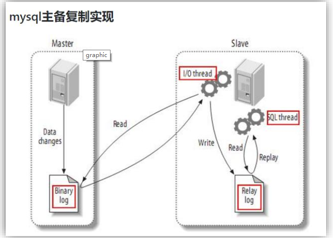

# MaxwellNotes

## Remark

- maxwell 用来**实时读取**mysql数据到kafka，再利用flume上传到HDFS()

  sqoop 是**离线处理**，可以通过azkaban定时发送到HDFS

  ```mermaid
  graph LR;
    
    mysql-->sqoop
    sqoop-->HDFS
    mysql-->Maxwell
    Maxwell-->Kafka
    Kafka-->Flume
    Flume-->HDFS
  ```

## 第一章 Maxwell 概述

### maxwell 定义

- 从官网可以看到，maxwell从1.30开始不再支持jdk1.8，所以如果公司使用的是jdk1.8，建议使用maxwell1.29

- mysql 主从复制过程？？？？？？？？？？？？？？？？？？？？？？？？

  


### maxwell 工作原理

- Maxwell 的工作原理很简单，就是把自己伪装成 MySQL 的一个 slave，然后以 slave的身份假装从 MySQL(master)复制数据。  


- MySQL 的 binlog 

  - 什么是 binlog  

  - binlog 的开启  

  - binlog 的分类设置  

    mysql binlog 的格式有三种，分别是 STATEMENT,MIXED,ROW。在配置文件中可以选择配置 binlog_format= statement|mixed|row  


- maxwell 和 cancal

  |     对比     |  Canal   |        Maxwell        |
  | :----------: | :------: | :-------------------: |
  |     语言     |   java   |         java          |
  |   数据格式   | 格式自由 |         json          |
  | 采集数据模式 |   增量   |       全量/增量       |
  |   数据落地   |   定制   | 支持 kafka 等多种平台 |
  |      HA      |   支持   |         支持          |


## 第二章 Maxwell 使用

### maxwell 安装部署

- mysql binlog

  - 修改 mysql 的配置文件，开启 MySQL Binlog 设置  

    ```shell
    atguigu@hadoop102 software]$ sudo vim /etc/my.cnf
    在[mysqld]模块下添加一下内容
    [mysqld]
    server_id=1
    # 生成binlog文件的头目录 （mysql-bin.000001）
    log-bin=mysql-bin
    binlog_format=row
    binlog-do-db=test_maxwell
        
    # 并重启 Mysql 服务
    [atguigu@hadoop102 software]$ sudo systemctl restart mysqld
    # 登录 mysql 并查看是否修改完成
    [atguigu@hadoop102 ~]$ mysql -uroot -pli123...
    mysql> show variables like '%binlog%';
    # 查看下列属性
    binlog_format | ROW
    ```

  - 进入/var/lib/mysql 目录，查看 MySQL 生成的 binlog 文件  

    ```shell
    [atguigu@hadoop102 ~]$ cd /var/lib/mysql
    [atguigu@hadoop102 mysql]$ sudo ls -l
    总用量 188500
    -rw-r-----. 1 mysql mysql 154 11 月 17 16:30 mysqlbin.000001
    -rw-r-----. 1 mysql mysql 19  11 月 17 16:30 mysqlbin.index
    ```

    > mysql >> show master status  

- 初始化 Maxwell 元数据库

  给 maxwell 一些权限


- Maxwell 进程启动

  ```shell
  bin/maxwell --config ./config.properties --daemon
  # 后台运行，会生成一个logs文件夹
  ```

  


### maxwell 入门案例

#### 监控 Mysql 数据并在控制台打印  


#### 监控 Mysql 数据输出到 kafka  

> 先开启 zokeeper 和 kafka 

- maxwell 可以通过命令行启动

```
bin/maxwell --user='maxwell' --password='li123...' --host='l9z102' --producer=stdout

bin/maxwell --user='maxwell' --password='li123...' --host='l9z102' --producer=kafka --kafka.bootstrap.servers=l9z102:9092  --kafka_topic=maxwell
```

- maxwel 可以通过配置文件启动

  ```shell
  /bin/maxwell --config /config.properties --daemon
  ```

  


#### 监控 Mysql 指定表数据输出控制台 

- 只监控`db_maxwell.test01`，这一个表

```shell
bin/maxwell --user='maxwell' --password='li123...' --host='l9z102' --filter 'exclude: *.*, include:db_maxwell.test01' --producer=stdout
```

> `--filter 'exclude: *.*, include:db_maxwell.test01'` ：把所有表都排除，只包含`db_maxwell.test01`

```shell
bin/maxwell --user='maxwell' --password='li123...' --host='l9z102' --filter 'exclude: *.*, include:db_maxwell.*' --producer=stdout
```


#### 监控 Mysql 指定表全量数据输出控制台，数据初始化  

​        Maxwell 进程默认只能监控 mysql 的 binlog 日志的新增及变化的数据，但是Maxwell 是支持数据初始化的，可以通过修改 Maxwell 的元数据，来对 MySQL 的某张表进行数据初始化，也就是我们常说的全量同步。

具体操作步骤如下：  

- 需求：将 test_maxwell 库下的 test2 表的四条数据，全量导入到 maxwell 控制台进行打印

  修改 Maxwell 的元数据，触发数据初始化机制， 在 mysql 的 maxwell 库中 bootstrap表中插入一条数据， 写明需要全量数据的库名和表名。 

  ```shell
  mysql> insert into maxwell.bootstrap(database_name,table_name) values('db_maxwell','test02');
  # 全量同步db_maxwell.test02表的全部数据
  # 如果maxwell启动着，会立刻全量同步，如果没有开，会在第一次启动maxwell时全量同步，以后再不会。
  ```

  > 当数据全部初始化完成以后， Maxwell 的元数据会变化
  >
  > - is_complete 字段从 0 变为 1
  >
  > - start_at 字段从 null 变为具体时间(数据同步开始时间)
  >
  > - complete_at 字段从 null 变为具体时间(数据同步结束时间)  

- Maxwell提供了bootstrap功能来进行历史数据的全量同步

```shell
bin/maxwell-bootstrap --database db_maxwell --table test01 --config /opt/module/maxwell/config.properties
# 将--database db_maxwell --table test01的全部数据同步出来
# 此时这个数据库中的表中，只有三条数据
# 第一条和最后一条是

{"database":"db_maxwell","table":"test01","type":"bootstrap-start","ts":1677165145,"data":{}}
{"database":"db_maxwell","table":"test01","type":"bootstrap-insert","ts":1677165145,"data":{"id":1,"name":"JOM"}}
{"database":"db_maxwell","table":"test01","type":"bootstrap-insert","ts":1677165145,"data":{"id":1,"name":"2"}}
{"database":"db_maxwell","table":"test01","type":"bootstrap-insert","ts":1677165145,"data":{"id":2,"name":"th"}}
{"database":"db_maxwell","table":"test01","type":"bootstrap-complete","ts":1677165145,"data":{}}

```


