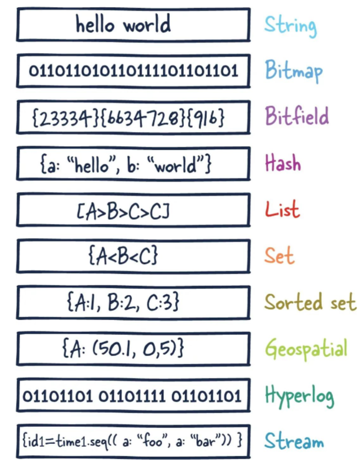

# RedisNotes

## 1. NoSQL数据库简介


## 2. Redis概述安装

- Redis是一个开源的key-value存储系统。
- 和Memcached类似，它支持存储的value类型相对更多，包括string(字符串)、list(链表)、set(集合)、zset(sorted set --有序集合)和hash（哈希类型）。
- 这些数据类型都支持push/pop、add/remove及取交集并集和差集及更丰富的操作，而且这些操作都是原子性的。
- 在此基础上，Redis支持各种不同方式的排序。
- 与memcached一样，为了保证效率，数据都是缓存在内存中。
- 区别的是Redis会周期性的把更新的数据写入磁盘或者把修改操作写入追加的记录文件。
- 并且在此基础上实现了master-slave(主从)同步。

### 应用场景


### Redis安装**

> P9 - P10

- 把redis7自带的配置文件拷贝一份，放到/myredis/**redis.conf**
- 修改拷贝的配置文件**redis.conf**
- 


### Redis启动

- redis服务启动：`/usr/local/bin`目录下运行`redis-server`，启用`/myredis`目录下的`redis.conf`文件

  ```shell
  redis-server /opt/module/redis-7.0.8/myredis/redis7.conf
  # 使用redis-server启动redis服务，使用我们自己配置的文件/myredis/redis7.conf
  
  # 查看redis服务是否启动
  ps -ef | grep redis
  # >>> lijzh      2732      1  0 00:01 ?        00:00:00 redis-server *:6379 
  ```

- 连接redis：使用`redis-cli`

  ```shell
  # 本机访问可以不写端口号，即redis-cli -a li123...
  redis-cli -a li123... -p 6379
  ```

- 退出连接和关闭redis服务器

  ```shell
  # 退出连接
  quit 
  
  # 关闭 redis 服务器，远程关闭 redis 服务器
  redis-cli -a li123... shutdown  
  
  # 关闭 redis 服务器
  127.0.0.1:6379> shutdown
  ```

  

### Redis简单使用

```shell
127.0.0.1:6379> set k1 helloword

127.0.0.1:6379> get k1
```


## 3. 十大数据类型

> 这里说的数据类型是value的数据类型，key的类型都是字符串



- redis字符串（String）

- redis列表（List）
- redis哈希表（Hash）
- redis集合（Set）
- redis有序集合（ZSet）
- redis地理空间（GEO）
- redis基数统计（HyperLogLog）
- redis位图（bitmap）
- redis位域（bitfield）
- redis流（Stream）

### key的使用

- `keys *`：
- `exists key`：
- `type key`：
- `del key`：
- `unlink key`：

- `ttl key`：查看还有多少秒过期，-1表示永不过期，-2表示已过期

  > 创建key，不指定过期时间，默认是永不过期。

- `expire key 秒钟`：为给定的key设置过期时间

- `move key dbindex【0-15】`：将当前数据库的 key移动到给定的数据库 db 当中
- `select dbindex`：切换数据库【0-15】，默认为0
- `dbsize`：查看当前数据库key的数量
- `flushdb`：清空当前库
- `flushall`：通杀全部库

> <span style="color:red; font-weight:bold">注意：redis命令不区分大小写，但是key区分大小写</span>

- `help`：比如：`help @String`

### redis字符串（String）


### redis列表（List）


### redis哈希表（Hash）


### redis集合（Set）


### redis有序集合（ZSet）


### redis地理空间（GEO）


### redis基数统计（HyperLogLog）


### redis位图（bitmap）


### redis位域（bitfield）


### redis流（Stream）


