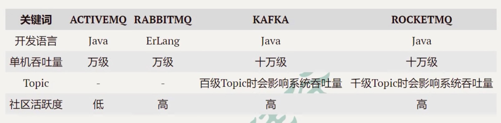
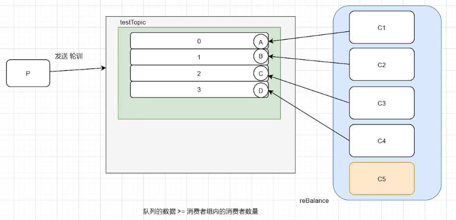

# RocketMQ Notes

## Remark

- 消息队列有啥用？
  - 异步解藕
  - 削峰限流
  - 数据收集
- 常见的MQ



- broker / topic / queue

  - 一个消费者只能消费一个分区(Queue，队列) - 不准确
  - 一个topic的分区(Queue，队列)只能由一个消费者消费 - 不准确

  - 一个Queue可以同时被多个不同消费者组的消费者消费

  - 一个消费者组，只能消费（订阅）一个主题 

  - 两个消费者，消费一个分区，**是绝对不可以的**，因为无法判断对方消费了多少？

  - 一个topic的分区(Queue，队列)只能由一个消费者组中的一个消费者消费 - 准确 - 严格遵守就行
  -  如果topic有四个queue，消费者组有五个消费者，那么会有一个消费者永远消费不了数据
  - 所以，queue的数量要大于等于消费者组内消费者的数量





## 安装启动

### 安装

- 解压zip包
- 修改bin文件
- 修改conf文件

- 配置环境变量

  ```shell
  vim /etc/profile.d/my_env.sh
  
  # 增加
  # RocketMQ
  export NAMESRV_ADDR=l9z102:9876
  ```

  

### 启动

- 先启动NameServer <span style="color:red; font-weight:bold">（不能随便执行，注意路径）</span>

  ```shell
  cd /opt/module/rocketmq-4.9.2
  # 执行启动命令
  nohup sh bin/mqnamesrv &
  
  # 指定日志文件
  nohup sh bin/mqnamesrv > xxx.log &
  ```

  > 默认日志放在了：`/home/lijzh/logs/rocketmqlogs`

- 再启动Broker（注意路径）

  ```shell
  cd /opt/module/rocketmq-4.9.2
  # 执行启动命令
  nohup sh bin/mqbroker -c conf/broker.conf &
  
  # 指定日志文件
  nohup sh bin/mqbroker -c conf/broker.conf > xxx.log &
  ```

  > 

- （可选）可视化jar包启动（注意jar包路径）

  ```shell
  # 进到下面路径
  cd /opt/software/rocketmq
  # 执行命令
  nohup java -jar rocketmq-dashboard-1.0.0.jar --server.port=8001 --rocketmq.config.namesrvAddr=127.0.0.1:9876 > dashboard.log &
  ```

  > web端可视化网址：l9z102:8001

## 快速上手

