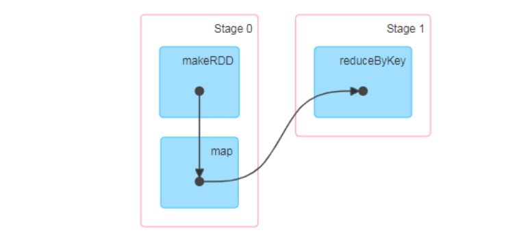

# SparkCoreNotes

## Remark 

- Spark是基于内存的计算，MapReduce是基于磁盘的计算。
- 端口汇总
  - spark-local模式：Web端口：4040   (没有配置)
  - spark-standalone模式：Web端口：8080  (没有配置)
  - spark-standalone模式：历史服务器日志Web端口：18080  (自己配置)


## 第1章  Spark 概述

### Spark 是什么


> Spark 是一种基于内存的快速、通用、可扩展的大数据分析计算引擎。  

### Spark and Hadoop  

- Hadoop  
  - Hadoop 是由 java 语言编写的，在分布式服务器集群上存储海量数据并运行分布式分析应用的开源框架
  - 作为 Hadoop 分布式文件系统， HDFS 处于 Hadoop 生态圈的最下层，存储着所有的数据，支持着 Hadoop 的所有服务 。 它 的理论基础源于 Google 的TheGoogleFileSystem 这篇论文，它是 GFS 的开源实现。
  - MapReduce 是一种编程模型， Hadoop 根据 Google 的 MapReduce 论文将其实现，作为 Hadoop 的分布式计算模型，是 Hadoop 的核心。基于这个框架，分布式并行程序的编写变得异常简单。综合了 HDFS 的分布式存储和 MapReduce 的分布式计
    算， Hadoop 在处理海量数据时，性能横向扩展变得非常容易。
  - HBase 是对 Google 的 Bigtable 的开源实现，但又和 Bigtable 存在许多不同之处。HBase 是一个基于 HDFS 的分布式数据库，擅长实时地随机读/写超大规模数据集。它也是 Hadoop 非常重要的组件。  

- Spark
  - Spark 是一种由 Scala 语言开发的快速、通用、可扩展的大数据分析引擎  
  - Spark Core 中提供了 Spark 最基础与最核心的功能  
  - Spark SQL 是 Spark 用来操作结构化数据的组件。通过 Spark SQL，用户可以使用SQL 或者 Apache Hive 版本的 SQL 方言（HQL）来查询数据。  
  - Spark Streaming 是 Spark 平台上针对实时数据进行流式计算的组件，提供了丰富的处理数据流的 API。  

> Spark  主要功能主要是用于数据计算  

### Spark or Hadoop  

Hadoop 的 MR 框架和 Spark 框架都是数据处理框架，那么我们在使用时如何选择呢？  

- Hadoop MapReduce 由于其设计初衷并不是为了满足循环迭代式数据流处理，因此在多并行运行的数据可复用场景（如：机器学习、图挖掘算法、交互式数据挖掘算法）中存在诸多计算效率等问题。所以 Spark 应运而生， Spark 就是在传统的 MapReduce 计算框架的基础上，利用其计算过程的优化，从而大大加快了数据分析、挖掘的运行和读写速度，并将计算单元缩小到更适合并行计算和重复使用的 RDD 计算模型。  (Hadoop一次性数据计算)
- 机器学习中 ALS、凸优化梯度下降等。这些都需要基于数据集或者数据集的衍生数据反复查询反复操作。 MR 这种模式不太合适，即使多 MR 串行处理，性能和时间也是一个问题。数据的共享依赖于磁盘。另外一种是交互式数据挖掘， MR 显然不擅长。而Spark 所基于的 scala 语言恰恰擅长函数的处理。  

- Spark 是一个分布式数据快速分析项目。它的核心技术是弹性分布式数据集（ResilientDistributed Datasets），提供了MapReduce丰富的模型，可以快速在内存中对数据集进行多次迭代，来支持复杂的数据挖掘算法和图形计算算法。  

- <span style="color:red">Spark 和Hadoop 的根本差异是多个作业之间的数据通信问题 : Spark 多个作业之间数据通信是基于内存，而 Hadoop 是基于磁盘。  </span>

- Spark Task 的启动时间快。 Spark 采用 fork 线程的方式，而 Hadoop 采用创建新的进程的方式  
- Spark 只有在 shuffle 的时候将数据写入磁盘，而 Hadoop 中多个 MR 作业之间的数据交互都要依赖于磁盘交互  

- Spark 的缓存机制比 HDFS 的缓存机制高效。  

> 经过上面的比较，我们可以看出在绝大多数的数据计算场景中， Spark 确实会比 MapReduce更有优势。但是 Spark 是基于内存的，所以在实际的生产环境中，由于内存的限制，可能会由于内存资源不够导致 Job 执行失败，此时， MapReduce 其实是一个更好的选择，所以 Spark并不能完全替代 MR。

  

### Spark 核心模块


- Spark Core  
  - Spark Core 中提供了 Spark 最基础与最核心的功能， Spark 其他的功能如： Spark SQL，Spark Streaming， GraphX, MLlib 都是在 Spark Core 的基础上进行扩展的  

- Spark SQL  
  - Spark SQL 是 Spark 用来操作结构化数据的组件。通过 Spark SQL，用户可以使用 SQL或者 Apache Hive 版本的 SQL 方言（HQL）来查询数据。  

- Spark Streaming  
  - Spark Streaming 是 Spark 平台上针对实时数据进行流式计算的组件，提供了丰富的处理数据流的 API。  

- Spark MLlib  
  - MLlib 是 Spark 提供的一个机器学习算法库。 MLlib 不仅提供了模型评估、数据导入等额外的功能，还提供了一些更底层的机器学习原语。  

- Spark GraphX  
  - GraphX 是 Spark 面向图计算提供的框架与算法库。  
  - [千锋教育SparkGraphx全套教程，快速玩转Spark Graphx系列](https://www.bilibili.com/video/BV1s4411e7Pz/?spm_id_from=333.337.search-card.all.click&vd_source=5bc191bb37a56c995b0901fd3ad1baa5)

## 第2章  Spark 快速上手

### 创建 Maven 项目

> - idea增加scala
>   - File -- Project Structure -- Global Libraries  -- "+"scala
>   - 模块上右键 -- Add Frameworks Support -- Scala -- 选择版本

- 增加 Scala 插件   -   plugins

  Spark 由 Scala 语言开发的，所以本课件接下来的开发所使用的语言也为 Scala， 咱们当前使用的 Spark 版本为 3.0.0，默认采用的 Scala 编译版本为 2.12，所以后续开发时。我们依然采用这个版本。 开发前请保证 IDEA 开发工具中含有 Scala 开发插件  

- 增加依赖

  ```xml
  <dependencies>
      <dependency>
          <groupId>org.apache.spark</groupId>
          <artifactId>spark-core_2.12</artifactId>
          <version>3.0.0</version>
      </dependency>
  </dependencies>
  <build>
      <plugins>
          <!-- 该插件用于将 Scala 代码编译成 class 文件 -->
          <plugin>
              <groupId>net.alchim31.maven</groupId>
              <artifactId>scala-maven-plugin</artifactId>
              <version>3.2.2</version>
              <executions>
                  <execution>
                      <!-- 声明绑定到 maven 的 compile 阶段 -->
                      <goals>
                      	<goal>testCompile</goal>
                      </goals>
                  </execution>
              </executions>
          </plugin>
          <plugin>
              <groupId>org.apache.maven.plugins</groupId>
              <artifactId>maven-assembly-plugin</artifactId>
              <version>3.1.0</version>
              <configuration>
                  <descriptorRefs>
                  	<descriptorRef>jar-with-dependencies</descriptorRef>
                  </descriptorRefs>
              </configuration>
              <executions>
                  <execution>
                      <id>make-assembly</id>
                      <phase>package</phase>
                      <goals>
                      	<goal>single</goal>
                      </goals>
                  </execution>
              </executions>
          </plugin>
      </plugins>
  </build>
  ```


## 第3章  Spark 运行环境

### Local 模式  


### Standalone 模式

​        local 本地模式毕竟只是用来进行练习演示的，真实工作中还是要将应用提交到对应的集群中去执行，这里我们来看看只使用 Spark 自身节点运行的集群模式，也就是我们所谓的<span style="color:blue; font-weight:bold">独立部署</span>（Standalone）模式。 Spark 的 Standalone 模式体现了经典的 master-slave 模式。集群规划:  

|       | l9z102           | l9z103 | l9z104 |
| ----- | ---------------- | ------ | ------ |
| Spark | Worker<br>Master | Worker | Worker |

- 解压缩文件  

  ```shell
  tar -zxvf spark-3.0.0-bin-hadoop3.2.tgz -C /opt/module
  cd /opt/module
  mv spark-3.0.0-bin-hadoop3.2 spark-standalone
  ```

- 修改配置文件  

  - 进入解压缩后路径的 conf 目录，修改 slaves.template 文件名为 slaves  

    ```shell
    mv slaves.template slaves
    ```

  - 修改 slaves 文件，添加 work 节点  

    ```shell
    l9z102
    l9z103
    l9z104
    ```

  - 修改 spark-env.sh.template 文件名为 spark-env.sh  

    ```shelll
    mv spark-env.sh.template spark-env.sh
    ```

  - 修改 spark-env.sh 文件，添加 JAVA_HOME 环境变量和集群对应的 master 节点 

    ```shell
    export JAVA_HOME=/opt/module/jdk1.8.0_212
    SPARK_MASTER_HOST=l9z102
    SPARK_MASTER_PORT=7077
    ```

    > 注意：7077 端口，相当于 hadoop3 内部通信的 8020 端口，此处的端口需要确认自己的 Hadoop配置  

  - 分发 spark-standalone 目录

    ```shell
    xsync spark-standalone
    ```

- 启动集群  

  - 执行脚本命令： 

    ```shell
    sbin/start-all.sh
    ```

  - 查看三台服务器运行进程  

    ```shell
    jpsall
    ```

  - 查看 Master 资源监控 Web UI 界面: http://l9z102:8080

- 提交应用

  ```shell
  bin/spark-submit \
  --class org.apache.spark.examples.SparkPi \
  --master spark://l9z102:7077 \
  ./examples/jars/spark-examples_2.12-3.0.0.jar \
  10
  ```

  > - --class 表示要执行程序的主类
  > - --master spark://l9z102:7077 独立部署模式，连接到 Spark 集群
  > - spark-examples_2.12-3.0.0.jar 运行类所在的 jar 包
  > - 数字 10 表示程序的入口参数，用于设定当前应用的任务数量  

- 提交参数说明

  在提交应用中，一般会同时一些提交参数 

  ```shell
  bin/spark-submit \
  --class <main-class>
  --master <master-url> \
  ... # other options
  <application-jar> \
  [application-arguments]
  ```

  | 参数                     | 解释                                                         | 可选值举例                                   |
  | ------------------------ | ------------------------------------------------------------ | -------------------------------------------- |
  | --class                  | Spark 程序中包含主函数的类                                   |                                              |
  | --master                 | Spark 程序运行的模式(环境)                                   | 模式： local[*]、 spark://l9z102:7077、 Yarn |
  | --executor-memory  1G    | 指定每个 executor 可用内存为 1G<br>【executor 代表计算节点】 | 符合集群内存配置即可，具体情况具体分析。     |
  | --total-executor-cores 2 | 指定所有executor使用的cpu核数为 2 个                         |                                              |
  | --executor-cores         | 指定每个executor使用的cpu核数                                |                                              |
  | application-jar          | 打包好的应用 jar，包含依赖。这 个 URL 在集群中全局可见。<br> 比如 hdfs:// 共享存储系统，如果是file:// path，那么所有的节点的 path 都包含同样的 jar |                                              |
  | application-arguments    | 传给 main()方法的参数                                        |                                              |

- <span style="color:blue; font-weight:bold">配置历史服务</span>  

  - 由于 spark-shell 停止掉后， 集群监控 l9z102:4040 页面就看不到历史任务的运行情况，所以开发时都配置历史服务器记录任务运行情况。

  - 修改 spark-defaults.conf.template 文件名为 spark-defaults.conf 

    ```shell
    mv spark-defaults.conf.template spark-defaults.conf
    ```

  - 修改 spark-default.conf 文件，配置日志存储路径  

    ```shell
    spark.eventLog.enabled	true
    spark.eventLog.dir		hdfs://l9z102:8020/spark-standalone/directory
    ```

    > 注意：需要**启动 hadoop 集群**， HDFS 上的 /spark- Standalone/directory 目录需要提前存在。  
    >
    > ```
    > sbin/start-dfs.sh
    > hadoop fs -mkdir /spark-standalone/directory
    > ```

  - 修改 spark-env.sh 文件, 添加日志配置  

    ```shell
    export SPARK_HISTORY_OPTS="
    -Dspark.history.ui.port=18080
    -Dspark.history.fs.logDirectory=hdfs://l9z102:8020/spark-standalone/directory
    -Dspark.history.retainedApplications=30"
    ```

    > - 参数 1 含义： WEB UI 访问的端口号为 18080
    > - 参数 2 含义：指定历史服务器日志存储路径
    > - 参数 3 含义：指定保存 Application 历史记录的个数，如果超过这个值，旧的应用程序信息将被删除，这个是内存中的应用数，而不是页面上显示的应用数。  

  - 分发配置文件  

    ```shell
    xsync conf/
    ```

  - 重新<span style="color:blue; font-weight:bold">启动集群和历史服务</span>

    ```shell
    sbin/start-all.sh
    sbin/start-history-server.sh
    ```

  - 重新执行任务  

    ```shell
    bin/spark-submit \
    --class org.apache.spark.examples.SparkPi \
    --master spark://l9z102:7077 \
    ./examples/jars/spark-examples_2.12-3.0.0.jar \
    10
    ```

  - 查看历史服务： http://l9z102:18080  

- <span style="color:blue; font-weight:bold">高可用(HA)</span>

  ​        所谓的高可用是因为当前集群中的 Master 节点只有一个，所以会存在单点故障问题。 所以为了解决单点故障问题，需要在集群中配置多个 Master 节点，一旦处于活动状态的 Master发生故障时，由备用 Master 提供服务，保证作业可以继续执行。 这里的**高可用一般采用Zookeeper 设置**

  - 集群规划:  

  |       | Linux1                         | Linux2                            | Linux3                |
  | ----- | ------------------------------ | --------------------------------- | --------------------- |
  | Spark | Master<br>Zookeeper<br/>Worker | Master <br/>Zookeeper <br/>Worker | Zookeeper <br/>Worker |

  - 停止集群

    ```shell
    sbin/stop-all.sh
    # 停止历史服务
    sbin/stop-history-server.sh
    ```

  - 启动zookeeper  -  <span style="color:blue; font-weight:bold">高可用一般都依赖于zookeeper</span>
  
    ```sehll
    myzookeeper start
    ```

  - 修改 spark-env.sh 文件添加如下配置  
  
    ```shell
    # 注释如下内容：
    #SPARK_MASTER_HOST=l9102
    #SPARK_MASTER_PORT=7077
    
    # 添加如下内容:  高可用配置
    # Master 监控页面默认访问端口为 8080，但是可能会和 Zookeeper 冲突，所以改成 8989，也可以自定义，访问 UI 监控页面时请注意
    SPARK_MASTER_WEBUI_PORT=8989
    export SPARK_DAEMON_JAVA_OPTS=
    "
    -Dspark.deploy.recoveryMode=ZOOKEEPER
    -Dspark.deploy.zookeeper.url=l9z102,l9z103,l9z104
    -Dspark.deploy.zookeeper.dir=/spark
    "
    ```
  
  - 分发配置文件  

    ```shell
    xsync conf/
    ```
  
  - 启动集群  

    ```sehll
    sbin/start-all.sh
    ```
  
  - 查看 Master 资源监控 Web UI 界面: http://l9z102:8989   为 <span style="color:red; font-weight:bold">alive</span>状态

  - 启动 l9z103 的单独 Master 节点，此时 l9z103 节点 Master 状态处于备用状态

    > 这里是否可以启动l9z104?????????????????????????????????
  
    ```shell
    [lijzh@l9z103 spark-standalone]# sbin/start-master.sh
    ```
  
  - 查看 Master 资源监控 Web UI 界面: http://l9z103:8989   为<span style="color:red; font-weight:bold">standby</span>状态

  - 提交应用到高可用集群  
  
    ```shell
    bin/spark-submit \
    --class org.apache.spark.examples.SparkPi \
    --master spark://l9z102:7077,l9z103:7077 \
    ./examples/jars/spark-examples_2.12-3.0.0.jar \
    10
    ```
  
  - 停止 l9z102 的 Master 资源监控进程  
  
    ```
    kill -9 
    ```
  
  - 查看 l9z103 的 Master 资源监控 Web UI，稍等一段时间后， l9z103 节点的 Master 状态提升为活动状态  

### Yarn 模式

> Spark On Yarn 不需要Spark集群，只需要一个单机版spark解压包即可。
>
> Spark On Yarn 根据Driver 运行在哪里分为2种模式：client模式和cluster模式
>
> 注意：
>
> > 在实际开发中，大数据任务都有统一的资源管理和任务调度工具来进行管理！---Yarn使用最多。(现在是YARN，未来是K8S)
> >
> > 因为它成熟，稳定，支持多种调度策略：FIFO，Capcity，Fair
> >
> > 可以使用Yarn调度管理MR，Hive，Spark，Flink

​        独立部署（Standalone）模式由 Spark 自身提供计算资源，无需其他框架提供资源。 这种方式降低了和其他第三方资源框架的耦合性，独立性非常强。但是你也要记住， Spark 主要是计算框架，而不是资源调度框架，所以本身提供的资源调度并不是它的强项，所以还是和其他专业的资源调度框架集成会更靠谱一些。 所以接下来我们来学习在**强大的 Yarn 环境下 Spark 是如何工作的**（其实是因为在国内工作中， Yarn 使用的非常多） 。  

- 解压缩文件

- 修改配置文件

  - 修改yarn-site.xml，并分发

    ```xml
    <!--  以下两个配置是，spark-yarn时配置  关闭yarn内存检查-->
    <!--是否启动一个线程检查每个任务正使用的物理内存量，如果任务超出分配值，则直接将其杀掉，默认是 true -->
    <property>
        <name>yarn.nodemanager.pmem-check-enabled</name>
        <value>false</value>
    </property>
    <!--是否启动一个线程检查每个任务正使用的虚拟内存量，如果任务超出分配值，则直接将其杀掉，默认是 true -->
    <property>
        <name>yarn.nodemanager.vmem-check-enabled</name>
        <value>false</value>
    </property>
    ```

  - 修改 conf/spark-env.sh，添加 JAVA_HOME 和 YARN_CONF_DIR 配置  	

    ```shell
    export JAVA_HOME=/opt/module/jdk1.8.0_212
    YARN_CONF_DIR=/opt/module/hadoop-3.1.3/etc/hadoop
    ```

- 启动HDFS，YARN

  - `myhadoop start`

- 提交应用

  ```shell
  bin/spark-submit \
  --class org.apache.spark.examples.SparkPi \
  --master yarn \
  --deploy-mode cluster \
  ./examples/jars/spark-examples_2.12-3.0.0.jar \
  10
  ```

  > 查看 http://l9z103:8088 页面，点击 History，查看yarn历史页面  

- <span style="color:blue; font-weight:bold">2种模式：client模式和cluster模式</span>  -  简单理解，后章节会再介绍。

  - client模式  -  了解

    Spark的Driver驱动程序，运行在提交任务的客户端上，和集群的通讯成本高

    因为Driver在客户端，所以Driver中的程序结果输出可以在客户端控制台看到

  - **cluster模式   -   开发使用**

    Spark的Driver驱动程序，运行在Yarn集群上，和集群的通信成本低

    且Driver是交给Yarn管理的，如果失败会由Yarn重启

    因为Drever运行在Yarn上，所以Driver中的程序结果输出，在客户端控制台看不到，在Yarn日志中看

- <span style="color:blue; font-weight:bold">配置历史服务器  </span>

  - 修改 spark-defaults.conf.template 文件名为 spark-defaults.conf
    ```
    mv spark-defaults.conf.template spark-defaults.conf
    ```

  - 修改 spark-default.conf 文件，配置日志存储路径

    ```shell
    spark.eventLog.enabled  true
    spark.eventLog.dir      hdfs://l9z102:8020/spark-yarn/directory
    ```

    > 注意：需要启动 hadoop 集群， HDFS 上的目录需要提前存在。

  - 修改 spark-env.sh 文件, 添加日志配置

    ```
    export SPARK_HISTORY_OPTS=
    "
    -Dspark.history.ui.port=18080
    -Dspark.history.fs.logDirectory=hdfs://l9z102:8020/spark-yarn/directory
    -Dspark.history.retainedApplications=30
    "
    ```
  
    > 参数 1 含义： WEB UI 访问的端口号为 18080
    > 参数 2 含义：指定历史服务器日志存储路径
    > 参数 3 含义：指定保存 Application 历史记录的个数，如果超过这个值，旧的应用程序信息将被删除，这个是内存中的应用数，而不是页面上显示的应用数。

  - 修改 spark-defaults.conf
  
    ```
    # yarn 和 spark 关联
    spark.yarn.historyServer.address=l9z102:18080
    spark.history.ui.port=18080
    ```
  
    > spark的配置信息，是否分发，可选
    >
    > > 如果只在l9z102上提交spark任务到yarn，那么不需要分发配置信息
  
  - 启动历史服务
    ```shell
    sbin/start-history-server.sh  
    ```
  
  - 提交任务
  
  - spark历史服务Web 页面查看日志： http://l9z102:18080

### K8S & Mesos 模式

### Windows 模式

### 部署模式对比

| 模式       | Spark 安装机器数 | 需启动的进程     | 所属者 | 应用场景 |
| :--------- | ---------------- | ---------------- | ------ | -------- |
| Local      | 1                | 无               | Spark  | 测试     |
| Standalone | 3                | Master 及 Worker | Spark  | 单独部署 |
| Yarn       | 1                | Yarn 及 HDFS     | Hadoop | 混合部署 |

### 端口号

- Spark 查看当前 Spark-shell 运行任务情况端口号： 4040（计算）
- Spark Master 内部通信服务端口号： 7077
- Standalone 模式下， Spark Master Web 端口号： 8080（资源）
- Spark 历史服务器端口号： 18080
- Hadoop YARN 任务运行情况查看端口号： 8088

## 第4章  Spark 运行架构 - 概念性重点

- 运行架构  

  Spark 框架的核心是一个计算引擎，整体来说，它采用了标准 master-slave(worker) 的结构。
  如下图所示，它展示了一个 Spark 执行时的基本结构。 图形中的 Driver 表示 master，负责管理整个集群中的作业任务调度。图形中的 Executor 则是 slave，负责实际执行任务。

  

- 核心组件   -   P19讲解

  由上图可以看出，对于 Spark 框架有两个核心组件：  

  - Driver  

  - Executor  

  - Master & Worker  

    Spark 集群的独立部署环境中，不需要依赖其他的资源调度框架，自身就实现了资源调度的功能，所以环境中还有其他两个核心组件： Master 和 Worker，这里的 Master 是一个进程，主要负责资源的调度和分配，并进行集群的监控等职责，类似于 Yarn 环境中的 RM, 而Worker 呢，也是进程，一个 Worker 运行在集群中的一台服务器上，由 Master 分配资源对数据进行并行的处理和计算，类似于 Yarn 环境中 NM。  

  - ApplicationMaster  

    Hadoop 用户向 YARN 集群提交应用程序时,提交程序中应该包含 ApplicationMaster，用于向资源调度器申请执行任务的资源容器 Container，运行用户自己的程序任务 job，监控整个任务的执行，跟踪整个任务的状态，处理任务失败等异常情况。
    说的简单点就是， ResourceManager（资源）和 Driver（计算）之间的解耦合靠的就是 ApplicationMaster。  

- 核心概念    -   P20讲解

  - Executor 与 Core

    Spark Executor 是集群中运行在工作节点（Worker）中的一个 JVM 进程，是整个集群中的专门用于计算的节点。在提交应用中，可以提供参数指定计算节点的个数，以及对应的资源。这里的资源一般指的是工作节点 Executor 的内存大小和使用的虚拟 CPU 核（Core）数量。  

    应用程序相关启动参数如下： 

    | 名称              | 说明                                   |
    | ----------------- | -------------------------------------- |
    | --num-executors   | 配置 Executor 的数量                   |
    | --executor-memory | 配置每个 Executor 的内存大小           |
    | --executor-cores  | 配置每个 Executor 的虚拟 CPU core 数量 |

  - 并行度（ Parallelism）

    在分布式计算框架中一般都是多个任务同时执行，由于任务分布在不同的计算节点进行计算，所以能够真正地实现多任务并行执行，记住，这里是并行，而不是并发。这里我们将整个集群并行执行任务的数量称之为<span style="color:red; font-weight:bold">并行度</span>。那么一个作业到底并行度是多少呢？这个取决于框架的默认配置。应用程序也可以在运行过程中动态修改。  

  - 有向无环图（ DAG）

    

- <span style="color:blue; font-weight:bold">提交流程</span>

  ​        所谓的提交流程，其实就是我们开发人员根据需求写的应用程序通过 Spark 客户端提交给 Spark 运行环境执行计算的流程。在不同的部署环境中，这个提交过程基本相同，但是又有细微的区别，我们这里不进行详细的比较，但是因为国内工作中，将 Spark 引用部署到Yarn 环境中会更多一些，所以本课程中的<span style="color:blue; font-weight:bold">提交流程是基于 Yarn 环境的</span>。  

  

  ​        Spark 应用程序提交到 Yarn 环境中执行的时候，一般会有两种部署执行的方式： Client 和 Cluster。 

  <span style="color:blue; font-weight:bold">两种模式主要区别在于：Driver 程序的运行节点位置。</span>

  - Yarn Client 模式  -  了解

    Client 模式将用于监控和调度的 Driver 模块在客户端执行，而不是在 Yarn 中，所以一般用于测试。
  
    - Driver 在任务提交的本地机器上运行
    - Driver 启动后会和 ResourceManager 通讯申请启动 ApplicationMaster
    - ResourceManager 分配 container，在合适的 NodeManager 上启动 ApplicationMaster， 负责向 ResourceManager 申请 Executor 内存
    - ResourceManager 接到 ApplicationMaster 的资源申请后会分配 container，然后ApplicationMaster 在资源分配指定的 NodeManager 上启动 Executor 进程 
    - Executor 进程启动后会向 Driver 反向注 册， Executor 全部注册完成后 Driver 开始执行main 函数
    - 之后执行到 Action 算子时，触发一个 Job，并根据宽依赖开始划分 stage，每个 stage 生
      成对应的 TaskSet，之后将 task 分发到各个 Executor 上执行。  

  - <span style="color:blue; font-weight:bold">Yarn Cluster 模式   -    开发使用</span>

    Cluster 模式将用于监控和调度的 Driver 模块启动在 Yarn 集群资源中执行。一般应用于实际生产环境。
  
    - 在 YARN Cluster 模式下，任务提交后会和 ResourceManager 通讯申请启动ApplicationMaster，
    - 随后 ResourceManager 分配 container，在合适的 NodeManager 上启动 ApplicationMaster，此时的 ApplicationMaster 就是 Driver。
    - Driver 启动后向 ResourceManager 申请 Executor 内存， ResourceManager 接到ApplicationMaster 的资源申请后会分配 container，然后在合适的 NodeManager 上启动Executor 进程
    - Executor 进程启动后会向 Driver 反向注册， Executor 全部注册完成后 Driver 开始执行main 函数，
    - 之后执行到 Action 算子时，触发一个 Job，并根据宽依赖开始划分 stage，每个 stage 生成对应的 TaskSet，之后将 task 分发到各个 Executor 上执行。  

## 第5章  Spark 核心编程

Spark 计算框架为了能够进行高并发和高吞吐的数据处理，封装了三大数据结构，用于处理不同的应用场景。三大数据结构分别是：

- RDD : 弹性分布式数据集
- 累加器：分布式共享只写变量
- 广播变量：分布式共享只读变量

> local模式就是运行在一台计算机上的模式，通常就是用于在本机上练手和测试。它可以通过以下集中方式设置Master
> local: 所有计算都运行在一个线程当中，没有任何并行计算，通常我们在本机执行一些测试代码，或者练手，就用这种模式;
> local[k]: 指定使用几个线程来运行计算，比如local[4]就是运行4个Worker线程。通常我们的Cpu有几个Core，就指定几个线程，最大化利用Cpu的计算能力;
> local[*]: 这种模式直接帮你按照Cpu最多Cores来设置线程数了。

### RDD  

- 什么是 RDD  

  RDD（Resilient Distributed Dataset）叫做<span style="color:blue; font-weight:bold">弹性分布式数据集</span>，是 Spark 中<span style="color:blue; font-weight:bold">最基本的数据处理模型</span>。代码中是一个抽象类，它代表一个弹性的、不可变、可分区、里面的元素可并行计算的集合。

  - 弹性
    - 存储的弹性：内存与磁盘的自动切换；
    - 容错的弹性：数据丢失可以自动恢复；
    - 计算的弹性：计算出错重试机制；
    - 分片的弹性：可根据需要重新分片。
  - 分布式：数据存储在大数据集群不同节点上
  - 数据集： RDD 封装了计算逻辑，并不保存数据
  - 数据抽象： RDD 是一个抽象类，需要子类具体实现
  - 不可变： RDD 封装了计算逻辑，是不可以改变的，想要改变，只能产生新的 RDD，在新的 RDD 里面封装计算逻辑
  - 可分区、并行计算：

- 核心属性

  ```java
  // 见RDD源码
  
  // Internally, each RDD is characterized by five main properties:
  // A list of partitions
  // A function for computing each split
  // A list of dependencies on other RDDs
  // Optionally, a Partitioner for key-value RDDs (e.g. to say that the RDD is hash-partitioned)
  // Optionally, a list of preferred locations to compute each split on (e.g. block locations for an HDFS file)
  ```
  
  RDD有五个核心属性
  
  - 分区列表
  
    RDD 数据结构中存在分区列表，用于执行任务时并行计算，是实现分布式计算的重要属性。  
  
  - 分区计算函数
  
    Spark 在计算时，是使用分区函数对每一个分区进行计算  
  
  - RDD 之间的依赖关系
  
    RDD 是计算模型的封装，当需求中需要将多个计算模型进行组合时，就需要将多个 RDD 建立依赖关系  
  
  - 分区器（可选）
  
    当数据为 KV 类型数据时，可以通过设定分区器自定义数据的分区
  
  - 首选位置（可选）  
  
    计算数据时，可以根据计算节点的状态选择不同的节点位置进行计算  

- 执行原理  

#### 基础编程

- RDD 创建  

  - 1
  - 2
  - 3
  - 4
- RDD 并行度与分区  

  - 1

> RDD方法(算子)分为两类
>
> - 转换：功能的补充和封装，将旧的RDD转换成新的RDD
> - 行为：触发任务的调度和作业的执行

- <span style="color:blue; font-weight:bold">RDD 转换算子</span>

  RDD 根据数据处理方式的不同将算子整体上分为 Value 类型、双 Value 类型和 Key-Value类型

  - Value 类型
    - map
      - 将处理的数据**逐条**进行映射转换，这里的转换可以是类型的转换，也可以是值的转换。  
    - mapPartitions
      - 将待处理的数据**以分区为单位**发送到计算节点进行处理，这里的处理是指可以进行任意的处理，哪怕是过滤数据。  
    
    > 思考一个问题： map 和 mapPartitions 的区别？
    >
    > - 数据处理角度
    >
    >   map 算子是分区内一个数据一个数据的执行，类似于串行操作。
    >
    >   mapPartitions 算子是以分区为单位进行批处理操作。
    >
    > - 功能的角度m
    >
    >   map 算子主要目的将数据源中的数据进行转换和改变。但是不会减少或增多数据。
    >
    >   mapPartitions 算子需要传递一个迭代器，返回一个迭代器，没有要求的元素的个数保持不变，所以可以增加或减少数据
    >
    > - 性能的角度
    >
    >   map 算子因为类似于串行操作，所以性能比较低，
    >
    >   mapPartitions 算子类似于批处理，所以性能较高。
    >
    >   但是 mapPartitions 算子会长时间占用内存，那么这样会导致内存可能不够用，出现内存溢出的错误。
    >
    >   所以在内存有限的情况下，不推荐使用mapPartitions操作，推荐使用 map 操作。  (完成比完美更重要！！！)
    
    - mapPartitionsWithIndex
      - 将待处理的数据以分区为单位发送到计算节点进行处理，这里的处理是指可以进行任意的处理，哪怕是过滤数据，在处理时同时可以获取当前分区索引。  
    - flatMap
      - 
    - glom
      - 
    - groupBy
      - 
    - filter
    - sample
    - distinct
      - distinct去重底层分析：视频P57
    - coalesce
    - repartition
    - sortBy
    
  - 双 Value 类型  
    - intersection
    - union
    - subtract
    - zip
    
  - Key - Value 类型
    - partitionBy
    - reduceByKey
    - groupByKey
    - aggregateByKey
    - foldByKey
    - combineByKey
    - sortByKey
    - join
    - leftOuterJoin
    - cogroup - P77

- 案例实操  

- RDD 行动算子 
  - reduce
  - collect
  - count
  - first
  - take
  - takeOrdered
  - ##########################################
  - aggregate
  - fold
  - countByKey
  - save 相关算子
  - foreach
  
- RDD 序列化   
  - 闭包检查
  - 序列化方法和属性
  - Kryo 序列化框架

- RDD 依赖关系  
  
  > RDD 不会保存数据，
  >
  > RDD 为了提供容错性，需要将RDD间的关系保存下来，一旦出现了错误，可以根据血缘关系重新读取数据，进行计算
  
  - RDD 血缘关系
  - RDD 依赖关系
  - RDD 窄依赖
  - RDD 宽依赖
  - RDD 阶段划分
  - RDD 阶段划分源码
    - P96 - P98  未看
  - RDD 任务划分
  - RDD 任务划分源码
  
- RDD 持久化  
  
  > RDD 是不存数据的，如果一个RDD 要重复使用，那个需要从头再次执行获取数据
  >
  > RDD 对象是可以重用的，但是数据无法重用
  >
  > 所以需要持久化操作
  
  - RDD Cache 缓存
  
    - RDD 通过 Cache 或者 Persist 方法将前面的计算结果缓存，默认情况下会把数据以缓存在 JVM 的堆内存中。但是并不是这两个方法被调用时立即缓存，而是触发后面的 action 算子时，该 RDD 将会被缓存在计算节点的内存中，并供后面重用。  
  
    - ```scala
      // 数据缓存。
      rdd.cache()
      // 可以更改存储级别
      rdd.persist(StorageLevel.MEMORY_AND_DISK_2)
      ```
  
      > RDD对象的持久化操作不一定是为了重用
      >
      > 在数据执行较长，或数据比较重要的场合也可以采用持久化操作
  
  - RDD CheckPoint 检查点
  
  - 缓存和检查点区别
  
- RDD 分区器  

- RDD 文件读取与保存  

### 累加器

- 实现原理  
- 基础编程  

### 广播变量  

- 实现原理  
- 基础编程  

## Spark 案例实操  


