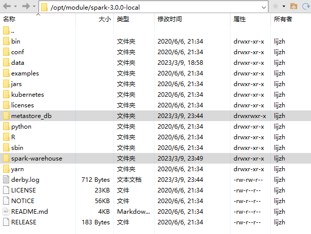

# SparkSQLNotes

## 第1章 SparkSQL 概述  


## 第2章 SparkSQL 核心编程  


### 2.8 数据的加载和保存


#### 2.8.5 MySQL


#### 2.8.6 Spark on Hive  

- 命令行 - 内嵌hive

  - 

  

- 命令行 - 外部hive

  - 如果想连接外部已经部署好的 Hive，需要通过以下几个步骤：
    - Spark 要接管 Hive 需要把 hive-site.xml 拷贝到 conf/目录下
    - 把 Mysql 的驱动 copy 到 jars/目录下
    - 如果访问不到 hdfs，则需要把 core-site.xml 和 hdfs-site.xml 拷贝到 conf/目录下
    - 重启 spark-shell  


- idea - 外部hive

  - 前提 win 下要有hadoop依赖， 最好提前配一下，idea连接好多框架时都要有这个条件。

  - 导入依赖pom.xml

    ```xml
    
    ```

  - 将 `hive-site.xml`，`core-site.xml`，`hdfs-site.xml` 文件拷贝到项目的 resources 目录中

    - `hive-site.xml` 中的主要配置

      ```xml
      
      ```

  - 启动hive的元数据服务  `hive --service metastore`

  - idea代码中增加hive支持 

    ```java
    val spark: SparkSession = SparkSession.builder()
        .enableHiveSupport()   // 增加hive支持 
        .config(sparkConf)
        .getOrCreate()
    ```

  - 报错

    ```shell
    # 报错一：
    org.apache.hadoop.hive.ql.metadata.HiveException: 
    java.lang.RuntimeException: Unable to instantiate org.apache.hadoop.hive.ql.metadata.SessionHiveMetaStoreClient;
    # 原因：元数据服务没有启动
    # 解决方法：执行下面命令，启动元数据服务
    >> hive --service metastore
        
    # 报错二：
    Exception in thread "main" java.lang.IllegalArgumentException:
    Error while instantiating 'org.apache.spark.sql.hive.HiveSessionState':
    # 原因：这个可能是多方面造成的
    # 解决方案：
    #    1：查看pom.xml文件，核对各版本号
    #    2：检查win是否有Hadoop依赖，并配置相关环境变量，主要 winutils.exe 和 hadoop.dll 两个文件
    
    # 报错三：
    Exception in thread "main" org.apache.spark.sql.AnalysisException: 
    java.lang.RuntimeException: org.apache.hadoop.security.AccessControlException: 
    Permission denied: user=xxx, access=EXECUTE, inode="/tmp":lijzh:supergroup:drwxrwx---
    # 原因：权限不够
    # 解决方案：在idea代码main方法中第一行加入System.setProperty("HADOOP_USER_NAME", "xxx")，其中xxx为自己hadoop的用户名
    ```

    > 如果访问不到本地目录：
    >
    > - 写绝对路径：file:///G:/IntellijIDEA/Spark/datas/user.json

- <span style="color:blue; font-weight:bold">Spark on hive   -  ideal 操作</span>

  - 拷贝 Hive-site.xml 到 resources

    - `Hive-site.xml`里要配置了 元数据服务 和 hiveserver2 服务
    - `core-site.xml` 和 `hdfs-site.xml` 也要拷贝到 resources 目录下

  - 启动 Hive 的支持

    ```scala
    val sparkConf: SparkConf = new SparkConf().setMaster("local[*]").setAppName("SQL")
    
    val spark: SparkSession = SparkSession.builder()
              .enableHiveSupport()   //  启动 Hive 的支持
              .config(sparkConf)
              .getOrCreate()
    ```

  - 增加对应的依赖关系，包含mysql驱动

    ```xml
    <dependency>
        <groupId>org.apache.spark</groupId>
        <artifactId>spark-hive_2.12</artifactId>
        <version>3.0.0</version>
    </dependency>
    <dependency>
        <groupId>org.apache.hive</groupId>
        <artifactId>hive-exec</artifactId>
        <version>1.2.1</version>
    </dependency>
    <dependency>
        <groupId>mysql</groupId>
        <artifactId>mysql-connector-java</artifactId>
        <version>5.1.27</version>
    </dependency>	
    ```

  > 在开发工具中创建数据库默认是在本地仓库，通过参数修改数据库仓库的地址:  
  >
  > `config("spark.sql.warehouse.dir", "hdfs://l9z102:8020/user/hive/warehouse")  `
  >
  > ```
  > ```
  >
  > 如果权限不够，报错，可以在代码最前面添加：
  >
  > `System.setProperty("HADOOP_USER_NAME", "root")  `


## 第3章 SparkSQL 项目实战  


