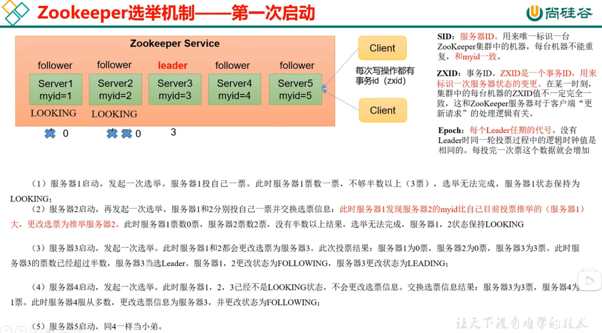
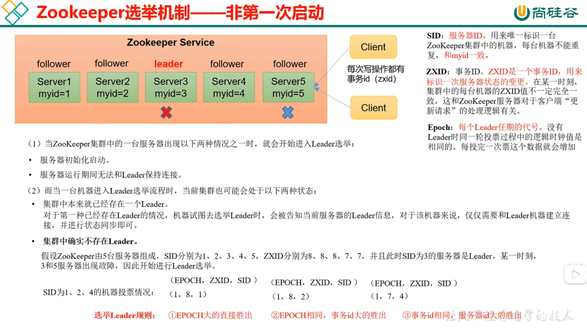
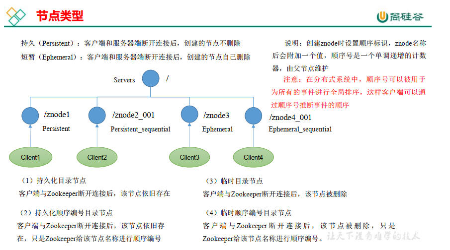
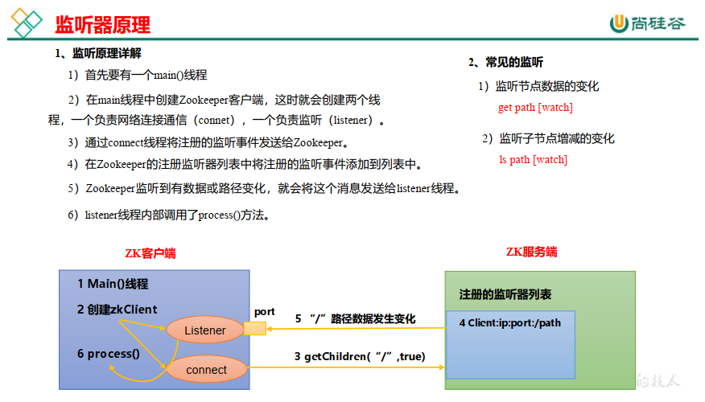
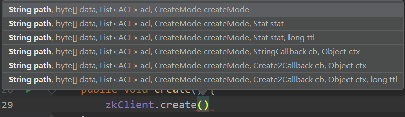
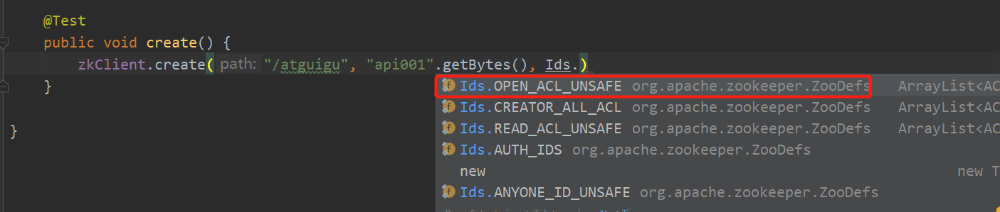
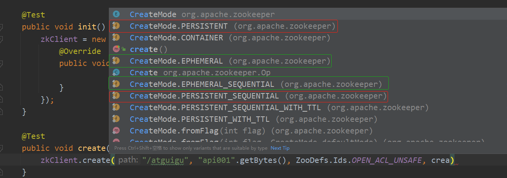
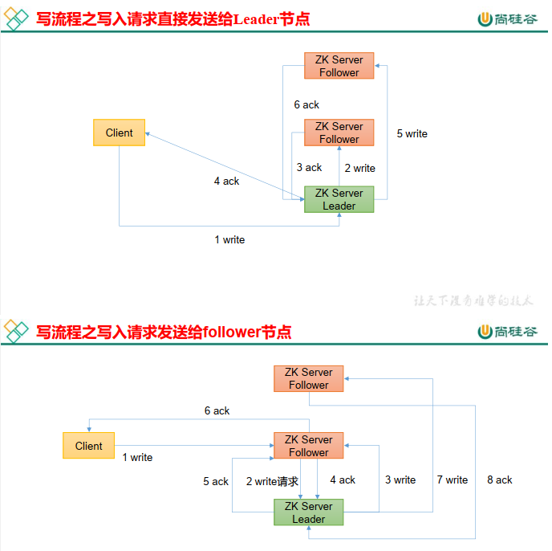
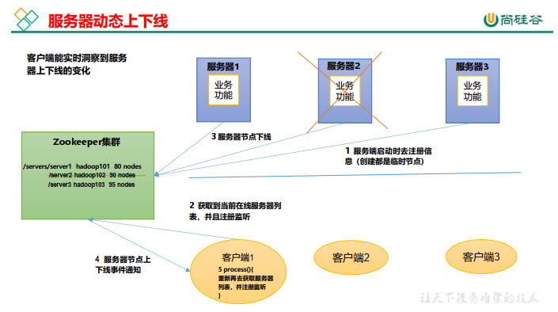

# ZookeeperNotes

## zookeeper入门

### 概述

Zookeeper 是一个开源的分布式的，为分布式框架提供协调服务的 Apache 项目。  

### linux安装zookeeper

- 解压：`tar -zxvf apache-zookeeper-3.5.7-bin.tar.gz /opt/module/`  

- 改名：`mv apache-zookeeper-3.5.7-bin zookeeper-3.5.7`

- 配置文件改名生效：`mv  zoo_sample.cfg  zoo.cfg `

- 修改配置文件：`vim zoo.cfg`

- 关于配置文件<span style="color:blue; font-weight:bold">conf/zoo.cfg</span>  -  五大参数  -  <span style="color:red; font-weight:bold">重要配置文件</span>

  ```shell
  tickTime=2000    # 通信心跳时间(ms)
  # The number of ticks that the initial 
  # synchronization phase can take
  initLimit=10     # LF(leader/Follower)初始通信时限  (10次心跳)
  # The number of ticks that can pass between 
  # sending a request and getting an acknowledgement
  syncLimit=5      # LF同步通信时限
  # the directory where the snapshot is stored.
  # do not use /tmp for storage, /tmp here is just 
  # example sakes.
  # zookeeper的一些数储的存位置
  # dataDir=/tmp/zookeeper
  # 默认是tmp目录，容易被删除，所以一般需要修改。
  dataDir=/opt/module/zookeeper-3.5.7/zkData
  # the port at which the clients will connect
  clientPort=2181    # 客户端连接端口号
  # the maximum number of client connections.
  # increase this if you need to handle more clients
  #maxClientCnxns=60
  #
  # Be sure to read the maintenance section of the 
  # administrator guide before turning on autopurge.
  #
  # http://zookeeper.apache.org/doc/current/zookeeperAdmin.html#sc_maintenance
  #
  # The number of snapshots to retain in dataDir
  #autopurge.snapRetainCount=3
  # Purge task interval in hours
  # Set to "0" to disable auto purge feature
  #autopurge.purgeInterval=1
  
  
  
  #######################cluster##########################
  server.2=l9z102:2888:3888
  server.3=l9z103:2888:3888
  server.4=l9z104:2888:3888
  ```

  > `dataDir=/opt/module/zookeeper-3.5.7/zkData`  (修改数据存储位置)

## Zookeeper 集群操作

### zookeeper集群搭建

- 集群规划

- 解压安装

  - 解压：`tar -zxvf apache-zookeeper-3.5.7-bin.tar.gz /opt/module/`  
  - 改名：`mv apache-zookeeper-3.5.7-bin zookeeper-3.5.7`

- <span style="color:blue; font-weight:bold">配置服务器编号 </span>

  - 在/opt/module/zookeeper-3.5.7/这个目录下创建 zkData

  - 在/opt/module/zookeeper-3.5.7/zkData 目录下创建一个<span style="color:blue; font-weight:bold">myid</span>的文件。(这个名字必须是myid，因为源码里读的就是myid)

  - 在myid文件中添加与 server 对应的编号（注意：上下不要有空行，左右不要有空格）  

    ```shell
    2
    ```

    > <span style="color:red; font-weight:bold">102 配置 2；  103 配置 3；  104 配置 4</span>
    >
    > 服务器的一个身份标识（类似身份证号，唯一）

- 分发配置好的zookeeper-3.5.7到其他服务器。

  - xsync  zookeeper-3.5.7

    > <span style="color:red; font-weight:bold">注意：分发后，一定要修改myid文件中的数字。</span>

- l9z102服务器，配置文件改名生效：`mv  zoo_sample.cfg  zoo.cfg `

- 修改配置文件：`vim zoo.cfg`

- 配置<span style="color:blue; font-weight:bold">zoo.cfg文件</span>

  ```shell
  tickTime=2000    # 通信心跳时间(ms)
  # The number of ticks that the initial 
  # synchronization phase can take
  initLimit=10     # LF(leader/Follower)初始通信时限  (10次心跳)
  # The number of ticks that can pass between 
  # sending a request and getting an acknowledgement
  syncLimit=5      # LF同步通信时限
  # the directory where the snapshot is stored.
  # do not use /tmp for storage, /tmp here is just 
  # example sakes.
  # zookeeper的一些数储的存位置
  # dataDir=/tmp/zookeeper
  # 默认是tmp目录，容易被删除，所以一般需要修改。
  dataDir=/opt/module/zookeeper-3.5.7/zkData
  # the port at which the clients will connect
  clientPort=2181    # 客户端连接端口号
  # the maximum number of client connections.
  # increase this if you need to handle more clients
  #maxClientCnxns=60
  #
  # Be sure to read the maintenance section of the 
  # administrator guide before turning on autopurge.
  #
  # http://zookeeper.apache.org/doc/current/zookeeperAdmin.html#sc_maintenance
  #
  # The number of snapshots to retain in dataDir
  #autopurge.snapRetainCount=3
  # Purge task interval in hours
  # Set to "0" to disable auto purge feature
  #autopurge.purgeInterval=1
  
  
  #######################cluster##########################
  server.2=l9z102:2888:3888
  server.3=l9z103:2888:3888
  server.4=l9z104:2888:3888
  
  # server.A=B:C:D。
  ```

  - 增加的是如下配置：

    ```shell
    #######################cluster##########################
    server.2=l9z102:2888:3888
    server.3=l9z103:2888:3888
    server.4=l9z104:2888:3888
    
    # server.A=B:C:D。
    ```

    - A 是一个数字，表示这个是第几号服务器；
      集群模式下配置一个文件 myid， 这个文件在 dataDir 目录下，这个文件里面有一个数据，就是 A 的值， Zookeeper 启动时读取此文件，拿到里面的数据与 zoo.cfg 里面的配置信息比较从而判断到底是哪个 server。

    - B 是这个服务器的地址(主机名)；

    - C 是这个服务器 Follower 与集群中的 Leader 服务器交换信息的端口；

    - D 是万一集群中的 Leader 服务器挂了，需要一个端口来重新进行选举，选出一个新的Leader，而这个端口就是用来执行选举时服务器相互通信的端口。  

  - 由于zookeepe部署的是集群，一定要同步 zoo.cfg 配置文件  

    ```shell
    xsync zoo.cfg
    ```

- 启动集群

  ```shell
  bin/zkServer.sh start
  bin/zkServer.sh status
  bin/zkServer.sh stop
  ```

### leader选举机制(面试重点)

- P10-P11





### ZK 集群启动停止脚本

- `vim myzookeeper.sh`

  ```shell
  #!/bin/bash
  
  case $1 in
  "start"){
          for i in l9z102 l9z103 l9z104
          do
                  echo ---------- zookeeper $i 启动 ------------
                  ssh $i "/opt/module/zookeeper-3.5.7/bin/zkServer.sh start"
          done
  };;
  "stop"){
          for i in l9z102 l9z103 l9z104
          do
                  echo ---------- zookeeper $i 停止 ------------
                  ssh $i "/opt/module/zookeeper-3.5.7/bin/zkServer.sh stop"
          done
  };;
  "status"){
          for i in l9z102 l9z103 l9z104
          do
                  echo ---------- zookeeper $i 状态 ------------
                  ssh $i "/opt/module/zookeeper-3.5.7/bin/zkServer.sh status"
          done
  };;
  esac
  ```

  > zookeeper集群启动脚本命令
  >
  > `myzookeeper.sh start`
  > `myzookeeper.sh status`
  > `myzookeeper.sh stop`

### 客户端命令行操作

#### 命令行语法

| 命令基本语法 | 功能描述                                                     |
| ------------ | ------------------------------------------------------------ |
| help         | 显示所有操作命令                                             |
| ls path      | 使用 ls 命令来查看当前 znode 的子节点 [可监听] <br>-w 监听子节点变化 <br>-s 附加次级信息 |
| create       | 普通创建 <br>-s 含有序列 <br>-e 临时（重启或者超时消失）     |
| get path     | 获得节点的值 [可监听] <br>-w 监听节点内容变化 <br>-s 附加次级信息 |
| set          | 设置节点的具体值                                             |
| stat         | 查看节点状态                                                 |
| delete       | 删除节点                                                     |
| deleteall    | 递归删除节点                                                 |

- <span style="color:blue; font-weight:bold">启动客户端</span>

  本地启动：bin/zkCli.sh   

  指定服务器启动：bin/zkCli.sh -server l9z102:2181

- 查看当前znode中所包含的内容  

  ls /

- 查看当前节点详细数据  

  ls -s /
  
  ```shell
  [zookeeper]cZxid = 0x0
  ctime = Thu Jan 01 08:00:00 CST 1970
  mZxid = 0x0
  mtime = Thu Jan 01 08:00:00 CST 1970
  pZxid = 0x0
  cversion = -1
  dataVersion = 0
  aclVersion = 0
  ephemeralOwner = 0x0
  dataLength = 0
  numChildren = 1
  ```
  
  > - （1）<span style="color:red; font-weight:bold">czxid</span>： 创建节点的事务 zxid
  >   每次修改 ZooKeeper 状态都会产生一个 ZooKeeper 事务 ID。事务 ID 是 ZooKeeper 中所有修改总的次序。每次修改都有唯一的 zxid，如果 zxid1 小于 zxid2，那么 zxid1 在 zxid2 之前发生。
  > - （2）ctime： znode 被创建的毫秒数（从 1970 年开始）
  > - （3）mzxid： znode 最后更新的事务 zxid
  > - （4）mtime： znode 最后修改的毫秒数（从 1970 年开始）
  > - （5）pZxid： znode 最后更新的子节点 zxid   
  >
  > - （6）cversion： znode 子节点变化号， znode 子节点修改次数
  >
  > - （7）<span style="color:red; font-weight:bold">dataversion</span>： znode 数据变化号
  >
  > - （8）aclVersion： znode 访问控制列表的变化号
  >
  > - （9）ephemeralOwner： 如果是临时节点，这个是 znode 拥有者的 session id。如果不是
  >   临时节点则是 0。
  >
  > - （10）<span style="color:red; font-weight:bold">dataLength</span>： znode 的数据长度
  >
  > - （11）<span style="color:red; font-weight:bold">numChildren</span>： znode 子节点数量  

#### 节点类型



- 创建节点（永久节点 + 不带序号） 

  ```shell
  create /sanguo "diaochan"
  
  create /sanguo/shuguo "liubei"
  ```

  > 注意：创建节点时， 要赋值  

- 获得节点的值  

  ```shell
  get -s /sanguo
  ```

- 创建节点（永久节点 + 带序号）  

  ```shell
  create /sanguo/weiguo "caocao"   # 永久节点 + 不带序号
  
  create -s /sanguo/weiguo/zhangliao "zhangliao"
  create -s /sanguo/weiguo/zhagnliao "zhangliao"
  create -s /sanguo/weiguo/xuchu "xuchu"
  ```

  > 如果原来没有序号节点，序号从 0 开始依次递增。 如果原节点下已有 2 个节点，则再排序时从 2 开始，以此类推。  

- 创建节点（短暂节点 + 不带序号）  

  ```java
  create -e /sanguo/wuguo "zhouyu"
  ```

- 创建节点（短暂节点 +  带序号）  

  ```java
  create -e -s /sanguo/wuguo "zhouyu"
  ```

  > 短暂节点，重启客户端后，将会删除

- 修改节点数据值  

  ```shell
  set /sanguo/weiguo "simayi"
  ```

#### 监听器原理



- 节点的值变化监听  

  - get -w /sanguo  

    > 注册一次，只能监听一次。想再次监听，需要再次注册。

- 节点的子节点变化监听（路径变化）  

  - ls -w /sanguo  

    > 节点的路径变化，也是注册一次，生效一次。想多次生效，就需要多次注册。  


#### 节点删除与查看  

- 删除节点  
  - delete /sanguo/jin  

- 递归删除节点  
  - deleteall /sanguo

- 查看节点状态  
  - stat /sanguo  


### 客户端 API 操作

#### IDEA 环境搭建实施

- 创建一个maven项目，配置pom文件

  ```xml
      <dependencies>
          <dependency>
              <groupId>junit</groupId>
              <artifactId>junit</artifactId>
              <version>RELEASE</version>
          </dependency>
          <dependency>
              <groupId>org.apache.logging.log4j</groupId>
              <artifactId>log4j-core</artifactId>
              <version>2.8.2</version>
          </dependency>
          <dependency>
              <groupId>org.apache.zookeeper</groupId>
              <artifactId>zookeeper</artifactId>
              <version>3.5.7</version>
          </dependency>
      </dependencies>
  ```

- 拷贝log4j.properties文件到项目根目录  

  需要在项目的 src/main/resources 目录下，新建一个文件，命名为“log4j.properties”，在文件中填入。

  ```
  log4j.rootLogger=INFO, stdout
  log4j.appender.stdout=org.apache.log4j.ConsoleAppender
  log4j.appender.stdout.layout=org.apache.log4j.PatternLayout
  log4j.appender.stdout.layout.ConversionPattern=%d %p [%c] - %m%n
  log4j.appender.logfile=org.apache.log4j.FileAppender
  log4j.appender.logfile.File=target/spring.log
  log4j.appender.logfile.layout=org.apache.log4j.PatternLayout
  log4j.appender.logfile.layout.ConversionPattern=%d %p [%c] - %m%n
  ```

- IDEA - 初始化连接zookeeper

  ```java
  
  
  ```

- IDEA - 创建节点create

  ```java
  ```

  

  > 路径；节点内容；权限；节点类型

  

  > （权限）红色部分：表示公开的节点

  

  > 红色：持久节点；  绿色：暂时节点。

#### 客户端向服务端写数据流程

- P19




### 服务器动态上下线监听案例

#### 需求

- 某分布式系统中，主节点可以有多台，可以动态上下线，任意一台客户端都能实时感知到主节点服务器的上下线。  

#### 需求分析



#### 具体实现


# Zookeeper笔记 - 摘抄

- [zookeeper特性与节点说明 - 小强的进阶之路 - 博客园 (cnblogs.com)](https://www.cnblogs.com/xiaoqiang-code/p/11611289.html)

## zookeeper概要、背景及作用

- zookeeper产生背景

  - RPC,全称Remote Procedure Call, 即远程过程调用

- zookeeper摘要

  ZooKeeper是用于分布式应用程序的协调服务。它公开了一组简单的API，分布式应用程序可以基于这些API用于同步，节点状态、配置等信息、服务注册等信息。其由JAVA编写，支持JAVA 和C两种语言的客户端。

- zookeeper节点

  zookeeper 中数据<span style="color:blue; font-weight:bold">基本单元</span>叫<span style="color:blue; font-weight:bold">节点</span>，节点之下可包含子节点，最后以树级方式程现。每个节点拥有唯一的路径path。客户端基于PATH上传节点数据，zookeeper 收到后会实时通知对该路径进行监听的客户端。

## 部署与常规配置

zookeeper 基于JAVA开发，下载后只要有对应JVM环境即可运行。其默认的端口号是2181运行前得保证其不冲突。

- 文件说明
  - apache-zookeeper-xxx-tar.gz 代表源代码
  - apache-zookeeper-xxx-bin.tar.gz 运行版本

- 

### 常规配置文件说明

```shell
# zookeeper时间配置中的基本单位 (毫秒)
tickTime=2000
# 允许follower初始化连接到leader最大时长，它表示tickTime时间倍数 即:initLimit*tickTime
initLimit=10
# 允许follower与leader数据同步最大时长,它表示tickTime时间倍数 
syncLimit=5
#zookeper 数据存储目录
dataDir=/tmp/zookeeper
#对客户端提供的端口号
clientPort=2181
#单个客户端与zookeeper最大并发连接数
maxClientCnxns=60
# 保存的数据快照数量，之外的将会被清除
autopurge.snapRetainCount=3
#自动触发清除任务时间间隔，小时为单位。默认为0，表示不自动清除。
autopurge.purgeInterval=1
```

### 客户端命令


