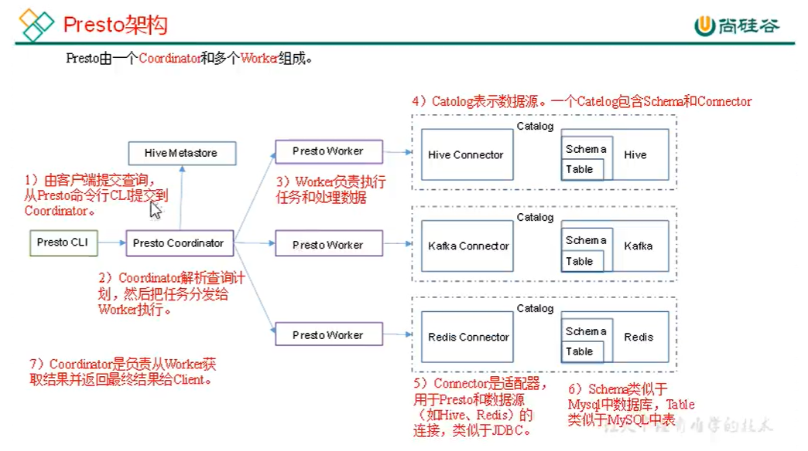
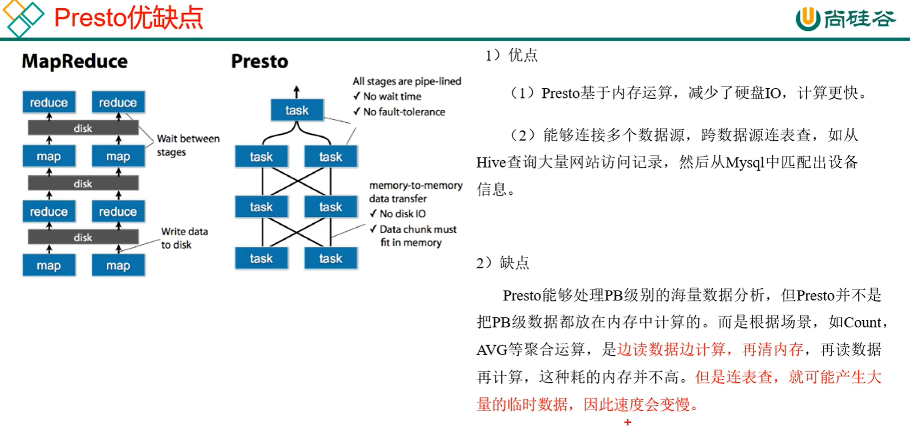

# Presto Notes

## Remark

- Presto 是一个开源的分布式SQL查询引擎，数据量支持GB-PB，主要用于处理秒级查询场景。
- 注意：虽然Presto可以解析SQL，但它不是一个标准的数据库。不是MySQL、Oracle的代替品，也不能用来处理在线事务(OLTP)
- Presto 不依赖于Yarn

## Presto 概述

### Presto 架构

### Presto 优缺点

> MR慢的原因：
>
> - 每个任务间的数据要轮盘，MapTask和ReduceTask之间的数据也要落盘
> - 数据还存在网络传输（网络传输：各服务器之间的数据交换）

## Predto 部署

