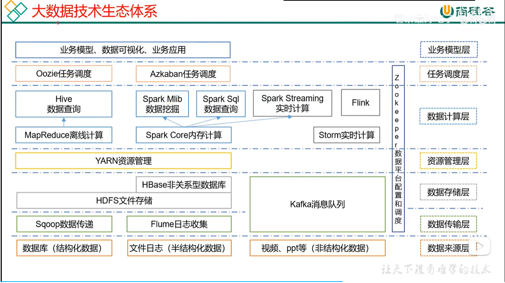
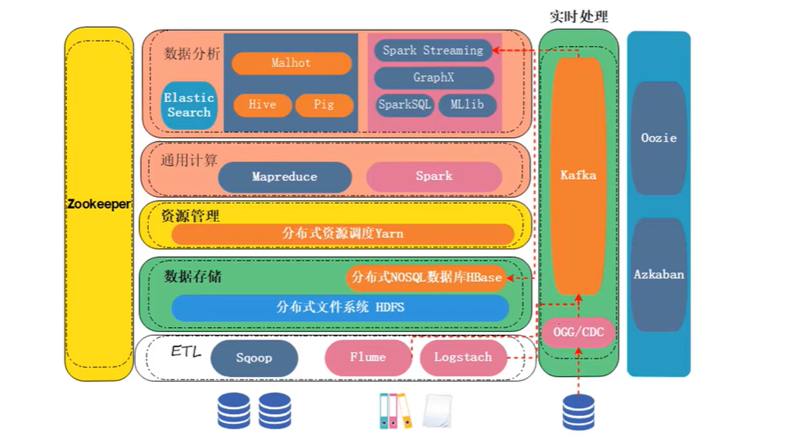
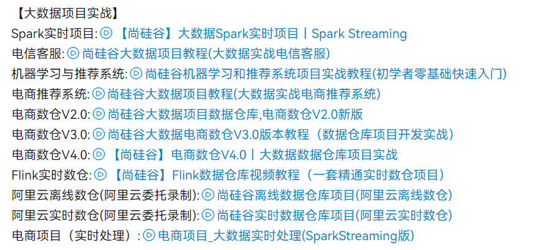

# 大数据框架

- [2023年度全网最全大数据学习路线 - 哔哩哔哩 (bilibili.com)](https://www.bilibili.com/read/cv5213600)
- [2023Python+大数据学习路线图 - 哔哩哔哩 (bilibili.com)](https://www.bilibili.com/read/cv11171369)
- 数据开发，数据分析，数据挖掘
  - 我们绝大部分人都是从数据开发开始的，它的门槛比较低，相应的薪资是15-30k。这个岗位需求量比较大。
  - 数据分析师对学历的门槛稍微高一些，专科想学习难度比较大，也不是不可能，就是学习难度可能稍微大一些。薪资都是16k-45k。
  - 数据挖掘门槛也比较高，学历高和数学基础要求高。他的薪资也是比较高的，薪资都是30k起步。
- 已学框架
  - hadoop
  - zokeeper
  - kafka
  - hive
  - flume
  - hbase
  - spark
  - 

#### Haddop系列

**Maven**

**Linux**

**Shell编程**

- 02:46:14(2018)

**Hadoop** - HDFS、MapReduce、Yarn

- 27:27:18

**Zookeeper**

- 05:52:39

HA

- 02:27:15(2018)

**Hive**

- 20:41:31(2020)
- 04:51:28(2021-高级进阶)
- 01:11:56(2022-源码解析)

**Flume**

- 07:10:48
- 01:11

**Kafka** 3.X (2022)

- 12:57:23

#### spark系列

**Spark** 3.0

- 31:10:47(2020)
- 06:40:45(2021-Spark 3.0性能调优)
- 09:00:12(2021-内核源码解析)

Presto

Superset

- 01:14:23(2021)

DolphinScheduler

**DataX**

- 04:54:14

Atlas2.0

- 03:45:17

MaxWell

- 01:50:53

Zabbix

**Hbase** 2.X (2022)

- 08:55:58

Redis

- 有

#### Flink系列

**Flink** 1.13 (2022)

- 39:27:12 (java-2022)                           - 36:42:03(2020版)       
- 34:40:07 (scala-2022)

ClickHouse

- 11:47:54(2021)

Sugar

Doris  (Apache Doris)

- 15:07:01

Hudi

lceberg

K8S

- 有

Git&GitHub

- 04:52:41(2021)

Springboot

- 有

#### 其他

Scala

- 25:05:54

SeaTunnel

- 02:59:25

StreamX

- 02:08:52

Telegraf

- 03:52:53

Kylin 4.0 (2022)

- 04:48:21

Oozie

- 有(2018)-9节

Azkaban 3.x

- 2021-19节

sqoop

- 有(2018)-10节

## 离线数仓和实时数仓

一、技术栈上，离线一般hive spark hdfs等，实时flink kafka hbase 

二、分层上，离线分层更多，实时相对减少

三、实效性上，实时更加实时，延时控制在秒级别

四、运维上，实时相对比较困难，其储存使用kafka ，不可查询，排查问题比较困难

五、业务需求上，离线多于实时。

作者：Flink实战剖析
链接：https://www.zhihu.com/question/512215713/answer/2331888807
来源：知乎
著作权归作者所有。商业转载请联系作者获得授权，非商业转载请注明出处。

我们从以下7个方面来对比离线数仓与实时数仓区别：

1.架构选择方面,离线数仓采用传统大数据架构模式搭建，而实时数仓采用Kappa架构方式搭建。

2.建设方法上两者都是采用传统数仓建模方法论。

3.准确性方面，离线数仓准确度高，实时数仓随着技术发展，准确度也比较高。

4.实时性方面：离线数仓统计数据结果一般是T+1,实时数仓统计结果一般是分钟级别、秒级别。

5.稳定性方面：离线数仓稳定性好、方便重算。实时数仓对数据波动比较敏感，数据重新计算时相对麻烦。

6.数据吞吐量方面，离线数仓吞吐量都很高，实时数仓随着实时技术发展吞吐量较高。

7.数据存储方面，离线数仓一般将数据存储在HDFS、Hive中，实时数仓一般将数据存储在Kafka、Hbase、Redis、ClickHouse中。

作者：马士兵教育官方
链接：https://www.zhihu.com/question/512215713/answer/2315895197
来源：知乎
著作权归作者所有。商业转载请联系作者获得授权，非商业转载请注明出处。

## 大数据框架图

## 大数据项目实战

## 实习

- 字节导师制
- 宏观上对部门项目有个认识
- 业务和技术结合起来
- 做需求，写技术方案
- 走读代码，写一下对代码的思考，以及有没有优化的点
- 实习期间，要沉淀自己所做的事情，要学会用文档写下自己的思考

- 做任务时，要学会思考问题，比如：为什么要用这种数据库？数据库的使用成本，应用场景，读写性能，
- 

## 算法

- 大厂刷题班 - [01_绳子覆盖最多的点数_哔哩哔哩_bilibili](https://www.bilibili.com/video/BV1vi4y1R7g9?p=2&vd_source=5bc191bb37a56c995b0901fd3ad1baa5)

## 搭建集群顺序

- hadoop  spark   hive    storm   kafka
- 搭建集群顺序
  - hadoop / java
    - hadoop: etc/hadoop/
    - hadoop:
    - hadoop:
    - hadoop:
    - hadoop:
  - zookeeper
    - 
  - flume
    - 
  - kafka (配置前，需先配置zookeeper)
    - config/server.properties
  - hive / mysql
    - 

## 详细大数据学习路线图

- javase
  - 已学完
- mysql
  - 基础学完
  - 提高待学

- [2022年度全网最全大数据学习路线 - 哔哩哔哩 (bilibili.com)](https://www.bilibili.com/read/cv5213600)

一、大数据核心框架

- 1.尚硅谷Linux+Shell视频教程：1233:50
  3天搞定Linux，1天搞定Shell，清华学神带你通关（2022版）

  [3天搞定Linux，1天搞定Shell，清华学神带你通关（2022版）_哔哩哔哩_bilibili](https://www.bilibili.com/video/BV1WY4y1H7d3/)

- 2.尚硅谷Hadoop3.x视频教程：1647:18
  尚硅谷大数据Hadoop教程（Hadoop 3.x安装搭建到集群调优）

  [尚硅谷大数据Hadoop教程（Hadoop 3.x安装搭建到集群调优）_哔哩哔哩_bilibili](https://www.bilibili.com/video/BV1Qp4y1n7EN/?vd_source=5bc191bb37a56c995b0901fd3ad1baa5)

- 3.尚硅谷Hadoop3.x高可用(HA)集群视频教程：71:42  - 2021年
  【尚硅谷】Hadoop3.x高可用集群，HDFS、Yarn集群

  [【尚硅谷】Hadoop3.x高可用集群，HDFS、Yarn集群_哔哩哔哩_bilibili](https://www.bilibili.com/video/BV1EP4y1j7V1/)

- 4.尚硅谷Zookeepr视频教程：352:39
  【尚硅谷】大数据技术之Zookeeper 3.5.7版本教程

  [【尚硅谷】大数据技术之Zookeeper 3.5.7版本教程_哔哩哔哩_bilibili](https://www.bilibili.com/video/BV1to4y1C7gw/?vd_source=5bc191bb37a56c995b0901fd3ad1baa5)

- 5.尚硅谷Hive（升级版）视频教程：1241:31
  尚硅谷大数据Hive教程（基于hive3.x丨hive3.1.2）

  [尚硅谷大数据Hive教程（基于hive3.x丨hive3.1.2）_哔哩哔哩_bilibili](https://www.bilibili.com/video/BV1EZ4y1G7iL/?vd_source=5bc191bb37a56c995b0901fd3ad1baa5)

- 6.尚硅谷Hive（高级进阶）视频教程：291:28
  【尚硅谷】大数据Hive高级进阶教程（基于hive3.x）

  

- ~~7.尚硅谷HA视频教程：147:15  -   2018年(最新版2021)~~ 
  ~~尚硅谷HA教程(大数据ha快速入门)~~

  

- 8.尚硅谷Flume最新版视频教程：430:48
  【尚硅谷】大数据技术之Flume教程从入门到实战

  

- 9.尚硅谷Kafka（2022版）视频教程：777:23
  【尚硅谷】2022版Kafka3.x教程（从入门到调优，深入全面）

  

- 10.尚硅谷HBase2.X视频教程：535:58
  尚硅谷HBase2.x教程（2022新版，一套全面掌握hbase）

  - phoenix

- 11.尚硅谷DolphinScheduler2.x视频教程：264:54
  【尚硅谷】DolphinScheduler2.x安装到优化（工作流调度平台）

  

- ----12.尚硅谷Sqoop视频教程：71:15
  尚硅谷Sqoop教程(sqoop大数据开发标配)

  

- 13.尚硅谷Azkaban3.x视频教程：201:13
  尚硅谷大数据Azkaban 3.x教程（全新发布）

  

- 14.尚硅谷Maxwell教程：110:53
  【尚硅谷】大数据技术之Maxwell

  

- ----15.尚硅谷Canal教程：69:37
  【尚硅谷】大数据Canal教程丨Alibaba数据实时同步神器

  

- 16.尚硅谷Scala视频教程：1505:54
  尚硅谷大数据技术之Scala入门到精通教程（小白快速上手scala）

  

- ----17.尚硅谷Oozie视频教程：138:56
  尚硅谷Oozie教程(oozie大数据开发标配)

  

- 18.尚硅谷Spark视频教程：1870:47
  尚硅谷大数据Spark教程从入门到精通

  

- 19.尚硅谷Spark调优视频教程：400:45
  【尚硅谷】大数据Spark3.0调优，Spark3.x性能优化

  

- ~~20.尚硅谷大数据Flink从入门到实战：1944:59~~     看22
  ~~尚硅谷Flink教程从入门到精通(新版已上传，推荐观看)~~

  

- 21.尚硅谷大数据技术之Flink(SQL)：390:41
  尚硅谷FlinkSQL\Flink SQL（武老师：清华硕士，原IBM-CDL技术负责人）

  

- 22.尚硅谷大数据技术之Flink(Java)：2367:12
  【尚硅谷】2022版Flink1.13实战教程（涵盖所有flink-Java知识点）

  

- 23.尚硅谷大数据技术之Flink（Scala）：2080:07
  【尚硅谷】Flink1.13教程（Scala版）

  

- 24.尚硅谷Flink内核源码解析：540:12
  尚硅谷Flink内核源码解析课程（从入门到精通）

  

- 25.尚硅谷Flink性能调优：381:51
  【尚硅谷】大数据Flink2.0调优，Flink性能优化

  

- 26.尚硅谷ClickHouse视频教程：707:54
  一套上手ClickHouse-OLAP分析引擎，囊括Prometheus与Grafana

  

- 27.尚硅谷Flink CDC视频教程：112:47
  尚硅谷大数据Flink CDC教程（从flinkcdc入手剖析DataStream、FlinkSQL两种使用模式）

  

- 28.尚硅谷Superset视频教程：74:23
  尚硅谷大数据Superset教程（数据仓库项目首选数据可视化平台）

  

- ----29.尚硅谷Atlas数据治理视频教程：225:17
  【尚硅谷】大数据技术之Atlas数据治理

  

- ----30.尚硅谷监控告警系统（Prometheus）视频教程：139:58
  【尚硅谷】Prometheus+Grafana+睿象云的监控告警系统

  

- ----31.尚硅谷监控告警系统（Zabbix）视频教程：138:19
  【尚硅谷】Zabbix+Grafana+睿象云的监控告警系统

  

- ----32.尚硅谷Apache Kylin4.0视频教程：288:21
  尚硅谷2022版Kylin教程丨Kylin4.0&MDX

  

- 33.尚硅谷DataX视频教程：294:14
  【尚硅谷】Alibaba开源数据同步工具DataX技术教程

> 2022年
>
> - Javase
> - mysql
> - linux
> - maven
> - jdbc
> - 
> - 学完框架
>
> 2023年
>
> - 开始项目实战
> - 算法
> - 刷题
> - 计算机基础
>   - 计组
>   - os
>   - 计网
> - ML,DL,......

二、大数据项目实战

- 1.尚硅谷电信客服案例项目教程：717:59
  尚硅谷大数据项目教程(大数据实战电信客服)
- 1.尚硅谷电商数仓项目5.0教程
  尚硅谷大数据项目数据仓库,电商数仓V5.0新版
- 2.尚硅谷SparkStreaming（实时）项目视频教程：2371:11
  【尚硅谷】大数据Spark实时项目丨Spark Streaming
- 3.尚硅谷机器学习与推荐系统项目教程：1657:29
  尚硅谷机器学习和推荐系统项目实战教程(初学者零基础快速入门)
- 4.尚硅谷电商推荐系统项目教程：549:19
  尚硅谷大数据项目教程(大数据实战电商推荐系统)
- ~~5.尚硅谷电商数仓项目2.0教程：2810:53~~
  ~~尚硅谷大数据项目数据仓库,电商数仓V2.0新版~~
- 6.尚硅谷大数据Flink技术与实战-课堂实录：1944:59
  尚硅谷Flink教程从入门到精通(新版已上传，推荐观看)
- 7.尚硅谷阿里云数仓（离线）：518:44
  尚硅谷离线数据仓库项目(阿里云离线数仓)
- 8.尚硅谷阿里云数仓（实时）：185:35
  尚硅谷实时数据仓库项目(阿里云实时数仓)
- ~~9.尚硅谷电商数仓项目3.0教程：3262:22~~
  ~~尚硅谷大数据电商数仓V3.0版本教程（数据仓库项目开发实战）~~
- 10.尚硅谷电商项目（实时处理）：3037:44
  电商项目_大数据实时处理(SparkStreaming版)
- ~~11.尚硅谷电商数仓项目4.0教程：3269:54~~
  ~~【尚硅谷】电商数仓V4.0丨大数据数据仓库项目实战~~
- 12.尚硅谷Flink实时数仓视频教程：2218:07
  【尚硅谷】Flink数据仓库视频教程（一套精通实时数仓项目）
- 13.尚硅谷Flink实时数仓3.0视频教程：3464:01
  尚硅谷大数据之Flink实时数仓3.0，数据仓库项目实战教程

三、面试

- 1、尚硅谷MySQL数据库高频面试题，mysql大厂面试题甄选（全面细致解读）

纸上得来终觉浅，绝知此事要躬行。 —陆游

好风凭借力，送你上青云！

