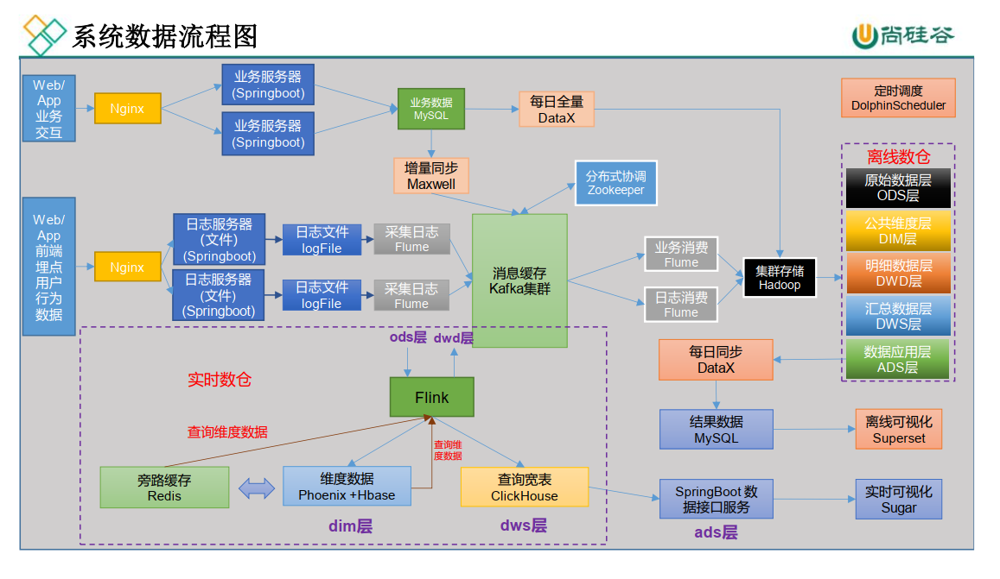

# Notes

## Remark

- MySQL 开启binlog 

  ```shell
  sudo vim /etc/my.cnf
  
  # -----maxwell-----开启主从复制-----
  server_id=1
  # 启动binlog，该参数的值会作为binlog的文件名
  log-bin=mysql-bin
  # binlog类型，maxwell要求为row类型
  binlog_format=row
  # 仅对 db_maxwell 生成binlog文件
  # 如果想对多个库生成 binlog，再写一遍 binlog-do-db=db_test01，不能直接再加在后面
  binlog-do-db=db_maxwell
  binlog-do-db=gmall
  # 忽略g数据库
  # binlog-ignore-db=g
  # -----maxwell-----end-----
  
  # azkaban 时配置
  max_allowed_packet=1024M
  ```

  > binlog-do-db=db_maxwell    -    用来检测业务数据路线是否连通
  >
  > binlog-do-db=gmall  项目中用到的数据库（业务数据存储的数据库）


## 数据路线图




