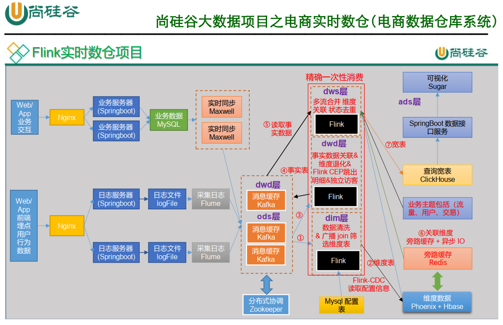

# Notes

## Remark

- MySQL 开启binlog 

  ```shell
  sudo vim /etc/my.cnf
  
  # -----maxwell-----开启主从复制-----
  server_id=1
  # 启动binlog，该参数的值会作为binlog的文件名
  log-bin=mysql-bin
  # binlog类型，maxwell要求为row类型
  binlog_format=row
  # 仅对 db_maxwell 生成binlog文件
  # 如果想对多个库生成 binlog，再写一遍 binlog-do-db=db_test01，不能直接再加在后面
  binlog-do-db=db_maxwell
  binlog-do-db=gmall
  # 忽略g数据库
  # binlog-ignore-db=g
  # -----maxwell-----end-----
  
  # azkaban 时配置
  max_allowed_packet=1024M
  ```

  > 开启监控binlog日志的库：
  >
  > binlog-do-db=db_maxwell    -    用来检测业务数据路线是否连通
  >
  > binlog-do-db=gmall  项目中用到的数据库（业务数据存储的数据库）

- 


## 数据分类

### 用户行为日志

- 用户行为日志结构大致分为两类：页面日志&启动日志

#### 页面日志

- 一条**完整的页面日志**包含：
  - 一个页面浏览记录，
  - 若干个用户在该页面所做的动作记录，
  - 若干个该页面的曝光记录，
  - 以及一个在该页面发生的报错记录。
  - 除上述行为信息，页面日志还包含了这些行为所处的各种环境信息，包括用户信息、时间信息、地理位置信息、设备信息、应用信息、渠道信息等。

```json
{
	"common": {                     -- 环境信息
		"ar": "230000",             -- 地区编码
		"ba": "iPhone",             -- 手机品牌
		"ch": "Appstore",           -- 渠道
		"is_new": "1",              -- 是否首日使用，首次使用的当日，该字段值为1，过了24:00，该字段置为0。
		"md": "iPhone 8",           -- 手机型号
		"mid": "YXfhjAYH6As2z9Iq",  -- 设备id
		"os": "iOS 13.2.9",         -- 操作系统
		"uid": "485",               -- 会员id
		"vc": "v2.1.134"            -- app版本号
	},
	"actions": [{                   -- 动作(事件)
		"action_id": "favor_add",   -- 动作id
		"item": "3",                -- 目标id
		"item_type": "sku_id",      -- 目标类型
		"ts": 1585744376605         -- 动作时间戳
	    }
	],
	"displays": [{                  -- 曝光
			"displayType": "query", -- 曝光类型
			"item": "3",            -- 曝光对象id
			"item_type": "sku_id",  -- 曝光对象类型
			"order": 1,             -- 出现顺序
			"pos_id": 2             -- 曝光位置
		},
		{
			"displayType": "promotion",
			"item": "6",
			"item_type": "sku_id",
			"order": 2,
			"pos_id": 1
		},
		{
			"displayType": "promotion",
			"item": "9",
			"item_type": "sku_id",
			"order": 3,
			"pos_id": 3
		},
		{
			"displayType": "recommend",
			"item": "6",
			"item_type": "sku_id",
			"order": 4,
			"pos_id": 2
		},
		{
			"displayType": "query ",
			"item": "6",
			"item_type": "sku_id",
			"order": 5,
			"pos_id": 1
		}
	],
	"page": {                          -- 页面信息
		"during_time": 7648,           -- 持续时间毫秒
		"item": "3", 	               -- 目标id
		"item_type": "sku_id",         -- 目标类型
		"last_page_id": "login",       -- 上页类型
		"page_id": "good_detail",      -- 页面ID
		"sourceType": "promotion"      -- 来源类型
	},                                 
	"err": {                           --错误
		"error_code": "1234",          --错误码
		"msg": "***********"           --错误信息
	},                                 
	"ts": 1585744374423                --跳入时间戳
}
```


#### 启动日志

- 启动日志以启动为单位，及一次启动行为，生成一条启动日志。一条完整的启动日志包括：
  - 一个启动记录，
  - 一个本次启动时的报错记录，
  - 以及启动时所处的环境信息，包括用户信息、时间信息、地理位置信息、设备信息、应用信息、渠道信息等。

```json
{
  "common": {
    "ar": "370000",
    "ba": "Honor",
    "ch": "wandoujia",
    "is_new": "1",
    "md": "Honor 20s",
    "mid": "eQF5boERMJFOujcp",
    "os": "Android 11.0",
    "uid": "76",
    "vc": "v2.1.134"
  },
  "start": {   
    "entry": "icon",         --icon手机图标  notice 通知   install 安装后启动
    "loading_time": 18803,  --启动加载时间
    "open_ad_id": 7,        --广告页ID
    "open_ad_ms": 3449,    -- 广告总共播放时间
    "open_ad_skip_ms": 1989   --  用户跳过广告时点
  },
"err":{                     --错误
"error_code": "1234",      --错误码
    "msg": "***********"       --错误信息
},
  "ts": 1585744304000
}
```


### 业务数据

- 设计34张业务表，存储在MySQL


## 数据路线图





## 数仓开发之 ODS 层  

> kafka


## 数仓开发之 DIM 层  

> Hbase


## 数仓开发之 DWD 层  

> Kafka


## 数仓开发之DWS 层  

> Clickhouse


