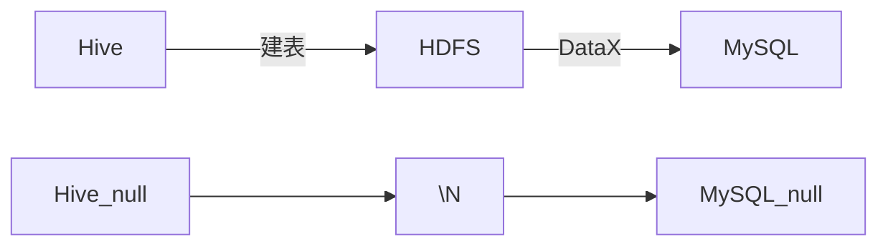
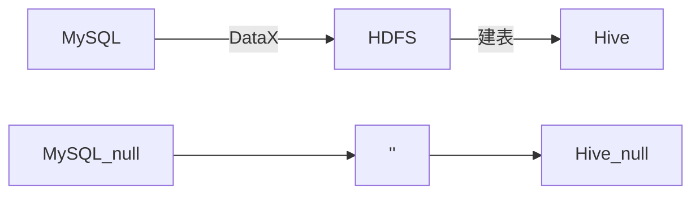
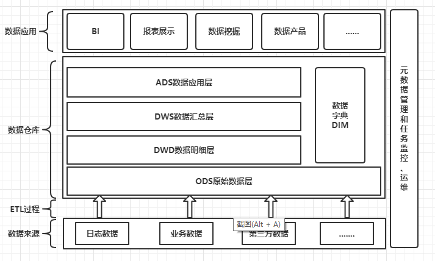

# Notes

## Remark-问题

- 访问hdfs文件

  ```
  hdfs://l9z102:8020/
  ```

  > 未测试，不知道行不行

- hive中的表有些在datagrip中，不显示字段

  hive-site.xml 加一个配置信息

  ```xml
  <!-- 解决datagrip中某些表不显示字段的问题  -->
  <property>
      <name>metastore.storage.schema.reader.impl</name>
      <value>org.apache.hadoop.hive.metastore.SerDeStorageSchemaReader</value>
  </property>
  ```

- hive中的表字符集为`拉丁1`，不支持中文，修改

  - 修改元数据**表的字符集**和**列的字符集**

    - TABLE_PARAMS
    - COLUMNS_V2
  
    ```sql
    # 修改成   utf8   utf8_bin
    ```
  
  - hive-site.xml 加配置信息

    URL中加上这个：`&amp;useUnicode=true&amp;characterEncoding=UTF-8`
  
    ```xml
    <!-- jdbc 连接的 URL -->
    <property>
        <name>javax.jdo.option.ConnectionURL</name>
        <value>jdbc:mysql://l9z102:3306/metastore_3?useSSL=false&amp;useUnicode=true&amp;characterEncoding=UTF-8</value>
    </property>
    ```
  
    


## DataX空值问题



> - Hive 建表时可以指定，`null`以什么形式存储在HDFS
>
>   默认`null`值在hdfs中用`\N`表示，当然也可以自己指定
>
> > ```sql
> > ROW FORMAT DELIMITED
> >    NULL DEFINED AS '';
> > ```
>
> - HDFS_to_MySQL时，DataX可以指定，当从HDFS中读到什么字符(比如:\N)时，存储到MySQL为`null`值
>   - 反过来，MySQL_to_HDFS时（DataX），**不能指定**MySQL中的`null`值，在HDFS中以什么形式存储；
>   - DataX中默认时以''(空字符)存储`null`值
>
> > ```json
> > "reader": {
> >     "fileType": "text",
> >     "compress": "gzip",
> >     "encoding": "UTF-8",
> >     "nullFormat": "\\N",
> >     "fieldDelimiter": "\t"
> > }
> > ```




> - MySQL_to_HDFS时（DataX），DataX默认是将MySQL中的null值，在HDFS中以''(空字符)存储
>
> - Hive 建表时可以指定，`null`以什么形式存储在HDFS
>
> > 第一种解决方案：Hive 建表时，指定`null`以''(空字符)存储，
> >
> > - 能用，但不太优雅，因为如果MySQL中的''(空字符)，经过HDF传输后，到Hive后就变成了`null`值
> >
> > 第二种解决方案：**重写DataX源码**，让他默认将MySQL中的null值，在HDFS中以`\N`存储
> >
> > - 重写DataX源码：https://blog.csdn.net/u010834071/article/details/105506580


## Hive On Tez

### 部署

- 1、将 tez 安装包拷贝到集群，并解压 tar 包

  ```shell
  mkdir /opt/module/tez
  tar -zxvf /opt/software/tez-0.10.1-SNAPSHOT-minimal.tar.gz -C /opt/module/tez
  ```

- 2、上传 tez 依赖到 HDFS

  ```shell
  hadoop fs -mkdir /tez
  hadoop fs -put /opt/software/tez-0.10.1-SNAPSHOT.tar.gz /tez
  ```

- 3、新建 tez-site.xml

  ```shell
  vim $HADOOP_HOME/etc/hadoop/tez-site.xml
  ```

  ```xml
  <?xml version="1.0" encoding="UTF-8"?>
  <?xml-stylesheet type="text/xsl" href="configuration.xsl"?>
  <configuration>
      <property>
          <name>tez.lib.uris</name>
          <value>${fs.defaultFS}/tez/tez-0.10.1-SNAPSHOT.tar.gz</value>
      </property>
      <property>
          <name>tez.use.cluster.hadoop-libs</name>
          <value>true</value>
      </property>
      <property>
          <name>tez.am.resource.memory.mb</name>
          <value>1024</value>
      </property>
      <property>
          <name>tez.am.resource.cpu.vcores</name>
          <value>1</value>
      </property>
      <property>
          <name>tez.container.max.java.heap.fraction</name>
          <value>0.4</value>
      </property>
      <property>
          <name>tez.task.resource.memory.mb</name>
          <value>1024</value>
      </property>
      <property>
          <name>tez.task.resource.cpu.vcores</name>
          <value>1</value>
      </property>
  </configuration>
  ```

- 4、修改 Hadoop 环境变量

  ```shell
  vim $HADOOP_HOME/etc/hadoop/shellprofile.d/tez.sh
  ```

  ```
  hadoop_add_profile tez
  function _tez_hadoop_classpath
  {
      hadoop_add_classpath "$HADOOP_HOME/etc/hadoop" after
      hadoop_add_classpath "/opt/module/tez/*" after
      hadoop_add_classpath "/opt/module/tez/lib/*" after
  }
  ```

- 5、修改 Hive 的计算引擎  -   主要是这个++++++++++++++++++++++++++++++++++++++++++

  ```shell
  vim $HIVE_HOME/conf/hive-site.xml
  ```

  ```xml
  <property>
      <name>hive.execution.engine</name>
      <value>tez</value>
  </property>
  <property>
      <name>hive.tez.container.size</name>
      <value>1024</value>
  </property>
  ```

- 6、解决日志 Jar 包冲突

  ```shell
  rm /opt/module/tez/lib/slf4j-log4j12-1.7.10.jar
  ```

>hive-3.1.3 :  Tez 和 MR 的切换
>
>- 把第5步直接去掉，就换成MR了
>- 把第5步加上，就换成tez了


## Hive On Spark

### 部署

- 官网下载的Hive3.1.2和Spark3.0.0默认是不兼容的。因为Hive3.1.2支持的Spark版本是2.4.5，所以需要我们重新编译Hive3.1.2版本。

- 1、在Hive所在节点部署Spark

- 2、配置SPARK_HOME环境变量

- 3、在hive中创建spark配置文件 `spark-defaults.conf ` ，并添加以下内容：

  ```shell
  vim /opt/module/hive/conf/spark-defaults.conf
  ```

  ```xml
  spark.master                            yarn
  spark.eventLog.enabled                  true
  spark.eventLog.dir                      hdfs://l9z102:8020/spark-yarn/directory
  spark.executor.memory                   1g
  spark.driver.memory					    1g
  ```

  > 需要提前在HDFS创建如下路径，用于存储历史日志。
  >
  > - `hadoop fs -mkdir -p /spark-yarn/directory`

- 4、向HDFS上传Spark纯净版jar包

  - 解压`spark-3.0.0-bin-without-hadoop.tgz`

  ```shell
  tar -zxvf /opt/software/spark-3.0.0-bin-without-hadoop.tgz
  ```

  - 上传Spark纯净版jar包到HDFS

  ```shell
  hadoop fs -mkdir /spark-jars
  hadoop fs -put spark-3.0.0-bin-without-hadoop/jars/* /spark-jars
  ```

  > - 说明1：由于`Spark3.0.0非纯净版`默认支持的是hive2.3.7版本，直接使用会和安装的Hive3.1.2出现兼容性问题。所以采用Spark纯净版jar包，不包含hadoop和hive相关依赖，避免冲突。
  >
  > - 说明2：Hive任务最终由Spark来执行，Spark任务资源分配由Yarn来调度，该任务有可能被分配到集群的任何一个节点。所以需要将Spark的依赖上传到HDFS集群路径，这样集群中任何一个节点都能获取到。

- 5、修改hive-site.xml文件 - 添加以下内容

  ```shell
  vim /opt/module/hive/conf/hive-site.xml
  ```

  ```xml
  <!--Spark依赖位置（注意：端口号8020必须和namenode的端口号一致）-->
  <property>
      <name>spark.yarn.jars</name>
      <value>hdfs://l9z102:8020/spark-jars/*</value>
  </property>
    
  <!--Hive执行引擎-->
  <property>
      <name>hive.execution.engine</name>
      <value>spark</value>
  </property>
  ```

> hive-3.1.3 :  Spark 和 MR 的切换
>
> - 把第5步直接去掉，就换成MR了
> - 把第5步加上，就换成Spark了


### MR，Spark，区别

- hive on mr 
  - 一个 SQL 转一个 mr 任务(job)，
- hive on spark
  - 一个会话转一个spark Job，多个SQL在一个会话里，只会产生一个spark Job，
  - 为什么跑第一条hive on spark时，会很慢   -    P82 30：00
    - 跑第一条语句时，是因为要申请资源，
    - 跑第二条语句时，因为会话不停，spark任务不停，资源就一直还在


## 分层设计



> - ODS（Operational Data Store）原始数据层
> - DWD（Data Warehouse Detail）数据明细层
> - DWS（Data WareHouse Summary）数据汇总层
> - DIM 层
> - ADS（Application Data Service）应用数据层

- ODS层

  - ODS层的设计要点如下：

    （1）ODS层的表结构设计依托于从业务系统同步过来的数据结构。
  
    （2）ODS层要保存全部历史数据，故其压缩格式应选择压缩比较高的，此处选择gzip。

    （3）ODS层表名的命名规范为：`ods_表名_单分区增量全量标识（inc/full）。`
  
  - 日志数据建表
  
    - 建表的分区规则都是一天一个分区。
    - 表名格式：`ods_xxx_full/inc`
    - 建表要用到hive的集合数据类型
  
    ```sql
    DROP TABLE IF EXISTS ods_log_inc;
    CREATE EXTERNAL TABLE ods_log_inc
    (
        `common`   STRUCT<ar :STRING,ba :STRING,ch :STRING,is_new :STRING,md :STRING,mid :STRING,os :STRING,uid :STRING,vc
                          :STRING> COMMENT '公共信息',
        `page`     STRUCT<during_time :STRING,item :STRING,item_type :STRING,last_page_id :STRING,page_id
                          :STRING,source_type :STRING> COMMENT '页面信息',
        `actions`  ARRAY<STRUCT<action_id:STRING,item:STRING,item_type:STRING,ts:BIGINT>> COMMENT '动作信息',
        `displays` ARRAY<STRUCT<display_type :STRING,item :STRING,item_type :STRING,`order` :STRING,pos_id
                                :STRING>> COMMENT '曝光信息',
        `start`    STRUCT<entry :STRING,loading_time :BIGINT,open_ad_id :BIGINT,open_ad_ms :BIGINT,open_ad_skip_ms
                          :BIGINT> COMMENT '启动信息',
        `err`      STRUCT<error_code:BIGINT,msg:STRING> COMMENT '错误信息',
        `ts`       BIGINT  COMMENT '时间戳'
    ) COMMENT '活动信息表'
        PARTITIONED BY (`dt` STRING)
        ROW FORMAT SERDE 'org.apache.hadoop.hive.serde2.JsonSerDe'; 
    ```
  
    > 
  
  - 装载数据
  
    - hdfs_to_ods_log
  
    ```shell
    load data inpath 'hdfs://l9z102:8020/origin_data/gmall/log/topic_log/2020-06-14' into table ods_log_inc partition(dt = '2020-06-14');
    ```
  
    > 注意分区，这个脚本很简单 - `hdfs_to_ods_log.sh`
  
  - 业务数据建表
  


- DIM

  - DIM层设计要点：

    （1）DIM层的设计依据是维度建模理论，该层存储维度模型的维度表。

    （2）DIM层的数据存储格式为orc列式存储+snappy压缩。

    > orc列式存储+snappy压缩：是一个经典的搭配。
    >
    > DIM层用snappy压缩原因是，压缩和解压缩比较块，
    >
    > orc列式存储，也是加快查询的，因为后期我们查询也是按某一列来查，一般不会按行查。
    >
    > > ods层因为要保存所有的原始数据，尽可能压缩最小，所以选择gzip压缩，特点是压缩率比较大。

    （3）DIM层表名的命名规范为`dim_表名_全量表或者拉链表标识（full/zip）`

  - CTE  -   公用表表达式(common table expression);
  
    ```sql
    with
        sku as
            (
                # 子查询
            ),
        spu as
            (
                # 子查询
            ),
        c3 as
            (
                # 子查询
            )
    # 接着写sql语句......
    
    # ------------------------------------------------------------------------------------------
    with
        sku as
            (
                select
                    id,
                    price,
                    sku_name,
                    sku_desc,
                    weight,
                    is_sale,
                    spu_id,
                    category3_id,
                    tm_id,
                    create_time
                from ods_sku_info_full
                where dt='2020-06-14'
            ),
        spu as
            (
                select
                    id,
                    spu_name
                from ods_spu_info_full
                where dt='2020-06-14'
            ),
        c3 as
            (
                select
                    id,
                    name,
                    category2_id
                from ods_base_category3_full
                where dt='2020-06-14'
            ),
        c2 as
            (
                select
                    id,
                    name,
                    category1_id
                from ods_base_category2_full
                where dt='2020-06-14'
            ),
        c1 as
            (
                select
                    id,
                    name
                from ods_base_category1_full
                where dt='2020-06-14'
            ),
        tm as
            (
                select
                    id,
                    tm_name
                from ods_base_trademark_full
                where dt='2020-06-14'
            ),
        attr as
            (
                select
                    sku_id,
                    collect_set(named_struct('attr_id',attr_id,'value_id',value_id,'attr_name',attr_name,'value_name',value_name)) attrs
                from ods_sku_attr_value_full
                where dt='2020-06-14'
                group by sku_id
            ),
        sale_attr as
            (
                select
                    sku_id,
                    collect_set(named_struct('sale_attr_id',sale_attr_id,'sale_attr_value_id',sale_attr_value_id,'sale_attr_name',sale_attr_name,'sale_attr_value_name',sale_attr_value_name)) sale_attrs
                from ods_sku_sale_attr_value_full
                where dt='2020-06-14'
                group by sku_id
            )
    insert overwrite table dim_sku_full partition(dt='2020-06-14')
    select
        sku.id,
        sku.price,
        sku.sku_name,
        sku.sku_desc,
        sku.weight,
        sku.is_sale,
        sku.spu_id,
        spu.spu_name,
        sku.category3_id,
        c3.name,
        c3.category2_id,
        c2.name,
        c2.category1_id,
        c1.name,
        sku.tm_id,
        tm.tm_name,
        attr.attrs,
        sale_attr.sale_attrs,
        sku.create_time
    from sku
             left join spu on sku.spu_id=spu.id
             left join c3 on sku.category3_id=c3.id
             left join c2 on c3.category2_id=c2.id
             left join c1 on c2.category1_id=c1.id
             left join tm on sku.tm_id=tm.id
             left join attr on sku.id=attr.sku_id
             left join sale_attr on sku.id=sale_attr.sku_id;
    ```
  
    


- DWD（Data Warehouse Detail）数据明细层
  - DWD层设计要点：
  
    （1）DWD层的设计依据是维度建模理论，该层存储维度模型的事实表。
  
    （2）DWD层的数据存储格式为orc列式存储+snappy压缩。
  
    （3）DWD层表名的命名规范为`dwd_数据域_表名_单分区增量全量标识（inc/full）`
  
  - 


- DWS（Data WareHouse Summary）数据汇总层

  - 存储中间结果

  - 设计要点：

    （1）DWS层的设计参考指标体系。

    （2）DWS层的数据存储格式为ORC列式存储 + snappy压缩。

    （3）DWS层表名的命名规范为`dws_数据域_统计粒度_业务过程_统计周期（1d/nd/td）`

    注：1d表示最近1日，nd表示最近n日，td表示历史至今。


- ADS（Application Data Service）应用数据层


