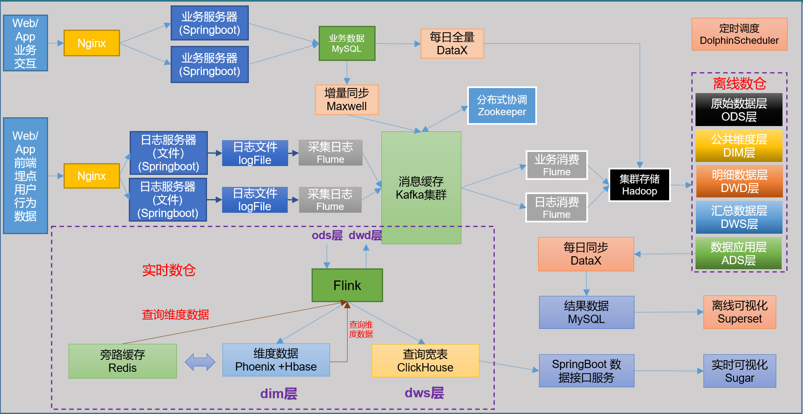
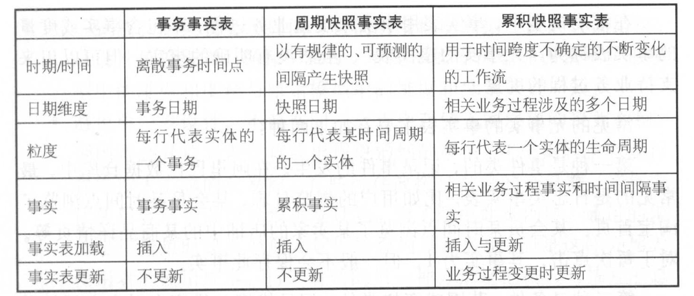
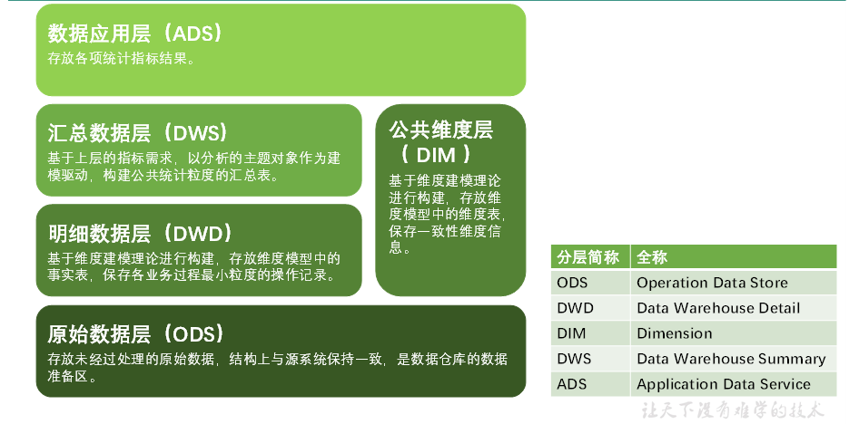
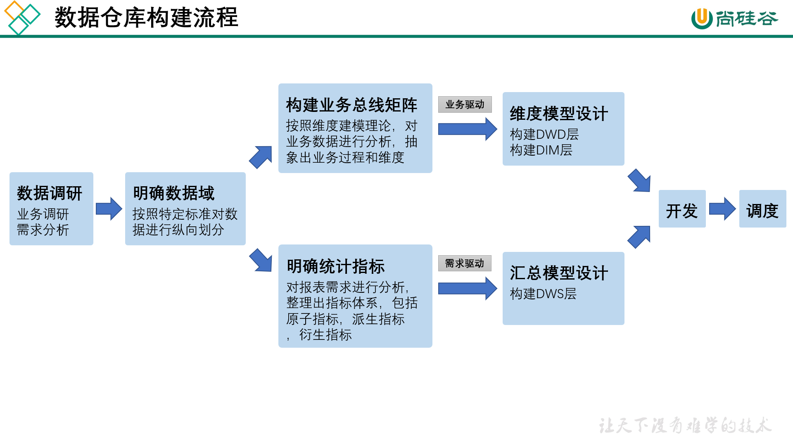

# 项目重述

## 数据流程设计




## 数据分类

### 用户行为日志

- 用户行为日志结构大致分为两类：页面日志&启动日志

#### 页面日志

- 一条**完整的页面日志**包含：
  - 一个页面浏览记录，
  - 若干个用户在该页面所做的动作记录，
  - 若干个该页面的曝光记录，
  - 以及一个在该页面发生的报错记录。
  - 除上述行为信息，页面日志还包含了这些行为所处的各种环境信息，包括用户信息、时间信息、地理位置信息、设备信息、应用信息、渠道信息等。

```json
{
	"common": {                     -- 环境信息
		"ar": "230000",             -- 地区编码
		"ba": "iPhone",             -- 手机品牌
		"ch": "Appstore",           -- 渠道
		"is_new": "1",              -- 是否首日使用，首次使用的当日，该字段值为1，过了24:00，该字段置为0。
		"md": "iPhone 8",           -- 手机型号
		"mid": "YXfhjAYH6As2z9Iq",  -- 设备id
		"os": "iOS 13.2.9",         -- 操作系统
		"uid": "485",               -- 会员id
		"vc": "v2.1.134"            -- app版本号
	},
	"actions": [{                   -- 动作(事件)
		"action_id": "favor_add",   -- 动作id
		"item": "3",                -- 目标id
		"item_type": "sku_id",      -- 目标类型
		"ts": 1585744376605         -- 动作时间戳
	    }
	],
	"displays": [{                  -- 曝光
			"displayType": "query", -- 曝光类型
			"item": "3",            -- 曝光对象id
			"item_type": "sku_id",  -- 曝光对象类型
			"order": 1,             -- 出现顺序
			"pos_id": 2             -- 曝光位置
		},
		{
			"displayType": "promotion",
			"item": "6",
			"item_type": "sku_id",
			"order": 2,
			"pos_id": 1
		},
		{
			"displayType": "promotion",
			"item": "9",
			"item_type": "sku_id",
			"order": 3,
			"pos_id": 3
		},
		{
			"displayType": "recommend",
			"item": "6",
			"item_type": "sku_id",
			"order": 4,
			"pos_id": 2
		},
		{
			"displayType": "query ",
			"item": "6",
			"item_type": "sku_id",
			"order": 5,
			"pos_id": 1
		}
	],
	"page": {                          -- 页面信息
		"during_time": 7648,           -- 持续时间毫秒
		"item": "3", 	               -- 目标id
		"item_type": "sku_id",         -- 目标类型
		"last_page_id": "login",       -- 上页类型
		"page_id": "good_detail",      -- 页面ID
		"sourceType": "promotion"      -- 来源类型
	},                                 
	"err": {                           --错误
		"error_code": "1234",          --错误码
		"msg": "***********"           --错误信息
	},                                 
	"ts": 1585744374423                --跳入时间戳
}
```


#### 启动日志

- 启动日志以启动为单位，及一次启动行为，生成一条启动日志。一条完整的启动日志包括：
  - 一个启动记录，
  - 一个本次启动时的报错记录，
  - 以及启动时所处的环境信息，包括用户信息、时间信息、地理位置信息、设备信息、应用信息、渠道信息等。

```json
{
  "common": {
    "ar": "370000",
    "ba": "Honor",
    "ch": "wandoujia",
    "is_new": "1",
    "md": "Honor 20s",
    "mid": "eQF5boERMJFOujcp",
    "os": "Android 11.0",
    "uid": "76",
    "vc": "v2.1.134"
  },
  "start": {   
    "entry": "icon",         --icon手机图标  notice 通知   install 安装后启动
    "loading_time": 18803,  --启动加载时间
    "open_ad_id": 7,        --广告页ID
    "open_ad_ms": 3449,    -- 广告总共播放时间
    "open_ad_skip_ms": 1989   --  用户跳过广告时点
  },
"err":{                     --错误
"error_code": "1234",      --错误码
    "msg": "***********"       --错误信息
},
  "ts": 1585744304000
}
```


### 业务数据

- 设计34张业务表，存储在MySQL


## 业务数据同步 

> 见《3、数据仓库同步策略》

### 业务数据同步策略

- 业务数据是数据仓库的重要数据来源，我们需要每日定时从业务数据库中抽取数据，传输到数据仓库中，之后再对数据进行分析统计。

- 为保证统计结果的正确性，需要保证数据仓库中的数据与业务数据库是同步的，离线数仓的计算周期通常为天，所以数据同步周期也通常为天，即每天同步一次即可。

- 数据的同步策略有**全量同步**和**增量同步**。

- **全量同步**，就是每天都将业务数据库中的全部数据同步一份到数据仓库，这是保证两侧数据同步的最简单的方式。

- **增量同步**，就是每天只将业务数据中的新增及变化数据同步到数据仓库。采用每日增量同步的表，通常需要在首日先进行一次全量同步。

###  数据同步策略选择


###  数据同步工具概述

- 数据同步工具种类繁多，大致可分为两类：

  - 一类是以<span style = "color:blue; font-weight:bold">DataX、Sqoop</span>为代表的基于Select查询的离线、批量同步工具。

  - 一类是以<span style = "color:blue; font-weight:bold">Maxwell、Canal</span>为代表的基于**数据库数据变更日志**的实时流式同步工具。

    > 数据库数据变更日志 - 例如MySQL的binlog，其会实时记录所有的insert、update以及delete操作

- 全量同步通常使用DataX、Sqoop等基于查询的离线同步工具。而增量同步既可以使用DataX、Sqoop等工具，也可使用Maxwell、Canal等工具，下面对增量同步不同方案进行简要对比。

  | **增量同步方案**   | **DataX/Sqoop**                                              | **Maxwell/Canal**                                            |
  | ------------------ | ------------------------------------------------------------ | ------------------------------------------------------------ |
  | **对数据库的要求** | 原理是基于查询，<br/>故若想通过select查询获取新增及变化数据，<br/>就要求数据表中存在create_time、update_time等字段，<br/>然后根据这些字段获取变更数据。 | 要求数据库记录变更操作，<br>例如MySQL需开启binlog。          |
  | **数据的中间状态** | 由于是离线批量同步，<br/>故若一条数据在一天中变化多次，<br/>该方案只能获取最后一个状态，<br/>中间状态无法获取。 | 由于是实时获取所有的数据变更操作，<br/>所以可以获取变更数据的所有中间状态。 |


## 建模理论

### ER模型

即实体关系模型，将复杂的数据抽象为两个概念，实体和关系。实体表示一个对象，如学生，班级；关系指两个实体之间的关系。

ER模型在范式理论上符合3NF；ER模型不建议有数据冗余，增强了数据的一致性。(因为数据的冗余性越低，数据的一致性就越容易保持。）


ER 模型中有三个要素，分别是<span style= "color:blue; font-weight:bold">实体</span>、<span style= "color:blue; font-weight:bold">属性</span>和<span style= "color:blue; font-weight:bold">关系</span>。  

- 强实体 ：不依赖其他实体存在
- 弱实体 ： 依赖其他实体存在

> 可以独立存在的是实体，不可再分的是属性

- 关系
  - 一对一
  - 一对多
  - 多对一

- ER模型和表的转化关系
  - 一个实体通常构成一个表
  - 一个多对多的关系通常构成一个表
  - 一对一，一对多的关系往往通过外键来表达
  - 属性转化成表的字段


> <span style= "color:blue; font-weight:bold">P157 - 数据库的涉及原则和日常SQL编写规范</span> 需要多次观看。
>
> <span style= "color:blue; font-weight:bold">P158 - PowerDesigner 软件的使用</span>   ezdml 也有类似的功能


### 范式

-  第一范式   1NF

  - 设计原则：字段不可切割，或者，字段具有原子性。

  - 一范式是所有关系型数据库最基本的要求。

- 第二范式   2NF

  - 设计原则：不能存在`非主键字段`部分依赖`主键字段`，即所有非主键字段必须完全依赖主键。
  - 不满足二范数的问题：数据冗余；并且`更新、删除、插入`数据的时候都可能会存在相应问题。

- 第三范式   3NF

  - 设计原则：不能存在传递依赖关系，即所有非主键字段都是`直接`完全依赖主键的，不能存在非主键字段依赖其他非主键字段。
  - 不满足三范式的情况：
    - 员工编号，姓名，部门编号，（部门名称）
    - 球员编号，球员姓名，球队名称，（球队教练）
    - 学号，姓名，系名，（系主任）
    - 解决方案：把两个非主键字段取出来，建个表

- **反范式化**

  - 目的是：通过增加少量数据冗余，减少表的join次数，来提高数据库的`读的性能`，也就是`用空间换取时间`。
  - 在设计维度表时，如果对其进行规范化，得到的维度模型称为雪花模型；
  - 在设计维度表时，如果对其进行反规范化，得到的维度模型称为星型模型；

  > 反范式化的缺点/问题：
  >
  > - 数据冗余导致存储问题：分布式存储，问题不大
  > - 数据冗余导致数据一致性问题：怎么产生一致性问题？修改数据，但是数仓中一般不会对数据进行修改，问题不大
  > - 数据量小的时候，不建议反范式化，因为提高查询的性能不高


- BCNF  巴斯-科德范式  （修正的第三范式）

  满足第三范式的前提，主键只有一个。

- 第四范式

- 第五范式

- 


- 范式优点：降低了数据冗余，可以更好的保证数据的一致性。
- 范式缺点：冗余越低，其实拆分的表就会越多，那么`查询效率就会降低`（因为拆分表之后查询的话就要关联表，关联表不仅代价昂贵，还有可能导致索引失效）


> 完全依赖：字段的值由完全主键确定，比如主键是A,B，那么我C字段的值必须要知道A和B，同时确定。
>
> 部分依赖：字段的值由主键的部分字段确定，比如主键是A,B，C只需要A或者B就可以唯一确定。
>
> > 怎么解决？把C和主键A取出来，建一个表。这就是完全依赖了。
>
> 传递依赖：


- ER建模 和 维度模型的总结：
  - ER建模的出发点是整合数据，其目的是将整个企业的数据进行组合和合并，并进行规范处理，减少数据冗余性，保证数据的一致性。这种模型并不适合直接用于分析统计。
  - 维度建模以数据分析作为出发点，虽有部分数据冗余，但它能较好的实现大规模的复杂查询。
  
  > 在 数据仓库/商业智能 这样的系统中，用规范化建模方法`难以`满足对数据的高性能检索需求
  >
  > 幸运的是，维度建模解决了建模过分复杂的问题。


### 维度模型

维度模型将复杂的业务通过`事实`和`维度`两个概念进行呈现。事实通常对应<span style= "color:blue; font-weight:bold">业务过程</span>，而维度通常对应业务过程发生时所处的环境。

**业务过程**可以概括为一个个不可拆分的行为事件，例如电商交易中的下单，取消订单，付款，退单等，都是业务过程。

Fact tables & Dimension tables


#### 维度模型的优缺点

- 优点：维度建模以数据分析作为出发点，虽有部分数据冗余，但它能较好的实现大规模的复杂查询。
- 缺点：存在数据冗余；数据冗余会带来两个问题：存储和数据一致性。

#### 事实表

- 事实表作为数据仓库维度建模的核心，紧紧围绕着业务过程来设计。其包含**与该业务过程有关的维度引用**（维度表外键）以及**该业务过程的度量**（通常是可累加的数字类型字段）。（可能还会有**维度退化的字段**。）
  - 度量：量化该业务过程的一个字段或多个字段。
  - 下单为例
- 事务表特点：细长，增速比较快。

- 分类： 事实表有三种类型：分别是<span style= "color:blue; font-weight:bold">事务事实表</span>、<span style= "color:blue; font-weight:bold">周期快照事实表</span>和<span style= "color:blue; font-weight:bold">累积快照事实表</span>，

> **宽表**
>
> - 


**事务事实表：**

- **事务事实表**用来记录各业务过程，它保存的是各业务过程的原子操作事件，即最细粒度的操作事件。粒度是指事实表中一行数据所表达的业务细节程度。

- 设计原则
  - 选择业务过程  →  声明粒度  →  确认维度  →  确认事实
- 不足：
  - 存量型指标    -    周期快照事实表
  - 多事务关联统计    -    累积快照事实表


**周期快照事实表：**

**周期快照事实表**以具有规律性的、可预见的时间间隔来记录事实，主要用于分析一些存量型（例如商品库存，账户余额）或者状态型（空气温度，行驶速度）指标。

- 给mySQL中的表全量同步，打快照。


**累积快照事实表：**

**累计快照事实表**是基于一个<span style= "color:blue; font-weight:bold">业务流程</span>中的多个关键业务过程联合处理而构建的事实表，如交易流程中的下单、支付、发货、确认收货业务过程。


**无事实的事实表：**

没有度量字段的事实表称为：无事实的事实表





#### 维度表

**事实表**紧紧围绕<span style= "color:blue; font-weight:bold">业务过程</span>进行设计，而**维度表**则围绕<span style= "color:blue; font-weight:bold">业务过程所处的环境</span>进行设计。

**维度表**主要包含<span style= "color:blue; font-weight:bold">一个(维度)主键</span>和<span style= "color:blue; font-weight:bold">多个维度字段</span>，维度字段称为<span style= "color:blue; font-weight:bold">维度属性</span>。

- **维度退化：**如果某些维度表的维度属性很少，例如只有一个名称，则可不创建该维度表，而把该表的维度属性直接增加到与之相关的事实表中，这个操作称为<span style= "color:blue; font-weight:bold">维度退化</span> 。

**维度表的设计：**

- 确定维度表

- 确定主维表和相关维表

  - 主维表
  - 相关维表

  > 商品维度表：
  >
  > - 首先找出与`商品维度`相关的表（34个业务数据表）
  >
  >   > sku_info，spu_info，品牌表，分类表......
  >
  > - 确定主维表（通常情况下，粒度最细的那个表）sku_info

- 确定维度属性（维度表的各个字段）

  - 第一种方式，直接提取`主维表`和`相关维表`中的一些字段。
  - 第二种方式，根据主维表和相关维表的字段，进一步加工得到。


**保证维度的历史状态的两种办法：全量快照表，拉链表。**

**快照表：**

- 分区，规定时刻（每天）保存一张全量表
- 优点：简单而有效(能保存历史数据)，开发和维护成本低，方便理解和使用。
- 缺点：每个分区都有许多和之前分区重复的数据，浪费存储空间，尤其是当天变化比较低时。（于是就出现了拉链表）


**拉链表：** 

- 拉链表是维护历史状态以及最新状态的一种表。也就是：一行数据代表数据的一个的状态，可能是已经过时的状态，也可能是目前最新的状态。
- 拉链表会有两个日期：开始日期和结束日期
- 如果这个状态是至今有效的，那么结束日期就是最大值，9999-12-31

- 拉链表的意义（优点）就在于<span style= "color:blue; font-weight:bold"> 能够更加高效的保存（维度）信息的历史状态。</span>

- 拉链表使用时没有快照表方便。

- 拉链表适合：<span style= "color:blue; font-weight:bold">数据会发生变化，但是变化频率不高的表/(维度表）</span>

  > `用户维度表`使用的是拉链表

- 拉链表**如何制作？**

  - 使用**增量同步**，
  - 插入，开始日期是今天的日期，结束日期是最大值。
  - 修改，原有数据的结束日期是前一天。

- 拉链表**如何使用？**

  - 结束日期等于9999，就是最新的状态

  - 历史某一天(date)的状态；<span style= "color:blue; font-weight:bold"> 开始日期 <= date  &&    结束日期 >= date</span>

    ```sql
    select * from table_name 
    where start_date <= '2023-05-01' and end_date >= '2023-05-01'
    ```

> 全量表：
>
> - 不分区，每天一次全量同步。
> - 全量表不能记录历史数据，只能记录当前最新的全量数据。
> - <span style= "color:blue; font-weight:bold"> 维度表一般是全量同步</span>
>
> 增量表：
>
> - 分区，每个分区会存放在一天产生的增量数据（insert, update的数据）。
> - <span style= "color:blue; font-weight:bold">事务事实表一般是增量同步</span>
> - 周期快照事实表 - 全量同步
> - 累积快照事实表 - 增量同步
>
> 宽表：
>
> - 通常是指业务主题相关的指标、维度、属性关联在一起的一张数据库表。不符合数据库设计三范式，较为冗余，但是查询高效、便捷。
>
> 窄表：
>
> - 严格按照数据库设计三范式，尽量减少数据冗余。


**多值维度和多值属性**


#### 雪花模型 VS 星型模型

数仓建模，就是事实表和维度表的设计。涉及到各种拆分，拆分过程中有一个原则，对共性信息的提取（也叫维度拆分）。对拆分粒度的思考，只拆分一步，叫星型模型；在星型模型上再进一步进行拆分，叫雪花模型。

- 雪花模型和星型模型的区别在于是否规范化。
  - 规范化的是雪花模型
  - 反规范化的是星型模型
- 雪花模型的设计更符合数据库的范式要求（它更接近于3NF），但由于数据的拆分粒度更细，所以使用时涉及到多表的join，从而导致数据的分析效率比较低
- 星型模型虽然维度表存在部分数据冗余，但其数据分析的效率更高。
- 综合考虑下，一般我们选择使用星型模型。
- **星座模型**，多个事实表


## 数仓分层理论

### 概述

- **为什么要给数仓分层？**
  - 如果仅仅只是把数据同步到HDFS，也就是说只有ODS层，会有什么问题呢？
  - 一是当需求越来越多的时候，会发现不同的需要之间有着重复的大量的中间计算过程；
  - 如果数据量小，这种重复的计算也还问题不大。
  - 二是当数据量越来越大的时候，重复计算的数据量越来越大，自然开发效率就越来越低。
  - 所以为了提高各个业务需求的分析效率，所以就可以把中间的重复（共性）计算提取出来，形成固定的中间层。
  - 而且呢，这个中间层可以不用等到每次业务需求需要的时候才计算，而是数据源一旦进入数据仓库，就把计算结果保存到中间表中，提前为各个业务需要做好准备。
  - 其实，数仓分层的**核心设计**就是为了解决数据的重复计算，提高开发效率，进而快速响应多变的业务需求，减少数据报表生成的时间。
- 各层概述
  - ODS
  - DIM
  - DWD
  - DWS
  - ADS




### 分层介绍

- ODS

  - （1）ODS层的表结构设计依托于从业务系统同步过来的数据结构。
  - （2）ODS层要保存全部历史数据，故其压缩格式应选择压缩比较高的，此处选择gzip。
  - （3）ODS层表名的命名规范为：`ods_表名_单分区增量全量标识（inc/full）`。

  - 数据格式：textFlie(default) + gzip : 压缩率大
  - ODS层保留原始数据，不做任何处理。
  - 因为原始数据量比较大，所以选择**压缩率比较高**的压缩方式

- DIM

  - （1）DIM层的设计依据是维度建模理论，该层存储维度模型的<span style= "color:blue; font-weight:bold">维度表</span>。
  - （2）DIM层的数据存储格式为：orc列式存储+snappy压缩。（解压压缩速度贼快）
  - （3）DIM层表名的命名规范为：`dim_表名_全量表或者拉链表标识（full/zip）`。

  >将整个项目中设计到的维度信息抽离出来，维度表（6个）
  >
  >- 商品维度
  >- 日期维度
  >- 地区维度
  >- 优惠券维度
  >- 活动维度
  >- 用户维度，(用的是拉链表）

- DWD

  - （1）DWD层的设计依据是维度建模理论，该层存储维度模型的<span style= "color:blue; font-weight:bold">事实表</span>。
  - （2）DWD层的数据存储格式为：orc列式存储+snappy压缩。
  - （3）DWD层表名的命名规范为：`dwd_数据域_表名_单分区增量全量标识（inc/full）`。

  > 各业务过程对应的事实表（19个事实表）
  >
  > 按主题域分：
  >
  > - 交易域
  >
  >   - 加购
  >   - 下单事务事实表
  >   - 取消订单
  >   - 支付成功
  >   - 退单
  >   - 退单成功
  >   - 
  >
  > - 流量域
  >
  >   - 页面浏览
  >   - 应用启动
  >
  >   > 用户行为日志，主要分浏览日志，启动日志
  >
  > - 用户域
  >
  >   - 用户注册事实
  >   - 用户登录事实
  >
  > - 互动域
  >
  >   - 收藏
  >   - 评价
  >
  > - 工具域
  >
  >   - 优惠券领取
  >   - 优惠券使用（下单）
  >   - 优惠券使用（支付）
  >
  > 这里涉及一个名词“维度退化”；就是将维度信息退化到事实表中。
  >
  > 这样会使得查询效率增加，但是会增加数据冗余。
  >
  > 

- DWS

  - （1）DWS层的设计参考**指标体系**。<span style= "color:blue; font-weight:bold">存放的是后续需求需要的公用的中间结果的一些表</span>。
  - （2）DWS层的数据存储格式为：orc列式存储 + snappy压缩。
  - （3）DWS层表名的命名规范为：`dws_数据域_统计粒度_业务过程_统计周期（1d/nd/td）`。
  - **指标体系**
  - 对于这一层，我觉得可能一个重要的点就是要统一指标的口径。因为这一层是存储的中间结果的数据表，极大可能后面的数据分析就会用到这些结果表，那么如果数仓的口径和数分的口径不一致，就会出现问题。

- ADS  -  

  - 数仓后续需求所需要的结果，不存在建模了。
  - 后续需要什么数据，在ADS层准备什么数据就行了。


### 建模方法

- 范式模型（三范式建模）
  - 雪花某型
  - 范式建模的出发点在于整合数据，减少数据的冗余，保证数据的一致性。
- 维度模型（维度建模）
  - 星型模型
  - 维度建模的出发点是分析数据，通过少量的数据冗余，增加开发检索的效率

> 《数仓工具箱》这本书中，有这么一句话：在DW/BI这样的展示系统中，利用范式建模难以提高数据检索的效率。幸运的是，维度建模可以解决这种问题。


### 数据仓库构建流程

> 首先，要对数据做调研，只要有什么业务过程，同时也要对需求做分析。其实这就是ODS，也就是原数据。
>
> 其次，对于DWD和DIM，一个是事实表，一个是维度表，这两层属于业务驱动的，前提要构造出业务总线矩阵。
>
> 接着，对于DWS层，数据汇总层，这层属于需求驱动，前提是要明确统计指标，这一层存放的就是后续需求需用的公用的中间结果表。
>
> 最后的ADS层，其实就不存在建模的理论，后续需要什么数据，在ADS层准备什么数据就行了。

- 数据调研
- 明确数据域
- 构建业务总线矩阵
- 明确统计指标
- 维度模型设计
- 汇总模型设计



#### 数据调研


#### 明确数据域


#### 构建业务总线矩阵


#### 明确统计指标


#### 维度模型设计


#### 汇总模型设计


## Flume 

> 官网文档：

### source

- netcat
- exec  ：实时监控文件，但不支持断点续传，一般不用
- spooling ：支持断点续传，监控文件夹（对监控之后的文件追加的信息，监控不到；只能监控丢进某个文件夹的整个文件信息），时效性不高
- <span style="color:blue; font-weight:bold">taildir</span> ：实时读取文件的数据，支持断点续传
- <span style="color:blue; font-weight:bold">avro</span> ：拓扑结构中使用
- <span style="color:blue; font-weight:bold">kafkaSource</span>

### channel

- <span style="color:blue; font-weight:bold">file</span>：基于磁盘，比较慢（优化：索引机制，索引存在内存中，怕丢失，可以在磁盘中备份索引）
- memory ：基于内存，比较快，但容易丢失
- <span style="color:blue; font-weight:bold">kafkaChannel</span>

### sink0

- <span style="color:blue; font-weight:bold">hdfs</span>
- <span style="color:blue; font-weight:bold">kafkaSink</span>
- <span style="color:blue; font-weight:bold">arvro</span>


### 项目中怎么用的？

- 用户行为日志，flume - kafka
  - taildir 监控日志文件
  - kafkaChannel 将日志传输到kafka
  - **无sink**
- 用户行为日志，kafka - hdfs
  - kafkaSource
  - Channel：file
  - Sink：hdfs
- 业务数据(增量)，kafka - hdfs
  - kafkaSource
  - Channel：file
  - Sink：hdfs


## Kafka


## Zookeeper

- zk的节点类型，和限制大小
- 


