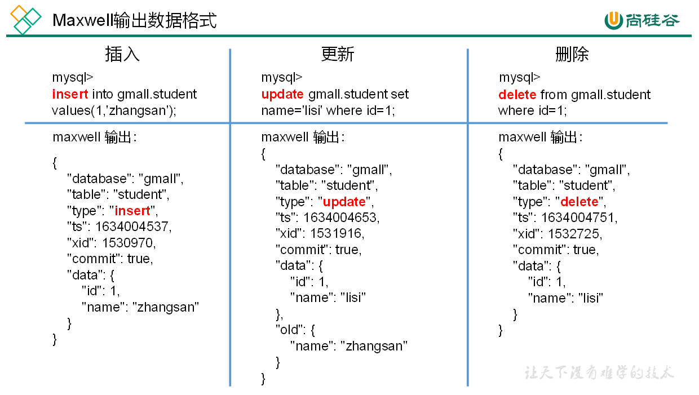

# Script

## myhadooop,sh

```shell
# !/bin/bash

if [ $# -lt 1 ]
then
    echo "No Args Input..."
    exit ;
fi

case $1 in
"start")
    echo " =================== 启动 hadoop 集群 ==================="

    echo " --------------- 启动 hdfs ---------------"
    ssh l9z102 "/opt/module/hadoop-3.1.3/sbin/start-dfs.sh"
    echo " --------------- 启动 yarn ---------------"
    ssh l9z103 "/opt/module/hadoop-3.1.3/sbin/start-yarn.sh"
    echo " --------------- 启动 historyserver ---------------"
    ssh l9z102 "/opt/module/hadoop-3.1.3/bin/mapred --daemon start historyserver"
;;
"stop")
    echo " =================== 关闭 hadoop 集群 ==================="

    echo " --------------- 关闭 historyserver ---------------"
    ssh l9z102 "/opt/module/hadoop-3.1.3/bin/mapred --daemon stop historyserver"
    echo " --------------- 关闭 yarn ---------------"
    ssh l9z103 "/opt/module/hadoop-3.1.3/sbin/stop-yarn.sh"
    echo " --------------- 关闭 hdfs ---------------"
    ssh l9z102 "/opt/module/hadoop-3.1.3/sbin/stop-dfs.sh"
;;
*)
    echo "Input Args Error..."
;;
esac
```

##  myzookeeper.sh

```shell
#!/bin/bash

case $1 in
"start"){
        for i in l9z102 l9z103 l9z104
        do
                echo ---------- zookeeper $i 启动 ------------
                ssh $i "/opt/module/zookeeper-3.5.7/bin/zkServer.sh start"
        done
};;
"stop"){
        for i in l9z102 l9z103 l9z104
        do
                echo ---------- zookeeper $i 停止 ------------
                ssh $i "/opt/module/zookeeper-3.5.7/bin/zkServer.sh stop"
        done
};;
"status"){
        for i in l9z102 l9z103 l9z104
        do
                echo ---------- zookeeper $i 状态 ------------
                ssh $i "/opt/module/zookeeper-3.5.7/bin/zkServer.sh status"
        done
};;
esac
```

## mykafka.sh

```shell
#! /bin/bash

case $1 in
"start"){
        for i in l9z102 l9z103 l9z104
        do
                echo " --------启动 $i Kafka-------"
                ssh $i "/opt/module/kafka-3.0.0/bin/kafka-server-start.sh -daemon /opt/module/kafka-3.0.0/config/server.properties"
        done
};;
        "stop"){
        for i in l9z102 l9z103 l9z104
        do
                echo " --------停止 $i Kafka-------"
                ssh $i "/opt/module/kafka-3.0.0/bin/kafka-server-stop.sh "
        done
};;
esac
```

## mymaxwell.sh

```shell
#!/bin/bash

MAXWELL_HOME=/opt/module/maxwell-1.29.2

status_maxwell(){
    result=`ps -ef | grep com.zendesk.maxwell.Maxwell | grep -v grep | wc -l`
    return $result
}


start_maxwell(){
    status_maxwell
    if [[ $? -lt 1 ]]; then
        echo "成功启动Maxwell"
        $MAXWELL_HOME/bin/maxwell --config $MAXWELL_HOME/config.properties --daemon
    else
        echo "Maxwell正在运行"
    fi
}


stop_maxwell(){
    status_maxwell
    if [[ $? -gt 0 ]]; then
        echo "成功停止Maxwell"
        ps -ef | grep com.zendesk.maxwell.Maxwell | grep -v grep | awk '{print $2}' | xargs kill -9
    else
        echo "Maxwell未在运行"
    fi
}


case $1 in
    start )
        start_maxwell
    ;;
    stop )
        stop_maxwell
    ;;
    restart )
       stop_maxwell
       start_maxwell
    ;;
esac
```

## flume1.sh

> 日志信息监控，传到kafka

```shell
#!/bin/bash

FLUME_HOME=/opt/module/flume-1.9.0

case $1 in
"start"){
        for i in l9z102 l9z103
        do
                echo "-------------$i 上游flume启动-----------------------"
                ssh $i "nohup $FLUME_HOME/bin/flume-ng agent -n a1 -c $FLUME_HOME/conf/ -f $FLUME_HOME/job/dianshang5/file_to_kafka.conf >/dev/null 2>&1 &"
        done
};;
"stop"){
        for i in l9z102 l9z103
        do
                echo "-------------$i 上游flume停止-----------------------"
                ssh $i "ps -ef | grep file_to_kafka | grep -v grep | awk '{print \$2}' | xargs -n1 kill -9"
        done
};;
esac
```

## flume2.sh

> 日志信息，kafka到hdfs

```shell
#!/bin/bash

FLUME_HOME=/opt/module/flume-1.9.0

case $1 in
"start")
        echo " --------启动 l9z104 日志数据flume-------"
        ssh l9z104 "nohup $FLUME_HOME/bin/flume-ng agent -n a1 -c $FLUME_HOME/conf -f $FLUME_HOME/job/dianshang5/kafka_to_hdfs_log.conf >/dev/null 2>&1 &"
;;
"stop")

        echo " --------停止 l9z104 日志数据flume-------"
        ssh l9z104 "ps -ef | grep kafka_to_hdfs_log | grep -v grep |awk '{print \$2}' | xargs -n1 kill"
;;
esac
```

## flume3.sh

> 业务数据的增量同步，kafka - to - hdfs
>
> 上游是maxwell 监控mysql的binlog日志，从mysql - to - kafka

```shell
#!/bin/bash

case $1 in
"start")
        echo " --------启动 l9z104 业务数据flume-------"
        ssh l9z104 "nohup $FLUME_HOME/bin/flume-ng agent -n a1 -c $FLUME_HOME/conf -f $FLUME_HOME/job/dianshang5/kafka_to_hdfs_db.conf >/dev/null 2>&1 &"
;;
"stop")

        echo " --------停止 l9z104 业务数据flume-------"
        ssh l9z104 "ps -ef | grep kafka_to_hdfs_db | grep -v grep |awk '{print \$2}' | xargs -n1 kill"
;;
esac
```

## gen_import_config.py

```python
# ecoding=utf-8
import json
import getopt
import os
import sys
import MySQLdb

#MySQL相关配置，需根据实际情况作出修改
mysql_host = "l9z102"
mysql_port = "3306"
mysql_user = "root"
mysql_passwd = "li123..."

#HDFS NameNode相关配置，需根据实际情况作出修改
hdfs_nn_host = "l9z102"
hdfs_nn_port = "8020"

#生成配置文件的目标路径，可根据实际情况作出修改
output_path = "/opt/module/datax/job/import"


def get_connection():
    return MySQLdb.connect(host=mysql_host, port=int(mysql_port), user=mysql_user, passwd=mysql_passwd)


def get_mysql_meta(database, table):
    connection = get_connection()
    cursor = connection.cursor()
    sql = "SELECT COLUMN_NAME,DATA_TYPE from information_schema.COLUMNS WHERE TABLE_SCHEMA=%s AND TABLE_NAME=%s ORDER BY ORDINAL_POSITION"
    cursor.execute(sql, [database, table])
    fetchall = cursor.fetchall()
    cursor.close()
    connection.close()
    return fetchall


def get_mysql_columns(database, table):
    return map(lambda x: x[0], get_mysql_meta(database, table))


def get_hive_columns(database, table):
    def type_mapping(mysql_type):
def get_connection():
    return MySQLdb.connect(host=mysql_host, port=int(mysql_port), user=mysql_user, passwd=mysql_passwd)


def get_mysql_meta(database, table):
    connection = get_connection()
    cursor = connection.cursor()
    sql = "SELECT COLUMN_NAME,DATA_TYPE from information_schema.COLUMNS WHERE TABLE_SCHEMA=%s AND TABLE_NAME=%s ORDER BY ORDINAL_POSITION"
    cursor.execute(sql, [database, table])
    fetchall = cursor.fetchall()
    cursor.close()
    connection.close()
    return fetchall


def get_mysql_columns(database, table):
    return map(lambda x: x[0], get_mysql_meta(database, table))


def get_hive_columns(database, table):
    def type_mapping(mysql_type):
        mappings = {
            "bigint": "bigint",
            "int": "bigint",
            "smallint": "bigint",
            "tinyint": "bigint",
            "decimal": "string",
            "double": "double",
            "float": "float",
            "binary": "string",
            "char": "string",
            "varchar": "string",
            "datetime": "string",
            "time": "string",
            "timestamp": "string",
            "date": "string",
            "text": "string"
        }
        return mappings[mysql_type]

    meta = get_mysql_meta(database, table)
    return map(lambda x: {"name": x[0], "type": type_mapping(x[1].lower())}, meta)


def generate_json(source_database, source_table):
    job = {
        "job": {
            "setting": {
                "speed": {
                    "channel": 3
                },
                "errorLimit": {
                    "record": 0,
                    "percentage": 0.02
                }
            },
            "content": [{
                "reader": {
                    "name": "mysqlreader",
                    "parameter": {
                        "username": mysql_user,
                        "password": mysql_passwd,
                        "column": get_mysql_columns(source_database, source_table),
                        "splitPk": "",
                        "connection": [{
                            "table": [source_table],
                            "jdbcUrl": ["jdbc:mysql://" + mysql_host + ":" + mysql_port + "/" + source_database]
                        }]
                    }
                },
                "writer": {
                    "name": "hdfswriter",
                    "parameter": {
                        "defaultFS": "hdfs://" + hdfs_nn_host + ":" + hdfs_nn_port,
                        "fileType": "text",
                        "path": "${targetdir}",
                        "fileName": source_table,
                        "column": get_hive_columns(source_database, source_table),
                        "writeMode": "append",
                        "fieldDelimiter": "\t",
                        "compress": "gzip"
                    }
                }
            }]
        }
    }
    if not os.path.exists(output_path):
        os.makedirs(output_path)
    with open(os.path.join(output_path, ".".join([source_database, source_table, "json"])), "w") as f:
        json.dump(job, f)


def main(args):
    source_database = ""
    source_table = ""

    options, arguments = getopt.getopt(args, '-d:-t:', ['sourcedb=', 'sourcetbl='])
    for opt_name, opt_value in options:
        if opt_name in ('-d', '--sourcedb'):
            source_database = opt_value
        if opt_name in ('-t', '--sourcetbl'):
            source_table = opt_value

    generate_json(source_database, source_table)


if __name__ == '__main__':
    main(sys.argv[1:])
```

## gen_import_config.sh

```shell
#!/bin/bash

python ~/bin/gen_import_config.py -d gmall -t activity_info
python ~/bin/gen_import_config.py -d gmall -t activity_rule
python ~/bin/gen_import_config.py -d gmall -t base_category1
python ~/bin/gen_import_config.py -d gmall -t base_category2
python ~/bin/gen_import_config.py -d gmall -t base_category3
python ~/bin/gen_import_config.py -d gmall -t base_dic
python ~/bin/gen_import_config.py -d gmall -t base_province
python ~/bin/gen_import_config.py -d gmall -t base_region
python ~/bin/gen_import_config.py -d gmall -t base_trademark
python ~/bin/gen_import_config.py -d gmall -t cart_info
python ~/bin/gen_import_config.py -d gmall -t coupon_info
python ~/bin/gen_import_config.py -d gmall -t sku_attr_value
python ~/bin/gen_import_config.py -d gmall -t sku_info
python ~/bin/gen_import_config.py -d gmall -t sku_sale_attr_value
python ~/bin/gen_import_config.py -d gmall -t spu_info
```

## mysql_to_hdfs_full.sh

> 利用datax，将mysql中的数据全量传到HDFS

```shell
#!/bin/bash

DATAX_HOME=/opt/module/datax

# 如果传入日期则do_date等于传入的日期，否则等于前一天日期
if [ -n "$2" ] ;then
    do_date=$2
else
    do_date=`date -d "-1 day" +%F`
fi

#处理目标路径，此处的处理逻辑是，如果目标路径不存在，则创建；若存在，则清空，目的是保证同步任务可重复执行
handle_targetdir() {
  hadoop fs -test -e $1
  if [[ $? -eq 1 ]]; then
    echo "路径$1不存在，正在创建......"
    hadoop fs -mkdir -p $1
  else
    echo "路径$1已经存在"
    fs_count=$(hadoop fs -count $1)
    content_size=$(echo $fs_count | awk '{print $3}')
    if [[ $content_size -eq 0 ]]; then
      echo "路径$1为空"
    else
      echo "路径$1不为空，正在清空......"
      hadoop fs -rm -r -f $1/*
    fi
  fi
}

#数据同步
import_data() {
  datax_config=$1
  target_dir=$2

  handle_targetdir $target_dir
  python $DATAX_HOME/bin/datax.py -p"-Dtargetdir=$target_dir" $datax_config
}

case $1 in
"activity_info")
  import_data /opt/module/datax/job/import/gmall.activity_info.json /origin_data/gmall/db/activity_info_full/$do_date
  ;;
"activity_rule")
  import_data /opt/module/datax/job/import/gmall.activity_rule.json /origin_data/gmall/db/activity_rule_full/$do_date
  ;;
"base_category1")
  import_data /opt/module/datax/job/import/gmall.base_category1.json /origin_data/gmall/db/base_category1_full/$do_date
  ;;
"base_category2")
  import_data /opt/module/datax/job/import/gmall.base_category2.json /origin_data/gmall/db/base_category2_full/$do_date
  ;;
"base_category3")
  import_data /opt/module/datax/job/import/gmall.base_category3.json /origin_data/gmall/db/base_category3_full/$do_date
  ;;
"base_dic")
  import_data /opt/module/datax/job/import/gmall.base_dic.json /origin_data/gmall/db/base_dic_full/$do_date
  ;;
"base_province")
  import_data /opt/module/datax/job/import/gmall.base_province.json /origin_data/gmall/db/base_province_full/$do_date
  ;;
"base_region")
  import_data /opt/module/datax/job/import/gmall.base_region.json /origin_data/gmall/db/base_region_full/$do_date
  ;;
"base_trademark")
  import_data /opt/module/datax/job/import/gmall.base_trademark.json /origin_data/gmall/db/base_trademark_full/$do_date
  ;;
"cart_info")
  import_data /opt/module/datax/job/import/gmall.cart_info.json /origin_data/gmall/db/cart_info_full/$do_date
  ;;
"coupon_info")
  import_data /opt/module/datax/job/import/gmall.coupon_info.json /origin_data/gmall/db/coupon_info_full/$do_date
  ;;
"sku_attr_value")
  import_data /opt/module/datax/job/import/gmall.sku_attr_value.json /origin_data/gmall/db/sku_attr_value_full/$do_date
  ;;
"sku_info")
  import_data /opt/module/datax/job/import/gmall.sku_info.json /origin_data/gmall/db/sku_info_full/$do_date
  ;;
"sku_sale_attr_value")
  import_data /opt/module/datax/job/import/gmall.sku_sale_attr_value.json /origin_data/gmall/db/sku_sale_attr_value_full/$do_date
  ;;
"spu_info")
  import_data /opt/module/datax/job/import/gmall.spu_info.json /origin_data/gmall/db/spu_info_full/$do_date
  ;;
"all")
  import_data /opt/module/datax/job/import/gmall.activity_info.json /origin_data/gmall/db/activity_info_full/$do_date
  import_data /opt/module/datax/job/import/gmall.activity_rule.json /origin_data/gmall/db/activity_rule_full/$do_date
  import_data /opt/module/datax/job/import/gmall.base_category1.json /origin_data/gmall/db/base_category1_full/$do_date
  import_data /opt/module/datax/job/import/gmall.base_category2.json /origin_data/gmall/db/base_category2_full/$do_date
  import_data /opt/module/datax/job/import/gmall.base_category3.json /origin_data/gmall/db/base_category3_full/$do_date
  import_data /opt/module/datax/job/import/gmall.base_dic.json /origin_data/gmall/db/base_dic_full/$do_date
  import_data /opt/module/datax/job/import/gmall.base_province.json /origin_data/gmall/db/base_province_full/$do_date
  import_data /opt/module/datax/job/import/gmall.base_region.json /origin_data/gmall/db/base_region_full/$do_date
  import_data /opt/module/datax/job/import/gmall.base_trademark.json /origin_data/gmall/db/base_trademark_full/$do_date
  import_data /opt/module/datax/job/import/gmall.cart_info.json /origin_data/gmall/db/cart_info_full/$do_date
  import_data /opt/module/datax/job/import/gmall.coupon_info.json /origin_data/gmall/db/coupon_info_full/$do_date
  import_data /opt/module/datax/job/import/gmall.sku_attr_value.json /origin_data/gmall/db/sku_attr_value_full/$do_date
  import_data /opt/module/datax/job/import/gmall.sku_info.json /origin_data/gmall/db/sku_info_full/$do_date
  import_data /opt/module/datax/job/import/gmall.sku_sale_attr_value.json /origin_data/gmall/db/sku_sale_attr_value_full/$do_date
  import_data /opt/module/datax/job/import/gmall.spu_info.json /origin_data/gmall/db/spu_info_full/$do_date
  ;;
esac
```

## mysql_to_hdfs_full_init.sh

> 增量同步之前，第一次利用maxwell-bootstrap全量同步到HDFS

```shell
#!/bin/bash

# 该脚本的作用是初始化所有的增量表，只需执行一次

MAXWELL_HOME=/opt/module/maxwell-1.29.2

import_data() {
    $MAXWELL_HOME/bin/maxwell-bootstrap --database gmall --table $1 --config $MAXWELL_HOME/config.properties
}

case $1 in
"cart_info")
  import_data cart_info
  ;;
"comment_info")
  import_data comment_info
  ;;
"coupon_use")
  import_data coupon_use
  ;;
"favor_info")
  import_data favor_info
  ;;
"order_detail")
  import_data order_detail
  ;;
"order_detail_activity")
  import_data order_detail_activity
  ;;
"order_detail_coupon")
  import_data order_detail_coupon
  ;;
"order_info")
  import_data order_info
  ;;
"order_refund_info")
  import_data order_refund_info
  ;;
"order_status_log")
  import_data order_status_log
  ;;
"payment_info")
  import_data payment_info
  ;;
"refund_payment")
  import_data refund_payment
  ;;
"user_info")
  import_data user_info
  ;;
"all")
  import_data cart_info
  import_data comment_info
  import_data coupon_use
  import_data favor_info
  import_data order_detail
  import_data order_detail_activity
  import_data order_detail_coupon
  import_data order_info
  import_data order_refund_info
  import_data order_status_log
  import_data payment_info
  import_data refund_payment
  import_data user_info
  ;;
esac
```


## ods_to_dim_init.sh

> 首日装载数据脚本
>
> 参数：表名，日期
>
> 日期不是可选的，首日日期
>
> `ods_to_dim_init.sh all 2020-06-14`

```shell
#!/bin/bash

APP=gmall

if [ -n "$2" ] ;then
   do_date=$2
else 
   echo "请传入日期参数"
   exit
fi 

dim_user_zip="
insert overwrite table ${APP}.dim_user_zip partition (dt='9999-12-31')
select
    data.id,
    data.login_name,
    data.nick_name,
    md5(data.name),
    md5(data.phone_num),
    md5(data.email),
    data.user_level,
    data.birthday,
    data.gender,
    data.create_time,
    data.operate_time,
    '$do_date' start_date,
    '9999-12-31' end_date
from ${APP}.ods_user_info_inc
where dt='$do_date'
and type='bootstrap-insert';
"

dim_sku_full="
with
sku as
(
    select
        id,
        price,
        sku_name,
        sku_desc,
        weight,
        is_sale,
        spu_id,
        category3_id,
        tm_id,
        create_time
    from ${APP}.ods_sku_info_full
    where dt='$do_date'
),
spu as
(
    select
        id,
        spu_name
    from ${APP}.ods_spu_info_full
    where dt='$do_date'
),
c3 as
(
    select
        id,
        name,
        category2_id
    from ${APP}.ods_base_category3_full
    where dt='$do_date'
),
c2 as
(
    select
        id,
        name,
        category1_id
    from ${APP}.ods_base_category2_full
    where dt='$do_date'
),
c1 as
(
    select
        id,
        name
    from ${APP}.ods_base_category1_full
    where dt='$do_date'
),
tm as
(
    select
        id,
        tm_name
    from ${APP}.ods_base_trademark_full
    where dt='$do_date'
),
attr as
(
    select
        sku_id,
        collect_set(named_struct('attr_id',attr_id,'value_id',value_id,'attr_name',attr_name,'value_name',value_name)) attrs
    from ${APP}.ods_sku_attr_value_full
    where dt='$do_date'
    group by sku_id
),
sale_attr as
(
    select
        sku_id,
        collect_set(named_struct('sale_attr_id',sale_attr_id,'sale_attr_value_id',sale_attr_value_id,'sale_attr_name',sale_attr_name,'sale_attr_value_name',sale_attr_value_name)) sale_attrs
    from ${APP}.ods_sku_sale_attr_value_full
    where dt='$do_date'
    group by sku_id
)
insert overwrite table ${APP}.dim_sku_full partition(dt='$do_date')
select
    sku.id,
    sku.price,
    sku.sku_name,
    sku.sku_desc,
    sku.weight,
    sku.is_sale,
    sku.spu_id,
    spu.spu_name,
    sku.category3_id,
    c3.name,
    c3.category2_id,
    c2.name,
    c2.category1_id,
    c1.name,
    sku.tm_id,
    tm.tm_name,
    attr.attrs,
    sale_attr.sale_attrs,
    sku.create_time
from sku
left join spu on sku.spu_id=spu.id
left join c3 on sku.category3_id=c3.id
left join c2 on c3.category2_id=c2.id
left join c1 on c2.category1_id=c1.id
left join tm on sku.tm_id=tm.id
left join attr on sku.id=attr.sku_id
left join sale_attr on sku.id=sale_attr.sku_id;
"

dim_province_full="
insert overwrite table ${APP}.dim_province_full partition(dt='$do_date')
select
    province.id,
    province.name,
    province.area_code,
    province.iso_code,
    province.iso_3166_2,
    region_id,
    region_name
from
(
    select
        id,
        name,
        region_id,
        area_code,
        iso_code,
        iso_3166_2
    from ${APP}.ods_base_province_full
    where dt='$do_date'
)province
left join
(
    select
        id,
        region_name
    from ${APP}.ods_base_region_full
    where dt='$do_date'
)region
on province.region_id=region.id;
"

dim_coupon_full="
insert overwrite table ${APP}.dim_coupon_full partition(dt='$do_date')
select
    id,
    coupon_name,
    coupon_type,
    coupon_dic.dic_name,
    condition_amount,
    condition_num,
    activity_id,
    benefit_amount,
    benefit_discount,
    case coupon_type
        when '3201' then concat('满',condition_amount,'元减',benefit_amount,'元')
        when '3202' then concat('满',condition_num,'件打',10*(1-benefit_discount),'折')
        when '3203' then concat('减',benefit_amount,'元')
    end benefit_rule,
    create_time,
    range_type,
    range_dic.dic_name,
    limit_num,
    taken_count,
    start_time,
    end_time,
    operate_time,
    expire_time
from
(
    select
        id,
        coupon_name,
        coupon_type,
        condition_amount,
        condition_num,
        activity_id,
        benefit_amount,
        benefit_discount,
        create_time,
        range_type,
        limit_num,
        taken_count,
        start_time,
        end_time,
        operate_time,
        expire_time
    from ${APP}.ods_coupon_info_full
    where dt='$do_date'
)ci
left join
(
    select
        dic_code,
        dic_name
    from ${APP}.ods_base_dic_full
    where dt='$do_date'
    and parent_code='32'
)coupon_dic
on ci.coupon_type=coupon_dic.dic_code
left join
(
    select
        dic_code,
        dic_name
    from ${APP}.ods_base_dic_full
    where dt='$do_date'
    and parent_code='33'
)range_dic
on ci.range_type=range_dic.dic_code;
"

dim_activity_full="
insert overwrite table ${APP}.dim_activity_full partition(dt='$do_date')
select
    rule.id,
    info.id,
    activity_name,
    rule.activity_type,
    dic.dic_name,
    activity_desc,
    start_time,
    end_time,
    create_time,
    condition_amount,
    condition_num,
    benefit_amount,
    benefit_discount,
    case rule.activity_type
        when '3101' then concat('满',condition_amount,'元减',benefit_amount,'元')
        when '3102' then concat('满',condition_num,'件打',10*(1-benefit_discount),'折')
        when '3103' then concat('打',10*(1-benefit_discount),'折')
    end benefit_rule,
    benefit_level
from
(
    select
        id,
        activity_id,
        activity_type,
        condition_amount,
        condition_num,
        benefit_amount,
        benefit_discount,
        benefit_level
    from ${APP}.ods_activity_rule_full
    where dt='$do_date'
)rule
left join
(
    select
        id,
        activity_name,
        activity_type,
        activity_desc,
        start_time,
        end_time,
        create_time
    from ${APP}.ods_activity_info_full
    where dt='$do_date'
)info
on rule.activity_id=info.id
left join
(
    select
        dic_code,
        dic_name
    from ${APP}.ods_base_dic_full
    where dt='$do_date'
    and parent_code='31'
)dic
on rule.activity_type=dic.dic_code;
"

case $1 in
"dim_user_zip")
    hive -e "$dim_user_zip"
;;
"dim_sku_full")
    hive -e "$dim_sku_full"
;;
"dim_province_full")
    hive -e "$dim_province_full"
;;
"dim_coupon_full")
    hive -e "$dim_coupon_full"
;;
"dim_activity_full")
    hive -e "$dim_activity_full"
;;
"all")
    hive -e "$dim_user_zip$dim_sku_full$dim_province_full$dim_coupon_full$dim_activity_full"
;;
esac

```


## ods_to_dim.sh 

> 每日装载数据脚本
>
> 参数：表名，日期
>
> 日期可选，没传计算前一天
>
> ods_to_dim.sh 

```shell
#!/bin/bash

APP=gmall

# 如果是输入的日期按照取输入日期；如果没输入日期取当前时间的前一天
if [ -n "$2" ] ;then
    do_date=$2
else 
    do_date=`date -d "-1 day" +%F`
fi

dim_user_zip="
set hive.exec.dynamic.partition.mode=nonstrict;
with
tmp as
(
    select
        old.id old_id,
        old.login_name old_login_name,
        old.nick_name old_nick_name,
        old.name old_name,
        old.phone_num old_phone_num,
        old.email old_email,
        old.user_level old_user_level,
        old.birthday old_birthday,
        old.gender old_gender,
        old.create_time old_create_time,
        old.operate_time old_operate_time,
        old.start_date old_start_date,
        old.end_date old_end_date,
        new.id new_id,
        new.login_name new_login_name,
        new.nick_name new_nick_name,
        new.name new_name,
        new.phone_num new_phone_num,
        new.email new_email,
        new.user_level new_user_level,
        new.birthday new_birthday,
        new.gender new_gender,
        new.create_time new_create_time,
        new.operate_time new_operate_time,
        new.start_date new_start_date,
        new.end_date new_end_date
    from
    (
        select
            id,
            login_name,
            nick_name,
            name,
            phone_num,
            email,
            user_level,
            birthday,
            gender,
            create_time,
            operate_time,
            start_date,
            end_date
        from ${APP}.dim_user_zip
        where dt='9999-12-31'
    )old
    full outer join
    (
        select
            id,
            login_name,
            nick_name,
            md5(name) name,
            md5(phone_num) phone_num,
            md5(email) email,
            user_level,
            birthday,
            gender,
            create_time,
            operate_time,
            '$do_date' start_date,
            '9999-12-31' end_date
        from
        (
            select
                data.id,
                data.login_name,
                data.nick_name,
                data.name,
                data.phone_num,
                data.email,
                data.user_level,
                data.birthday,
                data.gender,
                data.create_time,
                data.operate_time,
                row_number() over (partition by data.id order by ts desc) rn
            from ${APP}.ods_user_info_inc
            where dt='$do_date'
        )t1
        where rn=1
    )new
    on old.id=new.id
)
insert overwrite table ${APP}.dim_user_zip partition(dt)
select
    if(new_id is not null,new_id,old_id),
    if(new_id is not null,new_login_name,old_login_name),
    if(new_id is not null,new_nick_name,old_nick_name),
    if(new_id is not null,new_name,old_name),
    if(new_id is not null,new_phone_num,old_phone_num),
    if(new_id is not null,new_email,old_email),
    if(new_id is not null,new_user_level,old_user_level),
    if(new_id is not null,new_birthday,old_birthday),
    if(new_id is not null,new_gender,old_gender),
    if(new_id is not null,new_create_time,old_create_time),
    if(new_id is not null,new_operate_time,old_operate_time),
    if(new_id is not null,new_start_date,old_start_date),
    if(new_id is not null,new_end_date,old_end_date),
    if(new_id is not null,new_end_date,old_end_date) dt
from tmp
union all
select
    old_id,
    old_login_name,
    old_nick_name,
    old_name,
    old_phone_num,
    old_email,
    old_user_level,
    old_birthday,
    old_gender,
    old_create_time,
    old_operate_time,
    old_start_date,
    cast(date_add('$do_date',-1) as string) old_end_date,
    cast(date_add('$do_date',-1) as string) dt
from tmp
where old_id is not null
and new_id is not null;
"

dim_sku_full="
with
sku as
(
    select
        id,
        price,
        sku_name,
        sku_desc,
        weight,
        is_sale,
        spu_id,
        category3_id,
        tm_id,
        create_time
    from ${APP}.ods_sku_info_full
    where dt='$do_date'
),
spu as
(
    select
        id,
        spu_name
    from ${APP}.ods_spu_info_full
    where dt='$do_date'
),
c3 as
(
    select
        id,
        name,
        category2_id
    from ${APP}.ods_base_category3_full
    where dt='$do_date'
),
c2 as
(
    select
        id,
        name,
        category1_id
    from ${APP}.ods_base_category2_full
    where dt='$do_date'
),
c1 as
(
    select
        id,
        name
    from ${APP}.ods_base_category1_full
    where dt='$do_date'
),
tm as
(
    select
        id,
        tm_name
    from ${APP}.ods_base_trademark_full
    where dt='$do_date'
),
attr as
(
    select
        sku_id,
        collect_set(named_struct('attr_id',attr_id,'value_id',value_id,'attr_name',attr_name,'value_name',value_name)) attrs
    from ${APP}.ods_sku_attr_value_full
    where dt='$do_date'
    group by sku_id
),
sale_attr as
(
    select
        sku_id,
        collect_set(named_struct('sale_attr_id',sale_attr_id,'sale_attr_value_id',sale_attr_value_id,'sale_attr_name',sale_attr_name,'sale_attr_value_name',sale_attr_value_name)) sale_attrs
    from ${APP}.ods_sku_sale_attr_value_full
    where dt='$do_date'
    group by sku_id
)
insert overwrite table ${APP}.dim_sku_full partition(dt='$do_date')
select
    sku.id,
    sku.price,
    sku.sku_name,
    sku.sku_desc,
    sku.weight,
    sku.is_sale,
    sku.spu_id,
    spu.spu_name,
    sku.category3_id,
    c3.name,
    c3.category2_id,
    c2.name,
    c2.category1_id,
    c1.name,
    sku.tm_id,
    tm.tm_name,
    attr.attrs,
    sale_attr.sale_attrs,
    sku.create_time
from sku
left join spu on sku.spu_id=spu.id
left join c3 on sku.category3_id=c3.id
left join c2 on c3.category2_id=c2.id
left join c1 on c2.category1_id=c1.id
left join tm on sku.tm_id=tm.id
left join attr on sku.id=attr.sku_id
left join sale_attr on sku.id=sale_attr.sku_id;
"

dim_province_full="
insert overwrite table ${APP}.dim_province_full partition(dt='$do_date')
select
    province.id,
    province.name,
    province.area_code,
    province.iso_code,
    province.iso_3166_2,
    region_id,
    region_name
from
(
    select
        id,
        name,
        region_id,
        area_code,
        iso_code,
        iso_3166_2
    from ${APP}.ods_base_province_full
    where dt='$do_date'
)province
left join
(
    select
        id,
        region_name
    from ${APP}.ods_base_region_full
    where dt='$do_date'
)region
on province.region_id=region.id;
"

dim_coupon_full="
insert overwrite table ${APP}.dim_coupon_full partition(dt='$do_date')
select
    id,
    coupon_name,
    coupon_type,
    coupon_dic.dic_name,
    condition_amount,
    condition_num,
    activity_id,
    benefit_amount,
    benefit_discount,
    case coupon_type
        when '3201' then concat('满',condition_amount,'元减',benefit_amount,'元')
        when '3202' then concat('满',condition_num,'件打',10*(1-benefit_discount),'折')
        when '3203' then concat('减',benefit_amount,'元')
    end benefit_rule,
    create_time,
    range_type,
    range_dic.dic_name,
    limit_num,
    taken_count,
    start_time,
    end_time,
    operate_time,
    expire_time
from
(
    select
        id,
        coupon_name,
        coupon_type,
        condition_amount,
        condition_num,
        activity_id,
        benefit_amount,
        benefit_discount,
        create_time,
        range_type,
        limit_num,
        taken_count,
        start_time,
        end_time,
        operate_time,
        expire_time
    from ${APP}.ods_coupon_info_full
    where dt='$do_date'
)ci
left join
(
    select
        dic_code,
        dic_name
    from ${APP}.ods_base_dic_full
    where dt='$do_date'
    and parent_code='32'
)coupon_dic
on ci.coupon_type=coupon_dic.dic_code
left join
(
    select
        dic_code,
        dic_name
    from ${APP}.ods_base_dic_full
    where dt='$do_date'
    and parent_code='33'
)range_dic
on ci.range_type=range_dic.dic_code;
"

dim_activity_full="
insert overwrite table ${APP}.dim_activity_full partition(dt='$do_date')
select
    rule.id,
    info.id,
    activity_name,
    rule.activity_type,
    dic.dic_name,
    activity_desc,
    start_time,
    end_time,
    create_time,
    condition_amount,
    condition_num,
    benefit_amount,
    benefit_discount,
    case rule.activity_type
        when '3101' then concat('满',condition_amount,'元减',benefit_amount,'元')
        when '3102' then concat('满',condition_num,'件打',10*(1-benefit_discount),'折')
        when '3103' then concat('打',10*(1-benefit_discount),'折')
    end benefit_rule,
    benefit_level
from
(
    select
        id,
        activity_id,
        activity_type,
        condition_amount,
        condition_num,
        benefit_amount,
        benefit_discount,
        benefit_level
    from ${APP}.ods_activity_rule_full
    where dt='$do_date'
)rule
left join
(
    select
        id,
        activity_name,
        activity_type,
        activity_desc,
        start_time,
        end_time,
        create_time
    from ${APP}.ods_activity_info_full
    where dt='$do_date'
)info
on rule.activity_id=info.id
left join
(
    select
        dic_code,
        dic_name
    from ${APP}.ods_base_dic_full
    where dt='$do_date'
    and parent_code='31'
)dic
on rule.activity_type=dic.dic_code;
"

case $1 in
"dim_user_zip")
    hive -e "$dim_user_zip"
;;
"dim_sku_full")
    hive -e "$dim_sku_full"
;;
"dim_province_full")
    hive -e "$dim_province_full"
;;
"dim_coupon_full")
    hive -e "$dim_coupon_full"
;;
"dim_activity_full")
    hive -e "$dim_activity_full"
;;
"all")
    hive -e "$dim_user_zip$dim_sku_full$dim_province_full$dim_coupon_full$dim_activity_full"
;;
esac

```


# Maxwell

> Maxwell 是一个**能实时读取 MySQL 二进制日志 binlog**，并生成 JSON 格式的消息，作为生产者发送给 Kafka、 Kinesis、 RabbitMQ、 Redis、 Google CloudPub/Sub、文件或其它平台的应用程序。
>
> 
>
> - maxwell 有两种方式启动
>
>   - 命令行
>
>     ```shell
>     # 输出到控制台
>     bin/maxwell --user='maxwell' --password='123456' --host='hadoop102' --producer=stdout
>     
>     # 输出到kafka
>     bin/maxwell --user='maxwell' --password='123456' --host='hadoop102' --producer=kafka --kafka.bootstrap.servers=hadoop102:9092 --kafka_topic=maxwell
>     ```
>
>   - 以配置文件启动
>
>     `bin/maxwell --config config.properties`
>
> - 输出的是mysql的binlog对应的json文件

## config.properties

> 业务数据，每日增量mysql - kafka
>
> 首日全量
>
> 同步的是`mysql的binlog对应的json文件`

```shell
# tl;dr config
log_level=info

# stdout 输出到控制台
producer=kafka
kafka.bootstrap.servers=l9z102:9092

# mysql login info
host=l9z102
user=maxwell
password=li123...
# 暂时不知道什么作用
jdbc_options=useSSL=false&serverTimezone=Asia/Shanghai

mock_date=

#     *** general ***
# choose where to produce data to. stdout|file|kafka|kinesis|pubsub|sqs|rabbitmq|redis
#producer=kafka

# set the log level.  note that you can configure things further in log4j2.xml
#log_level=DEBUG # [DEBUG, INFO, WARN, ERROR]

# if set, maxwell will look up the scoped environment variables, strip off the prefix and inject the configs
#env_config_prefix=MAXWELL_

#     *** mysql ***

# mysql host to connect to
#host=hostname

# mysql port to connect to
#port=3306

# mysql user to connect as.  This user must have REPLICATION SLAVE permissions,
# as well as full access to the `maxwell` (or schema_database) database
#user=maxwell

# mysql password
#password=maxwell

# options to pass into the jdbc connection, given as opt=val&opt2=val2
#jdbc_options=opt1=100&opt2=hello

# name of the mysql database where maxwell keeps its own state
#schema_database=maxwell

# whether to use GTID or not for positioning
#gtid_mode=true

# maxwell will capture an initial "base" schema containing all table and column information,
# and then keep delta-updates on top of that schema.  If you have an inordinate amount of DDL changes,
# the table containing delta changes will grow unbounded (and possibly too large) over time.  If you
# enable this option Maxwell will periodically compact its tables.
#max_schemas=10000

# SSL/TLS options
# To use VERIFY_CA or VERIFY_IDENTITY, you must set the trust store with Java opts:
#   -Djavax.net.ssl.trustStore=<truststore> -Djavax.net.ssl.trustStorePassword=<password>
# or import the MySQL cert into the global Java cacerts.
# MODE must be one of DISABLED, PREFERRED, REQUIRED, VERIFY_CA, or VERIFY_IDENTITY
#
# turns on ssl for the maxwell-store connection, other connections inherit this setting unless specified
#ssl=DISABLED
# for binlog-connector
#replication_ssl=DISABLED
# for the schema-capture connection, if used
#schema_ssl=DISABLED

# maxwell can optionally replicate from a different server than where it stores
# schema and binlog position info.  Specify that different server here:

#replication_host=other
#replication_user=username
#replication_password=password
#replication_port=3306

# This may be useful when using MaxScale's binlog mirroring host.
# Specifies that Maxwell should capture schema from a different server than
# it replicates from:

#schema_host=other
#schema_user=username
#schema_password=password
#schema_port=3306


#       *** output format ***

# records include binlog position (default false)
#output_binlog_position=true

# records include a gtid string (default false)
#output_gtid_position=true

# records include fields with null values (default true).  If this is false,
# fields where the value is null will be omitted entirely from output.
#output_nulls=true

# records include server_id (default false)
#output_server_id=true

# records include thread_id (default false)
#output_thread_id=true

# records include schema_id (default false)
#output_schema_id=true

# records include row query, binlog option "binlog_rows_query_log_events" must be enabled" (default false)
#output_row_query=true

# DML records include list of values that make up a row's primary key (default false)
#output_primary_keys=true

# DML records include list of columns that make up a row's primary key (default false)
#output_primary_key_columns=true

# records include commit and xid (default true)
#output_commit_info=true

# This controls whether maxwell will output JSON information containing
# DDL (ALTER/CREATE TABLE/ETC) infromation. (default: false)
# See also: ddl_kafka_topic
#output_ddl=true

# turns underscore naming style of fields to camel case style in JSON output
# default is none, which means the field name in JSON is the exact name in MySQL table
#output_naming_strategy=underscore_to_camelcase

#       *** kafka ***

# list of kafka brokers
#kafka.bootstrap.servers=hosta:9092,hostb:9092

# kafka topic to write to
# this can be static, e.g. 'maxwell', or dynamic, e.g. namespace_%{database}_%{table}
# in the latter case 'database' and 'table' will be replaced with the values for the row being processed
#kafka_topic=maxwell
#kafka_topic=maxwell3
# 动态生成topic
# kafka_topic=%{database}_%{table}
kafka_topic=topic_db

# alternative kafka topic to write DDL (alter/create/drop) to.  Defaults to kafka_topic
#ddl_kafka_topic=maxwell_ddl

# hash function to use.  "default" is just the JVM's 'hashCode' function.
#kafka_partition_hash=default # [default, murmur3]

# how maxwell writes its kafka key.
#
# 'hash' looks like:
# {"database":"test","table":"tickets","pk.id":10001}
#
# 'array' looks like:
# ["test","tickets",[{"id":10001}]]
#
# default: "hash"
#kafka_key_format=hash # [hash, array]

# extra kafka options.  Anything prefixed "kafka." will get
# passed directly into the kafka-producer's config.

# a few defaults.
# These are 0.11-specific. They may or may not work with other versions.
kafka.compression.type=snappy
kafka.retries=0
kafka.acks=1
#kafka.batch.size=16384


# kafka+SSL example
# kafka.security.protocol=SSL
# kafka.ssl.truststore.location=/var/private/ssl/kafka.client.truststore.jks
# kafka.ssl.truststore.password=test1234
# kafka.ssl.keystore.location=/var/private/ssl/kafka.client.keystore.jks
# kafka.ssl.keystore.password=test1234
# kafka.ssl.key.password=test1234#

# controls a heuristic check that maxwell may use to detect messages that
# we never heard back from.  The heuristic check looks for "stuck" messages, and
# will timeout maxwell after this many milliseconds.
#
# See https://github.com/zendesk/maxwell/blob/master/src/main/java/com/zendesk/maxwell/producer/InflightMessageList.java
# if you really want to get into it.
#producer_ack_timeout=120000 # default 0


#           *** partitioning ***

# What part of the data do we partition by?
# 选择按照什么分区，                 库，      表，   主键，  
#producer_partition_by=database # [database, table, primary_key, transaction_id, thread_id, column]
producer_partition_by=database

# specify what fields to partition by when using producer_partition_by=column
# column separated list.
#producer_partition_columns=id,foo,bar

# when using producer_partition_by=column, partition by this when
# the specified column(s) don't exist.
#producer_partition_by_fallback=database

#            *** kinesis ***

#kinesis_stream=maxwell

# AWS places a 256 unicode character limit on the max key length of a record
# http://docs.aws.amazon.com/kinesis/latest/APIReference/API_PutRecord.html
#
# Setting this option to true enables hashing the key with the md5 algorithm
# before we send it to kinesis so all the keys work within the key size limit.
# Values: true, false
# Default: false
#kinesis_md5_keys=true

#            *** sqs ***

#sqs_queue_uri=aws_sqs_queue_uri

# The sqs producer will need aws credentials configured in the default
# root folder and file format. Please check below link on how to do it.
# http://docs.aws.amazon.com/sdk-for-java/v1/developer-guide/setup-credentials.html

#            *** pub/sub ***

#pubsub_project_id=maxwell
#pubsub_topic=maxwell
#ddl_pubsub_topic=maxwell_ddl

#            *** rabbit-mq ***

#rabbitmq_host=rabbitmq_hostname
#rabbitmq_port=5672
#rabbitmq_user=guest
#rabbitmq_pass=guest
#rabbitmq_virtual_host=/
#rabbitmq_exchange=maxwell
#rabbitmq_exchange_type=fanout
#rabbitmq_exchange_durable=false
#rabbitmq_exchange_autodelete=false
#rabbitmq_routing_key_template=%db%.%table%
#rabbitmq_message_persistent=false
#rabbitmq_declare_exchange=true

#           *** redis ***

#redis_host=redis_host
#redis_port=6379
#redis_auth=redis_auth
#redis_database=0

# name of pubsub/list/whatever key to publish to
#redis_key=maxwell

# this can be static, e.g. 'maxwell', or dynamic, e.g. namespace_%{database}_%{table}
#redis_pub_channel=maxwell
# this can be static, e.g. 'maxwell', or dynamic, e.g. namespace_%{database}_%{table}
#redis_list_key=maxwell
# this can be static, e.g. 'maxwell', or dynamic, e.g. namespace_%{database}_%{table}
# Valid values for redis_type = pubsub|lpush. Defaults to pubsub

#redis_type=pubsub

#           *** custom producer ***

# the fully qualified class name for custom ProducerFactory
# see the following link for more details.
# http://maxwells-daemon.io/producers/#custom-producer
#custom_producer.factory=

# custom producer properties can be configured using the custom_producer.* property namespace
#custom_producer.custom_prop=foo

#          *** filtering ***

# filter rows out of Maxwell's output.  Command separated list of filter-rules, evaluated in sequence.
# A filter rule is:
#  <type> ":" <db> "." <tbl> [ "." <col> "=" <col_val> ]
#  type    ::= [ "include" | "exclude" | "blacklist" ]
#  db      ::= [ "/regexp/" | "string" | "`string`" | "*" ]
#  tbl     ::= [ "/regexp/" | "string" | "`string`" | "*" ]
#  col_val ::= "column_name"
#  tbl     ::= [ "/regexp/" | "string" | "`string`" | "*" ]
#
# See http://maxwells-daemon.io/filtering for more details
#
#filter= exclude: *.*, include: foo.*, include: bar.baz, include: foo.bar.col_eg = "value_to_match"

# javascript filter
# maxwell can run a bit of javascript for each row if you need very custom filtering/data munging.
# See http://maxwells-daemon.io/filtering/#javascript_filters for more details
#
#javascript=/path/to/javascript_filter_file

#       *** encryption ***

# Encryption mode. Possible values are none, data, and all. (default none)
#encrypt=none

# Specify the secret key to be used
#secret_key=RandomInitVector

#       *** monitoring ***

# Maxwell collects metrics via dropwizard. These can be exposed through the
# base logging mechanism (slf4j), JMX, HTTP or pushed to Datadog.
# Options: [jmx, slf4j, http, datadog]
# Supplying multiple is allowed.
#metrics_type=jmx,slf4j

# The prefix maxwell will apply to all metrics
#metrics_prefix=MaxwellMetrics # default MaxwellMetrics

# Enable (dropwizard) JVM metrics, default false
#metrics_jvm=true

# When metrics_type includes slf4j this is the frequency metrics are emitted to the log, in seconds
#metrics_slf4j_interval=60

# When metrics_type includes http or diagnostic is enabled, this is the port the server will bind to.
#http_port=8080

# When metrics_type includes http or diagnostic is enabled, this is the http path prefix, default /.
#http_path_prefix=/some/path/

# ** The following are Datadog specific. **
# When metrics_type includes datadog this is the way metrics will be reported.
# Options: [udp, http]
# Supplying multiple is not allowed.
#metrics_datadog_type=udp

# datadog tags that should be supplied
#metrics_datadog_tags=tag1:value1,tag2:value2

# The frequency metrics are pushed to datadog, in seconds
#metrics_datadog_interval=60

# required if metrics_datadog_type = http
#metrics_datadog_apikey=API_KEY

# required if metrics_datadog_type = udp
#metrics_datadog_host=localhost # default localhost
#metrics_datadog_port=8125 # default 8125

# Maxwell exposes http diagnostic endpoint to check below in parallel:
# 1. binlog replication lag
# 2. producer (currently kafka) lag

# To enable Maxwell diagnostic
#http_diagnostic=true # default false

# Diagnostic check timeout in milliseconds, required if diagnostic = true
#http_diagnostic_timeout=10000 # default 10000

#    *** misc ***

# maxwell's bootstrapping functionality has a couple of modes.
#
# In "async" mode, maxwell will output the replication stream while it
# simultaneously outputs the database to the topic.  Note that it won't
# output replication data for any tables it is currently bootstrapping -- this
# data will be buffered and output after the bootstrap is complete.
#
# In "sync" mode, maxwell stops the replication stream while it
# outputs bootstrap data.
#
# async mode keeps ops live while bootstrapping, but carries the possibility of
# data loss (due to buffering transactions).  sync mode is safer but you
# have to stop replication.
#bootstrapper=async [sync, async, none]

# output filename when using the "file" producer
#output_file=/path/to/file

```


## 记录

- bootstrap 的全量数据，是基于查询的，"data"中记录了查询出来的数据

  ```json
  {
      "database": "fooDB",
      "table": "barTable",
      "type": "bootstrap-start",
      "ts": 1450557744,
      "data": {}
  }
  {
      "database": "fooDB",
      "table": "barTable",
      "type": "bootstrap-insert",
      "ts": 1450557744,
      "data": {
          "txt": "hello"
      }
  }
  {
      "database": "fooDB",
      "table": "barTable",
      "type": "bootstrap-insert",
      "ts": 1450557744,
      "data": {
          "txt": "bootstrap!"
      }
  }
  {
      "database": "fooDB",
      "table": "barTable",
      "type": "bootstrap-complete",
      "ts": 1450557744,
      "data": {}
  }
  ```

- 基于MySQL的binlog日志的增量数据

  

  > 有三种类型：insert、update、delete
  >
  > 其中，update的操作中多了一个字段，"old"
  >
  > 对于"data"数据的分析：
  >
  > - 上面已经提到，如果"type": "**bootstrap-insert**"，"data"中记录了查询出来的一条数据
  > - 如果"type": "**insert**"，"data"中记录了新插入的一条数据
  > - 如果"type": "**update**"，"data"中记录了是更新的数据
  > - 如果"type": "**delete**"，"data"中记录了删除的一条数据


# Flume

## file_to_kafka.conf

> l9z102，l9z103

```shell
# 定义组件
a1.sources = r1
a1.channels = c1


# 配置sources
a1.sources.r1.type = TAILDIR
a1.sources.r1.filegroups = f1
a1.sources.r1.filegroups.f1 = /opt/module/applog/log/app.*
# 记录断点续传的位置
a1.sources.r1.positionFile = /opt/module/flume-1.9.0/tail_dir.json
# 增加拦截器，edu.lzu.flume.interceptor.ETLInterceptor$Builder 是自己定义的拦截器
# 把jar包放入lib文件夹即可，应该是会自动搜索Builder入口
a1.sources.r1.interceptors = i1
a1.sources.r1.interceptors.i1.type = edu.lzu.flume.interceptor.ETLInterceptor$Builder


# 配置channels
a1.channels.c1.type = org.apache.flume.channel.kafka.KafkaChannel
# 向哪一个kafka集群写数据
a1.channels.c1.kafka.bootstrap.servers = l9z102:9092,l9z103:9092
a1.channels.c1.kafka.topic = topic_log
# false 表示不以event的形式存入kafka，只写入一个body
a1.channels.c1.parseAsFlumeEvent = false


# 组装
a1.sources.r1.channels = c1
```

## kafka_to_hdfs_db.conf 

> l9z104

```shell
# 定义组件 
a1.sources = r1
a1.channels = c1
a1.sinks = k1


## sources
a1.sources.r1.type = org.apache.flume.source.kafka.KafkaSource
a1.sources.r1.batchSize = 5000
a1.sources.r1.batchDurationMillis = 2000
a1.sources.r1.kafka.bootstrap.servers = l9z102:9092,l9z103:9092
a1.sources.r1.kafka.topics = topic_db
a1.sources.r1.kafka.consumer.group.id = topic_db
# setTopicHeader 默认是true，在event的header中存储topicHeader ：topic
a1.sources.r1.setTopicHeader = fasle
# 如果上一个参数设置成false，则 topicHeader 这个参数无效，也就是不存储topicHeader
# a1.sources.r1.topicHeader = topic
# 拦截器
a1.sources.r1.interceptors = i1
a1.sources.r1.interceptors.i1.type = edu.lzu.flume.interceptor.TimestampAndTableNameInterceptor$Builder


## channels
a1.channels.c1.type = file
# file channels 具有索引机制，索引存在内存中
# 设置索引机制的一次备份，备份到磁盘
# 目录要和其他配置的不一样，建议是一个新目录
a1.channels.c1.checkpointDir = /opt/module/flume-1.9.0/checkpoint/behavior2
# dataDirs：flume 的多目录存储(hadoop也有多目录存储)
# 可以把数据存储在一个服务器的多个磁盘上
a1.channels.c1.dataDirs = /opt/module/flume-1.9.0/data/behavior2/
a1.channels.c1.maxFileSize = 2146435071
a1.channels.c1.capacity = 1000000
a1.channels.c1.keep-alive = 6


## sinks
a1.sinks.k1.type = hdfs
a1.sinks.k1.hdfs.path = hdfs://l9z102:8020/origin_data/gmall/db/%{tableName}_inc/%Y-%m-%d
a1.sinks.k1.hdfs.filePrefix = db
# 不滚动文件夹
a1.sinks.k1.hdfs.round = false
# 滚动文件，避免大量小文件的措施
a1.sinks.k1.hdfs.rollInterval = 10
a1.sinks.k1.hdfs.rollSize = 134217728
a1.sinks.k1.hdfs.rollCount = 0
# 文件类型和压缩方式
a1.sinks.k1.hdfs.fileType = CompressedStream
a1.sinks.k1.hdfs.codeC = gzip


## 拼装
a1.sources.r1.channels = c1
a1.sinks.k1.channel= c1
```

## kafka_to_hdfs_log.conf

> l9z104

```shell
# 定义组件
a1.sources = r1
a1.channels = c1
a1.sinks = k1


# 配置sources
a1.sources.r1.type = org.apache.flume.source.kafka.KafkaSource
a1.sources.r1.kafka.bootstrap.servers = l9z102:9092,l9z103:9092
a1.sources.r1.kafka.topics = topic_log
# 建议设置一下，因为默认是flume，以防和其他得消费者一样了，成为了一个消费组，
# 那么就不能消费完整的数据了，因为一个消费组内的消费者不能重复消费一个主题
a1.sources.r1.kafka.consumer.group.id = topic_log
# source 一批发送多少数据
a1.sources.r1.batchSize = 2000
# 这个配置和业务有关，要看一般多长时间可以生成batchSize个数据，
# 太小了，效率不高，因为来一个发送一个
# 太大了，不起作用，如果数据2000条迟迟不到，时间也不到，就不会发送
a1.sources.r1.batchDurationMillis = 1000


# 配置channels
a1.channels.c1.type = file
# file channels 具有索引机制，索引存在内存中
# 设置索引机制的一次备份，备份到磁盘
a1.channels.c1.checkpointDir = /opt/module/flume-1.9.0/checkpoint/behavior1
# 设置索引的二次备份关闭(默认也关闭)，如果打开，必须要设置另外一个参数 backupCheckpointDir
a1.channels.c1.useDualCheckpoints = false
# dataDirs：flume 的多目录存储(hadoop也有多目录存储)
# 可以把数据存储在一个服务器的多个磁盘上
a1.channels.c1.dataDirs = /opt/module/flume-1.9.0/data/behavior1
# 默认写入到文件的大小为2G
a1.channels.c1.maxFileSize = 2146435071
# 默认的存储条数是一百万条
a1.channels.c1.capacity = 1000000
# 当channel的capacity达到了，source等待下一次将数据再次put到channel的时间，设置为6s
a1.channels.c1.keep-alive = 6
# 拦截器
a1.sources.r1.interceptors = i1
a1.sources.r1.interceptors.i1.type = edu.lzu.flume.interceptor.TimestampInterceptor$Builder


# 配置sinks
a1.sinks.k1.type = hdfs
a1.sinks.k1.hdfs.path = hdfs://l9z102:8020/origin_data/gmall/log/topic_log/%Y-%m-%d
a1.sinks.k1.hdfs.filePrefix = log
a1.sinks.k1.hdfs.round = false
# 设置滚动生成新文件的方式
# jie'j
a1.sinks.k1.hdfs.rollInterval = 10
a1.sinks.k1.hdfs.rollSize = 134217728
a1.sinks.k1.hdfs.rollCount = 0
# 控制输出文件类型
a1.sinks.k1.hdfs.fileType = CompressedStream
# 设置压缩方式
a1.sinks.k1.hdfs.codeC = gzip


# 组装
# 一个source可以有多个channel
a1.sources.r1.channels = c1
# 一个sink只能对应一个channel
a1.sinks.k1.channel = c1
```


# DataX

> `python bin/datax.py xxx.json [-p"-Dtargetdir=target_dir" ]`
>
> - xxx.json 是一个配置文件
> - DataX 支持多种存储互传

## mysql2hdfs.json

> 业务数据，全量同步，mysql - hdfs
>
> 同步的就是业务数据原本的信息，二维表格

```json
{
    "job": {
        "content": [
            {
                "reader": {
                    "name": "mysqlreader", 
                    "parameter": {
                        "column": [
                            "id",
                            "name"
                        ], 
                        "connection": [
                            {
                                "jdbcUrl": [
                                    "jdbc:mysql://l9z102:3306/datax"
                                ], 
                                "table": [
                                    "student"
                                ]
                            }
                        ], 
                        "password": "li123...", 
                        "username": "root"
                    }
                },
                "writer": {
                    "name": "hdfswriter", 
                    "parameter": {
                        "column": [
                            {
                                "name":"id",
                                "type":"int"
                            },
                            {
                                "name":"name",
                                "type":"string"
                            }
                        ], 
                        "defaultFS": "hdfs://l9z102:8020", 
                        "fieldDelimiter": "|", 
                        "fileName": "mysql_hdfs", 
                        "fileType": "text", 
                        "path": "/datax", 
                        "writeMode": "append"
                    }
                }
            }
        ], 
        "setting": {
            "speed": {
                "channel": "1"
            }
        }
    }
}
```


## hdfs2mysql.json

> 项目中没有用到这个配置，对比学习用的
>
> 

```json
{
    "job": {
        "content": [
            {
                "reader": {
                    "name": "hdfsreader",
                    "parameter": {
                        "defaultFS": "hdfs://l9z102:8020",
                        "path": "/base_province",
                        "column": [
                            "*"
                        ],
                        "fileType": "text",
                        "compress": "gzip",
                        "encoding": "UTF-8",
                        "nullFormat": "\\N",
                        "fieldDelimiter": "\t",
                    }
                },
                "writer": {
                    "name": "mysqlwriter",
                    "parameter": {
                        "username": "root",
                        "password": "li123...",
                        "connection": [
                            {
                                "table": [
                                    "test_province"
                                ],
                                "jdbcUrl": "jdbc:mysql://l9z102:3306/gmall?useUnicode=true&characterEncoding=utf-8"
                            }
                        ],
                        "column": [
                            "id",
                            "name",
                            "region_id",
                            "area_code",
                            "iso_code",
                            "iso_3166_2"
                        ],
                        "writeMode": "replace"
                    }
                }
            }
        ],
        "setting": {
            "speed": {
                "channel": 1
            }
        }
    }
}
```

> `"nullFormat": "\\N"` 由于hdfs中，没有null类型，所以对于空值数据，使用`\N`存储


