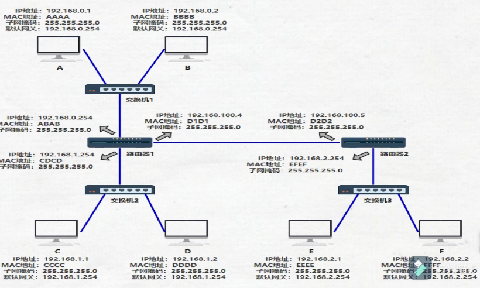
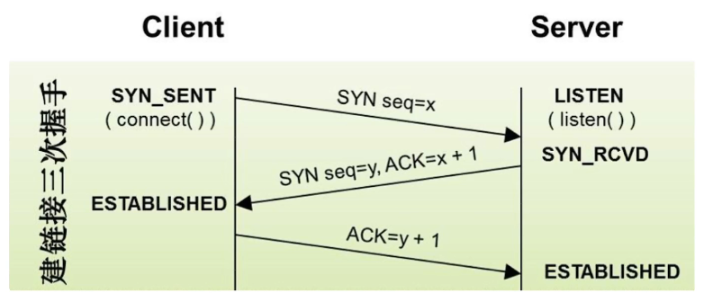
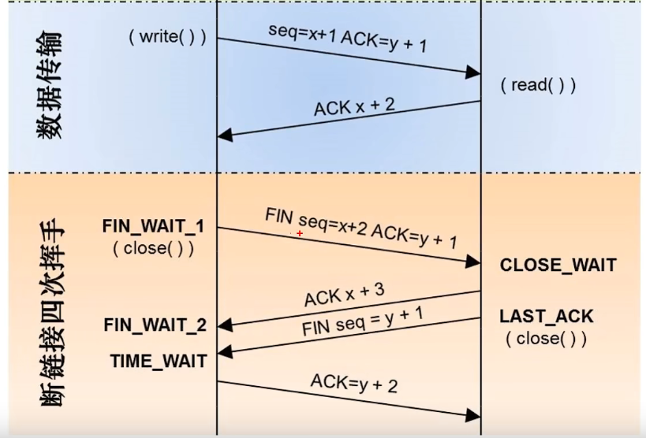
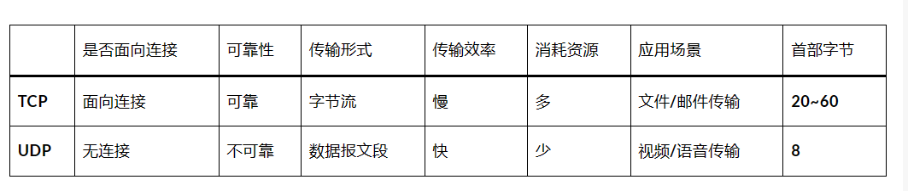
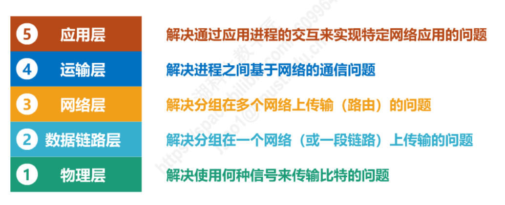

# 标题

先来一个整体的认识

思考：电脑A 怎么给 电脑F 传输数据包



- 首先A(192.168.0.1)通过子网掩码(255.255.255.0)计算出自己与F(192.168.2.2)并不在同一个子网内，于是决定发送给默认网关(192.168.0.254)

- A 通过 ARP 找到默认网关(192_168.0_254)的MAC 地址

- A将源 MAC 地址(AAAA)与网关 MAC 地址(ABAB)封装在数据链路层头部。又将源 IP 地址(192.168.0.1)和目的 IP地址(192.1682.2)封装在网络层头部，然后发包

  > 整个过程中，IP地址是始终不变的，变得一直是MAC地址
  >
  > 交换机只认MAC地址，路由器只认IP地址
  >
  > 交换机中存储着**MAC地址端口映射表**；路由器中有**路由表**：IP地址和端口的映射；
  >
  > 路由器还有 ARP缓存，ARP原理就是通过IP地址找MAC地址
  >
  > > ARP/a ： 可以查看自己电脑的IP和MAC对应的缓存
  
  ```mermaid
  graph LR;
  封住源MAC和目标MAC --- 封住源IP和目标IP--- 数据包
  ```
  
- 此时路由器 1 收到了数据包，首先再次搜索路由表，发现匹配到了端口为 2；于是将其封装到数据链路层，最后把包从 2 号口发出去
- 此时路由器 2 收到了数据包，看到其目的地址是192.168.2.2，查询其**路由表**，匹配到端口号为 1准备从 1 号口把数据包送出去
- 但此时路由器 2 需要知道 192.168.2.2 的 MAC地址了，于是查看其 **ARP 缓存**，找到其 MAC 地址为FFFF，将其封装在数据链路层头部，并从 1 号端口把包发出去

- 交换机3收到了数据包，发现目的 MAC 地址为 FFFF，查询其 **MAC地址表**，发现应该从其 6 号端口出去于是从 6 号端口把数据包发出去
- F最终收到了数据包，并且发现目的MAC地址就是自己，于是收下了这个包


## IP地址、子网掩码、网关

- IP地址由**网络号**和**主机号**组成，我们把网络号相同的主机称之为**本地网络中的主机**，网络号不相同的主机称之为**远程网络中的主机**。

- 本地网络中的主机可以直接相互通信，远程网络中的主机要相互通信必须通过**本地网关（Gateway）**来传递转发数据。

- 为了确定网络区域，分开主机和路由器的每个接口，从而产生了若干个分离的网络岛，这些独立的网络岛叫做子网(subnet)。

- IP地址的网络号相等，主机号不等的主机组成的一个子网
- IP地址与子网掩码作`与运算`，结果相同的在同一个子网，不同的在不同子网

### IP地址

- IP地址实质上是一个32位的二进制数，为了方便，一般用十进制表示。

- IP地址是由**网络号**和**主机号**两部分组成的

  ```mermaid
  graph TB;
  192.168.1.4 --> 192
  192.168.1.4 --> 168
  192.168.1.4 --> 1
  192.168.1.4 --> 0
  192 --> 11000000
  168 --> 10101000
  1 --> 00000001
  0 --> 00000100
  11000000 --> 11000000101010000000000100000100
  10101000 --> 11000000101010000000000100000100
  00000001 --> 11000000101010000000000100000100
  00000100 --> 11000000101010000000000100000100
  ```

### 子网掩码

- 子网掩码，与IP地址类似，也是32位的二进制，也可以用十进制表示

- 子网掩码的作用：**告诉计算机哪些是网络号，那些是主机号**

  - 子网掩码可以分离出IP地址中的**网络地址**和**主机地址**。如果两台主机要通信，**首先要判断是否处于同一网段**，即网络地址是否相同。如果相同，那么可以把数据包直接发送到目标主机，否则就需要经过**路由网关**将数据包转发送到目的地。
  
  ```mermaid
  graph TB;
  192.168.1.4 --> 11000000101010000000000100000100
  11000000101010000000000100000100 --> 110000001010100000000001_00000100 
  110000001010100000000001_00000100 --> 110000001010100000000001
  110000001010100000000001_00000100 --> 00000100
  110000001010100000000001 --- 网络号
  110000001010100000000001 --> 110000001010100000000001_00000000
  00000100 --- 主机号
  00000100 --> 110000001010100000000001_00000000
  110000001010100000000001_00000000 --- 等价于--- 192.168.1.4/24
  ```
  

### 网关 

> 网关是一个概念，不是一个具体的设备，简单说就是一个网段访问另一个网段的必经之路，是用来连接两个子网的
>
> 路由器可以做网关
>
> 三层交换机也可以做网关
>
> 防火墙也可以做网关   ??????   什么是防火墙

- 网关(Gateway)又称网间连接器、协议转换器。**子网间的连接器**，当数据包的源IP和目标IP不在同一网段时，需要经过网关。

- 计算机的**网关（Gateway）**就是到其他网段的出口，也就是路由器接口IP地址。**路由器接口使用的IP地址可以是本网段中任何一个地址**，不过通常使用该网段的**第一个可用的地址**或**最后一个可用的地址**，这是为了尽可能避免和本网段中的主机地址冲突。

- <span style = "color:blue; font-weight:bold">默认网关</span>

  - 默认网关地址是**主机位**除了最后一位全置1后得到的。<span style = "color:blue; font-weight:bold">本网段的最后一个可用的地址</span>

    假设现有一个IP地址为`193.6.7.0/24`，根据网络前缀24可知前24位为网络位，后8位为主机位，因此该网络的默认网关地址就是IP地址193.6.7.**11111110**（加粗的部分为网络位），换算成十进制数即`193.6.7.254/24。`

  - 一台主机可以有多个网关。**默认网关的意思是一台主机如果找不到可用的网关，就把数据包发给默认指定的网关，由这个网关来处理数据包**。现在主机使用的网关，一般指的是默认网关。

- 什么时候需要网关呐

  - 若源IP和目标IP在**同一网段**则可以直接通信，不需要经过网关，否则需要
  - **同一网段(同一个子网)**：网络号相同，主机号不同

  ```shell
  nslookup bilibili.com   查看网址IP
  
  tracert -d 139.159.241.37  追踪IP
  ```

  


### 私网和公网

- 私网和公网又称内网和外网

- 公网通常指的是Internet(因特网)，也就是世界上最大的internet(互联网)

- 公网IP

- 私网IP

  - 哪些是私网IP
    - A类：10.0.0.0 ~ 10.255.255.255
    - B类：172.10.0.0 ~ 172.31.255.255
    - C类：192.168.0.0 ~ 192.168.255.255

- 特殊地址

  | 特殊IP地址   | 地址范围 | 作用 |
  | ------------ | -------- | ---- |
  | 有限广播地址 |          |      |
  |              |          |      |
  

### IPV4 和 IPV6 的区别

| IPV4             | IPV6              |
| ---------------- | ----------------- |
| 地址长度：32 bit | 地址长度：128 bit |
|                  |                   |

## 网络地址，广播地址，主机地址，可用地址

- 主机位全变成0，得到网络地址；主机位全变成1，得到广播地址

  **例题：**172.16.10.1/16 这个B类地址的网络地址，广播地址，可用地址？

  - 网络地址：172.16.0.0/16
  - 主机地址：0.0.10.1/16
  - 广播地址：172.16.255.255/16
  - IP地址数：$2^{16}$= 65536
  - 可用IP地址数：$2^{16}$ - 2 = 65534
  - 可用IP地址范围：172.16.0.1/16 ~ 172.16.255.254/16

- 


## 集线器和交换机的区别（路由器）

> 使用`集线器`和`交换机`扩展以太网的区别

- 使用集线器的以太网在逻辑上是共享总线的，需要使用CSMA/CD协议来协调各主机争用总线，只能工作在半双工模式下(收发帧不能同时进行)。
- 以太网交换机通常都有多个接口。每个接口都可以直接与一台主机或另一个以太网交换机相连。一般都工作在全双工方式
- 以太网交换机具有并行性，能同时连通多对接口，使多对主机能同时通信，无碰撞 (不使用CSMA/CD协议)
- 以太网交换机一般都具有多种速率的接口，例如:10Mb/s、100Mb/s、1Gb/s、10Gb/s接口的多种组合
- 以太网交换机工作在数据链路层 (也包括物理层)，它收到顿后，在恢交换表中查找帧的目的MAC地址所对应的接口号，然后通过该接口转发恢。
- 以太网交换机是一种即插即用设备，其内部的帧交换表是通过自学习算法自动地逐渐建立起来的。
- 帧的两种转发方式
  - 1.存储转发
  - 2.直通交换：采用基于硬件的交叉矩阵 (交换时延非常小，但不检查顿是否右差错)

- 使用集线器的以太网，以泛洪的形式传播帧；使用交换机的以太网，以源mac地址和目的Mac地址的形式传播帧
- 多个主机同时给一个主机发送单播帧，使用集线器可能发生碰撞，使用交换机不会发生，因为他会暂时存储，依次发送

> 集线器(物理层)，是以广播(泛洪)的形式传输数据包，
>
> > 
>
> 交换机(数据链路层)，内部维护着一个mac地址表，记录着mac地址和端口后的关联
>
> > mac地址映射表，刚开始是空的，是以泛洪的形式建立的，
> >
> > 交换机根据目标mac查找端口号，会出现两种情况
> >
> > > 第一种：找到了，直接从相应的端口发出
> > >
> > > 第二种：没找到，以泛洪的形式发出。
> > >
> > > ​               目标主机收到后，会返回一个响应，响应的数据包从相应端口进入交换机，交换机就会更新在mac地址表
> >
> > 交换机只关心mac地址，不关心ip地址
>
> 路由器(网络层)，独立的拥有mac地址的设备，路由器的每个端口都有mac地址
>
> > 


## 数据包转发过程

- 子网1中的 **计算机A** 发送数据包时，首先计算机A会根据目标IP地址，判断目的机器是否和自己在同一个子网
- 在同一个子网就可以直接通过交换机发送，
- 不一个子网则计算机A需要把**目的mac** 修改为**网关mac** 发出，源mac是自己的mac
- 然后发送给默认网关路由，（之后怎么转发计算机A就不关心了）
  - 对于计算机A来说，只能把数据包发给与自己在同一个子网的某个IP上
  - 所以默认网关的IP和计算机A在同一个子网
  - 其实默认网关就是计算机A在自己电脑里配置的一个与自己在同一子网的IP地址，目的就是在发送数据包给不在同一个子网的机器时，直接发给这个IP地址，<span style='color:blue; font-weight:bold'>默认网关一般是该子网中的第一个可用IP地址，或者最后一个可用IP地址</span>
    - IPv4 地址 . . . . . . . . . . . . : 172.21.48.120
    - 子网掩码  . . . . . . . . . . . . : 255.255.255.0
    - 默认网关. . . . . . . . . . . . . : 172.21.48.1  /  172.21.48.254

- 网关(路由器)拿到这一数据包后，通过查询路由表，查询到这一数据包属于子网2，网关修改目的mac地址，修改源mac地址为自己的mac地址，然后从子网2的网卡发出

> **电脑视角：**首先我要知道我的 IP 以及对方的 IP，通过**子网掩码**判断我们是否在同一个子网。在同一个子网就通过 **arp** 获取对方 **mac 地址**直接扔出去；不在同一个子网就通过 **arp** 获取**默认网关的 mac 地址**直接扔出去
>
> **交换机视角：**我收到的数据包必须有**目标 MAC 地址**，通过 **MAC 地址表**查映射关系，查到了就按照映射关系从我的指定端口发出去，查不到就所有端口都发出去
>
> **路由器视角：**我收到的数据包必须有**目标 IP 地址**，通过路由表查映射关系，查到了就按照映射关系从我的指定端口发出去(不在任何一个子网范围，走其路由器的默认网关，也是查到了)，查不到则返回一个路由不可达的数据包
>
> <span style='color:blue; font-weight:bold'>体会一下下面一段话：</span>
>
> 网络层(IP协议)本身没有传输包的功能，数据包的实际传输是委托给数据链路层(以太网中的交换机)来实现的，
>
> 涉及到的三张表分别是：
>
> > 交换机中有 **MAC 地址表，**用于映射 MAC地址和它的端口，
> >
> > 路由器中有**路由表，**用于映射 IP 地址和它的端口
> >
> > 电脑和路由器中都有 **arp 缓存表，**用于缓存 IP 和 MAC 地址的映射
> >
> > 关系这三张表是怎么来的:
> >
> > > MAC 地址表是通过以太网内各节点之间不断通过交换机通信，不断完善起来的。
> > >
> > > 路由表是各种路由算法人工配置逐步完善起来的。
> > >
> > > arp 缓存表是不断通过 arp 协议的请求逐步完善起来的


## TCP协议

> 传输控制协议（TCP，Transmission Control Protocol）是一种面向连接的、可靠的、基于字节流的传输层通信协议。

可靠具体指的是：**数据传输**是在三次握手建立链接之后，才能进行数据传输，断开链接要靠四次挥手才能断开链接


> [为什么 SYNFIN 不包含数据却要消耗一个序列号？_哔哩哔哩_bilibili](https://www.bilibili.com/video/BV1WS4y147Mj?p=4&spm_id_from=pageDriver&vd_source=5bc191bb37a56c995b0901fd3ad1baa5)

### 三次握手，四次挥手

- 三次握手是为了建立连接，四次挥手是为了断开连接

- 三次握手

  

  > SYN (synchronize)是请求同步的意思，ACK是确认同步的意思
  >
  > [TCP三次握手中SYN，ACK，seq ack的含义 - 陈木 - 博客园 (cnblogs.com)](https://www.cnblogs.com/muyi23333/articles/13841268.html)
  >
  > 两次不够
  >
  > 四次浪费
  >
  > 三次是最合适的

- 四次挥手

  

> 第一思考，为什么第2次和第3次不一起发送？
>
> 第2次和第3次的请求是有时差的，服务端收到断开的请求，不能立马同意断开
>
> 因为作为服务端，可能还有一些资源没有释放，还有一些请求没有处理，所以第二次和第三次之间可能会存在一定的延迟，
>
> 另外一种情况，服务端收到第一次请求后，不立刻返回，等资源释放完毕，等请求处理完毕，再一起发送(2和3)，这可能要等上1分钟，或者更长
>
> 但是TCP作为一个面向连接的，是可靠的协议，如果客户端发送一个请求，超过30s，或者我们设定的一个时间，没有得到回应，那么客户端会重新发送请求。所以可能出现的结果就是，虽然少了一个次挥手，但是客户端没有及时收到回应，会一直重复发送断开的请求


## UCP协议

用户数据报协议（UDP，User Datagram Protocol）是一个无连接的传输协议。




## Mac地址和IP地址

- mac地址，12个16进制数：aa-aa-aa-aa-aa-aa
- 1个16进制4个bit，所以一共48个比特位，也就是6个字节
- IP地址，IPv4，32个比特位，也就是4个字节


## 四层协议，每层作用




