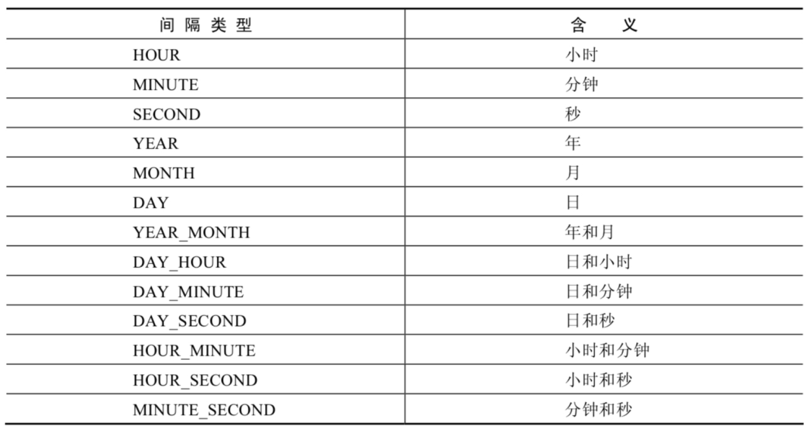

# MySQL Notes

## Remark

- [92-创建触发器_哔哩哔哩_bilibili](https://www.bilibili.com/video/BV1iq4y1u7vj/?p=92&spm_id_from=333.880.my_history.page.click&vd_source=5bc191bb37a56c995b0901fd3ad1baa5)
- linux安装mysql，先卸载系统自带的mysql
  - 检查当前系统是否安装过 MySQL  
    - rpm -qa|grep mariadb  

  - 卸载系统自带的mysql
    - sudo rpm -e --nodeps mariadb-libs  


```
// 安装8.0 - mysql教程有，应该也有5.7的安装

// 安装5.7.28 - hive教程中有
sudo rpm -ivh mysql-community-common-5.7.28-1.el7.x86_64.rpm
sudo rpm -ivh mysql-community-libs-5.7.28-1.el7.x86_64.rpm
sudo rpm -ivh mysql-community-libs-compat-5.7.28-1.el7.x86_64.rpm
sudo rpm -ivh mysql-community-client-5.7.28-1.el7.x86_64.rpm
sudo rpm -ivh mysql-community-server-5.7.28-1.el7.x86_64.rpm
```

- linux安装两个版本的mysql，端口号怎么设置的？
  - window安装的时候，是可以自己选择的。
  - linux呢？


- MySQL 80 的密码特性

  - 用图形化界面链接mysql80时报错

    解决方案两种：一是升级图形化工具使其支持8.0；二是把mysql8的用户登录密码加密规则还原成mysql_native_password

    ```mysql
    # 第二种方案
    
    #使用mysql数据库
    USE mysql;
    
    #修改'root'@'localhost'用户的密码规则和密码
    ALTER USER 'root'@'localhost' IDENTIFIED WITH mysql_native_password BY 'li123...';
    
    #刷新权限
    FLUSH PRIVILEGES;
    ```

    > 修改之后，就可以使用图形化界面链接mysql80。


## MySQL 8.0的新特性

-  全局变量的持久化 

```mysql
SET GLOBAL MAX_EXECUTION_TIME=2000;  # 原来的设置方式，不持久化，（服务重启后失效）

# 使用SET PERSIST 可以持久化
SET PERSIST global max_connections = 1000;
# MySQL会将该命令的配置保存到数据目录下的 mysqld-auto.cnf 文件中，下次启动时会读取该文件，用其中的配置来覆盖默认的配置文件。

```


## 初级

### 第01章 数据库概述


### 第02章  MySQL环境搭建


### 第03章 基本的SELECT语句

#### SQL 分类

SQL语言在功能上主要分为如下3大类：

- <span style="color:blue; font-weight:bold">DDL（Data Definition Languages、数据定义语言）</span>，这些语句定义了不同的数据库、表、视图、索引等数据库对象，还可以用来创建、删除、修改数据库和数据表的结构。
  - 主要的语句关键字包括 CREATE 、 DROP 、 ALTER 等。

- <span style="color:blue; font-weight:bold">DML（Data Manipulation Language、数据操作语言）</span>，用于添加、删除、更新和查询数据库记录，并检查数据完整性。
  - 主要的语句关键字包括 INSERT 、 DELETE 、 UPDATE 、 SELECT 等。SELECT是SQL语言的基础，最为重要。

- <span style="color:blue; font-weight:bold">DCL（Data Control Language、数据控制语言）</span>，用于定义数据库、表、字段、用户的访问权限和安全级别。
  - 主要的语句关键字包括 GRANT 、 REVOKE 、 COMMIT 、 ROLLBACK 、 SAVEPOINT 等。  

> 因为查询语句使用的非常的频繁，所以很多人把查询语句单拎出来一类：DQL（数据查询语言）。还有单独将 COMMIT 、 ROLLBACK 取出来称为TCL （Transaction Control Language，事务控制语言）。  

#### SQL语言的规则与规范

基本规则：

- SQL 可以写在一行或者多行。为了提高可读性，各子句分行写，必要时使用缩进

- 每条命令以 ; 或 \g 或 \G 结束

- 关键字不能被缩写也不能分行

- 关于标点符号

  - 必须保证所有的()、单引号、双引号是成对结束的

  - 必须使用英文状态下的半角输入方式

  - 字符串型和日期时间类型的数据可以使用单引号（' '）表示

  - 列的别名，尽量使用双引号（" "），而且不建议省略as  

SQL大小写规范 （建议遵守） 

- MySQL 在 Windows 环境下是大小写<span style="color:blue; font-weight:bold">不敏感的</span>

- MySQL 在 Linux 环境下是大小写<span style="color:blue; font-weight:bold">敏感的</span>
  - 数据库名、表名、表的别名、变量名是严格区分大小写的
  - 关键字、函数名、列名(或字段名)、列的别名(字段的别名) 是忽略大小写的。
- 推荐采用统一的书写规范：
  - 数据库名、表名、表别名、字段名、字段别名等都小写
  - SQL 关键字、函数名、绑定变量等都大写

3种注释方式

- 单行注释：#注释文字(MySQL特有的方式)
- 单行注释：-- 注释文字(--后面必须包含一个空格。)
- 多行注释：/* 注释文字 */  

<span style="color:blue; font-weight:bold">数据导入指令</span>

```mysql
# 在命令行客户端登录mysql，使用source指令导入
source d:\mysqldb.sql
# mysqldb.sql 就是一些sql语句
```

#### 基本的SELECT语句(节选)

""具体详细笔记可看康师傅的讲义""，下面列举一部分：

- 去除重复行  -  关键字DISTINCT

  ```mysql
  SELECT DISTINCT department_id
  FROM employees;
  ```

  > 这里有两点需要注意：  
  >
  > - DISTINCT 需要<span style="color:blue; font-weight:bold">放到所有列名的前面</span>，如果写成 SELECT salary, DISTINCT department_idFROM employees 会报错。
  >
  > - DISTINCT 其实是对后面<span style="color:blue; font-weight:bold">所有列名的组合进行去重</span>，你能看到最后的结果是 74 条，因为这 74 个部门id不同，都有 salary 这个属性值。如果你想要看都有哪些不同的部门（department_id），只需要写 DISTINCT department_id 即可，后面不需要再加其他的列名了  

- 空值参与运算<br>所有运算符或列值遇到null值，运算的结果都为null  

- 显示表结构<br>使用DESCRIBE 或 DESC 命令，表示表结构。  

### 第04章


### 第05章 排序和分页

####  排序数据  

- 排序规则

  使用 ORDER BY 子句排序

  - ASC（ascend）: 升序
  - DESC（descend）:降序
  - ORDER BY 子句在SELECT语句的结尾。  

- 单列排序

- 多列排序

  - 可以使用不在SELECT列表中的列排序。
  - 在对多列进行排序的时候，首先排序的第一列必须有相同的列值，才会对第二列进行排序。如果第一列数据中所有值都是唯一的，将不再对第二列进行排序。  

  ```mysql
  # 查询员工的姓名和部门号和年薪，按年薪降序,按姓名升序显示
  SELECT last_name, department_id, salary * 12 AS year_sal
  FROM employees
  ORDER BY year_sal DESC , last_name ASC;
  # 对第一个降序，对第二个升序
  ```

#### 分页

- 背景  

  - 背景1：查询返回的记录太多了，查看起来很不方便，怎么样能够实现分页查询呢？
  - 背景2：表里有 4 条数据，我们只想要显示第 2、3 条数据怎么办呢？ 

- 实现规则

  所谓分页显示，就是将数据库中的结果集，一段一段显示出来需要的条件。 

- MySQL中使用 LIMIT 实现分页  

  ```mysql 
  # 格式
  LIMIT [位置偏移量,] 行数
  ```

  > 第一个“位置偏移量”参数指示MySQL从哪一行开始显示，是一个可选参数，如果不指定“位置偏移量”，将会从表中的第一条记录开始（第一条记录的位置偏移量是0，第二条记录的位置偏移量是1，以此类推）；
  >
  > 第二个参数“行数”指示返回的记录条数。  

  ```mysql
  # 举例：
  # 前10条记录：
  SELECT * FROM 表名 LIMIT 0,10;
  # 或者
  SELECT * FROM 表名 LIMIT 10;
  # 第11至20条记录：
  SELECT * FROM 表名 LIMIT 10,10;
  # 第21至30条记录：
  SELECT * FROM 表名 LIMIT 20,10;
  ```

  > MySQL 8.0中可以使用“LIMIT 3 OFFSET 4”，意思是获取从第5条记录开始后面的3条记录，和“LIMIT4,3;”返回的结果相同。  

- 分页显式公式：（当前页数-1）*每页条数，每页条数 

  ```mysql
  SELECT * FROM tbl_name
  LIMIT (PageNo - 1)*PageSize,PageSize;
  ```

  - 注意：LIMIT 子句必须放在整个SELECT语句的最后！

- 使用 LIMIT 的好处  

  约束返回结果的数量可以 减少数据表的网络传输量，也可以 提升查询效率 。如果我们知道返回结果只有1 条，就可以使用LIMIT 1 ,告诉 SELECT 语句只需要返回一条记录即可。这样的好处就是 SELECT 不需要扫描完整的表，只需要检索到一条符合条件的记录即可返回。  

#### 拓展

在不同的 DBMS 中使用的关键字可能不同。在 MySQL、PostgreSQL、MariaDB 和 SQLite 中使用 LIMIT 关键字，而且需要放到 SELECT 语句的最后面。  

- 如果是 SQL Server 和 Access，需要使用 TOP 关键字，比如：

  ```mysql
  SELECT TOP 5 name, hp_max FROM heros ORDER BY hp_max DESC
  ```

- 如果是 DB2，使用 FETCH FIRST 5 ROWS ONLY 这样的关键字：

  ```mysql
  SELECT name, hp_max FROM heros ORDER BY hp_max DESC FETCH FIRST 5 ROWS ONLY
  ```

- 如果是 Oracle，你需要基于 ROWNUM 来统计行数：

  ```mysql
  SELECT rownum,last_name,salary FROM employees WHERE rownum < 5 ORDER BY salary DESC;
  ```

  需要说明的是，这条语句是先取出来前 5 条数据行，然后再按照 hp_max 从高到低的顺序进行排序。但这样产生的结果和上述方法的并不一样。我会在后面讲到子查询，你可以使用

  ```mysql
  SELECT rownum, last_name,salary
  FROM (
      SELECT last_name,salary
      FROM employees
      ORDER BY salary DESC) tbl
  WHERE rownum < 10;
  ```

  得到与上述方法一致的结果。  

### 第06章 多表查询

- 多表查询，也称为<span style="color:blue; font-weight:bold">关联查询</span>，指两个或更多个表一起完成查询操作。

- 前提条件：这些一起查询的表之间是有关系的（一对一、一对多），它们之间一定是有关联字段，这个关联字段可能建立了外键，也可能没有建立外键。比如：员工表和部门表，这两个表依靠“部门编号”进行关联。  

#### 笛卡尔积（或交叉连接）的理解

- 笛卡尔乘积是一个数学运算。假设我有两个集合 X 和 Y，那么 X 和 Y 的笛卡尔积就是 X 和 Y 的所有可能组合，也就是第一个对象来自于 X，第二个对象来自于 Y 的所有可能。组合的个数即为两个集合中元素个数的乘积数。  

- SQL92中，笛卡尔积也称为<span style="color:blue; font-weight:bold">交叉连接</span>，英文是 CROSS JOIN 。在 SQL99 中也是使用 CROSS JOIN表示交叉连接。它的作用就是可以把任意表进行连接，即使这两张表不相关。  

```mysql
# 以下语句都会产生笛卡尔积
SELECT last_name,department_name FROM employees,departments;
SELECT last_name,department_name FROM employees CROSS JOIN departments;
SELECT last_name,department_name FROM employees INNER JOIN departments;
SELECT last_name,department_name FROM employees JOIN departments;
```

- 笛卡尔积的错误会在下面条件下产生： 
  - 省略多个表的连接条件（或关联条件）
  - 连接条件（或关联条件）无效
  - b所有表中的所有行互相连接  
- 为了避免笛卡尔积， 可以在 WHERE 加入有效的连接条件。  

#### 多表查询分类讲解

- 分类1：等值连接 vs 非等值连接  

- 分类2：自连接 vs 非自连接  

- 分类3：内连接 vs 外连接  
  - <span style="color:red; font-weight:bold">内连接</span>: 合并具有同一列的两个以上的表的行, 结果集中不包含一个表与另一个表不匹配的行
  - <span style="color:red; font-weight:bold">外连接</span>: 两个表在连接过程中除了<span style="color:blue; font-weight:bold">返回满足连接条件的行</span>以外还返回左（或右）表中不满足条件的行 ，这种连接称为左（或右） 外连接。没有匹配的行时, 结果表中相应的列为空(NULL)。
  - 如果是<span style="color:blue; font-weight:bold">左外连接</span>，则连接条件中<span style="color:blue; font-weight:bold">左边的表</span>也称为<span style="color:blue; font-weight:bold">主表</span> ，右边的表称为从表 。
  - 如果是<span style="color:blue; font-weight:bold">右外连接</span>，则连接条件中<span style="color:blue; font-weight:bold">右边的表</span>也称为<span style="color:blue; font-weight:bold">主表 </span>，左边的表称为从表 。  

>  连接 n个表,至少需要n-1个连接条件。比如，连接三个表，至少需要两个连接条件。  

- > 

#### SQL99语法实现多表查询  

- SQL92：使用(+)创建连接  

  - 在 SQL92 中采用（+）代表从表所在的位置。即左或右外连接中，(+) 表示哪个是从表。

  - Oracle 对 SQL92 支持较好，而 MySQL 则不支持 SQL92 的外连接。  

  ```mysql
  #左外连接
  SELECT last_name,department_name
  FROM employees ,departments
  WHERE employees.department_id = departments.department_id(+);
  
  #右外连接
  SELECT last_name,department_name
  FROM employees ,departments
  WHERE employees.department_id(+) = departments.department_id;
  ```

  > 而且在 SQL92 中，只有左外连接和右外连接，没有满（或全）外连接  

- SQL99基本语法  

  - 使用JOIN...ON子句创建连接的语法结构

    ```mysql
    SELECT table1.column, table2.column,table3.column
    FROM table1
    JOIN table2 ON `table1 和 table2 的连接条件`
    JOIN table3 ON `table2 和 table3 的连接条件`
    ```

    - 可以使用 ON 子句指定额外的连接条件。
    - 这个连接条件是与其它条件分开的。
    - ON 子句使语句具有更高的易读性。
    - 关键字 JOIN、INNER JOIN、CROSS JOIN 的含义是一样的，都表示内连接  

- 内连接(INNER JOIN)的实现

  ```mysql
  SELECT 字段列表
  FROM A表 INNER JOIN B表
  ON 关联条件
  WHERE 等其他子句;
  ```

- 外连接(OUTER JOIN)的实现  

  - 左外连接(LEFT OUTER JOIN)  
  - 右外连接(RIGHT OUTER JOIN)  

  > 需要注意的是，LEFT JOIN 和 RIGHT JOIN 只存在于 SQL99 及以后的标准中，在 SQL92 中不存在，只能用 (+) 表示。  

- 满外连接(FULL OUTER JOIN)  
  - 满外连接的结果 = 左右表匹配的数据 + 左表没有匹配到的数据 + 右表没有匹配到的数据。
  - SQL99是支持满外连接的，使用FULL JOIN 或 FULL OUTER JOIN来实现。
  - 需要注意的是，<span style="color:blue; font-weight:bold">MySQL不支持FULL JOIN</span>，但是可以用 UNION 语法代替实现（UNION 语法见下节）。  

#### UNION的使用

合并查询结果 利用UNION关键字，可以给出多条SELECT语句，并将它们的结果组合成单个结果集。合并时，两个表对应的列数和数据类型必须相同，并且相互对应。各个SELECT语句之间使用UNION或UNIONALL关键字分隔。  

- 语法格式

  ```mysql
  SELECT column,... FROM table1
  UNION [ALL]
  SELECT column,... FROM table2
  ```

- union

  - UNION 操作符返回两个查询的结果集的并集，去除重复记录。  

- union all

  - UNION ALL操作符返回两个查询的结果集的并集。对于两个结果集的重复部分，不去重。

> 注意：执行UNION ALL语句时所需要的资源比UNION语句少。如果明确知道合并数据后的结果数据不存在重复数据，或者不需要去除重复的数据，则尽量使用UNION ALL语句，以<span style="color:blue; font-weight:bold">提高数据查询的效率。</span>  

#### 7种SQL JOINS的实现  


- 代码实现

  ```mysql
  #中图：内连接 A∩B
  SELECT employee_id,last_name,department_name
  FROM employees e JOIN departments d
  ON e.`department_id` = d.`department_id`;
  
  #左上图：左外连接
  SELECT employee_id,last_name,department_name
  FROM employees e LEFT JOIN departments d
  ON e.`department_id` = d.`department_id`;
  
  #右上图：右外连接
  SELECT employee_id,last_name,department_name
  FROM employees e RIGHT JOIN departments d
  ON e.`department_id` = d.`department_id`;
  
  #左中图：A - A∩B
  SELECT employee_id,last_name,department_name
  FROM employees e LEFT JOIN departments d
  ON e.`department_id` = d.`department_id`
  WHERE d.`department_id` IS NULL
  
  #右中图：B-A∩B
  SELECT employee_id,last_name,department_name
  FROM employees e RIGHT JOIN departments d
  ON e.`department_id` = d.`department_id`
  WHERE e.`department_id` IS NULL
  
  #左下图：满外连接
  # 左中图 + 右上图 A∪B
  SELECT employee_id,last_name,department_name
  FROM employees e LEFT JOIN departments d
  ON e.`department_id` = d.`department_id`
  WHERE d.`department_id` IS NULL
  UNION ALL #没有去重操作，效率高
  SELECT employee_id,last_name,department_name
  FROM employees e RIGHT JOIN departments d
  ON e.`department_id` = d.`department_id`;
  
  #右下图
  #左中图 + 右中图 A ∪B- A∩B 或者 (A - A∩B) ∪ （B - A∩B）
  SELECT employee_id,last_name,department_name
  FROM employees e LEFT JOIN departments d
  ON e.`department_id` = d.`department_id`
  WHERE d.`department_id` IS NULL
  UNION ALL
  SELECT employee_id,last_name,department_name
  FROM employees e RIGHT JOIN departments d
  ON e.`department_id` = d.`department_id`
  WHERE e.`department_id` IS NULL
  ```

> 我们要 控制连接表的数量 。多表连接就相当于嵌套 for 循环一样，非常消耗资源，会让 SQL 查询性能下降得很严重，因此不要连接不必要的表。在许多 DBMS 中，也都会有最大连接表的限制。  
>
> > 【强制】超过三个表禁止 join。需要 join 的字段，数据类型保持绝对一致；多表关联查询时， 保证被关联的字段需要有索引。
> > 说明：即使双表 join 也要注意表索引、SQL 性能。
> > 来源：阿里巴巴《Java开发手册》  

### 第07章 单行函数  -  查

#### 函数的理解

- 函数在计算机语言的使用中贯穿始终，函数的作用是什么呢？它可以把我们经常使用的代码封装起来，需要的时候直接调用即可。这样既提高了代码效率，又提高了可维护性。
- 在 SQL 中我们也可以使用函数对检索出来的数据进行函数操作。使用这些函数，可以极大地提高用户对数据库的管理效率。  

- 从函数定义的角度出发，我们可以将函数分成**内置函数**和**自定义函数** 。在 SQL 语言中，同样也包括了**内置函数**和**自定义函数**。
  - 内置函数是系统内置的通用函数，本章及下一章《聚合函数》讲解的是 SQL 的内置函数。  
  - 自定义函数是我们根据自己的需要编写的

#### MySQL的内置函数及分类  

- MySQL提供了丰富的内置函数，这些函数使得数据的维护与管理更加方便，能够更好地提供数据的分析与统计功能，在一定程度上提高了开发人员进行数据分析与统计的效率。
- MySQL提供的内置函数从实现的功能角度可以分为<span style="color:blue; font-weight:bold">数值函数</span>、<span style="color:blue; font-weight:bold">字符串函数</span>、<span style="color:blue; font-weight:bold">日期和时间函数</span>、<span style="color:blue; font-weight:bold">流程控制函数</span>、<span style="color:blue; font-weight:bold">加密与解密函数</span>、<span style="color:blue; font-weight:bold">获取MySQL信息函数</span>、<span style="color:blue; font-weight:bold">聚合函数</span>等。
- 这里，我将这些丰富的内置函数再分为两类： 单行函数 、 聚合函数（或分组函数） 。  
  - 单行函数
    - 操作数据对象
    - 接受参数返回一个结果
    - 只对一行进行变换
    - 每行返回一个结果
    - 可以嵌套
    - 参数可以是一列或一个值  

#### 数值函数

- 基本函数  

  | 函数                | 用法                                                         |
  | ------------------- | ------------------------------------------------------------ |
  | ABS(x)              | 返回x的绝对值                                                |
  | SIGN(X)             | 返回X的符号。正数返回1，负数返回-1，0返回0                   |
  | PI()                | 返回圆周率的值                                               |
  | CEIL(x)，CEILING(x) | 返回大于或等于某个值的最小整数                               |
  | FLOOR(x)            | 返回小于或等于某个值的最大整数                               |
  | LEAST(e1,e2,e3…)    | 返回列表中的最小值                                           |
  | GREATEST(e1,e2,e3…) | 返回列表中的最大值                                           |
  | MOD(x,y)            | 返回X除以Y后的余数                                           |
  | RAND()              | 返回0~1的随机值                                              |
  | RAND(x)             | 返回0~1的随机值，其中x的值用作种子值，相同的X值会产生相同的随机 数 |
  | ROUND(x)            | 返回一个对x的值进行四舍五入后，最接近于X的整数               |
  | ROUND(x,y)          | 返回一个对x的值进行四舍五入后最接近X的值，并保留到小数点后面Y位 |
  | TRUNCATE(x,y)       | 返回数字x截断为y位小数的结果                                 |
  | SQRT(x)             | 返回x的平方根。当X的值为负数时，返回NULL                     |

- 角度与弧度互换函数  

  | 函数       | 用法                                  |
  | ---------- | ------------------------------------- |
  | RADIANS(x) | 将角度转化为弧度，其中，参数x为角度值 |
  | DEGREES(x) | 将弧度转化为角度，其中，参数x为弧度值 |

- 三角函数  

  | 函数       | 用法                                                         |
  | ---------- | ------------------------------------------------------------ |
  | SIN(x)     | 返回x的正弦值，其中，参数x为弧度值                           |
  | ASIN(x)    | 返回x的反正弦值，即获取正弦为x的值。如果x的值不在-1到1之间，则返回NULL |
  | COS(x)     | 返回x的余弦值，其中，参数x为弧度值                           |
  | ACOS(x)    | 返回x的反余弦值，即获取余弦为x的值。如果x的值不在-1到1之间，则返回NULL |
  | TAN(x)     | 返回x的正切值，其中，参数x为弧度值                           |
  | ATAN(x)    | 返回x的反正切值，即返回正切值为x的值                         |
  | ATAN2(m,n) | 返回两个参数的反正切值                                       |
  | COT(x)     | 返回x的余切值，其中，X为弧度值                               |

  > 举例：
  > ATAN2(M,N)函数返回两个参数的反正切值。 与ATAN(X)函数相比，ATAN2(M,N)需要两个参数，例如有两个点point(x1,y1)和point(x2,y2)，使用ATAN(X)函数计算反正切值为ATAN((y2-y1)/(x2-x1))，使用ATAN2(M,N)计算反正切值则为ATAN2(y2-y1,x2-x1)。由使用方式可以看出，当x2-x1等于0时，ATAN(X)函数会报错，而ATAN2(M,N)函数则仍然可以计算。  

- 指数与对数  

  | 函数                 | 用法                                                 |
  | -------------------- | ---------------------------------------------------- |
  | POW(x,y)，POWER(X,Y) | 返回x的y次方                                         |
  | EXP(X)               | 返回e的X次方，其中e是一个常数，2.718281828459045     |
  | LN(X)，LOG(X)        | 返回以e为底的X的对数，当X <= 0 时，返回的结果为NULL  |
  | LOG10(X)             | 返回以10为底的X的对数，当X <= 0 时，返回的结果为NULL |
  | LOG2(X)              | 返回以2为底的X的对数，当X <= 0 时，返回NULL          |

- 进制间的转换  

  | 函数          | 用法                     |
  | ------------- | ------------------------ |
  | BIN(x)        | 返回x的二进制编码        |
  | HEX(x)        | 返回x的十六进制编码      |
  | OCT(x)        | 返回x的八进制编码        |
  | CONV(x,f1,f2) | 返回f1进制数变成f2进制数 |

#### 字符串函数  

| 函数                              | 用法                                                         |
| --------------------------------- | ------------------------------------------------------------ |
| ASCII(S)                          | 返回字符串S中的第一个字符的ASCII码值                         |
| CHAR_LENGTH(s)                    | 返回字符串s的字符数。作用与CHARACTER_LENGTH(s)相同           |
| LENGTH(s)                         | 返回字符串s的字节数，和字符集有关                            |
| CONCAT(s1,s2,......,sn)           | 连接s1,s2,......,sn为一个字符串                              |
| CONCAT_WS(x, s1,s2,......,sn)     | 同CONCAT(s1,s2,...)函数，但是每个字符串之间要加上x           |
| INSERT(str, idx, len, replacestr) | 将字符串str从第idx位置开始，len个字符长的子串替换为字符串replacestr |
| REPLACE(str, a, b)                | 用字符串b替换字符串str中所有出现的字符串a                    |
| UPPER(s) 或 UCASE(s)              | 将字符串s的所有字母转成大写字母                              |
| LOWER(s) 或LCASE(s)               | 将字符串s的所有字母转成小写字母                              |
| LEFT(str,n)                       | 返回字符串str最左边的n个字符                                 |
| RIGHT(str,n)                      | 返回字符串str最右边的n个字符                                 |
| LPAD(str, len, pad)               | 用字符串pad对str最左边进行填充，直到str的长度为len个字符     |
| RPAD(str ,len, pad)               | 用字符串pad对str最右边进行填充，直到str的长度为len个字符     |
| LTRIM(s)                          | 去掉字符串s左侧的空格                                        |
| RTRIM(s)                          | 去掉字符串s右侧的空格                                        |
| TRIM(s)                           | 去掉字符串s开始与结尾的空格                                  |
| TRIM(s1 FROM s)                   | 去掉字符串s开始与结尾的s1                                    |
| TRIM(LEADING s1 FROM s)           | 去掉字符串s开始处的s1                                        |
| TRIM(TRAILING s1 FROM s)          | 去掉字符串s结尾处的s1                                        |
| REPEAT(str, n)                    | 返回str重复n次的结果                                         |
| SPACE(n)                          | 返回n个空格                                                  |
| STRCMP(s1,s2)                     | 比较字符串s1,s2的ASCII码值的大小                             |
| SUBSTR(s,index,len)               | 返回从字符串s的index位置其len个字符，作用与SUBSTRING(s,n,len)、 MID(s,n,len)相同 |
| LOCATE(substr,str)                | 返回字符串substr在字符串str中首次出现的位置，作用于POSITION(substr IN str)、INSTR(str,substr)相同。未找到，返回0 |
| ELT(m,s1,s2,…,sn)                 | 返回指定位置的字符串，如果m=1，则返回s1，如果m=2，则返回s2，如 果m=n，则返回sn |
| FIELD(s,s1,s2,…,sn)               | 返回字符串s在字符串列表中第一次出现的位置                    |
| FIND_IN_SET(s1,s2)                | 返回字符串s1在字符串s2中出现的位置。其中，字符串s2是一个以逗号分 隔的字符串 |
| REVERSE(s)                        | 返回s反转后的字符串                                          |
| NULLIF(value1,value2)             | 比较两个字符串，如果value1与value2相等，则返回NULL，否则返回 value1 |

#### 日期和时间函数

- 获取日期、时间  

  | 函数                                                         | 用法                            |
  | ------------------------------------------------------------ | ------------------------------- |
  | CURDATE() ，CURRENT_DATE()                                   | 返回当前日期，只包含年、 月、日 |
  | CURTIME() ， CURRENT_TIME()                                  | 返回当前时间，只包含时、 分、秒 |
  | NOW() / SYSDATE() / CURRENT_TIMESTAMP() / LOCALTIME() / LOCALTIMESTAMP() | 返回当前系统日期和时间          |
  | UTC_DATE()                                                   | 返回UTC（世界标准时间） 日期    |
  | UTC_TIME()                                                   | 返回UTC（世界标准时间） 时间    |
  
- 日期与时间戳的转换  

  | 函数                     | 用法                                                         |
  | ------------------------ | ------------------------------------------------------------ |
  | UNIX_TIMESTAMP()         | 以UNIX时间戳的形式返回当前时间。SELECT UNIX_TIMESTAMP() - >1634348884 |
  | UNIX_TIMESTAMP(date)     | 将时间date以UNIX时间戳的形式返回。                           |
  | FROM_UNIXTIME(timestamp) | 将UNIX时间戳的时间转换为普通格式的时间                       |

- 获取月份、星期、星期数、天数等函数  

  | 函数                                     | 用法                                             |
  | ---------------------------------------- | ------------------------------------------------ |
  | YEAR(date) / MONTH(date) / DAY(date)     | 返回具体的日期值                                 |
  | HOUR(time) / MINUTE(time) / SECOND(time) | 返回具体的时间值                                 |
  | MONTHNAME(date)                          | 返回月份：January，...                           |
  | DAYNAME(date)                            | 返回星期几：MONDAY，TUESDAY.....SUNDAY           |
  | WEEKDAY(date)                            | 返回周几，注意，周1是0，周2是1，。。。周日是6    |
  | QUARTER(date)                            | 返回日期对应的季度，范围为1～4                   |
  | WEEK(date) ， WEEKOFYEAR(date)           | 返回一年中的第几周                               |
  | DAYOFYEAR(date)                          | 返回日期是一年中的第几天                         |
  | DAYOFMONTH(date)                         | 返回日期位于所在月份的第几天                     |
  | DAYOFWEEK(date)                          | 返回周几，注意：周日是1，周一是2，。。。周六是 7 |

- 日期的操作函数  

  | 函数                    | 用法                                       |
  | ----------------------- | ------------------------------------------ |
  | EXTRACT(type FROM date) | 返回指定日期中特定的部分，type指定返回的值 |

  - EXTRACT(type FROM date)函数中type的取值与含义：  

    

- 时间和秒钟转换的函数  

  | 函数                 | 用法                                                         |
  | -------------------- | ------------------------------------------------------------ |
  | TIME_TO_SEC(time)    | 将 time 转化为秒并返回结果值。转化的公式为： 小时*3600+分钟 *60+秒 |
  | SEC_TO_TIME(seconds) | 将 seconds 描述转化为包含小时、分钟和秒的时间                |

- 计算日期和时间的函数  -  第一组

  | 函数                                                         | 用法                                            |
  | ------------------------------------------------------------ | ----------------------------------------------- |
  | DATE_ADD(datetime, INTERVAL expr type)， ADDDATE(date,INTERVAL expr type) | 返回与给定日期时间相差INTERVAL时 间段的日期时间 |
  | DATE_SUB(date,INTERVAL expr type)， SUBDATE(date,INTERVAL expr type) | 返回与date相差INTERVAL时间间隔的 日期           |

  - 上述函数中type的取值：  

    

- 计算日期和时间的函数  -  第二组

  | 函数                         | 用法                                                         |
  | ---------------------------- | ------------------------------------------------------------ |
  | ADDTIME(time1,time2)         | 返回time1加上time2的时间。当time2为一个数字时，代表的是 秒 ，可以为负数 |
  | SUBTIME(time1,time2)         | 返回time1减去time2后的时间。当time2为一个数字时，代表的 是 秒 ，可以为负数 |
  | DATEDIFF(date1,date2)        | 返回date1 - date2的日期间隔天数                              |
  | TIMEDIFF(time1, time2)       | 返回time1 - time2的时间间隔                                  |
  | FROM_DAYS(N)                 | 返回从0000年1月1日起，N天以后的日期                          |
  | TO_DAYS(date)                | 返回日期date距离0000年1月1日的天数                           |
  | LAST_DAY(date)               | 返回date所在月份的最后一天的日期                             |
  | MAKEDATE(year,n)             | 针对给定年份与所在年份中的天数返回一个日期                   |
  | MAKETIME(hour,minute,second) | 将给定的小时、分钟和秒组合成时间并返回                       |
  | PERIOD_ADD(time,n)           | 返回time加上n后的时间                                        |

- 日期的格式化与解析  

  | 函数                              | 用法                                       |
  | --------------------------------- | ------------------------------------------ |
  | DATE_FORMAT(date,fmt)             | 按照字符串fmt格式化日期date值              |
  | TIME_FORMAT(time,fmt)             | 按照字符串fmt格式化时间time值              |
  | GET_FORMAT(date_type,format_type) | 返回日期字符串的显示格式                   |
  | STR_TO_DATE(str, fmt)             | 按照字符串fmt对str进行解析，解析为一个日期 |

  - 上述 非GET_FORMAT 函数中fmt参数常用的格式符：

      

    | 格 式 符 | 说明                                                         | 格式 符 | 说明                                                         |
    | -------- | ------------------------------------------------------------ | ------- | ------------------------------------------------------------ |
    | %Y       | 4位数字表示年份                                              | %y      | 表示两位数字表示年份                                         |
    | %M       | 月名表示月份（January,....）                                 | %m      | 两位数字表示月份 （01,02,03。。。）                          |
    | %b       | 缩写的月名（Jan.，Feb.，....）                               | %c      | 数字表示月份（1,2,3,...）                                    |
    | %D       | 英文后缀表示月中的天数 （1st,2nd,3rd,...）                   | %d      | 两位数字表示月中的天数(01,02...)                             |
    | %e       | 数字形式表示月中的天数 （1,2,3,4,5.....）                    |         |                                                              |
    | %H       | 两位数字表示小数，24小时制 （01,02..）                       | %h 和%I | 两位数字表示小时，12小时制 （01,02..）                       |
    | %k       | 数字形式的小时，24小时制(1,2,3)                              | %l      | 数字形式表示小时，12小时制 （1,2,3,4....）                   |
    | %i       | 两位数字表示分钟（00,01,02）                                 | %S 和%s | 两位数字表示秒(00,01,02...)                                  |
    | %W       | 一周中的星期名称（Sunday...）                                | %a      | 一周中的星期缩写（Sun.， Mon.,Tues.，..）                    |
    | %w       | 以数字表示周中的天数 (0=Sunday,1=Monday....)                 |         |                                                              |
    | %j       | 以3位数字表示年中的天数(001,002...)                          | %U      | 以数字表示年中的第几周， （1,2,3。。）其中Sunday为周中第一 天 |
    | %u       | 以数字表示年中的第几周， （1,2,3。。）其中Monday为周中第一 天 |         |                                                              |
    | %T       | 24小时制                                                     | %r      | 12小时制                                                     |
    | %p       | AM或PM                                                       | %%      | 表示%                                                        |

  - GET_FORMAT函数中date_type和format_type参数取值如下：  

    ####

#### 流程控制函数

- 流程处理函数可以根据不同的条件，执行不同的处理流程，可以在SQL语句中实现不同的条件选择。

- MySQL中的流程处理函数主要包括<span style="color:blue; font-weight:bold">IF()</span>、<span style="color:blue; font-weight:bold">IFNULL()</span>和<span style="color:blue; font-weight:bold">CASE()</span>函数 

  | 函数                                                         | 用法                                             |
  | ------------------------------------------------------------ | ------------------------------------------------ |
  | IF(value,value1,value2)                                      | 如果value的值为TRUE，返回value1， 否则返回value2 |
  | IFNULL(value1, value2)                                       | 如果value1不为NULL，返回value1，否 则返回value2  |
  | CASE WHEN 条件1 THEN 结果1 WHEN 条件2 THEN 结果2 .... [ELSE resultn] END | 相当于Java的if...else if...else...               |
  | CASE expr WHEN 常量值1 THEN 值1 WHEN 常量值1 THEN 值1 .... [ELSE 值n] END | 相当于Java的switch...case...                     |

#### 加密与解密函数  

- 加密与解密函数主要用于对数据库中的数据进行加密和解密处理，以防止数据被他人窃取。这些函数在保证数据库安全时非常有用。  

  | 函数                        | 用法                                                         |
  | --------------------------- | ------------------------------------------------------------ |
  | PASSWORD(str)               | 返回字符串str的加密版本，41位长的字符串。加密结果 不可 逆 ，常用于用户的密码加密 |
  | MD5(str)                    | 返回字符串str的md5加密后的值，也是一种加密方式。若参数为 NULL，则会返回NULL |
  | SHA(str)                    | 从原明文密码str计算并返回加密后的密码字符串，当参数为 NULL时，返回NULL。 SHA加密算法比MD5更加安全 。 |
  | ENCODE(value,password_seed) | 返回使用password_seed作为加密密码加密value                   |
  | DECODE(value,password_seed) | 返回使用password_seed作为加密密码解密value                   |

#### MySQL信息函数  

- MySQL中内置了一些可以查询MySQL信息的函数，这些函数主要用于帮助数据库开发或运维人员更好地对数据库进行维护工作。

  | 函数                                                   | 用法                                                      |
  | ------------------------------------------------------ | --------------------------------------------------------- |
  | VERSION()                                              | 返回当前MySQL的版本号                                     |
  | CONNECTION_ID()                                        | 返回当前MySQL服务器的连接数                               |
  | DATABASE()，SCHEMA()                                   | 返回MySQL命令行当前所在的数据库                           |
  | USER()，CURRENT_USER()、SYSTEM_USER()， SESSION_USER() | 返回当前连接MySQL的用户名，返回结果格式为 “主机名@用户名” |
  | CHARSET(value)                                         | 返回字符串value自变量的字符集                             |
  | COLLATION(value)                                       | 返回字符串value的比较规则                                 |

#### 其他函数 

- MySQL中有些函数无法对其进行具体的分类，但是这些函数在MySQL的开发和运维过程中也是不容忽视的。  

  | 函数                           | 用法                                                         |
  | ------------------------------ | ------------------------------------------------------------ |
  | FORMAT(value,n)                | 返回对数字value进行格式化后的结果数据。n表示 四舍五入 后保留 到小数点后n位 |
  | CONV(value,from,to)            | 将value的值进行不同进制之间的转换                            |
  | INET_ATON(ipvalue)             | 将以点分隔的IP地址转化为一个数字                             |
  | INET_NTOA(value)               | 将数字形式的IP地址转化为以点分隔的IP地址                     |
  | BENCHMARK(n,expr)              | 将表达式expr重复执行n次。用于测试MySQL处理expr表达式所耗费 的时间 |
  | CONVERT(value USING char_code) | 将value所使用的字符编码修改为char_code                       |

### 第08章 聚会函数

```mysql
# 结论1：（****************************）
#   select 中出现的非组函数的字段，必须声明在Group By中，而Group By中声明的字段，可以不出现在select中
# 结论2：
#   语句顺序：
#   select
#   from
#   where
#   group by
#   HAVING
#   order by
#   limit
# 结论3：（************************************）
#   GROUP BY 中使用ROLLUP，查询结果会增加一条记录，该记录记录总和
#   
#   注意：当使用ROLLUP时，不能同时使用ORDER BY子句进行结果排序，
#         即ROLLUP和ORDER BY是互相排斥的。

# SQL语句的执行过程：
# FROM -> ON -> (LEFT/RIGNT  JOIN) -> WHERE -> GROUP BY -> HAVING -> SELECT -> DISTINCT -> ORDER BY -> LIMIT
```

#### 聚合函数

- 定义：聚合函数作用于一组数据，并对一组数据返回一个值。  

- 聚合函数类型

  - AVG()

  - SUM()

  - MAX()

  - MIN()

  - COUNT()  

  > 聚合函数不能嵌套调用。比如不能出现类似“AVG(SUM(字段名称))”形式的调用。  

- AVG和SUM函数 
  - 可以对<span style="color:blue; font-weight:bold">数值型数据</span>使用AVG 和 SUM 函数。  
- MIN和MAX函数  
  - 可以对<span style="color:blue; font-weight:bold">任意数据类型</span>的数据使用 MIN 和 MAX 函数。  

- COUNT函数

  - COUNT(*)返回表中记录总数，适用于<span style="color:blue; font-weight:bold">任意数据类型</span>。

  - COUNT(expr) 返回expr不为空的记录总数。

  - 用count(*)，count(1)，count(列名)谁好呢?  

    其实，对于<span style="color:blue; font-weight:bold">MyISAM引擎</span>的表是没有区别的。这种引擎内部有一计数器在维护着行数。<span style="color:blue; font-weight:bold">Innodb</span>引擎的表用count(*),count(1)直接读行数，复杂度是O(n)，因为innodb真的要去数一遍。但好于具体的count(列名)  

  - 能不能使用count(列名)替换count(*)?  

    不要使用count(列名)来替代count(\*)，count(*)是SQL92定义的标准统计行数的语法，跟数据库无关，跟NULL和非NULL无关。 而count(列名)，当列中有数据为null时，统计不准。

    > 说明：count(*)会统计值为 NULL 的行，而 count(列名)不会统计此列为 NULL 值的行。  

#### GROUP BY

- 基本使用

  - 可以使用GROUP BY子句将表中的数据分成若干组  

  ```mysql
  SELECT column, group_function(column)
  FROM tbl_name
  [WHERE condition]
  GROUP BY group_by_expression
  [ORDER BY column];
  ```

  > 注意：where紧跟from
  >
  > ​            在SELECT列表中所有未包含在组函数中的列都应该包含在 GROUP BY子句中  
  >
  > ​            而包含在 GROUP BY 子句中的列不必包含在SELECT 列表中  

- 使用多个列分组

  > 这个还没有很好理解，有机会动手试一下？？？？？？？？？？？？？？？？？？？？？？？

  ```mysql
  # 举例
  SELECT department_id, job_id, SUM(salary)
  FROM employees
  GROUP BY department_id, job_id ;
  ```

- GROUP BY中使用WITH ROLLUP  

  使用WITH ROLLUP关键字之后，在所有查询出的分组记录之后增加一条记录，

  该记录是针对所有数据进行的一个相应的查询，比如所有数据的平均，所有数据的最大值。

  > 用的不多。

  ```mysql
  SELECT department_id,AVG(salary)
  FROM employees
  WHERE department_id > 80
  GROUP BY department_id WITH ROLLUP;
  # 多返回一行，整个数据的平均值
  
  SELECT department_id,MAX(salary)
  FROM employees
  WHERE department_id > 80
  GROUP BY department_id WITH ROLLUP;
  # 多返回一行，整个数据的最大值
  ```

- HAVING

  - 基本使用  

    过滤分组：HAVING子句

    - 行已经被分组。

    - 使用了聚合函数。

    - 满足HAVING 子句中条件的分组将被显示。

    - HAVING 不能单独使用，必须要跟 GROUP BY 一起使用。  

  ```mysql
  # 举例
  SELECT department_id, MAX(salary)
  FROM employees
  GROUP BY department_id
  HAVING MAX(salary)>10000 ;
  ```

  > 非法使用聚合函数 ： 不能在 WHERE 子句中使用聚合函数。  

  - WHERE和HAVING的对比 

    - 区别1：WHERE 可以直接使用表中的字段作为筛选条件，但不能使用分组中的计算函数作为筛选条件；HAVING 必须要与 GROUP BY 配合使用，可以把分组计算的函数和分组字段作为筛选条件。  

      > WHERE排除的记录不再包括在分组中。  

    - 区别2：如果需要通过连接从关联表中获取需要的数据，WHERE 是先筛选后连接，而 HAVING 是先连接后筛选。  

      > 不理解？？？？？？？？？？？？？？？？？？？？？？？？？？？？？？？？？？？？？
      >
      > 这一点，就决定了在关联查询中，WHERE 比 HAVING 更高效。因为 WHERE 可以先筛选，用一个筛选后的较小数据集和关联表进行连接，这样占用的资源比较少，执行效率也比较高。HAVING 则需要先把结果集准备好，也就是用未被筛选的数据集进行关联，然后对这个大的数据集进行筛选，这样占用的资源就比较多，执行效率也较低  

    |        | 优点                         | 缺点                                   |
    | :----: | :--------------------------- | :------------------------------------- |
    | WHERE  | 先筛选数据再关联，执行效率高 | 不能使用分组中的计算函数进行筛选       |
    | HAVING | 可以使用分组中的计算函数     | 在最后的结果集中进行筛选，执行效率较低 |

#### SELECT的执行过程  

- 查询的结构

  ```mysql
  #方式1：
  SELECT ...,....,...
  FROM ...,...,....
  WHERE 多表的连接条件
  AND 不包含组函数的过滤条件
  GROUP BY ...,...
  HAVING 包含组函数的过滤条件
  ORDER BY ... ASC/DESC
  LIMIT ...,...
  #方式2：
  SELECT ...,....,...
  FROM ... JOIN ...
  ON 多表的连接条件
  JOIN ...
  ON ...
  WHERE 不包含组函数的过滤条件
  AND/OR 不包含组函数的过滤条件
  GROUP BY ...,...
  HAVING 包含组函数的过滤条件
  ORDER BY ... ASC/DESC
  LIMIT ...,...
  #其中：
  #（1）from：从哪些表中筛选
  #（2）on：关联多表查询时，去除笛卡尔积
  #（3）where：从表中筛选的条件
  #（4）group by：分组依据
  #（5）having：在统计结果中再次筛选
  #（6）order by：排序
  #（7）limit：分页
  ```

- SELECT执行顺序  

  ```mysql
  # 1. 关键字的顺序是不能颠倒的：
  SELECT ... FROM ... WHERE ... GROUP BY ... HAVING ... ORDER BY ... LIMIT...
  # 2.SELECT 语句的执行顺序（在 MySQL 和 Oracle 中，SELECT 执行顺序基本相同）：
  FROM -> WHERE -> GROUP BY -> HAVING -> `SELECT 的字段` -> DISTINCT -> ORDER BY -> LIMIT
  
  # 比如你写了一个 SQL 语句，那么它的关键字顺序和执行顺序是下面这样的：
  SELECT DISTINCT player_id, player_name, count(*) as num   # 顺序 5
  FROM player JOIN team ON player.team_id = team.team_id    # 顺序 1
  WHERE height > 1.80                                       # 顺序 2
  GROUP BY player.team_id                                   # 顺序 3
  HAVING num > 2                                            # 顺序 4
  ORDER BY num DESC                                         # 顺序 6
  LIMIT 2                                                   # 顺序 7
  ```

- SQL 的执行原理

  SELECT 是先执行 FROM 这一步的。在这个阶段，如果是多张表联查，还会经历下面的几个步骤：

  - 1、首先先通过 CROSS JOIN 求笛卡尔积，相当于得到虚拟表 vt（virtual table）1-1；

  - 2、通过 ON 进行筛选，在虚拟表 vt1-1 的基础上进行筛选，得到虚拟表 vt1-2；

  - 3、添加外部行。如果我们使用的是左连接、右链接或者全连接，就会涉及到外部行，也就是在虚拟表 vt1-2 的基础上增加外部行，得到虚拟表 vt1-3。

    > 当然如果我们操作的是两张以上的表，还会重复上面的步骤，直到所有表都被处理完为止。
    >
    > 这个过程得到是我们的原始数据。  

  当我们拿到了查询数据表的原始数据，也就是最终的虚拟表 vt1 ，就可以在此基础上再进行 WHERE 阶段 。在这个阶段中，会根据 vt1 表的结果进行筛选过滤，得到虚拟表 vt2 。

  然后进入第三步和第四步，也就是 GROUP 和 HAVING 阶段 。在这个阶段中，实际上是在虚拟表 vt2 的基础上进行分组和分组过滤，得到中间的虚拟表 vt3 和 vt4 。

  当我们完成了条件筛选部分之后，就可以筛选表中提取的字段，也就是进入到 SELECT 和 DISTINCT阶段 。

  首先在 SELECT 阶段会提取想要的字段，然后在 DISTINCT 阶段过滤掉重复的行，分别得到中间的虚拟表vt5-1 和 vt5-2 。

  当我们提取了想要的字段数据之后，就可以按照指定的字段进行排序，也就是 ORDER BY 阶段 ，得到虚拟表 vt6 。

  最后在 vt6 的基础上，取出指定行的记录，也就是 LIMIT 阶段 ，得到最终的结果，对应的是虚拟表vt7 。

  当然我们在写 SELECT 语句的时候，不一定存在所有的关键字，相应的阶段就会省略。
  
  同时因为 SQL 是一门类似英语的结构化查询语言，所以我们在写 SELECT 语句的时候，还要注意相应的关键字顺序，所谓底层运行的原理，就是我们刚才讲到的执行顺序。  

### 第09章 子查询

- 子查询指一个查询语句嵌套在另一个查询语句内部的查询，这个特性从MySQL 4.1开始引入。
- SQL 中子查询的使用大大增强了 SELECT 查询的能力，因为很多时候查询需要从结果集中获取数据，或者需要从同一个表中先计算得出一个数据结果，然后与这个数据结果（可能是某个标量，也可能是某个集合）进行比较。  

#### 子查询的基本使用

- 子查询的基本语法结构：  

  ```mysql
  select select_list
  from tbl_name
  where expr operator
  					(
                          select select_list
                          from tbl_name
                      );
  ```

  - 子查询（内查询）在主查询之前一次执行完成。

  - 子查询的结果被主查询（外查询）使用 。

  - <span style="color:red; font-weight:bold">注意事项</span>

    - 子查询要包含在括号内

    - 将子查询放在比较条件的右侧

    - 单行操作符对应单行子查询，多行操作符对应多行子查询  

#### 子查询的分类

- 分类方式1： 

  我们按内查询的结果返回一条还是多条记录，将子查询分为<span style="color:blue; font-weight:bold">单行子查询</span>、<span style="color:blue; font-weight:bold">多行子查询</span>。 

  - 单行子查询  

    返回一个ST_CLERK

  - 多行子查询

    返回一个ST_CLERK、SA_MAN

- 分类方式2：

  我们按内查询是否被执行多次，将子查询划分为<span style="color:blue; font-weight:bold">相关(或关联)子查询</span>和<span style="color:blue; font-weight:bold">不相关(或非关联)子查询</span>。

  子查询从数据表中查询了数据结果，如果这个数据结果<span style="color:blue; font-weight:bold">只执行一次</span>，然后这个数据结果作为主查询的条件进行执行，那么这样的子查询叫做<span style="color:blue; font-weight:bold">不相关子查询</span>。

  同样，如果子查询需要执行多次，即采用循环的方式，先从外部查询开始，每次都传入子查询进行查询，然后再将结果反馈给外部，这种嵌套的执行方式就称为<span style="color:blue; font-weight:bold">相关子查询</span>。  

#### 单行子查询

- 单行比较操作符  

  | 操作符 | 含义                     |
  | ------ | ------------------------ |
  | =      | equal to                 |
  | >      | greater than             |
  | >=     | greater than or equal to |
  | <      | less than                |
  | <=     | less than or equal to    |
  | <>     | not equal to             |

- 代码示例 

  ```mysql
  # 题目：查询工资大于149号员工工资的员工的信息
  SELECT * FROM employees
  SELECT employee_id, last_name, salary
  FROM employees
  WHERE salary > (
  		SELECT salary
  		FROM employees
  		WHERE employee_id = 149
  		);
  
  
  # 题目：返回job_id与141号员工相同，salary比143号员工多的员工姓名，job_id和工资
  SELECT last_name, job_id, salary
  FROM employees
  WHERE job_id = (
  		SELECT job_id 
  		FROM employees
  		WHERE employee_id = 141
  		)
  AND salary > (
  		SELECT salary 
  		FROM employees
  		WHERE employee_id = 143
  		);
  
  
  # 题目：返回公司工资最少的员工的last_name,job_id和salary
  SELECT last_name, job_id, salary
  FROM employees
  WHERE salary = (
  		SELECT MIN(salary)
  		FROM employees
  		);
  
  # 题目：查询与141号或174号员工的manager_id和department_id相同的其他员工的employee_id，manager_id，department_id
  SELECT employee_id, manager_id, department_id
  FROM employees
  WHERE (manager_id, department_id) IN (
  					SELECT manager_id, department_id 
  					FROM employees
  					WHERE employee_id IN (141, 174)
  					)
  AND employee_id NOT IN (141, 174);
  
  SELECT employee_id, manager_id, department_id
  FROM employees
  WHERE manager_id IN
  			(SELECT manager_id
  			 FROM employees
  			 WHERE employee_id IN (174,141))
  AND department_id IN
  			(SELECT department_id
  			 FROM employees
  			 WHERE employee_id IN (174,141))
  			 AND employee_id NOT IN(174,141);
  ```

- HAVING 中的子查询  

  - 首先执行子查询。
  - 向主查询中的HAVING 子句返回结果。  

  ```mysql
  # 题目：查询最低工资大于50号部门最低工资的部门id和其最低工资
  SELECT department_id, MIN(salary) min_sal
  FROM employees
  GROUP BY department_id
  HAVING min_sal > (
  			SELECT MIN(salary)
  			FROM employees
  			WHERE department_id = 50
  			);
  ```

- CASE中的子查询  

  ```mysql
  #题目：显式员工的employee_id,last_name和location。其中，若员工department_id与location_id为1800的department_id相同，则location为’Canada’，其余则为’USA’。
  
  ```

- 子查询中的空值问题  

  > 子查询不返回任何行  

- 非法使用子查询  

  > 多行子查询使用单行比较符  

#### 多行子查询

> - 也称为集合比较子查询
> - 内查询返回多行
> - 使用多行比较操作符  

- 多行比较操作符  

| 操作符 | 含义                                                     |
| ------ | -------------------------------------------------------- |
| IN     | 等于列表中的任意一个                                     |
| ANY    | 需要和单行比较操作符一起使用，和子查询返回的某一个值比较 |
| ALL    | 需要和单行比较操作符一起使用，和子查询返回的所有值比较   |
| SOME   | 实际上是ANY的别名，作用相同，一般常使用ANY               |

> 体会 ANY 和 ALL 的区别  

- 案例实操

  ```mysql
  # 题目：返回其它job_id中比job_id为‘IT_PROG’部门任一工资低的员工的员工号、姓名、job_id 以及salary
  
  
  # 题目：返回其它job_id中比job_id为‘IT_PROG’部门所有工资都低的员工的员工号、姓名、job_id以及salary
  
  # 题目：查询平均工资最低的部门id
  ```

  

#### 相关子查询

- 相关子查询执行流程  

  如果子查询的执行依赖于外部查询，通常情况下都是因为子查询中的表用到了外部的表，并进行了条件关联，因此每执行一次外部查询，子查询都要重新计算一次，这样的子查询就称之为 关联子查询 。

  相关子查询按照一行接一行的顺序执行，主查询的每一行都执行一次子查询。 

   

> 子查询中使用主查询中的列  

- 案例实操

  ```mysql
  # 题目：查询员工中工资大于本部门平均工资的员工的last_name,salary和其department_id
  # 方式一：相关子查询
  
  
  # 方式二：在 FROM 中使用子查询
  
  # 注意：from型的子查询：子查询是作为from的一部分，子查询要用()引起来，并且要给这个子查询取别名， 把它当成一张“临时的虚拟的表”来使用。
  # 题目：查询员工的id,salary,按照department_name 排序
  
  
  # 题目：若employees表中employee_id与job_history表中employee_id相同的数目不小于2，输出这些相同id的员工的employee_id,last_name和其job_id
  ```

- EXISTS 与 NOT EXISTS关键字  

  - 关联子查询通常也会和 EXISTS操作符一起来使用，用来检查在子查询中是否存在满足条件的行。
  - 如果在子查询中不存在满足条件的行：
    - 条件返回 FALSE
    - 继续在子查询中查找
  - 如果在子查询中存在满足条件的行：
    - 不在子查询中继续查找
    - 条件返回 TRUE
  - NOT EXISTS关键字表示如果不存在某种条件，则返回TRUE，否则返回FALSE。  

- 案例实操

  ```mysql
  # 题目：查询公司管理者的employee_id，last_name，job_id，department_id信息
  SELECT employee_id, last_name, job_id, department_id
  FROM employees 
  WHERE employee_id  IN  (
  			SELECT DISTINCT manager_id
  			FROM employees 
  			WHERE manager_id IS NOT NULL
  			);
  			
  # 题目：查询departments表中，不存在于employees表中的部门的department_id和department_name
  ```

- 相关更新  

  使用相关子查询依据一个表中的数据更新另一个表的数据。
  ```mysql
  #题目：在employees中增加一个department_name字段，数据为员工对应的部门名称  
  ```

- 相关删除 

  使用相关子查询依据一个表中的数据删除另一个表的数据。
  ```mysql
  # 题目：删除表employees中，其与emp_history表皆有的数据  
  ```

#### 抛一个思考题  

问题：谁的工资比Abel的高？  


### 第10章 管理和创建库/表 - DDL

#### 数据库相关

- 创建数据库

  ```mysql
  create database if not exists db_name character set 字符集名;    
  ```

- 删除数据库
     ```mysql
     drop database if exists db_name;
     ```

- 显示所有的数据库

  ```mysql
  show databases;
  ```

- 使用数据库

  ```mysql
  use db_name;
  ```

- 修改数据库字符集

  ```mysql
  alter database db_name character set 字符集;    #比如：gbk、utf8等
  ```

- 修改表字符集

  ```mysql
  alter table tal_name convert to character set 字符集;
  ```

  > 创建表时，不指定字符集，默认和数据库的字符集一致。

- 显示指定数据库下面的表`

  ```mysql
  show tables from db_name;
  ```

- 显示正在使用的数据库
  ```mysql
  select database();
  ```

- 显示数据库信息

  ```mysql
  show create database db_name;
  ```

#### 表相关

* 创建表,第一种方式

     ```mysql
     create table if not exists tab_name(
     字段1, 数据类型 [约束条件] [默认值],
     字段2, 数据类型 [约束条件] [默认值]
     ......
     );
     ```

* 创建表,第二种方式

   ```mysql
   create table if not exists tab_name
   as
   查询结果;
   ```

* 删除表

   ```mysql
   drop table if exists tab_name1,tab_name2,...;
   ```

* 显示表的数据结构

   ```mysql
   show crate table tab_name;
   describe/desc tab_name; 
   ```

* 显示所有的表

   ```mysql
   show tables [from db_name];
   ```

* 修改表 - 追加一列

   ```mysql
   alter table tab_name add fields_name fields_type;
   alter table tab_name add [column] fields_name fields_type [FIRST|AFTER fields_name];
   ```

* 修改表 - 修改一列

     可以修改列的数据类型，长度、默认值和位置

     ```mysql
     alter table tab_name modify fields_name fields_type;       #是否全部修改，是否可以多个字段
     alter table tab_name modify [column]  fields_name fields_type [DEFAULT 默认值] [FIRST|AFTER 字段名2];
     ```

     > [FIRST|AFTER 字段名2]
     >
     > FIRST    表示增加/修改为第一列
     >
     > AFTER 字段名     表示增加/修改为某一列(字段)的后面

* 修改表 - 重名一个列（字段名）

   ```mysql
   alter table tab_name change fields_ole_name fields_new_name fields_new_type;
   alter table tab_name change [column] fields_ole_name fields_new_name fields_new_type;
   ```

* 修改表 - 删除一列

   ```mysql
   alter table tab_name drop fields_name
   ```

* 重命名表

   ```mysql
   alter table old_tab_name rename new_tab_name
   rename table old_tab_name to new_tab_name
   ```

* 清空表

   ```mysql
   truncate table tab_name; 
   ```

### 第11章 数据处理之增删改 - DML

#### Remark

如果需要回滚数据，需要保证在DML前，进行设置：SET AUTOCOMMIT = FALSE;

#### 操作语句

- 插入数据   -   insert

  ```mysql
  insert into 表名(字段1,字段2,....)
  values 
  (值1,值2,....),
  [(值1,值2,....),
  ....
  (值1,值2,....)];
  ```

   * 将查询结果插入到表中   -   insert

  ```mysql
  insert into 表名
  查询结果;           #(不必有values)
  ```

- 更新数据   -   update

  ```mysql
  update 表名 set ... 
  where ...;
  # 如果没有where，则全部数据可能都会更新
  ```

- 删除数据   -   delete

  ```mysql
  delete from 表名 where ...;
  ```

- 计算列   -   实例

  ```mysql
  CREATE TABLE tb1(
  id INT,
  a INT,
  b INT,
  c INT GENERATED ALWAYS AS (a + b) VIRTUAL
  );
  ```


### 第12章 MySQL数据类型精讲


### 第13章 约束


### 第14章


### 第15章 存储过程和存储函数

#### 存储过程


#### 存储函数


### 第16章 变量-流程控制-游标

#### 系统变量

系统变量的值要么是编译MySQL时参数的默认值，要么是配置文件 （例如my.ini等）中的参数值  

- **全局系统变量**    针对所有会话（连接）有效       
  - 重启服务，全局系统变量就会变成初始值
- **会话系统变量**    仅针对当前会话（连接）有效，
  - 会话期间，当前会话对某个会话系统变量的修改，不会影响其他会话同一个会话系统变量的值。

有一些系统变量只是全局的系统变量，有一些只是会话系统变量，还有一些既是全局系统变量又是会话系统变量


##### 查看系统变量

```mysql
# 查看所有全局变量 variables
SHOW GLOBAL VARIABLES; 

# 查看所有会话变量
SHOW SESSION VARIABLES;
# 或 
SHOW VARIABLES;
```


```mysql
# 查看满足条件的部分系统变量。
SHOW GLOBAL VARIABLES LIKE '%标识符%';

# 查看满足条件的部分会话变量
SHOW SESSION VARIABLES LIKE '%标识符%';
```

作为 MySQL 编码规范，MySQL 中的系统变量以 两个“@” 开头。

其中，“@@global”仅用于标记全局系统变量，“@@session”仅用于标记会话系统变量。

“@@”首先标记会话系统变量，如果会话系统变量不存在，则标记全局系统变量  。

```mysql
# 查看指定的系统变量的值
# SELECT @@global.变量名;      
SELECT @@global.max_connections

# 查看指定的会话变量的值
# SELECT @@session.变量名;
SELECT @@session.pseudo_thread_id;

# 或者
SELECT @@变量名;
SELECT @@character_set_client;    # 先查询会话系统变量，再查询全局系统变量
```

##### 修改系统变量的值

有些时候，数据库管理员需要修改系统变量的默认值，以便修改当前会话或者MySQL服务实例的属性、特征。具体方法：

- 方式1：修改MySQL<span style="color:blue">配置文件</span> ，继而修改MySQL系统变量的值（该方法需要重启MySQL服务）
- 方式2：在MySQL服务运行期间，使用<span style="color:blue">“set”命令</span>重新设置系统变量的值  

```mysql
# 为某个系统变量赋值
# 方式1：
SET @@global.变量名=变量值;
# 方式2：
SET GLOBAL 变量名=变量值;
# 重启mysql服务，修改的值就失效了


# 为某个会话变量赋值
# 方式1：
SET @@session.变量名=变量值;
# 方式2：
SET SESSION 变量名=变量值;
# 重新建立会话，修改的值就失效了
```


#### 用户变量

用户变量是用户自己定义的，作为 MySQL 编码规范，MySQL 中的用户变量以<span style="color:blue; font-weight:bold">一个“@” </span>开头。根据作用范围不同，又分为会话用户变量 和局部变量 。

- 会话用户变量：作用域和会话变量一样，只对 当前连接 会话有效。
- 局部变量：只在 BEGIN 和 END 语句块中有效。局部变量只能在存储过程和函数中使用  

##### 会话变量的定义

```mysql
#方式1：“=”或“:=”
SET @用户变量 = 值;
SET @用户变量 := 值;
SET @m1 = 1;
SET @m2 = 2;
SET @m3 = @m1 + @m2;


#方式2：“:=” 或 INTO关键字
SELECT @用户变量 := 表达式 [FROM 等子句];
SELECT 表达式 INTO @用户变量 [FROM 等子句];  # 把查询“表达式”的结果赋到变量中 
```

##### 查看用户变量的值

```mysql
SELECT @用户变量
SELECT @m3;
```

#### 局部变量

```mysql
# 定义：可以使用 DECLARE 语句定义一个局部变量
# 作用域：仅仅在定义它的 BEGIN ... END 中有效
# 位置：只能放在 BEGIN ... END 中，而且只能放在第一句

# 声明格式
DECLARE 变量名 类型 [default 值];      # 要指明变量类型（int）； 如果没有DEFAULT子句，初始值为NULL
DECLARE myparam INT DEFAULT 100;      

BEGIN
    #声明局部变量
    DECLARE 变量名1 变量数据类型 [DEFAULT 变量默认值];
    DECLARE 变量名2,变量名3,... 变量数据类型 [DEFAULT 变量默认值];
    
    #为局部变量赋值
    SET 变量名1 = 值;
    SELECT 值 INTO 变量名2 [FROM 子句];    # 把查询到的值赋到变量中 
    
    #查看局部变量的值
    SELECT 变量1,变量2,变量3;
END
```


#### 对比会话用户变量与局部变量

> ​                               作用域                                   定义位置                                  语法
> 会话用户变量        当前会话                               会话的任何地方                       加@符号，不用指定类型
> 局部变量                定义它的BEGIN END中       BEGIN END的第一句话          一般不用加@，需要指定类型  

#### 定义条件与处理程序*

<span style="color:blue; font-weight:bold">定义条件</span>是事先定义程序执行过程中可能遇到的问题，

<span style="color:blue; font-weight:bold">处理程序</span>定义了在遇到问题时应当采取的处理方式，并且保证存储过程或函数在遇到警告或错误时能继续执行。

这样可以增强存储程序处理问题的能力，避免程序异常停止运行。

说明：**定义条件**和**处理程序**在**存储过程**、**存储函数**中都是支持的。  

##### 定义条件

定义条件就是给MySQL中的错误码命名，这有助于存储的程序代码更清晰。它将一个`错误名字`和`指定的错误条件`关联起来。这个名字可以随后被用在定义处理程序的 DECLARE HANDLER 语句中。

定义条件使用DECLARE语句，语法格式如下：  

```mysql
# declare       condition for 
DECLARE 错误名称 CONDITION FOR 错误码（或错误条件）
```

错误码的说明 :

- **MySQL_error_code** 和 **sqlstate_value** 都可以表示MySQL的错误。
  - MySQL_error_code是<span style="color:blue; font-weight:bold">数值类型</span>错误代码。
  - sqlstate_value是长度为5的<span style="color:blue; font-weight:bold">字符串类型</span>错误代码。
- 例如，在ERROR 1418 (HY000)中，1418是MySQL_error_code，'HY000'是sqlstate_value。
- 例如，在ERROR 1142（42000）中，1142是MySQL_error_code，'42000'是sqlstate_value。

举例1：定义“Field_Not_Be_NULL”错误名与MySQL中违反非空约束的错误类型是“ERROR 1048 (23000)”对应。  

```mysql
# 使用MySQL_error_code
DECLARE Field_Not_Be_NULL CONDITION FOR 1048;

# 使用sqlstate_value
DECLARE Field_Not_Be_NULL CONDITION FOR SQLSTATE '23000';
```

##### 定义处理程序  

可以为SQL执行过程中发生的某种类型的错误定义特殊的处理程序。定义处理程序时，使用DECLARE语句的语法如下：  

```mysql
# declare       handler for
DECLARE 处理方式 HANDLER FOR 错误类型 处理语句
```

- 处理方式：处理方式有3个取值：CONTINUE、EXIT、UNDO。  
  - CONTINUE ：表示遇到错误不处理，继续执行。
  - EXIT ：表示遇到错误马上退出。
  - UNDO ：表示遇到错误后撤回之前的操作。**MySQL中暂时不支持这样的操作**。  

- 错误类型（即条件）可以有如下取值：  

  - 1- SQLSTATE '字符串错误码' ：表示长度为5的sqlstate_value类型的错误代码；
  - 1- MySQ L_error_code ：匹配数值类型错误代码；
  - 1- 错误名称 ：表示DECLARE ... CONDITION定义的错误条件名称。
  - 2- SQLWARNING ：匹配所有以01开头的SQLSTATE错误代码；
  - 2- NOT FOUND ：匹配所有以02开头的SQLSTATE错误代码；

  - 2- SQLEXCEPTION ：匹配所有没有被SQLWARNING或NOT FOUND捕获的SQLSTATE错误代码；  

- 处理语句：如果出现上述条件之一，则采用对应的处理方式，并执行指定的处理语句。语句可以是像“ SET 变量 = 值 ”这样的简单语句，也可以是使用 BEGIN ... END 编写的复合语句。

```mysql
#方法1：捕获sqlstate_value
DECLARE CONTINUE HANDLER FOR SQLSTATE '42S02' SET @info = 'NO_SUCH_TABLE';

#方法2：捕获mysql_error_value
DECLARE CONTINUE HANDLER FOR 1146 SET @info = 'NO_SUCH_TABLE';

#方法3：先定义条件，再调用
DECLARE no_such_table CONDITION FOR 1146;
DECLARE CONTINUE HANDLER FOR NO_SUCH_TABLE SET @info = 'NO_SUCH_TABLE';

#方法4：使用SQLWARNING
DECLARE EXIT HANDLER FOR SQLWARNING SET @info = 'ERROR';

#方法5：使用NOT FOUND
DECLARE EXIT HANDLER FOR NOT FOUND SET @info = 'NO_SUCH_TABLE';

#方法6：使用SQLEXCEPTION
DECLARE EXIT HANDLER FOR SQLEXCEPTION SET @info = 'ERROR';

```


#### 流程控制

解决复杂问题不可能通过一个 SQL 语句完成，我们需要执行多个 SQL 操作。流程控制语句的作用就是控制存储过程中 SQL 语句的执行顺序，是我们完成复杂操作必不可少的一部分。只要是执行的程序，流程就分为三大类：

- 顺序结构 ：程序从上往下依次执行
- 分支结构 ：程序按条件进行选择执行，从两条或多条路径中选择一条执行
- 循环结构 ：程序满足一定条件下，重复执行一组语句

针对于MySQL 的流程控制语句主要有 3 类。注意：只能用于存储程序。

- 条件判断语句 ：IF 语句和 CASE 语句

- 循环语句 ：LOOP、WHILE 和 REPEAT 语句

- 跳转语句 ：ITERATE 和 LEAVE 语句  

##### 分支结构之 IF

IF 语句的语法结构是 ：

```mysql
IF 表达式1 THEN 操作1
[ELSEIF 表达式2 THEN 操作2]……
[ELSE 操作N]
END IF
```

##### 分支结构之 CASE

CASE 语句的语法结构是 ：

```mysql
#情况一：类似于switch
CASE 表达式
WHEN 值1 THEN 结果1或语句1(如果是语句，需要加分号)
WHEN 值2 THEN 结果2或语句2(如果是语句，需要加分号)
...
ELSE 结果n或语句n(如果是语句，需要加分号)
END [case]（如果是放在begin end中需要加上case，如果放在select后面不需要）


#情况二：类似于多重if
CASE
WHEN 条件1 THEN 结果1或语句1(如果是语句，需要加分号)
WHEN 条件2 THEN 结果2或语句2(如果是语句，需要加分号)
...
ELSE 结果n或语句n(如果是语句，需要加分号)
END [case]（如果是放在begin end中需要加上case，如果放在select后面不需要）
```

##### 循环结构之LOOP

LOOP循环语句用来重复执行某些语句。LOOP内的语句一直重复执行直到循环被退出（使用**LEAVE子句**），跳出循环过程。  

LOOP 语句的语法结构是 ：

```mysql
[loop_label:] LOOP
    循环执行的语句
END LOOP [loop_label]

# 举例
DELIMITER //
CREATE PROCEDURE test_loop()
BEGIN
	DECLARE num INT DEFAULT 1;
	# loop 循环
	loop_label:LOOP
		SET num = num + 1;
		IF num >= 10 THEN LEAVE loop_label;
		END IF;
	END LOOP loop_label;
	
	SELECT num;
END //
DELIMITER ;
```


##### 循环结构之WHILE

WHILE语句创建一个带条件判断的循环过程。WHILE在执行语句执行时，先对指定的表达式进行判断，如果为真，就执行循环内的语句，否则退出循环。

WHILE语句的基本格式如下：  

```mysql
[while_label:] WHILE 循环条件 DO
	循环体	
END WHILE [while_label];


DELIMITER //
CREATE PROCEDURE test_while()
BEGIN
    DECLARE i INT DEFAULT 0;
    WHILE i < 10 DO
        SET i = i + 1;
    END WHILE;
    SELECT i;
END //
DELIMITER ;
```


##### 循环结构之REPEAT

REPEAT语句创建一个带条件判断的循环过程。与WHILE循环不同的是，REPEAT 循环首先会执行一次循环，然后在 UNTIL 中进行表达式的判断，如果满足条件就退出，即 END REPEAT；如果条件不满足，则会就继续执行循环，直到满足退出条件为止。

REPEAT语句的基本格式如下：  

```mysql
[repeat_label:] REPEAT
    循环体的语句
    UNTIL 结束循环的条件表达式
END REPEAT [repeat_label]
```


##### 跳转语句之LEAVE语句

LEAVE语句：可以用在循环语句内，或者以 BEGIN 和 END 包裹起来的程序体内，表示跳出循环或者跳出程序体的操作。如果你有面向过程的编程语言的使用经验，你**可以把 LEAVE 理解为 break**。

基本格式如下：  

```mysql
LEAVE 标记名
# 相当于break  可以在 循环 或者 begin ... end 中使用
```


##### 跳转语句之ITERATE语句

ITERATE语句：只能用在循环语句（LOOP、REPEAT和WHILE语句）内，表示重新开始循环，将执行顺序转到语句段开头处。如果你有面向过程的编程语言的使用经验，你可以把 ITERATE 理解为 continue，意思为“再次循环”。

语句基本格式如下：  

```mysql
ITERATE label
# 相当于continue  只能在 循环 中使用
```

#### 游标

##### 什么是游标

虽然我们也可以通过筛选条件 WHERE 和 HAVING，或者是限定返回记录的关键字 LIMIT 返回一条记录，但是，却无法在结果集中像指针一样，向前定位一条记录、向后定位一条记录，或者是 随意定位到某一条记录 ，并对记录的数据进行处理。

这个时候，就可以用到游标。游标，提供了一种灵活的操作方式，让我们能够对结果集中的每一条记录进行定位，并对指向的记录中的数据进行操作的数据结构。游标让 SQL 这种面向集合的语言有了面向过程开发的能力。

在 SQL 中，游标是一种临时的数据库对象，可以指向存储在数据库表中的数据行指针。这里游标 充当了指针的作用 ，我们可以通过操作游标来对数据行进行操作。  

**MySQL中游标可以在存储过程和函数中使用。**  声明在变量之后。

##### 使用游标步骤

第一步，声明游标

在MySQL中，使用DECLARE关键字来声明游标，其语法的基本形式如下：  

```mysql
#                   cursor
DECLARE cursor_name CURSOR FOR select_statement;
```

这个语法适用于 MySQL，SQL Server，DB2 和 MariaDB。如果是用 Oracle 或者 PostgreSQL，需要写成：  

```mysql
DECLARE cursor_name CURSOR IS select_statement;
```

第二步，打开游标

打开游标的语法如下：  

```mysql
OPEN cursor_name;
```

第三步，使用游标（从游标中取得数据）

语法如下：  

```mysql
# fetch
FETCH cursor_name INTO var_name [, var_name] ...
```

这句的作用是使用 cursor_name 这个游标来读取当前行，并且将数据保存到 var_name 这个变量中，**游标指针指到下一行**。如果游标读取的数据行有多个列名，则在 INTO 关键字后面赋值给多个变量名即可。  

第四步，关闭游标  

```mysql
CLOSE cursor_name
```

有 OPEN 就会有 CLOSE，也就是打开和关闭游标。当我们使用完游标后需要关闭掉该游标。因为游标会占用系统资源 ，如果不及时关闭，游标会一直保持到存储过程结束，影响系统运行的效率。而关闭游标的操作，会释放游标占用的系统资源。  

> 总结：
>
> 游标是 MySQL 的一个重要的功能，为 逐条读取 结果集中的数据，提供了完美的解决方案。跟在应用层面实现相同的功能相比，游标可以在存储程序中使用，效率高，程序也更加简洁。但同时也会带来一些性能问题，比如在使用游标的过程中，会对数据行进行 加锁 ，这样在业务并发量大的时候，不仅会影响业务之间的效率，还会 消耗系统资源 ，造成内存不足，这是因为游标是在内存中进
> 行的处理。
>
> 建议：养成用完之后就关闭的习惯，这样才能提高系统的整体效率  


## 高级

### --Mysql架构 01-05

### 第01章 Linux下MySQL的安装与使用


### 第02章 MySQL的数据目录


### 第03章 用户与权限管理


### 第04章 逻辑架构

- P109 ：09:30


### 第05章 存储引擎

- P113


### --索引和数据库调优 06-12

### 第06章 索引的数据结构

- P115


### 第07章 InnoDB数据存储结构

- P121


### 第08章 索引的创建与设计原则

- P128


### 第09章 性能分析工具的使用

- P134


### 第10章 索引优化与查询优化

- P141


### 第11章_数据库的设计规范

- P151


### 第12章_数据库其它调优策略

- P159


### --数据库事务 13-16

### 第13章 事务的基础知识

- P161

- 查看存储引擎是否支持事务
  - show engines


- 什么是事务？
  - 一组逻辑操作单元，使数据从一种状态变换到另一种状态

- 事务处理的原则:
  - 保证所有事务都作为<span style="color:blue; font-weight:bold">一个工作单元</span>来执行，即使出现了故障，都不能改变这种执行方式。当在一个事务中执行多个操作时，要么所有的事务都被<span style="color:blue; font-weight:bold">提交( commit )</span>，那么这些修改就永久地保存下来；要么数据库管理系统将放弃所作的所有修改，整个事务<span style="color:blue; font-weight:bold">回滚( rollback )</span>到最初状态。  

- 事务的ACID特性 - <span style="color:red; font-weight:bold">面试重点</span>
  - 原子性（atomicity）  
  - 一致性（consistency）
  - 隔离型（isolation）
  - 持久性（durability）

> 总结：ACID是事务的四大特性，在这四个特性中，原子性是基础，隔离性是手段，一致性是约束条件，持久性是目的

#### 如何使用事务


#### 事务隔离级别

- 数据并发问题

  - 脏写(Dirty Write)  修改了别人未提交的数据

    对于两个事务 Session A、Session B，如果事务Session A 修改了另一个未提交事务Session B修改过的数据，那就意味着发生了脏写。

    

  - 脏读(Dirty Read)  读取了别人未提交的数据

    对于两个事务 Session A、Session B，Session A 读取 了已经被 Session B 更新但还没有被提交的字段。之后若 Session B 回滚 ，Session A 读取的内容就是临时且无效的。  

    

  - 不可重复读(Non-Repeatable Read)

    对于两个事务Session A、Session B，Session A 读取 了一个字段，然后 Session B更新了该字段。 之后Session A 再次读取同一个字段，值就不同了。那就意味着发生了不可重复读。  

    

  - 幻读(Phantom)

    对于两个事务Session A、Session B, Session A 从一个表中读取了一个字段, 然后 Session B 在该表中插入了一些新的行。 之后, 如果 Session A再次读取同一个表, 就会多出几行。那就意味着发生了幻读。  

    

- SQL中的四种隔离级别 

  > 脏写  >  脏读  >  不可重复读  >  幻读  

  - SQL标准中设立了4个隔离级别

    - <span style="color:blue; font-weight:bold">READ UNCOMMITTED</span>：读未提交，在该隔离级别，所有事务都可以看到其他未提交事务的执行结果。不能避免脏读、不可重复读、幻读。
    - <span style="color:blue; font-weight:bold">READ COMMITTED</span>：读已提交，它满足了隔离的简单定义：一个事务只能看见已经提交事务所做的改变。这是大多数数据库系统的默认隔离级别（但不是MySQL默认的）。可以避免脏读，但不可重复读、幻读问题仍然存在。
    - <span style="color:blue; font-weight:bold">REPEATABLE READ</span>：可重复读，事务A在读到一条数据之后，此时事务B对该数据进行了修改并提交，那么事务A再读该数据，读到的还是原来的内容。可以避免脏读、不可重复读，但幻读问题仍然存在。这是MySQL的默认隔离级别。
    - <span style="color:blue; font-weight:bold">SERIALIZABLE</span>：可串行化，确保事务可以从一个表中读取相同的行。在这个事务持续期间，禁止其他事务对该表执行插入、更新和删除操作。所有的并发问题都可以避免，但性能十分低下。能避免脏读、不可重复读和幻读。  

    

    > 四种隔离级别，越往下隔离级别越高，并发性越差。

    


### 第14章_MySQL事务日志

- P169


### 第15章_锁

- P173


### 第16章_多版本并发控制

- P183


### --日志与备份 17-19

### 第17章_其它数据库日志

- P187


### 第18章_主从复制

- P191  04:50


### 第19章_数据库备份与恢复

- P195 
