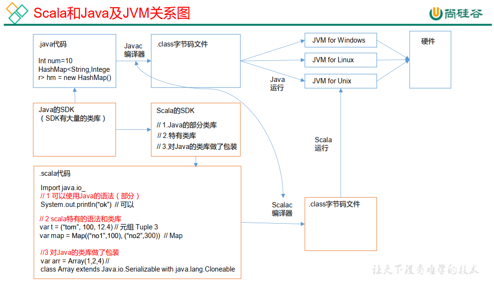
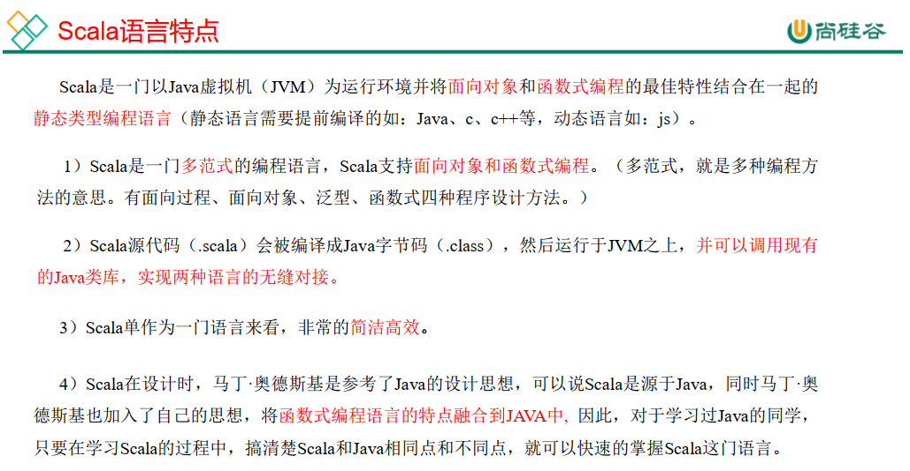
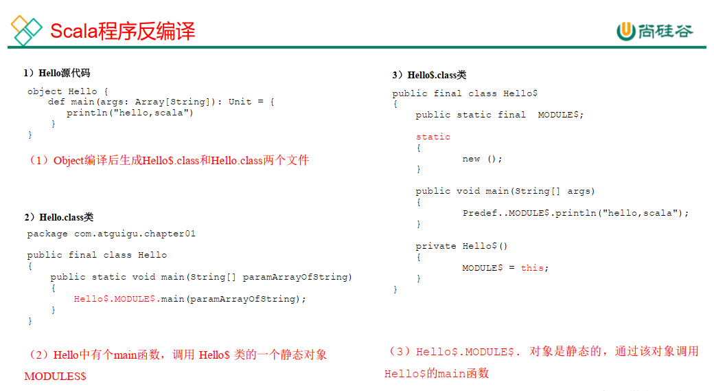
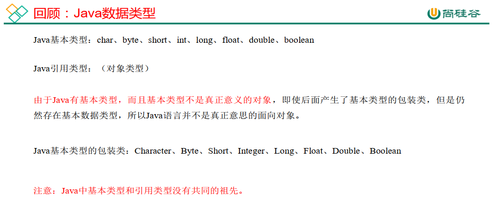
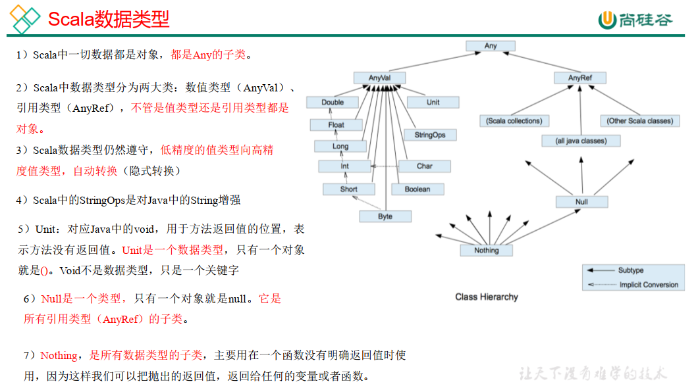
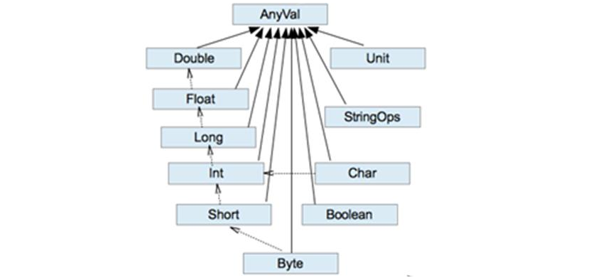
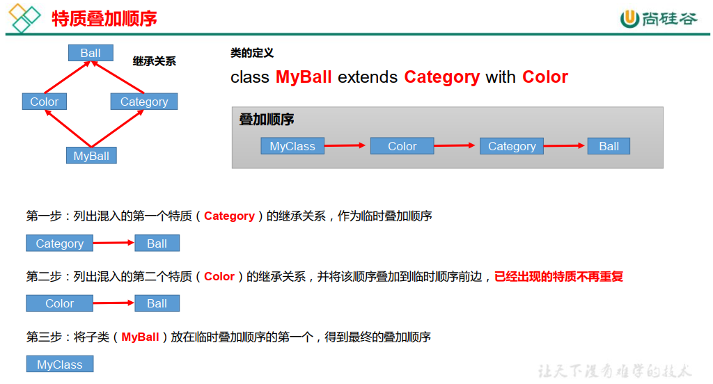
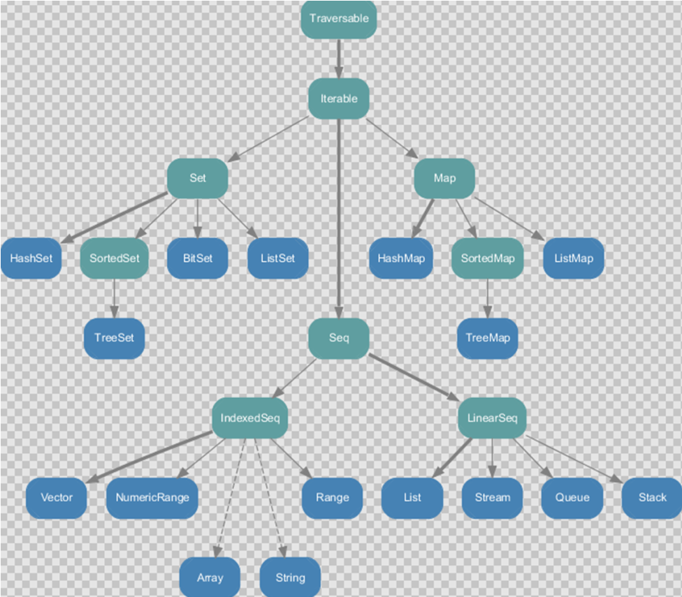
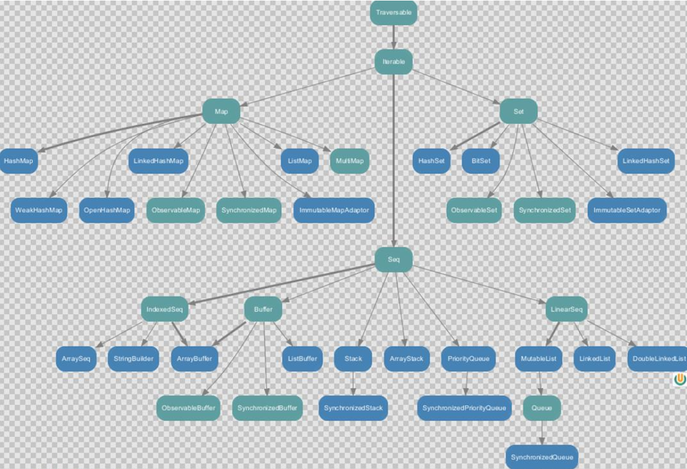

# Scala Notes

## Remark

- Java之父James Gosling说过“如果让我在Java之外选一门语言，我会选Scala”，它是面向对象 与函数式编程的完美融合。

## 第 1 章 Scala 入门  

### 概述  

- Scala 和 Java 关系  

  一般来说，学 Scala 的人，都会 Java，而 Scala 是基于 Java 的，因此我们需要将 Scala和 Java 以及 JVM 之间的关系搞清楚，否则学习 Scala 你会蒙圈。  



> Java可以说是一种半编译半解释型语言，先编译再解释。生成字节码文件后由JVM解释执行。

- Scala语言的特点



### Scala 环境搭建  

- 安装步骤  

  - （ 1）首先确保 JDK1.8 安装成功

  - （ 2）下载对应的 Scala 安装文件 scala-2.12.11.zip

  - （ 3）解压 scala-2.12.11.zip，我这里解压到 D:\Tools

  - （ 4）配置 Scala 的环境变量  

    > 注意 1：解压路径不能有任何中文路径，最好不要有空格。
    > 注意 2： 环境变量要大写 SCALA_HOME  

- 测试  

  - cmd
    - 》》scala      进去scala
    - 》》:quit      退出scala

- scalac编译  &  scala运行
  - scalac会编译出两个.class文件
    - HelloScala$.class
    - HelloScala.class

- IDEA 使用 Scala 语言
  - 创建Maven工程
  - 在src/main/创建scala文件夹，并标记为源文件（mark directory as Sources Root）
  - 给项目添加scala支持（Add Frameworks Support）
  - 创建 scala 类或者对象，写code

### 一些注记

- class 和 object 说明

  - Scala是一个完全面向对象的语言，所以没有静态语法，为了能调用静态语法（模仿静态语法），采用伴生对象单例的方式调用方法。

  - public修饰符，scala中没有public关键字，如果不声明访问权限，那么就是公开的

  - static修饰符，scala中没有静态语法，所以没有static关键字

  - void关键字，表示无返回值，但是不遵循面向对象语法，所以scala中没有，但是有Unit类型，表示无返回值

  - scala中定义方法：

    ```java
    * def 方法名称（参数名称：参数类型）：返回值 = {
    *   方法体
    * }
    ```

  - scala中方法实现赋值给方法声明，所以中间需要等号连接？？？？？？？？？？？？？？？？？？？

- Scala程序反编译



## 第 2 章 变量和数据类型

### 注释  

Scala 注释使用和 Java 完全一样  

- 代码规范

  - 1）使用一次 tab 操作，实现缩进，默认整体向右边移动，用 shift+tab 整体向左移

  - 2）或者使用 ctrl + alt + L 来进行格式化

  - 3）运算符两边习惯性各加一个空格。比如： 2 + 4 * 5。

  - 4）<span style='color:blue; font-weight:bold'>一行最长不超过 80 个字符</span>，超过的请使用换行展示，尽量保持格式优雅  

### 变量和常量（重点）

常量：在程序执行的过程中，其值不会被改变的变量  

- 回顾： Java 变量和常量语法  

  - 变量类型 变量名称 = 初始值 
    - `int a = 10`

  - final 常量类型 常量名称 = 初始值 
    - `final int b = 20`

- 1）scala基本语法

  - var 变量名 [: 变量类型] = 初始值 
    - `var i:Int = 10`

  - val 常量名 [: 常量类型] = 初始值 

    - `val j:Int = 20`

    > 注意： 能用常量的地方不用变量  

- 案例实操

  - 1）声明变量时，类型可以省略，编译器自动推导，即类型推导

  - 2）类型确定后，就不能修改，说明 Scala 是强数据类型语言。

  - 3）变量声明时，必须要有初始值

  - 4）在声明/定义一个变量时，可以使用 var 或者 val 来修饰， var 修饰的变量可改变，val 修饰的变量不可改。  
  - var 修饰的对象引用可以改变， val 修饰的对象则不可改变，但对象的状态（值）却是可以改变的。（比如：自定义对象、数组、集合等等）  

### 标识符的命名规范  

Scala 对各种变量、 方法、 函数等命名时使用的字符序列称为标识符。即： 凡是自己可以起名字的地方都叫标识符。  

- 1）命名规则      -        Scala 中的标识符声明，基本和 Java 是一致的，但是细节上会有所变化，有以下三种规则： 

  - 1）以字母或者下划线开头，后接字母、数字、下划线  

  - 2）以操作符开头，且只包含操作符（ + - * / # !等）

  - 3）用反引号\`....\`包括的任意字符串，即使是 Scala 关键字（ 39 个）也可以  

    ```scala
    package, import, class, object, trait, extends, with, type, for
    private, protected, abstract, sealed, final, implicit, lazy, override
    try, catch, finally, throw
    if, else, match, case, do, while, for, return, yield
    def, val, var
    this, super
    new
    true, false, null
    ```

    > \`....\`  反引号为：着重符号

-  2）案例实操  

  需求： 判断 hello、Hello12、1hello、h-b、x h、h_4、_ab、Int、 _、 +*-/#!、 +*-/#!1、 if、\`if\`，这些名字是否合法。

  ```java
  package chap002
  
  object Test03_Identifier {
    def main(args: Array[String]): Unit = {
      // （1）以字母或者下划线开头，后接字母、数字、下划线
      var hello: String = ""            // ok
      var Hello12: String = ""          // ok
      // var 1hello: String = ""        // error 数字不能开头
      // var h-b: String = ""           // error 不能用-
      // var x h: String = ""           // error 不能有空格
      var h_4: String = ""              // ok
      var _ab: String = ""              // ok
      var Int: String = ""              // ok 因为在 Scala 中 Int 是预定义的字符,不是关键字，但不推荐
      // var _: String = "hello"        // error 单独一个下划线不可以作为标识符，因为_被认为是一个方法
      println(_)
      //（2）以操作符开头，且只包含操作符（ + - * / # !等）
      var +*-/#! : String = ""          // ok
      // var +*-/#!1 : String = ""      // error 以操作符开头，必须都是操作符
  
      //（3）用反引号`....`包括的任意字符串，即使是 Scala 关键字（ 39 个）也可以
      // var if : String = ""           // error 不能用关键字
      var `if` : String = ""            // ok 用反引号`....`包括的任意字符串，包括关键字
    }
  }
  ```

### 字符串输出

- 1）基本语法

  - 1）字符串，通过+号连接

  - 2） printf 用法：字符串，通过%传值。

  - 3）字符串模板（插值字符串） ： 通过$获取变量值
    - println(s" ") 
    - println(f"") 
    - println(raw"") 
    - """  """  三引号表示字符串：保持多行字符串的原格式输出

- 2） 案例实操  

```java
package chap002

object Test04_String {
  def main(args: Array[String]): Unit = {
    // 1）字符串，通过+号连接
    val name = "li"
    val age = 18
    println(name + " : " + age)

    // 通过*号，将一个字符串复制多次连接
    println("li " * 3)
    println(name * 5)

    // 2） printf 用法：字符串，通过%传值
    printf("%d岁的%s在兰州大学学习", age, name)  // 没有换行符
    println()

    // 3）字符串模板（插值字符串） ： 通过$获取变量值
    println(s"${age}岁的${name}在兰州大学学习")

    val num : Double = 2.3456
    val num1 : Float = 1.4f
    // %8.2f 其中，f代表浮点数，.2代表保留两位小数，8代表数的总长度不能小于8，小了在前面用空格补齐
    println(f"The num is ${num}%8.2f")      // The num is     2.35
    println(raw"The num is ${num}%8.2f")    // The num is 2.3456%8.2f

    // 三引号表示字符串：保持多行字符串的原格式输出
    println(
      s"""
         |select *
         |from
         |  student
         |where
         |  name = ${name}
         |and
         |  age > ${age}
         |""".stripMargin)
  }
}
```

### 键盘输入

在编程中，需要接收用户输入的数据，就可以使用键盘输入语句来获取

- 基本语法  
  - StdIn.readLine()、 StdIn.readShort()、 StdIn.readDouble()  
- 案例实操

```java
package chap002

import scala.io.StdIn

object Test05_StdIn {
  def main(args: Array[String]): Unit = {
    // 信息的输入
    println("请输入您的大名：")
    val name : String = StdIn.readLine()
    println("请输入您的年龄：")
    val age : Int = StdIn.readInt()

    // 控制台打印输出
    println(s"$name 的年龄是 $age ")
    println(s"${name}的年龄是${age} ")
  }
}
```

### 文件输入输出（FileIO）

```java
package chap002

import java.io.{File, PrintWriter}
import scala.io.Source

object Test06_FileIO {
  def main(args: Array[String]): Unit = {
    // 从文件中读取数据
    Source.fromFile("src/main/resources/test.txt").foreach(print)

    // 将数据写入文件
    val writer = new PrintWriter(new File("src/main/resources/output.txt"))
    
    writer.write("hello, scala")

    writer.close()
  }

}
```

### 数据类型（重点）



> java中的基本数据类型和引用类型没有共同的祖先。



> Scala中一切数据都是对象，都是Any的子类
>
> 10 和 new User()   意义一样
>
> Nothing，

#### 整数类型（ Byte、 Short、 Int、 Long）

- 整型分类

  | 数据类型  | 描述                                                         |
  | --------- | ------------------------------------------------------------ |
  | Byte [1]  | 8 位有符号补码整数。数值区间为 -128 到 127                   |
  | Short [2] | 16 位有符号补码整数。数值区间为 -32768 到 32767              |
  | Int [4]   | 32 位有符号补码整数。数值区间为 -2147483648 到 2147483647    |
  | Long [8]  | 64 位有符号补码整数。数值区间为 -9223372036854775808 到 9223372036854775807 = 2 的(64-1)次方-1 |

  > 之所以采用补码进行有符号数的表示，做加减法的时候可以统一起来。
  >
  > 原码
  >
  > 反码
  >
  > 补码

- 案例实操  
  - Scala 各整数类型有固定的表示范围和字段长度，不受具体操作的影响，以保证Scala 程序的可移植性。  
  - Scala 的整型，默认为 Int 型，声明 Long 型，须后加‘l’或‘L’  
  - Scala 程序中变量常声明为 Int 型，除非不足以表示大数，才使用 Long  

#### 浮点类型（ Float、 Double）

- 浮点型分类  

| 数据类型   | 描述                               |
| ---------- | ---------------------------------- |
| Float [4]  | 32 位, IEEE 754 标准的单精度浮点数 |
| Double [8] | 64 位 IEEE 754 标准的双精度浮点数  |

- 案例实操  
  - Scala 的浮点型常量默认为 Double 型，声明 Float 型常量，须后加‘f’或‘F’。  

#### 布尔类型： Boolean

- 基本说明

  - 1）布尔类型也叫 Boolean 类型， Booolean 类型数据只允许取值 true 和 false

  - 2） boolean 类型占 1 个字节。  

- 案例实操

  ```scala
  val isTrue: Boolean = ture
  ```

#### 字符类型（ Char）

- 字符类型可以表示单个字符，字符类型是 Char。  

- 案例实操  

  - 1）字符常量是用单引号 ' ' 括起来的单个字符。
  - 2）`\t` ：一个制表位，实现对齐的功能
  - 3）`\n` ：换行符 
  - 4）`\\ `：表示\
  - 5）`\" `：表示"  

  ```scala
  // 字符变量保存时，底层以Ascii码存储
  val c2: Char = ('a' + 1).toChar
  println(c2)
  ```

#### Unit 类型、 Null 类型和 Nothing 类型（重点）

- 基本说明  

  | 数据类型 | 描述                                                         |
  | -------- | ------------------------------------------------------------ |
  | Unit     | 表示无值，和其他语言中 void 等同。用作不返回任何结果的方法的结果 类型。<br> Unit 只有一个实例值，写成()。 |
  | Null     | null , Null 类型只有一个实例值 null                          |
  | Nothing  | Nothing 类型在 Scala 的类层级最低端；它是任何其他类型的子类型。 <br/>当一个函数，我们确定没有正常的返回值，可以用 Nothing 来指定返回类型，<br/>这样有一个好处，就是我们可以把返回的值（异常）赋给其它的函数 或者变量（兼容性） |

- 案例实操

  - 1） Unit 类型用来标识过程，也就是没有明确返回值的函数。
    由此可见， Unit 类似于 Java 里的 void。 Unit 只有一个实例：()，这个实例也没有实质意义。

    ```scala
    // Unit 表示没有返回值，即 void
    def sayOk(): Unit = {  
        println("sayOk执行")
    }
    
    val unit = sayOk()  // 返回值是：()
    println(unit)
    ```

  - 2） Null 类只有一个实例对象， Null 类似于 Java 中的 null 引用。 Null 可以赋值给任意引用类型（ AnyRef），但是不能赋值给值类型（ AnyVal）。

    ```scala
    // null 可以赋值给任意引用类型（AnyRef），但是不能赋值给值类型（AnyVal）
    // val n9: Int = null  // 错误
    
    var student: Student = new Student("li", 12)
    student = null
    println(student)  // 输出为null
    ```

  - Nothing，可以作为没有正常返回值的方法的返回类型，非常直观的告诉你这个方法不会正常返回，而且由于 Nothing 是其他任意类型的子类，他还能跟要求返回值的方法兼容。

    ```scala
    // Nothing
    def test(): Nothing = {
        throw new NullPointerException()
    }
    
    def test1(n: Int): Int = {
        if (n == 0) {
            throw new NullPointerException()
        } else {
            return n
        }
    }
    
    val n9: Int = test1(5)
    println(n9)
    ```

### 类型转换

- java 中的类型转换

  ```java
  public class Test_DataTypeConversion {
      public static void main(String[] args) {
          byte b = 10;
          test(b);
          // 1 隐式转换
          // byte --> short --> char --> int --> long --> float --> double 
          // byte --> short --> int --> long --> float --> double 
          // char --> int
          // 2 强制转换 ：精度大的数据类型 --> 精度小的数据类型
          // 在能转的前提下，(数据类型)变量
          // 强制转换，可能会造成精度降低或溢出
      }
  
      public static void test(int i) {
          System.out.println("iiiii");
      }
  
      public static void test(short s) {
          System.out.println("sssss");
      }
  
      public static void test(byte b) {
          System.out.println("bbbbb");
      }
  
      public static void test(long l) {
          System.out.println("lllll");
      }
  
      public static void test(float f) {
          System.out.println("fffff");
      }
  
      public static void test(double d) {
          System.out.println("ddddd");
      }
  
      public static void test(char c) {
          System.out.println("ccccc");
      }
  }
  ```

  > 基本数据类型之间是存在固定的转换规则的，现总结以下 6 条规则，无论是哪个程序，将这 6 个规则套用进去，问题迎刃而解：
  >
  > - 八种基本数据类型中，除 boolean 类型不能转换，剩下七种类型之间都可以进行转换；
  > - 如果整数型字面量没有超出 byte,short,char 的取值范围，可以直接将其赋值给byte,short,char 类型的变量；
  > - 小容量向大容量转换称为<span style="color:blue; font-weight:bold">自动类型转换</span>，容量从小到大的排序为： byte < short(char) <int < long < float < double， 其中 short 和 char 都占用两个字节，但是 <span style="color:blue; font-weight:bold">char 可以表示更大的正整数；</span>
  > - 大容量转换成小容量，称为<span style="color:blue; font-weight:bold">强制类型转换</span>，编写时必须添加“强制类型转换符”，但运行时可能出现精度损失，谨慎使用；
  > - byte,short,char 类型混合运算时，先各自转换成 int 类型再做运算；
  > - 多种数据类型混合运算，各自先转换成容量最大的那一种再做运算；  

- scala 中数据类型转换 - 隐式转换

  当 Scala 程序在进行赋值或者运算时，精度小的类型自动转换为精度大的数值类型，这个就是自动类型转换（隐式转换）。数据类型按精度（容量）大小排序为：  

  

  > 虚线表示可以隐式转换

  - 基本情况
    - 1）自动提升原则：有多种类型的数据混合运算时，首先自动将所有数据转换成精度大的那种数据类型，然后再进行计算。
    - 2）把<span style='color:blue; font-weight:bold'>精度大的数值类型</span>赋值给<span style='color:blue; font-weight:bold'>精度小的数值类型</span>时，就会<span style='color:red; font-weight:bold'>报错</span>，反之就会进行<span style='color:blue; font-weight:bold'>自动类型转换</span>。
    - 3）（byte， short）和 char 之间不会相互自动转换。
    - 4）byte， short， char 他们三者可以计算， 在计算时首先转换为 int 类型。
      -  <span style='color:red; font-weight:bold'>即使是byte， short进行计算，也是转换成int，再计算。</span>

  - 案例实操

    ```scala
    ```

    > 注意： Scala 还提供了非常强大的隐式转换机制（隐式函数，隐式类等），我们放在高级部分专门用一个章节来讲解。  

- scala 中的强制类型转换  

  - 基本情况

    自动类型转换的逆过程（将精度大的数值类型转换为精度小的数值类型）要加上强制转函数，但<span style='color:blue; font-weight:bold'>可能造成精度降低或溢出</span>。

    ```scala
    Java  : int num = (int)2.5
    Scala : var num : Int = 2.7.toInt
    ```

  - 案例实操

    - 1）将数据由高精度转换为低精度，就需要使用到强制转换
    - 2）强转符号只针对于最近的操作数有效，往往会使用小括号提升优先级  

    ```scala
    // 浮点数强转整数，只保留整数部分
    val n1 = 2.9.toByte
    println(n1)
    
    //
    val n2 = 2.8.toInt + 3.9.toInt
    println(n2)
    val n3 = (2.8 + 3.9).toInt
    println(n3)
    ```

- <span style='color:blue; font-weight:bold'>数值类型和 String 类型间转换</span>

  - 基本情况

    - 在程序开发中，我们经常需要将基本数值类型转成 String 类型。或者将 String 类型转成基本数值类型。  

  - 案例实操

    - 1）基本类型转 String 类型（语法： 将基本类型的值+"" 即可）
    - 2） String 类型转基本数值类型（语法： s1.toInt、 s1.toFloat、 s1.toDouble、 s1.toByte、s1.toLong、 s1.toShort）

    ```scala
    // 数值类型和String类型 转换
    // 1 数值 --> String
    val s: String = "256"
    println(s)
    // 2 String --> 数值
    val n4: Int = "25".toInt
    // "12.3" 只能转成float double
    val n5: Int = "12.3".toDouble.toInt
    println(n5)
    ```

  - 注意事项

    - 在将 String 类型转成基本数值类型时，要确保 String 类型能够转成有效的数据，比如我们可以把"123"，转成一个整数，但是不能把"hello"转成一个整数。

      ```
      var n5:Int = "12.6".toInt 会出现 NumberFormatException 异常。
      ```

- 强转溢出面试题

  ```scala
  // 面试题
  val n: Int = 128
  val b: Byte = n.toByte
  
  println(b)
  /*
  128
  原码：0000 0000 0000 0000 0000 0000 1000 0000
  补码：0000 0000 0000 0000 0000 0000 1000 0000
  n.toByte 直接截取补码： 1000 0000   没有原码，规定为 -128
  
  130 
  原码：0000 0000 0000 0000 0000 0000 1000 0010
  补码：0000 0000 0000 0000 0000 0000 1000 0010
  n.toByte 直接截取补码： 1000 0010  
  （负数）补码-1 是 反码： 1000 0001
  （负数）取反  是  原码： 1111 1110 为 2+4+8+16+32+64 为 -126  （符号位不变）
  
  n.toByte 直接截取补码： 1000 0010  
  （负数）取反+1 是 原码： 1111 1110 为 2+4+8+16+32+64 为 -126  （符号位不变）
  
  总结 ： 原码 <-- 取反 + 1 --> 补码
  
  300
  原码：0000 0000 0000 0000 0000 0001 0010 1100
  补码：0000 0000 0000 0000 0000 0001 0010 1100
  n.toByte 直接截取补码： 0010 1100  
  （正数）补码  是  反码： 0010 1100
  （正数）反码  是  原码： 0010 1100 为 4+8+32 为 44  （符号位不变）
  
  总结：
  正数的反码，补码都是其本身
  负数：反码，符号位不变，其他位取反；补码，反码+1
  */
  ```

## 第 3 章 运算符

Scala 运算符的使用和 Java 运算符的使用基本相同， 只有个别细节上不同。  

### 算术运算符  

- 基本语法  

  | 运算符 | 运算       | 范例       | 结果    |
  | ------ | ---------- | ---------- | ------- |
  | +      | 正号       | +3         | 3       |
  | -      | 负号       | b=4; -b    | -4      |
  | +      | 加         | 5+5        | 10      |
  | -      | 减         | 6-4        | 2       |
  | *      | 乘         | 3*4        | 12      |
  | /      | 除         | 5/5        | 1       |
  | %      | 取模(取余) | 7%5        | 2       |
  | +      | 字符串相加 | “He”+”llo” | “Hello” |

  - 1）对于除号“/”，它的整数除和小数除是有区别的：<span style='color:blue; font-weight:bold'>整数之间做除法时，只保留整数部分而舍弃小数部分。</span>
  - 2）对一个数取模 a%b，和 Java 的取模规则一样。  

### 关系运算符（比较运算符）

- 基本语法

  | 运算符 | 运算     | 范例   | 结果  |
  | ------ | -------- | ------ | ----- |
  | ==     | 相等于   | 4==3   | false |
  | !=     | 不等于   | 4！ =3 | true  |
  | <      | 小于     | 4<3    | false |
  | >      | 大于     | 4>3    | true  |
  | <=     | 小于等于 | 4<=3   | false |
  | >=     | 大于等于 | 4>=3   | true  |

-  Java 和 Scala 中关于==的区别  

  - Java：
    - ==比较两个变量本身的值，即两个对象在内存中的首地址(内存地址)；
    - equals 比较字符串中所包含的内容是否相同。 

  ```java
  public class TestOperator {
      public static void main(String[] args) {
          String s1 = "123";  // 存在字符串常量池中
          String s2 = new String("123");  // 对象在堆中，指向字符串常量池中
  
          System.out.println(s1 == s2);       // false
          System.out.println(s1.equals(s2));  // true
      }
  }
  ```

  - Scala：
    -  ==更加类似于 Java 中的 equals， 参照 jd 工具  

  ```scala
  // 2 比较运算符
  val str1 = new String("123")
  val str2 = new String("123")
  
  println(str1 == str2)        // true
  println(str1.equals(str2))   // true
  println(str1.eq(str2))       // false 判断的引用地址
  ```

  > scala中的`==`是调用了equals()方法，所以要重写了equals()方法之后，才能使用`==`

### 逻辑运算符

- 基本语法

  用于连接多个条件（一般来讲就是关系表达式），最终的结果也是一个 Boolean 值。

  假定：变量 A 为 true， B 为 false  

  | 运算符 | 描述   | 实例                       |
  | ------ | ------ | -------------------------- |
  | &&     | 逻辑与 | (A && B) 运算结果为 false  |
  | \|\|   | 逻辑或 | (A \|\| B) 运算结果为 true |
  | !      | 逻辑非 | !(A && B) 运算结果为 true  |

  > 逻辑运算符有短路的特性
  >
  > 位运算符没有这种特性

- 案例实操

  ```scala
  // 3 逻辑运算符  
  // --------------扩展避免逻辑与空指针异常---------------
  // 判断一个字符串是否为空
  // 空白字符也看作一个空字符串
  def isNotEmpty(s: String): Boolean = {
      // return !(s == "")
      // return !("".equals(s))
      // return !("".equals(s.trim()))
      return s != null && !("".equals(s.trim()))
  }
  
  val sss: String = "123"
  println(isNotEmpty(sss))
  ```

### 赋值运算符

- 基本语法

  赋值运算符就是将某个运算后的值，赋给指定的变量。  

  | 运算符 | 描述                                           | 实例                                  |
  | ------ | ---------------------------------------------- | ------------------------------------- |
  | =      | 简单的赋值运算符，将一个表达式的值赋给一个左值 | C = A + B 将 A + B 表达式结果赋值给 C |
  | +=     | 相加后再赋值                                   | C += A 等于 C = C + A                 |
  | -=     | 相减后再赋值                                   | C -= A 等于 C = C - A                 |
  | *=     | 相乘后再赋值                                   | C *= A 等于 C = C * A                 |
  | /=     | 相除后再赋值                                   | C /= A 等于 C = C / A                 |
  | %=     | 求余后再赋值                                   | C %= A 等于 C = C % A                 |
  | <<=    | 左移后赋值                                     | C <<= 2 等于 C = C << 2               |
  | >>=    | 右移后赋值                                     | C >>= 2 等于 C = C >> 2               |
  | &=     | 按位与后赋值                                   | C &= 2 等于 C = C & 2                 |
  | ^=     | 按位异或后赋值                                 | C ^= 2 等于 C = C ^ 2                 |
  | \|=    | 按位或后赋值                                   | C \|= 2 等于 C = C \| 2               |

  > 注意： Scala 中没有++、 --操作符，可以通过+=、 -=来实现同样的效果； 

  ```scala
  // 4 赋值运算符
  var n3: Int = 10
  n3 += 1       // 没有++
  println(n3)
  n3 -= 1       // 没有--
  println(n3)
  ```

  - java 语言中

    ```java
    byte b = 10;
    b = b + 1; // 报错 因为b是byte，但1默认是int，所以计算时，先将b隐式转换成了int，再计算，所以不能再赋值给byte的b
               // 解决方案，用强转
    b += 1;    // 正确  这种写法，默认会做强转
    
    
    // java中++的运算机制-------------------------------------领会----------------------------
    int x = 23;
    x = x++;
    // 1 int temp = x++;
    // 2 x++
    // 3 x = temp
    System.out.println(x); // 23
    
    x = 15;
    y = x++;
    // 1 temp = x++
    // 2 x++
    // 3 y = temp
    ```

### 位运算符

- 基本语法

  下表中变量 a 为 60， b 为 13。  

  | 运算符 | 描述           | 实例                                                         |
  | ------ | -------------- | ------------------------------------------------------------ |
  | &      | 按位与运算符   | (a & b) 输出结果 12 ，二进制解释： 0000 1100                 |
  | \|     | 按位或运算符   | (a \| b) 输出结果 61 ，二进制解释： 0011 1101                |
  | ^      | 按位异或运算符 | (a ^ b) 输出结果 49 ，二进制解释： 0011 0001                 |
  | ~      | 按位取反运算符 | (~a ) 输出结果 -61 ，二进制解释： 1100 0011， 在 一个有符号二进制数的补码形式。 |
  | <<     | 左移动运算符   | a << 2 输出结果 240 ，二进制解释： 0011 0000                 |
  | >>     | 右移动运算符   | a >> 2 输出结果 15 ，二进制解释： 0000 1111                  |
  | >>>    | 无符号右移     | a >>>2 输出结果 15, 二进制解释: 0000 1111                    |

  > <span style='color:blue; font-weight:bold'>带符号右移>>：最高位补1</span>
  >
  > <span style='color:blue; font-weight:bold'>无符号右移>>>：最高位补0</span>

- 案例实操

  ```scala
  val a: Int = -99
  // 原码：10000000 00000000 00000000 01100011 1+2+32+64 = -99
  // 左移<<
  // 补码：11111111 11111111 11111111 10011101
  // 左移：11111111 11111111 11111111 00111010 - 补码
  // 原码：10000000 00000000 00000000 11000110 - 128+64+4+2 = -198
  println(a << 1)
  
  // 带符号右移>>
  // 补码：11111111 11111111 11111111 10011101
  // 右移：11111111 11111111 11111111 11001110 - 补码
  // 原码：10000000 00000000 00000000 00110010 - 2+16+32 = -50
  
  println(a >> 1)
  // 无符号右移>>>
  // 补码：11111111 11111111 11111111 10011101
  // 右移：01111111 11111111 11111111 11001110 - 补码
  // 原码：01111111 11111111 11111111 11001110 - 2147483598
  println(a >>> 1)
  
  val c: Int = 99
  // 原码：00000000 00000000 00000000 01100011 1+2+32+64 = 99
  // 左移<<
  // 原码：00000000 00000000 00000000 11000110 - 128+64+4+2 = 198
  println(c << 1)
  
  // 带符号右移>>
  // 原码：00000000 00000000 00000000 00110001 - 1+16+32 = 49
  
  println(c >> 1)
  // 无符号右移>>>
  // 原码：00000000 00000000 00000000 00110001 - 1+16+32 = 49
  println(c >>> 1)
  ```

### Scala 运算符本质

在 Scala 中其实是没有运算符的， 所有运算符都是方法。

- 1） 当调用对象的方法时，点.可以省略
- 2） 如果函数参数只有一个，或者没有参数， ()可以省略  

```scala
// 5 scala运算符本质
// 标准的加法运算
val i:Int = 1 .+ (1)
// 1）当调用对象的方法时，.可以省略
val j:Int = 1 + (1)
// 2）如果函数参数只有一个，或者没有参数， ()可以省略
val k:Int = 1 + 1
println(1.toString())
println(1 toString())
println(1 toString)
```

## 第 4 章 流程控制

### 分支控制 if-else  

- P34-36  没有看

让程序有选择的的执行，分支控制有三种：单分支、双分支、多分支  

- 单分支

  - 基本语法

    ```scala
    if (条件表达式) {
    	执行代码块
    }
    ```

    > 说明：当条件表达式为 ture 时，就会执行{ }的代码。  

- 双分支

  - 基本语法

    ```scala
    if (条件表达式) {
    	执行代码块 1
    } else {
    	执行代码块 2
    }
    ```

- 多分支

  - 基本语法

    ```scala
    if (条件表达式 1) {
    	执行代码块 1
    } else if (条件表达式 2) {
    	执行代码块 2
    }
    	……
    else {
    	执行代码块 n
    }
    ```

  - 案例实操

    ```scala
    // 1）需求 1： 需求：输入年龄，如果年龄小于 18 岁，则输出“童年”。如果年龄大于等于 18 且小于等于 30， 则输出“中年”，否则，输出“老年”。
    
    // 2）需求 2： Scala 中 if else 表达式其实是有返回值的，具体返回值取决于满足条件的代码体的最后一行内容。
    
    // 3）需求 3： Scala 中返回值类型不一致，取它们共同的祖先类型。
    
    // 4）需求 4： Java 中的三元运算符可以用 if else 实现
    // 如果大括号{}内的逻辑代码只有一行，大括号可以省略。 如果省略大括号， if 只对最近的一行逻辑代码起作用。
    ```

### 嵌套分支

在一个分支结构中又完整的嵌套了另一个完整的分支结构，里面的分支的结构称为内层。分支外面的分支结构称为外层分支。

<span style='color:blue; font-weight:bold'>嵌套分支不要超过 3 层。</span>

- 基本语法

  ```scala
  if () {
      if () {
          
      } else {
          
      }
  }
  ```

- 案例实操

  ```scala
  // 需求： 如果输入的年龄小于 18， 返回“童年”。 如果输入的年龄大于等于 18， 需要再判断： 如果年龄大于等于 18 且小于 30， 返回“中年”； 如果其他，返回“老年”。
  
  ```

### Switch 分支结构  

- 在 Scala 中没有 Switch，而是使用<span style='color:blue; font-weight:bold'>模式匹配</span>来处理。
- 模式匹配涉及到的知识点较为综合，因此我们放在后面讲解。  

### For 循环控制

Scala 也为 for 循环这一常见的控制结构提供了非常多的特性，这些 for 循环的特性被称为 for 推导式或 for 表达式。  

- 范围数据循环（ To） 

  - 基本语法  

    ```scala
    for(i <- 1 to 3){
    	print(i + " ")
    }
    
    // 倒序遍历
    for(i <- 1 to 3 reverse){
    	print(i + " ")
    }
    ```

    - `1 to 3` ：1 2 3 前闭后闭
    - reverse ：反向遍历

- 范围数据循环（ until）

  - 基本语法

    ```scala
    for(i <- 1 until 3){
    	print(i + " ")
    }
    ```

    - `1 until 3` ：1 2 前闭后开

- <span style='color:blue; font-weight:bold'>循环守卫</span>

  - 基本语法  -  加上了if判断

    ```scala
    for(i <- 1 to 3 if i != 2) {
    	print(i + " ")
    }
    ```

    - `1 to 3 if i != 2` ：1 3 根据判断执行循环，(i不等于2时执行)

- 循环步长

  - 基本语法

    ```scala
    for (i <- 1 to 10 by 2) {
    	println("i=" + i)
    }
    
    // 半步遍历
    for (i <- 1.0 to 3.0 by 0.5) {
        print(i + " ")
    }
    ```

    - 说明： by 表示步长  
    - `1 to 10 by 2` : 1 3 5 7 9 

- 嵌套循环

  - 基本语法

    ```scala
    for(i <- 1 to 3; j <- 1 to 3) {
    	println(" i =" + i + " j = " + j)
    }
    
    // 等价于
    for (i <- 1 to 3) {
        for (j <- 1 to 3) {
            println("i =" + i + " j=" + j)
        }
    }
    ```

    - 说明： 没有关键字，所以范围后一定要加 `;` 来隔断逻辑  

    - 打印九九乘法表：

      ```scala
      for (i <- 1 to 9){
          for ( j <- 1 to i){
              print(s"${j}x${i}=${i*j}" + "\t")
          }
          println()
      }
      // 简写
      for (i <- 1 to 9; j <- 1 to i){
          print(s"${j}x${i}=${i*j}\t")
          if (i == j) println()
      }
      ```

- 引入变量

  - 基本语法

    ```scala
    for(i <- 1 to 3; j = 4 - i) {
    	println("i=" + i + " j=" + j)
    }
    ```

    - 1） for 推导式一行中有多个表达式时，所以要加 ; 来隔断逻辑

    - 2） for 推导式有一个不成文的约定：当 for 推导式仅包含单一表达式时使用圆括号，当包含多个表达式时，一般每行一个表达式，并用花括号代替圆括号，如下  

      ```scala
      for {
          i <- 1 to 3
          j = 4 - i
      } {
      	println("i=" + i + " j=" + j)
      }
      ```

- 综合联系

  ```scala
  // 打印九层妖塔
  val n: Int = 9
  for (i <- 1 to n) {
      println(" " * (n - i) + "*" * (2 * i - 1))
  }
  ```

- 循环返回值

  - 基本语法

    - scala中的for循环默认返回空`()`

    ```scala
    val res = for(i <- 1 to 10){
        循环体
    } 
    println(res)  // ()
    
    val res = for(i <- 1 to 10) yield i
    println(res)
    ```

    - 说明：将遍历过程中处理的结果返回到一个新Vector 集合中，使用 `yield` 关键字  
    - <span style='color:blue; font-weight:bold'>注意：开发中很少使用。</span>

- 倒序打印

  - 说明：如果想倒序打印一组数据，可以用 `reverse`。  

    ```scala
    // 倒序遍历
    for(i <- 1 to 3 reverse){
    	print(i + " ")
    }
    ```


### While 和 do..While 循环控制

<span style='color:blue; font-weight:bold'>Scala 中的While 和 do..While 的使用和 Java 语言中用法相同。</span>

<span style='color:red; font-weight:bold'>scala中不推荐使用while do...while</span>

### 循环中断

- 基本说明

  Scala 内置控制结构特地<span style='color:blue; font-weight:bold'>去掉</span>了 <span style='color:red; font-weight:bold'>break</span> 和 <span style='color:red; font-weight:bold'>continue</span>， 是为了更好的适应<span style='color:blue; font-weight:bold'>函数式编程</span>， 推荐使用函数式的风格解决break和continue的功能，而不是一个关键字。 Scala中使用<span style='color:red; font-weight:bold'>breakable</span>控制结构来实现 break 和 continue 功能。  

- 案例实操  

  ```scala
  // 需求 1： 采用异常的方式退出循环
  
  //需求 2： 采用 Scala 自带的函数，退出循环
  
  // 需求 3： 对 break 进行省略
  
  // 需求 4：循环遍历 10 以内的所有数据，奇数打印，偶数跳过（ continue）
  
  ```
  
  > 

### 多重循环

- 基本说明

  - 1）将一个循环放在另一个循环体内，就形成了嵌套循环。其中， for， while， do…while均可以作为外层循环和内层循环。<span style='color:blue; font-weight:bold'>【建议一般使用两层，最多不要超过 3 层】</span>

  - 2）设外层循环次数为 m 次，内层为 n 次，则内层循环体实际上需要执行 m*n 次  

- 案例实操

  ```scala
  // 打印九九乘法表
  for (i <- 1 to 9){
      for ( j <- 1 to i){
          print(s"${j}x${i}=${i*j}" + "\t")
      }
      println()
  }
  ```

## 第 5 章 函数式编程

- 0） 面向过程编程
  - 程序执行起来效率更高
  - 

- 1） 面向对象编程
  - 解决问题，分解对象，行为，属性，然后通过对象的关系以及行为的调用来解决问题。

  - 对象： 用户

  - 行为：登录、连接 JDBC、读取数据库

  - 属性：用户名、密码  

  - <span style='color:blue; font-weight:bold'>Scala 语言是一个完全面向对象编程语言</span>。万物皆对象

  - <span style='color:blue; font-weight:bold'>对象的本质</span>：对数据和行为的一个封装
- 2）函数式编程
  - 解决问题时，将问题分解成一个一个的步骤，将每个步骤进行封装（函数），通过调用这些封装好的步骤，解决问题。

  - 例如： 请求->用户名、密码->连接 JDBC->读取数据库

  - <span style='color:blue; font-weight:bold'>Scala 语言是一个完全函数式编程语言</span>。 万物皆函数。

  - <span style='color:blue; font-weight:bold'>函数的本质</span>：函数可以当做一个值进行传递
- 3）在 Scala 中函数式编程和面向对象编程完美融合在一起了。  

### 函数基础

- 函数基本语法  

  ```scala
  def fun_name (x: Int, y: String): String = {
      函数体
  }
  ```

- 函数和方法的区别  

  - 核心概念

    - 1）为完成某一功能的程序语句的集合，称为<span style='color:blue; font-weight:bold'>函数</span>。

    - 2）类中的函数称之<span style='color:blue; font-weight:bold'>方法</span>。  

    > 对象内部定义叫方法
    >
    > 主函数内部定义的叫函数

  - 案例实操

    - 1）Scala 语言可以在任何的语法结构中声明任何的语法

    - 2）<span style='color:blue; font-weight:bold'>函数没有重载和重写的概念</span>；方法可以进行重载和重写

    - 3）Scala 中函数可以嵌套定义  

- 函数定义

  - 基本说明

    - 1）函数 1：无参，无返回值

    - 2）函数 2：无参，有返回值

    - 3）函数 3：有参，无返回值

    - 4）函数 4：有参，有返回值

    - 5）函数 5：多参，无返回值

    - 6）函数 6：多参，有返回值  

  - 案例实操

  ```scala
  
  ```

- 函数参数

  - 1）可变参数
  - 2）如果参数列表中存在多个参数，那么可变参数一般放置在最后
  - 3）参数默认值，一般将有默认值的参数放置在参数列表的后面
  - 4）带名参数  

  ```scala
  package chap005
  
  object Test02_FunctionParameter {
    def main(args: Array[String]): Unit = {
      // 1）可变参数
      def fun1(s: String*): Unit = {
        println(s)
      }
  
      // 2）如果参数列表中存在多个参数，那么可变参数一般放置在最后
      def fun2(name: String, age: Int*): Unit = {
        println(s"name $name , age $age")
      }
  
      // 3）参数默认值，一般将有默认值的参数放置在参数列表的后面
      def fun3(name: String, age: Int = 20): Unit = {
        println(s"$name 已经 $age 岁了")
      }
  
      // 4）带名参数 : 传参数时，不用考虑位置（关键字传参） vs 位置传参
      fun3(age = 10, name = "li")
  
      fun1("kk", "fdf")
  
      fun2("job")
      fun2("jon", 10,12,14,15,17)
  
      fun3("tom")
      fun3("bob")
      fun3("son", 80)  // 默认值参数，一旦传入了实际参数，则默认值会被覆盖。
    }
  }
  ```

- <span style='color:blue; font-weight:bold'>函数至简原则（重点） </span>

  函数至简原则：能省则省  

  - 至简原则细节  
    - 1） return 可以省略， Scala 会使用函数体的最后一行代码作为返回值
    - 2）如果函数体只有一行代码，可以省略花括号
    - 3）返回值类型如果能够推断出来，那么可以省略（ :和返回值类型一起省略）
    - 4）如果有 return，则不能省略返回值类型，必须指定
    - 5）如果函数明确声明 unit，那么即使函数体中使用 return 关键字也不起作用
    - 6） Scala 如果期望是无返回值类型，可以省略等号
    - 7）如果函数无参，但是声明了参数列表，那么调用时，小括号，可加可不加
    - 8）如果函数没有参数列表，那么小括号可以省略，调用时小括号必须省略
    - 9）如果不关心名称，只关心逻辑处理，那么函数名（ def）可以省略  

  ```scala
  package chap005
  
  object Test04_SimplifyFunction {
    def main(args: Array[String]): Unit = {
  
      def fun1(name: String): String = {
        return name
      }
  
      // 1） return 可以省略， Scala 会使用函数体的最后一行代码作为返回值
      def fun2(name: String): String = {
        val age: Int = 10
        println(s"$name + $age ")
        name
      }
  
      // 2）如果函数体只有一行代码，可以省略花括号
      def fun3(name: String): String = name
  
      // 3）返回值类型如果能够推断出来，那么可以省略（ :和返回值类型一起省略）
      def fun4(name: String) = name
  
      def fun5(name: String) = {
        val age: Int = 10
        println(s"$name + $age ")
        name
      }
  
      // 4）如果有 return，则不能省略返回值类型，必须指定
      // def fun6(name: String) = return name   // 报错，有return，要写返回值类型
  
      // 5）如果函数明确声明 unit，那么即使函数体中使用 return 关键字也不起作用
      def fun7(name: String): Unit = {
        val age: Int = 10
        println(s"$name + $age ")
        return name // 不起作用 返回值就是一个()
      }
  
      // 6） Scala 如果期望是无返回值类型，可以省略等号
      def fun8(name: String) {   // 也称作为：过程
        val age: Int = 10
        println(s"$name + $age ")
      }
  
      // 7）如果函数无参，但是声明了参数列表，那么调用时，小括号，可加可不加
      def fun9() {   // 也称作为：过程
        val age: Int = 10
        println(s" $age ")
      }
      fun9
      fun9()
  
      // 8）如果函数没有参数列表，那么小括号可以省略，调用时小括号必须省略
      def fun10 {   // 也称作为：过程
        val age: Int = 10
        println(s" $age ")
      }
      fun10   // 必须省略()
  
      // 9）如果不关心名称，只关心逻辑处理，那么函数名（def）可以省略
      def fun11(name: String) {
        val age: Int = 10
        println(s"$name + $age ")
      }
      // 匿名函数  java中得lambda表达式就是借鉴的这里
      (name: String) => {
        val age: Int = 10
        println(s"$name + $age ")
      }
    }
  }
  ```

### 函数高级

- 高阶函数  

  - 1）函数可以作为值进行传递  

  - 2）函数可以作为参数进行传递

  - 3）函数可以作为函数返回值返回  

  ```scala
  package chap005
  
  object Test06_HighOrderFunction {
    def main(args: Array[String]): Unit = {
      // 定义一个有参函数
      def fun1(n: Int): Int = {
        println("fun1调用。。。。")
        n + 1
      }
  	// 定义一个无参函数
      def fun2(): Int = {
        println("fun2调用。。。。")
        1
      }
  
      // 1）函数可以作为值进行传递
      // 第一种方法：
      val fun3 = fun1 _
      // 第二种方法：
      val fun4: Int => Int = fun1
      val fun5: () => Int = fun2
  
      // 2）函数可以作为参数进行传递
      val op = (a: Int, b: Int) => a + b
      def dualEval(op: (Int, Int) => Int, a: Int, b: Int): Int = op(a, b)
      // 调用
      println(dualEval(op, 2, 4))
      println(dualEval((a, b) => a + b, 2, 4))
      println(dualEval(_+_, 2, 4))
  
      // 3）函数可以作为函数返回值返回
      // 第一种方法：
      def fun6()={
        def fun7(a:Int):Unit ={
          println("fun7" + a)
        }
        fun7 _
      }
      // 第二种方法：
      def fun8(): Int => Unit={
        def fun7(a:Int):Unit ={
          println("fun8  " + a)
        }
        fun7
      }
      // 调用
      println(fun6())
      fun6()(5)
      println(fun8()(4))
    }
  }
  ```

- 匿名函数  

  - 说明

    - 没有名字的函数就是匿名函数。也没有返回值

    - `(x:Int)=>{ 函数体 }`

    - x： 表示输入参数类型； Int：表示输入参数类型； 函数体： 表示具体代码逻辑  

  - <span style='color:blue; font-weight:bold'>函传递匿名函数至简原则：</span>

    - 1）参数的类型可以省略，会根据形参进行自动的推导

    - 2）类型省略之后，发现只有一个参数，则圆括号可以省略； 其他情况：没有参数和参数超过 1 的永远不能省略圆括号。

    - 3）匿名函数如果只有一行， 则大括号也可以省略

    - 4）如果参数只出现一次，则参数省略且后面参数可以用_代替  

    ```scala
    (x:Int) => { 函数体 }
    
    (x) => { 函数体 }
    
    x => { 函数体 }
    
    x =>  一行代码
    
    x => x+6
    
    _+6
    ```

    

    ```scala
    // 1）参数的类型可以省略，会根据形参进行自动的推导
    fun1((name) => {
        val age: Int = 10
        println(s"$name + $age ")
    })
    
    // 2）类型省略之后，发现只有一个参数，则圆括号可以省略；
    // 其他情况：没有参数和参数超过 1 的永远不能省略圆括号。
    fun1(name => {
        val age: Int = 10
        println(s"$name + $age ")
    })
    
    // 3）匿名函数如果只有一行， 则大括号也可以省略
    fun1(name => println(s"$name +"))
    
    // 4）如果参数只出现一次，则参数省略且后面参数可以用_代替
    fun1(println(_))
    
    // 5) 如果可以推断出，当前传入的println是一个函数体，而不是语句，可以直接省略下划线
    fun1(println)
    ```

  - 案例实操

  ```scala
  // 需求 1：传递的函数有一个参数
  package chap005
  
  object demo {
    def main(args: Array[String]): Unit = {
      // （ 1）定义一个函数：参数包含数据和逻辑函数
      def operation(arr: Array[Int], op: Int => Int) = {
        for (elem <- arr) yield op(elem)
      }
  
      // （ 2）定义逻辑函数
      def op(ele: Int): Int = {
        ele + 1
      }
  
      // （ 3）标准函数调用
      val arr = operation(Array(1, 2, 3, 4), op)
      println(arr.mkString(","))
      // （ 4）采用匿名函数
      val arr1 = operation(Array(1, 2, 3, 4), (ele: Int) => {
        ele + 1
      })
  
      println(arr1.mkString(","))
      // （ 4.1）参数的类型可以省略，会根据形参进行自动的推导;
      val arr2 = operation(Array(1, 2, 3, 4), (ele) => {
        ele + 1
      })
      println(arr2.mkString(","))
      // （ 4.2）类型省略之后，发现只有一个参数，则圆括号可以省略；其他情 况：没有参数和参数超过 1 的永远不能省略圆括号。
      val arr3 = operation(Array(1, 2, 3, 4), ele => {
        ele + 1
      })
      println(arr3.mkString(","))
      // (4.3) 匿名函数如果只有一行，则大括号也可以省略
      val arr4 = operation(Array(1, 2, 3, 4), ele => ele + 1)
      println(arr4.mkString(","))
      //（ 4.4）如果参数只出现一次，则参数省略且后面参数可以用_代替
      val arr5 = operation(Array(1, 2, 3, 4), _ + 1)
      println(arr5.mkString(","))
    }
  }
  
  // 需求 2：传递的函数有两个参数
  package chap005
  
  object demo {
    def main(args: Array[String]): Unit = {
      def calculator(a: Int, b: Int, op: (Int, Int) => Int): Int = {
        op(a, b)
      }
      // （ 1）标准版
      println(calculator(2, 3, (x: Int, y: Int) => {
        x + y
      }))
      // （ 2）如果只有一行，则大括号也可以省略
      println(calculator(2, 3, (x: Int, y: Int) => x + y))
      // （ 3）参数的类型可以省略，会根据形参进行自动的推导;
      println(calculator(2, 3, (x, y) => x + y))
      // （ 4）如果参数只出现一次，则参数省略且后面参数可以用_代替
      println(calculator(2, 3, _ + _))
    }
  }
  ```

  - 扩展练习

  ```scala
  // 练习 1：定义一个匿名函数，并将它作为值赋给变量 fun。函数有三个参数，类型分别为Int， String， Char，返回值类型为 Boolean。
  // 要求调用函数 fun(0, “”, ‘0’)得到返回值为 false，其它情况均返回 true。
  
  
  // 练习 2： 定义一个函数 func，它接收一个 Int 类型的参数，返回一个函数（记作 f1）。它返回的函数 f1，接收一个 String 类型的参数，同样返回一个函数（记作 f2）。函数 f2 接收一个 Char 类型的参数，返回一个 Boolean 的值。
  // 要求调用函数 func(0) (“”) (‘0’)得到返回值为 false，其它情况均返回 true。
  def func(a: Int): String => (Char => Boolean) = {
      def f1(b: String): Char => Boolean = {
          def f2(c: Char): Boolean = {
              if (a == 0 && "".equals(b) && '0'.equals(c)) {
                  true
              } else {
                  false
              }
          }
          f2
      }
      f1
  }
  
  println(func(0)("")('0'))
  
  
  def func1(a: Int): String => (Char => Boolean) = {
      (b: String) => {
          (c: Char) => {
              if (a == 0 && "".equals(b) && '0'.equals(c))
              true
              else
              false
          }
      }
  }
  
  def func2(a: Int): String => (Char => Boolean) = {
      b => {
          c => {
              if (a == 0 && "".equals(b) && '0'.equals(c))
              true
              else
              false
          }
      }
  }
  
  def func3(a: Int): String => (Char => Boolean) = {
      b => c => if (a == 0 && "".equals(b) && '0'.equals(c)) true else false
  }
  
  println(func3(0)("")('0'))
  
  def func4(a: Int)(b: String)(c: Char) = {
      if (a == 0 && "".equals(b) && '0'.equals(c)) true else false
  } 
  ```

  - 高阶函数案例  

  ```scala
  // 需求：模拟 Map 映射、 Filter 过滤、 Reduce 聚合
  
  ```

- <span style='color:blue; font-weight:bold'>函数柯里化&闭包  </span>

  闭包：函数式编程的标配

  - 1） 说明
    闭包：如果一个函数，访问到了它的外部（ 局部） 变量的值，那么这个函数和他所处的环境，称为闭包
    <span style='color:blue; font-weight:bold'>函数柯里化：把一个参数列表的多个参数，变成多个参数列表。</span>
  - 2） 案例实操  

  ```scala
  // 闭包
  def addByA() = {
      val a: Int = 10
  
      def fun(b: Int) = {
          a + b
      }
  
      fun _
  }
  
  def addByB(a: Int) = {
      def fun(b: Int) = {
          a + b
      }
      fun _
  }
  
  // lambda表达式简写
  def addByC(a: Int):Int=>Int = a + _
  
  // 柯里化 ： 其实就是将复杂的参数逻辑变得简单化,函数柯里化一定存在闭包
  def addByD(a: Int)(b: Int): Int = {
      a + b
  }
  ```

- 递归

  - 说明
    一个函数/方法在函数/方法体内又调用了本身，我们称之为递归调用
  - 案例实操  

  ```scala
  package chap005
  
  // 阶乘
  // 递归算法
  // 1) 方法调用自身
  // 2) 方法必须要有跳出的逻辑
  // 3) 方法调用自身时，传递的参数应该有规律
  // 4) scala 中的递归必须声明函数返回值类型 ***************************重点
  
  object Test10_Recursion {
      def main(args: Array[String]): Unit = {
          def test(n: Int): Int = {
              if (n == 1)
              1
              else {
                  n * test(n - 1)
              }
          }
          println(test(5))
      }
  
      def test1(n: Int): Int = {
          if (n == 1) return 1
          n * test1(n - 1)
      }
  
      // 尾递归 -
      def tailFact(n: Int): Int = {
          @tailrec
          def loop(n: Int, currRes: Int): Int = {
              if (n == 1) return currRes
              loop(n - 1, currRes * n)
          }
          loop(n,1)
      }
  }
  ```

  > 递归，会耗费的更多的栈空间资源，容易产生：StackOverFlow
  >
  > <span style='color:blue; font-weight:bold'>递归优化 -- 尾递归</span>

- 控制抽象

  - 值调用： 把计算后的值传递过去  

  - 名调用： 把代码传递过去  

  ```scala
  package chap005
  
  object Test11_ControlAbstraction {
      def main(args: Array[String]): Unit = {
          // 1 值调用
          def fun1(a: Int): Unit = {
              println(a)
          }
          fun1(23)
          def fun2() = {
              println("fun2调用")
              12
          }
          fun1(fun2())
  
          println("================================")
          // 2 名传递 ： 把代码传递过去
          def fun3(a: => Int) = {
              println(a)
              println(a)
              a
          }
          fun3(fun2())
          fun3({
              println("传入了一个代码块")
              28
          })
      }
  }
  ```

  > 注意： Java 只有值调用； Scala 既有值调用，又有名调用。  

  - 案例实操  

  ```scala
  ```

  ​	自定义一个 While 循环  --   体会体会体会体会体会体会体会体会

  ```scala
  package chap005
  
  object Test12_MyWhile {
      def main(args: Array[String]): Unit = {
          // while 循环
          var n = 10
          while (n >= 1) {
              println(n)
              n -= 1
          }
  
          println("-----------------------------------")
          // 调用myWhile
          var n1 = 10
          myWhile(n1 >= 1){
              println(n1)
              n1 -= 1
          }  // 如果传入一个代码块，可以省略()
      }
      // 自定义while循环
      // def myWhile(condition: Boolean)(op: => Unit): Unit = {  说明 condition 是一个值，每次执行都是一样的
      def myWhile(condition: => Boolean)(op: => Unit): Unit = {
          if (condition) {
              op
              myWhile(condition)(op)    // 递归
          }
      }
  }
  ```

- 惰性加载

  - 说明
    当函数返回值被声明为 lazy 时，函数的执行将被推迟，直到我们首次对此取值，该函数才会执行。
  
    这种函数我们称之为<span style='color:blue; font-weight:bold'>函惰性函数。  </span>
  
  - 案例实操  
  
  ```scala
  package chap005
  
  object Test13_Lazy {
      def main(args: Array[String]): Unit = {
          lazy val result: Int = sum(13, 47)
  
          println("1 函数调用")
          println("2 result = " + result)
          println("4 result = " + result)   // 懒加载，只调用一次； ming'chu
      }
      def sum(a: Int, b: Int) = {
          println("3 sum 调用")
          a + b
      }
      // 运行结果：
      // 1 函数调用
      // 3 sum 调用
      // 2 result = 60
      // 4 result = 60
  }
  ```
  
  > 注意： lazy 不能修饰 var 类型的变量  

## 第 6 章 面向对象

- Scala 的面向对象思想和 Java 的面向对象思想和概念是一致的。
- Scala 中语法和 Java 不同，补充了更多的功能。  

### Scala 包  

- 1）基本语法

  package 包名

- 2） Scala 包的三大作用（和 Java 一样）

  - 1）区分相同名字的类

  - 2）当类很多时，可以很好的管理类

  - 3）控制访问范围  

- 包的命名  

  - 1）命名规则

    只能包含数字、字母、下划线、小圆点.，但不能用数字开头，也不要使用关键字。

  - 命名规范
    - 一般是小写字母+小圆点
    - com.公司名.项目名.业务模块名  
  - 案例实操  
  
  ```scala
  cn.edu.lzu
  ```
  
- 包说明（包语句）

  - 1）说明  :  Scala 有两种包的管理风格
    一种方式和 Java 的包管理风格相同，每个源文件一个包（<span style='color:blue; font-weight:bold'>包名和源文件所在路径不要求必须一致</span>），包名用“.”进行分隔以表示包的层级关系，如com.atguigu.scala。另一种风格，通过嵌套的风格表示层级关系，如下  

  ```scala
  package com{
  	package atguigu{
  		package scala{
              
  		}
  	}
  }
  ```

  ​		第二种风格有以下特点：
  ​		1）一个源文件中可以声明多个 package
  ​		2）<span style='color:blue; font-weight:bold'>子包中的类可以直接访问父包中的内容，而无需导包</span>

  - 案例实操  

  ```scala
  package edu{
  
      import edu.lzu.scala.Inner   // 导入子包
  
      // 外层包中定义单例对象
      object Outer{
          var name: String = "bob"
  
          def main(args: Array[String]): Unit = {
              println(Inner.in)   // 在父包中访问子包中的属性，则需要导包
          }
      }
      package lzu{
          package scala{
              object Inner{
                  var in: Int = 10
                  def main(args: Array[String]): Unit = {
                      println(Outer.name)    // 直接访问父包中的属性，不用导包
                      Outer.name = "tom"
                      println(Outer.name)
  
                  }
              }
          }
      }
  }
  
  // 同一文件中，定义多个包
  package aaa{
      package bbb{
  
          import edu.lzu.scala.Inner
  
          object Test{
              def main(args: Array[String]): Unit = {
                  println(Inner.in)
              }
          }
      }
  }
  ```

- 包对象 

  在 Scala 中可以为每个包定义一个<span style='color:blue; font-weight:bold'>同名的包对象</span>， 定义在包对象中的成员， 作为其对应包下所有 class 和 object 的共享变量， 可以被直接访问。  

  - 定义  

  ```scala
  package object chap006 {   // chap006包的同名包对象
      // 当前包共享的属性和方法
      val commonValue = "lzu"
      def commonMethod(): Unit ={
          println(s"我在 $commonValue 学习")
      }
  }
  
  package chap006{
      object Test02_PackageObject {
          def main(args: Array[String]): Unit = {
              commonMethod()   // 可以直接访问包对象中的属性、方法
          }
      }
  }
  
  // 
  package ccc{
      package ddd{
          object Test02_PackageObject{
              def main(args: Array[String]): Unit = {
                  println(name)
                  println(school)
              }
          }
      }
      package object ddd{
          val school = "lzu"
      }
  }
  
  package object ccc{
      val name = "bob"
  }
  ```

  - 说明  
    - 1）若使用 Java 的包管理风格，则包对象一般定义在其对应包下的 package.scala文件中，包对象名与包名保持一致。  
    - 2）如采用嵌套方式管理包，则包对象可与包定义在同一文件中，但是要保证包对象与包声明在同一作用域中。  

- <span style='color:blue; font-weight:bold'>导包说明  </span>

  - 1） 和 Java 一样，可以在顶部使用 import 导入， 在这个文件中的所有类都可以使用。

  - 2） 局部导入：什么时候使用，什么时候导入(在方法内部导包)。 <span style='color:blue; font-weight:bold'>在其作用范围内都可以使用</span>

  - 3）<span style='color:blue; font-weight:bold'> 通配符导入</span>： import java.util._

  - 4）<span style='color:blue; font-weight:bold'> 给类起名</span>： import java.util.{ArrayList=>AL}

  - 5） 导入相同包的多个类： import java.util.{HashSet, ArrayList}

  - 6）屏蔽类： import java.util.{ArrayList =>\_,\_}

  - 7） 导入包的绝对路径： new _root_.java.util.HashMap     -       用的少

  ```scala
  package java {
      package util {
          class HashMap {
              
          }
      }
  }
  ```

  - 说明：

  | 导包代码                              | 说明                                                        |
  | ------------------------------------- | ----------------------------------------------------------- |
  | import com.atguigu.Fruit              | 引入 com.atguigu 包下 Fruit（ class 和 object）             |
  | import com.atguigu._                  | 引入 com.atguigu 下的所有成员                               |
  | import com.atguigu.Fruit._            | 引入 Fruit(object)的所有成员                                |
  | import com.atguigu.{Fruit,Vegetable}  | 引入 com.atguigu 下的 Fruit 和 Vegetable                    |
  | import com.atguigu.{Fruit=>Shuiguo}   | 引入 com.atguigu 包下的 Fruit 并更名为 Shuiguo              |
  | import com.atguigu.{Fruit=>Shuiguo,_} | 引入 com.atguigu 包下的所有成员，并将 Fruit 更名 为 Shuiguo |
  | import com.atguigu.{Fruit=>\_,\_}     | 引入 com.atguigu 包下屏蔽 Fruit 类                          |
  | new _root_.java.util.HashMap          | 引入的 Java 的绝对路径                                      |

  - 注意：<span style='color:blue; font-weight:bold'>Scala 中的三个默认导入分别是</span>

    - `import java.lang._`

    - `import scala._`

    - `import scala.Predef._`

### 类和对象

类： 可以看成一个模板
对象： 表示具体的事物  

- 定义类  

  - 1）回顾： Java 中的类
    如果类是 public 的，则必须和文件名一致。
    一般 一个`.java`文件中 有一个 public 类
    <span style='color:blue; font-weight:bold'>注意： Scala 中没有 public，一个.scala 中可以写多个类。</span>

  - 2）基本语法

    ```java
    // java中定义类
    [修饰符] class 类名 {
        类体
    }
    ```
    
    > 说明
    >
    > - 1） Scala 语法中，类并不声明为 public，所有这些类都具有公有可见性（即默认就是public）
    >
    > - 2）一个 Scala 源文件可以包含多个类  

- 属性

  ```scala
  package chap006
  
  import scala.beans.BeanProperty
  
  object Test03_Class {
      def main(args: Array[String]): Unit = {
          val student = new Student()
          println(student.sex)
          student.sex = "female"
          println(student.sex)
      }
  }
  
  class Student {
      // 属性
      private var name: String = _
      @BeanProperty   // Bean 属性（ @BeanProperty），可以自动生成规范的 setXxx/getXxx 方法
      var age: Int = _
      var sex: String = _
  }
  ```

### 封装

> 我自己通俗的理解，就是把抽象出来的属性和方法封装起来，保护在内部，授权一些成员方法可以被外部程序访问使用。

​        封装就是把抽象出的数据和对数据的操作封装在一起，数据被保护在内部，程序的其它部分只有通过被授权的操作（成员方法），才能对数据进行操作。 Java 封装操作如下，

- 1）将属性进行私有化

- 2）提供一个公共的 set 方法，用于对属性赋值

- 3）提供一个公共的 get 方法，用于获取属性的值

​       Scala 中的 public 属性，底层实际为 private，并通过 get 方法（ obj.field()）和 set 方法（ obj.field_=(value)）对其进行操作。所以 <span style='color:blue; font-weight:bold'>Scala 并不推荐将属性设为 private</span>，再为其设置public 的 get 和 set 方法的做法。

​       但由于很多 Java 框架都利用反射调用 getXXX 和setXXX 方法，有时候为了和这些框架兼容，也会为 Scala 的属性设置 getXXX 和 setXXX 方法（通过@BeanProperty 注解实现</span>.）  

- 访问权限

  - 1） 说明
    在 Java 中，访问权限分为： public， private， protected 和默认。在 Scala 中，你可以通过类似的修饰符达到同样的效果。但是使用上有区别。

    - 1） Scala 中属性和方法的默认访问权限为 public，但 Scala 中无 public 关键字。

    - 2） private 为私有权限，只在<span style='color:red; font-weight:bold'>类的内部</span>和<span style='color:red; font-weight:bold'>伴生对象</span>中可用。

    - 3） protected 为受保护权限， Scala 中受保护权限比 Java 中更严格，同类、子类可以访问，<span style='color:red; font-weight:bold'>同包无法访问。</span>

    - 4） private[包名]  增加包访问权限，包名下的其他类也可以使用

  - 2） 案例实操  

  ```scala
  package chap006
  
  // 父类的伴生对象
  object Person {
      def main(args: Array[String]): Unit = {
          val person = new Person
          println(person.idCard)
          println(person.age)
      }
  }
  
  // 定义一个父类
  class Person(){
      private var idCard:String = "123456"
      protected var name: String = "bob"
      var sex: String = "male"
      private [chap006] var age: Int = 52
  
      def printInfo(): Unit ={
          println(s"Person: $idCard $name $sex $age")
      }
  }
  ```

- 方法  

- 创建对象  

  - 基本语法
    `val | var 对象名 [：类型] = new 类型()`

  - 说明

    - 1）val 修饰对象，不能改变对象的引用（ 即：内存地址） ， 可以改变对象属性的值。

    - 2）var 修饰对象， 可以修改对象的引用和修改对象的属性值

    - 3）<span style='color:blue; font-weight:bold'>自动推导变量类型不能多态，所以多态需要显示声明</span>

- <span style='color:red; font-weight:bold'>构造器</span>

  和 Java 一样， Scala 构造对象也需要调用构造方法，并且可以有任意多个构造方法。

  Scala 类的构造器包括：<span style='color:blue; font-weight:bold'>主构造器和辅助构造器</span>

  - 1）基本语法

    ```scala
    class 类名(形参列表) { // 主构造器
        // 类体
        def this(形参列表) { // 辅助构造器
        }
        def this(形参列表) { // 辅助构造器可以有多个...
        }
    }
    ```

  - 说明：

    - 1）辅助构造器，函数的名称 this，可以有多个，编译器通过参数的个数及类型来区分。

    - 2）<span style='color:blue; font-weight:bold'>辅助构造方法不能直接构建对象，必须直接或者间接调用主构造方法。</span>

    - 3）构造器调用其他另外的构造器， 要求被调用构造器必须提前声明。

  - 案例实操  

    - 如果主构造器无参数，小括号可省略，构建对象时调用的构造方法的小括号也可以省略。

    ```scala
    // 如果主构造器无参数，小括号可省略，构建对象时调用的构造方法的小括号也可以省略。
    package chap006
    
    object Test05_Constructor {
        def main(args: Array[String]): Unit = {
    
            val student1 = new Student1()
            student1.student1()
            println("---------------------------")
            val bob = new Student1("bob")
    
            val tom = new Student1("tom", 25)
        }
    }
    
    // 定义类
    class Student1() {
        var name: String = _
        var age: Int = _
        
        println("1 主构造方法被调用")
    
        // 声明辅助构造方法
        def this(name: String) {
            this() // 直接调用主构造器
            println("2辅助构造器1被调用")
            this.name = name
            println(s"name $name, age $age")
        }
    
        def this(name: String, age: Int) {
            this(name)
            println("3辅助构造器2被调用")
            this.age = age
            println(s"name $name, age $age")
        }
    
        def student1(): Unit = {
            println("一般方法Student1被调用")
        }
    }
    ```

- 构造器参数

  - 1）说明
    Scala 类的主构造器函数的形参包括三种类型：未用任何修饰、 var 修饰、 val 修饰

    - 1）未用任何修饰符修饰，这个参数就是一个局部变量

    - 2） var 修饰参数，作为类的成员属性使用，可以修改

    - 3） val 修饰参数，作为类只读属性使用，不能修改

  - 2）案例实操  

    ```scala
    package chap006
    
    object Test06_ConstructorParameter {
        def main(args: Array[String]): Unit = {
            val student3 = new Student3
    
            val bob = new Student2("bob", 25)
        }
    }
    
    // 主构造器无参
    class Student3(){
        var name: String = _
        var age: Int = _
    
        println(s"name $name, age $age")
    }
    
    // 主函数有参  -  推荐这一种写法，
    class Student2(var name: String,  var age: Int) {
    
        println(s"name $name, age $age")
    }
    ```

### 继承和多态

- 1）基本语法

  ```scala
  class 子类名 extends 父类名 { 
      类体 
  }
  // 1）子类继承父类的属性和方法
  // 2） scala 是单继承, java也是但继承
  ```

- 2）案例实操

  - 1）子类继承父类的属性和方法

  - 2）继承的调用顺序： 父类构造器->子类构造器  

  ```scala
  ```

  > 注意，scala中，变量不能覆盖，常量可以覆盖。

- 3）动态绑定
  <span style='color:blue; font-weight:bold'>Scala 中属性和方法都是动态绑定，而 Java 中只有方法为动态绑定。</span>

  - 案例实操(对比 Java 与 Scala 的重写)  

  ```scala
  
  ```

### 抽象类

- 抽象属性和抽象方法  

- 1）基本语法

  - 1）定义<span style='color:blue; font-weight:bold'>抽象类</span>：abstract class Person{} //通过 abstract 关键字标记抽象类
  - 2）定义<span style='color:blue; font-weight:bold'>抽象属性</span>：val|var name:String //一个属性没有初始化，就是抽象属性
  - 3）定义<span style='color:blue; font-weight:bold'>抽象方法</span>：def hello():String //只声明而没有实现的方法，就是抽象方法
  - 案例实操  

  ```scala
  
  ```

- 2）继承&重写

  - 1）如果父类为抽象类，那么子类需要将抽象的属性和方法实现，否则子类也需声明为抽象类

  - 2）重写非抽象方法需要用 override 修饰，重写抽象方法则可以不加 override。

  - 3）子类中调用父类的方法使用 super 关键字

  - 4） 子类对抽象属性进行实现，<span style='color:blue; font-weight:bold'>父类抽象属性可以用 var 修饰</span>；子类对非抽象属性重写，<span style='color:blue; font-weight:bold'>父类非抽象属性只支持 val 类型</span>，而不支持 var。<span style='color:red; font-weight:bold'>因为 var 修饰的为可变变量，子类继承之后就可以直接使用，没有必要重写。</span>

- 匿名子类

  - 说明：和 Java 一样，可以通过包含带有定义或重写的代码块的方式创建一个匿名的子类。  
  - 案例实操

  ```scala
  // Person9 是一个抽象类
  val person: Person9 = new Person9 {
      var age: Int = 20
      def sleep(): Unit = {
          println("shui")
      }
  }
  person.sleep()
  println(person.age)
  ```

### 单例对象（伴生对象）

​       Scala语言是完全面向对象的语言， 所以并没有静态的操作（ 即在Scala中没有静态的概念） 。但是为了能够和Java语言交互（因为Java中有静态概念），就产生了一种特殊的对象来模拟类对象， 该对象为单例对象。若单例对象名与类名一致，则称该单例对象这个类的伴生对象，这个类的所有“静态” 内容都可以放置在它的伴生对象中声明。  

- 单例对象语法  

  - 1）基本语法

    ```scala
    object Person{
        val country:String="China"
    }
    ```

  - 2） 说明

    - 1）单例对象采用 object 关键字声明

    - 2）单例对象对应的类称之为伴生类，伴生对象的名称应该和伴生类名一致。

    - 3）单例对象中的属性和方法都可以通过伴生对象名（类名）直接调用访问。

  - 3）案例实操  

  ```scala
  package chap006
  
  object Test11_Object {
      def main(args: Array[String]): Unit = {
          val bob = new Student11("bob", 23)
          bob.printInfo()
      }
  }
  
  class Student11(var name: String, var age: Int){
  
      def printInfo(): Unit ={
          println(s"$name $age ${Student11.school}")
      }
  }
  
  object Student11{
      val school: String = "lzu"
  }
  
  // 将类的构造器私有化，在伴生对象中定义类对象的创建方法。------------------------------------------------
  package chap006
  
  object Test11_Object {
      def main(args: Array[String]): Unit = {
          val bob = Student11.newStudent11("bob", 10)
          bob.printInfo()
      }
  }
  
  class Student11 private(var name: String, var age: Int) {
      def printInfo(): Unit = {
          println(s"$name $age ${Student11.school}")
      }
  }
  
  object Student11 {
      val school: String = "lzu"
  
  	// 
      def newStudent11(name: String, age: Int): Student11 = {
          new Student11(name, age)
      }
  }
  ```

- apply 方法  

  - 1） 说明
    - 1）通过伴生对象的 apply 方法， 实现不使用 new 方法创建对象。
    - 2）如果想让主构造器变成私有的，可以在类名后，()前，加上 private关键字。
    - 3） apply 方法可以重载。
    -  4） Scala 中 obj(arg)的语句实际是在调用该对象的 apply 方法，即 obj.apply(arg)。用以统一面向对象编程和函数式编程的风格。
    - 5）当使用 new 关键字构建对象时，调用的其实是类的构造方法，当直接使用类名构建对象时，调用的其实时伴生对象的 apply 方法。  

  - 2） 案例实操  

  ```scala
  package chap006
  
  object Test11_Object {
      def main(args: Array[String]): Unit = {
          val bob = Student11.newStudent11("bob", 10)
          bob.printInfo()
          val bob1 = Student11.apply("bob1", 11)
          bob1.printInfo()
          val bob2 = Student11("bob2", 12)    // 
          bob2.printInfo()
      }
  }
  
  class Student11 private(var name: String, var age: Int) {
      def printInfo(): Unit = {
          println(s"$name $age ${Student11.school}")
      }
  }
  
  object Student11 {
      val school: String = "lzu"
  
      def newStudent11(name: String, age: Int): Student11 = {
          new Student11(name, age)
      }
  
      def apply(name: String, age: Int): Student11 = {
          new Student11(name, age)
      }
  }
  ```
  
  > 扩展：在 Scala 中实现单例模式  
  >
  > ```scala
  > package chap006
  > 
  > object Test12_Singleton {
  >        def main(args: Array[String]): Unit = {
  >            val student1 = Student12.getInstance()
  >            println(student1)
  >            val student2 = Student12.getInstance()
  >            println(student2)
  >     }
  >    }
  > 
  > class Student12 private(var name: String, var age: Int) {
  >     def printInfo(): Unit = {
  >         println(s"$name $age ${Student11.school}")
  >        }
  >    }
  >    
  > // 饿汉式的单例
  > //object Student12{
  > //  private val student: Student12 = new Student12("bob", 25)
  > //  def getInstance(): Student12={
  > //    student
  > //  }
  > //}
  > 
  > // 懒汉式的单例
  > object Student12{
  >     private var student: Student12 = _
  > 
  >        def getInstance(): Student12={
  >         if (student == null){
  >                student = new Student12("bob", 25)
  >            }
  >            student
  >        }
  >    }
  >    ```

### 特质（ Trait）

​       Scala 语言中，采用特质 trait（特征）来代替接口的概念，也就是说，多个类具有相同的特质（特征）时，就可以将这个特质（特征）独立出来，采用关键字 trait 声明。

​        Scala 中的 trait 中即可以有抽象属性和方法，也可以有具体的属性和方法， 一个类可以混入（mixin）多个特质。这种感觉类似于 Java 中的抽象类。

​        Scala 引入 trait 特征，第一可以替代 Java 的接口，第二个也是对单继承机制的一种补充。  （<span style='color:blue; font-weight:bold'>单继承多实现</span>）

- 特质声明  

  - 基本语法

  ```scala
  trait 特质名 {
      trait 主体
  }
  ```

  - 案例实操

- 特质基本语法

  ​        一个类具有某种特质（特征），就意味着这个类满足了这个特质（特征）的所有要素，所以在使用时，也采用了 <span style='color:red; font-weight:bold'>extends</span> 关键字，如果有多个特质或存在父类，那么需要采用 <span style='color:red; font-weight:bold'>with</span>关键字连接。

  - 1） 基本语法：

    - <span style='color:blue; font-weight:bold'>没有父类</span>： `class 类名 extends 特质 1 with 特质 2 with 特质 3 …`

    - <span style='color:blue; font-weight:bold'>有父类</span>：`class 类名 extends 父类 with 特质 1 with 特质 2 with 特质 3…`

  - 2）说明

    - 1）类和特质的关系：使用继承的关系。

    - 2）当一个类去继承特质时，第一个连接词是 extends，后面是 with。

    - 3）如果一个类在同时继承特质和父类时，应当把父类写在 extends 后。

  - 3） 案例实操

    - 1）特质可以同时拥有抽象方法和具体方法
    - 2）一个类可以混入（ mixin）多个特质
    - 3）所有的 Java 接口都可以当做 Scala 特质使用
    - 4）<span style='color:blue; font-weight:bold'>动态混入</span>：可灵活的扩展类的功能    -    <span style='color:blue; font-weight:bold'>类似于匿名内部类</span>
      - 4.1）动态混入：创建对象时混入 trait，而无需使类混入该 trait
      - 4.2）如果混入的 trait 中有未实现的方法，则需要实现  
    
    ```scala
    
    ```

- 特质叠加 

  ​       由于一个类可以混入（ mixin）多个 trait，且 trait 中可以有具体的属性和方法，若混入的特质中具有相同的方法（方法名，参数列表，返回值均相同），必然会出现继承冲突问题。冲突分为以下两种： 

  - 第一种，一个类（ Sub）混入的两个 trait（ TraitA， TraitB）中具有相同的具体方法，且两个 trait 之间没有任何关系，解决这类冲突问题，直接在类（ Sub）中重写冲突方法。<span style='color:blue; font-weight:bold'>重写冲突方法时，super.调用的是最后一个继承的(特质)类</span>

    ```mermaid
    graph TB;
      TraitA---Sub
      TraitB---Sub
    ```

    

  - 第二种，一个类（ Sub）混入的两个 trait（ TraitA， TraitB）中具有相同的具体方法，且两个 trait 继承自相同的 trait（ TraitC），及所谓的“<span style='color:blue; font-weight:bold'>钻石问题</span>”，解决这类冲突问题， Scala采用了特质叠加的策略。  

    ```mermaid
    graph TB;
      TraitC---TraitB
      TraitC---TraitA
      TraitA---Sub
      TraitB---Sub
    ```

  - 所谓的特质叠加，就是将混入的多个 trait 中的冲突方法叠加起来，案例如下：

    ```scala
    P87 钻石问题
    ```

- <span style='color:blue; font-weight:bold'>特质叠加执行顺序</span>

  - 思考： 上述案例中的 super.describe()调用的是父 trait 中的方法吗？
    当一个类混入多个特质的时候， scala 会对所有的特质及其父特质按照一定的顺序进行排序，而此案例中的 super.describe()调用的实际上是排好序后的下一个特质中的 describe()方法。，排序规则如下：  

  

  - 结论：
    - 1）案例中的 super，不是表示其父特质对象，而是表示上述叠加顺序中的下一个特质，即， MyClass 中的 super 指代 Color， Color 中的 super 指代 Category， Category 中的 super指代 Ball。
    - 2）如果想要调用某个指定的混入特质中的方法，<span style='color:blue; font-weight:bold'>可以增加约束</span>： super[]，例如  `super[Category].describe()`。  

- 特质自身类型  

  - 1） 说明

    自身类型可实现依赖注入的功能。

  - 2） 案例实操  

    ```scala
    P88 自身类型
    ```

- 特质和抽象类的区别
  - 1.<span style='color:blue; font-weight:bold'>优先使用特质</span>。一个类扩展多个特质是很方便的，但却只能扩展一个抽象类。
  - 2.如果你需要构造函数参数，使用抽象类。因为抽象类可以定义带参数的构造函数，而特质不行（ 有无参构造） 。  

### 扩展

- 类型检查和转换  

  - 说明

    - 1）obj.isInstanceOf[T]：判断 obj 是不是 T 类型。

    - 2）obj.asInstanceOf[T]：将 obj 强转成 T 类型。  
    - 3）classOf 获取对象的类名。  

  ```scala
  
  ```

- 枚举类和应用类  

  - 说明
    - 枚举类： 需要继承 Enumeration
    - 应用类：需要继承 App  

  ```scala
  
  ```

- Type 定义新类型  

  - 说明 :  使用 type 关键字可以定义新的数据数据类型名称，本质上就是类型的一个别名  

  ```scala
  
  ```

## 第 7 章 集合

### 集合简介

> - 1） Scala 的集合有三大类：序列 Seq、集 Set、 映射 Map， 所有的集合都扩展自 `Iterable` 特质。
>
> - 2）对于几乎所有的集合类， Scala 都同时提供了<span style='color:blue; font-weight:bold'>可变</span>和<span style='color:blue; font-weight:bold'>不可变</span>的版本，分别位于以下两个包
>
>   - 不可变集合： `scala.collection.immutable`
>
>   - 可变集合： `scala.collection.mutable`
>
> - 3）不可变集合，就是指该集合对象不可修改，每次修改就会返回一个新对象，而不会对原对象进行修改。类似于 java 中的 String 对象
>
> - 4）可变集合，就是这个集合可以直接对原对象进行修改，而不会返回新的对象。类似于 java 中 StringBuilder 对象  
>
> > 建议：在操作集合的时候，不可变用符号，可变用方法  

- 不可变集合继承图

  

  - 1） Set、 Map 是 Java 中也有的集合

  - 2） Seq 是 Java 没有的，我们发现 List 归属到 Seq 了，因此这里的 List 就和 Java 不是同一个概念了

  - 3）我们前面的 for 循环有一个 1 to 3，就是 IndexedSeq 下的 Range

  - 4） String 也是属于 IndexedSeq

  - 5）我们发现经典的数据结构比如 Queue 和 Stack 被归属到 LinearSeq(线性序列)

  - 6）大家注意 Scala 中的 Map 体系有一个 SortedMap，说明 Scala 的 Map 可以支持排序

  - 7） IndexedSeq 和 LinearSeq 的区别：

    - 1） IndexedSeq 是通过索引来查找和定位，因此速度快，比如 String 就是一个索引集合，通过索引即可定位

    - 2） LinearSeq 是线型的，即有头尾的概念，这种数据结构一般是通过遍历来查找  

- 可变集合继承图

  

### 数组 Array

- 不可变数组  

  - 第一种方式定义数组

    定义：`val arr = new Array[Int](10)`

    - 1）new 是关键字
    - 2）[Int]是指定可以存放的数据类型，如果希望存放任意数据类型，则指定 Any
    - 3）(10)，表示数组的大小，确定后就不可以变化  

  - 第二种方式定义数组

    定义：`val arr = Array(1, 2)`

    - 1）在定义数组时，直接赋初始值
    - 2）使用 apply 方法创建数组对象  

  - 案例实操

    ```scala
    package chap007
    // 不可变数组
    object Test01_ImmutableArray {
        def main(args: Array[String]): Unit = {
            // 第一种方式，创建数组
            val arr1 = new Array[Int](5)
            // 第二种方式，创建数组
            val arr2 = Array(12, 14, 16, 18)
    
            // 访问修改数组元素
            arr2(0) = 0
            arr2(1) = 1
            arr2(2) = 2
    
            // 打印数组
            for (elem <- 0 until arr2.length){
                println(arr2(elem))
            }
            println("---------------------------------------------------")
            // 利用arr2.indices
            for (elem <- arr2.indices){
                println(arr2(elem))
            }
            println("---------------------------------------------------")
            // 增强for循环
            for (elem <- arr2) {
                println(elem)
            }
            println("---------------------------------------------------")
            // 利用迭代器打印数组
            val iterator = arr2.iterator
            while (iterator.hasNext){
                println(iterator.next())
            }
            println("---------------------------------------------------")
            // foreach方法
            arr2.foreach((elem: Int) => println(elem))
            arr2.foreach( println(_))
            arr2.foreach( println )
            println("---------------------------------------------------")
            // mkString()方法
            println(arr2.mkString(" "))
            println("---------------------------------------------------")
    
            // 数组添加元素
            // 不可变数组本身长度不可变，但是可以增加元素后变成新的数组
            // val arr3 = arr2.:+(13)   // 数组后面添加元素  :+() 方法
            val arr3 = arr2 :+ 13       // 数组后面添加元素   :+ 方法
            println(arr2.mkString(" "))
            println(arr3.mkString(" "))
            println("---------------------------------------------------")
            // val arr4 = arr2.+:(13)   // 数组前面添加元素  +:() 方法
            val arr4 = 13 +: arr2       // 数组前面添加元素   +: 方法
            println(arr2.mkString(" "))
            println(arr4.mkString(" "))
            println("---------------------------------------------------")
            // 连续追加
            val arr5 = arr2 :+ 14 :+ 15 :+ 16
            println(arr5.mkString(" "))
        }
    }
    ```

- 可变数组

  - 1）定义变长数组

    定义：`val arr01 = ArrayBuffer[Any](3, 2, 5)`

    - 1） [Any]存放任意数据类型
    - 2） (3, 2, 5)初始化好的三个元素
    - 3） ArrayBuffer 需要引入 scala.collection.mutable.ArrayBuffer

  - 2） 案例实操

    - 1） ArrayBuffer 是有序的集合
    - 2）增加元素使用的是 append 方法()，支持可变参数  
    
    ```scala
    package chap007
    
    import scala.collection.mutable.ArrayBuffer
    
    object Test02_ArrayBuffer {
        def main(args: Array[String]): Unit = {
            // 第一种，创建可变数组
            val arr1 = new ArrayBuffer[Any]()
            // 第二种，创建可变数组
            val arr2 = ArrayBuffer[Int](12, 13, 14, 15)
    
            // 打印 可变数组
            println(arr2.toString())
            println(arr2)
    
            // 访问修改可变数组
            println(arr2(0))
            arr2(1)=99
            println(arr2(1))
    
            // 遍历打印数组 -  同不可变数组
    
            // 可变数组，添加元素
            // 可变数组添加元素后，也可以返回一个心得数组，
            // 但是新的数组和旧的数组的内存地址一样，不推荐返回新的数组
            // 在后面追加
            arr1.+=(23)        //  .+=()方法
            arr1 += "arr"      //   +=
            arr1.append(arr2)  // append()方法    推荐利用这个方法
            println(arr1)
            println("----------------------------")
            // 在前面追加
            12 +=: arr1           // +=:
            arr1.prepend(10,11)   // prepend()方法    推荐利用这个方法
            println(arr1)
            // 指定位置添加元素
            arr1.insert(3, 13, 14)
            println(arr1)
            arr1.insertAll(6, arr2)    // 插入一个数组
            // arr1.appendAll()
            // arr1.prependAll()
            println(arr1)
    
            // 按下标删除元素
            arr1.remove(0)      // 指定下标删除
            println(arr1)
            arr1.remove(0,2)    // 指定下标和个数删除
            println(arr1)
    
            // 按值删除元素
            // 这种删除，先在数组中查询要删除的元素，
            // 若存在则删除该元素，若不存在则不进行任何操作
            arr1 -= 13
            println(arr1)
        }
    }
    ```
    
    > 往往使用不可变数组Array

- 不可变数组与可变数组的转换  

  - 1） 说明

    `arr1.toBuffer `  //不可变数组转可变数组

    `arr2.toArray`    //可变数组转不可变数组

    - 1） arr2.toArray 返回结果才是一个不可变数组， arr2 本身没有变化
    - 2） arr1.toBuffer 返回结果才是一个可变数组， arr1 本身没有变化

  - 2） 案例实操 

    ```scala
    // 不可变数组与可变数组的转换
    val array = Array[Int](10, 11, 12, 13, 14)
    val arrayBuffer = ArrayBuffer(14, 13, 12, 11)
    
    val buffer = array.toBuffer          // buffer 可变
    val array1 = arrayBuffer.toArray     // array1 不可变
    ```

- 多维数组  

  - 1）多维数组定义

    `val arr = Array.ofDim[Double](3,4)`

    > 说明：二维数组中有三个一维数组，每个一维数组中有四个元素  

  ```scala
  package chap007
  
  object Test03_MulArray {
      def main(args: Array[String]): Unit = {
  
          // 创建二维数组，最高可以创建五维数组
          val array = Array.ofDim[Int](3, 4)
  
          // 访问修改二维数组的元素
          array(0)(1) = 3
          println(array(0)(1))
          array(0)(2) = 4
          array(2)(1) = 5
          array(2)(2) = 6
  
          // 遍历打印数组
          for(i <- 0 until array.length; j <- 0 until array(i).length){
              print(array(i)(j) + " ")
              if(j == array(i).length - 1) println()
          }
  
          // 利用indices方法遍历
          for(i <- array.indices; j <- array(i).indices){
              print(array(i)(j) + " ")
              if(j == array(i).length - 1) println()
          }
  
          // foreach 循环
          array.foreach(line => line.foreach(println))
          array.foreach(_.foreach(println))
      }
  }
  ```

### 列表 List

- 不可变 List
  - 1） 说明
    - 1） List 默认为不可变集合
    - 2）创建一个 List（数据有顺序，可重复）
    - 3）遍历 List
    - 4） List 增加数据
    - 5）集合间合并：将一个整体拆成一个一个的个体，称为扁平化  
    - 6）取指定数据
    - 7）空集合 Nil  
  
  - 案例实操
  
    ```scala
    package chap007
    
    object Test04_List {
        def main(args: Array[String]): Unit = {
            // 创建List 第一种方式
            // List是一个抽象类，不能new，只能利用伴生对象的apply()方法创建
            val list1 = List[Int](12, 14, 16)
    
            // 查看list
            println(list1)
    
            // 底层调用了LinearSeqOptimized.scala
            println(list1(1))
            // list 不能更改数据
            // list(1) = 12  // error
    
            // 遍历列表   -   同数组
            //
            for (elem <- 0 until (list1.length)) {
                print(list1(elem) + " ")
            }
            println()
            println("----------------------------------------------------")
            //
            for (elem <- list1.indices) {
                print(list1(elem) + " ")
            }
            println()
            println("----------------------------------------------------")
            //
            val iterator = list1.iterator
            println(list1.mkString(","))
            println("----------------------------------------------------")
            // foreach
            list1.foreach(elem => println(elem))
            println("----------------------------------------------------")
    
            // 添加元素
            val list2 = list1 :+ 18
            val list3 = 10 +: list1
            println(list1)      // list1 永远不会变
            println(list2)
            println(list3)
            println("----------------------------------------------------")
    
            // ::  在列表开头添加元素
            val list5 = list1.::(10) // 在开头添加元素10
            val list6 = Nil.::(13)
            println(list1)           // list1 永远不会变
            println("list5 " +list5)
            println("list6 " +list6)
    
            // 创建列表的方式  -  常见的方法 ***************************************************
            val list7 = 17 :: 18 :: 19 :: 20 :: Nil
            println("list7 " +list7)
    
            // 合并列表   :::   或者   ++
            val list8 = list5 ::: list7
            println("list8 " +list8)
            val list9 = list5 ++ list7
            println("list9 " +list9)
        }
    }
    ```

- 可变列表

  - 1） 说明

    - 1）创建一个可变集合 ListBuffer
    - 2）向集合中添加数据  
    - 3）打印集合数据  

  - 案例实操

    ```scala
    package chap007
    
    import scala.collection.mutable.ListBuffer
    
    object Test05_ListBuffer {
        def main(args: Array[String]): Unit = {
            // 创建可变列表
            val list1 = new ListBuffer[Int]()
            val list2 = ListBuffer(12, 13, 14)
    
            // 添加元素
            list1.append(15,16)
            list1.prepend(13,14)
            list1.insert(4,17,18)
            println(list1)
            list1 += 19 += 20          // 添加元素
            11 +=: 12 +=: list1
            println(list1)
    
            // 合并list
            // ++ 是重新克隆出来一个列表，合并两个列表，原始列表不变
            val list3 = list2 ++ list2
            println(list3)
            // ++= 是合并到前面列表上，后面的列表不变
            list3 ++= list2
            println("list2 "+ list2)
            println("list3 "+ list3)
            // ++=: 是合并到后面列表上，前面的列表不变
    
            // 修改元素
            list2(1) = 99          // 底层调用了update()方法
            println(list2)
            list2.update(1, 98)
            println(list2)
    
            // 删除元素
            list2.remove(1)
            println(list2)
            list2 -= 25   // 一样是先查询列表中是否含有25这个元素，如果含有则删除，没有则不进行任何操作
            println(list2)
        }
    }
    ```

### Set 集合

默认情况下， Scala 使用的是不可变集合Set；如果你想使用可变集合，需要引用`scala.collection.mutable.Set` 包  

- 不可变 Set

  - 1）说明

    - 1）Set 默认是不可变集合，<span style="color:blue; font-weight:bold">数据无序</span>
    - 2）<span style="color:blue; font-weight:bold">数据不可重复</span>
    - 3）遍历集合  

  - 案例实操

    ```scala
    package chap007
    
    object Test06_ImmutableSet {
        def main(args: Array[String]): Unit = {
            // 创建set
            val set1 = Set(12, 12, 12, 13)
            println(set1) // set集合元素不可重复
    
            // 遍历set
            for (elem <- set1){
                print(elem + " ")
            }
            println()
    
            // 添加元素  set无序，所以不关系加在了什么位置
            // val set2 = set1.+(20)
            val set2 = set1 + 20
            println(set1)      // set1 不变
            println(set2)      // 赋值给新的集合set2
    
            // 合并set
            val set3 = Set(10, 11, 13)
            val set4 = set1 ++ set3
            println(set1)
            println(set3)    // set1和set3不变
            println(set4)    // set4 是合并之后的集合
    
            // 删除元素  -  按值删除
            val set5 = set4 - 13
            println(set5)
            // 依然是先查找是否含有要删除的元素
            val set6 = set4 - 25
            println(set6)
        }
    }
    ```

- 可变 mutable.Set

  - 1） 说明

    - 1）创建可变集合 mutable.Set
    - 2）打印集合
    - 3）集合添加元素
    - 4）向集合中添加元素，返回一个新的 Set
    - 5）删除数据

  - 2） 案例实操  

    ```scala
    package chap007
    
    import scala.collection.mutable
    // import scala.collection.mutable.Set
    
    object Test07_MutableSet {
        def main(args: Array[String]): Unit = {
            // 创建可变set
            val set1: mutable.Set[Int] = mutable.Set(12, 13, 13, 14)
            println(set1)
    
            // 添加元素
            set1 += 25
            println(set1)
            // add 底层调用了 +=, 可以返回一个Boolean值
            // 添加成功返回true，重复值不进行添加，返回false
            val bool1 = set1.add(26)
            println(set1)
            val bool2 = set1.add(26)
            println(bool1, bool2)
    
            // 删除元素
            set1 -= 12
            println(set1)
            // remove 底层调用了 -=, 可以返回一个Boolean值
            set1.remove(13)
            println(set1)
    
            // 合并可变set
            val set2 = mutable.Set(12, 13, 14)
            println(set1)
            println(set2)
            val set3 = set1 ++ set2   // ++ 适用于不可变集合中
            println(set1)
            println(set2)
            println(set3)
            // ++= 合并到前面的集合中，后面的集合不变
            set1 ++= set2
            println(set1)
            println(set2)
        }
    }
    ```

### Map 集合

Scala 中的 Map 和 Java 类似， 也是一个<span style="color:blue; font-weight:bold">散列表</span>，它存储的内容也是键值对（ key-value）映射  

- 不可变 Map

  - 1） 说明

    - 1）创建不可变集合 Map
    - 2）循环打印
    - 3）访问数据
    - 4）如果 key 不存在，返回 0  

  - 案例实操

    ```scala
    package chap007
    
    object Test08_ImmutableMap {
        def main(args: Array[String]): Unit = {
            // 创建map
            val map1 = Map[String, Int]("a"-> 10, "b" -> 10, "hello" -> 25)
            println(map1)
    
            // 遍历元素
            map1.foreach(println)
            map1.foreach((kv:(String, Int)) => println(kv))
    
            // 访问map元素
            // 取map中的所有Key
            for(key <- map1.keys){
                println(key + " " + map1.get(key))
            }
            for(key <- map1.keys){
                println(key + " " + map1.get(key).get)
            }
            // getOrElse()方法比较安全
            for(key <- map1.keys){
                println(key + " " + map1.getOrElse(key, -1))
            }
    
            //  了解Option对象  map1.get("c")  返回一个Option对象
            println("a:" + map1.get("a").get)
            println("a:" + map1("a"))           // 和上面一行代码等价
            println("c:" + map1.get("c"))        // 这里要是使用map1.get("c").get则会报异常
            println("c:" + map1.getOrElse("c", -1))
        }
    }
    ```

- 可变 Map

  - 1） 说明

    - 1）创建可变集合
    - 2）打印集合
    - 3）向集合增加数据
    - 4）删除数据
    - 5）修改数据

  - 案例实操

    ```scala
    package chap007
    
    import scala.collection.mutable
    
    object Test09_MutableMap {
        def main(args: Array[String]): Unit = {
            // 创建可变Map
            val map1 = mutable.Map[String, Int]("a" -> 10, "b" -> 10, "hello" -> 25)
            println(map1)
            println(map1.getClass)
    
            // 添加元素
            map1.put("d", 2)
            println(map1)
            map1.update("e", 9)
            println(map1)
            map1 += (("f", 7))
            println(map1)
    
            // 删除元素
            map1.remove("a")
            println(map1)
            map1.remove("k")   // 先查找，没有找到，不进行任何操作
            println(map1)
            map1 -= "d"
            println(map1)
    
            // 修改元素
            // update() 若key存在，则是修改；若不存在，则是添加
            map1.update("f", 25)
            println(map1)
            map1.update("a", 99)
            println(map1)
    
            // 合并两个Map
            val map2 = Map[String, Int]("a" -> 1, "c" -> 10)  // 不可变元素
            println(map2)
            // ++= 把map2的元素添加到map1中，所以重复的元素只会保留map2里面的
            map1 ++= map2
            println(map1)
            println(map2)
            // 由于map2不可变，所以将map1添加到map2中，会返回一个新map
            val map3: Map[String, Int] = map2 ++ map1
        }
    }
    ```

### 元组

元组也是可以理解为一个容器，可以存放各种相同或不同类型的数据。说的简单点，就是将多个无关的数据封装为一个整体，称为元组。注意：元组中最大只能有 22 个元素。  

- 案例实操

  - 1）声明元组的方式： (元素 1，元素 2，元素 3)
  - 2）访问元组
  - 3） Map 中的键值对其实就是元组,只不过元组的元素个数为 2，称之为对偶  

  ```scala
  package chap007
  
  object Test10_Tuple {
      def main(args: Array[String]): Unit = {
          // 创建元组
          val tuple1: (String, Int, Char, Boolean) = ("hello", 100, 'a', true)
          println(tuple1)
  
          // 访问元素
          println(tuple1._1)
          println(tuple1._2)
          println(tuple1._3)
          println(tuple1._4)
          // 按索引访问
          println(tuple1.productElement(2)) // println(tuple1._3)
  
          // 遍历元组
          for (elem <- tuple1.productIterator) {
              println(elem)
          }
  
          // 嵌套元组
          val tuple2: (String, Double, (String, Int)) = ("hello", 0.2, ("abc", 100))
          println(tuple2._3._2)   // 访问嵌套元组中的元素100
      }
  }
  ```

### 集合常用函数  

- 基本属性和常用操作  

  - 1）获取集合长度
  - 2）获取集合大小
  - 3）循环遍历
  - 4）迭代器
  - 5）生成字符串  `mkString`
  - 6）是否包含  `contains`

  ```scala
  package chap007
  
  object Test11_CommonOp{
      def main(args: Array[String]): Unit = {
          val list1: List[Int] = List(1, 2, 3, 4, 5, 6)
          val set1: Set[Int] = Set(12, 14, 15, 13)
          val arr: Array[Int] = Array(1, 2, 3, 4)
  
          println(list1.length)
          println(list1.size)
          println(set1.size)
          println(arr.length)
  
          // 遍历
          for (elem <- list1.iterator) {
              println(elem)
          }
          val iterator1 = list1.iterator
          while (iterator1.hasNext){
              print(iterator1.next())
          }
  
          // 生成字符串
          println(set1.mkString("--"))
  
          // 是否包含
          val bool = list1.contains(14)
          println(bool)
      }
  }
  ```

- 衍生集合  

  - 1）获取集合的头  `head  `

  - 2）获取集合的尾（不包含第一个元素的都是尾，得到一个新的集合）`head  `

  - 3）集合最后一个数据  `last  `

  - 4）集合初始数据（不包含最后一个元素）`init  `

  - 5）反转  `reverse  `

  - 6）取前（后） n 个元素   `take(n)  `  `takeRight(n)  `

  - 7）去掉前（后） n 个元素   `drop(n)  `  `dropRight(n)  `

  - 8）并集   `list1.union(list2)  `

    > 

  - 9）交集   `list1.intersect(list2)  `

  - 10）差集   `list1.diff(list2)  `

  - 11）拉链   `list1.zip(list2)  `

    > 注:如果两个集合的元素个数不相等，那么会将同等数量的数据进行拉链，多余的数据省略不用  

  - 12）滑窗   `list1.sliding(2, 5)  `

  ```scala
  
  ```

- 集合计算简单函数 

  - 1）求和   `list.sum  `
  - 2）求乘积   `list.product  `
  - 3）最大值   `list.max`   `list.maxBy()`
  - 4）最小值   `list.min`
  - 5）排序  
    - `sorted`
    - `sortBy`
    - `sortWith`

  ```scala
  
  ```

- 集合计算高级函数  

  - 1）过滤   `filter`

    遍历一个集合并从中获取满足指定条件的元素组成一个新的集合

  - 2） 转化/映射（ map）

    将集合中的每一个元素映射到某一个函数

  - 3）扁平化

  - 4）扁平化+映射      注： flatMap 相当于先进行 map 操作，在进行 flatten 操作

    集合中的每个元素的子元素映射到某个函数并返回新集合

  - 5） 分组(group)

    按照指定的规则对集合的元素进行分组

  - 6）简化（ 归约） Reduce

  - 7）折叠    Flod

  ```scala
  package chap007
  
  object Test14_AdvanceFunction_Map {
      def main(args: Array[String]): Unit = {
          val list1 = List(1, 2, 3, 4, 5, 6)
  
          // 过滤
          // 保留偶数  filter  满足条件(返回true)的保留，其他的剔除
          val list2 = list1.filter(_ % 2 == 0)
          println(list2.mkString(" "))
  
          // map  将集合中的每一个元素映射到某一个函数
          println(list1.map(_ * 2))
  
          // 扁平化
          val list3 = List(1, 2, 3) :: List(4, 5) :: List(6, 7, 8, 9) :: Nil
          println(list3)
          // 第一种 扁平化
          val list4 = list3.head ::: list3(1) ++ list3.last
          println(list4)
          // 第二种 扁平化
          println(list3.flatten)
  
          // 扁平+映射
          val list5: List[String] = "hello world" :: "hello scala" :: "hello java" :: "we study" :: Nil
          // map 分割
          val splitList: List[Array[String]] = list5.map(_.split(" "))
          // 扁平化
          val flattenList: List[String] = splitList.flatten
          println(flattenList)
          // 连写版本
          println(list5.map(_.split(" ")).flatten)
          // 扁平映射   -    简化版
          println(list5.flatMap(_.split(" ")))
  
          // groupBy 分组
          // 分奇偶数
          val groupMap1: Map[String, List[Int]] = list1.groupBy(
              elem => if (elem % 2 == 0) "偶数" else "奇数")
          println(groupMap1)
  
          // 根据首字母分组
          val list6 = "china" :: "america" :: "alice" :: "canada" :: "cary" :: "bob" :: "japan" :: Nil
          println(list6.groupBy(_.charAt(0)))
      }
  }
  ```

  - Reduce 方法  

    Reduce 简化（归约） ：通过指定的逻辑将集合中的数据进行聚合，从而减少数据，最终获取结果。  

  - Fold 方法

    Fold 折叠：化简的一种特殊情况。

  -  两个集合合并  

  ```scala
  // 两个集合合并  
  
  
  
  ```

- 普通 WordCount 案例  


- 复杂 WordCount 案例  


### 队列  

- 1） 说明

  Scala 也提供了队列（ Queue）的数据结构，队列的特点就是先进先出。进队和出队的方法分别为 enqueue 和 dequeue。

- 2） 案例实操  

  ```scala
  
  ```

### 并行集合  

- 1） 说明

  Scala 为了充分使用多核 CPU，提供了并行集合（有别于前面的串行集合），用于多核环境的并行计算。

- 2） 案例实操  

  ```scala
  
  ```

## 第 8 章 模式匹配

- Scala 中的模式匹配类似于 Java 中的 switch 语法  

  ```java
  int i = 10;
  switch (i) {
      case 10 :
          System.out.println("10");
          break;
      case 20 :
          System.out.println("20");
          break;
      default :
          System.out.println("other number");
          break;
  }
  ```

  > 但是 scala 从语法中补充了更多的功能，所以更加强大。  

### 基本语法

​       模式匹配语法中，采用 `match` 关键字声明，每个分支采用 `case` 关键字进行声明，当需要匹配时，会从第一个 case 分支开始，如果匹配成功，那么执行对应的逻辑代码，如果匹配不成功，继续执行下一个分支进行判断。如果所有 case 都不匹配，那么会执行 `case _`分支，类似于 Java 中 default 语句。  

```scala
```

- 1）如果所有 case 都不匹配，就会执行 `case _ `分支，类似 Java 中 default ；若此时没有`case _`分支，那么会抛出`MatchError`。
- 2）每个 case 中，不需要使用 break 语句，自动中断 case。
- 3）match case 语句可以匹配任何类型，而不只是字面量。
- 4）=> 后面的代码块，直到下一个 case 语句之前的代码是作为一个整体执行，可以使用{}括起来，也可以不括。  

### 模式守卫

- 1） 说明

  如果想要表达匹配某个范围的数据，就需要在模式匹配中<span style="color:blue; font-weight:bold">增加条件守卫</span>。  

### 模式匹配类型

- 匹配常量  

- 匹配类型

  - List匹配中，存在泛型擦除；array不存在。

- 匹配数组  

- 匹配列表  

- 匹配元组  

  ```scala
  def main(args: Array[String]): Unit = {
      
      //特殊的模式匹配 1 打印元组第一个元素
      for (elem <- Array(("a", 1), ("b", 2), ("c", 3))) {
          println(elem._1)
      }
      for ((word,count) <- Array(("a", 1), ("b", 2), ("c", 3))) {
          println(word)
      }
      for ((word,_) <- Array(("a", 1), ("b", 2), ("c", 3))) {
          println(word)
      }
      for (("a",count) <- Array(("a", 1), ("b", 2), ("c", 3))) {
          println(count)
      }
      println("--------------")
      
      //特殊的模式匹配 2 给元组元素命名
      var (id,name,age): (Int, String, Int) = (100, "zs", 20)
      println((id,name,age))
      println("--------------")
      
      //特殊的模式匹配 3 遍历集合中的元组，给 count * 2
      var list: List[(String, Int)] = List(("a", 1), ("b", 2), ("c", 3))
      //println(list.map(t => (t._1, t._2 * 2)))
      println(
          list.map{
              case (word,count)=>(word,count*2)
          }
      )
      var list1 = List(("a", ("a", 1)), ("b", ("b", 2)), ("c", ("c", 3)))
      println(
          list1.map{
              case (groupkey,(word,count))=>(word,count*2)
          }
      )
  }
  ```

- <span style="color:blue; font-weight:bold">匹配对象及样例类</span>

  - 基本语法

  ```scala
  ```

  - 小结

    - val user = User("zhangsan",11)，该语句在执行时，实际调用的是 User 伴生对象中的apply 方法，因此不用 new 关键字就能构造出相应的对象。

    - 当将 User("zhangsan", 11)写在 case 后时[case User("zhangsan", 11) => "yes"]，会默认调用 unapply 方法(对象提取器)， user 作为 unapply 方法的参数， unapply 方法将 user 对象的 name 和 age 属性提取出来，与 User("zhangsan", 11)中的属性值进行匹配

    - case 中对象的 unapply 方法(提取器)返回 Some，且所有属性均一致，才算匹配成功,属性不一致，或返回 None，则匹配失败。

    -  若只提取对象的一个属性，则提取器为 unapply(obj:Obj):Option[T]

      若提取对象的多个属性，则提取器为 unapply(obj:Obj):Option[(T1,T2,T3…)]

      若提取对象的可变个属性，则提取器为 unapplySeq(obj:Obj):Option[Seq[T]]  

  - <span style="color:blue; font-weight:bold">样条类</span>

    - 1）语法：
      case class Person (name: String, age: Int)
    - 2）说明
      - 1 样例类仍然是类，和普通类相比，只是其自动生成了伴生对象，并且伴生对象中自动提供了一些常用的方法，如 apply、 unapply、 toString、 equals、 hashCode 和 copy。
      - 2 样例类是为模式匹配而优化的类，因为其默认提供了 unapply 方法，因此，样例类可以直接使用模式匹配，而无需自己实现 unapply 方法。
      - 3 构造器中的每一个参数都成为 val，除非它被显式地声明为 var（不建议这样做）
    - 3）实操  

    ```scala
    
    ```

### 变量声明中的模式匹配

```scala
case class Person(name: String, age: Int)
object TestMatchVariable {
    def main(args: Array[String]): Unit = {
        val (x, y) = (1, 2)
        println(s"x=$x,y=$y")
        val Array(first, second, _*) = Array(1, 7, 2, 9)
        println(s"first=$first,second=$second")
        val Person(name, age) = Person1("zhangsan", 16)
        println(s"name=$name,age=$age")
    }
}
```

### for 表达式中的模式匹配  

```scala
object TestMatchFor {
    def main(args: Array[String]): Unit = {
        val map = Map("A" -> 1, "B" -> 0, "C" -> 3)
        for ((k, v) <- map) { //直接将 map 中的 k-v 遍历出来
            println(k + " -> " + v)    //3 个
        }
        println("----------------------")
        
        //遍历 value=0 的 k-v ,如果 v 不是 0,过滤
        for ((k, 0) <- map) {
            println(k + " --> " + 0) // B->0
        }
        println("----------------------")
        
        //if v == 0 是一个过滤的条件
        for ((k, v) <- map if v >= 1) {
            println(k + " ---> " + v) // A->1 和 c->33
        }
    }
}
```

### 偏函数中的模式匹配(了解)


## 第 9 章 异常


## 第 10 章 隐式转换  


## 第 11 章 泛型  


## 第 12 章 总结  


