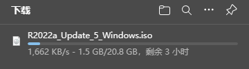
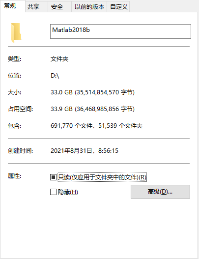

# Matlab01 - 安装

## 一、注册安装 - 校园安装版

- 兰大个人工作平台 - 应用市场 - 正版化平台

  - 获取安装包

    

  - 使用 MathWorks 账户登录
  
  > 具体见《兰州大学MATLAB校园安装指南》

## 二、无注册安装 - 个人安装版

- 下载安装包

  - 官网下载：[MATLAB - 技术计算语言 (mathworks.cn)](https://ww2.mathworks.cn/products/matlab.html)

  - Matlab2018b - (11G)

    链接：https://pan.baidu.com/s/1BG02tE-pb5z2WllNLoZp4g?pwd=nted 

    > 

    | Matlab版本 | Matlab版本大小G |
    | ---------- | --------------- |
    | 2016       | 7.5G  -  8G     |
    | 2017       | 9.5G  -  11G    |
    | 2018       | 12G   -  11.5G  |
    | 2019       | 18G   -   19G   |
    | 2020       | 19G   -   20.5G |
    | 2021       | 17G   -   18G   |
    | 2022       | 19G   -   20G   |

- 安装

  - 解压下载的压缩包

  - 管理员身份运行 setup.exe

  - 选择使用"密钥"安装

  - 输入安装密钥【09806-07443-53955-64350-21751-41297】

  - 选择安装目录，("安装目录"建议不要安装在C盘，安装路径中不能有中文)

  - 选择安装相关产品  (具体见下面**三种类型的安装方式**)

  - 确认安装

    > 安装产品越多，耗时越长。
    >
    > 安装全部产品一般需要30分钟左右，当然和自己的电脑配置也有一定关系。
    >
    > 注意：安装成功后，需要将【R2018b(64bit)】中的【Crack】文件夹下的所有文件，复制到安装目录中

## 三、三种类型的安装方式

### 极简类型

- 只安装matlab产品  - （电脑存储空间小，比较爱惜自己电脑的存储空间）

  > 问题：运行一些Matlab内置函数时，可能会提示缺少相关依赖产品。
  >
  > 解决方案：根据Matlab提示，再次安装相关产品。

### 专业类型

- 根据专业需求， 安装所需的产品选择安装

  [MATLAB Documentation - MathWorks 中国](https://ww2.mathworks.cn/help/releases/R2018b/index.html)

  > 需要对Matlab的各项功能非常了解

### 暴力类型

- 直接安装全部产品

  > 对电脑存储空间要求很大，matlab2018b全部安装（30G+）

  

## 四、北太天元

- 官网：[北太振寰（重庆）科技有限公司 (baltamatica.com)](https://www.baltamatica.com/)
- 下载网址：[北太天元下载试用- 北太振寰（重庆）科技有限公司 (baltamatica.com)](https://www.baltamatica.com/download.html)
- 用户手册：[北太天元文档 (gitee.io)](https://moluopro.gitee.io/bexdoc/)
- 在线网址：https://hpc.pku.edu.cn/demo/scow/ 
  - 账号、密码：demo_user

