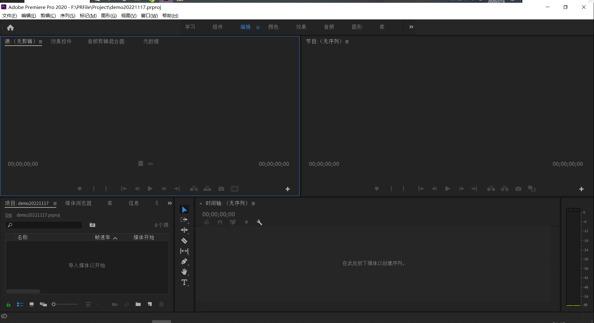
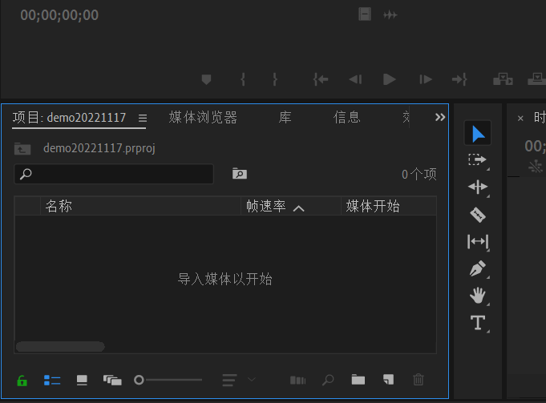
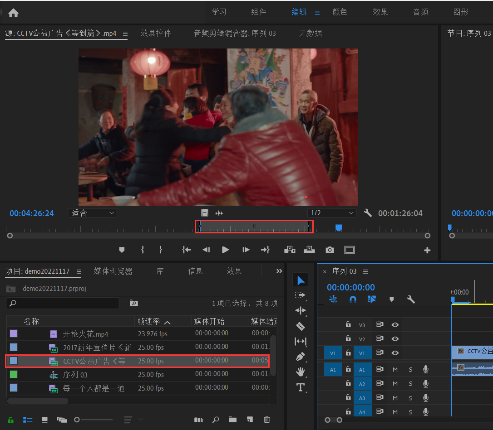

# PRNotes

## 认识界面

- 编辑
  - `另存为新工作区`可以保存当前的工作区布局
  - 在`编辑工作区`中可以删除已保存的面板
  - `重置为已保存的布局`恢复到原来的布局
- 编辑(E) - 首选项

## 导入素材

- 第一种

  - 在`项目`这里双击，弹出窗口导入素材。

  - 可以选择导入`文件夹`或者`单个文件`

    

- 第二种
  - 直接选中文件，拖到项目这里。

> 在左下角锁的旁边有`列表视图`和`图标视图`两种展示方式
>
> 还可以`新建素材箱`，把相关素材拖到文件夹中，方便管理
>
> 右下角`垃圾图标`用来删除素材

## 新建序列

- 文件 - 新建 - 序列
- 给序列取名字

### 素材预览

- 导入音频+视频
  - 设置出入点  -  入点`{`   出点`}`
  - 从素材库直接拖到新建好的序列中
- 仅导入音频、仅导入视频
  - 从`源`文件的下方两个按钮分别导入

[2-2.素材预览_哔哩哔哩_bilibili](https://www.bilibili.com/video/BV127411T7HZ/?p=5&spm_id_from=pageDriver&vd_source=5bc191bb37a56c995b0901fd3ad1baa5)

该看P6了

