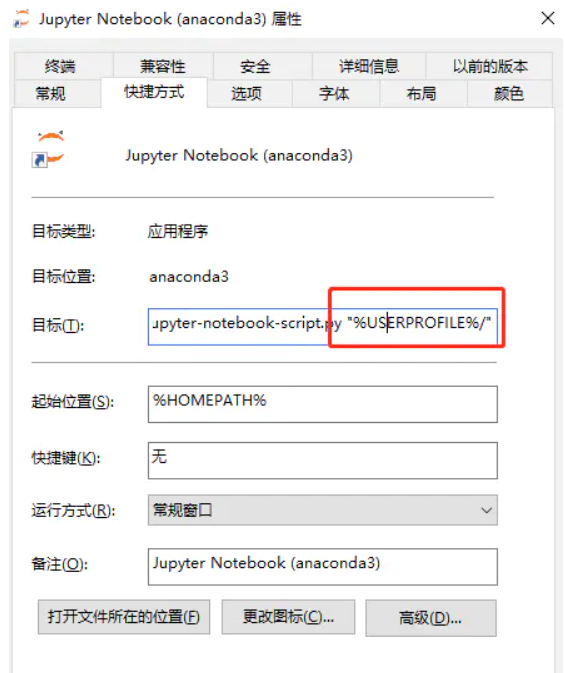

# PythonNotes

## Remark

- <span style= "color:blue; font-weight:bold">`jupyter`修改默认打开目录</span>

  - C:\Users\Lxuan9897\jupyter\jupyter_notebook_config.py
    - c.NotebookApp.notebook_dir  修改浏览器打开目录的命令

  - jupyter-notebook修改默认存储路径

    - 第一步：从开始菜单中打开Anaconda Prompt，输入`jupyter notebook --generate-config`，获得默认配置文件所在路径

    - 第二步：用记事本打开该配置文件，找到 #c.NotebookApp.notebook_dir = ''所在位置，去掉前面的“#”，并将自己新建立的文件夹路径复制在上面的单引号内部

    - 第三步：找到开始菜单中的“Jupyte Notebook”快捷键，右击选择打开快捷方式所在的位置，右击快捷方式，选择属性，将`"%USERPROFILE%/"`删除，重新打开jupyter即可。

      

      > 详细见文章：[jupyter-notebook修改默认存储路径](https://www.jianshu.com/p/a91996a8ece9)

- <span style= "color:blue; font-weight:bold">jupyter 相关命令</span>

  - 显示Available kernels

    `jupyter kernelspec list  `

  - **jupyter使用anaconda虚拟环境**

    - 创建一个虚拟环境

      `conda create -n new python=3.7`

      > 其中“new”为新创建虚拟环境名称，python版本根据需要设置

    - 进入虚拟环境，并安装jupyter

      - 进入虚拟环境  `conda activate new`

      - 安装jupyter 和 notebook  `conda install jupyter notebook`

    - 安装ipykernel，并进行相关操作

      ```
      conda install --user ipykernel
      # 其中“--user”可以不键入，对本虚拟环境无影响
      
      # 将虚拟环境添加到jupyter中，其中“new”为虚拟环境在jupyter中显示的名称，与虚拟环境名称可不一致，可自行设置
      python -m ipykernel install --user --name= new
       
      # 查看jupyter是否已添加虚拟环境
      jupyter kernelspec list
       
      # 删除相应的虚拟环境
      jupyter kernelspec uninstall new
      ```

      > 详细见文章：[jupyter使用anaconda虚拟环境](https://blog.csdn.net/qq_53564294/article/details/121296191)

- **jupyter代码补全**

  - 安装jupyter_contrib_nbextensions

    ```
    pip install jupyter_contrib_nbextensions -i http://mirrors.aliyun.com/pypi/simple/  --trusted-host mirrors.aliyun.com
    ```

  - 配置 nbextension，前提是先关闭jupyter notebook

    ```
    jupyter contrib nbextension install --user --skip-running-check
    ```

  - 在Jupyter Notebook里开启功能


## Python集合数据结构

### 列表 - list


### 字典


### 


## 对象和类

### 基础知识

- 创建类的语法

- 类的组成

  - 类属性
  - 实例方法
  - 静态方法
  - 类方法

  ```python
  class Student:
      # 类属性
      native_pace = "吉林"
  
      # 初始化程序总是被命名位__init__，这是一个特殊的方法
      def __init__(self,name,age):
          # self.name 称为实体属性
          # 将局部变量name，赋值给了实体属性self.name
          self.name = name
          self.age = age
  
      # 在类之内定义的叫方法，在类之外定义的叫函数
      # 实例方法
      def Method1(self):
          print("实例方法")
      # 静态方法
      @staticmethod
      def staticMethod1():
          print("静态方法")
      # 类方法
      @classmethod
      def classMethod1(cls):
          print("类方法")
  
  ```

- 对象的创建

  - 对象的创建又称类的实例化

  - 语法：  实例名 = 类名()

    ```python
    stu = Student()
    ```

  - 对象的使用

    ```python
    class Student:
        # 类属性
        native_pace = "吉林"
    
        # 初始化程序总是被命名位__init__，这是一个特殊的方法
        def __init__(self,name,age):
            # self.name 称为实体属性
            # 将局部变量name，赋值给了实体属性self.name
            self.name = name
            self.age = age
    
        # 在类之内定义的叫方法，在类之外定义的叫函数
        # 实例方法
        def method1(self):
            print("实例方法")
        # 静态方法
        @staticmethod
        def staticMethod1():
            print("静态方法")
        # 类方法
        @classmethod
        def classMethod1(cls):
            print("类方法")
            
    # 创建Student类的对象
    stu1 = Student('张三', 20)
    stu1.Method1()
    stu1.staticMethod1()
    stu1.classMethod1()
    
    print("----------------------------------------")
    Student.staticMethod1()
    Student.Method1(stu1)        # 实例方法，需要传入一个对象
    Student.classMethod1()
    ```

- 类属性、类方法、静态方法

  - 类属性：类中方法外的变量称为类属性，被该类的所有对象共享
  - 类方法：使用@classmethod修饰的方法，使用类名直接访问的方法
  - 静态方法：使用@staticmethod修饰的方法，使用类名直接访问方法
  - 实例方法：直接定义的方法即为实例方法

- <span style="color:blue; font-weight:bold">动态绑定属性和方法</span>

  - python是动态语言，在创建对象之后，可以动态地绑定属性和方法

  ```python
  class Student:
      def __init__(self, name, age):
          self.name = name
          self.age = age
      def eat(self):
          print("我在吃饭")
  
  def drink():
      print("我在喝水")
  
  address = "河南省商丘市宁陵县"
  
  stu1 = Student("张三", 20)
  stu1.address1 = address     # 动态绑定属性
  stu1.drink1 = drink         # 动态绑定方法
  
  # 调用方法
  stu1.drink1()
  print(stu1.address1)
  stu1.eat()
  ```

### 三大特征

> 封装，继承，多态  ： 是面向对象编程的三大特征，和编程语言无关

- 封装
  - 提高程序的安全性
  - 将数据（属性）和行为（方法）包装到类对象中。在方法内部堆属性进行操作，在类对象的外部调用方法。这样，无需关心方法内部的具体实现细节，从而隔离了复杂度。
  - 在python中没有专门的修饰符用于属性的私有，如果该属性不希望在类对象外部被访问，前边使用两个`_`

- 继承
  - 提高代码的复用性
  
  - 语法
  
    ```python
    class 子类名(父类名1，父类名2，...):
        pass
    ```
  
    > - python 是多继承语言
    >
    > - 默认继承Object
    > - 定义子类时，必须在其构造器中调用父类的构造函数
  
  - 实例
  
    ```python
    class Person:
        def __init__(self, name, age):
            self.name = name
            self.age = age
    
        def info(self):
            print("姓名：{0}，年龄：{1}".format(self.name, self.age))
    
    class Student(Person):
        def __init__(self, name, age, score):
            super().__init__(name, age)
            self.score = score
    
        def info(self):
            print("姓名：{0}，年龄：{1}，成绩：{2}".format(self.name, self.age, self.score))
    
    
    stu1 = Student("jack", 24, 399)
    stu1.info()
    ```
  
  - 方法重写
  
    ```python
    class Person:
        def __init__(self, name, age):
            self.name = name
            self.age = age
    
        def info(self):
            print("姓名：{0}，年龄：{1}".format(self.name, self.age))
    
    class Teacher(Person):
        def __init__(self, name, age, teach_year):
            super().__init__(name, age)
            self.teach_year = teach_year
        # 父类方法的重写，调用父类方法 super().info()
        def info(self):
            super().info()
            print("教龄：{0}".format(self.teach_year))
    
    class Student(Person):
        def __init__(self, name, age, score):
            super().__init__(name, age)
            self.score = score
        # 父类方法的重写
        def info(self):
            print("姓名：{0}，年龄：{1}，成绩：{2}".format(self.name, self.age, self.score))
    
    stu1 = Student("jack", 24, 399)
    stu1.info()
    
    teach1 = Teacher("tom", 25, 49)
    teach1.info()
    ```
  
  - Object类
  
    ```python
    ```
  
    

- 多态
  - 提高程序的可扩展性和可维护性


