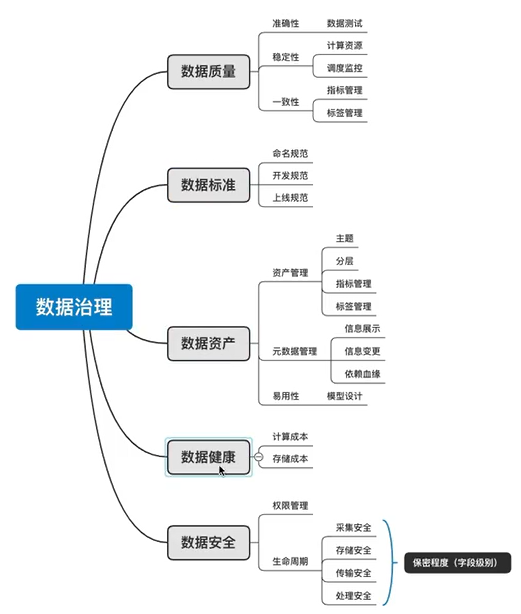

# Notes

- 数据治理体系主要包含内容有：**数据标准**、元数据、数据建模、数据集成、数据生命周期、**数据质量**、数据开放、**数据安全**及数据应用。

- 为什么需要数据治理？

> 数据易用性差(取数复杂度 & 速度)
>
> - 
>
> 数据质量差(正确性)
>
> 研发成本高(研发复杂度 & 周期 & 运维成本)
>
> 数据安全性差(加密 & 脱敏 & 审计)

- 什么是大数据治理？
- 数据治理在百度是如何落地的？
- 数据治理和数据质量的关系？
- 企业数据治理发展之路？

> 实时数仓一般是范式化的
>
> 离线数仓一般是反范式化的（用空间换时间）

## 数据治理（管理）

- 数据标准管理
- 数据建模管理
- 主数据管理
- 元数据管理
- 

## 数据质量

### 评价指标

- 数据的准确性
  - 含义：准备表示所描述真实实体”真实值”的程度
  - 内容正确
  - 格式合法
  - 数据唯一
  - 脏数据
- 数据的完整性
  - 含义：元素呗赋予值的程度
  - 记录的完整性
  - 元素的完整性
- 数据的一致性
  - 含义：数据无矛盾程度
  - 相同数据一致性
  - 关联数据一致性
- 数据的规范性
  - 含义：数据符合规范定义的程度
  - 国际、国家、行业标准、数据模型、元数据定义、数据安全规范
- 数据的时效性
  - 含义：在时间变化下，数据的正确程度
  - 基于时间段分布时序的合规率

### 指标的评估

- ​                            

