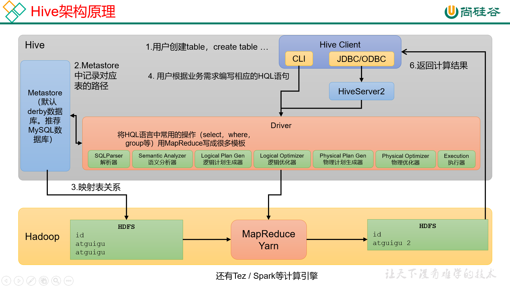
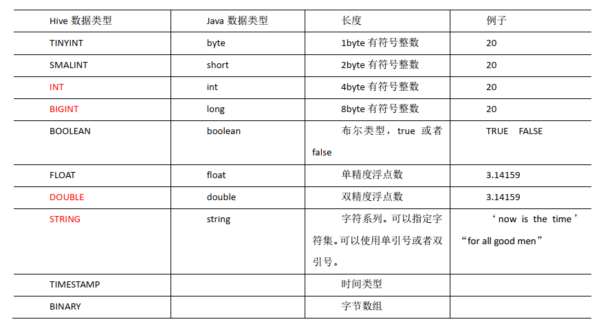
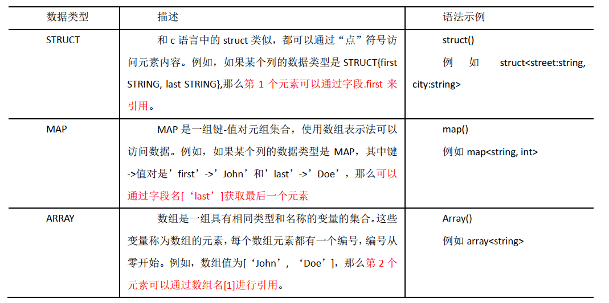

# Hive-Note

## 一、Hive的执行过程

- **(*)一条 Hive SQL 语句怎么成为的MR/Spark程序？**

> 当我们使用CLI（命令行）或者jdbc（jdbc连接到Hive)将一条 SQL 语句传给Hive的diver时，driver会根据metastore和driver中的四个器，将sql转化成MR/Spark。
>
> 具体来说是，SQL经过**解析器**，转化成抽象语法树，再通过**编译器**形成逻辑执行计划，再通过**优化器**，形成优化后的逻辑执行计划，最后通过**执行器**，形成物理执行计划，也就Spark/MR。
>
> 

- **所有的 Hive 任务都会MapReduce执行吗？**

> 肯定不是的，对于简单的不需要聚合的SELECT 语句，不需要起MapReduce job，直接通过Fetch task获取数据。

## 二、Hive的优点和缺点

- **Hive 有哪些优点？**

> - Hive 避免了写MR代码
> - 可以处理大量级的数据（小数据就不太划算了）
> - 可以支持用户自定义函数

- **Hive 有哪些缺点？**

> - 相比于MR代码，Hive SQL 表达能力有限（不支持循环，迭代。。。）
> - HIve的效率较低
> - Hive调优困难（粒度比较粗）

## 三、Hive 的内外表

- **(*)Hive 内外表的区别？**

> 对于Hive的内部表，使用删除语句删除表时，会把元数据和实际存储在HDFS的数据都会删除。
>
> 对于Hive的外部表，使用删除语句删除表时，只会删除元数据，实际存储在HDFS的数据还在。
>
> <span style='color:red; font-weight:bold'>备注：</span>其实在实际开发中也只是注重内外部表上述的区别，所以知道这一点就可以了。

- **Hive 怎么创建外部表，用到哪个关键字？**

> 用`external`关键字可以创建外部表。
>
> ```sql
> create external table_name(
> ...
> );
> ```

## 四、Hive 内置函数

- **Hive 的聚合函数了解哪些，举例说几个？**

> 参考手册地址：[LanguageManual UDF - Apache Hive - Apache Software Foundation](https://cwiki.apache.org/confluence/display/Hive/LanguageManual+UDF)
>
> 内置聚合函数  ：
>
> - <span style='color:blue; font-weight:bold'>count</span>
>
>   - `count(*)`：返回总行数，包括null值
>   - `count(expr)`：返回字段非空的行数
>   - `count(distinct expr)`：返回去重之后字段非空的行数
>
>   > <span style='color:red; font-weight:bold'>注意：</span>由于 COUNT DISTINCT 操作需要用一个Reduce Task 来完成， 这一个 Reduce 需要处理的数据量太大， 就会导致整个 Job 很难完成。一般 COUNT DISTINCT 使用、先 GROUP BY 再 COUNT 的方式替换，但是需要注意 group by 造成的数据倾斜问题.  
>
> - <span style='color:blue; font-weight:bold'>sum、avg</span>
>
>   - `sum(expr)`：求和
>   - `sum(distinct expr)` ：去重求和
>
> - <span style='color:blue; font-weight:bold'>min、max</span>
>
> - <span style='color:blue; font-weight:bold'>collect_set(expr)</span>
>
>   - 返回消除了重复元素的数组，去重
>   - 通常和`concat_ws(separator, collect_set(expr))`
>
> - <span style='color:blue; font-weight:bold'>collect_list(expr)</span>
>
>   - 返回允许重复元素的数组，不去重
>   - 通常和`concat_ws(separator, collect_list(expr))`

- **(*)Hive 的炸裂函数了解吗？**Explode()?

> 炸裂函数UDTF：`Explode()`
>
> - 函数功能：将 hive 一列中复杂的 Array 或者 Map 结构拆分成多行，<span style='color:blue; font-weight:bold'>explode的参数为数组</span>
> - `lateral view`  创建一个侧写表
> - 用法：`LATERAL VIEW udtf(expression) tableAlias AS columnAlias `
>
> ```sql
> # 举例：
> SELECT movie,
> 	   category_name
> FROM movie_info
> lateral VIEW 
> explode(split(category,",")) movie_info_tmp AS category_name;
> ```

- **Hive 怎么用 Explore() 实现侧写表？**

> 见上；

- **Hive 的窗口函数了解吗？**

> 使用`over()`用来给聚合函数开窗

- (*)窗口函数中的排序函数有哪几种，他们的区别是什么？

> `rank()`：排序，排序的编号总数不变
>
> - 1 2 2 2 5 6 7（意思是，原本总数是7个，排序的编号也是会到7）
>
> `dense_rank()`：排序，排序的编号总数减少
>
> - 1 2 2 2 3 4 5 （意思是，原本总数是7个，排序的编号可能不到7）
>
> `row_number()`：直接按行编号
>
> - 1 2 3 4 5 6 7 （意思是，不考虑是否有相同的排名，直接按行编号）

## 五、Hive 自定义函数

- **(*)有没有写过 Hive 的自定义函数？**

> 这个一定要有呀！具体过程见下；

- **说一说 Hive 的自定义函数的主要过程？**

> 自定义UDF ： 继承`GenericUDF`抽象类，实现他的3个方法
>
> ```java
> public class MyUDAF extends GenericUDF {
> 
>     @Override
>     public ObjectInspector initialize(ObjectInspector[] arguments) throws UDFArgumentException {
>         return null;
>     }
> 
>     @Override
>     public Object evaluate(DeferredObject[] arguments) throws HiveException {
>         return null;
>     }
> 
>     @Override
>     public String getDisplayString(String[] children) {
>         return null;
>     }
> }
> ```
>
> 自定义炸裂函数UDTF ： 继承`GenericUDTF`抽象类，实现他的2个方法
>
> ```java
> public class MyUDAF extends GenericUDTF {
>     
>     @Override
>     public void process(Object[] args) throws HiveException {
>         
>     }
> 
>     @Override
>     public void close() throws HiveException {
>         
>     }
> }
> ```
>
> 注意：一般很少自定义聚合函数(UDAF)，因为Hive中的聚合函数已经够用了，见上面聚合函数的介绍。
>
> <span style='color:blue; font-weight:bold'>自定义函数的过程</span>
>
> - 打开IDEA，创建一个maven工程
>
> - 导入依赖
>
>   ```xml
>   <dependencies>
>       <dependency>
>           <groupId>org.apache.hive</groupId>
>           <artifactId>hive-exec</artifactId>
>           <version>3.1.2</version>
>       </dependency>
>   </dependencies>
>   ```
>
> - 创建一个类，继承`GenericUDF`（抽象类）
>
>   ```java
>   // 写java代码
>   
>   // 写完了
>   ```
>
> - 打jar包，上传服务器
>
> <span style='color:blue; font-weight:bold'>在Hive中使用自定义函数</span>
>
> - 将 jar 包添加到 hive 的 classpath  
>
>   > <span style='color:red; font-weight:bold'>jar包放在`hive/lib`下，重启hive，就会扫面所有jar包</span>
>
>   ```sql
>   # 手动添加
>   add jar /opt/module/hive-3.1.2/lib/hive-1-1.0-SNAPSHOT.jar
>   ```
>
>   > <span style='color:red; font-weight:bold'>上面手动添加的命令不好用，建议直接重启Hive</span>，再创建函数，再使用。
>
> - 创建临时函数与开发好的 java class 关联  
>
>   ```sql
>   #      临时函数             函数名      类名
>   create temporary function my_len as "com.atguigu.hive.MyStringLength";
>   create temporary function my_len as "edu.lzu.hive.udf1.MyUDF";
>   ```
>
> - 在 HQL 中使用自定义的函数  
>
>   ```sql
>   >>> select my_len('joi');
>   >>> 3
>   ```
>

- **(*)Hive的函数：UDF、UDAF、UDTF的区别？**

> UDF：单行进入，单行输出
>
> UDAF：多行进入，单行输出
>
> UDTF：单行输入，多行输出

## 六、Hive 如何解决数据倾斜

- **(*)哪些操作会导致 Hive 的数据倾斜？**

> - group by 分组聚合操作
> - join 关联表操作
> - distinct 去重操作

- **(*)怎么解决 Hive 中的数据倾斜？**

> 1、由group by产生的数据倾斜
>
> 2、由join产生的数据倾斜
>
> 3、由distinct产生的数据倾斜

- **(*)数据倾斜在MR中的哪一步产生的？**

> 前提说下：数据倾斜一般在reduce端，map端的task的个数和数据量是由`切片机制`决定的。
>
> 在shuffle阶段中的分区方法中，会对Reduce端的数据产生数据倾斜。
>
> <span style='color:red; font-weight:bold'>注意：</span>这里希望你对MR的流程，特别是中间的Shuffle过程很熟悉，当然这也是面试官最容易问到的。

- **(*)Hive 中有几种Join，都有什么作用？**

> Hive拥有多种join算法，包括`common join`，`map join`，`SMB map join`
>
> - **common join**
>
> Map端负责读取参与join的表的数据，并按照关联字段进行分区，将其发送到Reduce端，Reduce端完成最终的join操作。
>
> - **map join**
>
> 若大表和小表join，Map端就会缓存小表全部数据，然后扫描另外一张大表，在Map端完成关联操作。
>
> 要求是：大表和小表join
>
> ```sql
> # 启用 map join 自动转换
> set hive.auto.convert.join = true;  # (默认为 true)
> # 小表的阈值设置（默认 25M 以下认为是小表）：
> set hive.mapjoin.smalltable.filesize = 25000000;    # (2千5百万 - 25M)
> 
> # common join 转map join 小表阈值
> set hive.auto.convert.join.noconditionaltask.size = 10000000  # (1千万 - 10M)
> ```
>
> - **Sort Merge Bucket Map Join**
>
> 解决的是：大表 join 大表
>
> > 分区针对的是数据的存储路径；分桶针对的是数据文件。  
> >
> > <span style='color:red; font-weight:bold'>缺点</span>：准备工作比较麻烦，通用性不强，换张大表，需要再次分桶准备。
>
> 分桶表 - 分桶字段和桶数取模：Hive 的分桶采用<span style='color:blue; font-weight:bold'>对分桶字段的值进行哈希</span>，然后除以`桶的个数`求余的方式决定该条记录存放在哪个桶当中 。
>
> 若参与join的表均为分桶表，且关联字段为分桶字段，且分桶字段是有序的，且大表的分桶数量是小表分桶数量的整数倍。
>
> 此时，就可以以桶为单位，为每个Map分配任务了，Map端就无需再缓存小表的全表数据了，而只需缓存其所需的分桶。
>
> ```sql
> # 启动Sort Merge Bucket Map Join优化
> set hive.optimize.bucketmapjoin.sortedmerge=true;       # 默认fasle
> 
> # 使用自动转换 SMB Join 
> set hive.auto.convert.sortmerge.join=true;              # 默认是true
> ```
>

## 七、Hive 如何处理小文件

- **(*)Hive中小文件有哪些危害？**

> Hive的小文件会产生过多的map端task个数，会占用大量资源，影响性能。
>
> 说明：因为切片机制是按照文件进行依次切片的，这个在切片的源码中可以看到。所以小文件多的话，就会产生大量的文件块，一个文件块对应一个map task。所以小文件过多，会使得map端产生很多task，会占用大量资源，影响性能。

- **(*)如何处理Hive中的小文件？**

> 小文件合并优化，分为两个方面：分别是Map端输入的小文件合并，和Reduce端输出的小文件合并。
>
> - Map 端输入文件合并  :  使用`CombineHiveInputFormat`，默认就是这个。
>
>   合并Map端输入的小文件，是指将多个小文件划分到一个切片中，进而由一个Map Task去处理。目的是防止为单个小文件启动一个Map Task，浪费计算资源。相关参数为：
>
>   ```sql
>   # 可将多个小文件切片，合并为一个切片，进而由一个 map 任务处理
>   set hive.input.format = org.apache.hadoop.hive.ql.io.CombineHiveInputFormat;   # 默认就是
>   
>   # map-only 
>   SET hive.merge.mapfiles = true;  # 默认true
>   ```
>
> - Reduce 端输出文件合并
>
>   合并Reduce端输出的小文件，是指将多个小文件合并成大文件。目的是减少HDFS小文件数量。
>
>   相关参数为：
>
>   ```sql
>   # 开启合并 Hive on Spark 任务输出的小文件
>   set hive.merge.sparkfiles = true;           # 默认false
>     
>   # 开启合并 Hive on MR 任务输出的小文件
>   set hive.merge.mapredfiles = true;          # 默认false
>     
>   # 合并大小， 默认 256M
>   SET hive.merge.size.per.task = 268435456;
>   # 当输出文件的平均大小小于该值时，启动一个独立的 map-reduce 任务进行文件 merge
>   SET hive.merge.smallfiles.avgsize = 16000000;  # 默认 16M
>   ```
>

## 八、Hive的严格模式

- **(*)介绍一下Hive的严格模式？**

> Hive的严格模式指的是下面三种要求：
>
> - 不允许全表扫描所有分区，也就是查询**分区表**必须带有**分区过滤条件**。
> - 使用order by，必须使用limit。
> - 限制了笛卡尔积。
>
> 全局设置：
>
> - hive.mapred.mode = strict/nonstrict
> - 默认没有定义该变量，为非严格模式。
>
> 分开设置：
>
> - hive.strict.checks.no.partition.filter   
> - hive.strict.checks.orderby.no.limit 
> - hive.strict.checks.cartesian.product  

- **Hive 的严格模式有几种，分别是什么？**

> 参考上题；

## 九、Hive的分区

- **(*)动态分区和静态分区的区别？**

> - 静态分区：存放数据时，要明确指定一个分区。
> - 动态分区：存放数据时，不指定固定分区，动态写入相应的分区。
> - 举例：
>
> ```sql
> # 指定分区，为静态分区
> load data local inpath '/xxx/xxx/xxx.txt' into table table_name partition(day='20200401');
> 
> # 这里的分区是一个变量，没有明确指定固定的分区，为动态分区
> insert into table table_name partition(loc) 
> select deptno, dname, loc from dept;
> ```
>
> 当然，开启动态分区，才能使用。否则报错，提示必须明确指明一个静态分区。
>
> - 设置动态分区为非严格模式（默认是严格模式，不能使用动态分区）
>
> ```shell
> set hive.exec.dynamic.partition.mode = nonstrict
> # 默认该变量是strict，也就是严格模式。
> ```

- **使用过动态分区吗？**

> 使用过，根据自己的理解和面试官唠就完了，不用紧张，不用害怕。

- **Hive3.x 中关于动态分区的新特性？**

> 在Hive3.x中，不用设置Hive的动态分区为非严格模式，也可以使用动态分区：
>
> ```sql
> # 这种写法，要设置动态分区为非严格模式
> insert into table table_name partition(loc) 
> select deptno, dname, loc from dept;
> 
> # 下面的这种写法不用设置
> # 不用指明分区，将分区字段loc放在查询的最后即可
> insert into table table_name 
> select deptno, dname, loc from dept;
> ```
>
> 前提是，你见表的时候，指定的分区字段是loc。
>
> 因为我们知道分区字段其实也是表的一个特殊字段，`select deptno, dname, loc from dept;`这里相当于我们指明了这个分区字段`loc`的值，那么数据就会动态的加载到相应的分区中。

## 十、Hive的分桶

- **什么是 Hive 的分桶表？**

> 见下；

- **说说对 Hive 桶表的理解？**

> - 分桶表是对数据某个字段进行哈希取值，然后用哈希值对桶的个数取模，最后后放到不同文件中存储。
> - 数据载到桶表时，会对字段取hash值，然后与桶的数量取模。把数据放到对应的文件中。物理上，每个桶就是表(或分区）目录里的一个文件，一个作业产生的桶(输出文件)和reduce任务个数相同。
>- 桶表专门用于抽样查询，是很专业性的，不是日常用来存储数据的表，需要抽样查询时，才创建和使用桶表。

- **分区表和分桶表的区别**：<span style='color:blue; font-weight:bold'>分桶表是分文件存储，分区表是分文件夹存储。</span>

## 十一、Hive数据的导入

- **(*)你了解多少种Hive导入数据的方式？**

> 主要用到的是这三种吧：
>
> - insert
> - load
> - put

- **insert、load、put 都可以向 Hive 中导入数据，有什么区别吗？**

> insert
>
> - 元数据会记录HDFS中的文件数和行数
>
> load
>
> - 元数据`只记录`HDFS中的文件数
>
> put
>
> - 元数据`不记录`HDFS中的文件数和行数
>
> 说明：这题考察的不多，只是我觉得这三者的区别蛮重要的。

## 十二、Hive的数据类型

- **(*)Hive 的集合数据类型有哪些？**

> 

- **Hive 的集合数据类型有什么区别？**

> hive的数仓建表时，经常用到集合数据类型。
>
> 

- **怎么构造 Hive 的集合数据类型？**

> 构造集合数据类型，见：[LanguageManual UDF - Apache Hive - Apache Software Foundation](https://cwiki.apache.org/confluence/display/Hive/LanguageManual+UDF#LanguageManualUDF-ComplexTypeConstructors)
>
> 具体，见下：

- **(*)Hive 的集合数据类型都分别怎么取值？**

> - array
>   - 定义： `arr  array<string>`
>   - 取值：`arr[0]`
>   - 构造：`array(v1, v2, v3,...)   split()   collect_set()`
> - map
>   - 定义：`map1  map<int, string>`
>   - 取值：`map1[key]`
>   - 构造：`map(k1, v1, k2, v2, ...)`   `str_to_map(text, [delimiter1, delimiter2])`   delimiter1大分割，delimiter2分割每个K-V
> - struct
>   - 定义：`struct1  struct<id: int, name: string>`
>   - 取值：`struct1.id`
>   - 构造：`named_struct(name1, val1, name2, val2, ...)`

## 十三、Hive中四种排序

- **(*)order by 和 sort by 的区别？**

> - Order By
>
>   全局排序，只有一个reducer
>
> - Sort By
>
>   每个 Reduce 内部排序，分区内排序，整体未必有序。一般和distribute by 连用。

- **了解distribute by 和 cluster by 吗？**

> - Distribute By（分区）  
>
>   - 发生在map阶段，默认是**hash值**对**分区数**取余。
>
>     > reduces的个数为-1，自动划分。
>     >
>     > 如果指定了reduces的个数，就按指定个数生成相应的分区，但数据量少时可能有空分区。
>
>   - 当然可以自定义分区规则
>
>   - 举个例子：
>
>     ```sql
>     select * from table_name
>     distribute by deptno sort by salary; 
>     # 按部门分区，按薪水排序
>     ```
>
> - Cluster By  
>
>   - 当distribute by ，sort by 的字段一样时，可以用cluster by
>
>   - Cluster By  排序只能是**升序**排序， 不能指定排序规则为 ASC 或者 DESC。  
>
>     > 这种很少用，因为分区字段和排序字段一样，感觉很奇怪。
>
>   - 举个例子：
>     ```sql
>     select * from table_name
>     distribute by deptno sort by deptno;  # 按部门分区，按部分排序，此时可以简化成下面的 
>         
>     select * from table_name
>     cluster by deptno;   # 直接用 cluster by
>     ```
>
>

## 十四、Hive的存储和压缩

- **(*)Hive 中的存储方式有哪些？**

> TextFile（默认）、SequenceFile、ORC 、parquet、......

- **Hive 中哪些存储方式是行式存储？哪些是列式存储？**

> 行式存储：TextFile（默认）、SequenceFile
>
> 列式存储：ORC 、parquet

- **(*)Hive 中的压缩方式，你了解哪些？**

> 其实就是MR中的压缩方式：
>
> - gzip
> - bzip2
> - LZO
> - snappy

- **(*)gzip 和 bzip2 有啥区别？**

> - gzip
>   - 压缩比率高，
>   - 压缩和解压速度一般
>   - 不支持切片
> - bzip2
>   - 压缩率贼高
>   - 压缩和解压速度贼慢
>   - 支持切片

- **LZO 和 snappy 有啥区别？**

> - lzo
>   - 压缩率一般
>   - 解压和压缩比较快
>   - 支持切片
> - snappy
>   - 压缩率一般
>   - 解压和压缩比贼快
>   - 不支持切片

## 十五、Hive中的参数

- (*)说几个你了解的 Hive 中的参数？

> 其实，上述问题中提到的参数，你说几个就是可以的，比如：
>
> - 设置Hive动态分区的严格模式的参数：`hive.exec.dynamic.partition.mode`
> - 设置Map join的参数：` hive.auto.convert.join`
> - 设置Hive的inpurFormat的参数：`hive.input.format`
> - 设置SMB map join的参数：`hive.optimize.bucketmapjoin.sortedmerge`
> - 设置Hive 严格模式的参数：`hive.mapred.mode `
