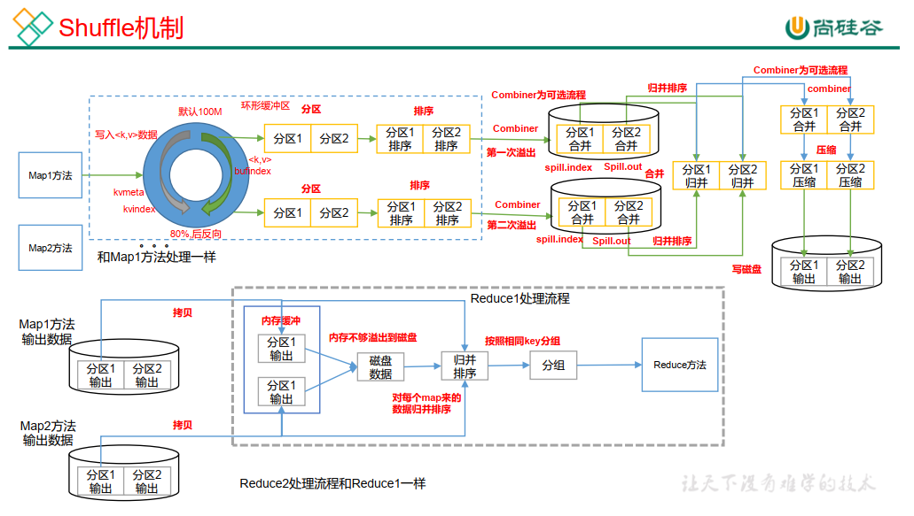
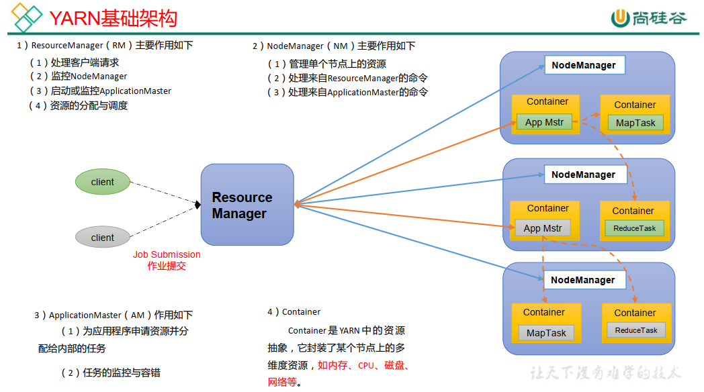
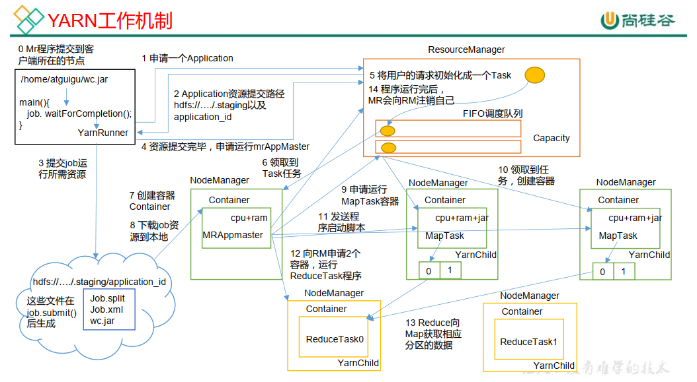
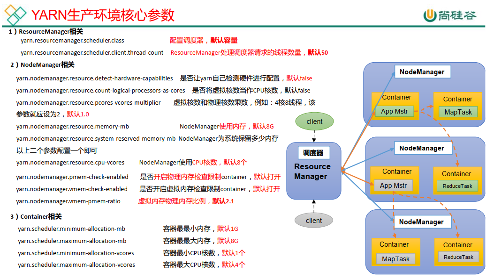
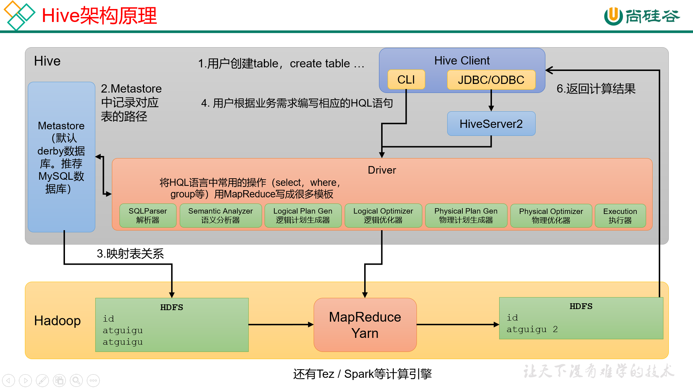
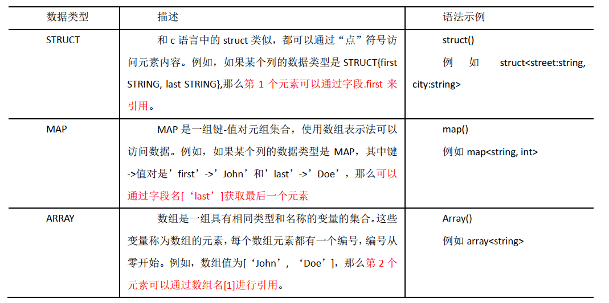
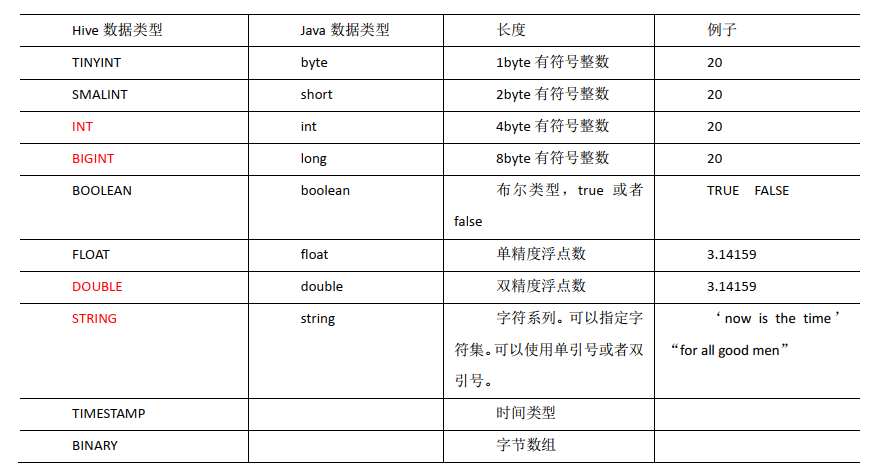

# 八股文

## Remark

- 你怎么学习一个新技术
  - 我们都知道官方文档是学习东西时，参考的最靠谱，最权威的一个资料。
  - 但是，官方文档一般都是英文的，不是说我读不来呀，我相信大家看中文的还是比看英文的舒服的
  - 再加上，刚接触这个技术，如果英文理解不好，也可能会误解原本的意思。
  - 所以，我的做法是，先找一些帖子，博客，甚至借助谷歌，百度，找一个中文的讲解教程。
  - 但最重要的一点是，一定要实操。
  - 如果在实际应用过程中，遇到一些不能够理解的，或者我的结果和别人的不一致。
  - 这个时候，我觉得就应该去有针对性的翻阅官方教程文档。
  - 当然，这个并不是绝对的，有时候，直接翻阅官方文档更方便。
  - 因为有些官方文档是给了框架模板，或者给了具体的例子，可以拿来直接用。

- 存储容量的计量单位有：
  - 最小最基本的**bit**（binary digit）比特，这是表示信息的最小单位,它只能表示 0 或 1。
  - **byte**（字节），其表示的值范围是0~255(无符号) 或 -127~127(有符号)，1 byte = 8 bit，一个英文字母1字节，一个汉字需要2字节（GBK编码）。
  - **KB**（Kilobyte）千字节，1 KB = 1024 byte，相当于一篇512个字的短文。
  - **MB**（Megabyte）兆字节 简称“兆”，1 MB = 1024 KB，相当于524288个汉字，小说白鹿原也就那么长。
  - **GB**（Gigabyte）吉字节 又称“千兆”，1 GB = 1024 MB，大约5.37亿个汉字，人类历史上字数最多的巨作《永乐大典》也才3亿7千万个字。
  - **TB**（Terabyte）万亿字节 太字节，1 TB = 1024 GB，约1.1万亿字节，在线看的720P电影每部大概500MB~1GB大小，可以存放1000多部。
  - **PB**（Petabyte）千万亿字节 拍字节，1 PB = 1024 TB，按上例，可以存放100万部电影，人活到100岁也不到90万小时。
  - **EB**（Exabyte）百亿亿字节 艾字节，1 EB = 1024 PB，相当于52.4万个2T硬盘。
  - **ZB**（Zettabyte）十万亿亿字节 泽字节，1 ZB = 1024 EB，以100MB/秒的速度下载，需要35.7万年。
  - **YB**（Yottabyte）一亿亿亿字节 尧字节，1 YB = 1024 ZB，据预测到2025年全球每天产生的数据量将达到491EB
  - **BB**（Brontobyte）一千亿亿亿字节，1 BB = 1024 YB = 1237940039285380274899124224 Byte
  - **NB**（NonaByte），1 NB = 1024 BB = 1267650600228229401496703205376 Byte
  - **DB**（DoggaByte），1 DB = 1024 NB，数据到达这个量级是几百年几千年之后的事情了。
  - **CB**（corydonbyte），1 CB = 1024 DB
  - **XB**（Xerobyte），1 XB = 1024 CB，基本上到这里都已经是发展到很极限的数据时代了，再往上就是可能外太空才能满足我们发展了。


## 自我介绍

各位面试官，你们好。（面试官，您好）我是李久镇，来自河南商丘。本科就读于湖北宜昌的三峡大学，专业是信息与计算科学。现在甘肃兰州兰州大学读研，专业是计算数学。

学习方面，

我一直都很刻苦认真，也取得了一些优良的成绩。同时学习之余，学习之余还参与了很多学生工作，由于自己比较喜欢和同学们，老师打交道，所以担任过一些学生干部，目前是兰州大学数学与统计学院研究生院的团委副书记。

对于编程，我虽然到大学才接触到，但是我对编程可以说一见钟情，非常非常的热爱。

所以本科期间选修了很多计算机相关的课程，比如：操作系统，数据库，数据结构与算法，计算机网络等等。当然学院也开了一些课，比如：C#程序设计，我最终取得了满分的成绩。

学习大数据开发是在读研期间做的决定。其实，大四保研之后，我就已经学了java的。

研一下学期，听了一个师兄的经验分享会，就和师兄聊了聊，说明了一下自己的情况，师兄建议可以考虑一下大数据开发，我调研了以后，感觉还不错，就一直再学习。目前，已熟练掌握java，scala语言，熟悉Linux操作系统相关命令。对于大数据框架的学习的内容，主要是和离线数仓相关，自我觉得是对hadoop生态圈，特别是HIVE ON SPARK，MySQL等掌握充分，当然也学习了spark core,spark sql ,spark streaming等知识，也是学过一遍的，只是还没有项目的使用经验。而对于其他的大数据相关的框架，很多也都有学习了解。

目前，主要学习过一个项目，是关于电商数据仓库的建设。项目主要过程大致是这样的，通过Flume，datax，maxwell 对数据采集，将其存储到HDFS， 数据仓库采用维度建模，将其分层建设，其中所有的hive SQL 都是基于Spark计算引擎计算的。同时我觉得我对Hive On Spark的一些调优，比如jion优化，分组聚合优化，数据倾斜的解决等等这些吧。

以上就是我的自我介绍，谢谢！


## 项目

- 项目的收获

  - 从这个电商数仓的项目中还是学到好多的，因为没做项目之前其实已经学了很多大数据的框架和技术了，但是真的就停留的理论的学习。

  - 

  - 

  - 我认为最重要的一个就是自己对数仓开发的整个流程有了一个整体的认识，从数据采集，数据存储，数据计算，以及可视化这些过程，因为刚开始知识一个框架一个框架的学习嘛

  - 第二就是，对于已经学习过的框架，加深了理解，或者说加深了对框架技术的使用方式

  - 第三就是脚本，确实是在项目中用了很多脚本，

  - 第四就是对数据仓库的建模吧，之前学习框架技术时，是没有涉及到建模这一块，从这个电商数仓的项目中，学到了维度建模，数仓的分层理论，这些知识。

  - 最后呐，我认为要有一点就是，写Hive SQL吧，再每一层的计算上

  - 其实还有很多，再比如数仓分层每一层数据的存储方式，压缩方式

    - ODS层，存储格式textfile，压缩gzip，压缩率高
    - DIM，DWD，DWS，orc+snnapy

    

    

- 项目的难点
  - 谈不上难点吧，我觉得这个项目相较于是一个很简单的项目了，当然比第二个项目还是复杂些的。
  - 
  - 学第二个项目，框架都不用搭建了，就直接把数据模拟产生，写一些Hive SQL，就感觉没啥的。
  - 在电商数仓这个项目中呢，我觉得采集数据的时候，要对数据进行一写处理


大学期间我选了很多有关计算机以及编程的课，一开始的想法是要找个计算机相关的工作。但是大四推免的时候被选上了，和家里人商量之后，他们的想法还是想让我先读研，因为的确我们一大家子都没有上过太多的学。所以选择了读研，研一期间我几乎放弃了做一个程序员，我想搞学术，走学术的道路，但是兴趣始终是很好的导师，我感觉对学术的研究没有太多想法。研一结束的暑假，我毅然选择了再次学习编程，大概十几天我复习了java，然后学习mysql，linux操作系统，后面又开始学习大数据开发的框架，因为研二嘛，科研压力还是蛮大的，再加上我是我们倒是没有研三的学生，所以一些工作都是交给我，加上我又是我们学院研究生院的团委副书记，所以，从去年7月至今。


## HR

- 遇到一个问题，你怎么解决？

  - 我觉得我还有我的一个做法的，我喜欢遇到难题自己思考，就是我不太喜欢一遇到问题就，当然这个思考不会持续很长时间（当然也根据事情的紧急状态），如果有想法，我会去和大家交流看是否合适，如果没有想法，我会寻求帮助。

  


## Java

- <span style='color:blue; font-weight:bold'>`hashCode()`与`equals()`之间的关系</span>

  > 

- <span style='color:blue; font-weight:bold'>object对象中常用的方法</span>

  > 

- <span style='color:blue; font-weight:bold'>Java的面向对象有哪些特征</span>

  >

- <span style='color:blue; font-weight:bold'>为什么说 Java 语言“编译与解释并存”？</span>

  > 因为 Java 语言既具有编译型语言的特征，也具有解释型语言的特征。因
  >
  > 由 Java 编写的程序需要先经过编译步骤，生成字节码（也就是`.class` 文件），这种字节码必须由 Java 解释器来解释执行。

- <span style='color:blue; font-weight:bold'>标识符和关键字的区别是什么？</span>

  > 在我们编写程序的时候，需要大量地为程序、类、变量、方法等取名字，于是就有了 **标识符** 。简单来说， **标识符就是一个名字** 。
  >
  > 有一些标识符，Java 语言已经赋予了其特殊的含义，只能用于特定的地方，这些特殊的标识符就是 **关键字** 。简单来说，**关键字是被赋予特殊含义的标识符** 。

- <span style='color:blue; font-weight:bold'>continue、break 和 return 的区别是什么？</span>

  >略

- <span style='color:blue; font-weight:bold'>位运算符</span>

  >略

- <span style='color:blue; font-weight:bold'>变量</span>

  > 成员变量和局部变量
  >
  > 成员变量又分为实例变量和静态变量

- <span style='color:blue; font-weight:bold'>方法</span>

  > 方法重载：
  >
  > 方法重写：**两同**(方法名、参数列表)**两小**(返回值类型，抛出的异常)**一大**(访问修饰符)

- <span style='color:blue; font-weight:bold'>访问修饰符</span>

  > public，protected，默认，private

- <span style='color:blue; font-weight:bold'>Java 中的几种基本数据类型</span>

  > byte short int long float double boolean char 
  >
  > 1       2        4    8       4       8            1             2

- <span style='color:blue; font-weight:bold'>基本类型和包装类型的区别?</span>

  - 

- <span style='color:blue; font-weight:bold'>包装类型的缓存机制了解么？</span>

  > `Byte`,`Short`,`Integer`,`Long` 这 4 种包装类默认创建了数值 **[-128，127]** 的相应类型的缓存数据，
  >
  > `Character` 创建了数值在 **[0,127]** 范围的缓存数据，
  >
  > `Boolean` 直接返回 `True` or `False`。


- 比较 HashSet、LinkedHashSet 和 TreeSet 三者的异同


- String、StringBuffer、StringBuilder 的区别？
  - String 是不可变的；StringBuffer、StringBuilder是可变的
  - StringBuffer是线程安全的，StringBuilder是非线程安全的


- comparable 和 Comparator 的区别

  - `comparable` 接口实际上是出自`java.lang`包，它有一个 `compareTo(Object obj)`方法用来排序

    ```java
    public  class Person implements Comparable<Person> {
        String name;
        int age;
    
        public Person(String name, int age) {
            super();
            this.name = name;
            this.age = age;
        }
    
        /**
         * T重写compareTo方法实现按年龄来排序
         */
        @Override
        public int compareTo(Person o) {
            // 这样就是升序，
            return this.age - o.age;
                
            //if (this.age > o.getAge()) {
            //    return 1;
            //}
            //if (this.age < o.getAge()) {
            //    return -1;
            //}
            //return 0;
        }
    }
    ```

    > compareTo需要看源码：
    >
    > - TreeSet的源码：
    >
    >   ```java
    >   // 拿着k和二叉树上的所有节点去比较，（这里理解可能还有点问题？？？？？？？？？？？？）
    >   // 先记好上面的规则吧
    >                 
    >   // 底层是二叉树（红黑树）
    >   cmp = k.compareTo(t.key);  // k - t.key < 0 => t < t.key 
    >   // 这是须有和左子节点比较。（升序）
    >   if (cmp < 0) t = t.lefe;
    >   else if (cmp > 0) t = t.right;
    >                 
    >   // 如果我们设置为：t.key - t  < 0 => t.key < t 这是须有和左子节点比较。 （降序了？？？？）
    >   ```
    >
    >   

  - `comparator`接口实际上是出自` java.util` 包，它有一个`compare(Object obj1, Object obj2)`方法用来排序

    ```java
    Collections.sort(arrayList, new Comparator<Integer>() {
        @Override
        public int compare(Integer o1, Integer o2) {
            // 反写这就是降序
            return o2.compareTo(o1);
            // 这样写就是升序
            // return o1.compareTo(o2);
        }
    });
    ```

    


- Collection 和 Collections 区别
  - Collection 是集合体系中的一个基础的接口
  - Collections 是集合中的一个工具包，不能被实例化


## Java 集合

#### Collection && Collections 的区别

- Collection是一个Java集合框架中的基本接口；Collections是Java集合框架提供的一个工具类，它的里面包含了大量的用于操作或者返回集合的静态方法，并且此类不能被实例化。


## Java多线程并发

- 看java笔记


## MySQL

- 逻辑架构

- 存储引擎

  - InnoDB、MyISAM、memory是基于内存的，就不说了详细对比说一下InnoDB和MyISAM

- 索引

  - 什么是索引，有什么优缺点？

    答：

  - B树和B+树有什么优缺点

  - 索引失效的情况

- 事务

  - 特征：ACID
  - 数据的并发问题：脏写，脏读，不可重复读，幻读
  - 事务的隔离级别：读未提交，读已提交，可重复读，可串行化
  - REDO LOG
    - 保证事务的持久化特性，“预先日志持久化”，先落盘REDO LOG，在以一定频率落盘数据。
    - 落盘REDO LoG，内容就多了？
  - UNDO LOG 作用？
    - 回滚数据
    - MVCC
  - 读-写
  - MVCC是什么?
    - MVCC是多版本并发控制，也就是通过数据行的多个版本来实现数据库的并发控制
    - 主要的作用，或者说目的就是：为了更好的解决读写冲突问题，做到即使在读写冲突的时候，也能实现不加锁的非阻塞读。当然这里的不加锁的读属于快照读，在MVCC中有两种读：快照读和当前读，（）。
    - 总的来说：就是通过控制数据行的多版本，来解决读写冲突的问题。
  - MVCC的实现原理：
    - 先回答：MVCC是什么?
    - MVCC的实现依赖于：隐藏字段，UNDOLOG，ReadView
    - ReadView就稍微复杂点了，我只知道他是通过tx_id，和UNDOLOG来确定哪些数据可以被读到，哪些数据读不到，从而就确定了一个读视图，也就是读取的是历史数据，属于快照读。
    - 再回答MVCC什么时候会用到？


## 算机网络

- 


## Hadoop

### HDFS

NameNode，管理文件名称，副本策略，文件块地址映射，处理客户端请求

DataNode，存储实际数据块，执行数据块的读写

SecondeNode，

- **写流程**
  - 1、首先客服端向NameNode发送请求，要上传一个文件到指定的目录下。
  - 2、NameNode进行校验，主要有两个：一是检查权限是否满足，二是检查目录或者文件是否存在。（不满足就报错）
  - 3、NameNode给客户端一个响应，意思是可以上传文件了。
  - 4、客服端再次请求，上传的第一个block，放在哪里？
  - 5、NameNode收到请求后，根据节点最近原则、考虑负载均衡、以及副本机制，返回指定的可用的DataNode地址列表。
  - 6、客户端收到地址列表后，与表中的一个节点A进行通信，建立通道，A收到请求后，再和B请求建立通道，B再和C请求建立通道...... ，这样就使得整个通道建立完成
  - 7、客户端建立输出流，向节点A发送第一个block，以packet为单位传送64k，A收到之后，落盘并传给B，B收到同样落盘再传给C，这样传下去。
  - 8、通道的反向传输是，逐个发送ack应答，最终发给客户端。
  - 9、当第一个block传完之后，客户端会再次清求NameNode上传第二个block，NameNode同样根据节点最近原则、考虑负载均衡、以及副本机制，返回指定的可用的DataNode地址列表。
  - 10、这样就完成了HDFS的写数据操作。
  
- 拓扑结构（节点最近原则）

  - 节点距离：两个节点到达最近共同祖先的距离和。

- <span style='color:blue; font-weight:bold'>机架感知/副本机制（副本存储节点的选择）</span>（源码也是这么说的）

  - 第一个副本，在客户端所在的节点上。
  - 第二个副本，在另外一个机架上随机选择一个节点
  - 第三个副本，在副本二所在的机架上再随机选择一个节点

  > 好处：第一个副本选择客户端所在的节点上，因为节点距离最近，上传速度最快
  >
  > ​            第二个选择其他机架上的节点，是为了保证数据的可靠性
  >
  > ​            第三个是为了保证传输效率，同一个机架传输相对较快。

- **读流程**

  - 1.客户端向NameNode请求读文件，NameNode进行校验（判断有无权限，判断文件是否存在）。（不满足就报错）
  - 2.可以的话，NameNode通过查询元数据，找到文件块所在的 DataNode 地址，并返回地址给客户端。
  - 3.根据节点最近原则、考虑负载均衡、以及副本机制，挑选一台DataNode服务器，请求读取数据。
  - 4.客户端创建inputstream，开始读文件，以packet为单位64k，（每个块之间是串行读）
  - 5.客户端以packet为单位接收，先在本地缓存，然后写入目标文件。
  - 6.关闭资源


### MapReduce

- <span style='color:blue; font-weight:bold'>MapReduce执行流程</span>

inputFormat读取数据  --  mapper  --   shuffle  --  reducer   --  outputformat输出

> 数据块：物理级别     切片：逻辑级别

首先是通过inputFormat读取数据（默认是TextInputFormat）,读取的数据以<k,v>键值对的形式传给map方法，数据经过map方法后并不是直接到了Reducer端，而是经过了一个shuffle混洗的机制后落盘，然后reducer端对数据进行拉取，传给reduce方法，最后通过outputFormat输出到文件（默认是TextOutputFormat）。

**而对于shuffler机制是这样的：**


- shuffle机制

  - 概述
    mapreduce中，map阶段处理的数据如何传递给reduce阶段，是mapreduce框架中最关键的一个流程，这个流程就叫shuffle；
    shuffle: 洗牌、发牌——（核心机制：数据分区，排序，缓存）
    具体来说：就是将maptask输出的处理结果数据，分发给reducetask，并在分发的过程中，对数据按key进行了分区和排序；

  - 主要流程
    shuffle是MR处理流程中的一个过程，它的每一个处理步骤是分散在各个map task和reduce task节点上完成的，整体来看，分为3个操作：

    1、partition    分区
    2、Sort     根据key排序
    3、Combiner   进行局部value的合并

  - **详细流程**

    1、map()方法输出的kv对，先进入`分区方法`，把数据标记好分区，然后把数据发送到内存缓冲区（默认100M）中

    2、当环形缓冲区达到80%时，进行溢写，从内存缓冲区不断溢出本地磁盘文件，可能会溢出多个文件 （溢写前对数据进行快速排序，排序按照key的索引进行字典顺序排序） 	

    3、多个溢出文件会被合并成大的溢出文件(归并排序算法)，对溢写的文件也可以进行 **combiner操作** ，前提是可以合并（combiner)，比如汇总操作，求平均值不行。

    4、最终数据溢写到磁盘，等待reducer端拉取

    5、reducetask 根据自己的分区号，去各个 maptask 机器上取相应的结果分区数据，拉取的数据先存储在内存中，内存不够了，再存储到磁盘。

    6、~~reducetask 会取到同一个分区的来自不同 maptask 的结果文件，~~reducetask会将这些文件再进行合并（归并排序）

    7、合并成大文件后，**shuffle的过程也就结束了**，接着对于这些数据按相同的key分组，最终传给reduce方法。

    Shuffle中的缓冲区大小会影响到mapreduce程序的执行效率，原则上说，缓冲区越大，磁盘io的次数越少，执行速度就越快，缓冲区的大小可以通过参数调整, 参数：io.sort.mb 默认100M




- job提交源码
  - 建立连接 
    - 判断是本地运行环境还是 yarn 集群运行环境  

  - 提交job前，会有一些准备工作
    - 输出路径的判断
    - 切片机制：会把切片个数赋值成maptask个数
    - 中间会创建一个临时路径，经过切片机制之后，储切片信息，和后面还会生成一个xml文件等

  - 提交job
    - xml      运行job的参数设置
    - jar  （本地没有，集群需要jar包）
    - 切片信息  

  - 运行结束，临时路径中的文件就删除了


- 切片源码
  - 切片时不考虑整体，每个文件单独切片
  - 一个切片一个mapTask，默认切片大小等于块大小
  - 1、切片大小的公式     大         （输入文件路径，在切片的时候判断）
  - 2、源码中明确有对每个文件进行循环，这也说明了切片时不考虑整体，每个文件单独切片
  - 3、会判断文件是否可切割
  - 4、根据块的公式，计算块大小
  - 5、文件大小大于块大小的1.1时，才会切，避免小文件
  - 6、切完之后，会把切片信息保存到一个临时路径中


### Yarn

- 基础架构  
  - YARN 主要由 ResourceManager、 NodeManager、 ApplicationMaster 和 Container 等组件构成。  



- 工作机制
  - 1、mr程序有一个方法会创建一个YarnRunner，本地是localRunner，
  - 2、Yarnner向RM，发出一个应用请求。
  - 3、RM会返回一个路径，把运行的job放在指定路径中
  - 4、主要是3个东西：jar，切片信息，xml文件（job运行时的一些参数文件）
  - 5、资源提交完毕，向RM申请运行am
  - 6、这时会在RM中产生一个Task、然后放进一个任务队列中，默认使用容量调度器
  - 7、如果有NodeManager空闲，就会领走这个任务
  - 8、NodeManager领走任务后，会创建一个container，在里面就会起一个AM
  - 9、AM下在job的信息，根据切片数量向 RM 申请运行 maptask 的容器
  - 10、RM创建指定容器，AM向每个容器发送启动脚本
  - 11、 maptask 运行结束，AM再向RM申请容器运行reducertask
  - 12、程序执行完之后，AM再向RM说明任务已完成，可以释放资源了。




- 调度器
  - 先进先出
  - 容量调度器   - 默认
  - 公平调度器


- Yarn参数




## Hive 基础知识点

### Hive的执行过程

使用命令行或者jdbc连接到hive，将sql语句传给hive的diver，driver会根据metastore和driver中的四个器，将sql转化成mr。

具体来说是，sql经过**解析器**，转化成抽象语法树，再通过**编译器**形成逻辑执行计划，通过**优化器**，形成优化后的逻辑执行计划，再通过**执行器**，形成物理执行计划，也就Spark/MR。

> 元数据放在deby，mysql支持多用户并发访问。



### hive的优点和缺点

- 优点：
  - hive避免了写MR代码
  - 可以处理大量级的数据（小数据就划不来了）
  - 可以支持用户自定义函数
- 缺点：
  - 相比于MR代码，Hive SQL 表达能力有限（不支持循环，迭代。。。）
  - HIve的效率较低
  - Hive调优困难（粒度比较粗）


### Hive 的内外表

- 内部表：
- 外部表：用`external`关键字，删除表时，仅删除元数据，实际数据还在HDFS中


### Hive 内置函数

参考手册地址：[LanguageManual UDF - Apache Hive - Apache Software Foundation](https://cwiki.apache.org/confluence/display/Hive/LanguageManual+UDF)

- 内置聚合函数   AF

  > [hive内嵌UDAF函数: 聚合函数使用详解_51CTO博客_hive cast函数](https://blog.51cto.com/u_15346267/3669043)

  - <span style='color:blue; font-weight:bold'>count</span>

    - `count(*)`：返回总行数，包括null值
    - `count(expr)`：返回字段非空的行数
    - `count(distinct expr)`：返回去重之后字段非空的行数

    > 由于 COUNT DISTINCT 操作需要用一个Reduce Task 来完成， 这一个 Reduce 需要处理的数据量太大， 就会导致整个 Job 很难完成。
    >
    > 一般 COUNT DISTINCT 使用<span style='color:blue; font-weight:bold'>先 GROUP BY 再 COUNT </span>的方式替换，但是需要注意 group by 造成的数据倾斜问题.  

  - <span style='color:blue; font-weight:bold'>sum、avg</span>
    - `sum(expr)`：求和
    - `sum(distinct expr)` ：去重求和
  - <span style='color:blue; font-weight:bold'>min、max</span>
  - <span style='color:blue; font-weight:bold'>collect_set(expr)</span>
    
    - 返回消除了重复元素的数组，去重
    - 通常和`concat_ws(separator, collect_set(expr))`
  - <span style='color:blue; font-weight:bold'>collect_list(expr)</span>
    
    - 返回允许重复元素的数组，不去重
    - 通常和`concat_ws(separator, collect_list(expr))`

  ```sql
  select class_id,
  	   collect_set(name)
  from table1
  group by class_id;
  # 把每一个班级的学生放在一个数组里
  ```

- 内置炸裂函数   TF

  - `explode()`：

    - 将 hive 一列中复杂的 Array 或者 Map 结构拆分成多行，<span style='color:blue; font-weight:bold'>explode的参数为数组</span>
    - `lateral view`  创建一个侧写表
    - 用法：`LATERAL VIEW udtf(expression) tableAlias AS columnAlias `

    ```sql
    SELECT movie,
    	   category_name
    FROM movie_info
    lateral VIEW 
    explode(split(category,",")) movie_info_tmp AS category_name;
    ```

- 其他的一些函数

  - `concat(str1, str2,...)`：拼接函数
  - `concat_ws(separator, str1, str2,...)`： 以separator为分隔符拼接字符串
  - `concat_ws(separator, array<string>)`： 以separator为分隔符拼接数组中的元素
  - 

> <span style='color:red; font-weight:bold'>聚合函数使用注意事项:</span>
>
> - 1.**聚合条件--HAVING**。从Hive0.7.0开始HAVING被添加到Hive作为GROUP BY结果集的条件过滤。
> - 2.**聚合函数经常与 GROUP BY 子句一起使用**。换句话说使用聚合函数时，一个`列字段`要不在group by里，要不必须在聚合函数里面，不能单独出现，否则报错。
>
> ```sql
> # 1.只有聚合函数，没有group by，没问题
> select sum(a), count(distinct b)  from table1;
> 
> # 2.有聚合函数，又有别的列c，但是没有用group by，报错
> select sum(a), count(distinct b), c from table1;
> 
> # 3.聚合函数配合group by一起使用，没问题
> select sum(a), count(distinct b), c from table1 group by c;
> ```
>
> <span style='color:red; font-weight:bold'>SQL执行顺序：</span>
>
> - 关键词顺序
>
>   ```sql
>   SELECT ... FROM ... WHERE ... GROUP BY ... HAVING ... ORDER BY ... LIMIT...
>   ```
>
> - 执行顺序
>
>   ```sql
>   FROM -> WHERE -> GROUP BY -> HAVING -> SELECT的字段 -> DISTINCT -> ORDER BY -> LIMIT
>   ```


- 内置UDF
  - 时间
  - 字符串
  - 


### Hive 自定义函数

UDF ： GenericUDF             /dʒəˈnerɪk/    抽象类

```java
public class MyUDAF extends GenericUDF {

    @Override
    public ObjectInspector initialize(ObjectInspector[] arguments) throws UDFArgumentException {
        return null;
    }

    @Override
    public Object evaluate(DeferredObject[] arguments) throws HiveException {
        return null;
    }

    @Override
    public String getDisplayString(String[] children) {
        return null;
    }
}
```

UDTF ： GenericUDTF           抽象类

```java
public class MyUDAF extends GenericUDTF {
    
    @Override
    public void process(Object[] args) throws HiveException {
        
    }

    @Override
    public void close() throws HiveException {
        
    }
}
```

<span style='color:blue; font-weight:bold'>自定义函数的过程</span>

- 创建一个maven工程

- 导入依赖

  ```xml
  <dependencies>
      <dependency>
          <groupId>org.apache.hive</groupId>
          <artifactId>hive-exec</artifactId>
          <version>3.1.2</version>
      </dependency>
  </dependencies>
  ```

- 创建一个类，继承GenericUDF（抽象类）

  ```java
  // 写java代码
  
  // 写完了
  ```

- 打jar包，上传服务器

在hive中使用自定义函数

- 将 jar 包添加到 hive 的 classpath  

  > <span style='color:red; font-weight:bold'>jar包放在`hive/lib`下，重启hive，就会扫面所有jar包</span>

  ```sql
  # 手动添加
  add jar /opt/module/hive-3.1.2/lib/hive-1-1.0-SNAPSHOT.jar
  ```

  > <span style='color:red; font-weight:bold'>上面手动添加的命令不好用，建议直接重启Hive</span>，再创建函数，再使用。

- 创建临时函数与开发好的 java class 关联  

  ```sql
  #      临时函数             函数名      类名
  create temporary function my_len as "com.atguigu.hive.MyStringLength";
  create temporary function my_len as "edu.lzu.hive.udf1.MyUDF";
  ```

- 在 HQL 中使用自定义的函数  

  ```sql
  >>> select my_len('joi');
  >>> 3
  ```

### Hive 如何解决数据倾斜

见下：

### Hive 如何处理小文件

见下：

### Hive的严格模式

- 不允许全表扫描所有分区，也就是查询**分区表**必须带有**分区过滤条件**。
- 使用order by，必须使用limit。
- 限制了笛卡尔积。

> 全局设置：
>
> - hive.mapred.mode = strict/nonstrict
> - 默认没有定义该变量，为非严格模式。
>
> 分开设置：
>
> - hive.strict.checks.no.partition.filter   
> - hive.strict.checks.orderby.no.limit 
> - hive.strict.checks.cartesian.product  


### Hive创建表

```sql
CREATE [EXTERNAL] TABLE [IF NOT EXISTS] table_name
[(col_name data_type [COMMENT col_comment], ...)]
[COMMENT table_comment]

[PARTITIONED BY (col_name data_type [COMMENT col_comment], ...)]
[CLUSTERED BY (col_name, col_name, ...)
[SORTED BY (col_name [ASC|DESC], ...)] INTO num_buckets BUCKETS]
[ROW FORMAT row_format]
[STORED AS file_format]
[LOCATION hdfs_path]
[TBLPROPERTIES (property_name=property_value, ...)]
[AS select_statement]
```

- `TBLPROPERTIES` 其他属性，比如压缩：`TBLPROPERTIES ('orc.compress' = 'snappy')`

- `[ROW FORMAT row_format]`

  ```sql
  row format delimited 
  	[FIELDS TERMINATED BY char] 
  	[COLLECTION ITEMS TERMINATED BY char]
  	[MAP KEYS TERMINATED BY char] 
  	[LINES TERMINATED BY char]
  | SERDE serde_name [WITH SERDEPROPERTIES (property_name=property_value,
  property_name=property_value, ...)]
  ```

  

### Hive的分区

- 创建分区表

  ```sql
  create table dept_partition(
      deptno int, 
      dname string, 
      loc string
  )
  partitioned by (day string)
  # partitioned by (day string, hour string)  # 二级分区
  row format delimited 
  	fields terminated by '\t';
  	
  # 注意：分区字段不能是表中已经存在的数据，可以将分区字段看作表的伪列。
  ```

- 加载数据

  ```sql
  load data local inpath '/dept.log' into table table1 partition(day='20200403');
  ```

- 增加分区

  ```sql
  alter table dept_partition add partition(day='20200404');
  # 增加多个分;
  alter table dept_partition add partition(day='20200404') partition(day='20200405');
  # 分区间不加','
  ```

- 删除分区

  ```sql
  alter table dept_partition drop partition(day='20200404')
  # 删除多个分区
  alter table dept_partition drop partition(day='20200404'),partition(day='20200404');
  # 分区间加','
  ```

- 查看表的分区

  ```sql
  show partitions talbe1;
  ```

- 把数据直接上传到分区目录上， 让分区表和数据产生关联的三种方式  <span style='color:blue; font-weight:bold'>（修复分区）</span>

  ```sql
  # 方法一：先创建分区表，再上传数据
  msck repair table partition_table_name;
  
  # 方法二：上传数据后，添加分区
  alter table partition_table_name 
  add partition(day='201709',hour='14');
  
  # 方法三：直接load到分区表中
  ```

- 静态分区，动态分区（不建议动态分区）

  ```sql
  insert into table1 partition(day='70') # 指明分区，属于静态分区
  select ...
  
  insert into table1 partition(day)      # 分区字段在select中，属于动态分区
  select ..., day from table2;
  # 上述语句，在动态分区是严格模式下，报错。
  ```

  > 两种修改方式：
  >
  > - 第一种：修改动态分区为非严格模式
  >
  >   ```sql
  >   hive.exec.dynamic.partition=false
  >   ```
  >
  > - 第二种：利用hive3.x新特性
  >
  >   ```sql
  >   insert into table1 # partition(day)   # 以查询的最后一个字段day为分区字段，属于动态分区
  >   select ..., day from table2;
  >   ```

- 动态分区的严格模式
  - 参数`hive.exec.dynamic.partition=true  ` 默认是true;
  
  > 动态分区默认是严格的，所以必须静态指明一个分区


### Hive的分桶

> <span style='color:blue; font-weight:bold'>分区针对的是数据的存储路径；分桶针对的是数据文件。  </span>

- 创建分桶表

  ```sql
  create table stu_buck(id int, name string)
  clustered by(id) into 4 buckets
  row format delimited fields terminated by '\t';
  ```

  > 分桶表的字段，必须是建表中的某一个字段，
  
  分桶字段的hash值求模


### Hive数据的导入导出

- insert into     元数据记录文件数，行数

  ```sql
  # 分区表的查询导入
  insert into table1 partition(day='')
  select ...
  ```

  

- load                元数据记录文件数

  ```sql
  load data [local] inpath 'path' [overwrite] into table student [partition (partcol1=val1,…)];
  ```

- put                  元数据什么都不记录


### Hive的数据类型

#### 集合数据类型

- array
  - 定义： `arr  array<string>`
  - 取值：`arr[0]`
  - 构造：`array(v1, v2, v3,...)   split()   collect_set()`
- map
  - 定义：`map1  map<int, string>`
  - 取值：`map1[key]`
  - 构造：`map(k1, v1, k2, v2, ...)`   `str_to_map(text, [delimiter1, delimiter2])`   delimiter1大分割，delimiter2分割每个K-V
- struct
  - 定义：`struct1  struct<id: int, name: string>`
  - 取值：`struct1.id`
  - 构造：`named_struct(name1, val1, name2, val2, ...)`

- 练习：

```sql
create table test(
    name string,
    friends array<string>,
    children map<string, int>,
    address struct<street:string, city:string>)
row format delimited 
fields terminated by ','
collection items terminated by '_'
map keys terminated by ':'
lines terminated by '\n';
```

```txt
songsong,bingbing_lili,xiao song:18_xiaoxiao song:19,hui long guan_beijing
yangyang,caicai_susu,xiao yang:18_xiaoxiao yang:19,chao yang_beijing
```


> 构造集合数据类型，见：[LanguageManual UDF - Apache Hive - Apache Software Foundation](https://cwiki.apache.org/confluence/display/Hive/LanguageManual+UDF#LanguageManualUDF-ComplexTypeConstructors)
>
> > hive建表时，经常用到集合数据类型。



#### 基本数据类型




### Hive中四种排序

- Order By（全局排序，只有一个reducer） 

  - 

- Sort By（每个 Reduce 内部排序，分区内排序）  

  - 和distribute by 连用

- Distribute By（分区）  

  - map阶段，默认时**hash值**对**分区数**取余。

    > reduces的个数，为-1，自动划分
    >
    > 如果指定了reduces的个数，就按指定个数生成相应的分区，但数据量少时可能有空分区。

  - 自定义分区规则

  ```sql
  select * from table_name
  distribute by deptno sort by salary desc;
  
  
  select * from table_name
  distribute by deptno sort by deptno;  # 此时可以简化
  ```

> distribute by 和 sort by 连用，例如：
>
> - distribute by，部门分区
> - sort by，部门内薪水排序

- Cluster By  

  - 当distribute by ，sort by 的字段一样时，可以用cluster by

  - 排序只能是**升序**排序， 不能指定排序规则为 ASC 或者 DESC。  

    > 这种很少用，因为分区字段和排序字段一样，感觉很奇怪。

  ```sql
  select * from table_name
  distribute by deptno sort by deptno;  # 此时可以简化
  
  select * from table_name
  cluster by deptno;
  ```

```sql
# 查询结果写到文件中
insert overwrite local directory '/opt/module/data/sortby-result'
select * from emp sort by deptno desc;
```


### Hive的存储和压缩

#### 压缩

- gzip
  - 压缩比率高，
  - 压缩和解压速度一般
- bzip2
  - 压缩率贼高
  - 压缩和解压速度贼慢
- lzo
  - 压缩率一般
  - 解压和压缩比较快
- snappy
  - 压缩率一般
  - 解压和压缩比贼快

#### 存储

- textFile (默认)
- sequenceFile
- ORC
- parquet

> textFile、sequenceFile 是行式存储
>
> ORC、parquet 是列式存储

## Hive On Spark 调优

> 优化的前提一定是数据量很大，数据量很小没必要谈优化。
>
> 怎么看数据量
>
> ```sql
> desc formatted table_name; # 打印表的详细信息
> ```

### 集群规划


### 参数配置

- Yarn参数配置


- Spark参数配置


### Hive的计算引擎

[(88条消息) 大数据局执行引擎MR、Tez和Spark对比_tez和mr_清平乐的技术专栏的博客-CSDN博客](https://blog.csdn.net/ZZQHELLO2018/article/details/111593822)

#### 简介

- Hive引擎包括：默认MR、Tez、Spark

- 不更换引擎hive默认的是MR。

- `Hive on Spark`：Hive既负责存储元数据又负责SQL的解析优化，语法是HIver SQL语法，执行引擎变成了Spark，Spark负责采用RDD执行。

- `Spark on Hive`: Hive只负责存储元数据，Spark负责SQL解析优化，语法是Spark SQL语法，Spark负责采用RDD执行。

#### 区别

- MR 不擅长 DAG 计算，也就是多个应用程序存在依赖关系，后一个应用程序的输入依赖前一个的输出，这种情况下使用MR，会造成大量的IO操作。
- Tez和Spark都是以DAG方式处理数据。
- MR中，一个 SQL 转一个 mr 任务(job)。
- Spark中，一个会话是一个job，会话不结束，不会释放资源。


### Hive SQL  执行计划

- Explain


### 分组聚合优化

优化思路为map-side聚合。

所谓`map-side`聚合，就是在map端维护一个`hash table`，利用其完成分区内的部分聚合，然后将部分聚合的结果，发送至reduce端，完成最终的聚合。

<span style='color:blue; font-weight:bold'>map-side聚合能有效减少shuffle的数据量，提高分组聚合运算的效率</span>。

map-side 聚合相关的参数如下：

```sql
# 启用 map-side 聚合
set hive.map.aggr=true;  # (默认开启)

# hash table 占用 map 端内存的最大比例
set hive.map.aggr.hash.percentmemory=0.5;

# 用于检测源表是否适合 map-side 聚合的条数。
set hive.groupby.mapaggr.checkinterval=100000; # （10万）

# map-side 聚合所用的HashTable，占用map任务堆内存的最大比例，若超出该值，则会对 HashTable 进行一次flush。
set hive.map.aggr.hash.force.flush.memory.threshold=0.9;
```


###  Join优化

Hive拥有多种join算法，包括`common join`，`map join`，`SMB map join`

- **common join**

Map端负责读取参与join的表的数据，并按照关联字段进行分区，将其发送到Reduce端，Reduce端完成最终的join操作。

- **map join**

若大表和小表join，Map端就会缓存小表全部数据，然后扫描另外一张大表，在Map端完成关联操作。

要求表是：一大一小

```sql
# 启用 map join 自动转换
set hive.auto.convert.join = true;  # (默认为 true)
# 小表的阈值设置（默认 25M 以下认为是小表）：
set hive.mapjoin.smalltable.filesize = 25000000;    # (2千5百万 - 25M)

# common join 转map join 小表阈值
set hive.auto.convert.join.noconditionaltask.size = 10000000  # (1千万 - 10M)
```

- **Sort Merge Bucket Map Join**

解决的是：大表join大表

> 分区针对的是数据的存储路径；分桶针对的是数据文件。  
>
> <span style='color:red; font-weight:bold'>缺点</span>：准备工作比较麻烦，通用性不强，换张大表，需要再次分桶准备。

分桶表 - 分桶字段和桶数取模：Hive 的分桶采用<span style='color:blue; font-weight:bold'>对分桶字段的值进行哈希</span>，然后除以`桶的个数`求余的方式决定该条记录存放在哪个桶当中 。

若参与join的表均为分桶表，且关联字段为分桶字段，且分桶字段是有序的，且大表的分桶数量是小表分桶数量的整数倍。

此时，就可以以桶为单位，为每个Map分配任务了，Map端就无需再缓存小表的全表数据了，而只需缓存其所需的分桶。

```sql
# 启动Sort Merge Bucket Map Join优化
set hive.optimize.bucketmapjoin.sortedmerge=true;       # 默认fasle

# 使用自动转换 SMB Join 
set hive.auto.convert.sortmerge.join=true;              # 默认是true
```


### 数据倾斜优化

数据倾斜问题，通常是指参与计算的数据分布不均，即某个key或者某些key的数据量远超其他key，导致在shuffle阶段，大量相同key的数据被发往一个Reduce，进而导致该Reduce所需的时间远超其他Reduce，成为整个任务的瓶颈。

Hive中的数据倾斜常出现在`分组聚合`和`join操作`的场景中，下面分别介绍在上述两种场景下的优化思路。

- <span style='color:blue; font-weight:bold'>分组聚合导致数据倾斜 </span>

  > 根据分组字段进行分区

  - 启用 map-side 聚合  

    解释见：<span style='color:blue; font-weight:bold'>分组聚合优化</span>

  ```sql
  # 启用 map-side 聚合
  set hive.map.aggr=true;  # (默认开启)
  
  # hash table 占用 map 端内存的最大比例
  set hive.map.aggr.hash.percentmemory=0.5;
  
  # 用于检测源表是否适合 map-side 聚合的条数。
  set hive.groupby.mapaggr.checkinterval=100000; # （10万）
  
  # map-side 聚合所用的HashTable，占用map任务堆内存的最大比例，若超出该值，则会对 HashTable 进行一次flush。
  set hive.map.aggr.hash.force.flush.memory.threshold=0.9;
  ```

  - 启用 skew group by 优化

    当选项设定为 true，生成的查询计划会有两个 MR Job。 第一个 MR Job 中， Map 的输出结果会随机分布到 Reduce 中，每个 Reduce 做部分聚合操作，并输出结果，这样处理的结果是相同的 Group By Key 有可能被分发到不同的 Reduce 中，从而达到负载均衡的目的；第二个 MR Job 再根据预处理的数据结果按照 Group By Key 分布到 Reduce 中（这个过程可以保证相同的 Group By Key 被分布到同一个 Reduce 中），最后完成最终的聚合操作。  

  ```sql
  # 2 启用skew groupby优化
  set hive.groupby.skewindata = true;   # （默认关闭）
  ```

-  <span style='color:blue; font-weight:bold'>join导致数据倾斜</span>

  > 根据连接字段进行分区

  - 启用 map-side 聚合  
  - 启用 skew join 优化

  > 类似于 skew group by 分两个job，两次join。
  >
  > 需要注意的是，skew join 只支持 Inner Join。

  ```sql
  # 启用skew join优化
  set hive.optimize.skewjoin = true;  # 默认是false
  # 触发skew join的阈值，若某个key的行数超过该参数值，则触发
  set hive.skewjoin.key = 100000;   # (10万行)
  ```


### 任务并行度优化    map reduce个数

- Map个数

  Map端的并行度，也就是Map的个数。是由输入文件的`切片数`决定的。一般情况下，Map端的并行度无需手动调整。Map端的并行度相关参数如下：

  ```shell
  # blocksize 公式
  computeSliteSize(Math.max(minSize,Math.min(maxSize,blocksize))) = blocksize = 128M 
  ```

  > minSize = 1
  >
  > maxSize = long的最大值
  >
  > 降低map数，增大minSize
  >
  > 增加map数，减小maxSize

  ```sql
  # 可将多个小文件切片，合并为一个切片，进而由一个 map 任务处理  /kəmˈbaɪn/
  set hive.input.format = org.apache.hadoop.hive.ql.io.CombineHiveInputFormat;   # 默认就是
  
  # 一个切片的最大值
  set mapreduce.input.fileinputformat.split.maxsize = 256000000;
  set mapreduce.input.fileinputformat.split.minsize = 1;
  ```

- Reduce 个数

  Reduce端的并行度，相对来说，**更需要关注**。默认情况下，Hive会根据Reduce端输入数据的大小，估算一个Reduce并行度。但是在某些情况下，其估计值不一定是最合适的，故需要人为调整其并行度。Reduce并行度相关参数如下：

  ```sql
  # 指定Reduce端并行度，默认值为-1，表示用户未指定
  set mapreduce.job.reduces;
  # Reduce 端并行度最大值
  set hive.exec.reducers.max;  # 1009
  # 单个Reduce Task计算的数据量，用于估算Reduce并行度
  set hive.exec.reducers.bytes.per.reducer;  # 256M
  ```

  > Reduce端并行度的确定逻辑为，若指定参数`mapreduce.job.reduces`的值为一个非负整数，则Reduce并行度为指定值。
  >
  > 否则，Hive会自行估算Reduce并行度，估算逻辑如下：和`单个Reduce Task计算的数据量`以及`Reduce 端并行度最大值`的一个关系式。

- <span style='color:blue; font-weight:bold'>Job的并行度</span>

  ```sql
  # 参数hive.exec.parallel可以控制一个sql中多个可并行执行的job的运行方式，
  # 当hive.exec.parallel为true的时候,同一个sql中可以并行执行的job会并发的执行；
  # 而参数hive.exec.parallel.thread.number就是控制对于同一个sql来说同时可以运行的job的最大值,该参数默认为8.
  
  set hive.exec.parallel=true;
  set hive.exec.parallel.thread.number=32;
  ```

  


### 小文件合并优化

小文件合并优化，分为两个方面，分别是Map端输入的小文件合并，和Reduce端输出的小文件合并。

-  Map 端输入文件合并

  合并Map端输入的小文件，是指将多个小文件划分到一个切片中，进而由一个Map Task去处理。目的是防止为单个小文件启动一个Map Task，浪费计算资源。相关参数为：

  ```sql
  # 可将多个小文件切片，合并为一个切片，进而由一个 map 任务处理
  set hive.input.format = org.apache.hadoop.hive.ql.io.CombineHiveInputFormat;   # 默认就是
  
  # map-only 
  SET hive.merge.mapfiles = true;  # 默认true
  ```

- Reduce 端输出文件合并

  合并Reduce端输出的小文件，是指将多个小文件合并成大文件。目的是减少HDFS小文件数量。

  相关参数为：

  ```sql
  # 开启合并 Hive on Spark 任务输出的小文件
  set hive.merge.sparkfiles = true;           # 默认false
  
  # 开启合并 Hive on MR 任务输出的小文件
  set hive.merge.mapredfiles = true;          # 默认false
  
  # 合并大小， 默认 256M
  SET hive.merge.size.per.task = 268435456;
  # 当输出文件的平均大小小于该值时，启动一个独立的 map-reduce 任务进行文件 merge
  SET hive.merge.smallfiles.avgsize = 16000000;  # 默认 16M
  ```


## Spark

- 什么是RDD

分布式弹性数据集


- 怎么理解DataFrame，DataSet


- Spark shuffle

分为shuffle write     shuffle read


Spark 的shuffle发展有两种，起初是Hashshuffle，现在是sortshuffle


HashShuffle会产生多个小文件落盘，sortshuffle是也会产生多个小文件，但是会聚合成一个大文件，在落盘，也就是一个服务器只溢写一个文件。（但是这里会引入索引文件，因为sort，排序嘛。所以下游task读取文件的时候，先找索引，再去溢写出的那一个文件中读取相应的部分数据），当然，不排序可以嘛？也可以，这就引出了bypass sortshuffle，他可以在sortshuffle的基础上，提高性能，因为不需要排序了嘛


HashShuffle，又分为普通的HashShuffle（每个task溢写下游task个数的文件），和优化后的HashShuffle，每个服务器只溢写下游task个数的文件。


- Spark join


- Spark 调优，数据倾斜方案


- Spark 的宽依赖（shuffle依赖）和窄依赖

如果父RDD的一个分区数据只被子RDD的一个分区使用，叫窄依赖

如果父RDD的一个分区数据只被子RDD的多个分区使用，叫宽依赖，shuffle依赖


shuffle 一定会落盘

shuflle落盘的数据量减少，可以提高性能

算子如果存在预聚合功能，可以提高shuffle性能


- Driver 和 Executor

Driver 负责创建 SparkContext 和 SparkSession

SparkContext 负责创建RDD

SparkSession 负责创建DF和DS

Driver 还负责管理广播变量和累加器


Executor  的两个任务：

Executor 负责对RDD和DS数据进行计算

Executor 负责对计算后的RDD和DS数据进行持久化存储


- Spark为什么比MR快

  - MR的计算只有mapper和Reducer两个阶段，Map端产生的数据也必须要落盘

    而Spark每个stage尽量使用内存，大大提交效率

  - 对于复杂的计算，MR会多个任务，每个任务，每个map后数据都会落盘

    而Spark是基于DAG计算的，所以只需要启动一个job就可以了。

当然，我们都知道spark还是基于mr的思想，只是针对性的做了很多优化。

同时，我觉得并不是所有情况下spark都要比MapReduce快的。

spark对机器性能的要求相对较高，而且rdd并行计算需要依赖多核CPU的支持，而Hadoop框架只在廉价的机器上就可以运行。所以我觉得机器的性能达不到的话，也可能MR会快点，但然我自己觉得。


- MR的灵魂？

在于Map 和 Reduce 两个阶段，分别就是分治和规约，

分治，就是分而治之，将原本很大的数据集，拆分成多个小份，每台服务器只计算一部分，这样就可以显著提高效率。

规约，就是将原本分散到各个服务器上的小份数据，进行再次合并，进一步计算得到最终结果。


